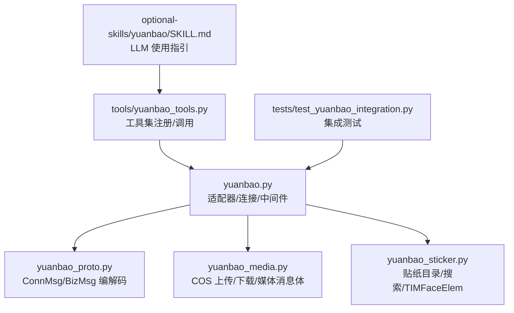
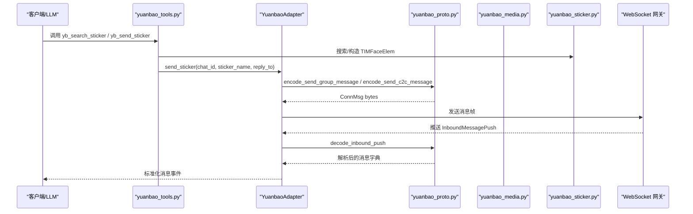
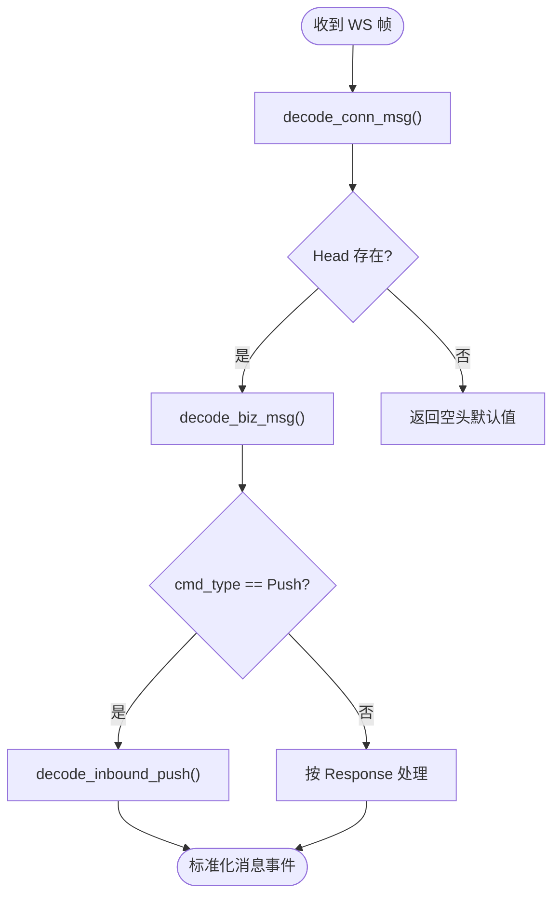
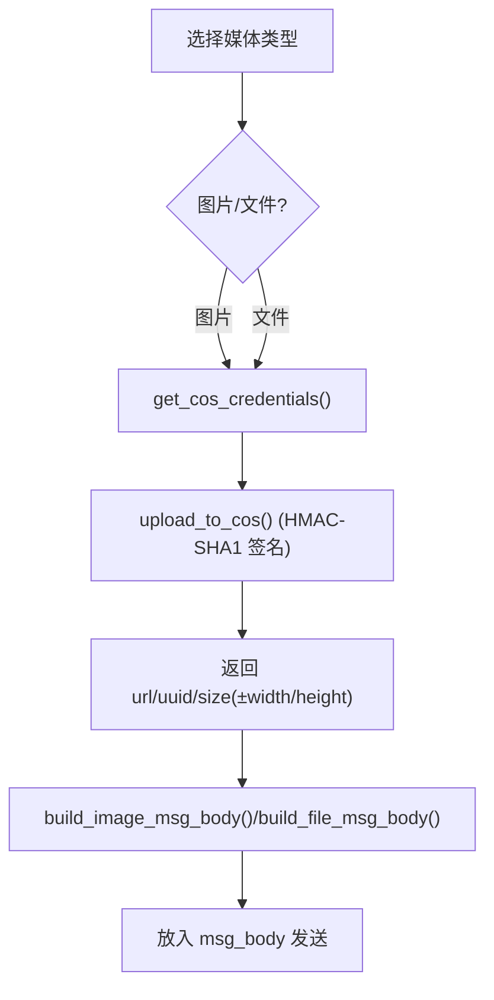
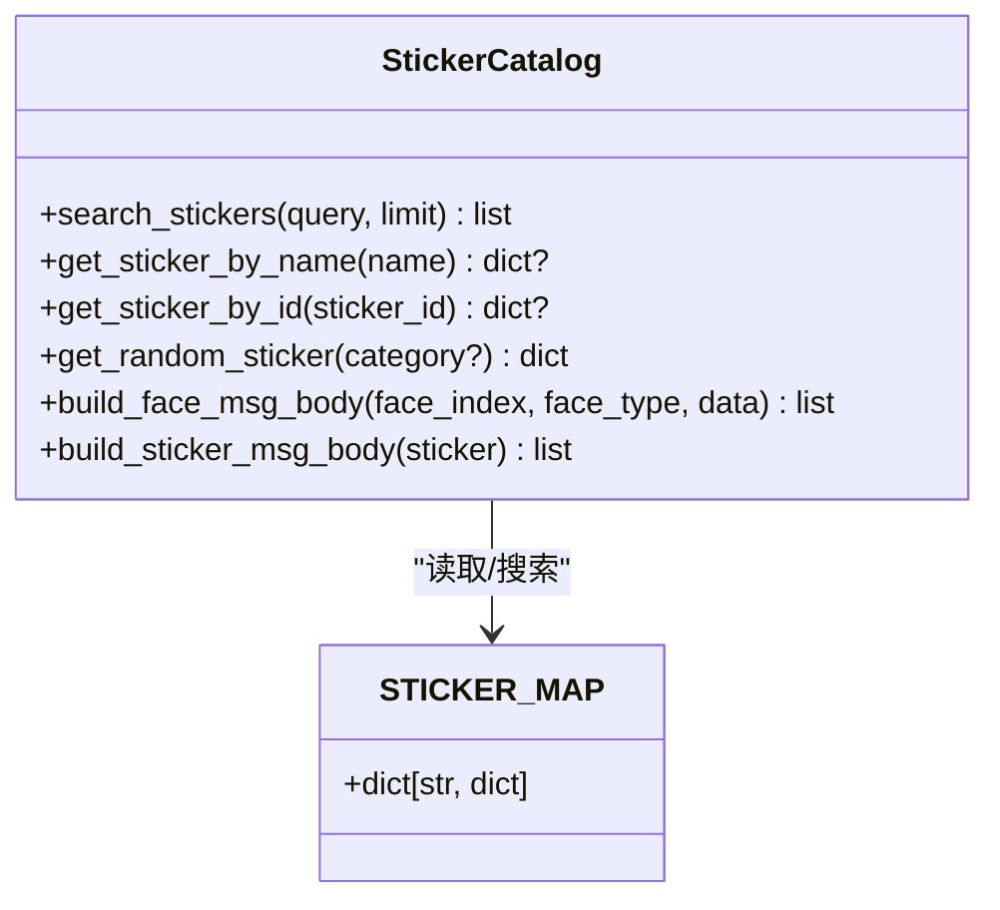
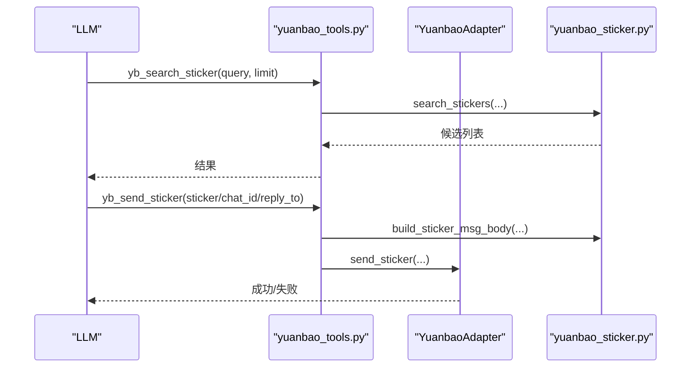
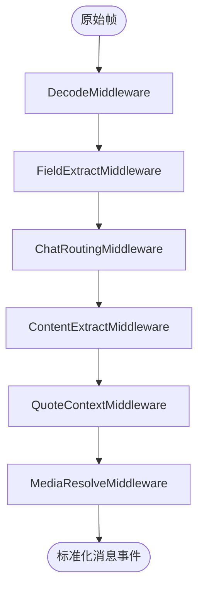
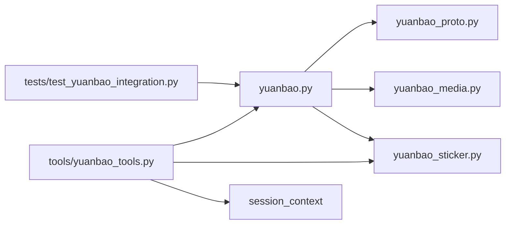

# 元宝集成

<cite>
**本文引用的文件**
- [gateway/platforms/yuanbao.py](file://gateway/platforms/yuanbao.py)
- [gateway/platforms/yuanbao_proto.py](file://gateway/platforms/yuanbao_proto.py)
- [gateway/platforms/yuanbao_media.py](file://gateway/platforms/yuanbao_media.py)
- [gateway/platforms/yuanbao_sticker.py](file://gateway/platforms/yuanbao_sticker.py)
- [tools/yuanbao_tools.py](file://tools/yuanbao_tools.py)
- [optional-skills/yuanbao/SKILL.md](file://optional-skills/yuanbao/SKILL.md)
- [tests/test_yuanbao_integration.py](file://tests/test_yuanbao_integration.py)
</cite>

## 目录
1. [简介](#简介)
2. [项目结构](#项目结构)
3. [核心组件](#核心组件)
4. [架构总览](#架构总览)
5. [详细组件分析](#详细组件分析)
6. [依赖关系分析](#依赖关系分析)
7. [性能与传输优化](#性能与传输优化)
8. [故障排查指南](#故障排查指南)
9. [结论](#结论)
10. [附录：协议规范、API 参考与集成示例](#附录协议规范api-参考与集成示例)

## 简介
本文件面向元宝平台（Yuanbao）的集成与二次开发，系统性说明元宝协议的实现、消息编解码、多媒体数据处理、贴纸系统（TIMFaceElem）、表情符号与动态内容支持，并覆盖协议版本兼容、数据压缩、传输优化与安全考虑。文档同时提供协议规范摘要、API 参考与集成示例，帮助开发者快速接入元宝平台的群聊、私信、媒体与贴纸能力。

## 项目结构
元宝相关代码主要分布在 gateway/platforms 与 tools 两个层次：
- gateway/platforms/yuanbao.py：元宝适配器主实现，负责连接管理、认证、心跳、入站/出站消息处理、Markdown 分块、中间件管道等。
- gateway/platforms/yuanbao_proto.py：纯 Python 实现的 WebSocket 协议编解码（ConnMsg/BizMsg），不依赖第三方 protobuf 库。
- gateway/platforms/yuanbao_media.py：COS 上传、URL 下载、图片尺寸解析、TIM 媒体消息体构建。
- gateway/platforms/yuanbao_sticker.py：内置贴纸目录、模糊搜索、TIMFaceElem 消息体构造。
- tools/yuanbao_tools.py：对外暴露的工具集（群组信息、成员查询、DM、贴纸搜索与发送）。
- optional-skills/yuanbao/SKILL.md：面向 LLM 的使用技能说明（@提及、DM、工具使用流程）。
- tests/test_yuanbao_integration.py：集成测试，验证适配器初始化、注册、proto round-trip、Markdown 分块、工具集注册等。

**图示来源**
- [gateway/platforms/yuanbao.py:1-120](file://gateway/platforms/yuanbao.py#L1-L120)
- [gateway/platforms/yuanbao_proto.py:1-120](file://gateway/platforms/yuanbao_proto.py#L1-L120)
- [gateway/platforms/yuanbao_media.py:1-120](file://gateway/platforms/yuanbao_media.py#L1-L120)
- [gateway/platforms/yuanbao_sticker.py:1-60](file://gateway/platforms/yuanbao_sticker.py#L1-L60)
- [tools/yuanbao_tools.py:1-50](file://tools/yuanbao_tools.py#L1-L50)
- [optional-skills/yuanbao/SKILL.md:1-30](file://optional-skills/yuanbao/SKILL.md#L1-L30)
- [tests/test_yuanbao_integration.py:1-60](file://tests/test_yuanbao_integration.py#L1-L60)

**章节来源**
- [gateway/platforms/yuanbao.py:1-120](file://gateway/platforms/yuanbao.py#L1-L120)
- [gateway/platforms/yuanbao_proto.py:1-120](file://gateway/platforms/yuanbao_proto.py#L1-L120)
- [gateway/platforms/yuanbao_media.py:1-120](file://gateway/platforms/yuanbao_media.py#L1-L120)
- [gateway/platforms/yuanbao_sticker.py:1-60](file://gateway/platforms/yuanbao_sticker.py#L1-L60)
- [tools/yuanbao_tools.py:1-50](file://tools/yuanbao_tools.py#L1-L50)
- [optional-skills/yuanbao/SKILL.md:1-30](file://optional-skills/yuanbao/SKILL.md#L1-L30)
- [tests/test_yuanbao_integration.py:1-60](file://tests/test_yuanbao_integration.py#L1-L60)

## 核心组件
- 适配器与连接管理：YuanbaoAdapter 负责 WebSocket 连接、认证（AUTH_BIND）、心跳、重连、入站消息分发与出站发送。
- 协议编解码：yuanbao_proto.py 提供 ConnMsg/BizMsg 的 varint/protobuf wire-format 编解码，以及 InboundMessagePush 解析。
- 媒体处理：yuanbao_media.py 提供 COS 临时凭证获取、HMAC-SHA1 签名上传、URL 下载（含 SSRF 防护）、图片尺寸解析与 TIM 媒体消息体构建。
- 贴纸系统：yuanbao_sticker.py 维护内置贴纸目录，支持模糊搜索与 TIMFaceElem 消息体构造。
- 工具集：tools/yuanbao_tools.py 暴露群组信息查询、成员列表、DM 发送、贴纸搜索与发送等工具，供 LLM 调用。
- 中间件管道：InboundPipeline 以洋葱模型组织入站消息处理（解码、字段提取、路由、内容提取、引用上下文、媒体解析等）。

**章节来源**
- [gateway/platforms/yuanbao.py:193-396](file://gateway/platforms/yuanbao.py#L193-L396)
- [gateway/platforms/yuanbao.py:641-829](file://gateway/platforms/yuanbao.py#L641-L829)
- [gateway/platforms/yuanbao_proto.py:429-476](file://gateway/platforms/yuanbao_proto.py#L429-L476)
- [gateway/platforms/yuanbao_media.py:359-571](file://gateway/platforms/yuanbao_media.py#L359-L571)
- [gateway/platforms/yuanbao_sticker.py:331-559](file://gateway/platforms/yuanbao_sticker.py#L331-L559)
- [tools/yuanbao_tools.py:53-283](file://tools/yuanbao_tools.py#L53-L283)

## 架构总览
元宝平台通过 WebSocket 与腾讯元宝网关通信，采用 ConnMsg 包裹 BizMsg（业务层 protobuf）。适配器负责连接生命周期、认证、心跳、入站消息解析与出站消息封装；媒体资源通过 COS 上传/下载；贴纸通过 TIMFaceElem 表达。

**图示来源**
- [tools/yuanbao_tools.py:172-283](file://tools/yuanbao_tools.py#L172-L283)
- [gateway/platforms/yuanbao_proto.py:429-476](file://gateway/platforms/yuanbao_proto.py#L429-L476)
- [gateway/platforms/yuanbao_proto.py:674-746](file://gateway/platforms/yuanbao_proto.py#L674-L746)
- [gateway/platforms/yuanbao_sticker.py:511-559](file://gateway/platforms/yuanbao_sticker.py#L511-L559)

## 详细组件分析

### 协议编解码（ConnMsg/BizMsg）
- 编解码方式：手写 varint/protobuf wire-format，避免引入第三方 protobuf 库，确保轻量与可控。
- ConnMsg 层：包含 Head（cmd_type、cmd、seq_no、msg_id、module、need_ack、status）与 data（业务 payload）。
- BizMsg 层：将业务 body 包装为 ConnMsg，head.cmd=method，head.module=service。
- 入站消息：decode_inbound_push 解析 InboundMessagePush，提取 msg_body、trace_id、recall_msg_seq_list 等。

**图示来源**
- [gateway/platforms/yuanbao_proto.py:335-386](file://gateway/platforms/yuanbao_proto.py#L335-L386)
- [gateway/platforms/yuanbao_proto.py:429-476](file://gateway/platforms/yuanbao_proto.py#L429-L476)
- [gateway/platforms/yuanbao_proto.py:674-746](file://gateway/platforms/yuanbao_proto.py#L674-L746)

**章节来源**
- [gateway/platforms/yuanbao_proto.py:1-120](file://gateway/platforms/yuanbao_proto.py#L1-L120)
- [gateway/platforms/yuanbao_proto.py:335-386](file://gateway/platforms/yuanbao_proto.py#L335-L386)
- [gateway/platforms/yuanbao_proto.py:429-476](file://gateway/platforms/yuanbao_proto.py#L429-L476)
- [gateway/platforms/yuanbao_proto.py:674-746](file://gateway/platforms/yuanbao_proto.py#L674-L746)

### 多媒体数据处理（COS 上传/下载与 TIM 消息体）
- COS 上传流程：调用 genUploadInfo 获取临时凭证，使用 HMAC-SHA1 签名构建 Authorization 头，HTTP PUT 上传到 COS。
- URL 下载：SSRF 防护（拒绝私有/内部地址，校验每次重定向），流式读取并限制大小。
- 图片尺寸解析：无需 Pillow，直接解析 PNG/JPEG/GIF/WebP 头部获取宽高。
- TIM 消息体：build_image_msg_body、build_file_msg_body 生成标准 TIMImageElem/TIMFileElem。

**图示来源**
- [gateway/platforms/yuanbao_media.py:359-571](file://gateway/platforms/yuanbao_media.py#L359-L571)
- [gateway/platforms/yuanbao_media.py:575-654](file://gateway/platforms/yuanbao_media.py#L575-L654)

**章节来源**
- [gateway/platforms/yuanbao_media.py:202-271](file://gateway/platforms/yuanbao_media.py#L202-L271)
- [gateway/platforms/yuanbao_media.py:359-571](file://gateway/platforms/yuanbao_media.py#L359-L571)
- [gateway/platforms/yuanbao_media.py:575-654](file://gateway/platforms/yuanbao_media.py#L575-L654)

### 贴纸系统与表情符号（TIMFaceElem）
- 内置贴纸目录：STICKER_MAP 维护贴纸元数据（sticker_id、package_id、name、description、width、height、formats）。
- 模糊搜索：综合 name/description/id 的多维评分（子串、字符多重集覆盖、bigram Jaccard、最长子序列比例）。
- 消息体构造：build_face_msg_body/build_sticker_msg_body 生成 TIMFaceElem，data 字段携带 JSON 元数据。

**图示来源**
- [gateway/platforms/yuanbao_sticker.py:32-328](file://gateway/platforms/yuanbao_sticker.py#L32-L328)
- [gateway/platforms/yuanbao_sticker.py:331-559](file://gateway/platforms/yuanbao_sticker.py#L331-L559)

**章节来源**
- [gateway/platforms/yuanbao_sticker.py:331-559](file://gateway/platforms/yuanbao_sticker.py#L331-L559)

### 工具集与 LLM 集成
- 工具注册：yb_query_group_info、yb_query_group_members、yb_send_dm、yb_search_sticker、yb_send_sticker。
- 工作流：LLM 先搜索贴纸再发送；@提及需先查询成员获取精确昵称；DM 支持文本与媒体附件。
- 技能文档：SKILL.md 明确“回复即消息”、“自动 @提及”、“不要建议用户手动操作”。

**图示来源**
- [tools/yuanbao_tools.py:172-283](file://tools/yuanbao_tools.py#L172-L283)
- [tools/yuanbao_tools.py:485-497](file://tools/yuanbao_tools.py#L485-L497)
- [gateway/platforms/yuanbao_sticker.py:511-559](file://gateway/platforms/yuanbao_sticker.py#L511-L559)
- [optional-skills/yuanbao/SKILL.md:12-56](file://optional-skills/yuanbao/SKILL.md#L12-L56)

**章节来源**
- [tools/yuanbao_tools.py:502-737](file://tools/yuanbao_tools.py#L502-L737)
- [optional-skills/yuanbao/SKILL.md:12-89](file://optional-skills/yuanbao/SKILL.md#L12-L89)

### 入站中间件管道（InboundPipeline）
- 洋葱模型：DecodeMiddleware → FieldExtractMiddleware → ChatRoutingMiddleware → ContentExtractMiddleware → QuoteContextMiddleware → MediaResolveMiddleware 等。
- 可插拔：支持 use/use_before/use_after/remove 动态组合，when 条件守卫。
- 上下文对象：InboundContext 贯穿各阶段，累积消息元数据与媒体引用。

**图示来源**
- [gateway/platforms/yuanbao.py:641-829](file://gateway/platforms/yuanbao.py#L641-L829)
- [gateway/platforms/yuanbao.py:830-899](file://gateway/platforms/yuanbao.py#L830-L899)

**章节来源**
- [gateway/platforms/yuanbao.py:641-829](file://gateway/platforms/yuanbao.py#L641-L829)
- [gateway/platforms/yuanbao.py:830-899](file://gateway/platforms/yuanbao.py#L830-L899)

## 依赖关系分析
- yuanbao.py 依赖：
  - yuanbao_proto.py：ConnMsg/BizMsg 编解码、入站消息解析。
  - yuanbao_media.py：COS 上传/下载、媒体消息体构建。
  - yuanbao_sticker.py：贴纸目录与消息体构造。
  - BasePlatformAdapter：基础平台适配能力（消息去重、缓存等）。
- tools/yuanbao_tools.py 依赖：
  - gateway.platforms.yuanbao：活跃适配器实例。
  - gateway.platforms.yuanbao_sticker：贴纸搜索与构造。
  - gateway.session_context：会话环境（chat_id）。
- 测试覆盖：test_yuanbao_integration.py 验证适配器初始化、注册、proto round-trip、Markdown 分块、工具集注册。

**图示来源**
- [gateway/platforms/yuanbao.py:54-99](file://gateway/platforms/yuanbao.py#L54-L99)
- [tools/yuanbao_tools.py:28-35](file://tools/yuanbao_tools.py#L28-L35)
- [tools/yuanbao_tools.py:224-229](file://tools/yuanbao_tools.py#L224-L229)
- [tests/test_yuanbao_integration.py:153-179](file://tests/test_yuanbao_integration.py#L153-L179)

**章节来源**
- [gateway/platforms/yuanbao.py:54-99](file://gateway/platforms/yuanbao.py#L54-L99)
- [tools/yuanbao_tools.py:28-35](file://tools/yuanbao_tools.py#L28-L35)
- [tools/yuanbao_tools.py:224-229](file://tools/yuanbao_tools.py#L224-L229)
- [tests/test_yuanbao_integration.py:153-179](file://tests/test_yuanbao_integration.py#L153-L179)

## 性能与传输优化
- 心跳与重连：HEARTBEAT_INTERVAL_SECONDS=30s，连续错过 HEARTBEAT_TIMEOUT_THRESHOLD=2 次触发重连；MAX_RECONNECT_ATTEMPTS=100；WS_CLOSE_TIMEOUT_S=1.0 防止关闭握手阻塞。
- 慢响应提示：SLOW_RESPONSE_TIMEOUT_S=120s 推送等待消息，提升用户体验。
- Markdown 分块：MarkdownProcessor.chunk_markdown_text 保证段落原子性，避免代码块/表格被截断。
- 媒体并发：OBSERVED_MEDIA_BACKFILL_MAX_RESOLVE_PER_TURN=12，_DEFAULT_RESOLVE_CONCURRENCY=6，平衡首 token 延迟与后端压力。
- 安全下载：download_url 使用 SSRF 防护，拒绝私有/内部地址，校验重定向链。

[本节为通用指导，不直接分析具体文件]

## 故障排查指南
- 认证失败：AUTH_FAILED_CODES={4001,4002,4003} 永久失败需重新签名；AUTH_RETRYABLE_CODES={4010,4011,4099} 可重试。
- 重连保护：_reconnecting 标志防止并发重连；schedule_reconnect 在 _running=False 或已重连时跳过。
- 聊天锁驱逐：OutboundManager._chat_locks 使用有序字典，容量满时驱逐最久未访问且未持有的锁。
- 工具错误：yuanbao_tools.py 中各方法捕获异常并返回 success=False 与 error 信息，便于上层处理。

**章节来源**
- [gateway/platforms/yuanbao.py:120-158](file://gateway/platforms/yuanbao.py#L120-L158)
- [tests/test_yuanbao_integration.py:247-319](file://tests/test_yuanbao_integration.py#L247-L319)
- [tools/yuanbao_tools.py:53-283](file://tools/yuanbao_tools.py#L53-L283)

## 结论
元宝平台通过清晰的适配器分层、轻量协议编解码、健壮的媒体处理与贴纸系统，提供了完整的群聊、私信与多媒体交互能力。中间件管道使入站消息处理灵活可扩展，工具集简化了 LLM 集成。结合心跳重连、慢响应提示、Markdown 分块与 SSRF 防护，系统在稳定性与安全性方面具备良好保障。

[本节为总结，不直接分析具体文件]

## 附录：协议规范、API 参考与集成示例

### 协议规范摘要
- 连接层：ConnMsg（Head + data），cmd_type 枚举（Request/Response/Push/PushAck）。
- 业务层：BizMsg 通过 service/method 标识业务，body 为标准 protobuf。
- 入站消息：InboundMessagePush 包含 msg_body（TIMTextElem/TIMImageElem/TIMFileElem/TIMFaceElem 等）。
- 贴纸消息：TIMFaceElem，index=0，data 为 JSON 元数据（sticker_id/package_id/name 等）。

**章节来源**
- [gateway/platforms/yuanbao_proto.py:45-98](file://gateway/platforms/yuanbao_proto.py#L45-L98)
- [gateway/platforms/yuanbao_proto.py:674-746](file://gateway/platforms/yuanbao_proto.py#L674-L746)
- [gateway/platforms/yuanbao_sticker.py:6-17](file://gateway/platforms/yuanbao_sticker.py#L6-L17)

### API 参考（工具集）
- yb_query_group_info(group_code)：查询群组基本信息（名称、群主、成员数）。
- yb_query_group_members(group_code, action, name, mention)：查询成员（find/list_bots/list_all）。
- yb_send_dm(group_code, name, message, user_id, media_files)：发送私信（支持文本与媒体）。
- yb_search_sticker(query, limit)：搜索内置贴纸（返回 sticker_id/name/description/package_id）。
- yb_send_sticker(sticker, chat_id, reply_to)：发送贴纸（TIMFaceElem）。

**章节来源**
- [tools/yuanbao_tools.py:53-283](file://tools/yuanbao_tools.py#L53-L283)
- [tools/yuanbao_tools.py:502-737](file://tools/yuanbao_tools.py#L502-L737)

### 集成示例
- 贴纸发送流程：LLM 调用 yb_search_sticker 获取候选，再调用 yb_send_sticker 发送。
- DM 发送流程：先通过 yb_query_group_members 查找目标用户，再调用 yb_send_dm 发送文本/媒体。
- 群组 @提及：调用 yb_query_group_members(action="find", mention=true)，在回复中使用 @nickname。

**章节来源**
- [optional-skills/yuanbao/SKILL.md:22-89](file://optional-skills/yuanbao/SKILL.md#L22-L89)
- [tools/yuanbao_tools.py:172-283](file://tools/yuanbao_tools.py#L172-L283)