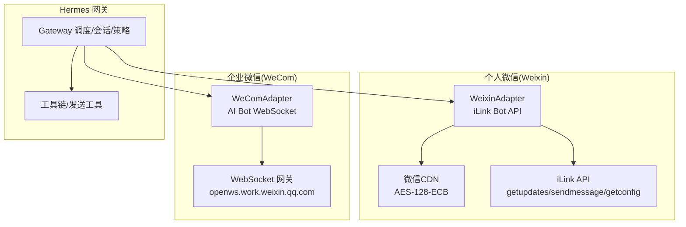
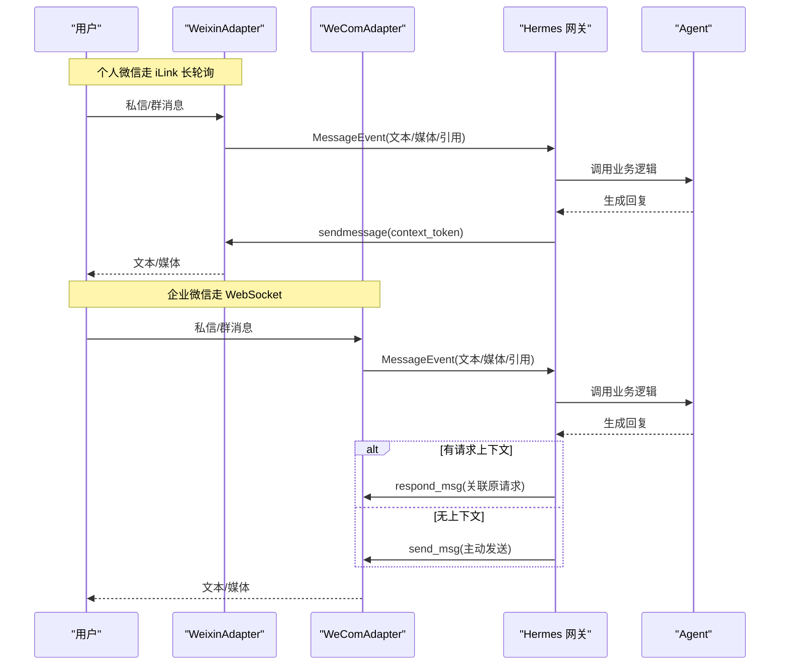
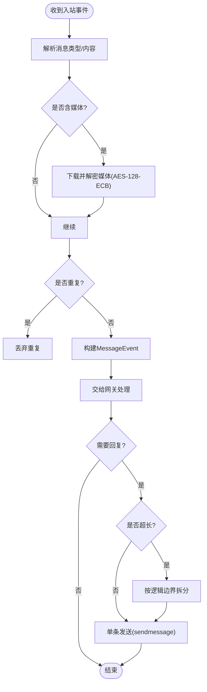
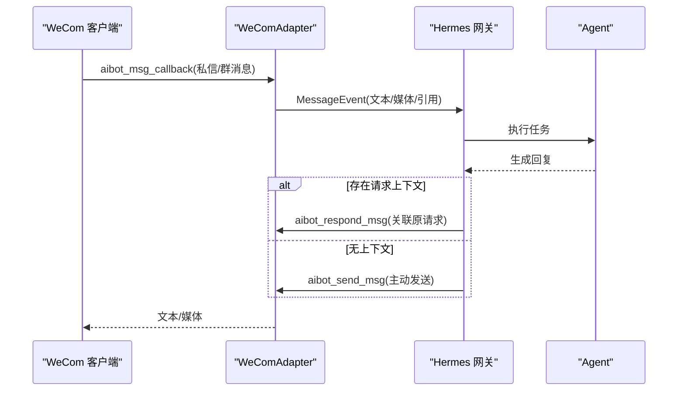
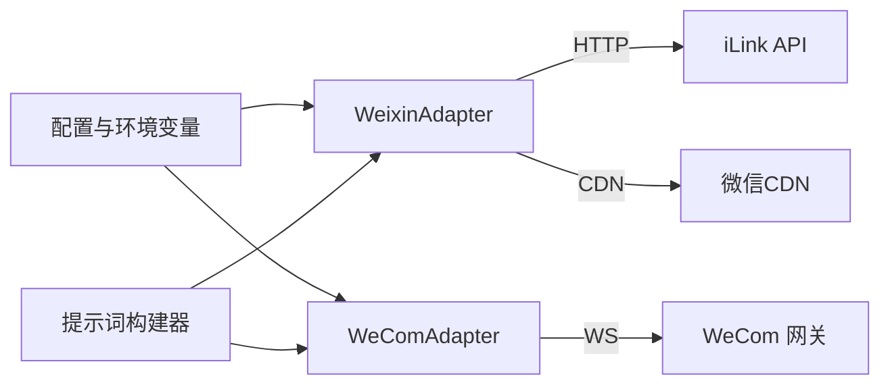

# 微信集成

<cite>
**本文引用的文件**
- [gateway/platforms/weixin.py](file://gateway/platforms/weixin.py)
- [plugins/platforms/wecom/adapter.py](file://plugins/platforms/wecom/adapter.py)
- [website/docs/user-guide/messaging/weixin.md](file://website/docs/user-guide/messaging/weixin.md)
- [website/i18n/zh-Hans/docusaurus-plugin-content-docs/current/user-guide/messaging/weixin.md](file://website/i18n/zh-Hans/docusaurus-plugin-content-docs/current/user-guide/messaging/weixin.md)
- [website/docs/user-guide/messaging/wecom.md](file://website/docs/user-guide/messaging/wecom.md)
- [website/i18n/zh-Hans/docusaurus-plugin-content-docs/current/user-guide/messaging/wecom.md](file://website/i18n/zh-Hans/docusaurus-plugin-content-docs/current/user-guide/messaging/wecom.md)
- [tests/gateway/test_weixin.py](file://tests/gateway/test_weixin.py)
- [tests/gateway/test_wecom.py](file://tests/gateway/test_wecom.py)
- [gateway/config.py](file://gateway/config.py)
- [agent/prompt_builder.py](file://agent/prompt_builder.py)
</cite>

## 目录
1. [简介](#简介)
2. [项目结构](#项目结构)
3. [核心组件](#核心组件)
4. [架构总览](#架构总览)
5. [详细组件分析](#详细组件分析)
6. [依赖关系分析](#依赖关系分析)
7. [性能与可靠性](#性能与可靠性)
8. [安全、合规与数据保护](#安全合规与数据保护)
9. [配置与开发指南](#配置与开发指南)
10. [故障排查](#故障排查)
11. [结论](#结论)

## 简介
本文件面向微信平台集成的完整实现，覆盖微信公众号（个人微信 iLink Bot）与企业微信（WeCom AI Bot）两类接入方式。文档说明消息收发机制、用户身份验证、媒体传输、上下文保持、长轮询与 WebSocket 连接管理、消息分块与去重、以及敏感信息与数据安全实践。同时提供完整的配置流程与开发指南，帮助快速落地并稳定运行。

## 项目结构
微信相关能力由两个平台适配器组成：
- 个人微信（Weixin）：通过 iLink Bot API 的 HTTP 长轮询进行消息收发，使用 AES-128-ECB 加密 CDN 传输媒体。
- 企业微信（WeCom）：通过 AI Bot WebSocket 网关建立持久连接，支持双向消息、回复关联与分块上传。

图表来源
- [gateway/platforms/weixin.py:1-120](file://gateway/platforms/weixin.py#L1-L120)
- [plugins/platforms/wecom/adapter.py:1-130](file://plugins/platforms/wecom/adapter.py#L1-L130)

章节来源
- [gateway/platforms/weixin.py:1-120](file://gateway/platforms/weixin.py#L1-L120)
- [plugins/platforms/wecom/adapter.py:1-130](file://plugins/platforms/wecom/adapter.py#L1-L130)

## 核心组件
- WeixinAdapter（个人微信）
  - 基于 iLink Bot API 的长轮询 getupdates 拉取消息；sendmessage 发送文本；getconfig 获取 typing_ticket；getuploadurl + CDN 上传媒体。
  - 维护 context_token 磁盘缓存，保证跨重启的对话连续性。
  - 支持 Markdown 保留、行宽折行、消息分块与去重。
- WeComAdapter（企业微信）
  - 基于 WebSocket 的 aibot_subscribe/aibot_msg_callback/aibot_send_msg/aibot_respond_msg 等命令完成认证、收发消息与回复关联。
  - 支持图片/文件/语音/视频的分块上传与自动降级；入站媒体可解密。
  - 文本消息聚合（处理客户端 4000 字符切分），心跳保活与指数退避重连。

章节来源
- [gateway/platforms/weixin.py:400-684](file://gateway/platforms/weixin.py#L400-L684)
- [plugins/platforms/wecom/adapter.py:167-471](file://plugins/platforms/wecom/adapter.py#L167-L471)

## 架构总览
下图展示从用户到 Agent 的端到端路径，包括鉴权、消息路由、媒体处理与出站响应。

图表来源
- [gateway/platforms/weixin.py:447-502](file://gateway/platforms/weixin.py#L447-L502)
- [plugins/platforms/wecom/adapter.py:312-471](file://plugins/platforms/wecom/adapter.py#L312-L471)

## 详细组件分析

### 个人微信（Weixin）适配器
- 连接与消息流
  - 长轮询 getupdates：超时 35 秒，返回 msgs 列表与新的同步缓冲 get_updates_buf。
  - 发送文本 sendmessage：必须携带 context_token 以维持对话上下文。
  - 获取 typing_ticket：通过 getconfig 获取票据，用于显示“正在输入”。
  - 媒体上传：getuploadurl 获取上传地址，POST 密文至 CDN，再在消息中附带加密引用。
- 上下文与持久化
  - ContextTokenStore：按 account_id:user_id 维度持久化 context_token，启动时恢复，入站更新，出站自动附加。
- 格式与分块
  - 保留 Markdown（标题、表格、代码块），对超长行进行复制友好的折行。
  - 超过 4000 字符的消息在逻辑边界拆分，代码围栏尽量保持完整。
- 去重与重试
  - 入站消息 ID 去重窗口 5 分钟。
  - 瞬时错误重试，会话过期（errcode=-14）暂停并重试。

图表来源
- [gateway/platforms/weixin.py:447-502](file://gateway/platforms/weixin.py#L447-L502)
- [gateway/platforms/weixin.py:661-684](file://gateway/platforms/weixin.py#L661-L684)
- [gateway/platforms/weixin.py:298-346](file://gateway/platforms/weixin.py#L298-L346)

章节来源
- [gateway/platforms/weixin.py:400-684](file://gateway/platforms/weixin.py#L400-L684)
- [gateway/platforms/weixin.py:298-346](file://gateway/platforms/weixin.py#L298-L346)
- [tests/gateway/test_weixin.py:30-124](file://tests/gateway/test_weixin.py#L30-L124)

### 企业微信（WeCom）适配器
- 连接与认证
  - 建立 WebSocket 连接，发送 aibot_subscribe 携带 bot_id 与 secret 完成认证。
  - 心跳每 30 秒发送一次应用层 ping，断线指数退避重连。
- 消息收发
  - 入站回调：aibot_msg_callback / aibot_callback，解析文本、混合消息、引用与媒体。
  - 出站：优先使用 aibot_respond_msg 关联原请求；若上下文失效则回退为 aibot_send_msg。
  - 文本聚合：针对客户端 4000 字符切分，合并为单条事件后再派发。
- 媒体上传
  - 分三步协议：init → chunk → finish，默认 512KB 分块，最大 100 块。
  - 自动降级：超出原生类型限制但低于绝对上限时作为文件附件发送。
- 访问控制
  - DM/群组策略：open/allowlist/disabled/pairing，支持 per-group 白名单。

图表来源
- [plugins/platforms/wecom/adapter.py:312-471](file://plugins/platforms/wecom/adapter.py#L312-L471)
- [plugins/platforms/wecom/adapter.py:523-599](file://plugins/platforms/wecom/adapter.py#L523-L599)

章节来源
- [plugins/platforms/wecom/adapter.py:167-471](file://plugins/platforms/wecom/adapter.py#L167-L471)
- [plugins/platforms/wecom/adapter.py:523-800](file://plugins/platforms/wecom/adapter.py#L523-L800)
- [tests/gateway/test_wecom.py:33-140](file://tests/gateway/test_wecom.py#L33-L140)

## 依赖关系分析
- 运行时依赖
  - Weixin：aiohttp、cryptography（可选，用于 AES 加解密）。
  - WeCom：aiohttp、httpx（可选，用于 HTTP 客户端），cryptography（用于部分入站媒体解密）。
- 配置与环境变量
  - Weixin：WEIXIN_ACCOUNT_ID、WEIXIN_TOKEN、WEIXIN_BASE_URL、WEIXIN_CDN_BASE_URL、策略类环境变量。
  - WeCom：WECOM_BOT_ID、WECOM_SECRET、WECOM_WEBSOCKET_URL、策略类环境变量。
- 提示词与平台识别
  - 提示词构建器包含 Weixin/WeCom 的平台上下文提示，便于模型输出适配。

图表来源
- [gateway/config.py:2332-2348](file://gateway/config.py#L2332-L2348)
- [agent/prompt_builder.py:880-889](file://agent/prompt_builder.py#L880-L889)

章节来源
- [gateway/config.py:2332-2348](file://gateway/config.py#L2332-L2348)
- [agent/prompt_builder.py:880-889](file://agent/prompt_builder.py#L880-L889)

## 性能与可靠性
- 长轮询与心跳
  - Weixin：getupdates 超时 35 秒，超时即重新轮询；typing ticket 缓存 10 分钟。
  - WeCom：心跳间隔 30 秒；断线后指数退避重连（2/5/10/30/60 秒）。
- 消息分块与节流
  - Weixin：超过 4000 字符按逻辑边界拆分；块间延迟约 0.3 秒避免触发频率限制。
  - WeCom：客户端 4000 字符切分的文本会聚合后再派发；文件上传分块 512KB。
- 去重与幂等
  - Weixin：消息 ID 去重窗口 5 分钟。
  - WeCom：消息 ID 去重，最大缓存 1000 条。
- 资源与连接
  - aiohttp 连接 keepalive 时间收紧，减少 CLOSE_WAIT 残留；SSRF 防护限制媒体 URL 域名白名单。

章节来源
- [gateway/platforms/weixin.py:105-116](file://gateway/platforms/weixin.py#L105-L116)
- [gateway/platforms/weixin.py:624-654](file://gateway/platforms/weixin.py#L624-L654)
- [plugins/platforms/wecom/adapter.py:115-130](file://plugins/platforms/wecom/adapter.py#L115-L130)
- [plugins/platforms/wecom/adapter.py:365-424](file://plugins/platforms/wecom/adapter.py#L365-L424)

## 安全、合规与数据保护
- 敏感信息保护
  - 凭据读取采用作用域感知的方式，避免跨 profile 泄露；异常输出中的敏感片段会被脱敏。
- 网络安全
  - Weixin 出站媒体 URL 仅允许已知微信 CDN 域名，防止 SSRF。
  - WeCom 使用 HTTPS/WSS 通道，配合 SSFR 重定向守卫。
- 数据最小化与本地缓存
  - 媒体下载后本地缓存供 Agent 处理，必要时清理；context token 按账号+对话方持久化，权限隔离。
- 合规性建议
  - 明确 DM/群组访问策略，生产环境建议使用 allowlist。
  - 对入站内容进行必要校验与过滤（如敏感词、违规内容），结合业务侧审核流程。
  - 日志中避免记录敏感字段，统一脱敏策略。

章节来源
- [gateway/platforms/weixin.py:624-654](file://gateway/platforms/weixin.py#L624-L654)
- [plugins/platforms/wecom/adapter.py:243-254](file://plugins/platforms/wecom/adapter.py#L243-L254)
- [tests/tools/test_terminal_error_redaction.py:41-45](file://tests/tools/test_terminal_error_redaction.py#L41-L45)

## 配置与开发指南

### 个人微信（Weixin）配置
- 前置条件
  - 安装 aiohttp 与 cryptography；如需终端二维码渲染，安装 messaging 扩展。
- 设置步骤
  - 运行交互式向导 hermes gateway setup，选择 Weixin，扫码登录并保存凭据。
  - 至少配置 WEIXIN_ACCOUNT_ID；可选配置 WEIXIN_DM_POLICY、WEIXIN_ALLOWED_USERS、WEIXIN_HOME_CHANNEL 等。
- 关键选项
  - base_url、cdn_base_url、dm_policy、group_policy、allow_from、group_allow_from、split_multiline_messages、text_batch_delay_seconds 等。
- 功能要点
  - 长轮询接收、Markdown 保留、媒体 AES-128-ECB 加解密、上下文 token 持久化、消息分块与去重。

章节来源
- [website/docs/user-guide/messaging/weixin.md:26-110](file://website/docs/user-guide/messaging/weixin.md#L26-L110)
- [website/docs/user-guide/messaging/weixin.md:111-186](file://website/docs/user-guide/messaging/weixin.md#L111-L186)
- [website/docs/user-guide/messaging/weixin.md:187-239](file://website/docs/user-guide/messaging/weixin.md#L187-L239)
- [website/docs/user-guide/messaging/weixin.md:240-315](file://website/docs/user-guide/messaging/weixin.md#L240-L315)
- [gateway/platforms/weixin.py:264-346](file://gateway/platforms/weixin.py#L264-L346)

### 企业微信（WeCom）配置
- 前置条件
  - 创建 WeCom AI Bot，获取 Bot ID 与 Secret；安装 aiohttp 与 httpx。
- 设置步骤
  - 推荐扫码创建：hermes gateway setup 选择 WeCom，扫码后自动获取凭据并引导访问控制配置。
  - 手动配置：设置 WECOM_BOT_ID、WECOM_SECRET、WECOM_ALLOWED_USERS、WECOM_HOME_CHANNEL 等。
- 关键选项
  - websocket_url、dm_policy、group_policy、allow_from、group_allow_from、groups（按群白名单）。
- 功能要点
  - WebSocket 双向通信、回复关联、媒体分块上传与自动降级、文本聚合、心跳与重连。

章节来源
- [website/docs/user-guide/messaging/wecom.md:13-119](file://website/docs/user-guide/messaging/wecom.md#L13-L119)
- [website/docs/user-guide/messaging/wecom.md:120-188](file://website/docs/user-guide/messaging/wecom.md#L120-L188)
- [website/docs/user-guide/messaging/wecom.md:189-243](file://website/docs/user-guide/messaging/wecom.md#L189-L243)
- [website/docs/user-guide/messaging/wecom.md:244-283](file://website/docs/user-guide/messaging/wecom.md#L244-L283)
- [plugins/platforms/wecom/adapter.py:167-220](file://plugins/platforms/wecom/adapter.py#L167-L220)

### 模板消息、订阅消息、客服消息
- 当前仓库未提供微信官方模板消息、订阅消息或客服消息的直接封装。
- 建议方案
  - 通过 Hermes 的工具链与平台适配器发送文本/媒体消息，模拟客服交互。
  - 将业务侧的模板/订阅/客服逻辑抽象为工具或服务，由网关调度调用，再通过 Weixin/WeCom 适配器发送结果。
  - 若需严格遵循微信开放平台接口，可在外部服务实现对应 API，再由 Hermes 通过 webhook 或工具调用对接。

[本节为概念性说明，不直接分析具体文件]

## 故障排查
- 个人微信（Weixin）
  - 缺少依赖：安装 aiohttp 与 cryptography。
  - 凭据缺失：运行 setup 完成扫码登录或设置 WEIXIN_TOKEN、WEIXIN_ACCOUNT_ID。
  - 会话过期：errcode=-14，重新扫码登录。
  - 群消息不生效：iLink bot 身份通常不推送普通群事件，属平台限制。
  - 媒体失败：检查网络与 cryptography；确认 CDN 可达。
- 企业微信（WeCom）
  - 凭据错误：invalid secret (errcode=40013)，核对 Bot ID 与 Secret。
  - 连接超时：检查 openws.work.weixin.qq.com 连通性。
  - 群组不响应：检查 group_policy 与 group_allow_from。
  - 媒体解密失败：安装 cryptography。
  - 文件过大：超过 20 MB 绝对限制将被拒绝。

章节来源
- [website/docs/user-guide/messaging/weixin.md:316-334](file://website/docs/user-guide/messaging/weixin.md#L316-L334)
- [website/docs/user-guide/messaging/wecom.md:284-302](file://website/docs/user-guide/messaging/wecom.md#L284-L302)
- [tests/gateway/test_weixin.py:171-199](file://tests/gateway/test_weixin.py#L171-L199)
- [tests/gateway/test_wecom.py:33-104](file://tests/gateway/test_wecom.py#L33-L104)

## 结论
本项目提供了完善的企业微信与个人微信集成能力：WeCom 通过 WebSocket 实现低延迟双向通信与回复关联；Weixin 通过 iLink 长轮询与加密 CDN 实现稳定的消息与媒体传输。两者均具备访问控制、消息去重、分块与重试、上下文持久化等关键特性。对于模板消息、订阅消息与客服消息，可通过工具链与服务编排实现业务级封装。生产部署建议启用严格的访问策略与数据脱敏，确保合规与安全。