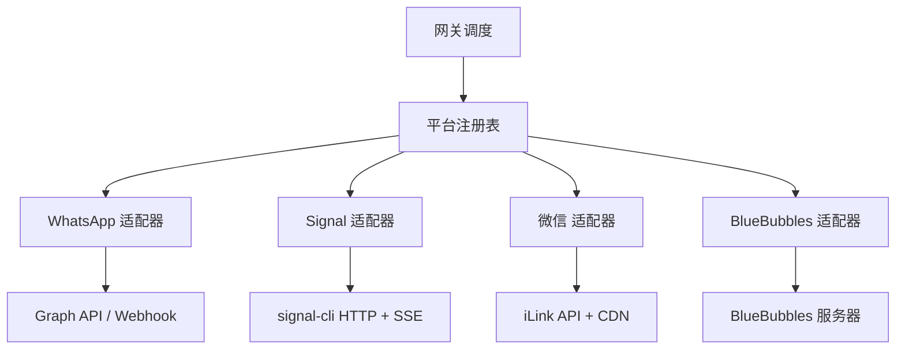
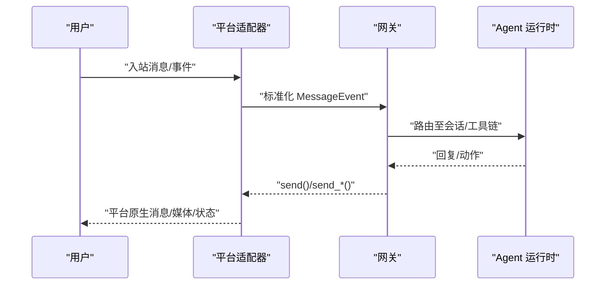
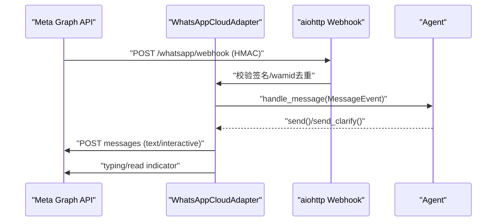
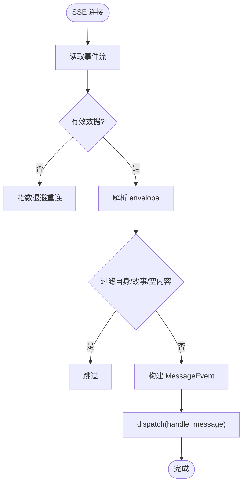
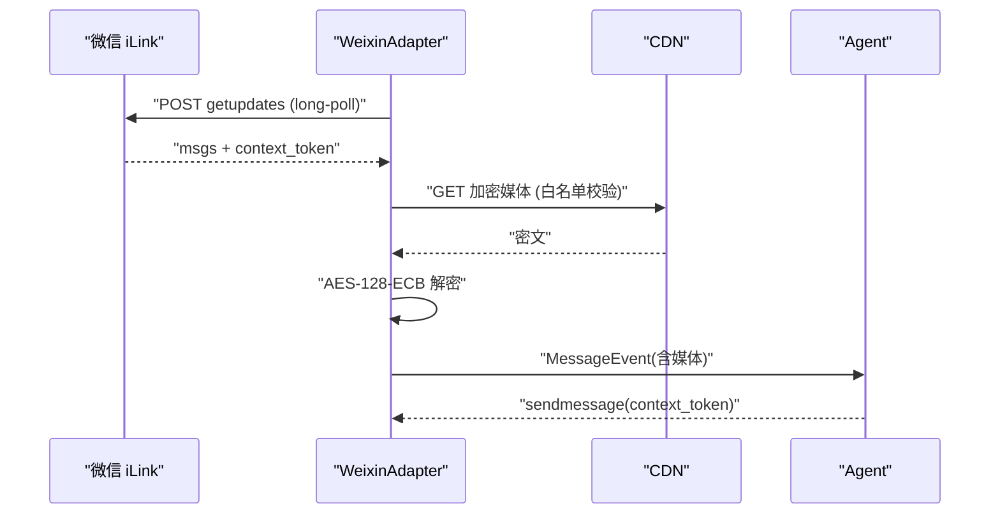
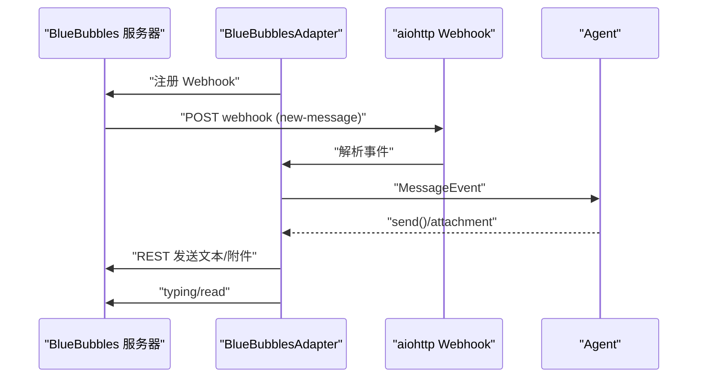
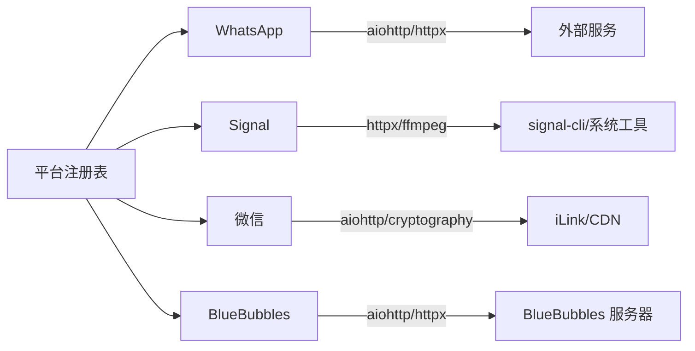

# 通讯平台集成

<cite>
**本文引用的文件**
- [gateway/platforms/base.py](file://gateway/platforms/base.py)
- [gateway/platform_registry.py](file://gateway/platform_registry.py)
- [gateway/platforms/whatsapp_cloud.py](file://gateway/platforms/whatsapp_cloud.py)
- [gateway/platforms/signal.py](file://gateway/platforms/signal.py)
- [gateway/platforms/weixin.py](file://gateway/platforms/weixin.py)
- [gateway/platforms/bluebubbles.py](file://gateway/platforms/bluebubbles.py)
</cite>

## 目录
1. [简介](#简介)
2. [项目结构](#项目结构)
3. [核心组件](#核心组件)
4. [架构总览](#架构总览)
5. [详细组件分析](#详细组件分析)
6. [依赖关系分析](#依赖关系分析)
7. [性能考虑](#性能考虑)
8. [故障排查指南](#故障排查指南)
9. [结论](#结论)
10. [附录](#附录)

## 简介
本文件面向 Hermes Agent 的通讯平台集成，聚焦 WhatsApp Cloud API、Signal、微信（Weixin）、BlueBubbles 四类平台的适配器实现。文档覆盖：
- 认证机制与密钥管理
- 消息入站处理与出站发送
- 媒体文件传输（下载、缓存、上传）
- 状态同步（已读回执、输入指示器、重连与健康检查）
- 平台特定安全、隐私与合规要点
- 连接管理、重连策略与错误恢复

## 项目结构
Hermes 通过统一的平台适配层接入不同通讯服务。所有平台适配器继承自基类接口，并通过平台注册表进行发现与实例化。关键目录与职责：
- gateway/platforms/base.py：定义 BasePlatformAdapter 抽象接口、通用能力（消息分片、媒体大小限制、代理、TTS 输出路径等）
- gateway/platform_registry.py：平台注册表，支持插件式扩展、依赖探测、配置校验与懒加载
- 各平台适配器：
  - whatsapp_cloud.py：WhatsApp Cloud API（Graph API + Webhook）
  - signal.py：Signal（signal-cli HTTP 模式 + SSE 事件流）
  - weixin.py：微信 iLink Bot API（长轮询 getupdates + CDN 加密媒体）
  - bluebubbles.py：BlueBubbles iMessage（本地 REST + Webhook）

图表来源
- [gateway/platform_registry.py:183-381](file://gateway/platform_registry.py#L183-L381)
- [gateway/platforms/whatsapp_cloud.py:203-495](file://gateway/platforms/whatsapp_cloud.py#L203-L495)
- [gateway/platforms/signal.py:253-420](file://gateway/platforms/signal.py#L253-L420)
- [gateway/platforms/weixin.py:447-502](file://gateway/platforms/weixin.py#L447-L502)
- [gateway/platforms/bluebubbles.py:163-322](file://gateway/platforms/bluebubbles.py#L163-L322)

章节来源
- [gateway/platform_registry.py:1-381](file://gateway/platform_registry.py#L1-L381)
- [gateway/platforms/base.py:1-800](file://gateway/platforms/base.py#L1-L800)

## 核心组件
- 平台基类（BasePlatformAdapter）
  - 统一的消息构造、格式化、分片、媒体缓存、代理与超时控制、TTS 输出路径生成、入站媒体大小限制等
- 平台注册表（PlatformRegistry）
  - 延迟加载、依赖探测、配置校验、工厂创建、插件覆盖、独立发送器钩子等
- 平台适配器
  - WhatsApp Cloud：Webhook 接收 + Graph API 发送；HMAC 签名验证；wamid 去重；交互按钮/列表；打字指示器与已读
  - Signal：SSE 事件流接收；JSON-RPC 发送；健康监控与重连；速率限制与批量限速；语音 AAC→M4A 转封装
  - 微信：长轮询 getupdates；context_token 维护；AES-128-ECB 加密 CDN 上传/下载；会话过期与限频回退
  - BlueBubbles：本地 REST 发送；Webhook 注册/注销；聊天 GUID 解析；Tapback 反应；打字/已读

章节来源
- [gateway/platforms/base.py:1-800](file://gateway/platforms/base.py#L1-L800)
- [gateway/platform_registry.py:183-381](file://gateway/platform_registry.py#L183-L381)
- [gateway/platforms/whatsapp_cloud.py:203-800](file://gateway/platforms/whatsapp_cloud.py#L203-L800)
- [gateway/platforms/signal.py:253-800](file://gateway/platforms/signal.py#L253-L800)
- [gateway/platforms/weixin.py:1-800](file://gateway/platforms/weixin.py#L1-L800)
- [gateway/platforms/bluebubbles.py:163-800](file://gateway/platforms/bluebubbles.py#L163-L800)

## 架构总览
下图展示从平台到网关的统一抽象与数据流：

图表来源
- [gateway/platforms/base.py:1-800](file://gateway/platforms/base.py#L1-L800)
- [gateway/platform_registry.py:299-377](file://gateway/platform_registry.py#L299-L377)

## 详细组件分析

### WhatsApp Cloud API 适配器
- 认证与配置
  - 必需：电话号码 ID、访问令牌
  - 可选：应用 ID/密钥（HMAC 验证）、WABA ID、verify token、Webhook 主机/端口/路径、API 版本
- 入站处理
  - aiohttp 内置 Webhook 服务器，限制请求体大小
  - HMAC 签名校验（X-Hub-Signature-256），wamid 去重缓存（FIFO 上限）
  - 解析文本、媒体、交互按钮/列表点击，映射为 MessageEvent
- 出站发送
  - Graph API POST 发送文本，支持引用上下文
  - 交互消息（按钮/列表）用于澄清、审批、确认等
  - 打字指示器与已读：调用 Graph API 标记最新 wamid
- 媒体传输
  - 按类型限制大小（图片/视频/音频/文档/贴纸）
  - 入站媒体下载到 hermes 目录，按 MIME 推断扩展名
- 安全与合规
  - HMAC 校验防伪造；verify token 用于订阅握手
  - 白名单/群组策略可配置；DM 策略默认保守
- 连接管理与重连
  - connect() 启动 Webhook 服务并标记已连接；disconnect() 清理 runner 与 httpx 客户端
  - 心跳/健康端点便于外部探针

图表来源
- [gateway/platforms/whatsapp_cloud.py:203-495](file://gateway/platforms/whatsapp_cloud.py#L203-L495)
- [gateway/platforms/whatsapp_cloud.py:513-735](file://gateway/platforms/whatsapp_cloud.py#L513-L735)

章节来源
- [gateway/platforms/whatsapp_cloud.py:1-800](file://gateway/platforms/whatsapp_cloud.py#L1-L800)

### Signal 适配器
- 认证与配置
  - 依赖 signal-cli HTTP 模式；需设置 HTTP URL 与账户
  - 支持群组白名单、@提及过滤、故事忽略
- 入站处理
  - SSE 流监听 events，解析 envelope，提取 sender/group/text/mentions/quote/attachments
  - 自动过滤自身回显、空内容信封、故事消息
  - 语音附件检测并尝试 AAC→M4A 转封装以兼容 STT
- 出站发送
  - JSON-RPC over HTTP 发送文本/媒体
  - 支持编辑消息禁用（SUPPORTS_MESSAGE_EDITING=False）
- 媒体传输
  - 附件大小限制；容器嗅探与扩展映射；失败降级
- 安全与合规
  - 群组/DM 白名单；提及过滤；日志脱敏
- 连接管理与重连
  - 健康检查任务定期探测 daemon；SSE 断线指数退避重连
  - 打字指示器失败冷却避免风暴

图表来源
- [gateway/platforms/signal.py:347-420](file://gateway/platforms/signal.py#L347-L420)
- [gateway/platforms/signal.py:426-531](file://gateway/platforms/signal.py#L426-L531)
- [gateway/platforms/signal.py:536-769](file://gateway/platforms/signal.py#L536-L769)

章节来源
- [gateway/platforms/signal.py:1-800](file://gateway/platforms/signal.py#L1-L800)

### 微信（Weixin）适配器
- 认证与配置
  - 基于 Tencent iLink Bot API；使用 context_token 维持会话
  - 支持 QR 登录辅助；账号凭据持久化
- 入站处理
  - 长轮询 getupdates；解析消息类型（文本/图片/语音/文件/视频）
  - 媒体通过 AES-128-ECB 加密 CDN 下载；URL 白名单校验防 SSRF
- 出站发送
  - sendmessage 接口；必须携带 context_token
  - typing 与配置获取（getconfig）用于打字票据
- 媒体传输
  - 获取上传 URL → 上传密文 → 返回 encrypted_param 供后续引用
  - 下载时根据 aes_key 解密；严格限制域名白名单
- 安全与合规
  - 会话过期（errcode=-14）与限频（-2）处理；重试与退避
  - 强校验媒体 URL 来源，防止 SSRF
- 连接管理与重连
  - 连续失败计数与退避；超时保护

图表来源
- [gateway/platforms/weixin.py:447-502](file://gateway/platforms/weixin.py#L447-L502)
- [gateway/platforms/weixin.py:549-606](file://gateway/platforms/weixin.py#L549-L606)
- [gateway/platforms/weixin.py:661-683](file://gateway/platforms/weixin.py#L661-L683)

章节来源
- [gateway/platforms/weixin.py:1-800](file://gateway/platforms/weixin.py#L1-L800)

### BlueBubbles 适配器
- 认证与配置
  - 本地 BlueBubbles 服务器地址与密码；Webhook 主机/端口/路径
  - 支持 require_mention 与自定义提及模式
- 入站处理
  - 本地 Webhook 接收 new-message/updated-message 等事件
  - 注册/注销 Webhook 到服务器；支持重复注册防护
- 出站发送
  - REST 发送文本；段落优先拆分，超长再分片
  - 媒体附件上传（图片/语音/视频/文档）；可选标题
- 状态同步
  - 打字指示器与已读回执（需 private_api + helper 连接）
  - Tapback 反应映射
- 安全与合规
  - Webhook 鉴权通过查询参数传递密码；日志中脱敏
  - 仅允许本地或受控地址监听 Webhook
- 连接管理与重连
  - connect() 探测 ping/server info；异常时关闭客户端
  - disconnect() 注销 Webhook 并释放资源

图表来源
- [gateway/platforms/bluebubbles.py:163-322](file://gateway/platforms/bluebubbles.py#L163-L322)
- [gateway/platforms/bluebubbles.py:378-458](file://gateway/platforms/bluebubbles.py#L378-L458)
- [gateway/platforms/bluebubbles.py:534-704](file://gateway/platforms/bluebubbles.py#L534-L704)

章节来源
- [gateway/platforms/bluebubbles.py:1-800](file://gateway/platforms/bluebubbles.py#L1-L800)

## 依赖关系分析
- 平台注册表负责：
  - 延迟导入重型 SDK，减少冷启动开销
  - 依赖探测与按需安装提示
  - 配置校验与工厂创建
- 各适配器依赖：
  - WhatsApp：aiohttp（Webhook）、httpx（Graph API）
  - Signal：httpx（SSE/HTTP）、ffmpeg（AAC→M4A）
  - 微信：aiohttp（iLink/CDN）、cryptography（AES）
  - BlueBubbles：aiohttp（Webhook）、httpx（REST）

图表来源
- [gateway/platform_registry.py:183-381](file://gateway/platform_registry.py#L183-L381)
- [gateway/platforms/whatsapp_cloud.py:193-200](file://gateway/platforms/whatsapp_cloud.py#L193-L200)
- [gateway/platforms/signal.py:236-246](file://gateway/platforms/signal.py#L236-L246)
- [gateway/platforms/weixin.py:186-188](file://gateway/platforms/weixin.py#L186-L188)
- [gateway/platforms/bluebubbles.py:138-144](file://gateway/platforms/bluebubbles.py#L138-L144)

章节来源
- [gateway/platform_registry.py:1-381](file://gateway/platform_registry.py#L1-L381)

## 性能考虑
- 连接与网络
  - 统一使用紧凑 keepalive 与超时，避免 CLOSE_WAIT 堆积
  - 入站媒体大小限制（默认 128 MiB），防止内存峰值
- 消息处理
  - 长消息分片与段落优先拆分，提升可读性与兼容性
  - 去重与缓存（wamid、GUID、最近发送时间戳）降低重复处理
- 重连与健壮性
  - Signal SSE 指数退避重连；健康检查强制重连
  - 微信长轮询超时与限频回退；连续失败计数
- 资源清理
  - 适配器断开时关闭 HTTP 客户端与 Webhook 服务，释放句柄

[本节提供通用指导，不直接分析具体文件]

## 故障排查指南
- WhatsApp Cloud
  - 未配置 verify token/app secret：Webhook 握手失败或拒绝入站
  - wamid 过期：打字/已读指示器被拒（常见于 >30 天未对话）
  - 参考路径：[connect/disconnect:435-510](file://gateway/platforms/whatsapp_cloud.py#L435-L510)、[typing/read:607-660](file://gateway/platforms/whatsapp_cloud.py#L607-L660)
- Signal
  - SSE 空闲告警：daemon 健康检查失败将强制重连
  - 语音无法识别：缺少 ffmpeg 导致 AAC→M4A 转封装失败
  - 参考路径：[SSE 监听/健康监控:426-531](file://gateway/platforms/signal.py#L426-L531)、[AAC 转封装:139-191](file://gateway/platforms/signal.py#L139-L191)
- 微信
  - 会话过期（errcode=-14）：需重新登录或刷新 token
  - 媒体 URL 非白名单：拒绝下载以防 SSRF
  - 参考路径：[getupdates/sendmessage:447-502](file://gateway/platforms/weixin.py#L447-L502)、[CDN 下载/校验:661-683](file://gateway/platforms/weixin.py#L661-L683)
- BlueBubbles
  - Webhook 未注册：无法收到事件；需确保 server_url/password 正确
  - 私有 API 未启用：打字/已读不可用
  - 参考路径：[注册/注销 Webhook:378-458](file://gateway/platforms/bluebubbles.py#L378-L458)、[connect 探测:264-322](file://gateway/platforms/bluebubbles.py#L264-L322)

章节来源
- [gateway/platforms/whatsapp_cloud.py:435-510](file://gateway/platforms/whatsapp_cloud.py#L435-L510)
- [gateway/platforms/signal.py:426-531](file://gateway/platforms/signal.py#L426-L531)
- [gateway/platforms/weixin.py:447-502](file://gateway/platforms/weixin.py#L447-L502)
- [gateway/platforms/bluebubbles.py:378-458](file://gateway/platforms/bluebubbles.py#L378-L458)

## 结论
Hermes 通过统一的平台抽象与注册表，将 WhatsApp Cloud、Signal、微信、BlueBubbles 等异构通讯平台整合为一致的 MessageEvent/SendResult 模型。各适配器在认证、入站处理、媒体传输、状态同步方面实现了平台特定的健壮性与安全性。建议在生产环境：
- 严格配置认证与白名单策略
- 启用健康检查与监控指标
- 合理设置媒体大小限制与超时
- 定期审计 Webhook 注册与密钥轮换

[本节总结性内容，不直接分析具体文件]

## 附录
- 平台注册表关键能力
  - 延迟加载、依赖探测、配置校验、工厂创建、插件覆盖、独立发送器钩子
  - 参考路径：[PlatformRegistry:183-381](file://gateway/platform_registry.py#L183-L381)
- 基类通用能力
  - 消息分片、媒体大小限制、代理、TTS 输出路径、SSRF 防护
  - 参考路径：[BasePlatformAdapter:1-800](file://gateway/platforms/base.py#L1-L800)

章节来源
- [gateway/platform_registry.py:183-381](file://gateway/platform_registry.py#L183-L381)
- [gateway/platforms/base.py:1-800](file://gateway/platforms/base.py#L1-L800)