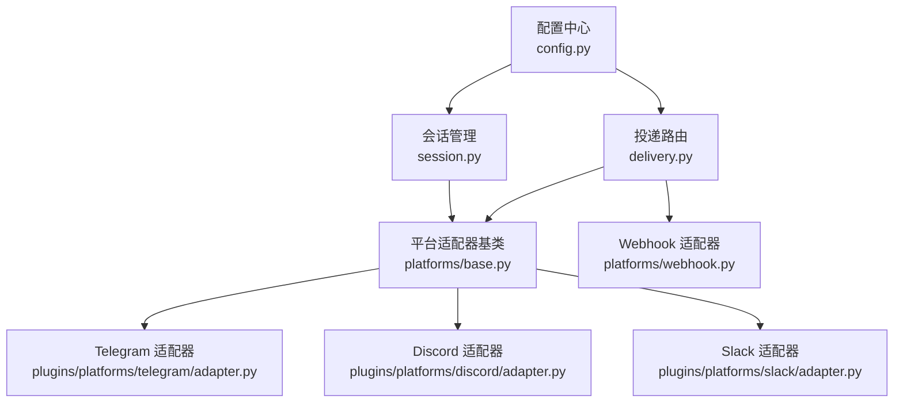
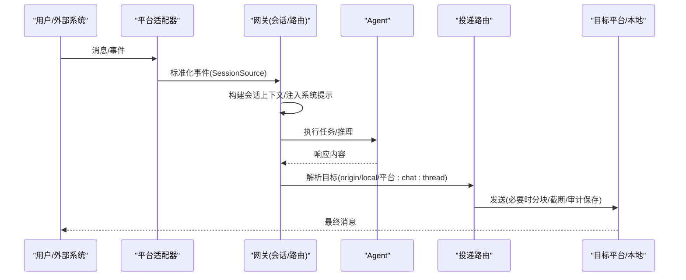
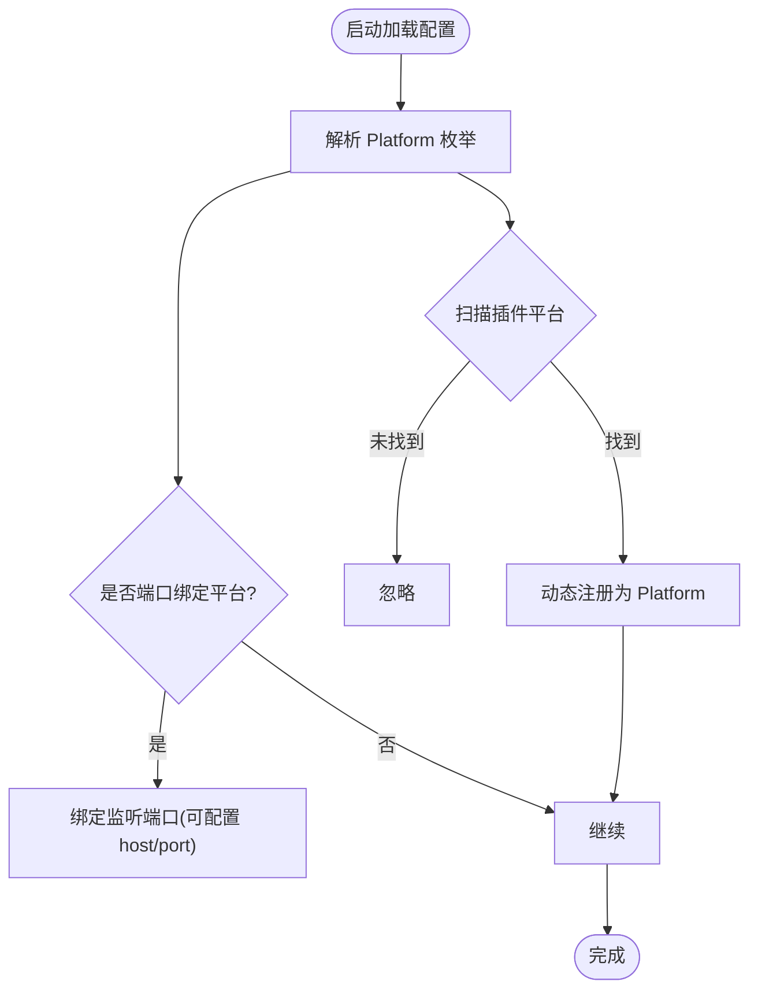
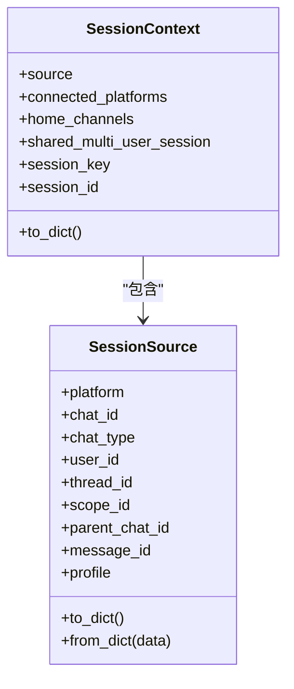
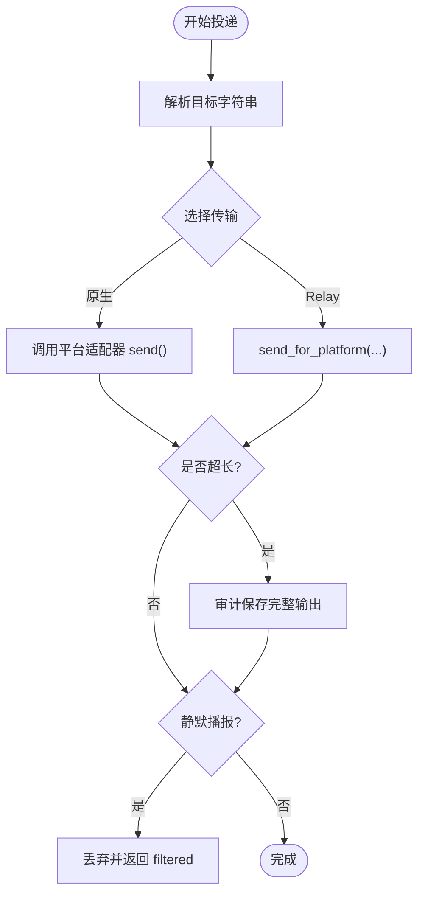
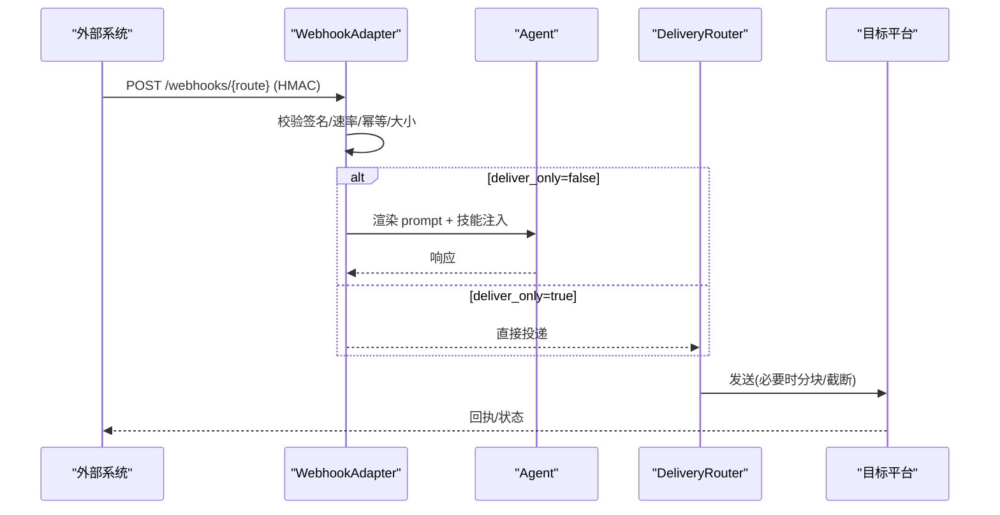
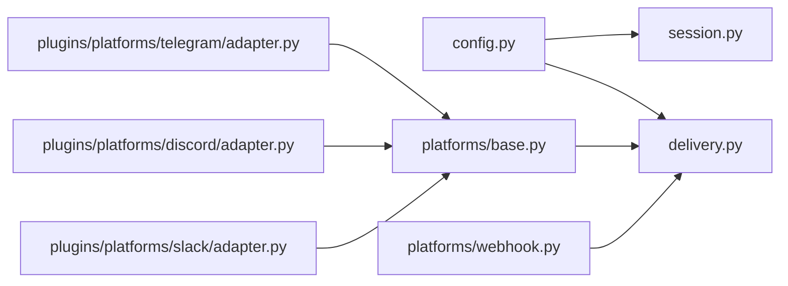

# 消息网关

<cite>
**本文引用的文件**
- [gateway/__init__.py](file://gateway/__init__.py)
- [gateway/config.py](file://gateway/config.py)
- [gateway/session.py](file://gateway/session.py)
- [gateway/delivery.py](file://gateway/delivery.py)
- [gateway/platforms/base.py](file://gateway/platforms/base.py)
- [gateway/platforms/webhook.py](file://gateway/platforms/webhook.py)
- [plugins/platforms/telegram/adapter.py](file://plugins/platforms/telegram/adapter.py)
- [plugins/platforms/discord/adapter.py](file://plugins/platforms/discord/adapter.py)
- [plugins/platforms/slack/adapter.py](file://plugins/platforms/slack/adapter.py)
</cite>

## 目录
1. [简介](#简介)
2. [项目结构](#项目结构)
3. [核心组件](#核心组件)
4. [架构总览](#架构总览)
5. [详细组件分析](#详细组件分析)
6. [依赖关系分析](#依赖关系分析)
7. [性能考量](#性能考量)
8. [故障排除指南](#故障排除指南)
9. [结论](#结论)
10. [附录](#附录)

## 简介
本文件面向系统集成人员，提供“消息网关”的完整技术文档与实施指南。内容涵盖：
- 多平台消息集成（Telegram、Discord、Slack、WhatsApp、Signal、Home Assistant、Webhook 等）的配置与部署
- 消息路由机制、会话管理、平台特定能力适配
- 认证配置、权限设置、消息格式化与错误处理
- 生命周期管理、性能优化、扩展开发
- 生产环境部署建议与监控配置

## 项目结构
消息网关位于 gateway 目录，采用“平台适配器 + 通用网关能力”的分层设计：
- 配置与枚举：集中管理平台、通道、会话重置策略、流式输出等
- 会话管理：来源追踪、上下文注入、持久化与会话键生成
- 投递路由：将结果投递到“来源/本地/指定平台+聊天ID/线程ID”
- 平台适配器：统一接口 BasePlatformAdapter，具体平台实现位于 platforms 与 plugins/platforms
- Webhook 适配器：通用 HTTP 接收器，支持 HMAC 鉴权、速率限制、幂等、动态订阅

**图表来源**
- [gateway/config.py:272-417](file://gateway/config.py#L272-L417)
- [gateway/session.py:148-346](file://gateway/session.py#L148-L346)
- [gateway/delivery.py:294-391](file://gateway/delivery.py#L294-L391)
- [gateway/platforms/base.py:1-110](file://gateway/platforms/base.py#L1-L110)
- [gateway/platforms/webhook.py:177-344](file://gateway/platforms/webhook.py#L177-L344)

**章节来源**
- [gateway/__init__.py:1-36](file://gateway/__init__.py#L1-L36)
- [gateway/config.py:272-417](file://gateway/config.py#L272-L417)

## 核心组件
- 配置模型
  - Platform 枚举：内置平台与插件平台动态识别
  - PlatformConfig：单平台启用、令牌、默认通道、回复线程模式、打字指示器、流式配置等
  - HomeChannel：平台默认目标（含 thread_id、user_id、scope_id）
  - SessionResetPolicy：会话自动重置策略（每日/空闲/两者/从不）
- 会话上下文
  - SessionSource：消息来源（平台、聊天、用户、线程、作用域等）
  - SessionContext：注入系统提示，告知代理当前上下文、可用平台、默认投递目标
- 投递路由
  - DeliveryTarget：解析目标字符串（origin/local/平台或平台:chat_id:thread_id）
  - DeliveryRouter：按目标选择传输（原生适配器或 Relay），处理大输出审计保存与截断、静默播报过滤、Telegram 私有主题创建/刷新
- 平台适配器
  - BasePlatformAdapter：统一连接/断开/发送/媒体缓存/代理/长度限制/流式 TTS 等
  - WebhookAdapter：HTTP 服务、HMAC 校验、速率限制、幂等、动态订阅、跨平台投递

**章节来源**
- [gateway/config.py:272-800](file://gateway/config.py#L272-L800)
- [gateway/session.py:148-746](file://gateway/session.py#L148-L746)
- [gateway/delivery.py:62-391](file://gateway/delivery.py#L62-L391)
- [gateway/platforms/base.py:1-800](file://gateway/platforms/base.py#L1-L800)
- [gateway/platforms/webhook.py:177-800](file://gateway/platforms/webhook.py#L177-L800)

## 架构总览
消息从平台进入后，经适配器转换为统一事件，由网关进行会话关联、上下文注入、模型处理，再将结果通过投递路由发送到目标平台或本地文件。Webhook 作为通用入口，可将外部事件转为 Agent Prompt，并支持直接投递或调用 Agent。

**图表来源**
- [gateway/session.py:479-746](file://gateway/session.py#L479-L746)
- [gateway/delivery.py:294-642](file://gateway/delivery.py#L294-L642)
- [gateway/platforms/base.py:1-110](file://gateway/platforms/base.py#L1-L110)

## 详细组件分析

### 配置与平台注册
- 平台枚举与动态发现
  - 内置平台：Telegram、Discord、Slack、WhatsApp、Signal、HomeAssistant、Email、SMS、Webhook、API Server、Feishu、Wecom、Weixin、BlueBubbles、QQBot、Yuanbao、Relay 等
  - 插件平台：扫描 plugins/platforms 下带 plugin.yaml/yml 的目录，动态注册为 Platform
- 端口绑定平台
  - webhook、api_server、msgraph_webhook、feishu(webhook 模式)、wecom_callback、bluebubbles、sms、whatsapp_cloud、line 会绑定监听端口
  - 条件绑定：如 feishu 仅在 webhook 模式下绑定
- 平台配置项
  - enabled、token/api_key、home_channel、reply_to_mode、typing_indicator、typing_status_text、channel_overrides、extra
  - 流式配置：enabled、transport(auto/draft/edit/off)、edit_interval、buffer_threshold、cursor、fresh_final_after_seconds

**图表来源**
- [gateway/config.py:272-417](file://gateway/config.py#L272-L417)

**章节来源**
- [gateway/config.py:272-800](file://gateway/config.py#L272-L800)

### 会话管理与上下文注入
- SessionSource
  - 描述消息来源：平台、聊天类型、用户/聊天 ID、线程、作用域、父聊天、触发消息 ID、是否机器人、多租户 profile 等
  - 安全：路径穿越防护、PII 哈希（在安全平台）
- SessionContext
  - 注入系统提示：来源、可用平台、默认投递目标、平台行为提示（如 Slack/Discord 工具可用性说明）
  - 多用户会话标记、Matrix 房间边界提示、BlueBubbles/iMessage 气泡格式建议、Yuanbao 私聊指引
- 自动恢复与新鲜度窗口
  - 重启后自动续接会话受 freshness window 控制，避免僵尸会话

**图表来源**
- [gateway/session.py:148-346](file://gateway/session.py#L148-L346)

**章节来源**
- [gateway/session.py:148-746](file://gateway/session.py#L148-L746)

### 投递路由与平台适配
- DeliveryTarget 解析
  - origin → 回源（若无则降级 local）
  - local → 仅本地文件
  - platform → 使用 home channel
  - platform:chat_id[:thread_id] → 精确目标
- DeliveryRouter 流程
  - 解析传输：优先原生适配器；若 Relay 声明 fronts_platform(platform)，则走 Relay
  - 大输出审计保存与截断：非分块适配器截断并追加“完整输出保存路径”
  - 静默播报过滤：屏蔽无实质内容的“沉默”文本，防止循环
  - Telegram 私有主题：按需创建/刷新，确保可见性
- BasePlatformAdapter 通用能力
  - 代理检测与绕过（NO_PROXY/no_proxy）、macOS 系统代理
  - 媒体入站大小限制、音频格式判定、UTF-16 长度限制
  - 流式 TTS 句柄与抑制逻辑

**图表来源**
- [gateway/delivery.py:213-642](file://gateway/delivery.py#L213-L642)
- [gateway/platforms/base.py:738-800](file://gateway/platforms/base.py#L738-L800)

**章节来源**
- [gateway/delivery.py:213-642](file://gateway/delivery.py#L213-L642)
- [gateway/platforms/base.py:1-800](file://gateway/platforms/base.py#L1-L800)

### Webhook 适配器（通用 HTTP 入口）
- 功能
  - 监听 /webhooks/{route_name} 与 /p/{profile}/webhooks/{route_name}
  - HMAC 签名校验（V1/V2），速率限制，幂等去重，body 大小限制
  - 动态订阅热加载（agent 创建的 subscriptions.json）
  - deliver_only 直投模式（跳过 Agent，直接推送通知）
  - 跨平台投递（支持内置与插件平台）
- 安全
  - INSECURE_NO_AUTH 仅限 loopback 主机，否则拒绝启动
  - 请求前鉴权（auth-before-body），防止恶意负载
- 运行
  - 默认 host None（双栈 IPv4+IPv6），默认 port 8644
  - 健康检查 /health

**图表来源**
- [gateway/platforms/webhook.py:177-800](file://gateway/platforms/webhook.py#L177-L800)

**章节来源**
- [gateway/platforms/webhook.py:177-800](file://gateway/platforms/webhook.py#L177-L800)

### 平台特定适配要点
- Telegram
  - 支持私聊主题（named topic）创建与刷新，确保 DM 中可见
  - 流式编辑/草稿更新（auto/draft/edit/off）
  - UTF-16 长度限制与音频格式区分（sendAudio/sendVoice/document）
- Discord
  - 自动线程创建与标题重命名（基于会话标题）
  - 语音频道状态注入（避免破坏系统提示缓存）
  - 工具可用性判断（需 token 与工具集启用）
- Slack
  - 工作区隔离（scope_id）与线程锚点
  - 工具可用性判断（MCP/原生工具集）
  - 打字指示器与状态文案可配置

**章节来源**
- [gateway/delivery.py:554-642](file://gateway/delivery.py#L554-L642)
- [plugins/platforms/telegram/adapter.py](file://plugins/platforms/telegram/adapter.py)
- [plugins/platforms/discord/adapter.py](file://plugins/platforms/discord/adapter.py)
- [plugins/platforms/slack/adapter.py](file://plugins/platforms/slack/adapter.py)

## 依赖关系分析
- 模块耦合
  - config 被 session、delivery、platforms/base 广泛引用
  - delivery 依赖 base 的适配器能力（分块、错误分类、线程元数据）
  - webhook 依赖 delivery 进行跨平台投递
- 外部依赖
  - aiohttp（Webhook 服务器）
  - 各平台 SDK（Telegram Bot API、Discord.py、slack_sdk 等，通过插件适配器引入）
- 潜在环路与解耦
  - 通过统一适配器接口与路由层解耦平台差异
  - 插件平台通过 registry 动态发现，避免硬编码

**图表来源**
- [gateway/config.py:272-800](file://gateway/config.py#L272-L800)
- [gateway/session.py:148-746](file://gateway/session.py#L148-L746)
- [gateway/delivery.py:294-642](file://gateway/delivery.py#L294-L642)
- [gateway/platforms/base.py:1-800](file://gateway/platforms/base.py#L1-L800)
- [gateway/platforms/webhook.py:177-800](file://gateway/platforms/webhook.py#L177-L800)

**章节来源**
- [gateway/config.py:272-800](file://gateway/config.py#L272-L800)
- [gateway/delivery.py:294-642](file://gateway/delivery.py#L294-L642)

## 性能考量
- 流式输出
  - transport=auto 优先使用平台原生草稿（如 Telegram DM），否则回退到编辑路径
  - edit_interval、buffer_threshold、cursor 可调，平衡实时性与限流
- 媒体入站限制
  - 默认 128 MiB，可通过配置调整；下载时按 chunk 校验 Content-Length 与累计字节
- 长输出处理
  - 超过阈值先审计保存，再对非分块适配器进行截断并附加完整路径
- 代理与网络
  - 自动探测 macOS 系统代理，支持 NO_PROXY/no_proxy 匹配与 SOCKS 转发
- 资源保护
  - 历史媒体查找限制并发与超时，避免阻塞事件循环

[本节为通用指导，不直接分析具体文件]

## 故障排除指南
- 常见错误与定位
  - 平台未配置或未启用：检查 PlatformConfig.enabled 与 token/api_key
  - 端口冲突：webhook/api_server 等监听失败，确认 host/port 与复用策略
  - 签名无效：Webhook HMAC 校验失败，核对 secret 与 V1/V2 头
  - 速率限制：Webhook 每路由固定窗口计数超限，调整 rate_limit
  - 静默播报被过滤：确认内容是否为“沉默”标记，避免空响应循环
  - Telegram 主题不可见：确保提供 reply anchor 或通过 ensure_dm_topic 创建/刷新
- 诊断步骤
  - 查看健康检查 /health
  - 检查日志中的“审计保存”“静默播报”“死目标”记录
  - 验证动态订阅文件变更是否生效
  - 确认 NO_PROXY/no_proxy 是否正确匹配目标主机

**章节来源**
- [gateway/platforms/webhook.py:248-344](file://gateway/platforms/webhook.py#L248-L344)
- [gateway/delivery.py:448-544](file://gateway/delivery.py#L448-L544)
- [gateway/platforms/base.py:738-800](file://gateway/platforms/base.py#L738-L800)

## 结论
消息网关通过统一的配置、会话与路由层，结合平台适配器与 Webhook 入口，实现了多平台消息集成的高内聚、低耦合架构。其特性包括：
- 灵活的平台注册与配置
- 健壮的会话上下文注入与自动恢复
- 安全的 Webhook 接入与跨平台投递
- 完善的性能与安全保护（媒体限制、代理、限流、幂等）
在生产环境中，建议结合监控与健康检查，合理调优流式参数与媒体限制，并严格配置认证与权限。

[本节为总结，不直接分析具体文件]

## 附录

### 配置示例与最佳实践
- 平台启用与令牌
  - 在 platforms.<name>.enabled 设置为 true，并配置 token/api_key
  - 环境变量优先级：平台专用变量 > HTTPS/HTTP/ALL_PROXY > macOS 系统代理
- 默认通道与线程
  - 设置 home_channel 以支持 cron 输出默认投递
  - 对于需要线程的平台（Telegram/Slack/Discord），明确 thread_id 或使用自动创建
- 流式输出
  - 推荐 transport=auto，edit_interval≈0.8s，buffer_threshold≈24，cursor=" ▉"
- Webhook
  - 每个 route 必须配置 secret；测试可使用 INSECURE_NO_AUTH 但仅限 loopback
  - 使用 deliver_only 实现零 LLM 成本的快速通知
- 安全与权限
  - 使用 scope_id 进行工作区/服务器隔离
  - 对敏感信息启用 PII 哈希（在安全平台）

[本节为通用指导，不直接分析具体文件]

### 生命周期管理与扩展开发
- 适配器生命周期
  - connect(is_reconnect=False/True)：首次连接与重连均支持 is_reconnect 标志
  - disconnect：清理资源（如 aiohttp runner）
- 扩展新平台
  - 在 plugins/platforms 下新增目录，提供 adapter.py 与 plugin.yaml
  - 实现 BasePlatformAdapter 必要方法，遵循 is_reconnect 契约
  - 通过 Platform._missing_ 动态注册，无需修改枚举

**章节来源**
- [tests/gateway/test_adapter_connect_is_reconnect_contract.py:1-145](file://tests/gateway/test_adapter_connect_is_reconnect_contract.py#L1-L145)
- [gateway/config.py:304-368](file://gateway/config.py#L304-L368)

### 生产部署与监控
- 部署建议
  - 使用容器化部署，暴露 /health 用于健康检查
  - 配置 systemd watchdog 与心跳，确保进程存活
  - 合理设置 max_inbound_media_bytes 与流式参数
- 监控指标
  - 投递成功率、失败原因分类（死目标、线程不存在等）
  - Webhook 请求量、速率限制命中、签名失败次数
  - 媒体入站大小分布、代理命中率

[本节为通用指导，不直接分析具体文件]