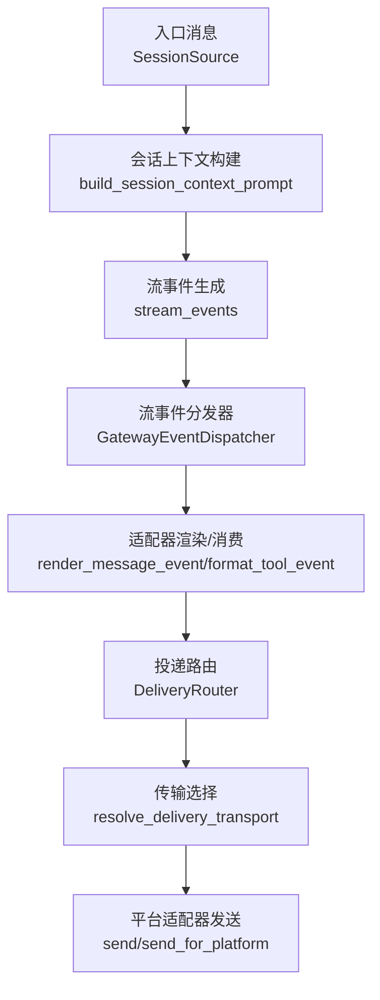
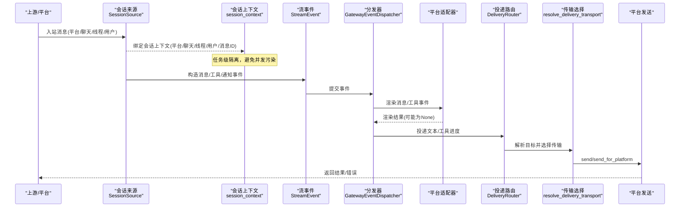
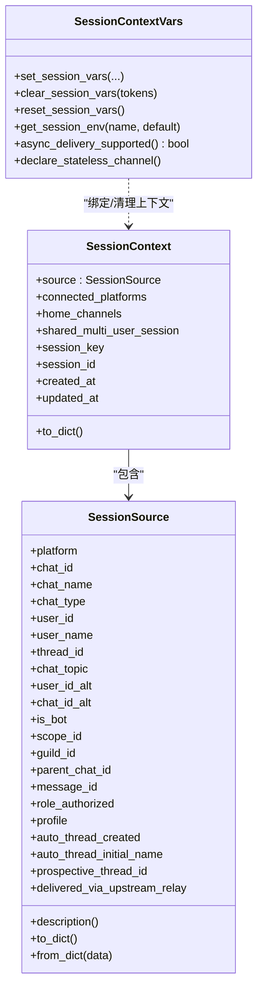
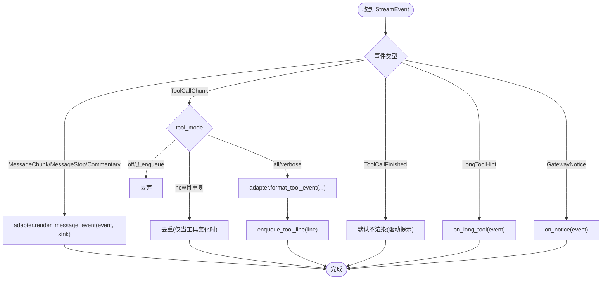
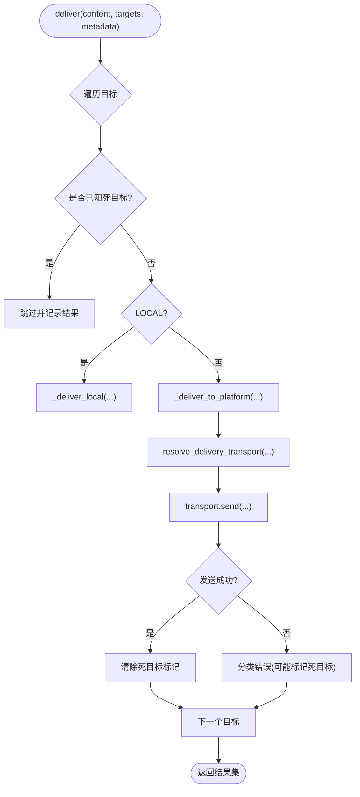
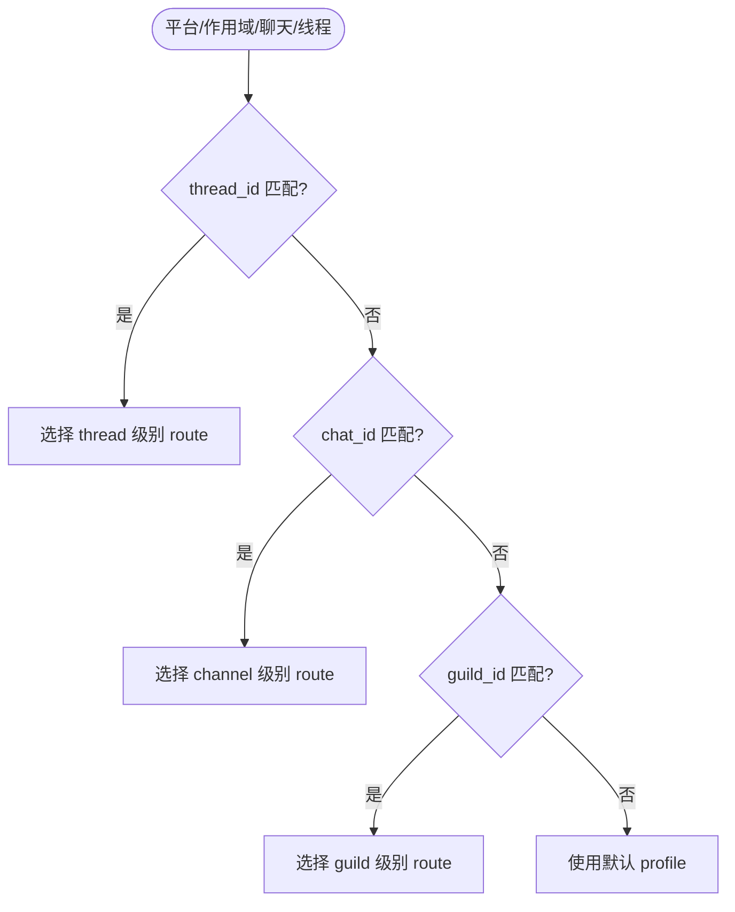
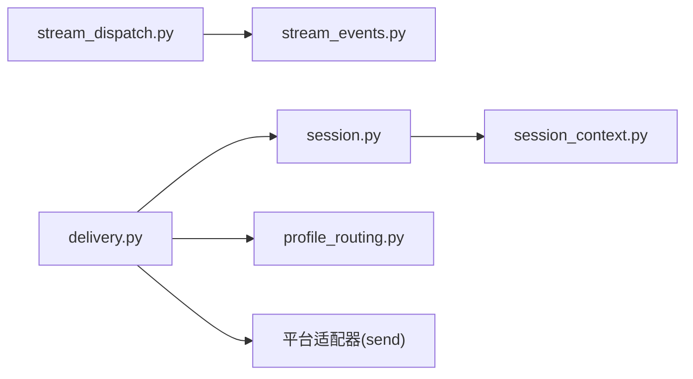

# 消息路由

<cite>
**本文引用的文件**
- [gateway/session.py](file://gateway/session.py)
- [gateway/session_context.py](file://gateway/session_context.py)
- [gateway/delivery.py](file://gateway/delivery.py)
- [gateway/stream_dispatch.py](file://gateway/stream_dispatch.py)
- [gateway/stream_events.py](file://gateway/stream_events.py)
- [gateway/profile_routing.py](file://gateway/profile_routing.py)
</cite>

## 目录
1. [简介](#简介)
2. [项目结构](#项目结构)
3. [核心组件](#核心组件)
4. [架构总览](#架构总览)
5. [详细组件分析](#详细组件分析)
6. [依赖关系分析](#依赖关系分析)
7. [性能考量](#性能考量)
8. [故障排查指南](#故障排查指南)
9. [结论](#结论)
10. [附录：配置与示例](#附录：配置与示例)

## 简介
本文件系统化梳理 Hermes Agent 网关中的“消息路由系统”，覆盖从消息接收、处理到投递的完整链路，重点包括：
- 路由规则与优先级管理（按平台/群组/频道/线程的多级匹配）
- 会话管理机制（会话状态维护、上下文传递、生命周期控制）
- 消息过滤器（内容过滤、格式转换、敏感信息处理）
- 流式响应处理、批量消息处理与异步投递机制
- 路由配置示例与性能优化建议
- 故障转移、重试策略与错误恢复机制

## 项目结构
围绕消息路由的核心模块集中在 gateway 目录下：
- session.py：会话来源、会话上下文构建、PII 脱敏、动态系统提示注入
- session_context.py：基于 contextvars 的任务级会话上下文隔离与生命周期
- delivery.py：投递目标解析、传输选择、静默叙述过滤、长输出审计与截断、死目标记录
- stream_events.py：结构化流事件定义（消息片段、工具调用、通知等）
- stream_dispatch.py：将流事件分派到适配器渲染并投递到消费端
- profile_routing.py：基于 profile 的路由规则与层级匹配

图表来源
- [gateway/session.py:479-745](file://gateway/session.py#L479-L745)
- [gateway/stream_events.py:41-159](file://gateway/stream_events.py#L41-L159)
- [gateway/stream_dispatch.py:40-132](file://gateway/stream_dispatch.py#L40-L132)
- [gateway/delivery.py:92-131](file://gateway/delivery.py#L92-L131)
- [gateway/delivery.py:294-391](file://gateway/delivery.py#L294-L391)

章节来源
- [gateway/session.py:1-121](file://gateway/session.py#L1-L121)
- [gateway/session_context.py:1-123](file://gateway/session_context.py#L1-L123)
- [gateway/delivery.py:1-60](file://gateway/delivery.py#L1-L60)
- [gateway/stream_events.py:1-33](file://gateway/stream_events.py#L1-L33)
- [gateway/stream_dispatch.py:1-19](file://gateway/stream_dispatch.py#L1-L19)
- [gateway/profile_routing.py:1-38](file://gateway/profile_routing.py#L1-L38)

## 核心组件
- 会话来源与会话上下文：描述消息来源、平台、聊天/线程标识、用户信息，并构建注入到模型的系统提示；支持 PII 安全脱敏。
- 任务级会话上下文：使用 contextvars 实现并发安全的会话变量绑定与清理，避免进程级环境变量污染。
- 流事件体系：以不可变数据类定义消息片段、工具调用、通知等事件，解耦“发生了什么”和“如何呈现”。
- 流事件分发器：同步、无平台知识的轻量路由器，将事件交给适配器渲染并投递到消费队列。
- 投递路由：解析目标（origin/local/platform[:chat_id][:thread_id]），选择传输（原生适配器或 Relay），执行静默叙述过滤、长输出审计与截断、死目标短路、错误分类与恢复。
- Profile 路由：按平台+guild/chat/thread 的层级匹配，将不同范围的消息路由到不同 profile（模型、工具、记忆、人设）。

章节来源
- [gateway/session.py:148-347](file://gateway/session.py#L148-L347)
- [gateway/session_context.py:70-123](file://gateway/session_context.py#L70-L123)
- [gateway/stream_events.py:41-159](file://gateway/stream_events.py#L41-L159)
- [gateway/stream_dispatch.py:40-132](file://gateway/stream_dispatch.py#L40-L132)
- [gateway/delivery.py:213-391](file://gateway/delivery.py#L213-L391)
- [gateway/profile_routing.py:50-167](file://gateway/profile_routing.py#L50-L167)

## 架构总览
下图展示一次典型请求从入站到出站的端到端流程，包含路由、上下文、流式处理与投递。

图表来源
- [gateway/session.py:479-745](file://gateway/session.py#L479-L745)
- [gateway/session_context.py:206-313](file://gateway/session_context.py#L206-L313)
- [gateway/stream_events.py:41-159](file://gateway/stream_events.py#L41-L159)
- [gateway/stream_dispatch.py:88-129](file://gateway/stream_dispatch.py#L88-L129)
- [gateway/delivery.py:92-131](file://gateway/delivery.py#L92-L131)
- [gateway/delivery.py:318-391](file://gateway/delivery.py#L318-L391)

## 详细组件分析

### 会话管理与上下文传递
- 会话来源 SessionSource：承载平台、聊天/线程、用户、scope/guild、profile、自动线程元数据、上游中继信任信号等，用于路由与上下文注入。
- 会话上下文 SessionContext：聚合来源、已连接平台、家频道、共享多用户会话标记及会话键/ID/时间戳，用于构建动态系统提示。
- 上下文变量 session_context：通过 ContextVar 提供任务级会话变量绑定与清理，确保并发安全；提供 set_session_vars/clear_session_vars/reset_session_vars 等生命周期方法；暴露 async_delivery_supported 判断是否支持异步投递。

图表来源
- [gateway/session.py:148-347](file://gateway/session.py#L148-L347)
- [gateway/session_context.py:70-123](file://gateway/session_context.py#L70-L123)
- [gateway/session_context.py:206-313](file://gateway/session_context.py#L206-L313)
- [gateway/session_context.py:363-496](file://gateway/session_context.py#L363-L496)

章节来源
- [gateway/session.py:148-347](file://gateway/session.py#L148-L347)
- [gateway/session_context.py:70-123](file://gateway/session_context.py#L70-L123)
- [gateway/session_context.py:206-313](file://gateway/session_context.py#L206-L313)
- [gateway/session_context.py:363-496](file://gateway/session_context.py#L363-L496)

### 流式响应与事件分发
- 事件类型：MessageChunk/MessageStop/Commentary（消息片段与段落）、ToolCallChunk/ToolCallFinished（工具调用开始/结束）、LongToolHint/GatewayNotice（网关控制/提示）。
- 分发器 GatewayEventDispatcher：同步、无平台知识，负责将事件路由到适配器的渲染钩子；对工具进度进行模式去重（all/new/verbose/off）；异常被吞掉以避免打断 agent 循环。
- 消费端 sink：由平台适配器决定如何呈现（如 Telegram DM 的原生草稿、其他平台的就地编辑）。

图表来源
- [gateway/stream_events.py:41-159](file://gateway/stream_events.py#L41-L159)
- [gateway/stream_dispatch.py:88-129](file://gateway/stream_dispatch.py#L88-L129)

章节来源
- [gateway/stream_events.py:41-159](file://gateway/stream_events.py#L41-L159)
- [gateway/stream_dispatch.py:40-132](file://gateway/stream_dispatch.py#L40-L132)

### 投递路由与负载均衡
- 目标解析 DeliveryTarget：支持 origin/local/platform[:chat_id][:thread_id] 多种格式，解析出平台、聊天/线程、是否显式指定。
- 传输选择 resolve_delivery_transport：优先原生适配器；若原生禁用或未启用，则回退到具备 fronts_platform 能力的 Relay 传输。
- 静默叙述过滤：对纯“沉默”叙述（如 *(silent)*、🔇、"." 等）进行出站过滤，防止 bot-to-bot 无限回环。
- 长输出审计与截断：超过阈值时先保存全文作为审计轨迹；非分块适配器会截断并附加“全文路径”脚注。
- 死目标短路：根据错误文本分类（not_found 等）标记死目标，后续投递直接跳过，成功投递后清除标记。
- Telegram 私有主题：必要时创建/刷新命名私有主题，补充 thread_id/reply anchor。

图表来源
- [gateway/delivery.py:213-391](file://gateway/delivery.py#L213-L391)
- [gateway/delivery.py:460-642](file://gateway/delivery.py#L460-L642)

章节来源
- [gateway/delivery.py:213-391](file://gateway/delivery.py#L213-L391)
- [gateway/delivery.py:460-642](file://gateway/delivery.py#L460-L642)

### 路由规则与优先级管理（Profile 路由）
- 匹配优先级（从高到低）：
  - platform + chat_id + thread_id（精确线程）
  - platform + chat_id（频道/群组）
  - platform + guild_id（服务器/工作区）
  - 未匹配 → 默认 profile
- 父链匹配：对于 Discord 线程/论坛帖子，parent_chat_id 可匹配其父频道。
- 配置项：name/platform/profile/guild_id/chat_id/thread_id/enabled。

图表来源
- [gateway/profile_routing.py:50-167](file://gateway/profile_routing.py#L50-L167)

章节来源
- [gateway/profile_routing.py:50-167](file://gateway/profile_routing.py#L50-L167)

### 消息过滤器与敏感信息处理
- 出站静默叙述过滤：识别并丢弃纯“沉默”叙述，避免回环。
- PII 脱敏：在构建系统提示时对平台允许的场景对用户/聊天 ID 做哈希化；Discord 等平台因提及需要真实 ID 而排除。
- 命令/工具输出脱敏：终端工具的错误/回溯中隐藏凭据形状字符串，可通过开关关闭。

章节来源
- [gateway/delivery.py:31-55](file://gateway/delivery.py#L31-L55)
- [gateway/delivery.py:448-544](file://gateway/delivery.py#L448-L544)
- [gateway/session.py:349-357](file://gateway/session.py#L349-L357)
- [gateway/session.py:479-745](file://gateway/session.py#L479-L745)
- [tests/tools/test_terminal_error_redaction.py:1-154](file://tests/tools/test_terminal_error_redaction.py#L1-L154)

### 异步投递与生命周期控制
- 异步投递能力：通过 session_context.async_delivery_supported 判断当前会话是否能接收延迟完成的后台结果；stateless 通道（API server、一次性任务）明确声明不支持。
- 生命周期：set_session_vars 绑定上下文，clear_session_vars 清空上下文，reset_session_vars 重置为“未绑定”以规避跨任务继承泄漏。
- 子进程/工具兼容：ContextVar 权威值优先，未绑定时回退到 os.environ 以保持 CLI/测试兼容。

章节来源
- [gateway/session_context.py:104-123](file://gateway/session_context.py#L104-L123)
- [gateway/session_context.py:206-313](file://gateway/session_context.py#L206-L313)
- [gateway/session_context.py:363-496](file://gateway/session_context.py#L363-L496)

## 依赖关系分析
- 低耦合：stream_events 仅定义数据结构；stream_dispatch 仅做路由；delivery 专注投递；session 专注上下文与提示构建；profile_routing 专注规则匹配。
- 关键依赖链：
  - session.py → session_context.py（上下文绑定）
  - stream_dispatch.py → stream_events.py（事件消费）
  - delivery.py → session.py（来源/家频道）
  - delivery.py → profile_routing.py（可选 profile 路由）
  - delivery.py → 平台适配器（send/send_for_platform）

图表来源
- [gateway/session.py:148-347](file://gateway/session.py#L148-L347)
- [gateway/session_context.py:206-313](file://gateway/session_context.py#L206-L313)
- [gateway/stream_dispatch.py:40-132](file://gateway/stream_dispatch.py#L40-L132)
- [gateway/stream_events.py:41-159](file://gateway/stream_events.py#L41-L159)
- [gateway/delivery.py:92-131](file://gateway/delivery.py#L92-L131)
- [gateway/profile_routing.py:50-167](file://gateway/profile_routing.py#L50-L167)

章节来源
- [gateway/session.py:148-347](file://gateway/session.py#L148-L347)
- [gateway/session_context.py:206-313](file://gateway/session_context.py#L206-L313)
- [gateway/stream_dispatch.py:40-132](file://gateway/stream_dispatch.py#L40-L132)
- [gateway/stream_events.py:41-159](file://gateway/stream_events.py#L41-L159)
- [gateway/delivery.py:92-131](file://gateway/delivery.py#L92-L131)
- [gateway/profile_routing.py:50-167](file://gateway/profile_routing.py#L50-L167)

## 性能考量
- 流事件去重：tool_mode=new 仅在工具切换时上报，降低 UI/日志噪音。
- 长输出审计与截断：避免平台 API 限制导致的失败；分块适配器保留全文，非分块适配器截断并附带全文路径。
- 死目标短路：减少无效重试与网络开销。
- 上下文隔离：contextvars 避免并发下的上下文污染，提升吞吐稳定性。
- 提示缓存友好：系统提示构建中对易变字段（如触发消息 ID）不在静态块内，减少缓存失效。

[本节为通用指导，不直接分析具体文件]

## 故障排查指南
- 平台无法重连：所有平台适配器的 connect 必须接受 is_reconnect 关键字参数，否则重连时会抛出签名错误导致平台静默断开。
- 投递失败：检查 DeliveryTarget 解析是否正确；确认传输选择（原生/Relay）是否符合预期；查看静默叙述过滤是否误删；核对 Telegram 私有主题是否需要 ensure_dm_topic。
- 上下文泄漏：确保在每个消息处理入口调用 reset_session_vars，并在 finally 中 clear_session_vars；避免子进程继承错误的会话身份。
- 长输出丢失：确认是否触发了截断逻辑；查看审计文件路径；对分块适配器确认 splits_long_messages 标志。

章节来源
- [tests/gateway/test_adapter_connect_is_reconnect_contract.py:1-145](file://tests/gateway/test_adapter_connect_is_reconnect_contract.py#L1-L145)
- [gateway/delivery.py:460-642](file://gateway/delivery.py#L460-L642)
- [gateway/session_context.py:315-360](file://gateway/session_context.py#L315-L360)

## 结论
Hermes 网关的消息路由系统通过清晰的职责分离与强类型事件契约，实现了高内聚、低耦合的可扩展架构。结合会话上下文隔离、流式事件分发、健壮投递路由与 Profile 路由，既能满足多平台、多租户场景，又具备良好的可观测性与容错能力。配合静默叙述过滤、PII 脱敏与长输出审计，系统在安全性与可用性之间取得平衡。

[本节为总结性内容，不直接分析具体文件]

## 附录：配置与示例
- Profile 路由配置要点：
  - name：路由名称
  - platform：平台名（如 discord）
  - profile：目标 profile 名
  - guild_id/chat_id/thread_id：作用域限定（越具体优先级越高）
  - enabled：是否启用
- 投递目标格式：
  - origin：回到来源
  - local：仅本地文件
  - platform：家频道
  - platform:chat_id：指定聊天
  - platform:chat_id:thread_id：指定线程
- 流事件模式：
  - tool_mode：all/new/verbose/off
  - preview_max_len：工具预览长度上限

章节来源
- [gateway/profile_routing.py:18-38](file://gateway/profile_routing.py#L18-L38)
- [gateway/profile_routing.py:50-167](file://gateway/profile_routing.py#L50-L167)
- [gateway/delivery.py:213-292](file://gateway/delivery.py#L213-L292)
- [gateway/stream_dispatch.py:67-87](file://gateway/stream_dispatch.py#L67-L87)