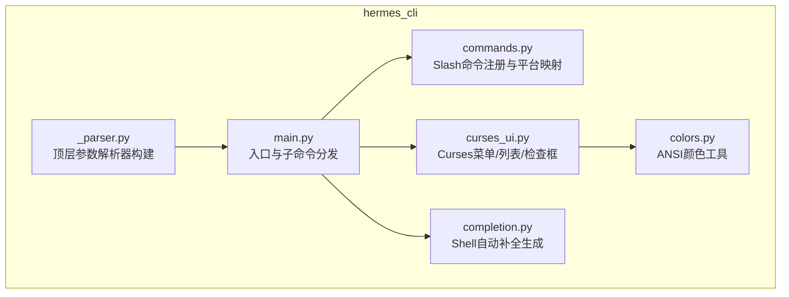
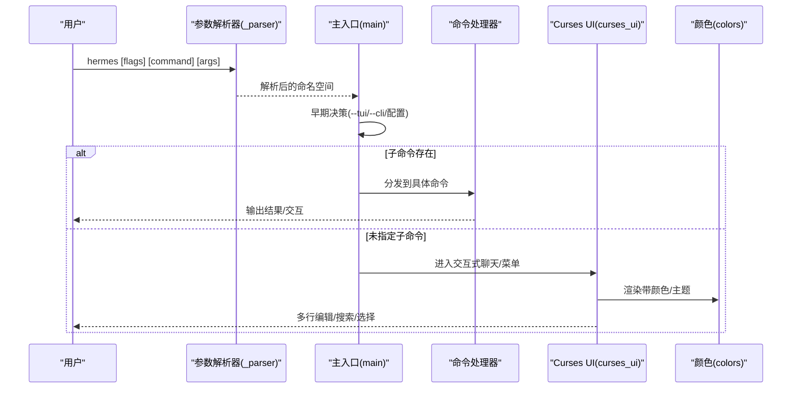
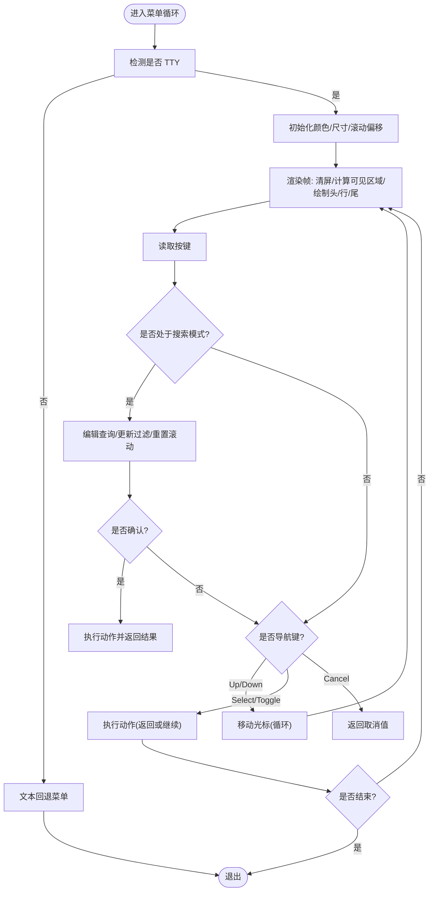
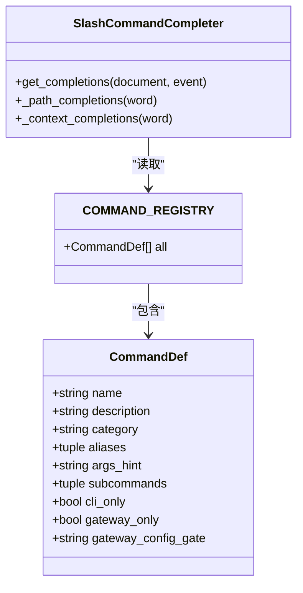
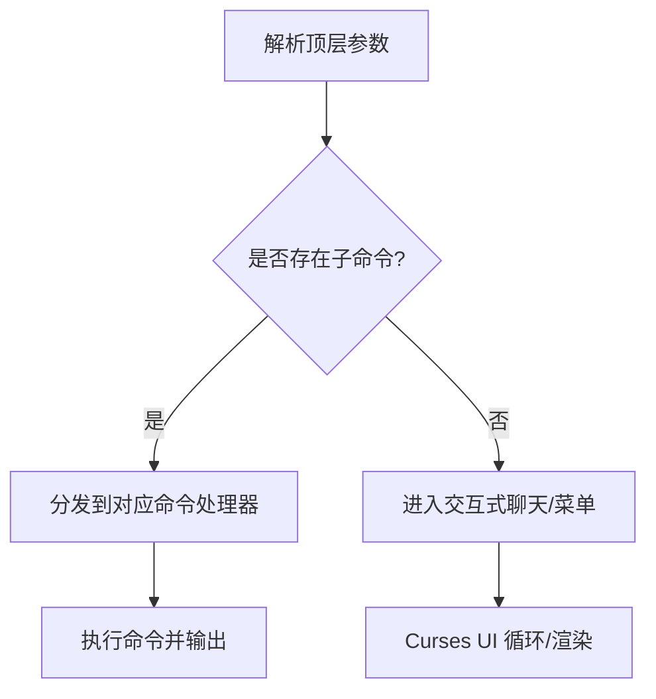
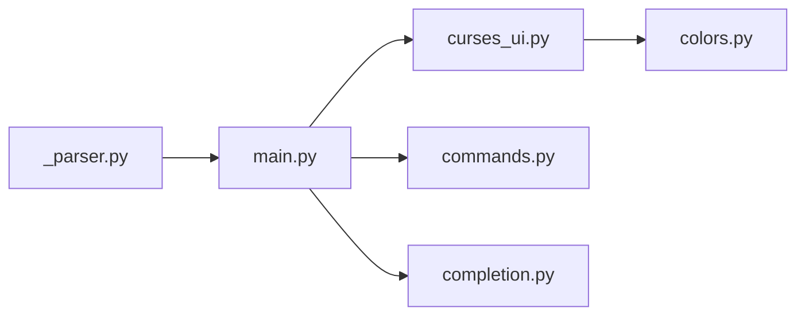

# CLI界面

<cite>
**本文引用的文件**
- [hermes_cli/curses_ui.py](file://hermes_cli/curses_ui.py)
- [hermes_cli/main.py](file://hermes_cli/main.py)
- [hermes_cli/_parser.py](file://hermes_cli/_parser.py)
- [hermes_cli/commands.py](file://hermes_cli/commands.py)
- [hermes_cli/completion.py](file://hermes_cli/completion.py)
- [hermes_cli/colors.py](file://hermes_cli/colors.py)
</cite>

## 目录
1. [简介](#简介)
2. [项目结构](#项目结构)
3. [核心组件](#核心组件)
4. [架构总览](#架构总览)
5. [详细组件分析](#详细组件分析)
6. [依赖关系分析](#依赖关系分析)
7. [性能考虑](#性能考虑)
8. [故障排查指南](#故障排查指南)
9. [结论](#结论)
10. [附录](#附录)

## 简介
本文件面向系统管理员与开发者，系统性阐述 Hermes Agent 的命令行界面（CLI）实现与使用方法，重点覆盖以下方面：
- 基于 Curses 的交互式终端界面：多行编辑、历史记录管理、自动补全与快捷键支持
- CLI 命令语法、参数传递与返回值处理
- 界面渲染机制、颜色主题与布局配置
- 常用命令示例、批量操作与脚本集成方法
- 性能优化技巧、内存管理与错误处理策略

## 项目结构
Hermes CLI 的核心位于 hermes_cli 子包中，围绕“解析器构建”“命令注册”“Curses UI 组件”“自动补全与着色”等模块协同工作。

图示来源
- [hermes_cli/_parser.py:84-398](file://hermes_cli/_parser.py#L84-L398)
- [hermes_cli/main.py:1-200](file://hermes_cli/main.py#L1-L200)
- [hermes_cli/commands.py:1-120](file://hermes_cli/commands.py#L1-L120)
- [hermes_cli/curses_ui.py:1-120](file://hermes_cli/curses_ui.py#L1-L120)
- [hermes_cli/colors.py:1-39](file://hermes_cli/colors.py#L1-L39)
- [hermes_cli/completion.py:1-60](file://hermes_cli/completion.py#L1-L60)

章节来源
- [hermes_cli/_parser.py:84-398](file://hermes_cli/_parser.py#L84-L398)
- [hermes_cli/main.py:1-200](file://hermes_cli/main.py#L1-L200)
- [hermes_cli/commands.py:1-120](file://hermes_cli/commands.py#L1-L120)
- [hermes_cli/curses_ui.py:1-120](file://hermes_cli/curses_ui.py#L1-L120)
- [hermes_cli/colors.py:1-39](file://hermes_cli/colors.py#L1-L39)
- [hermes_cli/completion.py:1-60](file://hermes_cli/completion.py#L1-L60)

## 核心组件
- 参数解析器与命令路由
  - 顶层解析器定义通用标志与子命令；chat 子命令独立构建，便于与 TUI/REPL 切换。
  - 关键标志：--tui/--cli 强制界面模式；-c/--continue 恢复会话；-r/--resume 指定会话；--oneshot 单次输出模式等。
- Slash 命令系统
  - 统一注册中心 COMMAND_REGISTRY，涵盖 Session/Configuration/Tools & Skills/Info/Exit 等类别。
  - 支持别名、子命令提示、平台可用性门控与自动补全。
- Curses 交互组件
  - 提供单选/多选/检查框菜单，支持搜索过滤、键盘导航、状态栏与颜色主题。
- 自动补全与 Shell 集成
  - 通过遍历解析器树生成 bash/zsh/fish 补全脚本，支持子命令、标志与动态 profile 名称。
- 颜色与渲染
  - 条件启用 ANSI 颜色，统一颜色常量与应用函数，避免在非 TTY 或 NO_COLOR 环境下输出。

章节来源
- [hermes_cli/_parser.py:84-398](file://hermes_cli/_parser.py#L84-L398)
- [hermes_cli/commands.py:64-226](file://hermes_cli/commands.py#L64-L226)
- [hermes_cli/curses_ui.py:350-800](file://hermes_cli/curses_ui.py#L350-L800)
- [hermes_cli/completion.py:15-140](file://hermes_cli/completion.py#L15-L140)
- [hermes_cli/colors.py:7-39](file://hermes_cli/colors.py#L7-L39)

## 架构总览
CLI 启动流程概览如下：

图示来源
- [hermes_cli/_parser.py:84-398](file://hermes_cli/_parser.py#L84-L398)
- [hermes_cli/main.py:145-158](file://hermes_cli/main.py#L145-L158)
- [hermes_cli/curses_ui.py:350-530](file://hermes_cli/curses_ui.py#L350-L530)
- [hermes_cli/colors.py:34-39](file://hermes_cli/colors.py#L34-L39)

## 详细组件分析

### Curses 交互组件（菜单/检查框/单选）
- 功能特性
  - 多选检查框：支持状态栏实时统计、颜色高亮当前项、回车确认、Esc 取消。
  - 单选列表：支持可搜索过滤、描述区显示、颜色主题、状态栏。
  - 文本回退：当无法进入 Curses（如 Windows 无 curses 或非 TTY），自动降级为数字编号菜单。
  - 键盘导航：支持方向键/空格/Enter/Q/Esc，兼容多种终端序列。
  - 搜索：输入“/”打开搜索，支持 Backspace/Ctrl+U 清空，模糊匹配与排序。
- 关键数据结构与算法
  - 模糊评分：按连续匹配、词边界、前缀、精确匹配等规则打分，多词 AND 过滤。
  - 滚动与光标：根据可见区域动态调整滚动偏移，保证光标始终可见。
  - 输入缓冲清理：退出 Curses 后刷新 stdin 缓冲，避免残留转义字节污染后续输入。
- 渲染与主题
  - 颜色对：前景色/默认背景，支持状态栏额外配色；在低色彩终端上优雅降级。
  - 布局：标题/提示/列表/页脚四段式布局，预留底部行用于状态栏。
- 返回值与取消
  - 取消行为：返回预设取消值（如原集合/原索引/None）；键盘中断与异常时同样返回取消值。

图示来源
- [hermes_cli/curses_ui.py:350-530](file://hermes_cli/curses_ui.py#L350-L530)
- [hermes_cli/curses_ui.py:531-800](file://hermes_cli/curses_ui.py#L531-L800)

章节来源
- [hermes_cli/curses_ui.py:14-161](file://hermes_cli/curses_ui.py#L14-L161)
- [hermes_cli/curses_ui.py:163-204](file://hermes_cli/curses_ui.py#L163-L204)
- [hermes_cli/curses_ui.py:206-242](file://hermes_cli/curses_ui.py#L206-L242)
- [hermes_cli/curses_ui.py:244-264](file://hermes_cli/curses_ui.py#L244-L264)
- [hermes_cli/curses_ui.py:276-343](file://hermes_cli/curses_ui.py#L276-L343)
- [hermes_cli/curses_ui.py:350-530](file://hermes_cli/curses_ui.py#L350-L530)
- [hermes_cli/curses_ui.py:531-800](file://hermes_cli/curses_ui.py#L531-L800)

### Slash 命令系统与自动补全
- 命令注册
  - 统一注册表 COMMAND_REGISTRY，包含名称、别名、参数占位符、子命令、平台可用性门控等元信息。
  - 平台映射：Telegram/Discord 等平台命令菜单优先级与名称裁剪逻辑。
- 自动补全
  - 基于 prompt_toolkit 的 SlashCommandCompleter（可选依赖），支持：
    - Slash 前缀命令补全与描述展示
    - 文件路径补全（相对/绝对/~ 展开、目录后缀斜杠、大小限制）
    - 上下文补全（@file:/@folder: 限定类型）
    - 插件命令动态发现与合并
- Shell 补全
  - 通过遍历解析器树生成 bash/zsh/fish 补全脚本，支持子命令、标志与 profile 名称动态补全。

图示来源
- [hermes_cli/commands.py:45-58](file://hermes_cli/commands.py#L45-L58)
- [hermes_cli/commands.py:64-226](file://hermes_cli/commands.py#L64-L226)
- [hermes_cli/commands.py:245-251](file://hermes_cli/commands.py#L245-L251)
- [hermes_cli/completion.py:15-44](file://hermes_cli/completion.py#L15-L44)

章节来源
- [hermes_cli/commands.py:45-226](file://hermes_cli/commands.py#L45-L226)
- [hermes_cli/commands.py:245-380](file://hermes_cli/commands.py#L245-L380)
- [hermes_cli/completion.py:15-320](file://hermes_cli/completion.py#L15-L320)

### 参数解析器与命令路由
- 顶层解析器
  - 定义通用标志：--tui/--cli、-c/--continue、-r/--resume、--oneshot、--model/--provider、--skills、--yolo、--pass-session-id、--ignore-user-config/--ignore-rules 等。
  - chat 子命令：与顶层共享部分标志，增加 --quiet、--max-turns、--checkpoints 等。
- 路由与回退
  - 未指定子命令时默认进入交互式聊天；子命令解析失败时提供帮助与示例。

图示来源
- [hermes_cli/_parser.py:84-398](file://hermes_cli/_parser.py#L84-L398)
- [hermes_cli/main.py:145-158](file://hermes_cli/main.py#L145-L158)

章节来源
- [hermes_cli/_parser.py:84-398](file://hermes_cli/_parser.py#L84-L398)
- [hermes_cli/main.py:145-158](file://hermes_cli/main.py#L145-L158)

### 颜色主题与布局配置
- 颜色控制
  - should_use_color：综合 NO_COLOR、TERM=dumb、TTY 检测决定是否启用颜色。
  - Colors：统一 ANSI 常量；color：条件应用颜色码。
- 布局与渲染
  - Curses UI 使用四段式布局：标题/提示/列表/页脚；颜色对用于高亮当前项、标题、状态栏等。
  - 在小终端窗口时给出提示并安全退出；支持动态列宽以适配不同终端宽度。

章节来源
- [hermes_cli/colors.py:7-39](file://hermes_cli/colors.py#L7-L39)
- [hermes_cli/curses_ui.py:555-620](file://hermes_cli/curses_ui.py#L555-L620)
- [hermes_cli/curses_ui.py:800-983](file://hermes_cli/curses_ui.py#L800-L983)

## 依赖关系分析
- 模块耦合
  - main.py 依赖 _parser.py 构建解析器，依赖 curses_ui.py 提供交互式菜单，依赖 commands.py 获取命令元数据。
  - curses_ui.py 依赖 colors.py 控制颜色输出。
  - completion.py 依赖 _parser.py 的解析器树生成补全脚本。
- 外部依赖
  - curses（Python 标准库扩展）、prompt_toolkit（可选）、termios（非 Windows 平台）。
- 可能的循环依赖
  - 当前模块间为单向依赖，无明显循环导入风险。

图示来源
- [hermes_cli/_parser.py:84-398](file://hermes_cli/_parser.py#L84-L398)
- [hermes_cli/main.py:1-200](file://hermes_cli/main.py#L1-L200)
- [hermes_cli/curses_ui.py:1-120](file://hermes_cli/curses_ui.py#L1-L120)
- [hermes_cli/commands.py:1-120](file://hermes_cli/commands.py#L1-L120)
- [hermes_cli/completion.py:1-60](file://hermes_cli/completion.py#L1-L60)

章节来源
- [hermes_cli/_parser.py:84-398](file://hermes_cli/_parser.py#L84-L398)
- [hermes_cli/main.py:1-200](file://hermes_cli/main.py#L1-L200)
- [hermes_cli/curses_ui.py:1-120](file://hermes_cli/curses_ui.py#L1-L120)
- [hermes_cli/commands.py:1-120](file://hermes_cli/commands.py#L1-L120)
- [hermes_cli/completion.py:1-60](file://hermes_cli/completion.py#L1-L60)

## 性能考虑
- 启动与热路径
  - 早期接口决策（--cli/--tui/配置）避免重复解析 YAML；Termux 快速版本信息打印减少不必要的导入。
  - Curses 初始化仅在需要时进行，非 TTY 直接回退，避免阻塞或死循环。
- 渲染与输入
  - 每帧清屏/刷新，但仅绘制可见区域；滚动偏移动态调整，避免全量重绘。
  - 输入缓冲清理（flush_stdin）防止残留字节影响后续输入，避免错误写入。
- 自动补全
  - 文件路径补全限制数量，避免在大目录中产生过多候选；上下文补全按前缀过滤。
- 内存管理
  - 临时变量（如过滤列表、滚动偏移）在循环内局部化，避免长期持有。
  - 解析器树遍历生成补全脚本，不引入额外持久缓存。

章节来源
- [hermes_cli/main.py:116-158](file://hermes_cli/main.py#L116-L158)
- [hermes_cli/main.py:227-250](file://hermes_cli/main.py#L227-L250)
- [hermes_cli/curses_ui.py:244-264](file://hermes_cli/curses_ui.py#L244-L264)
- [hermes_cli/curses_ui.py:438-442](file://hermes_cli/curses_ui.py#L438-L442)
- [hermes_cli/completion.py:15-44](file://hermes_cli/completion.py#L15-L44)

## 故障排查指南
- 无法进入交互式菜单
  - 确认 stdin 为 TTY；若非 TTY，CLI 将直接返回取消值或回退到文本菜单。
  - 若出现“终端过小”，按任意键退出回退菜单。
- 键盘输入异常或字符乱码
  - 使用 flush_stdin 在退出 Curses 后清理输入缓冲；确保终端编码设置正确。
- 颜色输出异常
  - 检查 NO_COLOR/TERM 环境变量；在 dumb 终端或非 TTY 下颜色会被自动禁用。
- 自动补全无效
  - 确认已安装 prompt_toolkit；生成补全脚本后按平台指引加载。
- 子命令解析冲突
  - 检查是否误用了与顶层 dest 冲突的标志（例如 mcp add 的 --command 已显式指定 dest）。

章节来源
- [hermes_cli/main.py:279-294](file://hermes_cli/main.py#L279-L294)
- [hermes_cli/curses_ui.py:800-983](file://hermes_cli/curses_ui.py#L800-L983)
- [hermes_cli/curses_ui.py:244-264](file://hermes_cli/curses_ui.py#L244-L264)
- [hermes_cli/colors.py:7-19](file://hermes_cli/colors.py#L7-L19)
- [hermes_cli/completion.py:15-140](file://hermes_cli/completion.py#L15-L140)

## 结论
Hermes CLI 的 Curses 交互组件提供了稳定、可扩展的终端界面，结合统一的 Slash 命令注册与自动补全机制，既满足日常运维场景，也便于脚本与批处理集成。通过合理的颜色主题、布局配置与性能优化，可在多种终端环境中保持一致体验。

## 附录
- 常用命令示例（语法与参数）
  - hermes --tui/--cli：切换界面模式
  - hermes -c/--continue [会话名]：恢复最近或指定名称的会话
  - hermes -r/--resume <会话ID>：恢复指定会话
  - hermes --oneshot "<提示>"：单次输出模式，适合脚本管道
  - hermes chat -q "<提示>"：非交互式单轮对话
  - hermes completion bash/zsh/fish：生成对应 Shell 补全脚本
- 批量操作与脚本集成
  - 使用 --oneshot 与 --quiet 实现静默输出，便于管道与定时任务。
  - 使用 completion 生成脚本并加载，提升命令输入效率。
- 快捷键与交互
  - Curses 菜单：↑↓ 导航、空格切换、Enter 确认、Esc 取消；输入“/”开启搜索。
  - 会话浏览：支持按标题/预览/ID/来源过滤，动态列宽自适应。

章节来源
- [hermes_cli/_parser.py:40-81](file://hermes_cli/_parser.py#L40-L81)
- [hermes_cli/_parser.py:84-398](file://hermes_cli/_parser.py#L84-L398)
- [hermes_cli/completion.py:55-140](file://hermes_cli/completion.py#L55-L140)
- [hermes_cli/curses_ui.py:276-343](file://hermes_cli/curses_ui.py#L276-L343)
- [hermes_cli/main.py:744-983](file://hermes_cli/main.py#L744-L983)