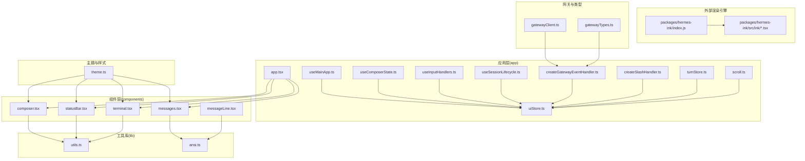
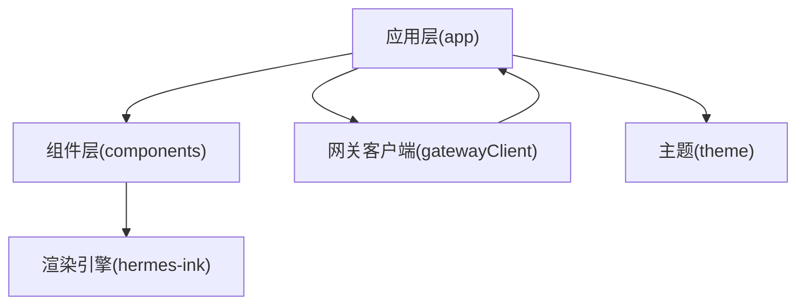
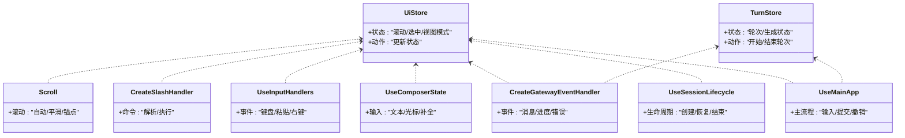
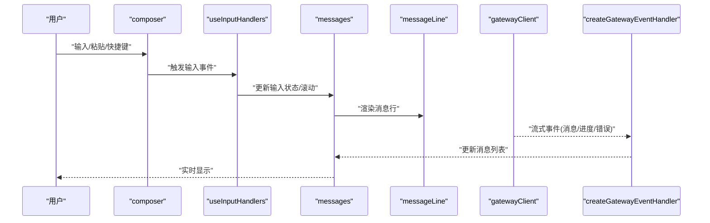
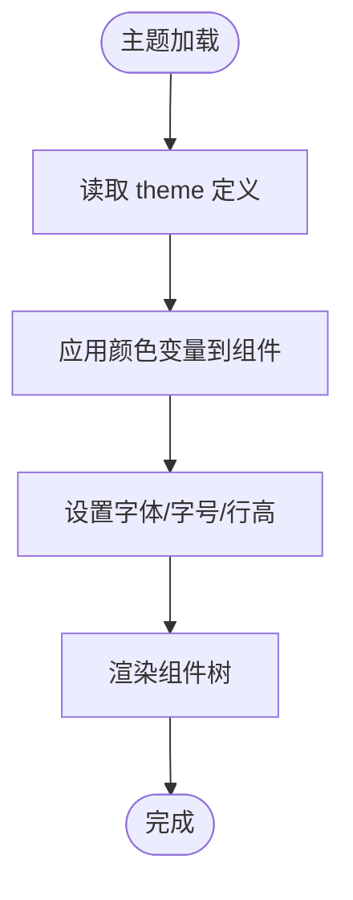
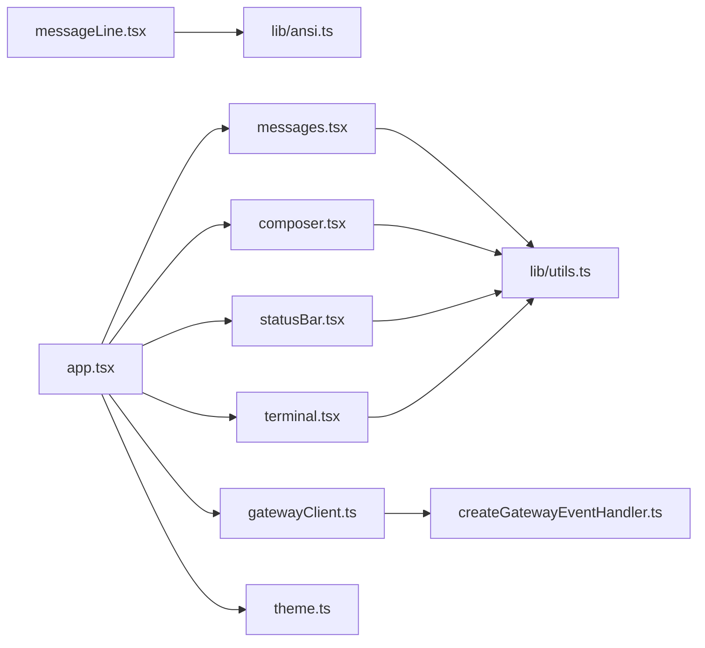

# TUI界面

<cite>
**本文引用的文件**
- [ui-tui/src/app.tsx](file://ui-tui/src/app.tsx)
- [ui-tui/src/entry.tsx](file://ui-tui/src/entry.tsx)
- [ui-tui/src/theme.ts](file://ui-tui/src/theme.ts)
- [ui-tui/src/gatewayClient.ts](file://ui-tui/src/gatewayClient.ts)
- [ui-tui/src/gatewayTypes.ts](file://ui-tui/src/gatewayTypes.ts)
- [ui-tui/src/app/useMainApp.ts](file://ui-tui/src/app/useMainApp.ts)
- [ui-tui/src/app/uiStore.ts](file://ui-tui/src/app/uiStore.ts)
- [ui-tui/src/app/useComposerState.ts](file://ui-tui/src/app/useComposerState.ts)
- [ui-tui/src/app/useInputHandlers.ts](file://ui-tui/src/app/useInputHandlers.ts)
- [ui-tui/src/app/useSessionLifecycle.ts](file://ui-tui/src/app/useSessionLifecycle.ts)
- [ui-tui/src/app/createGatewayEventHandler.ts](file://ui-tui/src/app/createGatewayEventHandler.ts)
- [ui-tui/src/app/createSlashHandler.ts](file://ui-tui/src/app/createSlashHandler.ts)
- [ui-tui/src/app/turnStore.ts](file://ui-tui/src/app/turnStore.ts)
- [ui-tui/src/app/scroll.ts](file://ui-tui/src/app/scroll.ts)
- [ui-tui/src/components/messages.tsx](file://ui-tui/src/components/messages.tsx)
- [ui-tui/src/components/messageLine.tsx](file://ui-tui/src/components/messageLine.tsx)
- [ui-tui/src/components/composer.tsx](file://ui-tui/src/components/composer.tsx)
- [ui-tui/src/components/statusBar.tsx](file://ui-tui/src/components/statusBar.tsx)
- [ui-tui/src/components/terminal.tsx](file://ui-tui/src/components/terminal.tsx)
- [ui-tui/src/lib/utils.ts](file://ui-tui/src/lib/utils.ts)
- [ui-tui/src/lib/ansi.ts](file://ui-tui/src/lib/ansi.ts)
- [ui-tui/packages/hermes-ink/index.js](file://ui-tui/packages/hermes-ink/index.js)
- [ui-tui/packages/hermes-ink/src/ink/Text.tsx](file://ui-tui/packages/hermes-ink/src/ink/Text.tsx)
- [ui-tui/packages/hermes-ink/src/ink/Box.tsx](file://ui-tui/packages/hermes-ink/src/ink/Box.tsx)
- [ui-tui/packages/hermes-ink/src/ink/Flex.tsx](file://ui-tui/packages/hermes-ink/src/ink/Flex.tsx)
- [ui-tui/packages/hermes-ink/src/ink/Static.tsx](file://ui-tui/packages/hermes-ink/src/ink/Static.tsx)
- [ui-tui/packages/hermes-ink/src/ink/Color.tsx](file://ui-tui/packages/hermes-ink/src/ink/Color.tsx)
- [ui-tui/packages/hermes-ink/src/ink/Unicode.tsx](file://ui-tui/packages/hermes-ink/src/ink/Unicode.tsx)
- [ui-tui/packages/hermes-ink/src/ink/TextInput.tsx](file://ui-tui/packages/hermes-ink/src/ink/TextInput.tsx)
- [ui-tui/packages/hermes-ink/src/ink/Static.tsx](file://ui-tui/packages/hermes-ink/src/ink/Static.tsx)
- [ui-tui/packages/hermes-ink/src/ink/Render.tsx](file://ui-tui/packages/hermes-ink/src/ink/Render.tsx)
- [ui-tui/packages/hermes-ink/src/ink/Screen.tsx](file://ui-tui/packages/hermes-ink/src/ink/Screen.tsx)
- [ui-tui/packages/hermes-ink/src/ink/Stdout.tsx](file://ui-tui/packages/hermes-ink/src/ink/Stdout.tsx)
- [ui-tui/packages/hermes-ink/src/ink/Stderr.tsx](file://ui-tui/packages/hermes-ink/src/ink/Stderr.tsx)
- [ui-tui/packages/hermes-ink/src/ink/Stdin.tsx](file://ui-tui/packages/hermes-ink/src/ink/Stdin.tsx)
- [ui-tui/packages/hermes-ink/src/ink/Buffer.tsx](file://ui-tui/packages/hermes-ink/src/ink/Buffer.tsx)
- [ui-tui/packages/hermes-ink/src/ink/Buffer.tsx](file://ui-tui/packages/hermes-ink/src/ink/Buffer.tsx)
- [ui-tui/packages/hermes-ink/src/ink/Buffer.tsx](file://ui-tui/packages/hermes-ink/src/ink/Buffer.tsx)
- [ui-tui/packages/hermes-ink/src/ink/Buffer.tsx](file://ui-tui/packages/hermes-ink/src/ink/Buffer.tsx)
- [ui-tui/packages/hermes-ink/src/ink/Buffer.tsx](file://ui-tui/packages/hermes-ink/src/ink/Buffer.tsx)
- [ui-tui/packages/hermes-ink/src/ink/Buffer.tsx](file://ui-tui/packages/hermes-ink/src/ink/Buffer.tsx)
- [ui-tui/packages/hermes-ink/src/ink/Buffer.tsx](file://ui-tui/packages/hermes-ink/src/ink/Buffer.tsx)
- [ui-tui/packages/hermes-ink/src/ink/Buffer.tsx](file://ui-tui/packages/hermes-ink/src/ink/Buffer.tsx)
- [ui-tui/packages/hermes-ink/src/ink/Buffer.tsx](file://ui-tui/packages/hermes-ink/src/ink/Buffer.tsx)
- [ui-tui/packages/hermes-ink/src/ink/Buffer.tsx](file://ui-tui/packages/hermes-ink/src/ink/Buffer.tsx)
- [ui-tui/packages/hermes-ink/src/ink/Buffer.tsx](file://ui-tui/packages/hermes-ink/src/ink/Buffer.tsx)
- [ui-tui/packages/hermes-ink/src/ink/Buffer.tsx](file://ui-tui/packages/hermes-ink/src/ink/Buffer.tsx)
- [ui-tui/packages/hermes-ink/src/ink/Buffer.tsx](file://ui-tui/packages/hermes-ink/src/ink/Buffer.tsx)
- [ui-tui/packages/hermes-ink/src/ink/Buffer.tsx](file://ui-tui/packages/hermes-ink/src/ink/Buffer.tsx)
- [ui......]
</cite>

## 目录
1. [简介](#简介)
2. [项目结构](#项目结构)
3. [核心组件](#核心组件)
4. [架构总览](#架构总览)
5. [详细组件分析](#详细组件分析)
6. [依赖关系分析](#依赖关系分析)
7. [性能考虑](#性能考虑)
8. [故障排查指南](#故障排查指南)
9. [结论](#结论)
10. [附录](#附录)

## 简介
本文件为 Hermes Agent 文本用户界面（TUI）的综合技术文档，聚焦于基于 React 的终端内核界面实现。文档覆盖组件架构、状态管理与事件处理、实时消息显示与输入处理、主题系统与字体配置、样式定制与响应式设计、无障碍访问与键盘导航、以及性能优化与内存管理等关键方面。读者可据此理解并扩展 TUI 的渲染管线、交互模型与可维护性。

## 项目结构
ui-tui 是一个独立的前端包，采用 TypeScript 构建，核心入口位于应用层，通过自研的“hermes-ink”渲染引擎在终端环境中输出富文本与交互控件。整体结构按功能域划分：应用层（app）、组件层（components）、领域逻辑（domain）、工具库（lib）、协议与类型（protocol/types）、网关客户端（gatewayClient）与主题（theme）。

图表来源
- [ui-tui/src/app.tsx](file://ui-tui/src/app.tsx)
- [ui-tui/src/app/useMainApp.ts](file://ui-tui/src/app/useMainApp.ts)
- [ui-tui/src/app/uiStore.ts](file://ui-tui/src/app/uiStore.ts)
- [ui-tui/src/app/useComposerState.ts](file://ui-tui/src/app/useComposerState.ts)
- [ui-tui/src/app/useInputHandlers.ts](file://ui-tui/src/app/useInputHandlers.ts)
- [ui-tui/src/app/useSessionLifecycle.ts](file://ui-tui/src/app/useSessionLifecycle.ts)
- [ui-tui/src/app/createGatewayEventHandler.ts](file://ui-tui/src/app/createGatewayEventHandler.ts)
- [ui-tui/src/app/createSlashHandler.ts](file://ui-tui/src/app/createSlashHandler.ts)
- [ui-tui/src/app/turnStore.ts](file://ui-tui/src/app/turnStore.ts)
- [ui-tui/src/app/scroll.ts](file://ui-tui/src/app/scroll.ts)
- [ui-tui/src/components/messages.tsx](file://ui-tui/src/components/messages.tsx)
- [ui-tui/src/components/messageLine.tsx](file://ui-tui/src/components/messageLine.tsx)
- [ui-tui/src/components/composer.tsx](file://ui-tui/src/components/composer.tsx)
- [ui-tui/src/components/statusBar.tsx](file://ui-tui/src/components/statusBar.tsx)
- [ui-tui/src/components/terminal.tsx](file://ui-tui/src/components/terminal.tsx)
- [ui-tui/src/lib/utils.ts](file://ui-tui/src/lib/utils.ts)
- [ui-tui/src/lib/ansi.ts](file://ui-tui/src/lib/ansi.ts)
- [ui-tui/packages/hermes-ink/index.js](file://ui-tui/packages/hermes-ink/index.js)
- [ui-tui/packages/hermes-ink/src/ink/Text.tsx](file://ui-tui/packages/hermes-ink/src/ink/Text.tsx)
- [ui-tui/packages/hermes-ink/src/ink/Box.tsx](file://ui-tui/packages/hermes-ink/src/ink/Box.tsx)
- [ui-tui/packages/hermes-ink/src/ink/Flex.tsx](file://ui-tui/packages/hermes-ink/src/ink/Flex.tsx)
- [ui-tui/packages/hermes-ink/src/ink/Static.tsx](file://ui-tui/packages/hermes-ink/src/ink/Static.tsx)
- [ui-tui/packages/hermes-ink/src/ink/Color.tsx](file://ui-tui/packages/hermes-ink/src/ink/Color.tsx)
- [ui-tui/packages/hermes-ink/src/ink/Unicode.tsx](file://ui-tui/packages/hermes-ink/src/ink/Unicode.tsx)
- [ui-tui/packages/hermes-ink/src/ink/TextInput.tsx](file://ui-tui/packages/hermes-ink/src/ink/TextInput.tsx)
- [ui-tui/packages/hermes-ink/src/ink/Render.tsx](file://ui-tui/packages/hermes-ink/src/ink/Render.tsx)
- [ui-tui/packages/hermes-ink/src/ink/Screen.tsx](file://ui-tui/packages/hermes-ink/src/ink/Screen.tsx)
- [ui-tui/packages/hermes-ink/src/ink/Stdout.tsx](file://ui-tui/packages/hermes-ink/src/ink/Stdout.tsx)
- [ui-tui/packages/hermes-ink/src/ink/Stderr.tsx](file://ui-tui/packages/hermes-ink/src/ink/Stderr.tsx)
- [ui-tui/packages/hermes-ink/src/ink/Stdin.tsx](file://ui-tui/packages/hermes-ink/src/ink/Stdin.tsx)
- [ui-tui/packages/hermes-ink/src/ink/Buffer.tsx](file://ui-tui/packages/hermes-ink/src/ink/Buffer.tsx)
- [ui-tui/src/gatewayClient.ts](file://ui-tui/src/gatewayClient.ts)
- [ui-tui/src/gatewayTypes.ts](file://ui-tui/src/gatewayTypes.ts)
- [ui-tui/src/theme.ts](file://ui-tui/src/theme.ts)

章节来源
- [ui-tui/src/app.tsx](file://ui-tui/src/app.tsx)
- [ui-tui/src/entry.tsx](file://ui-tui/src/entry.tsx)
- [ui-tui/src/theme.ts](file://ui-tui/src/theme.ts)
- [ui-tui/src/gatewayClient.ts](file://ui-tui/src/gatewayClient.ts)
- [ui-tui/src/gatewayTypes.ts](file://ui-tui/src/gatewayTypes.ts)

## 核心组件
- 应用根组件与入口
  - 应用根组件负责装配所有子组件与状态层，协调渲染与事件流。
  - 入口文件负责初始化渲染环境与启动应用生命周期。
- 状态与会话
  - uiStore 统一管理界面状态；turnStore 管理对话轮次；useSessionLifecycle 负责会话生命周期；useMainApp 提供主流程钩子。
- 输入与组合器
  - useComposerState 管理输入状态；useInputHandlers 处理键盘与快捷键；composer 组件承载输入区域与提交行为。
- 消息与渲染
  - messages 与 messageLine 负责消息列表与单行渲染；terminal 提供终端容器；statusBar 展示状态栏信息。
- 渲染引擎
  - hermes-ink 提供终端友好的 React 组件集合（Text、Box、Flex、Static、Color、Unicode、TextInput 等），并封装渲染、屏幕、缓冲区与标准流。

章节来源
- [ui-tui/src/app.tsx](file://ui-tui/src/app.tsx)
- [ui-tui/src/entry.tsx](file://ui-tui/src/entry.tsx)
- [ui-tui/src/app/uiStore.ts](file://ui-tui/src/app/uiStore.ts)
- [ui-tui/src/app/turnStore.ts](file://ui-tui/src/app/turnStore.ts)
- [ui-tui/src/app/useSessionLifecycle.ts](file://ui-tui/src/app/useSessionLifecycle.ts)
- [ui-tui/src/app/useMainApp.ts](file://ui-tui/src/app/useMainApp.ts)
- [ui-tui/src/app/useComposerState.ts](file://ui-tui/src/app/useComposerState.ts)
- [ui-tui/src/app/useInputHandlers.ts](file://ui-tui/src/app/useInputHandlers.ts)
- [ui-tui/src/components/messages.tsx](file://ui-tui/src/components/messages.tsx)
- [ui-tui/src/components/messageLine.tsx](file://ui-tui/src/components/messageLine.tsx)
- [ui-tui/src/components/composer.tsx](file://ui-tui/src/components/composer.tsx)
- [ui-tui/src/components/statusBar.tsx](file://ui-tui/src/components/statusBar.tsx)
- [ui-tui/src/components/terminal.tsx](file://ui-tui/src/components/terminal.tsx)
- [ui-tui/packages/hermes-ink/index.js](file://ui-tui/packages/hermes-ink/index.js)

## 架构总览
TUI 采用“应用层 + 组件层 + 渲染引擎”的分层架构。应用层通过状态与事件处理器驱动组件层渲染；组件层调用 hermes-ink 的终端组件进行输出；网关客户端负责与后端通信，事件驱动界面更新；主题系统统一控制颜色与排版。

图表来源
- [ui-tui/src/app.tsx](file://ui-tui/src/app.tsx)
- [ui-tui/src/components/messages.tsx](file://ui-tui/src/components/messages.tsx)
- [ui-tui/src/components/composer.tsx](file://ui-tui/src/components/composer.tsx)
- [ui-tui/src/gatewayClient.ts](file://ui-tui/src/gatewayClient.ts)
- [ui-tui/src/theme.ts](file://ui-tui/src/theme.ts)
- [ui-tui/packages/hermes-ink/index.js](file://ui-tui/packages/hermes-ink/index.js)

## 详细组件分析

### 应用层与状态管理
- uiStore：集中式界面状态（如滚动位置、选中项、视图模式等），被多个组件与钩子订阅。
- turnStore：对话轮次状态（当前轮次、历史轮次、是否正在生成等），用于驱动消息渲染与输入禁用策略。
- useSessionLifecycle：会话创建、恢复、结束与错误恢复的生命周期钩子。
- useMainApp：主流程钩子，协调输入、提交、回车换行、撤销重做等。
- useComposerState：输入框状态（文本、光标、补全候选、附件等）。
- useInputHandlers：键盘事件处理（上下文切换、快捷键、粘贴、右键菜单等）。
- createGatewayEventHandler：将网关事件映射为 UI 动作（新增消息、更新进度、错误提示等）。
- createSlashHandler：斜杠命令解析与执行（如 /clear、/help、/theme 等）。
- scroll：滚动控制（自动滚动、平滑滚动、锚点定位）。

图表来源
- [ui-tui/src/app/uiStore.ts](file://ui-tui/src/app/uiStore.ts)
- [ui-tui/src/app/turnStore.ts](file://ui-tui/src/app/turnStore.ts)
- [ui-tui/src/app/useSessionLifecycle.ts](file://ui-tui/src/app/useSessionLifecycle.ts)
- [ui-tui/src/app/useMainApp.ts](file://ui-tui/src/app/useMainApp.ts)
- [ui-tui/src/app/useComposerState.ts](file://ui-tui/src/app/useComposerState.ts)
- [ui-tui/src/app/useInputHandlers.ts](file://ui-tui/src/app/useInputHandlers.ts)
- [ui-tui/src/app/createGatewayEventHandler.ts](file://ui-tui/src/app/createGatewayEventHandler.ts)
- [ui-tui/src/app/createSlashHandler.ts](file://ui-tui/src/app/createSlashHandler.ts)
- [ui-tui/src/app/scroll.ts](file://ui-tui/src/app/scroll.ts)

章节来源
- [ui-tui/src/app/uiStore.ts](file://ui-tui/src/app/uiStore.ts)
- [ui-tui/src/app/turnStore.ts](file://ui-tui/src/app/turnStore.ts)
- [ui-tui/src/app/useSessionLifecycle.ts](file://ui-tui/src/app/useSessionLifecycle.ts)
- [ui-tui/src/app/useMainApp.ts](file://ui-tui/src/app/useMainApp.ts)
- [ui-tui/src/app/useComposerState.ts](file://ui-tui/src/app/useComposerState.ts)
- [ui-tui/src/app/useInputHandlers.ts](file://ui-tui/src/app/useInputHandlers.ts)
- [ui-tui/src/app/createGatewayEventHandler.ts](file://ui-tui/src/app/createGatewayEventHandler.ts)
- [ui-tui/src/app/createSlashHandler.ts](file://ui-tui/src/app/createSlashHandler.ts)
- [ui-tui/src/app/scroll.ts](file://ui-tui/src/app/scroll.ts)

### 实时消息显示与输入处理
- 消息渲染
  - messages 负责消息列表渲染，支持分页、虚拟化与增量更新。
  - messageLine 负责单条消息的格式化与 ANSI 高亮。
- 输入处理
  - composer 承载输入区域，集成补全、粘贴、多行编辑与提交。
  - useInputHandlers 将键盘事件转换为应用动作（如上下移动、选择补全、提交等）。
- 网关事件
  - gatewayClient 接收后端流式事件，createGatewayEventHandler 将事件转化为 UI 更新（新增消息、更新进度、错误提示）。

图表来源
- [ui-tui/src/components/composer.tsx](file://ui-tui/src/components/composer.tsx)
- [ui-tui/src/app/useInputHandlers.ts](file://ui-tui/src/app/useInputHandlers.ts)
- [ui-tui/src/components/messages.tsx](file://ui-tui/src/components/messages.tsx)
- [ui-tui/src/components/messageLine.tsx](file://ui-tui/src/components/messageLine.tsx)
- [ui-tui/src/gatewayClient.ts](file://ui-tui/src/gatewayClient.ts)
- [ui-tui/src/app/createGatewayEventHandler.ts](file://ui-tui/src/app/createGatewayEventHandler.ts)

章节来源
- [ui-tui/src/components/composer.tsx](file://ui-tui/src/components/composer.tsx)
- [ui-tui/src/app/useInputHandlers.ts](file://ui-tui/src/app/useInputHandlers.ts)
- [ui-tui/src/components/messages.tsx](file://ui-tui/src/components/messages.tsx)
- [ui-tui/src/components/messageLine.tsx](file://ui-tui/src/components/messageLine.tsx)
- [ui-tui/src/gatewayClient.ts](file://ui-tui/src/gatewayClient.ts)
- [ui-tui/src/app/createGatewayEventHandler.ts](file://ui-tui/src/app/createGatewayEventHandler.ts)

### 主题系统、字体与颜色方案
- 主题定义
  - theme 提供颜色变量、字体大小、行高、边距等基础样式参数，供组件消费。
- 字体与字符集
  - hermes-ink 的 Unicode 组件支持终端字符集渲染；ANSI 工具负责颜色与样式转义。
- 组件级样式
  - Text/Color/Box/Flex/Static 等组件通过 props 控制颜色、背景、对齐、布局与可见性。

图表来源
- [ui-tui/src/theme.ts](file://ui-tui/src/theme.ts)
- [ui-tui/src/lib/ansi.ts](file://ui-tui/src/lib/ansi.ts)
- [ui-tui/packages/hermes-ink/src/ink/Color.tsx](file://ui-tui/packages/hermes-ink/src/ink/Color.tsx)
- [ui-tui/packages/hermes-ink/src/ink/Text.tsx](file://ui-tui/packages/hermes-ink/src/ink/Text.tsx)
- [ui-tui/packages/hermes-ink/src/ink/Unicode.tsx](file://ui-tui/packages/hermes-ink/src/ink/Unicode.tsx)

章节来源
- [ui-tui/src/theme.ts](file://ui-tui/src/theme.ts)
- [ui-tui/src/lib/ansi.ts](file://ui-tui/src/lib/ansi.ts)
- [ui-tui/packages/hermes-ink/src/ink/Color.tsx](file://ui-tui/packages/hermes-ink/src/ink/Color.tsx)
- [ui-tui/packages/hermes-ink/src/ink/Text.tsx](file://ui-tui/packages/hermes-ink/src/ink/Text.tsx)
- [ui-tui/packages/hermes-ink/src/ink/Unicode.tsx](file://ui-tui/packages/hermes-ink/src/ink/Unicode.tsx)

### 组件API参考与样式定制
- hermes-ink 组件族
  - Text：文本渲染与颜色。
  - Box/Flex：布局容器与弹性布局。
  - Static：静态内容渲染（不参与滚动）。
  - Color：颜色包装。
  - Unicode：Unicode 字符与表情渲染。
  - TextInput：终端输入控件（光标、补全、粘贴）。
  - Screen/Render/Stdout/Stderr/Stdin/Buffer：底层渲染与流控制。
- 自定义样式建议
  - 使用 theme 中的颜色变量与尺寸常量，避免硬编码。
  - 对复杂布局优先使用 Flex/Box，减少绝对定位。
  - 文本高亮与错误提示使用 Color 包裹，确保跨终端一致性。

章节来源
- [ui-tui/packages/hermes-ink/index.js](file://ui-tui/packages/hermes-ink/index.js)
- [ui-tui/packages/hermes-ink/src/ink/Text.tsx](file://ui-tui/packages/hermes-ink/src/ink/Text.tsx)
- [ui-tui/packages/hermes-ink/src/ink/Box.tsx](file://ui-tui/packages/hermes-ink/src/ink/Box.tsx)
- [ui-tui/packages/hermes-ink/src/ink/Flex.tsx](file://ui-tui/packages/hermes-ink/src/ink/Flex.tsx)
- [ui-tui/packages/hermes-ink/src/ink/Static.tsx](file://ui-tui/packages/hermes-ink/src/ink/Static.tsx)
- [ui-tui/packages/hermes-ink/src/ink/Color.tsx](file://ui-tui/packages/hermes-ink/src/ink/Color.tsx)
- [ui-tui/packages/hermes-ink/src/ink/Unicode.tsx](file://ui-tui/packages/hermes-ink/src/ink/Unicode.tsx)
- [ui-tui/packages/hermes-ink/src/ink/TextInput.tsx](file://ui-tui/packages/hermes-ink/src/ink/TextInput.tsx)
- [ui-tui/packages/hermes-ink/src/ink/Render.tsx](file://ui-tui/packages/hermes-ink/src/ink/Render.tsx)
- [ui-tui/packages/hermes-ink/src/ink/Screen.tsx](file://ui-tui/packages/hermes-ink/src/ink/Screen.tsx)
- [ui-tui/packages/hermes-ink/src/ink/Stdout.tsx](file://ui-tui/packages/hermes-ink/src/ink/Stdout.tsx)
- [ui-tui/packages/hermes-ink/src/ink/Stderr.tsx](file://ui-tui/packages/hermes-ink/src/ink/Stderr.tsx)
- [ui-tui/packages/hermes-ink/src/ink/Stdin.tsx](file://ui-tui/packages/hermes-ink/src/ink/Stdin.tsx)
- [ui-tui/packages/hermes-ink/src/ink/Buffer.tsx](file://ui-tui/packages/hermes-ink/src/ink/Buffer.tsx)

### 响应式设计与布局
- 弹性布局
  - 使用 Flex/Box 实现自适应布局，根据终端宽度调整列宽与换行。
- 滚动与虚拟化
  - 消息列表采用虚拟化与增量更新，结合滚动锚点保持体验稳定。
- 终端适配
  - 通过 Unicode 与 ANSI 支持不同字符集与颜色深度，保证在不同终端下的可读性。

章节来源
- [ui-tui/src/components/messages.tsx](file://ui-tui/src/components/messages.tsx)
- [ui-tui/src/app/scroll.ts](file://ui-tui/src/app/scroll.ts)
- [ui-tui/packages/hermes-ink/src/ink/Flex.tsx](file://ui-tui/packages/hermes-ink/src/ink/Flex.tsx)
- [ui-tui/packages/hermes-ink/src/ink/Box.tsx](file://ui-tui/packages/hermes-ink/src/ink/Box.tsx)
- [ui-tui/src/lib/ansi.ts](file://ui-tui/src/lib/ansi.ts)

### 无障碍访问、键盘导航与屏幕阅读器兼容
- 键盘导航
  - useInputHandlers 提供上下移动、补全选择、提交与撤销等键盘操作。
- 屏幕阅读器
  - 组件尽量使用语义化文本与颜色区分，避免仅依赖颜色传达信息。
- 可访问性建议
  - 为关键按钮与输入框提供清晰的标签与提示。
  - 在错误与状态提示中使用明确的文本描述。

章节来源
- [ui-tui/src/app/useInputHandlers.ts](file://ui-tui/src/app/useInputHandlers.ts)
- [ui-tui/packages/hermes-ink/src/ink/Text.tsx](file://ui-tui/packages/hermes-ink/src/ink/Text.tsx)

## 依赖关系分析
- 组件耦合
  - 组件层与应用层通过状态与钩子解耦，降低直接依赖。
  - hermes-ink 作为渲染层独立于业务逻辑，便于替换与升级。
- 外部依赖
  - 网关客户端与事件处理器是数据入口，驱动 UI 更新。
  - ANSI/Unicode 工具与主题系统影响渲染一致性与可读性。

图表来源
- [ui-tui/src/components/messages.tsx](file://ui-tui/src/components/messages.tsx)
- [ui-tui/src/components/messageLine.tsx](file://ui-tui/src/components/messageLine.tsx)
- [ui-tui/src/components/composer.tsx](file://ui-tui/src/components/composer.tsx)
- [ui-tui/src/components/statusBar.tsx](file://ui-tui/src/components/statusBar.tsx)
- [ui-tui/src/components/terminal.tsx](file://ui-tui/src/components/terminal.tsx)
- [ui-tui/src/lib/utils.ts](file://ui-tui/src/lib/utils.ts)
- [ui-tui/src/lib/ansi.ts](file://ui-tui/src/lib/ansi.ts)
- [ui-tui/src/app.tsx](file://ui-tui/src/app.tsx)
- [ui-tui/src/gatewayClient.ts](file://ui-tui/src/gatewayClient.ts)
- [ui-tui/src/app/createGatewayEventHandler.ts](file://ui-tui/src/app/createGatewayEventHandler.ts)
- [ui-tui/src/theme.ts](file://ui-tui/src/theme.ts)

章节来源
- [ui-tui/src/app.tsx](file://ui-tui/src/app.tsx)
- [ui-tui/src/gatewayClient.ts](file://ui-tui/src/gatewayClient.ts)
- [ui-tui/src/app/createGatewayEventHandler.ts](file://ui-tui/src/app/createGatewayEventHandler.ts)
- [ui-tui/src/theme.ts](file://ui-tui/src/theme.ts)
- [ui-tui/src/lib/utils.ts](file://ui-tui/src/lib/utils.ts)
- [ui-tui/src/lib/ansi.ts](file://ui-tui/src/lib/ansi.ts)

## 性能考虑
- 渲染优化
  - 消息列表采用虚拟化与增量更新，减少重绘范围。
  - 使用滚动锚点与平滑滚动，避免频繁布局抖动。
- 内存管理
  - 合理清理事件监听与定时器，避免内存泄漏。
  - 对长历史记录进行分页或归档，限制内存占用。
- 输入处理
  - 输入防抖与节流，避免高频事件导致的卡顿。
  - 合理拆分大文本的渲染与计算，分片处理。
- 渲染引擎
  - 利用 hermes-ink 的静态渲染与缓冲区复用，降低终端刷新开销。

章节来源
- [ui-tui/src/components/messages.tsx](file://ui-tui/src/components/messages.tsx)
- [ui-tui/src/app/scroll.ts](file://ui-tui/src/app/scroll.ts)
- [ui-tui/src/lib/utils.ts](file://ui-tui/src/lib/utils.ts)

## 故障排查指南
- 网关连接问题
  - 检查 gatewayClient 的连接状态与重连策略；确认 createGatewayEventHandler 是否正确注册事件。
- 消息渲染异常
  - 检查 messageLine 的 ANSI 转义与 Unicode 渲染；确认主题颜色变量是否生效。
- 输入无响应
  - 核对 useInputHandlers 的事件绑定与快捷键冲突；确认 composer 的焦点状态。
- 滚动错位
  - 检查 scroll 的锚点逻辑与虚拟化高度缓存；确认消息列表更新时机。

章节来源
- [ui-tui/src/gatewayClient.ts](file://ui-tui/src/gatewayClient.ts)
- [ui-tui/src/app/createGatewayEventHandler.ts](file://ui-tui/src/app/createGatewayEventHandler.ts)
- [ui-tui/src/components/messageLine.tsx](file://ui-tui/src/components/messageLine.tsx)
- [ui-tui/src/app/useInputHandlers.ts](file://ui-tui/src/app/useInputHandlers.ts)
- [ui-tui/src/components/composer.tsx](file://ui-tui/src/components/composer.tsx)
- [ui-tui/src/app/scroll.ts](file://ui-tui/src/app/scroll.ts)

## 结论
本 TUI 以 hermes-ink 为渲染基石，结合应用层的状态与事件处理，实现了高性能、可扩展且具备良好可访问性的终端内核界面。通过主题系统与组件化设计，开发者可在保证一致性的前提下快速迭代功能与样式。

## 附录
- 关键文件索引
  - 应用入口与根组件：[ui-tui/src/entry.tsx](file://ui-tui/src/entry.tsx)、[ui-tui/src/app.tsx](file://ui-tui/src/app.tsx)
  - 网关与类型：[ui-tui/src/gatewayClient.ts](file://ui-tui/src/gatewayClient.ts)、[ui-tui/src/gatewayTypes.ts](file://ui-tui/src/gatewayTypes.ts)
  - 主题：[ui-tui/src/theme.ts](file://ui-tui/src/theme.ts)
  - 渲染引擎：[ui-tui/packages/hermes-ink/index.js](file://ui-tui/packages/hermes-ink/index.js)
  - 组件：messages、messageLine、composer、statusBar、terminal
  - 工具：utils、ansi