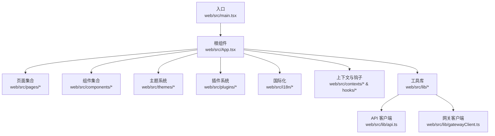
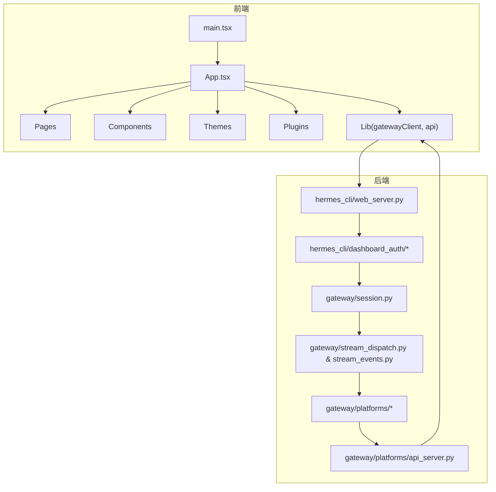
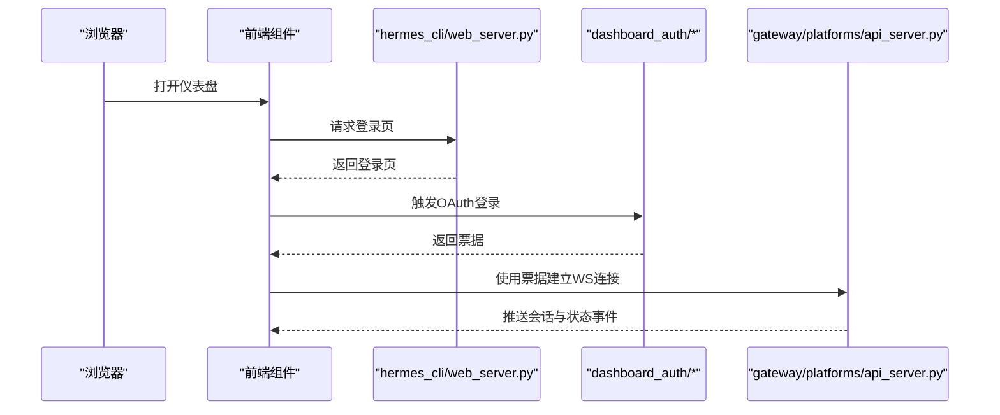
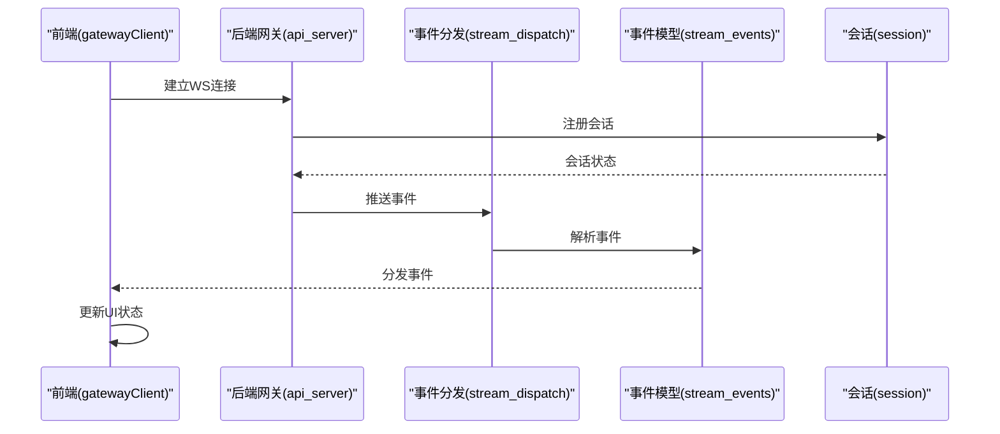
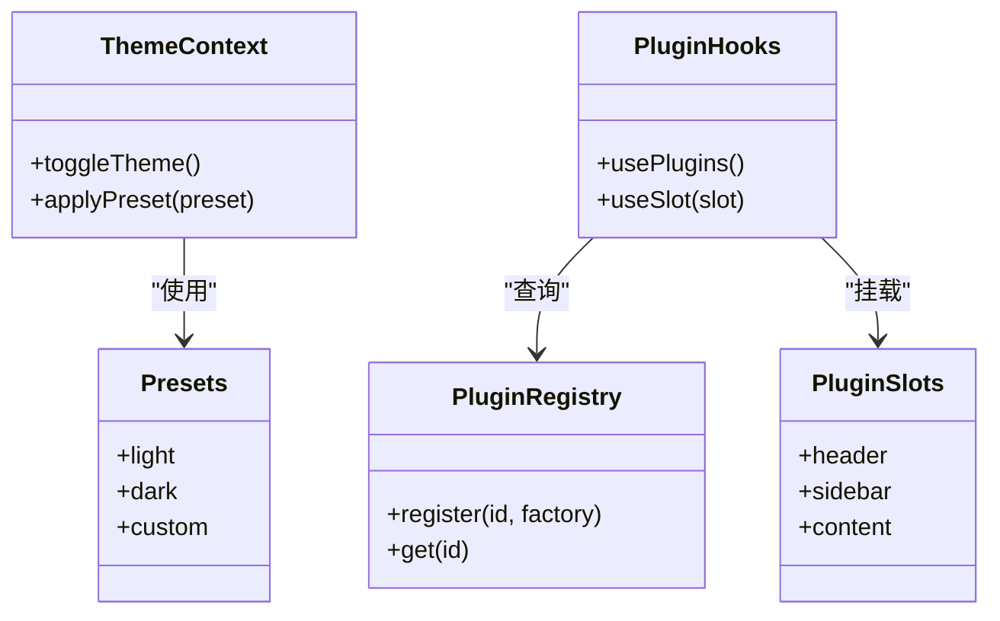
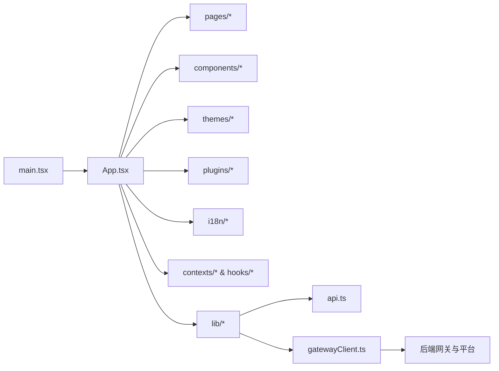

# Web界面

<cite>
**本文引用的文件**
- [web/src/main.tsx](file://web/src/main.tsx)
- [web/src/App.tsx](file://web/src/App.tsx)
- [web/src/pages/ChatPage.tsx](file://web/src/pages/ChatPage.tsx)
- [web/src/components/AuthWidget.tsx](file://web/src/components/AuthWidget.tsx)
- [web/src/components/OAuthLoginModal.tsx](file://web/src/components/OAuthLoginModal.tsx)
- [web/src/components/OAuthProvidersCard.tsx](file://web/src/components/OAuthProvidersCard.tsx)
- [web/src/lib/dashboard-flags.ts](file://web/src/lib/dashboard-flags.ts)
- [web/src/lib/gatewayClient.ts](file://web/src/lib/gatewayClient.ts)
- [web/src/lib/api.ts](file://web/src/lib/api.ts)
- [web/src/hooks/useModalBehavior.ts](file://web/src/hooks/useModalBehavior.ts)
- [web/src/hooks/useSidebarStatus.ts](file://web/src/hooks/useSidebarStatus.ts)
- [web/src/contexts/page-header-context.ts](file://web/src/contexts/page-header-context.ts)
- [web/src/contexts/system-actions-context.ts](file://web/src/contexts/system-actions-context.ts)
- [web/src/themes/index.ts](file://web/src/themes/index.ts)
- [web/src/themes/presets.ts](file://web/src/themes/presets.ts)
- [web/src/plugins/index.ts](file://web/src/plugins/index.ts)
- [web/src/plugins/registry.ts](file://web/src/plugins/registry.ts)
- [web/src/plugins/slots.ts](file://web/src/plugins/slots.ts)
- [web/src/plugins/types.ts](file://web/src/plugins/types.ts)
- [web/src/plugins/usePlugins.ts](file://web/src/plugins/usePlugins.ts)
- [web/package.json](file://web/package.json)
- [web/vite.config.ts](file://web/vite.config.ts)
- [web/tsconfig.app.json](file://web/tsconfig.app.json)
- [web/index.html](file://web/index.html)
- [hermes_cli/dashboard_auth/login_page.py](file://hermes_cli/dashboard_auth/login_page.py)
- [hermes_cli/dashboard_auth/ws_tickets.py](file://hermes_cli/dashboard_auth/ws_tickets.py)
- [hermes_cli/dashboard_auth/public_paths.py](file://hermes_cli/dashboard_auth/public_paths.py)
- [hermes_cli/dashboard_auth/middleware.py](file://hermes_cli/dashboard_auth/middleware.py)
- [hermes_cli/web_server.py](file://hermes_cli/web_server.py)
- [gateway/platforms/api_server.py](file://gateway/platforms/api_server.py)
- [gateway/session.py](file://gateway/session.py)
- [gateway/stream_dispatch.py](file://gateway/stream_dispatch.py)
- [gateway/stream_events.py](file://gateway/stream_events.py)
- [gateway/status.py](file://gateway/status.py)
- [gateway/display_config.py](file://gateway/display_config.py)
- [gateway/platforms/base.py](file://gateway/platforms/base.py)
- [gateway/platforms/helpers.py](file://gateway/platforms/helpers.py)
- [gateway/platforms/_http_client_limits.py](file://gateway/platforms/_http_client_limits.py)
- [gateway/platforms/telegram.py](file://gateway/platforms/telegram.py)
- [gateway/platforms/slack.py](file://gateway/platforms/slack.py)
- [gateway/platforms/email.py](file://gateway/platforms/email.py)
- [gateway/platforms/feishu.py](file://gateway/platforms/feishu.py)
- [gateway/platforms/weixin.py](file://gateway/platforms/weixin.py)
- [gateway/platforms/whatsapp.py](file://gateway/platforms/whatsapp.py)
- [gateway/platforms/bluebubbles.py](file://gateway/platforms/bluebubbles.py)
- [gateway/platforms/dingtalk.py](file://gateway/platforms/dingtalk.py)
- [gateway/platforms/signal.py](file://gateway/platforms/signal.py)
- [gateway/platforms/matrix.py](file://gateway/platforms/matrix.py)
- [gateway/platforms/webhook.py](file://gateway/platforms/webhook.py)
- [gateway/platforms/yuanbao.py](file://gateway/platforms/yuanbao.py)
- [gateway/platforms/msgraph_webhook.py](file://gateway/platforms/msgraph_webhook.py)
- [gateway/platforms/qqbot.py](file://gateway/platforms/qqbot.py)
- [gateway/platforms/wecom.py](file://gateway/platforms/wecom.py)
- [gateway/platforms/feishu_comment.py](file://gateway/platforms/feishu_comment.py)
- [gateway/platforms/feishu_comment_rules.py](file://gateway/platforms/feishu_comment_rules.py)
- [gateway/platforms/feishu_meeting_invite.py](file://gateway/platforms/feishu_meeting_invite.py)
- [gateway/platforms/yuanbao_media.py](file://gateway/platforms/yuanbao_media.py)
- [gateway/platforms/yuanbao_proto.py](file://gateway/platforms/yuanbao_proto.py)
- [gateway/platforms/yuanbao_sticker.py](file://gateway/platforms/yuanbao_sticker.py)
- [gateway/platforms/whatsapp_identity.py](file://gateway/platforms/whatsapp_identity.py)
- [gateway/platforms/signal_rate_limit.py](file://gateway/platforms/signal_rate_limit.py)
- [gateway/platforms/telegram_network.py](file://gateway/platforms/telegram_network.py)
- [gateway/platforms/webhook.py](file://gateway/platforms/webhook.py)
- [gateway/platforms/yuanbao.py](file://gateway/platforms/yuanbao.py)
- [gateway/platforms/msgraph_webhook.py](file://gateway/platforms/msgraph_webhook.py)
- [gateway/platforms/qqbot.py](file://gateway/platforms/qqbot.py)
- [gateway/platforms/wecom.py](file://gateway/platforms/wecom.py)
- [gateway/platforms/feishu.py](file://gateway/platforms/feishu.py)
- [gateway/platforms/weixin.py](file://gateway/platforms/weixin.py)
- [gateway/platforms/whatsapp.py](file://gateway/platforms/whatsapp.py)
- [gateway/platforms/bluebubbles.py](file://gateway/platforms/bluebubbles.py)
- [gateway/platforms/dingtalk.py](file://gateway/platforms/dingtalk.py)
- [gateway/platforms/signal.py](file://gateway/platforms/signal.py)
- [gateway/platforms/matrix.py](file://gateway/platforms/matrix.py)
- [gateway/platforms/webhook.py](file://gateway/platforms/webhook.py)
- [gateway/platforms/yuanbao.py](file://gateway/platforms/yuanbao.py)
- [gateway/platforms/msgraph_webhook.py](file://gateway/platforms/msgraph_webhook.py)
- [gateway/platforms/qqbot.py](file://gateway/platforms/qqbot.py)
- [gateway/platforms/wecom.py](file://gateway/platforms/wecom.py)
- [gateway/platforms/feishu.py](file://gateway/platforms/feishu.py)
- [gateway/platforms/weixin.py](file://gateway/platforms/weixin.py)
- [gateway/platforms/whatsapp.py](file://gateway/platforms/whatsapp.py)
- [gateway/platforms/bluebubbles.py](file://gateway/platforms/bluebubbles.py)
- [gateway/platforms/dingtalk.py](file://gateway/platforms/dingtalk.py)
- [gateway/platforms/signal.py](file://gateway/platforms/signal.py)
- [gateway/platforms/matrix.py](file://gateway/platforms/matrix.py)
- [gateway/platforms/webhook.py](file://gateway/platforms/webhook.py)
- [gateway/platforms/yuanbao.py](file://gateway/platforms/yuanbao.py)
- [gateway/platforms/msgraph_webhook.py](file://gateway/platforms/msgraph_webhook.py)
- [gateway/platforms/qqbot.py](file://gateway/platforms/qqbot.py)
- [gateway/platforms/wecom.py](file://gateway/platforms/wecom.py)
- [gateway/platforms/feishu.py](file://gateway/platforms/feishu.py)
- [gateway/platforms/weixin.py](file://gateway/platforms/weixin.py)
- [gateway/platforms/whatsapp.py](file://gateway/platforms/whatsapp.py)
- [gateway/platforms/bluebubbles.py](file://gateway/platforms/bluebubbles.py)
- [gateway/platforms/dingtalk.py](file://gateway/platforms/dingtalk.py)
- [gateway/platforms/signal.py](file://gateway/platforms/signal.py)
- [gateway/platforms/matrix.py](file://gateway/platforms/matrix.py)
- [gateway/platforms/webhook.py](file://gateway/platforms/webhook.py)
- [gateway/platforms/yuanbao.py](file://gateway/platforms/yuanbao.py)
- [gateway/platforms/msgraph_webhook.py](file://gateway/platforms/msgraph_webhook.py)
- [gateway/platforms/qqbot.py](file://gateway/platforms/qqbot.py)
- [gateway/platforms/wecom.py](file://gateway/platforms/wecom.py)
- [gateway/platforms/feishu.py](file://gateway/platforms/feishu.py)
- [gateway/platforms/weixin.py](file://gateway/platforms/weixin.py)
- [gateway/platforms/whatsapp.py](file://gateway/platforms/whatsapp.py)
- [gateway/platforms/bluebubbles.py](file://gateway/platforms/bluebubbles.py)
- [gateway/platforms/dingtalk.py](file://gateway/platforms/dingtalk.py)
- [gateway/platforms/signal.py](file://gateway/platforms/signal.py)
- [gateway/platforms/matrix.py](file://gateway/platforms/matrix.py)
- [gateway/platforms/webhook.py](file://gateway/platforms/webhook.py)
- [gateway/platforms/yuanbao.py](file://gateway/platforms/yuanbao.py)
- [gateway/platforms/msgraph_webhook.py](file://gateway/platforms/msgraph_webhook.py)
- [gateway/platforms/qqbot.py](file://gateway/platforms/qqbot.py)
- [gateway/platforms/wecom.py](file://gateway/platforms/wecom.py)
- [gateway/platforms/feishu.py](file://gateway/platforms/feishu.py)
- [gateway/platforms/weixin.py](file://gateway/platforms/weixin.py)
- [gateway/platforms/whatsapp.py](file://gateway/platforms/whatsapp.py)
- [gateway/platforms/bluebubbles.py](file://gateway/platforms/bluebubbles.py)
- [gateway/platforms/dingtalk.py](file://gateway/platforms/dingtalk.py)
- [gateway/platforms/signal.py](file://gateway/platforms/signal.py)
- [gateway/platforms/matrix.py](file://gateway/platforms/matrix.py)
- [gateway/platforms/webhook.py](file://gateway/platforms/webhook.py)
- [gateway/platforms/yuanbao.py](file://gateway/platforms/yuanbao.py)
- [gateway/platforms/msgraph_webhook.py](file://gateway/platforms/msgraph_webhook.py)
- [gateway/platforms/qqbot.py](file://gateway/platforms/qqbot.py)
- [gateway/platforms/wecom.py](file://gateway/platforms/wecom.py)
- [gateway/platforms/feishu.py](file://gateway/platforms/feishu.py)
- [gateway/platforms/weixin.py](file://gateway/platforms/weixin.py)
- [gateway/platforms/whatsapp.py](file://gateway/platforms/whatsapp.py)
- [gateway/platforms/bluebubbles.py](file://gateway/platforms/bluebubbles.py)
- [gateway/platforms/dingtalk.py](file://gateway/platforms/dingtalk.py)
- [gateway/platforms/signal.py](file://gateway/platforms/signal.py)
- [gateway/platforms/matrix.py](file://gateway/platforms/matrix.py)
- [gateway/platforms/webhook.py](file://gateway/platforms/webhook.py)
- [gateway/platforms/yuanbao.py](file://gateway/platforms/yuanbao.py)
- [gateway/platforms/msgraph_webhook.py](file://gateway/platforms/msgraph_webhook.py)
- [gateway/platforms/qqbot.py](file://gateway/platforms/qqbot.py)
- [gateway/platforms/wecom.py](file://gateway/platforms/wecom.py)
- [gateway/platforms/feishu.py](file://gateway/platforms/feishu.py)
- [gateway/platforms/weixin.py](file://gateway/platforms/weixin.py)
- [gateway/platforms/whatsapp.py](file://gateway/platforms/whatsapp.py)
- [gateway/platforms/blue......]
</cite>

## 目录
1. [简介](#简介)
2. [项目结构](#项目结构)
3. [核心组件](#核心组件)
4. [架构总览](#架构总览)
5. [详细组件分析](#详细组件分析)
6. [依赖关系分析](#依赖关系分析)
7. [性能考量](#性能考量)
8. [故障排查指南](#故障排查指南)
9. [结论](#结论)
10. [附录](#附录)

## 简介
本文件为 Hermes Agent 的 Web 用户界面技术文档，聚焦于基于 React 的现代化前端应用，涵盖路由与页面组织、状态管理与组件通信、实时 WebSocket 连接与消息推送、用户认证与会话管理、权限控制、响应式设计与移动端适配、跨浏览器兼容性、API 集成与第三方服务对接、扩展开发指南以及安全、性能监控与用户体验优化策略。文档以仓库中实际存在的源码为依据，避免臆测，确保可追溯性。

## 项目结构
前端工程位于 web 目录，采用 Vite + TypeScript + React 技术栈，主要模块包括：
- 入口与根组件：main.tsx、App.tsx
- 页面层：pages 下的各功能页面（如 ChatPage、AnalyticsPage、ChannelsPage 等）
- 组件层：components 下的通用 UI 组件（如 AuthWidget、OAuthLoginModal、ChatSidebar 等）
- 工具与库：lib 下的 API 客户端、网关客户端、格式化工具等
- 主题系统：themes 下的主题上下文与预设
- 插件系统：plugins 下的插件注册、类型定义与使用钩子
- 国际化：i18n 下的语言包与上下文
- 上下文与钩子：contexts 与 hooks 提供共享状态与行为封装
- 构建配置：package.json、vite.config.ts、tsconfig.* 等

图表来源
- [web/src/main.tsx](file://web/src/main.tsx)
- [web/src/App.tsx](file://web/src/App.tsx)
- [web/src/pages/ChatPage.tsx](file://web/src/pages/ChatPage.tsx)
- [web/src/components/AuthWidget.tsx](file://web/src/components/AuthWidget.tsx)
- [web/src/lib/api.ts](file://web/src/lib/api.ts)
- [web/src/lib/gatewayClient.ts](file://web/src/lib/gatewayClient.ts)
- [web/src/themes/index.ts](file://web/src/themes/index.ts)
- [web/src/plugins/index.ts](file://web/src/plugins/index.ts)
- [web/src/i18n/index.ts](file://web/src/i18n/index.ts)
- [web/src/contexts/page-header-context.ts](file://web/src/contexts/page-header-context.ts)
- [web/src/hooks/useModalBehavior.ts](file://web/src/hooks/useModalBehavior.ts)

章节来源
- [web/src/main.tsx](file://web/src/main.tsx)
- [web/src/App.tsx](file://web/src/App.tsx)
- [web/package.json](file://web/package.json)
- [web/vite.config.ts](file://web/vite.config.ts)
- [web/tsconfig.app.json](file://web/tsconfig.app.json)
- [web/index.html](file://web/index.html)

## 核心组件
- 路由与页面组织：通过页面组件（如 ChatPage）承载具体业务视图，配合上下文与钩子实现状态共享与行为复用。
- 认证与会话：AuthWidget 与 OAuthLoginModal 提供登录入口与 OAuth 流程；登录页与 WebSocket 票据相关逻辑在后端 CLI 模块中实现。
- 实时通信：网关客户端 gatewayClient.ts 封装与后端网关的 WebSocket 连接与事件分发，支撑消息推送与状态同步。
- 主题与插件：主题系统提供明暗切换与样式预设；插件系统支持扩展点注册与运行时装配。
- 国际化：多语言包与上下文实现界面文本的本地化渲染。

章节来源
- [web/src/pages/ChatPage.tsx](file://web/src/pages/ChatPage.tsx)
- [web/src/components/AuthWidget.tsx](file://web/src/components/AuthWidget.tsx)
- [web/src/components/OAuthLoginModal.tsx](file://web/src/components/OAuthLoginModal.tsx)
- [web/src/lib/gatewayClient.ts](file://web/src/lib/gatewayClient.ts)
- [web/src/themes/index.ts](file://web/src/themes/index.ts)
- [web/src/plugins/index.ts](file://web/src/plugins/index.ts)
- [web/src/i18n/index.ts](file://web/src/i18n/index.ts)

## 架构总览
前端通过网关客户端与后端网关建立双向通信，后端网关负责与各平台（如 Telegram、Slack、Email 等）交互并转发事件到前端。认证流程由后端 CLI 的登录页与 WebSocket 票据模块协作完成，前端仅消费票据与会话状态。

图表来源
- [web/src/main.tsx](file://web/src/main.tsx)
- [web/src/App.tsx](file://web/src/App.tsx)
- [web/src/lib/gatewayClient.ts](file://web/src/lib/gatewayClient.ts)
- [hermes_cli/web_server.py](file://hermes_cli/web_server.py)
- [hermes_cli/dashboard_auth/login_page.py](file://hermes_cli/dashboard_auth/login_page.py)
- [hermes_cli/dashboard_auth/ws_tickets.py](file://hermes_cli/dashboard_auth/ws_tickets.py)
- [gateway/platforms/api_server.py](file://gateway/platforms/api_server.py)
- [gateway/session.py](file://gateway/session.py)
- [gateway/stream_dispatch.py](file://gateway/stream_dispatch.py)
- [gateway/stream_events.py](file://gateway/stream_events.py)
- [gateway/platforms/base.py](file://gateway/platforms/base.py)

## 详细组件分析

### 路由与页面组织
- ChatPage：聊天主界面，承载对话历史、输入框、工具调用展示等。
- AnalyticsPage、ChannelsPage、ConfigPage、CronPage、DocsPage、EnvPage、LogsPage、McpPage、ModelsPage、PairingPage、PluginsPage、ProfilesPage、SessionsPage、SkillsPage、SystemPage、WebhooksPage：分别对应不同管理与配置页面。
- 页面标题解析与国际化标题处理在 lib/resolve-page-title.ts 中实现，确保多语言场景下的标题一致性。

章节来源
- [web/src/pages/ChatPage.tsx](file://web/src/pages/ChatPage.tsx)
- [web/src/lib/resolve-page-title.ts](file://web/src/lib/resolve-page-title.ts)

### 认证与会话管理
- 登录页与公共路径：login_page.py、public_paths.py 定义了登录流程与无需鉴权的路径。
- WebSocket 票据：ws_tickets.py 生成与验证票据，用于前端 WebSocket 连接的身份校验。
- 中间件：middleware.py 对请求进行鉴权拦截与会话注入。
- 前端消费：OAuthLoginModal 与 AuthWidget 展示登录入口，结合后端票据完成会话建立。

图表来源
- [hermes_cli/dashboard_auth/login_page.py](file://hermes_cli/dashboard_auth/login_page.py)
- [hermes_cli/dashboard_auth/ws_tickets.py](file://hermes_cli/dashboard_auth/ws_tickets.py)
- [hermes_cli/dashboard_auth/public_paths.py](file://hermes_cli/dashboard_auth/public_paths.py)
- [hermes_cli/dashboard_auth/middleware.py](file://hermes_cli/dashboard_auth/middleware.py)
- [hermes_cli/web_server.py](file://hermes_cli/web_server.py)
- [gateway/platforms/api_server.py](file://gateway/platforms/api_server.py)

章节来源
- [hermes_cli/dashboard_auth/login_page.py](file://hermes_cli/dashboard_auth/login_page.py)
- [hermes_cli/dashboard_auth/ws_tickets.py](file://hermes_cli/dashboard_auth/ws_tickets.py)
- [hermes_cli/dashboard_auth/public_paths.py](file://hermes_cli/dashboard_auth/public_paths.py)
- [hermes_cli/dashboard_auth/middleware.py](file://hermes_cli/dashboard_auth/middleware.py)
- [hermes_cli/web_server.py](file://hermes_cli/web_server.py)
- [web/src/components/AuthWidget.tsx](file://web/src/components/AuthWidget.tsx)
- [web/src/components/OAuthLoginModal.tsx](file://web/src/components/OAuthLoginModal.tsx)

### 实时通信与消息推送
- 网关客户端：gatewayClient.ts 封装 WebSocket 连接、事件订阅与消息分发，负责与后端网关保持长连接。
- 事件分发：stream_dispatch.py 与 stream_events.py 定义事件模型与分发策略，前端通过 gatewayClient 接收并更新 UI。
- 状态同步：session.py 维护会话状态，status.py 提供状态查询接口，前端通过网关客户端拉取最新状态。

图表来源
- [web/src/lib/gatewayClient.ts](file://web/src/lib/gatewayClient.ts)
- [gateway/platforms/api_server.py](file://gateway/platforms/api_server.py)
- [gateway/stream_dispatch.py](file://gateway/stream_dispatch.py)
- [gateway/stream_events.py](file://gateway/stream_events.py)
- [gateway/session.py](file://gateway/session.py)
- [gateway/status.py](file://gateway/status.py)

章节来源
- [web/src/lib/gatewayClient.ts](file://web/src/lib/gatewayClient.ts)
- [gateway/platforms/api_server.py](file://gateway/platforms/api_server.py)
- [gateway/stream_dispatch.py](file://gateway/stream_dispatch.py)
- [gateway/stream_events.py](file://gateway/stream_events.py)
- [gateway/session.py](file://gateway/session.py)
- [gateway/status.py](file://gateway/status.py)

### 主题系统与插件体系
- 主题：themes/index.ts 与 themes/presets.ts 提供主题上下文与预设，支持明暗切换与样式定制。
- 插件：plugins/index.ts、registry.ts、slots.ts、types.ts、usePlugins.ts 形成完整的插件注册、槽位与运行时装配机制，便于扩展新能力。

图表来源
- [web/src/themes/index.ts](file://web/src/themes/index.ts)
- [web/src/themes/presets.ts](file://web/src/themes/presets.ts)
- [web/src/plugins/index.ts](file://web/src/plugins/index.ts)
- [web/src/plugins/registry.ts](file://web/src/plugins/registry.ts)
- [web/src/plugins/slots.ts](file://web/src/plugins/slots.ts)
- [web/src/plugins/types.ts](file://web/src/plugins/types.ts)
- [web/src/plugins/usePlugins.ts](file://web/src/plugins/usePlugins.ts)

章节来源
- [web/src/themes/index.ts](file://web/src/themes/index.ts)
- [web/src/themes/presets.ts](file://web/src/themes/presets.ts)
- [web/src/plugins/index.ts](file://web/src/plugins/index.ts)
- [web/src/plugins/registry.ts](file://web/src/plugins/registry.ts)
- [web/src/plugins/slots.ts](file://web/src/plugins/slots.ts)
- [web/src/plugins/types.ts](file://web/src/plugins/types.ts)
- [web/src/plugins/usePlugins.ts](file://web/src/plugins/usePlugins.ts)

### 国际化与本地化
- 多语言包：i18n 下包含多种语言文件，index.ts 汇总导出，context.tsx 提供上下文封装。
- 页面标题本地化：resolve-page-title.ts 结合 i18n 实现页面标题的动态本地化。

章节来源
- [web/src/i18n/index.ts](file://web/src/i18n/index.ts)
- [web/src/i18n/context.tsx](file://web/src/i18n/context.tsx)
- [web/src/lib/resolve-page-title.ts](file://web/src/lib/resolve-page-title.ts)

### 上下文与钩子
- PageHeaderProvider 与 page-header-context.ts：提供页面头部区域的状态与动作。
- SystemActions 与 system-actions-context.ts：封装系统级操作的上下文。
- useModalBehavior.ts：统一模态框行为（打开/关闭/确认）。
- useSidebarStatus.ts：管理侧边栏展开/折叠状态。

章节来源
- [web/src/contexts/page-header-context.ts](file://web/src/contexts/page-header-context.ts)
- [web/src/contexts/system-actions-context.ts](file://web/src/contexts/system-actions-context.ts)
- [web/src/hooks/useModalBehavior.ts](file://web/src/hooks/useModalBehavior.ts)
- [web/src/hooks/useSidebarStatus.ts](file://web/src/hooks/useSidebarStatus.ts)

### API 集成与第三方服务对接
- API 客户端：lib/api.ts 提供与后端 REST 接口的统一调用封装。
- 平台对接：gateway/platforms/* 下的各类平台适配器（Telegram、Slack、Email、Feishu、WeChat、WhatsApp、Signal、Matrix、Webhook、Yuanbao 等），通过 api_server.py 汇聚到网关，再由前端通过 gatewayClient 接收事件。
- 速率限制与网络：platforms/_http_client_limits.py 控制 HTTP 客户端并发与限速；部分平台（如 Signal）有独立的速率限制模块。

章节来源
- [web/src/lib/api.ts](file://web/src/lib/api.ts)
- [gateway/platforms/api_server.py](file://gateway/platforms/api_server.py)
- [gateway/platforms/telegram.py](file://gateway/platforms/telegram.py)
- [gateway/platforms/slack.py](file://gateway/platforms/slack.py)
- [gateway/platforms/email.py](file://gateway/platforms/email.py)
- [gateway/platforms/feishu.py](file://gateway/platforms/feishu.py)
- [gateway/platforms/weixin.py](file://gateway/platforms/weixin.py)
- [gateway/platforms/whatsapp.py](file://gateway/platforms/whatsapp.py)
- [gateway/platforms/signal.py](file://gateway/platforms/signal.py)
- [gateway/platforms/matrix.py](file://gateway/platforms/matrix.py)
- [gateway/platforms/webhook.py](file://gateway/platforms/webhook.py)
- [gateway/platforms/yuanbao.py](file://gateway/platforms/yuanbao.py)
- [gateway/platforms/_http_client_limits.py](file://gateway/platforms/_http_client_limits.py)
- [gateway/platforms/signal_rate_limit.py](file://gateway/platforms/signal_rate_limit.py)

### 权限控制与安全
- 登录页与公共路径：public_paths.py 定义无需鉴权的访问路径。
- 中间件：middleware.py 对请求进行鉴权拦截，确保受保护资源的安全访问。
- WebSocket 票据：ws_tickets.py 生成票据并校验，防止未授权的 WS 连接。
- 显示配置：display_config.py 控制显示层的可见性与权限开关。

章节来源
- [hermes_cli/dashboard_auth/public_paths.py](file://hermes_cli/dashboard_auth/public_paths.py)
- [hermes_cli/dashboard_auth/middleware.py](file://hermes_cli/dashboard_auth/middleware.py)
- [hermes_cli/dashboard_auth/ws_tickets.py](file://hermes_cli/dashboard_auth/ws_tickets.py)
- [gateway/display_config.py](file://gateway/display_config.py)

### 响应式设计与移动端适配
- 项目未提供专门的响应式样式文件或断点配置，建议在现有 CSS 基础上引入媒体查询与弹性布局，结合 useSidebarStatus.ts 的状态控制实现移动端侧边栏折叠体验。
- 主题系统与插件槽位为响应式布局提供了良好的扩展点。

章节来源
- [web/src/hooks/useSidebarStatus.ts](file://web/src/hooks/useSidebarStatus.ts)
- [web/src/themes/index.ts](file://web/src/themes/index.ts)

### 跨浏览器兼容性
- 构建配置使用 Vite 与现代 TS/JS 特性，建议在 package.json 的 browserslist 字段中明确目标浏览器范围，并在 CI 中进行多浏览器测试矩阵。
- 网络与 WebSocket 支持在现代浏览器中表现稳定，若需兼容旧版浏览器，可在 polyfill 与转译层面进行补充。

章节来源
- [web/package.json](file://web/package.json)
- [web/vite.config.ts](file://web/vite.config.ts)

## 依赖关系分析
前端依赖关系围绕“入口 -> 根组件 -> 页面/组件/主题/插件/国际化/上下文/钩子 -> 工具库”的层次展开，工具库进一步依赖后端网关提供的 WebSocket 与 REST 接口。

图表来源
- [web/src/main.tsx](file://web/src/main.tsx)
- [web/src/App.tsx](file://web/src/App.tsx)
- [web/src/lib/api.ts](file://web/src/lib/api.ts)
- [web/src/lib/gatewayClient.ts](file://web/src/lib/gatewayClient.ts)
- [gateway/platforms/api_server.py](file://gateway/platforms/api_server.py)

章节来源
- [web/src/main.tsx](file://web/src/main.tsx)
- [web/src/App.tsx](file://web/src/App.tsx)
- [web/src/lib/api.ts](file://web/src/lib/api.ts)
- [web/src/lib/gatewayClient.ts](file://web/src/lib/gatewayClient.ts)

## 性能考量
- 构建与打包：Vite 提供快速冷启动与热更新，建议启用代码分割与懒加载页面，减少首屏体积。
- 网络层：合理设置请求超时与重试策略，避免阻塞 UI；对大消息进行节流或分片处理。
- WebSocket：在 gatewayClient.ts 中实现断线重连与心跳检测，降低连接中断对用户体验的影响。
- 渲染优化：利用 React.memo、useMemo、useCallback 减少不必要的重渲染；对长列表使用虚拟化方案。
- 缓存策略：对静态资源与 API 结果实施合理的缓存与失效策略，提升二次访问速度。

## 故障排查指南
- 登录失败：检查登录页与公共路径配置是否正确，确认中间件是否正确拦截与放行；核对 WebSocket 票据生成与校验流程。
- WebSocket 连接异常：查看 gatewayClient.ts 的连接初始化与错误回调，确认后端网关是否正常运行，平台适配器是否存在异常。
- 平台消息未达：检查平台适配器（如 Telegram、Slack、Email 等）的配置与速率限制，确认事件分发与订阅链路是否畅通。
- 国际化显示异常：确认 i18n 文件加载顺序与上下文提供者包裹范围，检查 resolve-page-title 的语言切换逻辑。

章节来源
- [hermes_cli/dashboard_auth/login_page.py](file://hermes_cli/dashboard_auth/login_page.py)
- [hermes_cli/dashboard_auth/public_paths.py](file://hermes_cli/dashboard_auth/public_paths.py)
- [hermes_cli/dashboard_auth/middleware.py](file://hermes_cli/dashboard_auth/middleware.py)
- [hermes_cli/dashboard_auth/ws_tickets.py](file://hermes_cli/dashboard_auth/ws_tickets.py)
- [web/src/lib/gatewayClient.ts](file://web/src/lib/gatewayClient.ts)
- [gateway/platforms/api_server.py](file://gateway/platforms/api_server.py)
- [gateway/platforms/telegram.py](file://gateway/platforms/telegram.py)
- [gateway/platforms/slack.py](file://gateway/platforms/slack.py)
- [gateway/platforms/email.py](file://gateway/platforms/email.py)
- [web/src/lib/resolve-page-title.ts](file://web/src/lib/resolve-page-title.ts)

## 结论
Hermes Agent 的 Web 界面以 React 为核心，结合网关客户端与后端平台适配器，实现了从认证、会话、实时通信到多平台消息推送的完整闭环。通过主题系统与插件体系，前端具备良好的可扩展性与可维护性。建议在现有基础上完善响应式设计、跨浏览器兼容与性能优化策略，并持续强化安全与可观测性建设。

## 附录
- 扩展开发指南
  - 新增页面：在 pages 目录下创建新页面组件，按需引入上下文与钩子。
  - 新增组件：在 components 目录下创建通用组件，遵循单一职责与可复用原则。
  - 插件扩展：通过 plugins/registry.ts 注册插件，使用 slots.ts 定义插槽，使用 usePlugins.ts 在页面中装配。
  - 主题定制：在 themes/presets.ts 中新增预设，在 themes/index.ts 中提供切换逻辑。
  - 国际化：在 i18n 下新增语言文件，更新汇总导出与上下文。
  - API 集成：在 lib/api.ts 中新增接口封装，确保错误处理与类型安全。
  - WebSocket 事件：在 gatewayClient.ts 中订阅事件并更新状态，必要时扩展事件模型与分发逻辑。
- 安全与合规
  - 强制 HTTPS 传输，严格校验 WebSocket 票据，限制公共路径暴露。
  - 对敏感数据进行脱敏与最小化采集，遵循数据本地化与最小权限原则。
  - 定期审计第三方依赖与许可证，确保供应链安全。
- 性能监控
  - 建立前端性能指标（FP、FID、CLS、INP）与错误上报，结合后端日志进行关联分析。
  - 对关键路径（首屏渲染、路由切换、消息推送）进行基准测试与回归监控。