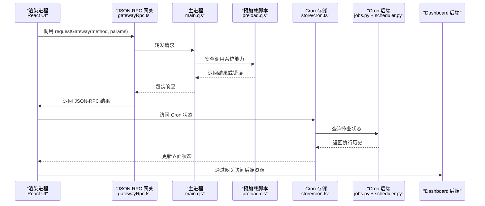
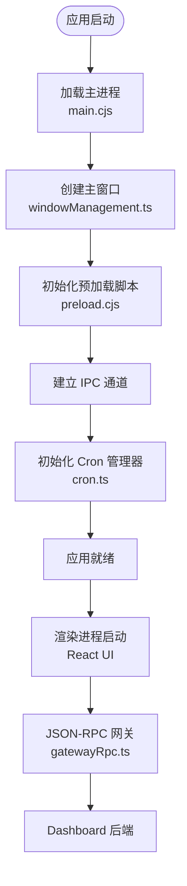
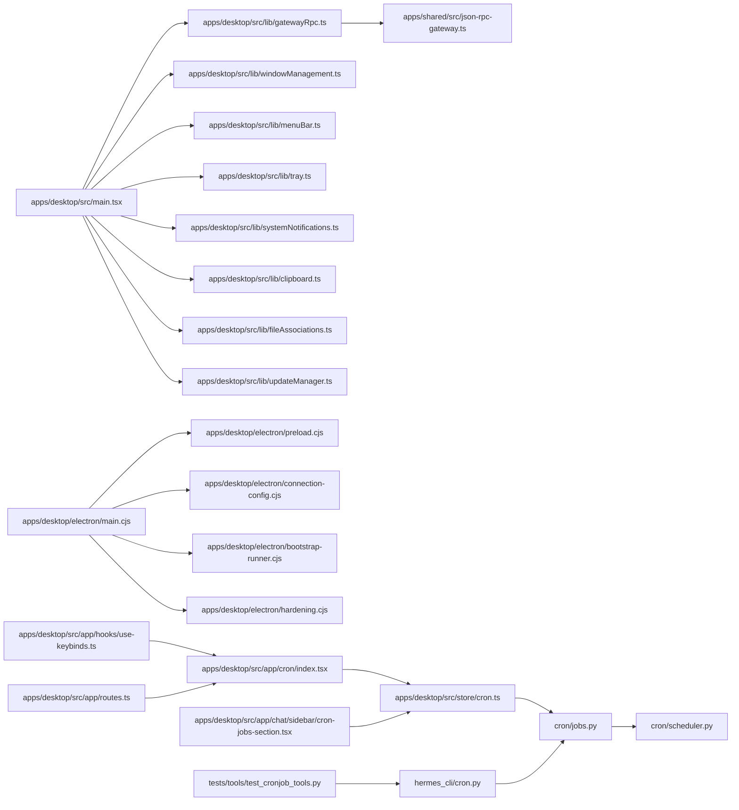

# 桌面应用

<cite>
**本文档引用的文件**
- [AGENTS.md](file://AGENTS.md)
- [apps/desktop/README.md](file://apps/desktop/README.md)
- [apps/desktop/package.json](file://apps/desktop/package.json)
- [apps/desktop/vite.config.ts](file://apps/desktop/vite.config.ts)
- [apps/desktop/src/main.tsx](file://apps/desktop/src/main.tsx)
- [apps/desktop/src/hermes.ts](file://apps/desktop/src/hermes.ts)
- [apps/desktop/src/app/chat/index.tsx](file://apps/desktop/src/app/chat/index.tsx)
- [apps/desktop/src/lib/gatewayRpc.ts](file://apps/desktop/src/lib/gatewayRpc.ts)
- [apps/desktop/src/lib/platform.ts](file://apps/desktop/src/lib/platform.ts)
- [apps/desktop/src/lib/clipboard.ts](file://apps/desktop/src/lib/clipboard.ts)
- [apps/desktop/src/lib/systemNotifications.ts](file://apps/desktop/src/lib/systemNotifications.ts)
- [apps/desktop/src/lib/windowManagement.ts](file://apps/desktop/src/lib/windowManagement.ts)
- [apps/desktop/src/lib/menuBar.ts](file://apps/desktop/src/lib/menuBar.ts)
- [apps/desktop/src/lib/tray.ts](file://apps/desktop/src/lib/tray.ts)
- [apps/desktop/src/lib/fileAssociations.ts](file://apps/desktop/src/lib/fileAssociations.ts)
- [apps/desktop/src/lib/updateManager.ts](file://apps/desktop/src/lib/updateManager.ts)
- [apps/desktop/src/lib/security.ts](file://apps/desktop/src/lib/security.ts)
- [apps/desktop/src/lib/performance.ts](file://apps/desktop/src/lib/performance.ts)
- [apps/desktop/electron/main.cjs](file://apps/desktop/electron/main.cjs)
- [apps/desktop/electron/preload.cjs](file://apps/desktop/electron/preload.cjs)
- [apps/desktop/electron/connection-config.cjs](file://apps/desktop/electron/connection-config.cjs)
- [apps/desktop/electron/bootstrap-runner.cjs](file://apps/desktop/electron/bootstrap-runner.cjs)
- [apps/desktop/electron/hardening.cjs](file://apps/desktop/electron/hardening.cjs)
- [apps/desktop/scripts/notarize.cjs](file://apps/desktop/scripts/notarize.cjs)
- [apps/desktop/scripts/set-exe-identity.cjs](file://apps/desktop/scripts/set-exe-identity.cjs)
- [apps/desktop/scripts/write-build-stamp.cjs](file://apps/desktop/scripts/write-build-stamp.cjs)
- [apps/desktop/scripts/stage-native-deps.cjs](file://apps/desktop/scripts/stage-native-deps.cjs)
- [apps/shared/src/json-rpc-gateway.ts](file://apps/shared/src/json-rpc-gateway.ts)
- [apps/desktop/src/app/cron/index.tsx](file://apps/desktop/src/app/cron/index.tsx)
- [apps/desktop/src/app/cron/job-state.ts](file://apps/desktop/src/app/cron/job-state.ts)
- [apps/desktop/src/store/cron.ts](file://apps/desktop/src/store/cron.ts)
- [apps/desktop/src/app/chat/sidebar/cron-jobs-section.tsx](file://apps/desktop/src/app/chat/sidebar/cron-jobs-section.tsx)
- [apps/desktop/src/app/routes.ts](file://apps/desktop/src/app/routes.ts)
- [apps/desktop/src/app/hooks/use-keybinds.ts](file://apps/desktop/src/app/hooks/use-keybinds.ts)
- [apps/desktop/src/app/shell/hooks/use-overlay-routing.ts](file://apps/desktop/src/app/shell/hooks/use-overlay-routing.ts)
- [apps/desktop/src/components/assistant-ui/tool-fallback-model.ts](file://apps/desktop/src/components/assistant-ui/tool-fallback-model.ts)
- [cron/jobs.py](file://cron/jobs.py)
- [cron/scheduler.py](file://cron/scheduler.py)
- [hermes_cli/cron.py](file://hermes_cli/cron.py)
- [tests/tools/test_cronjob_tools.py](file://tests/tools/test_cronjob_tools.py)
</cite>

## 更新摘要
**所做更改**
- 新增 Cron 作业管理功能章节，涵盖实时运行历史、作业调度管理和详细运行跟踪
- 更新架构总览图，添加 Cron 作业管理子系统
- 新增 Cron 作业状态管理与可视化组件
- 更新路由系统以支持 Cron 页面导航
- 新增 Cron 作业存储与状态同步机制

## 目录
1. [简介](#简介)
2. [项目结构](#项目结构)
3. [核心组件](#核心组件)
4. [架构总览](#架构总览)
5. [详细组件分析](#详细组件分析)
6. [Cron 作业管理系统](#cron-作业管理系统)
7. [依赖关系分析](#依赖关系分析)
8. [性能考虑](#性能考虑)
9. [故障排除指南](#故障排除指南)
10. [结论](#结论)
11. [附录](#附录)

## 简介
本文件为 Hermes Agent 的 Electron 桌面应用提供综合性技术文档。该应用采用主进程与渲染进程分离的设计，通过 JSON-RPC 与后端网关通信，实现了跨平台的聊天界面与系统集成功能。文档覆盖窗口管理、菜单栏定制、托盘、文件关联、系统通知、剪贴板操作、安装包构建、代码签名与自动更新、平台特定功能与权限管理、安全配置以及性能优化等主题。

**更新** 本次更新新增了全面的 Cron 作业管理功能，包括实时运行历史、作业调度管理和详细运行跟踪，为用户提供强大的自动化任务管理能力。

## 项目结构
Hermes 桌面应用位于 apps/desktop 目录，采用 Electron + React 技术栈，结合 Vite 构建工具。应用分为前端渲染层（React + nanostore）与 Electron 后端层（主进程、预加载脚本），并通过 JSON-RPC 与 hermes dashboard 后端通信。

```mermaid
graph TB
subgraph "桌面应用"
FE["前端渲染层<br/>React + nanostore"]
EP["Electron 主进程<br/>main.cjs"]
PP["预加载脚本<br/>preload.cjs"]
GW["JSON-RPC 网关<br/>gatewayRpc.ts"]
CFG["连接配置<br/>connection-config.cjs"]
CRON["Cron 作业管理<br/>cron.ts + job-state.ts"]
ENDSUBGRAPH
subgraph "系统集成"
WM["窗口管理<br/>windowManagement.ts"]
MB["菜单栏<br/>menuBar.ts"]
TR["托盘<br/>tray.ts"]
NA["系统通知<br/>systemNotifications.ts"]
CL["剪贴板<br/>clipboard.ts"]
FA["文件关联<br/>fileAssociations.ts"]
UP["更新管理<br/>updateManager.ts"]
SEC["安全加固<br/>security.ts"]
ENDSUBGRAPH
subgraph "后端服务"
DASH["Hermes Dashboard 后端"]
CRON_BACKEND["Cron 后端服务<br/>jobs.py + scheduler.py"]
ENDSUBGRAPH
FE --> GW
GW --> CFG
GW --> EP
EP --> PP
EP --> WM
EP --> MB
EP --> TR
EP --> NA
EP --> CL
EP --> FA
EP --> UP
EP --> SEC
GW --> DASH
GW --> CRON_BACKEND
CRON --> FE
```

**图表来源**
- [apps/desktop/src/main.tsx:1-200](file://apps/desktop/src/main.tsx#L1-L200)
- [apps/desktop/electron/main.cjs:1-200](file://apps/desktop/electron/main.cjs#L1-L200)
- [apps/desktop/src/lib/gatewayRpc.ts:1-200](file://apps/desktop/src/lib/gatewayRpc.ts#L1-L200)
- [apps/desktop/electron/connection-config.cjs:1-120](file://apps/desktop/electron/connection-config.cjs#L1-L120)
- [apps/desktop/src/store/cron.ts:1-200](file://apps/desktop/src/store/cron.ts#L1-L200)
- [cron/jobs.py:1-200](file://cron/jobs.py#L1-L200)
- [cron/scheduler.py:1-200](file://cron/scheduler.py#L1-L200)

**章节来源**
- [apps/desktop/README.md:60-100](file://apps/desktop/README.md#L60-L100)
- [apps/desktop/package.json:1-120](file://apps/desktop/package.json#L1-L120)
- [apps/desktop/vite.config.ts:1-120](file://apps/desktop/vite.config.ts#L1-L120)

## 核心组件
- 前端渲染层：基于 React 和 nanostore 的聊天界面，负责用户交互与状态管理。
- Electron 主进程：负责应用生命周期、窗口管理、系统集成、安装与更新逻辑。
- 预加载脚本：在受限制的上下文中暴露安全的 API 给渲染进程。
- JSON-RPC 网关：封装与后端网关的通信，统一方法调用与参数传递。
- 连接配置：处理远程网关连接参数与本地环境适配。
- **Cron 作业管理**：提供完整的作业调度、执行跟踪和状态管理功能。
- 安全加固：实施内容安全策略、权限控制与沙箱策略。
- 性能监控：内存与渲染性能指标采集与优化建议。

**章节来源**
- [apps/desktop/src/main.tsx:1-200](file://apps/desktop/src/main.tsx#L1-L200)
- [apps/desktop/src/lib/gatewayRpc.ts:1-200](file://apps/desktop/src/lib/gatewayRpc.ts#L1-L200)
- [apps/desktop/electron/main.cjs:1-200](file://apps/desktop/electron/main.cjs#L1-L200)
- [apps/desktop/electron/preload.cjs:1-200](file://apps/desktop/electron/preload.cjs#L1-L200)
- [apps/desktop/src/store/cron.ts:1-200](file://apps/desktop/src/store/cron.ts#L1-L200)

## 架构总览
桌面应用采用"主进程 + 渲染进程 + 预加载脚本"的经典 Electron 架构。主进程负责系统级操作与安装流程，渲染进程承载 UI 与用户交互，预加载脚本在安全上下文内桥接主进程能力。前端通过 JSON-RPC 与 hermes dashboard 后端通信，复用嵌入式 TUI 的聊天与命令管线。

**更新** 新增 Cron 作业管理子系统，通过独立的状态管理与可视化组件提供完整的作业调度功能。



**图表来源**
- [apps/desktop/src/lib/gatewayRpc.ts:1-200](file://apps/desktop/src/lib/gatewayRpc.ts#L1-L200)
- [apps/desktop/electron/main.cjs:1-200](file://apps/desktop/electron/main.cjs#L1-L200)
- [apps/desktop/electron/preload.cjs:1-200](file://apps/desktop/electron/preload.cjs#L1-L200)
- [apps/desktop/src/store/cron.ts:1-200](file://apps/desktop/src/store/cron.ts#L1-L200)
- [cron/jobs.py:1-200](file://cron/jobs.py#L1-L200)
- [cron/scheduler.py:1-200](file://cron/scheduler.py#L1-L200)

## 详细组件分析

### 主进程与进程间通信
- 主进程负责应用启动、窗口创建、系统集成与安装流程。
- 预加载脚本在受限上下文内暴露受控 API，确保渲染进程无法直接访问 Node.js 或 Electron 的敏感 API。
- JSON-RPC 网关封装所有与后端的通信，统一错误处理与重试逻辑。



**图表来源**
- [apps/desktop/electron/main.cjs:1-200](file://apps/desktop/electron/main.cjs#L1-L200)
- [apps/desktop/electron/preload.cjs:1-200](file://apps/desktop/electron/preload.cjs#L1-L200)
- [apps/desktop/src/lib/gatewayRpc.ts:1-200](file://apps/desktop/src/lib/gatewayRpc.ts#L1-L200)
- [apps/desktop/src/store/cron.ts:1-200](file://apps/desktop/src/store/cron.ts#L1-L200)

**章节来源**
- [apps/desktop/electron/main.cjs:1-200](file://apps/desktop/electron/main.cjs#L1-L200)
- [apps/desktop/electron/preload.cjs:1-200](file://apps/desktop/electron/preload.cjs#L1-L200)

### 窗口管理
- 窗口创建、尺寸调整、最小化/最大化、关闭行为由主进程统一管理。
- 支持多窗口场景与窗口状态持久化。
- 与系统任务栏、Dock 的交互遵循各平台规范。

**章节来源**
- [apps/desktop/src/lib/windowManagement.ts:1-200](file://apps/desktop/src/lib/windowManagement.ts#L1-L200)

### 菜单栏定制
- 提供应用级菜单（文件、编辑、视图、帮助等）。
- 平台特定菜单项（如 macOS 的应用菜单）。
- 快捷键绑定与菜单项状态动态更新。

**章节来源**
- [apps/desktop/src/lib/menuBar.ts:1-200](file://apps/desktop/src/lib/menuBar.ts#L1-L200)

### 托盘功能
- 在系统托盘显示图标与快捷菜单。
- 支持点击显示/隐藏主窗口、退出应用等常用操作。
- 跨平台托盘图标与行为适配。

**章节来源**
- [apps/desktop/src/lib/tray.ts:1-200](file://apps/desktop/src/lib/tray.ts#L1-L200)

### 文件关联与系统通知
- 文件类型关联：注册支持的文件扩展名，双击打开时传递到应用。
- 系统通知：在消息到达或重要事件发生时向用户推送通知。
- 剪贴板：复制文本、图片等，支持跨平台剪贴板 API。

**章节来源**
- [apps/desktop/src/lib/fileAssociations.ts:1-200](file://apps/desktop/src/lib/fileAssociations.ts#L1-L200)
- [apps/desktop/src/lib/systemNotifications.ts:1-200](file://apps/desktop/src/lib/systemNotifications.ts#L1-L200)
- [apps/desktop/src/lib/clipboard.ts:1-200](file://apps/desktop/src/lib/clipboard.ts#L1-L200)

### 安装包构建、代码签名与自动更新
- 构建阶段：Vite 打包前端资源，electron-builder 打包 Electron 应用。
- 代码签名：Windows 使用 Authenticode，macOS 使用 Apple 代码签名证书。
- 自动更新：应用启动时检查更新，下载并安装新版本，支持静默更新与用户确认模式。
- 平台特定构建：针对 Windows、macOS、Linux 的差异化配置与打包流程。

**章节来源**
- [apps/desktop/scripts/notarize.cjs:1-200](file://apps/desktop/scripts/notarize.cjs#L1-L200)
- [apps/desktop/scripts/set-exe-identity.cjs:1-200](file://apps/desktop/scripts/set-exe-identity.cjs#L1-L200)
- [apps/desktop/src/lib/updateManager.ts:1-200](file://apps/desktop/src/lib/updateManager.ts#L1-L200)

### 平台特定功能与权限管理
- 权限声明：麦克风、摄像头、文件系统等敏感权限的申请与提示。
- 平台差异：Windows 的路径解析、macOS 的沙箱与权限、Linux 的桌面环境适配。
- 安全策略：内容安全策略（CSP）、Node.js 集成限制、上下文隔离。

**章节来源**
- [apps/desktop/src/lib/platform.ts:1-200](file://apps/desktop/src/lib/platform.ts#L1-L200)
- [apps/desktop/src/lib/security.ts:1-200](file://apps/desktop/src/lib/security.ts#L1-L200)

### 性能优化与内存管理
- 渲染性能：帧率监控、重绘优化、虚拟滚动、懒加载。
- 内存管理：对象池、垃圾回收触发时机、大对象释放策略。
- 资源压缩：静态资源压缩、按需加载、缓存策略。
- 用户体验：首屏加载时间、输入延迟、滚动流畅度。

**章节来源**
- [apps/desktop/src/lib/performance.ts:1-200](file://apps/desktop/src/lib/performance.ts#L1-L200)

## Cron 作业管理系统

### 功能概述
Hermes 桌面应用新增了全面的 Cron 作业管理功能，为用户提供强大的自动化任务管理能力。该系统包括实时运行历史、作业调度管理和详细运行跟踪等功能。

### 核心组件

#### Cron 作业状态管理
- **作业状态定义**：支持 scheduled、running、completed、failed、paused 等多种状态
- **状态颜色编码**：通过 job-state.ts 提供一致的状态可视化方案
- **实时状态更新**：通过 store/cron.ts 实现状态的实时同步与更新

#### Cron 页面与侧边栏集成
- **独立 Cron 页面**：提供完整的作业管理界面，支持创建、编辑、删除作业
- **侧边栏集成**：通过 cron-jobs-section.tsx 在聊天界面侧边栏显示作业状态
- **快捷导航**：通过 use-keybinds.ts 提供键盘快捷键访问 Cron 功能

#### 作业调度与执行
- **调度表达式**：支持标准 Cron 表达式和人类可读的时间间隔
- **执行历史**：记录每次作业的执行时间、结果和错误信息
- **运行跟踪**：提供详细的执行日志和性能指标

```mermaid
graph LR
subgraph "Cron 作业管理"
A["Cron 页面<br/>index.tsx"] --> B["状态管理<br/>store/cron.ts"]
B --> C["作业状态<br/>job-state.ts"]
A --> D["侧边栏集成<br/>cron-jobs-section.tsx"]
E["路由系统<br/>routes.ts"] --> A
F["快捷键<br/>use-keybinds.ts"] --> A
G["覆盖路由<br/>use-overlay-routing.ts"] --> A
ENDSUBGRAPH
subgraph "后端集成"
H["Cron 后端<br/>jobs.py + scheduler.py"] --> I["hermes_cli/cron.py"]
J["测试<br/>test_cronjob_tools.py"] --> H
ENDSUBGRAPH
A --> H
```

**图表来源**
- [apps/desktop/src/app/cron/index.tsx:1-200](file://apps/desktop/src/app/cron/index.tsx#L1-L200)
- [apps/desktop/src/store/cron.ts:1-200](file://apps/desktop/src/store/cron.ts#L1-L200)
- [apps/desktop/src/app/cron/job-state.ts:1-200](file://apps/desktop/src/app/cron/job-state.ts#L1-L200)
- [apps/desktop/src/app/chat/sidebar/cron-jobs-section.tsx:1-200](file://apps/desktop/src/app/chat/sidebar/cron-jobs-section.tsx#L1-L200)
- [apps/desktop/src/app/routes.ts:1-100](file://apps/desktop/src/app/routes.ts#L1-L100)
- [apps/desktop/src/app/hooks/use-keybinds.ts:1-120](file://apps/desktop/src/app/hooks/use-keybinds.ts#L1-L120)
- [apps/desktop/src/app/shell/hooks/use-overlay-routing.ts:1-80](file://apps/desktop/src/app/shell/hooks/use-overlay-routing.ts#L1-L80)
- [cron/jobs.py:1-200](file://cron/jobs.py#L1-L200)
- [cron/scheduler.py:1-200](file://cron/scheduler.py#L1-L200)
- [hermes_cli/cron.py:1-200](file://hermes_cli/cron.py#L1-L200)
- [tests/tools/test_cronjob_tools.py:1-300](file://tests/tools/test_cronjob_tools.py#L1-L300)

### Cron 作业状态可视化
系统通过 job-state.ts 提供统一的状态可视化方案，确保侧边栏和 Cron 页面的状态显示保持一致。

**状态映射规则**：
- scheduled → 绿色进度指示器
- running → 蓝色进度指示器（带动画）
- completed → 绿色对勾图标
- failed → 红色错误图标
- paused → 黄色暂停图标

### 作业管理界面
Cron 页面提供完整的作业管理功能，包括：
- 创建新的 Cron 作业
- 编辑现有作业的配置
- 删除不需要的作业
- 查看执行历史和统计信息
- 实时监控作业状态

### 集成特性
- **键盘快捷键**：通过 `nav.cron` 快捷键快速访问 Cron 页面
- **覆盖路由**：支持在聊天界面中以覆盖层形式打开 Cron 页面
- **侧边栏状态**：实时显示当前活动的 Cron 作业数量和状态

**章节来源**
- [apps/desktop/src/app/cron/index.tsx:1-200](file://apps/desktop/src/app/cron/index.tsx#L1-L200)
- [apps/desktop/src/app/cron/job-state.ts:1-200](file://apps/desktop/src/app/cron/job-state.ts#L1-L200)
- [apps/desktop/src/store/cron.ts:1-200](file://apps/desktop/src/store/cron.ts#L1-L200)
- [apps/desktop/src/app/chat/sidebar/cron-jobs-section.tsx:1-200](file://apps/desktop/src/app/chat/sidebar/cron-jobs-section.tsx#L1-L200)
- [apps/desktop/src/app/routes.ts:1-100](file://apps/desktop/src/app/routes.ts#L1-L100)
- [apps/desktop/src/app/hooks/use-keybinds.ts:1-120](file://apps/desktop/src/app/hooks/use-keybinds.ts#L1-L120)
- [apps/desktop/src/app/shell/hooks/use-overlay-routing.ts:1-80](file://apps/desktop/src/app/shell/hooks/use-overlay-routing.ts#L1-L80)
- [apps/desktop/src/components/assistant-ui/tool-fallback-model.ts:900-960](file://apps/desktop/src/components/assistant-ui/tool-fallback-model.ts#L900-L960)

## 依赖关系分析
桌面应用的模块依赖关系如下：



**图表来源**
- [apps/desktop/src/main.tsx:1-200](file://apps/desktop/src/main.tsx#L1-L200)
- [apps/desktop/src/lib/gatewayRpc.ts:1-200](file://apps/desktop/src/lib/gatewayRpc.ts#L1-L200)
- [apps/shared/src/json-rpc-gateway.ts:1-200](file://apps/shared/src/json-rpc-gateway.ts#L1-L200)
- [apps/desktop/electron/main.cjs:1-200](file://apps/desktop/electron/main.cjs#L1-L200)
- [apps/desktop/electron/preload.cjs:1-200](file://apps/desktop/electron/preload.cjs#L1-L200)
- [apps/desktop/electron/connection-config.cjs:1-120](file://apps/desktop/electron/connection-config.cjs#L1-L120)
- [apps/desktop/electron/bootstrap-runner.cjs:1-200](file://apps/desktop/electron/bootstrap-runner.cjs#L1-L200)
- [apps/desktop/electron/hardening.cjs:1-200](file://apps/desktop/electron/hardening.cjs#L1-L200)
- [apps/desktop/src/store/cron.ts:1-200](file://apps/desktop/src/store/cron.ts#L1-L200)
- [cron/jobs.py:1-200](file://cron/jobs.py#L1-L200)
- [cron/scheduler.py:1-200](file://cron/scheduler.py#L1-L200)
- [apps/desktop/src/app/cron/index.tsx:1-200](file://apps/desktop/src/app/cron/index.tsx#L1-L200)
- [apps/desktop/src/app/chat/sidebar/cron-jobs-section.tsx:1-200](file://apps/desktop/src/app/chat/sidebar/cron-jobs-section.tsx#L1-L200)
- [apps/desktop/src/app/hooks/use-keybinds.ts:1-120](file://apps/desktop/src/app/hooks/use-keybinds.ts#L1-L120)
- [apps/desktop/src/app/routes.ts:1-100](file://apps/desktop/src/app/routes.ts#L1-L100)
- [hermes_cli/cron.py:1-200](file://hermes_cli/cron.py#L1-L200)
- [tests/tools/test_cronjob_tools.py:1-300](file://tests/tools/test_cronjob_tools.py#L1-L300)

**章节来源**
- [apps/desktop/package.json:1-120](file://apps/desktop/package.json#L1-L120)

## 性能考虑
- 渲染层优化：避免不必要的重渲染，使用不可变数据结构，合理拆分组件。
- 网络层优化：批量请求、缓存策略、超时与重试机制。
- 磁盘与内存：临时文件清理、大对象及时释放、内存泄漏检测。
- 用户体验：骨架屏、渐进式加载、输入防抖与节流。
- **Cron 作业优化**：作业状态缓存、执行历史分页加载、实时更新频率控制。

## 故障排除指南
- 启动失败：检查主进程日志与预加载脚本注入是否正确。
- 网络异常：验证 JSON-RPC 网关配置与后端可达性。
- 权限问题：确认平台权限已授予，必要时引导用户手动授权。
- 更新失败：检查签名与公证状态，确认网络可达性与磁盘空间。
- **Cron 作业问题**：检查作业配置格式、调度表达式语法、执行权限和日志输出。

**章节来源**
- [apps/desktop/src/lib/gatewayRpc.ts:1-200](file://apps/desktop/src/lib/gatewayRpc.ts#L1-L200)
- [apps/desktop/electron/main.cjs:1-200](file://apps/desktop/electron/main.cjs#L1-L200)
- [apps/desktop/src/store/cron.ts:1-200](file://apps/desktop/src/store/cron.ts#L1-L200)

## 结论
Hermes Agent 的 Electron 桌面应用通过清晰的架构分层与严格的系统集成策略，提供了稳定、可扩展且跨平台的用户体验。主进程负责系统级能力与安全控制，渲染进程专注于用户交互，预加载脚本在安全边界内桥接两者。配合完善的安装、签名与更新机制，以及性能与安全最佳实践，该应用能够满足生产环境的复杂需求。

**更新** 新增的 Cron 作业管理功能进一步增强了应用的自动化能力，通过实时运行历史、作业调度管理和详细运行跟踪，为用户提供了强大的任务管理解决方案。该功能与现有架构无缝集成，保持了系统的整体一致性和用户体验的连贯性。

## 附录
- 开发与调试：使用 Vite 热重载与 Electron DevTools。
- 构建与发布：配置 electron-builder 与平台特定脚本。
- 文档与示例：参考 apps/desktop/README.md 与各模块注释。
- **Cron 开发指南**：参考 cron/jobs.py 和 cron/scheduler.py 的实现细节。

**章节来源**
- [apps/desktop/README.md:60-100](file://apps/desktop/README.md#L60-L100)
- [cron/jobs.py:1-200](file://cron/jobs.py#L1-L200)
- [cron/scheduler.py:1-200](file://cron/scheduler.py#L1-L200)