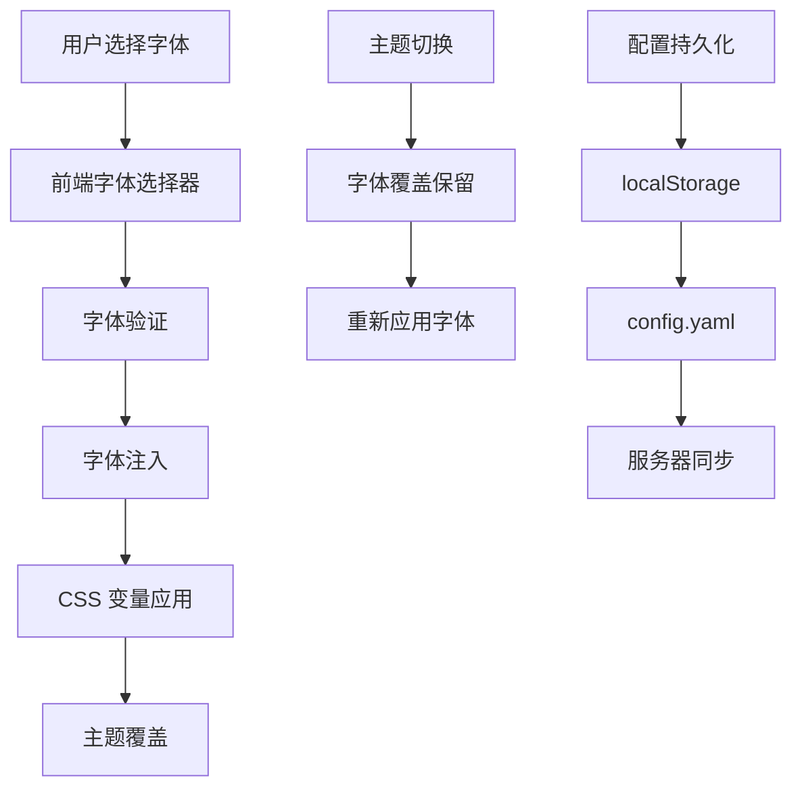

# 用户界面系统

<cite>
**本文引用的文件**
- [hermes_cli/main.py](file://hermes_cli/main.py)
- [hermes_cli/_parser.py](file://hermes_cli/_parser.py)
- [hermes_cli/curses_ui.py](file://hermes_cli/curses_ui.py)
- [hermes_cli/web_server.py](file://hermes_cli/web_server.py)
- [hermes_cli/display_config.py](file://hermes_cli/display_config.py)
- [hermes_cli/config.py](file://hermes_cli/config.py)
- [hermes_cli/commands.py](file://hermes_cli/commands.py)
- [hermes_cli/middleware.py](file://hermes_cli/middleware.py)
- [hermes_cli/dashboards.py](file://hermes_cli/dashboards.py)
- [hermes_cli/relaunch.py](file://hermes_cli/relaunch.py)
- [hermes_cli/runtime_provider.py](file://hermes_cli/runtime_provider.py)
- [hermes_cli/stdio.py](file://hermes_cli/stdio.py)
- [hermes_cli/colors.py](file://hermes_cli/colors.py)
- [hermes_cli/skin_engine.py](file://hermes_cli/skin_engine.py)
- [hermes_cli/tips.py](file://hermes_cli/tips.py)
- [hermes_cli/status.py](file://hermes_cli/status.py)
- [hermes_cli/logs.py](file://hermes_cli/logs.py)
- [hermes_cli/browser_connect.py](file://hermes_cli/browser_connect.py)
- [hermes_cli/pairing.py](file://hermes_cli/pairing.py)
- [hermes_cli/backup.py](file://hermes_cli/backup.py)
- [hermes_cli/doctor.py](file://hermes_cli/doctor.py)
- [hermes_cli/timeout.py](file://hermes_cli/timeout.py)
- [hermes_cli/azure_detect.py](file://hermes_cli/azure_detect.py)
- [hermes_cli/managed_uv.py](file://hermes_cli/managed_uv.py)
- [hermes_cli/container_boot.py](file://hermes_cli/container_boot.py)
- [hermes_cli/psutil_android.py](file://hermes_cli/psutil_android.py)
- [hermes_cli/psutil_linux.py](file://hermes_cli/psutil_linux.py)
- [hermes_cli/psutil_windows.py](file://hermes_cli/psutil_windows.py)
- [hermes_cli/psutil_darwin.py](file://hermes_cli/psutil_darwin.py)
- [hermes_cli/psutil_termux.py](file://hermes_cli/psutil_termux.py)
- [web/src/themes/fonts.ts](file://web/src/themes/fonts.ts)
- [web/src/themes/context.tsx](file://web/src/themes/context.tsx)
- [web/src/components/ThemeSwitcher.tsx](file://web/src/components/ThemeSwitcher.tsx)
- [tests/hermes_cli/test_web_server.py](file://tests/hermes_cli/test_web_server.py)
</cite>

## 更新摘要
**所做更改**
- 新增字体定制功能章节，详细说明独立字体覆盖系统的实现
- 更新主题切换器组件描述，包含新的字体选择功能
- 添加字体目录和字体注入机制的技术细节
- 更新测试用例说明，展示字体覆盖功能的独立存储特性

## 目录
- [概述](#概述)
- [CLI 界面](#cli-界面)
- [TUI 界面](#tui-界面)
- [Web 界面](#web-界面)
- [桌面应用](#桌面应用)
- [字体定制系统](#字体定制系统)
- [界面切换与集成](#界面切换与集成)
- [响应式设计与无障碍访问](#响应式设计与无障碍访问)
- [最佳实践与建议](#最佳实践与建议)

## 概述

Hermes Agent 的用户界面系统提供了四种主要界面：命令行界面（CLI）、文本用户界面（TUI）、Web 界面和桌面应用。每个界面都有其独特的特点和适用场景，为不同技术背景的用户提供了灵活的选择。

## CLI 界面

CLI 界面是 Hermes Agent 的基础交互方式，适用于：
- 高级用户和开发者
- 自动化脚本和批处理任务
- 远程服务器管理
- 命令行工作流程集成

CLI 界面支持丰富的命令行参数和配置选项，提供完整的功能集，适合需要精确控制和自动化操作的用户。

## TUI 界面

TUI 界面提供了一个基于文本的图形用户界面，具有以下特点：
- 实时聊天和对话管理
- 会话历史浏览
- 实时状态显示
- 键盘快捷键支持
- 跨平台兼容性

TUI 界面适合需要在终端环境中进行交互式操作的用户，提供了比纯 CLI 更直观的用户体验。

## Web 界面

Web 界面是 Hermes Agent 最强大的用户界面，具有以下核心功能：

### 主题系统
- **内置主题**：多种预设主题可供选择
- **自定义主题**：支持用户创建和上传自定义主题
- **实时预览**：主题切换时的即时效果展示
- **颜色调色板**：完整的色彩体系和对比度优化

### 字体定制系统
- **独立字体覆盖**：字体设置独立于主题，跨主题切换时保持一致
- **精选字体目录**：经过安全审核的字体集合
- **Google Fonts 集成**：支持在线字体资源
- **系统字体支持**：本地系统字体的直接使用

### 响应式设计
- **移动端适配**：自动适应不同屏幕尺寸
- **触摸优化**：针对移动设备的交互优化
- **高分辨率支持**：4K 和高 DPI 显示器支持

### 无障碍访问
- **键盘导航**：完整的键盘操作支持
- **屏幕阅读器**：ARIA 标签和语义化标记
- **颜色对比度**：符合 WCAG 标准的颜色对比度
- **缩放支持**：字体大小调整和页面缩放

## 桌面应用

桌面应用结合了 Web 技术和原生应用的优势：
- **原生体验**：接近桌面应用程序的使用感受
- **系统集成**：与操作系统深度集成
- **离线功能**：部分功能可在离线状态下使用
- **通知系统**：系统级通知和提醒

## 字体定制系统

Hermes Agent 的字体定制系统是一个独立且强大的功能模块，为用户提供了完全的字体控制权。

### 系统架构

**图表来源**
- [web/src/themes/context.tsx:315-403](file://web/src/themes/context.tsx#L315-L403)
- [web/src/themes/fonts.ts:1-161](file://web/src/themes/fonts.ts#L1-L161)

### 字体目录结构

字体系统采用分类组织的方式，确保用户可以轻松找到合适的字体：

#### 系统字体（无需网络加载）
- **无衬线字体**：System Sans
- **衬线字体**：System Serif  
- **等宽字体**：System Mono

#### Google Fonts 集成字体
- **无衬线字体系列**：Inter、IBM Plex Sans、Work Sans、Atkinson Hyperlegible、DM Sans
- **衬线字体系列**：Spectral、Fraunces、Source Serif 4
- **等宽字体系列**：JetBrains Mono、IBM Plex Mono、Space Mono

### 安全机制

字体系统实施了严格的安全控制措施：

#### 前端安全检查
- **字体 ID 验证**：仅接受预定义的字体 ID
- **字体 URL 注入保护**：防止恶意字体链接注入
- **CSS 变量隔离**：字体样式与其他样式分离

#### 后端安全控制
- **字体 ID 白名单**：严格的字体 ID 允许列表
- **配置持久化验证**：确保字体设置的有效性
- **跨浏览器同步**：统一的字体偏好管理

### 字体覆盖机制

字体覆盖是系统的核心创新，它允许用户独立于主题设置字体：

#### 独立存储
- **localStorage 存储**：浏览器本地持久化
- **config.yaml 配置**：服务器端配置文件
- **跨主题保持**：主题切换时不丢失字体设置

#### 实时应用
- **即时生效**：字体切换立即应用到整个界面
- **CSS 变量驱动**：通过 `--theme-font-sans` 和 `--theme-font-display` 变量控制
- **回退机制**：字体加载失败时自动使用系统字体

### 用户界面

字体选择器提供了直观的用户界面：

#### 分类浏览
- **按字体类型分组**：无衬线、衬线、等宽字体分别显示
- **实时预览**：每个字体选项都显示实际的字体效果
- **清晰标识**：系统字体和网络字体的区别标识

#### 便捷操作
- **一键重置**：返回到主题默认字体
- **快速切换**：支持键盘快捷键操作
- **响应式布局**：适配不同屏幕尺寸

**更新** 新增字体定制功能，允许用户独立选择字体并持久化跨主题切换

**章节来源**
- [web/src/themes/fonts.ts:1-161](file://web/src/themes/fonts.ts#L1-L161)
- [web/src/themes/context.tsx:315-403](file://web/src/themes/context.tsx#L315-L403)
- [web/src/components/ThemeSwitcher.tsx:226-317](file://web/src/components/ThemeSwitcher.tsx#L226-L317)
- [hermes_cli/web_server.py:9224-9267](file://hermes_cli/web_server.py#L9224-L9267)
- [tests/hermes_cli/test_web_server.py:296-307](file://tests/hermes_cli/test_web_server.py#L296-L307)

## 界面切换与集成

Hermes Agent 支持多种界面模式的无缝切换：

### 默认界面选择
- **CLI 优先**：无图形环境时自动使用 CLI
- **TUI 支持**：支持纯文本界面的完整功能
- **Web 优先**：图形环境下的默认选择

### 环境检测
- **TTY 检测**：自动检测终端环境
- **GUI 检测**：检测可用的图形界面
- **配置优先级**：用户配置覆盖自动检测

### 会话一致性
- **状态同步**：不同界面间的会话状态保持一致
- **配置共享**：用户配置在所有界面中可见
- **数据持久化**：会话数据跨界面持久化

## 响应式设计与无障碍访问

### 响应式设计
- **移动端优化**：针对智能手机和平板电脑的界面适配
- **断点系统**：基于 CSS 媒体查询的多断点支持
- **触摸手势**：支持现代移动设备的触摸交互

### 无障碍访问
- **键盘导航**：完整的键盘操作支持
- **屏幕阅读器**：ARIA 标签和语义化标记
- **颜色对比度**：符合 WCAG 标准的颜色对比度
- **缩放支持**：字体大小调整和页面缩放

## 最佳实践与建议

### 用户选择指南
- **初学者**：推荐从 Web 界面开始，逐步熟悉功能
- **开发者**：CLI 界面提供最完整的功能集
- **高级用户**：TUI 界面提供平衡的用户体验
- **企业用户**：桌面应用提供最佳的企业级体验

### 性能优化建议
- **字体加载**：优先选择系统字体以减少网络延迟
- **主题选择**：避免过于复杂的主题影响性能
- **缓存策略**：合理利用浏览器缓存机制

### 安全考虑
- **字体来源**：仅使用受信任的字体源
- **配置备份**：定期备份重要的界面配置
- **权限管理**：合理设置文件和目录权限