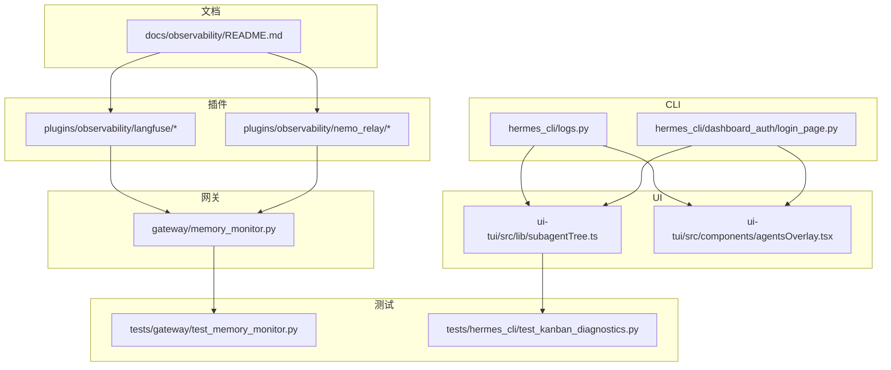
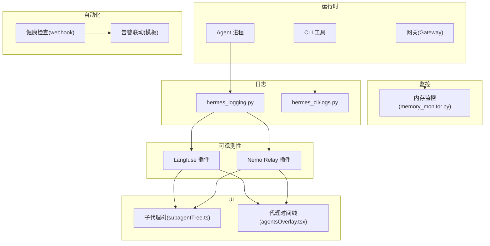
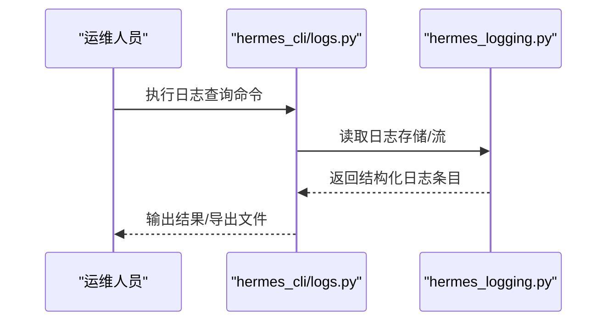
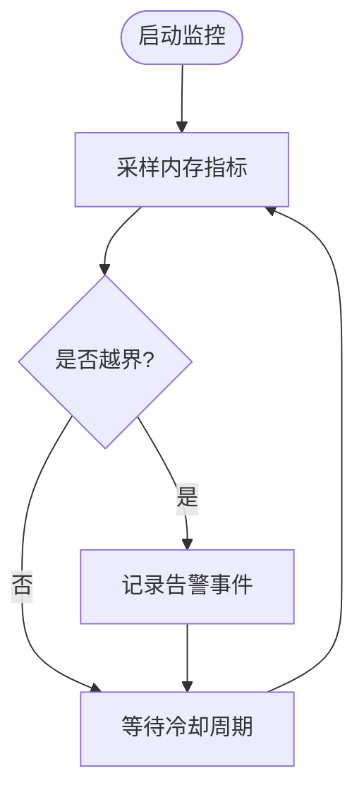
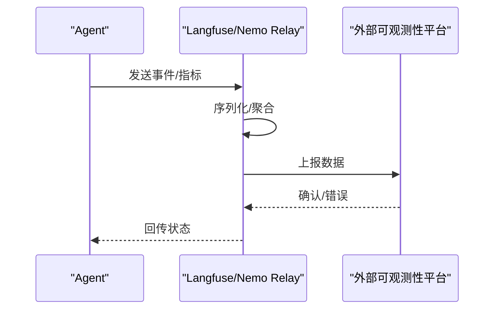
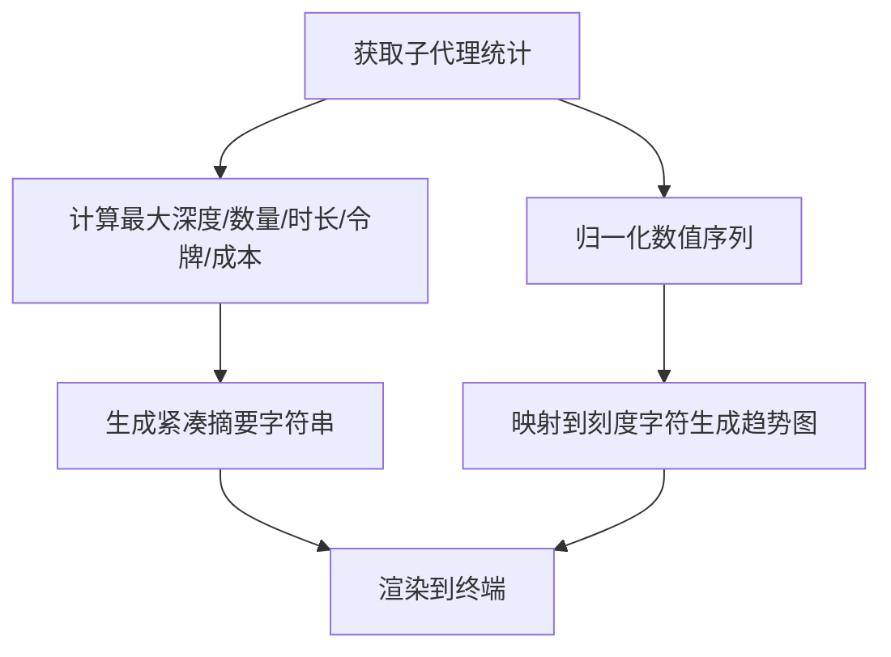
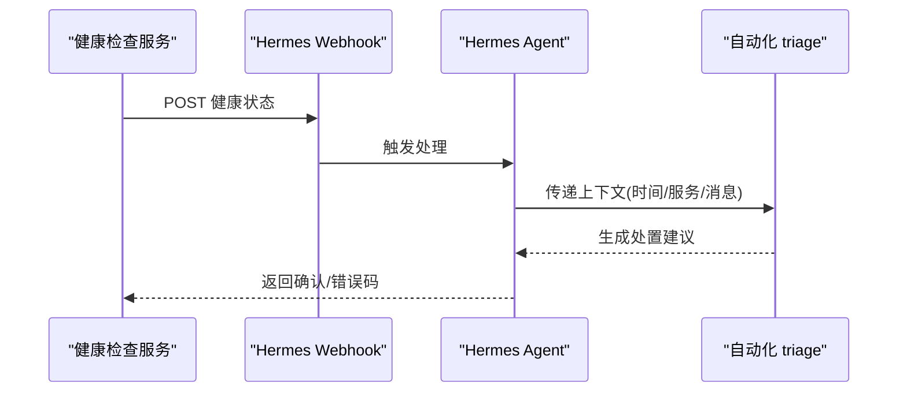
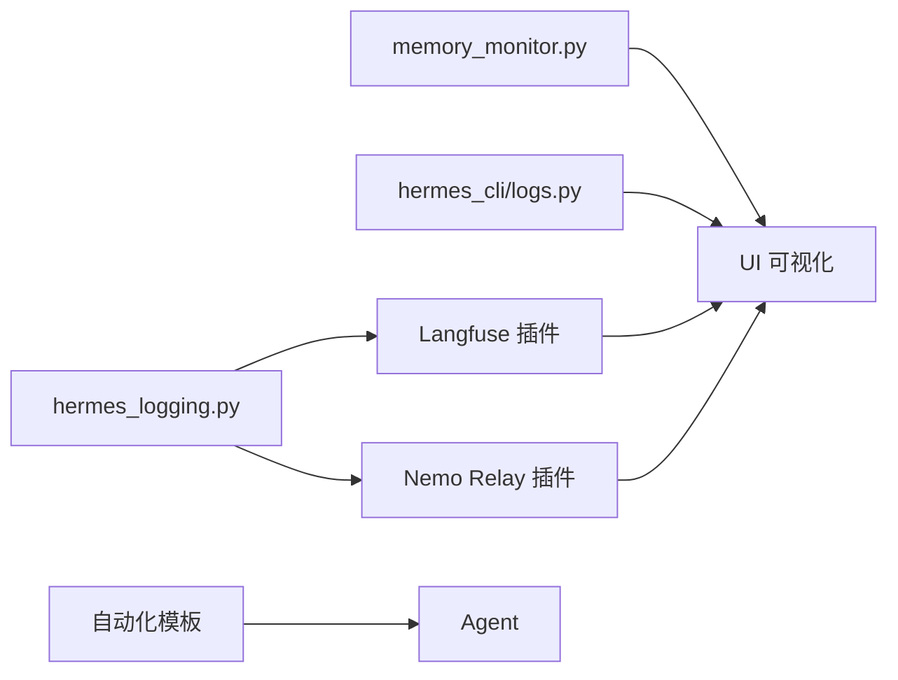

# 监控和可观测性

<cite>
**本文引用的文件**
- [docs/observability/README.md](file://docs/observability/README.md)
- [plugins/observability/langfuse/README.md](file://plugins/observability/langfuse/README.md)
- [plugins/observability/nemo_relay/README.md](file://plugins/observability/nemo_relay/README.md)
- [gateway/memory_monitor.py](file://gateway/memory_monitor.py)
- [tests/gateway/test_memory_monitor.py](file://tests/gateway/test_memory_monitor.py)
- [hermes_logging.py](file://hermes_logging.py)
- [hermes_cli/logs.py](file://hermes_cli/logs.py)
- [hermes_cli/dashboard_auth/login_page.py](file://hermes_cli/dashboard_auth/login_page.py)
- [plugins/observability/langfuse/__init__.py](file://plugins/observability/langfuse/__init__.py)
- [plugins/observability/nemo_relay/__init__.py](file://plugins/observability/nemo_relay/__init__.py)
- [plugins/observability/langfuse/plugin.yaml](file://plugins/observability/langfuse/plugin.yaml)
- [plugins/observability/nemo_relay/plugin.yaml](file://plugins/observability/nemo_relay/plugin.yaml)
- [ui-tui/src/lib/subagentTree.ts](file://ui-tui/src/lib/subagentTree.ts)
- [ui-tui/src/components/agentsOverlay.tsx](file://ui-tui/src/components/agentsOverlay.tsx)
- [website/docs/guides/automation-templates.md](file://website/docs/guides/automation-templates.md)
- [tests/hermes_cli/test_kanban_diagnostics.py](file://tests/hermes_cli/test_kanban_diagnostics.py)
</cite>

## 目录
1. [简介](#简介)
2. [项目结构](#项目结构)
3. [核心组件](#核心组件)
4. [架构总览](#架构总览)
5. [组件详解](#组件详解)
6. [依赖关系分析](#依赖关系分析)
7. [性能考量](#性能考量)
8. [故障排除指南](#故障排除指南)
9. [结论](#结论)
10. [附录](#附录)

## 简介
本文件面向运维与开发者，系统化阐述 Hermes Agent 的监控与可观测性体系：包括监控架构、指标采集与日志记录、健康检查与告警联动、诊断工具与仪表板定制、趋势分析、性能调优、故障排除与容量规划，并覆盖分布式追踪与链路分析实践。内容基于仓库内现有实现与文档进行归纳总结，帮助快速落地与持续改进。

## 项目结构
围绕监控与可观测性，代码库中存在以下关键位置：
- 文档层：docs/observability/README.md 提供整体可观测性说明
- 插件层：plugins/observability 下包含 Langfuse 与 Nemo Relay 两个可观测性插件
- 网关层：gateway/memory_monitor.py 提供内存监控能力
- CLI 层：hermes_cli/logs.py 提供日志查询与导出能力；dashboard_auth 登录页面用于访问仪表板
- UI 层：ui-tui 提供子代理树与时间线可视化，辅助诊断
- 测试层：tests/* 提供监控与诊断相关用例

**图示来源**
- [docs/observability/README.md](file://docs/observability/README.md)
- [plugins/observability/langfuse/README.md](file://plugins/observability/langfuse/README.md)
- [plugins/observability/nemo_relay/README.md](file://plugins/observability/nemo_relay/README.md)
- [gateway/memory_monitor.py](file://gateway/memory_monitor.py)
- [hermes_cli/logs.py](file://hermes_cli/logs.py)
- [hermes_cli/dashboard_auth/login_page.py](file://hermes_cli/dashboard_auth/login_page.py)
- [ui-tui/src/lib/subagentTree.ts](file://ui-tui/src/lib/subagentTree.ts)
- [ui-tui/src/components/agentsOverlay.tsx](file://ui-tui/src/components/agentsOverlay.tsx)
- [tests/gateway/test_memory_monitor.py](file://tests/gateway/test_memory_monitor.py)
- [tests/hermes_cli/test_kanban_diagnostics.py](file://tests/hermes_cli/test_kanban_diagnostics.py)

**章节来源**
- [docs/observability/README.md](file://docs/observability/README.md)
- [plugins/observability/langfuse/README.md](file://plugins/observability/langfuse/README.md)
- [plugins/observability/nemo_relay/README.md](file://plugins/observability/nemo_relay/README.md)
- [gateway/memory_monitor.py](file://gateway/memory_monitor.py)
- [hermes_cli/logs.py](file://hermes_cli/logs.py)
- [hermes_cli/dashboard_auth/login_page.py](file://hermes_cli/dashboard_auth/login_page.py)
- [ui-tui/src/lib/subagentTree.ts](file://ui-tui/src/lib/subagentTree.ts)
- [ui-tui/src/components/agentsOverlay.tsx](file://ui-tui/src/components/agentsOverlay.tsx)
- [tests/gateway/test_memory_monitor.py](file://tests/gateway/test_memory_monitor.py)
- [tests/hermes_cli/test_kanban_diagnostics.py](file://tests/hermes_cli/test_kanban_diagnostics.py)

## 核心组件
- 日志与审计
  - hermes_logging.py 提供统一日志基础设施
  - hermes_cli/logs.py 提供日志查询与导出能力
- 内存监控
  - gateway/memory_monitor.py 提供内存占用检测与阈值告警
- 可观测性插件
  - Langfuse 插件：集成链路追踪与会话分析
  - Nemo Relay 插件：提供轻量可观测性转发
- UI 诊断
  - ui-tui 子代理树与时间线可视化，支持趋势与资源消耗概览
- 健康检查与自动化
  - website 文档中的自动化模板展示健康检查与告警联动

**章节来源**
- [hermes_logging.py](file://hermes_logging.py)
- [hermes_cli/logs.py](file://hermes_cli/logs.py)
- [gateway/memory_monitor.py](file://gateway/memory_monitor.py)
- [plugins/observability/langfuse/README.md](file://plugins/observability/langfuse/README.md)
- [plugins/observability/nemo_relay/README.md](file://plugins/observability/nemo_relay/README.md)
- [ui-tui/src/lib/subagentTree.ts](file://ui-tui/src/lib/subagentTree.ts)
- [ui-tui/src/components/agentsOverlay.tsx](file://ui-tui/src/components/agentsOverlay.tsx)
- [website/docs/guides/automation-templates.md](file://website/docs/guides/automation-templates.md)

## 架构总览
下图展示了从日志、内存监控到可观测性插件与 UI 的整体链路，以及与自动化告警的联动。

**图示来源**
- [gateway/memory_monitor.py](file://gateway/memory_monitor.py)
- [hermes_logging.py](file://hermes_logging.py)
- [hermes_cli/logs.py](file://hermes_cli/logs.py)
- [plugins/observability/langfuse/__init__.py](file://plugins/observability/langfuse/__init__.py)
- [plugins/observability/nemo_relay/__init__.py](file://plugins/observability/nemo_relay/__init__.py)
- [ui-tui/src/lib/subagentTree.ts](file://ui-tui/src/lib/subagentTree.ts)
- [ui-tui/src/components/agentsOverlay.tsx](file://ui-tui/src/components/agentsOverlay.tsx)
- [website/docs/guides/automation-templates.md](file://website/docs/guides/automation-templates.md)

## 组件详解

### 日志与审计（hermes_logging.py 与 hermes_cli/logs.py）
- hermes_logging.py
  - 提供统一的日志初始化与格式化策略，确保跨模块一致的可观测输出
  - 支持按级别过滤、结构化字段注入与外部日志系统对接
- hermes_cli/logs.py
  - 提供日志检索、过滤与导出能力，便于离线分析与问题定位
  - 支持按时间窗口、关键词、严重级别等条件筛选

**图示来源**
- [hermes_logging.py](file://hermes_logging.py)
- [hermes_cli/logs.py](file://hermes_cli/logs.py)

**章节来源**
- [hermes_logging.py](file://hermes_logging.py)
- [hermes_cli/logs.py](file://hermes_cli/logs.py)

### 内存监控（gateway/memory_monitor.py）
- 功能概述
  - 定期采样进程内存占用，对比阈值触发告警或降载
  - 提供可配置的高/低水位线与冷却时间，避免抖动
- 关键流程
  - 启动定时任务，采集 RSS/虚拟内存等指标
  - 计算是否越界，记录事件并触发回调（如限流/重启建议）
- 测试验证
  - tests/gateway/test_memory_monitor.py 覆盖阈值触发、边界条件与异常场景

**图示来源**
- [gateway/memory_monitor.py](file://gateway/memory_monitor.py)
- [tests/gateway/test_memory_monitor.py](file://tests/gateway/test_memory_monitor.py)

**章节来源**
- [gateway/memory_monitor.py](file://gateway/memory_monitor.py)
- [tests/gateway/test_memory_monitor.py](file://tests/gateway/test_memory_monitor.py)

### 可观测性插件（Langfuse 与 Nemo Relay）
- Langfuse 插件
  - 集成链路追踪与会话分析，支持端到端请求 ID 传播
  - 提供 UI 可视化与回放能力，便于根因分析
- Nemo Relay 插件
  - 轻量转发器，将关键事件与指标上报至外部系统
  - 适合对延迟敏感或资源受限的环境
- 插件注册与配置
  - 通过 plugin.yaml 声明能力与参数
  - 在 __init__.py 中完成初始化与钩子注册

**图示来源**
- [plugins/observability/langfuse/__init__.py](file://plugins/observability/langfuse/__init__.py)
- [plugins/observability/nemo_relay/__init__.py](file://plugins/observability/nemo_relay/__init__.py)
- [plugins/observability/langfuse/plugin.yaml](file://plugins/observability/langfuse/plugin.yaml)
- [plugins/observability/nemo_relay/plugin.yaml](file://plugins/observability/nemo_relay/plugin.yaml)

**章节来源**
- [plugins/observability/langfuse/README.md](file://plugins/observability/langfuse/README.md)
- [plugins/observability/nemo_relay/README.md](file://plugins/observability/nemo_relay/README.md)
- [plugins/observability/langfuse/__init__.py](file://plugins/observability/langfuse/__init__.py)
- [plugins/observability/nemo_relay/__init__.py](file://plugins/observability/nemo_relay/__init__.py)
- [plugins/observability/langfuse/plugin.yaml](file://plugins/observability/langfuse/plugin.yaml)
- [plugins/observability/nemo_relay/plugin.yaml](file://plugins/observability/nemo_relay/plugin.yaml)

### UI 诊断与可视化（ui-tui）
- 子代理树（subagentTree.ts）
  - 生成子代理活动的紧凑摘要与趋势图（sparkline），便于快速识别异常
  - 汇总时长、令牌数、成本与活跃度等指标
- 代理时间线（agentsOverlay.tsx）
  - 将多个代理的生命周期映射到统一时间轴，支持滚动查看与缩放
  - 与 CLI 日志结合，形成“时间+事件”的双视角诊断

**图示来源**
- [ui-tui/src/lib/subagentTree.ts](file://ui-tui/src/lib/subagentTree.ts)
- [ui-tui/src/components/agentsOverlay.tsx](file://ui-tui/src/components/agentsOverlay.tsx)

**章节来源**
- [ui-tui/src/lib/subagentTree.ts](file://ui-tui/src/lib/subagentTree.ts)
- [ui-tui/src/components/agentsOverlay.tsx](file://ui-tui/src/components/agentsOverlay.tsx)

### 健康检查与自动化告警（website 文档）
- 健康检查
  - 通过 webhook 接收外部健康检查服务的探测结果
  - 结合最近变更与历史模式进行自动告警分级与处置建议
- 告警联动
  - 使用模板化的 prompt 自动化 triage 流程
  - 支持将结论投递到 Slack 等渠道，加速响应闭环

**图示来源**
- [website/docs/guides/automation-templates.md](file://website/docs/guides/automation-templates.md)

**章节来源**
- [website/docs/guides/automation-templates.md](file://website/docs/guides/automation-templates.md)

## 依赖关系分析
- 组件耦合
  - 日志与可观测性插件之间为弱耦合：日志作为输入，插件负责转换与上报
  - UI 依赖 CLI 与日志/插件输出，形成“数据-展示”分层
  - 内存监控独立于业务逻辑，仅通过回调影响运行时行为
- 外部依赖
  - 可观测性插件依赖外部平台（Langfuse/Nemo Relay）的 SDK/HTTP 接口
  - 健康检查依赖外部监控系统（如 Prometheus/Grafana/PagerDuty）的 webhook 能力

**图示来源**
- [hermes_logging.py](file://hermes_logging.py)
- [plugins/observability/langfuse/__init__.py](file://plugins/observability/langfuse/__init__.py)
- [plugins/observability/nemo_relay/__init__.py](file://plugins/observability/nemo_relay/__init__.py)
- [gateway/memory_monitor.py](file://gateway/memory_monitor.py)
- [hermes_cli/logs.py](file://hermes_cli/logs.py)
- [ui-tui/src/lib/subagentTree.ts](file://ui-tui/src/lib/subagentTree.ts)
- [ui-tui/src/components/agentsOverlay.tsx](file://ui-tui/src/components/agentsOverlay.tsx)
- [website/docs/guides/automation-templates.md](file://website/docs/guides/automation-templates.md)

**章节来源**
- [hermes_logging.py](file://hermes_logging.py)
- [plugins/observability/langfuse/__init__.py](file://plugins/observability/langfuse/__init__.py)
- [plugins/observability/nemo_relay/__init__.py](file://plugins/observability/nemo_relay/__init__.py)
- [gateway/memory_monitor.py](file://gateway/memory_monitor.py)
- [hermes_cli/logs.py](file://hermes_cli/logs.py)
- [ui-tui/src/lib/subagentTree.ts](file://ui-tui/src/lib/subagentTree.ts)
- [ui-tui/src/components/agentsOverlay.tsx](file://ui-tui/src/components/agentsOverlay.tsx)
- [website/docs/guides/automation-templates.md](file://website/docs/guides/automation-templates.md)

## 性能考量
- 日志开销控制
  - 使用异步写入与批量刷盘，避免阻塞主流程
  - 通过结构化字段减少解析成本，便于下游索引
- 内存监控频率
  - 合理设置采样间隔与阈值，避免高频采样造成额外 CPU 占用
  - 引入冷却时间窗，降低抖动与误报
- 可观测性上报
  - 对事件进行本地聚合与压缩，降低网络与存储压力
  - 采用指数退避与重试策略，提升在瞬时故障下的稳定性
- UI 渲染
  - 子代理树与时间线采用预计算与缓存策略，避免重复渲染
  - 对超长列表进行分页与懒加载，保障交互流畅

[本节为通用指导，无需列出具体文件来源]

## 故障排除指南
- 日志排查
  - 使用 hermes_cli/logs.py 按时间窗口与关键字过滤，定位异常时间段
  - 结合 hermes_logging.py 的结构化字段（如 trace_id、span_id）关联上下游
- 内存问题
  - 查看 gateway/memory_monitor.py 的告警记录，确认是否达到阈值
  - 结合 UI 时间线观察内存曲线峰值与持续时间
- 可观测性插件
  - 检查插件初始化日志与错误返回码
  - 核对 plugin.yaml 中的配置项与外部平台凭证
- 健康检查与告警
  - 确认 webhook 地址与签名验证是否正确
  - 使用自动化模板核对最近变更与告警模式的一致性

**章节来源**
- [hermes_cli/logs.py](file://hermes_cli/logs.py)
- [hermes_logging.py](file://hermes_logging.py)
- [gateway/memory_monitor.py](file://gateway/memory_monitor.py)
- [plugins/observability/langfuse/plugin.yaml](file://plugins/observability/langfuse/plugin.yaml)
- [plugins/observability/nemo_relay/plugin.yaml](file://plugins/observability/nemo_relay/plugin.yaml)
- [website/docs/guides/automation-templates.md](file://website/docs/guides/automation-templates.md)

## 结论
Hermes Agent 的监控与可观测性以“日志—指标—可视化—自动化”为主线，既保证了运行时的稳定感知，也提供了面向问题定位与根因分析的工具链。通过合理配置可观测性插件、优化日志与内存监控策略，并结合 UI 与自动化模板，可显著提升系统的可维护性与可运营性。

[本节为总结性内容，无需列出具体文件来源]

## 附录

### 监控配置选项（示例要点）
- 日志
  - 日志级别、输出目标、字段模板
- 内存监控
  - 高/低水位线、采样间隔、冷却时间
- 可观测性插件
  - 平台地址、认证凭据、上报批次大小、重试策略
- UI
  - 时间线长度、子代理树刷新频率、颜色主题

[本节为概念性汇总，无需列出具体文件来源]

### 仪表板定制与趋势分析
- 使用子代理树与时间线进行趋势观察
- 结合日志与指标，建立“时间轴+事件标签”的双视角分析
- 通过自动化模板沉淀常见问题的诊断路径

**章节来源**
- [ui-tui/src/lib/subagentTree.ts](file://ui-tui/src/lib/subagentTree.ts)
- [ui-tui/src/components/agentsOverlay.tsx](file://ui-tui/src/components/agentsOverlay.tsx)
- [website/docs/guides/automation-templates.md](file://website/docs/guides/automation-templates.md)

### 分布式追踪与链路分析
- 通过 Langfuse 插件启用端到端追踪，串联请求、工具调用与模型推理
- 在 UI 中查看链路耗时分布，识别瓶颈节点
- 结合日志与指标，进行多维关联分析

**章节来源**
- [plugins/observability/langfuse/README.md](file://plugins/observability/langfuse/README.md)
- [plugins/observability/langfuse/__init__.py](file://plugins/observability/langfuse/__init__.py)
- [ui-tui/src/lib/subagentTree.ts](file://ui-tui/src/lib/subagentTree.ts)
- [ui-tui/src/components/agentsOverlay.tsx](file://ui-tui/src/components/agentsOverlay.tsx)

### 容量规划与性能调优
- 基于 UI 趋势与日志峰值，估算 CPU/内存/IO 需求
- 通过内存监控阈值与冷却时间调整，平衡稳定性与资源占用
- 优化可观测性上报批次与重试策略，降低尾延迟

**章节来源**
- [gateway/memory_monitor.py](file://gateway/memory_monitor.py)
- [plugins/observability/langfuse/plugin.yaml](file://plugins/observability/langfuse/plugin.yaml)
- [plugins/observability/nemo_relay/plugin.yaml](file://plugins/observability/nemo_relay/plugin.yaml)
- [ui-tui/src/lib/subagentTree.ts](file://ui-tui/src/lib/subagentTree.ts)
- [ui-tui/src/components/agentsOverlay.tsx](file://ui-tui/src/components/agentsOverlay.tsx)