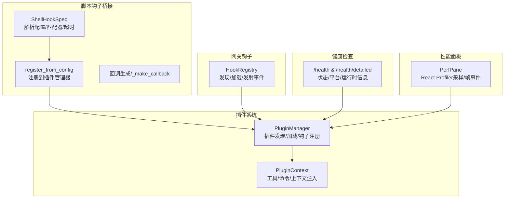
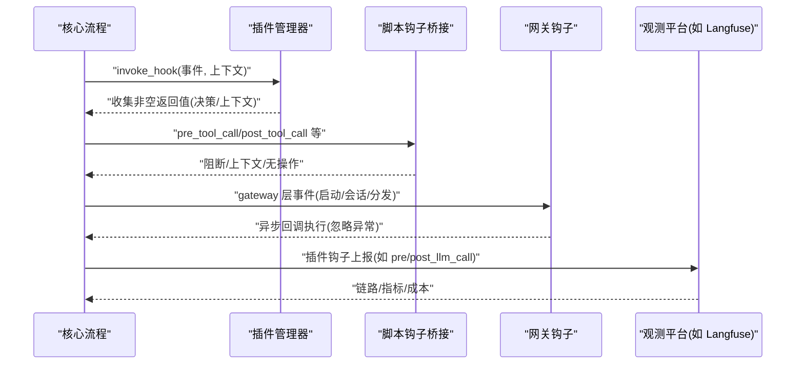
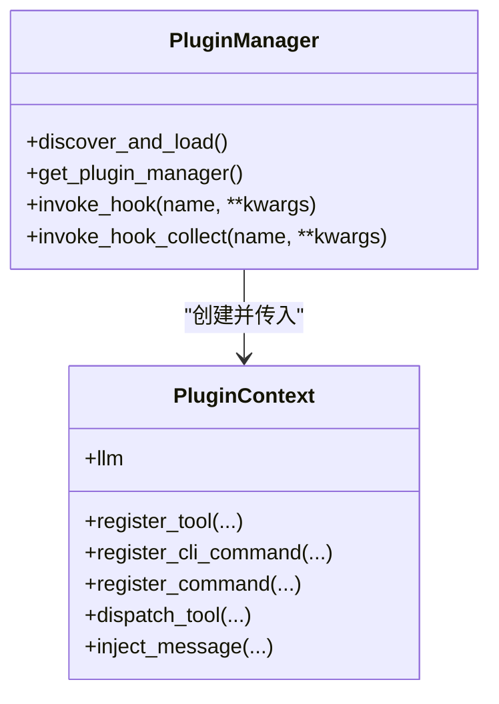
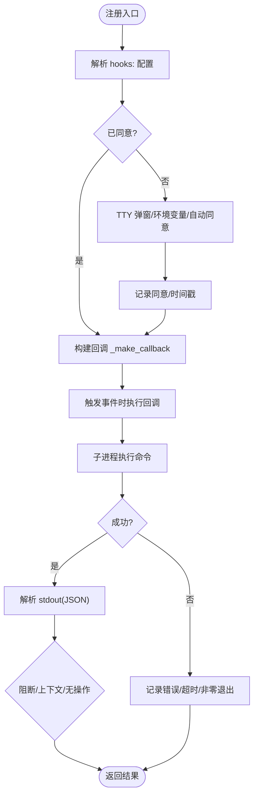
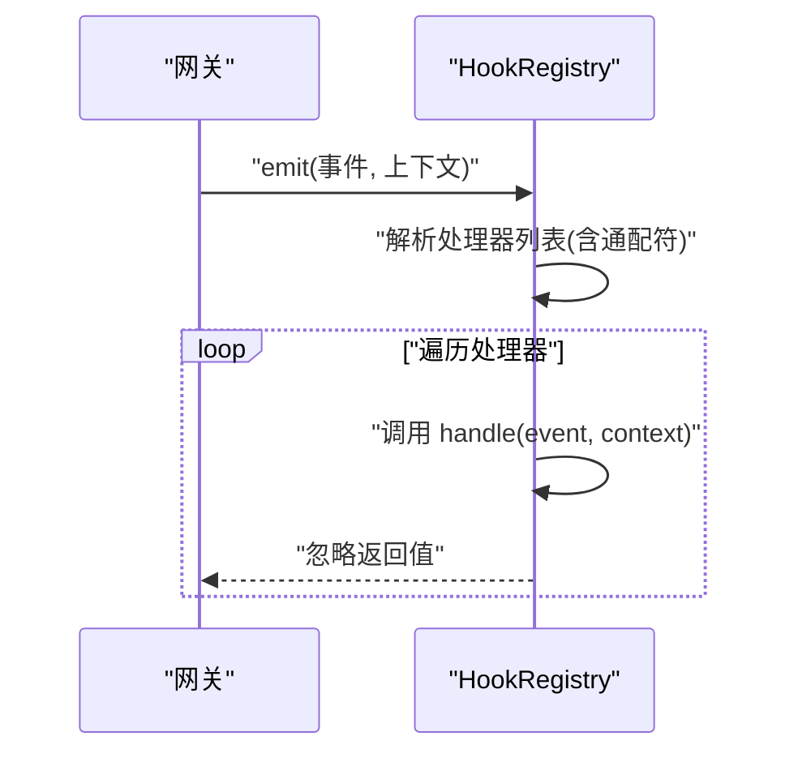
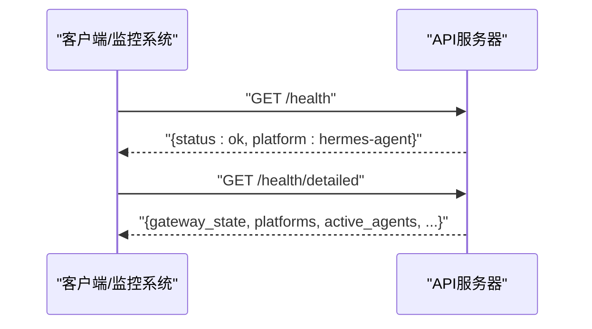
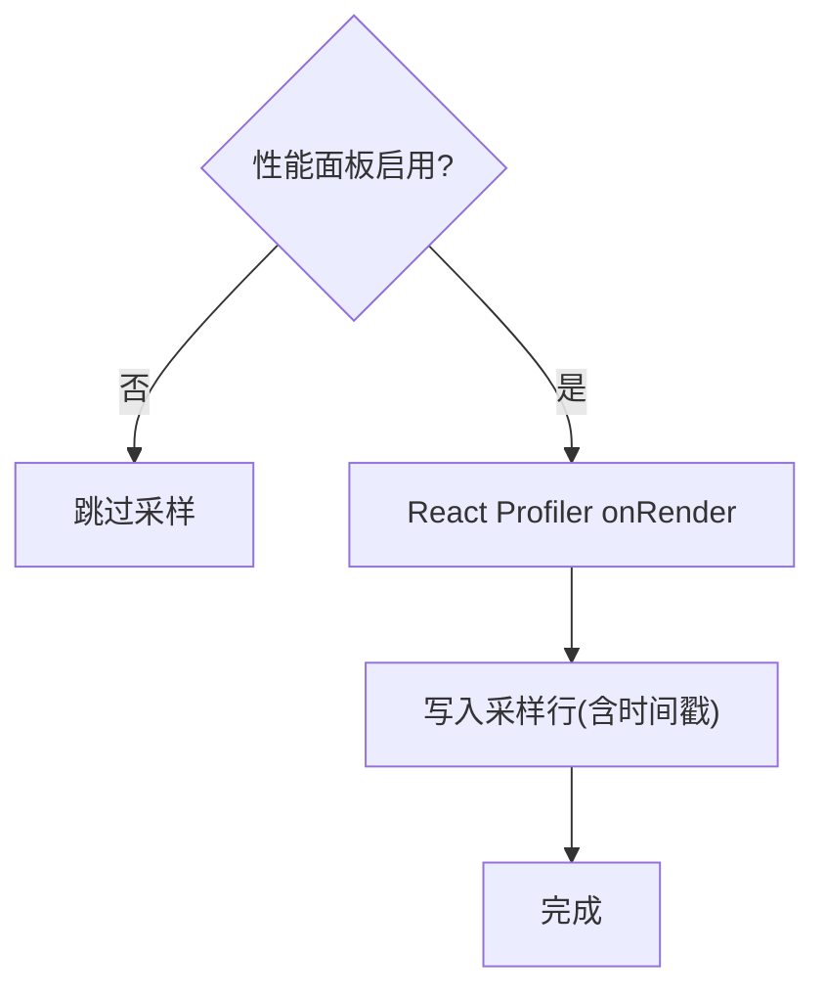
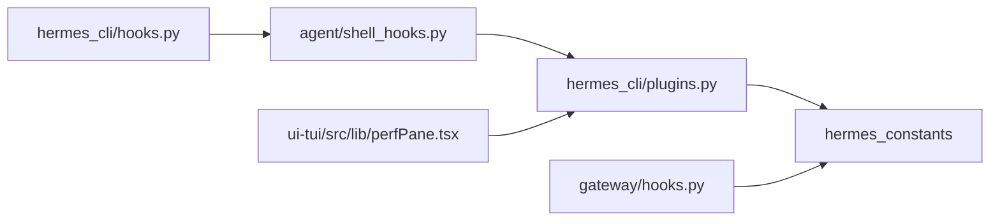

# 监控系统

<cite>
**本文引用的文件**
- [gateway/hooks.py](file://gateway/hooks.py)
- [gateway/builtin_hooks/__init__.py](file://gateway/builtin_hooks/__init__.py)
- [hermes_cli/plugins.py](file://hermes_cli/plugins.py)
- [hermes_cli/hooks.py](file://hermes_cli/hooks.py)
- [agent/shell_hooks.py](file://agent/shell_hooks.py)
- [tests/gateway/test_hooks.py](file://tests/gateway/test_hooks.py)
- [tests/hermes_cli/test_hooks_cli.py](file://tests/hermes_cli/test_hooks_cli.py)
- [tests/hermes_cli/test_plugins.py](file://tests/hermes_cli/test_plugins.py)
- [tests/gateway/test_api_server.py](file://tests/gateway/test_api_server.py)
- [plugins/observability/langfuse/plugin.yaml](file://plugins/observability/langfuse/plugin.yaml)
- [plugins/observability/nemo_relay/plugin.yaml](file://plugins/observability/nemo_relay/plugin.yaml)
- [ui-tui/src/lib/perfPane.tsx](file://ui-tui/src/lib/perfPane.tsx)
</cite>

## 目录
1. [简介](#简介)
2. [项目结构](#项目结构)
3. [核心组件](#核心组件)
4. [架构总览](#架构总览)
5. [详细组件分析](#详细组件分析)
6. [依赖关系分析](#依赖关系分析)
7. [性能考量](#性能考量)
8. [故障排查指南](#故障排查指南)
9. [结论](#结论)
10. [附录](#附录)

## 简介
本文件面向运维与开发团队，系统化阐述 Hermes Agent 的监控与可观测性体系，重点覆盖以下方面：
- 观察者钩子架构：插件与脚本钩子的注册、发现、执行与容错
- 生命周期事件：从会话到工具调用、API 请求、网关调度等关键节点
- 性能指标采集与可视化：内置性能面板与第三方集成
- 健康检查机制：/health 与 /health/detailed 接口
- 监控配置选项：插件启用、环境变量、钩子清单与同意机制
- 告警规则建议：基于钩子返回与健康端点的可操作阈值
- 插件开发指南：如何编写与调试钩子、如何接入第三方观测平台
- 分布式追踪与链路分析：与 Langfuse 等平台的集成要点
- 最佳实践：安全、性能与可维护性的建议

## 项目结构
Hermes 的监控与可观测性由“插件系统 + 脚本钩子 + 网关钩子 + 健康端点 + 性能面板”构成，核心模块如下：
- 插件系统：统一的插件发现、加载与钩子注册入口
- 脚本钩子桥接：将用户配置的 shell 命令桥接到插件钩子系统
- 网关钩子：在网关层触发的生命周期事件
- 健康端点：提供运行态健康状态与平台信息
- 性能面板：前端 TUI 内置的渲染性能采样与日志

图表来源
- [hermes_cli/plugins.py](file://hermes_cli/plugins.py)
- [agent/shell_hooks.py](file://agent/shell_hooks.py)
- [gateway/hooks.py](file://gateway/hooks.py)
- [ui-tui/src/lib/perfPane.tsx](file://ui-tui/src/lib/perfPane.tsx)

章节来源
- [hermes_cli/plugins.py](file://hermes_cli/plugins.py)
- [agent/shell_hooks.py](file://agent/shell_hooks.py)
- [gateway/hooks.py](file://gateway/hooks.py)
- [ui-tui/src/lib/perfPane.tsx](file://ui-tui/src/lib/perfPane.tsx)

## 核心组件
- 插件系统（PluginManager/PluginContext）
  - 负责插件发现、加载、钩子注册与生命周期管理
  - 提供工具注册、命令注册、消息注入、上下文引擎替换等能力
  - 支持多来源插件（内置/用户/项目/Pip），后发覆盖前发
- 脚本钩子桥接（ShellHookSpec/register_from_config）
  - 将配置中的 hooks: 条目转换为可执行的回调
  - 支持正则匹配、超时控制、首次使用同意（allowlist）
  - 通过子进程执行外部脚本，并将标准输入/输出映射为钩子协议
- 网关钩子（HookRegistry）
  - 在网关启动、会话开始/结束、消息分发等阶段触发
  - 支持精确事件与通配符事件匹配
- 健康端点（/health 与 /health/detailed）
  - 返回平台标识与运行时状态摘要
- 性能面板（PerfPane）
  - 采样 React 渲染耗时与帧事件，持久化到本地日志文件

章节来源
- [hermes_cli/plugins.py](file://hermes_cli/plugins.py)
- [agent/shell_hooks.py](file://agent/shell_hooks.py)
- [gateway/hooks.py](file://gateway/hooks.py)
- [tests/gateway/test_api_server.py](file://tests/gateway/test_api_server.py)
- [ui-tui/src/lib/perfPane.tsx](file://ui-tui/src/lib/perfPane.tsx)

## 架构总览
下图展示钩子系统在不同层面的交互：插件钩子、脚本钩子与网关钩子共同构成统一的观察者网络。

图表来源
- [hermes_cli/plugins.py](file://hermes_cli/plugins.py)
- [agent/shell_hooks.py](file://agent/shell_hooks.py)
- [gateway/hooks.py](file://gateway/hooks.py)

## 详细组件分析

### 插件系统（PluginManager/PluginContext）
- 事件集合（VALID_HOOKS）定义了可用的钩子点，覆盖工具调用、LLM 调用、API 请求、会话生命周期、网关预分发、审批生命周期等
- 插件通过 register(ctx) 注册工具、命令与钩子回调
- 插件上下文提供：
  - 工具注册与派发
  - CLI 命令注册
  - Slash 命令注册
  - 消息注入（用于远程控制/桥接）
  - LLM 访问门面（受配置约束）

图表来源
- [hermes_cli/plugins.py](file://hermes_cli/plugins.py)

章节来源
- [hermes_cli/plugins.py](file://hermes_cli/plugins.py)

### 脚本钩子桥接（ShellHookSpec/register_from_config）
- 配置解析：hooks: 下的每个事件条目包含 command、matcher（可选）、timeout（默认/上限）
- 同意机制：首次注册前弹出确认，记录到 ~/.hermes/shell-hooks-allowlist.json
- 回调生成：将事件上下文序列化为 JSON，作为 stdin 传递给外部脚本；解析 stdout 为标准化响应
- 执行策略：子进程执行（shell=False），支持超时、错误与非零退出码的记录

图表来源
- [agent/shell_hooks.py](file://agent/shell_hooks.py)

章节来源
- [agent/shell_hooks.py](file://agent/shell_hooks.py)
- [hermes_cli/hooks.py](file://hermes_cli/hooks.py)

### 网关钩子（HookRegistry）
- 发现与加载：扫描 ~/.hermes/hooks/ 下的目录，要求 HOOK.yaml 与 handler.py
- 事件匹配：精确匹配优先，随后通配符（如 command:*）
- 执行模型：同步/异步回调，异常被捕获并记录但不中断主流程

图表来源
- [gateway/hooks.py](file://gateway/hooks.py)

章节来源
- [gateway/hooks.py](file://gateway/hooks.py)
- [gateway/builtin_hooks/__init__.py](file://gateway/builtin_hooks/__init__.py)

### 健康检查端点
- /health：返回状态与平台标识
- /health/detailed：返回更详细的运行时状态（如网关状态、平台连接状态、活跃代理数等）

图表来源
- [tests/gateway/test_api_server.py](file://tests/gateway/test_api_server.py)

章节来源
- [tests/gateway/test_api_server.py](file://tests/gateway/test_api_server.py)

### 性能面板（PerfPane）
- 采样 React Profiler 的 onRender 事件，记录实际耗时、基础耗时、提交耗时等
- 采样帧事件（帧持续时间、阶段耗时、闪烁检测等），写入本地日志文件
- 仅在启用时生效，避免对生产性能造成额外负担

图表来源
- [ui-tui/src/lib/perfPane.tsx](file://ui-tui/src/lib/perfPane.tsx)

章节来源
- [ui-tui/src/lib/perfPane.tsx](file://ui-tui/src/lib/perfPane.tsx)

## 依赖关系分析
- 插件系统依赖：
  - hermes_cli.plugins：提供插件发现、钩子注册与生命周期事件
  - agent.plugin_llm：为插件提供受限的 LLM 访问
- 脚本钩子依赖：
  - hermes_cli.config：读取 hooks 配置
  - hermes_constants.get_hermes_home：定位用户目录
  - utils.atomic_replace：原子写入同意清单
- 网关钩子依赖：
  - hermes_cli.config：获取用户目录
  - YAML 解析：加载 HOOK.yaml
- 健康端点依赖：
  - gateway.status：读取运行时状态
- 性能面板依赖：
  - React Profiler 与 TUI 日志路径

图表来源
- [hermes_cli/plugins.py](file://hermes_cli/plugins.py)
- [agent/shell_hooks.py](file://agent/shell_hooks.py)
- [hermes_cli/hooks.py](file://hermes_cli/hooks.py)
- [gateway/hooks.py](file://gateway/hooks.py)
- [ui-tui/src/lib/perfPane.tsx](file://ui-tui/src/lib/perfPane.tsx)

章节来源
- [hermes_cli/plugins.py](file://hermes_cli/plugins.py)
- [agent/shell_hooks.py](file://agent/shell_hooks.py)
- [hermes_cli/hooks.py](file://hermes_cli/hooks.py)
- [gateway/hooks.py](file://gateway/hooks.py)
- [ui-tui/src/lib/perfPane.tsx](file://ui-tui/src/lib/perfPane.tsx)

## 性能考量
- 钩子执行开销
  - 插件钩子：同步/异步回调，异常被吞并，不影响主流程
  - 脚本钩子：子进程执行，带超时保护；建议合理设置 timeout，避免阻塞
  - 网关钩子：异步回调，异常记录但不中断
- 性能面板
  - 仅在启用时采样，避免对主线程与渲染造成额外压力
  - 采样阈值可调，仅记录超过阈值的事件，减少噪声
- 观测平台集成
  - Langfuse 插件采用失败开放策略，SDK 缺失/凭据缺失/瞬时错误均不中断 agent 循环

章节来源
- [agent/shell_hooks.py](file://agent/shell_hooks.py)
- [ui-tui/src/lib/perfPane.tsx](file://ui-tui/src/lib/perfPane.tsx)
- [plugins/observability/langfuse/plugin.yaml](file://plugins/observability/langfuse/plugin.yaml)

## 故障排查指南
- 钩子测试与诊断
  - 使用 hermes hooks list/test/doctor 命令验证配置、同意状态与脚本可执行性
  - 对于 pre_tool_call/post_tool_call，支持按工具名匹配（matcher）
- 常见问题
  - 脚本未执行：检查是否已同意、脚本是否可执行、路径是否正确
  - 超时：调整 hooks.<event>.timeout，或优化脚本逻辑
  - 输出格式错误：确保 stdout 为合法 JSON，遵循钩子协议
- 健康端点
  - /health 返回非 200 或状态异常：检查网关运行状态与平台连接
  - /health/detailed 字段缺失：确认 gateway.status 实现与权限

章节来源
- [hermes_cli/hooks.py](file://hermes_cli/hooks.py)
- [tests/gateway/test_hooks.py](file://tests/gateway/test_hooks.py)
- [tests/hermes_cli/test_hooks_cli.py](file://tests/hermes_cli/test_hooks_cli.py)
- [tests/gateway/test_api_server.py](file://tests/gateway/test_api_server.py)

## 结论
Hermes 的监控体系通过“插件 + 脚本 + 网关”三层钩子实现全面可观测性，结合健康端点与性能面板，既能满足日常运维巡检，也能支撑复杂场景下的链路追踪与性能分析。建议在生产中：
- 明确钩子职责边界，避免在 pre_tool_call 中做重 IO
- 合理设置脚本钩子超时与日志级别
- 使用健康端点与性能面板进行基线监控
- 通过插件集成 Langfuse 等平台，建立统一的链路与成本视图

## 附录

### 生命周期事件与数据字段
- 工具调用
  - pre_tool_call：tool_name、args、session_id、task_id、tool_call_id
  - post_tool_call：同上 + result、duration_ms
- LLM 调用
  - pre_llm_call：session_id、user_message、conversation_history、is_first_turn、model、platform
  - post_llm_call：session_id、model、platform
- API 请求
  - pre_api_request：session_id、task_id、platform、model、provider、base_url、api_mode、api_call_count、message_count、tool_count、approx_input_tokens、request_char_count、max_tokens
  - post_api_request：同上 + api_duration、finish_reason、message_count、response_model、usage、assistant_content_chars、assistant_tool_call_count
- 会话生命周期
  - on_session_start/on_session_end/on_session_finalize/on_session_reset：session_id
- 网关预分发
  - pre_gateway_dispatch：event、gateway、session_store（返回 action: skip/rewrite/allow 与理由/重写文本）
- 审批生命周期
  - pre_approval_request/post_approval_response：command、description、pattern_key、pattern_keys、session_key、surface、choice（可选）

章节来源
- [hermes_cli/plugins.py](file://hermes_cli/plugins.py)
- [hermes_cli/hooks.py](file://hermes_cli/hooks.py)

### 监控配置选项
- 插件启用
  - hermes plugins enable/disable 切换插件
  - 插件清单与元数据由 plugin.yaml 提供
- 脚本钩子
  - hooks: 下的每个事件条目包含 command、matcher（可选）、timeout（秒）
  - 首次使用需同意，记录在 ~/.hermes/shell-hooks-allowlist.json
- 环境变量
  - HERMES_LANGFUSE_PUBLIC_KEY/SECRET_KEY/BaseURL（Langfuse 插件）
  - HERMES_ACCEPT_HOOKS（自动同意脚本钩子）
  - HERMES_PLUGINS_DEBUG（插件调试日志）

章节来源
- [plugins/observability/langfuse/plugin.yaml](file://plugins/observability/langfuse/plugin.yaml)
- [plugins/observability/nemo_relay/plugin.yaml](file://plugins/observability/nemo_relay/plugin.yaml)
- [agent/shell_hooks.py](file://agent/shell_hooks.py)
- [hermes_cli/plugins.py](file://hermes_cli/plugins.py)

### 告警规则建议
- 健康端点
  - /health 非 200 或 status != ok：立即告警
  - /health/detailed 中 active_agents 为 0 且有活跃会话：延迟告警
- 脚本钩子
  - 超时次数占比 > 5%：告警
  - 非零退出码占比 > 1%：告警
- 性能面板
  - React 渲染平均耗时 > 阈值（按业务场景设定）
  - 帧事件闪烁次数 > 阈值：告警
- 观测平台
  - Langfuse：请求失败率、延迟 P95、成本异常波动

章节来源
- [tests/gateway/test_api_server.py](file://tests/gateway/test_api_server.py)
- [agent/shell_hooks.py](file://agent/shell_hooks.py)
- [ui-tui/src/lib/perfPane.tsx](file://ui-tui/src/lib/perfPane.tsx)

### 插件开发指南
- 编写步骤
  - 创建 plugin.yaml，声明 name/version/author/requires_env/hooks
  - 在 __init__.py 中实现 register(ctx)，在其中调用 ctx.register_hook(...) 注册回调
  - 在回调中读取上下文参数，按需返回决策/上下文/无操作
- 调试技巧
  - 设置 HERMES_PLUGINS_DEBUG=1 查看详细日志
  - 使用 tests/hermes_cli/test_plugins.py 中的断言模式验证钩子行为
- 安全与性能
  - 避免在钩子中执行重 IO 或阻塞操作
  - 对外部依赖采用失败开放策略（Langfuse 插件即示例）

章节来源
- [hermes_cli/plugins.py](file://hermes_cli/plugins.py)
- [tests/hermes_cli/test_plugins.py](file://tests/hermes_cli/test_plugins.py)
- [plugins/observability/langfuse/plugin.yaml](file://plugins/observability/langfuse/plugin.yaml)

### 分布式追踪与链路分析
- 与 Langfuse 集成
  - 插件在 pre_llm_call/post_llm_call/pre_tool_call/post_tool_call 等钩子上报
  - 成本与 token 分类与 agent.usage_pricing 保持一致
- 与 Nemo Relay 集成
  - 通过插件钩子上报链路与指标，便于统一聚合与查询

章节来源
- [plugins/observability/langfuse/plugin.yaml](file://plugins/observability/langfuse/plugin.yaml)
- [plugins/observability/nemo_relay/plugin.yaml](file://plugins/observability/nemo_relay/plugin.yaml)

### 最佳实践
- 钩子设计
  - 保持幂等与快速返回
  - 对外部系统采用超时与重试策略
- 安全
  - 脚本钩子必须经同意方可注册
  - 限制脚本权限，避免敏感操作
- 运维
  - 定期运行 hermes hooks doctor 检查配置与脚本健康度
  - 使用健康端点与性能面板建立基线，及时发现异常

章节来源
- [agent/shell_hooks.py](file://agent/shell_hooks.py)
- [hermes_cli/hooks.py](file://hermes_cli/hooks.py)
- [tests/gateway/test_api_server.py](file://tests/gateway/test_api_server.py)
- [ui-tui/src/lib/perfPane.tsx](file://ui-tui/src/lib/perfPane.tsx)