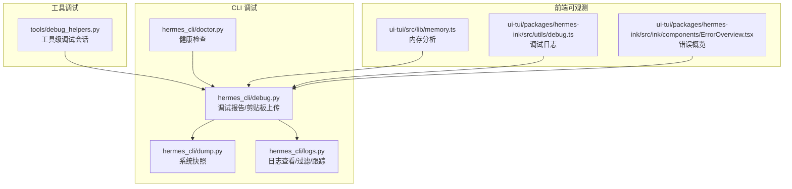
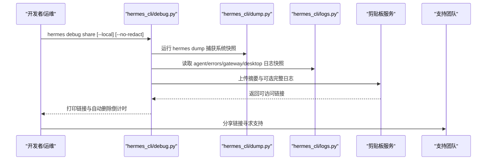
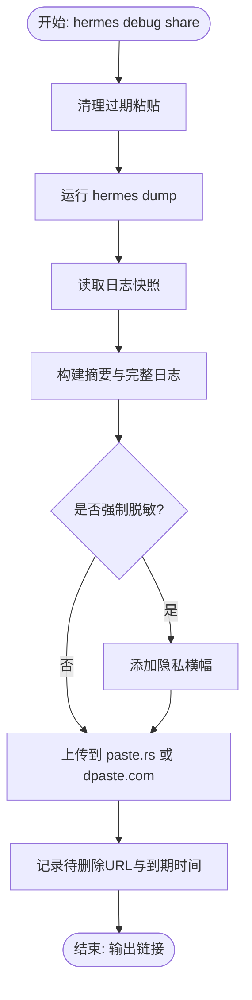
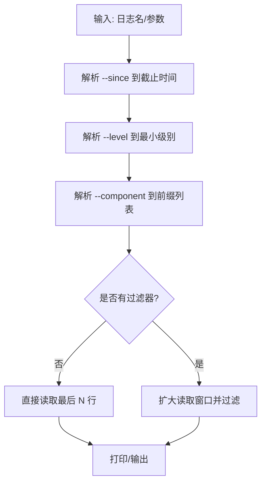
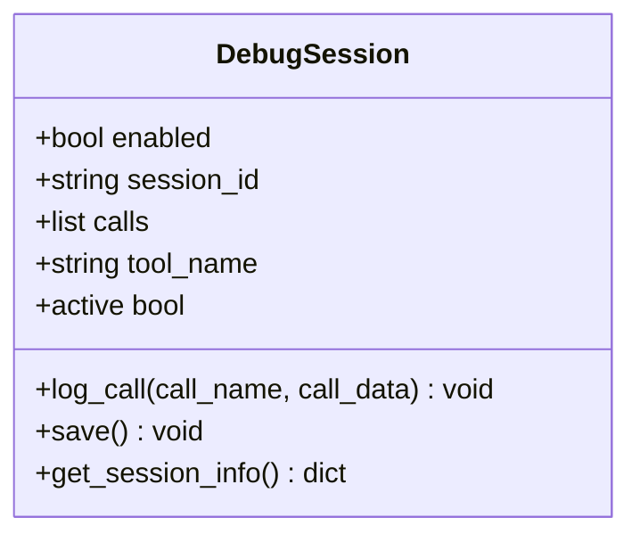
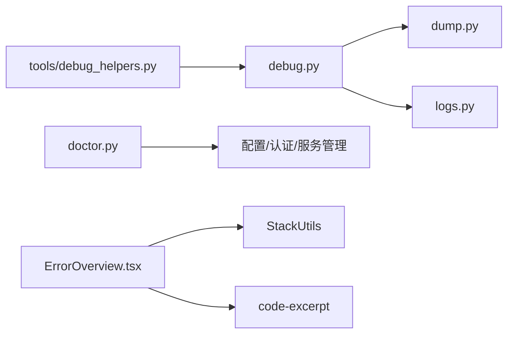
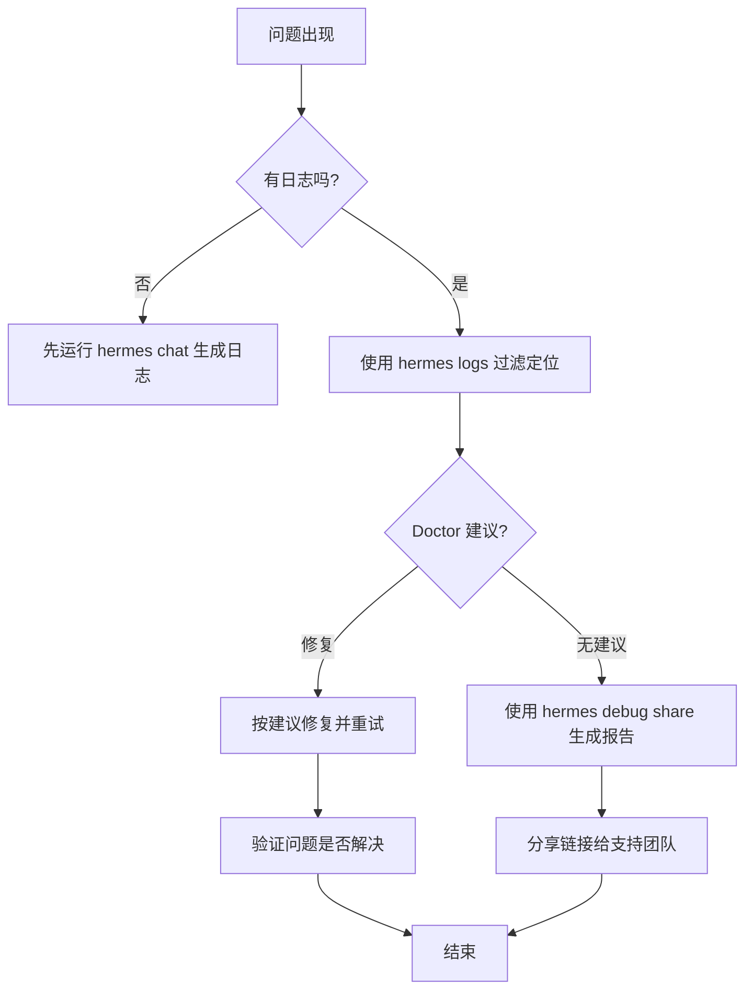

# 调试工具

<cite>
**本文引用的文件**
- [hermes_cli/debug.py](file://hermes_cli/debug.py)
- [hermes_cli/dump.py](file://hermes_cli/dump.py)
- [hermes_cli/logs.py](file://hermes_cli/logs.py)
- [hermes_cli/doctor.py](file://hermes_cli/doctor.py)
- [tools/debug_helpers.py](file://tools/debug_helpers.py)
- [ui-tui/src/lib/memory.ts](file://ui-tui/src/lib/memory.ts)
- [ui-tui/packages/hermes-ink/src/utils/debug.ts](file://ui-tui/packages/hermes-ink/src/utils/debug.ts)
- [ui-tui/packages/hermes-ink/src/ink/components/ErrorOverview.tsx](file://ui-tui/packages/hermes-ink/src/ink/components/ErrorOverview.tsx)
- [tests/hermes_cli/test_debug.py](file://tests/hermes_cli/test_debug.py)
- [tests/hermes_cli/test_doctor.py](file://tests/hermes_cli/test_doctor.py)
- [tests/tools/test_debug_helpers.py](file://tests/tools/test_debug_helpers.py)
- [tests/tools/test_mcp_empty_error_message.py](file://tests/tools/test_mcp_empty_error_message.py)
- [tests/scripts/test_keystroke_diagnostic.py](file://tests/scripts/test_keystroke_diagnostic.py)
- [docs/observability/README.md](file://docs/observability/README.md)
- [website/docs/user-guide/skills/bundled/software-development/software-development-systematic-debugging.md](file://website/docs/user-guide/skills/bundled/software-development/software-development-systematic-debugging.md)
</cite>

## 目录
1. [简介](#简介)
2. [项目结构](#项目结构)
3. [核心组件](#核心组件)
4. [架构总览](#架构总览)
5. [详细组件分析](#详细组件分析)
6. [依赖关系分析](#依赖关系分析)
7. [性能考量](#性能考量)
8. [故障排除指南](#故障排除指南)
9. [结论](#结论)
10. [附录](#附录)

## 简介
本文件面向开发者与运维人员，系统化梳理 Hermes Agent 的调试工具体系，覆盖调试模式启用、诊断信息采集、日志过滤与实时跟踪、性能分析与内存泄漏检测、常见问题定位流程与最佳实践。内容基于仓库中的 CLI 调试命令、日志工具、诊断工具、工具级调试会话记录器以及前端内存监控等模块整理而成。

## 项目结构
围绕调试能力的关键模块分布如下：
- CLI 调试与诊断
  - hermes_cli/debug.py：调试报告生成、日志快照、剪贴板上传、自动删除调度
  - hermes_cli/dump.py：系统快照输出（版本、环境、配置、密钥状态）
  - hermes_cli/logs.py：日志查看、过滤、实时跟踪
  - hermes_cli/doctor.py：系统健康检查与修复建议
- 工具级调试
  - tools/debug_helpers.py：工具级调试会话记录器（JSON 日志）
- 前端可观测性与辅助
  - ui-tui/src/lib/memory.ts：内存增长与泄漏指标分析
  - ui-tui/packages/hermes-ink/src/utils/debug.ts：调试日志工具函数
  - ui-tui/packages/hermes-ink/src/ink/components/ErrorOverview.tsx：错误堆栈与源码摘录展示
- 测试与文档
  - tests/hermes_cli/test_debug.py、tests/hermes_cli/test_doctor.py、tests/tools/test_debug_helpers.py、tests/tools/test_mcp_empty_error_message.py
  - docs/observability/README.md、website 文档中系统化调试技能

**图表来源**
- [hermes_cli/debug.py:1-830](file://hermes_cli/debug.py#L1-L830)
- [hermes_cli/dump.py:1-350](file://hermes_cli/dump.py#L1-L350)
- [hermes_cli/logs.py:1-395](file://hermes_cli/logs.py#L1-L395)
- [hermes_cli/doctor.py:1-2163](file://hermes_cli/doctor.py#L1-L2163)
- [tools/debug_helpers.py:1-106](file://tools/debug_helpers.py#L1-L106)
- [ui-tui/src/lib/memory.ts:85-114](file://ui-tui/src/lib/memory.ts#L85-L114)
- [ui-tui/packages/hermes-ink/src/utils/debug.ts:1-6](file://ui-tui/packages/hermes-ink/src/utils/debug.ts#L1-L6)
- [ui-tui/packages/hermes-ink/src/ink/components/ErrorOverview.tsx:1-46](file://ui-tui/packages/hermes-ink/src/ink/components/ErrorOverview.tsx#L1-L46)

**章节来源**
- [hermes_cli/debug.py:1-830](file://hermes_cli/debug.py#L1-L830)
- [hermes_cli/dump.py:1-350](file://hermes_cli/dump.py#L1-L350)
- [hermes_cli/logs.py:1-395](file://hermes_cli/logs.py#L1-L395)
- [hermes_cli/doctor.py:1-2163](file://hermes_cli/doctor.py#L1-L2163)
- [tools/debug_helpers.py:1-106](file://tools/debug_helpers.py#L1-L106)
- [ui-tui/src/lib/memory.ts:85-114](file://ui-tui/src/lib/memory.ts#L85-L114)
- [ui-tui/packages/hermes-ink/src/utils/debug.ts:1-6](file://ui-tui/packages/hermes-ink/src/utils/debug.ts#L1-L6)
- [ui-tui/packages/hermes-ink/src/ink/components/ErrorOverview.tsx:1-46](file://ui-tui/packages/hermes-ink/src/ink/components/ErrorOverview.tsx#L1-L46)

## 核心组件
- 调试报告与剪贴板分享
  - 收集系统快照、最近日志尾部、完整日志（可选）、隐私横幅、自动删除调度
  - 支持强制脱敏与本地预览
- 系统快照
  - 版本、操作系统、Python、终端后端、模型与提供商、网关状态、平台配置、定时任务、技能数量、配置覆盖项
- 日志工具
  - 支持按级别、会话、组件前缀、相对时间范围过滤，支持实时跟踪
- 健康检查（Doctor）
  - 安全通告、Python 版本、虚拟环境、包依赖、配置文件存在性与内容、提供商凭据、服务状态等
- 工具级调试会话
  - 通过环境变量启用，记录调用序列至 JSON 文件，便于回放与分析
- 前端内存分析
  - 统计活跃句柄、请求、RSS/堆内存、内存增长速率、潜在泄漏指示

**章节来源**
- [hermes_cli/debug.py:535-795](file://hermes_cli/debug.py#L535-L795)
- [hermes_cli/dump.py:219-350](file://hermes_cli/dump.py#L219-L350)
- [hermes_cli/logs.py:142-395](file://hermes_cli/logs.py#L142-L395)
- [hermes_cli/doctor.py:448-2163](file://hermes_cli/doctor.py#L448-L2163)
- [tools/debug_helpers.py:36-106](file://tools/debug_helpers.py#L36-L106)
- [ui-tui/src/lib/memory.ts:85-114](file://ui-tui/src/lib/memory.ts#L85-L114)

## 架构总览
调试工具链以 CLI 为中心，围绕“采集—上传—分析—修复”的闭环工作流组织。系统快照与日志是诊断的两大支柱；Doctor 提供系统级健康度评估；工具级调试会话补充运行期行为细节；前端内存分析用于定位资源泄漏。

**图表来源**
- [hermes_cli/debug.py:604-795](file://hermes_cli/debug.py#L604-L795)
- [hermes_cli/dump.py:219-350](file://hermes_cli/dump.py#L219-L350)
- [hermes_cli/logs.py:142-395](file://hermes_cli/logs.py#L142-L395)

## 详细组件分析

### 调试报告与剪贴板分享（hermes_cli/debug.py）
- 功能要点
  - 收集系统快照与日志快照，支持强制脱敏与隐私横幅
  - 优先上传 paste.rs，失败回退 dpaste.com
  - 记录待删除条目，由网关定时清理；CLI 启动时也会尝试清理过期粘贴
  - 支持本地预览（不联网）与删除指定链接
- 关键流程
  - 采集：运行 dump、读取日志、拼接摘要与完整日志
  - 上传：paste.rs 优先，失败回退 dpaste.com
  - 删除：仅 paste.rs 支持未认证删除；记录到期时间以便后续清理
- 错误处理
  - 上传失败时抛出异常并提示本地预览
  - 清理过期粘贴失败静默处理，避免阻断主流程

**图表来源**
- [hermes_cli/debug.py:604-795](file://hermes_cli/debug.py#L604-L795)

**章节来源**
- [hermes_cli/debug.py:604-795](file://hermes_cli/debug.py#L604-L795)

### 系统快照（hermes_cli/dump.py）
- 输出字段
  - 版本、操作系统、Python、OpenAI SDK、活动配置文件、hermes_home、模型与提供商、终端后端
  - API 密钥状态（可选显示）
  - 功能概览：工具集、MCP 服务器数、内存提供者、网关状态、已配置平台、定时任务、技能数量
  - 配置覆盖项（非默认值）
- 使用场景
  - 支持工单/社区反馈的标准上下文
  - 与调试报告配合，便于远端分析

**章节来源**
- [hermes_cli/dump.py:219-350](file://hermes_cli/dump.py#L219-L350)

### 日志工具（hermes_cli/logs.py）
- 能力
  - 查看最近 N 行、实时跟踪（follow）、按级别过滤（>=）、按会话 ID 子串过滤、按组件前缀过滤、按相对时间范围过滤
  - 解析时间戳、日志级别、记录器名称，支持组合过滤
- 性能
  - 小文件直接读取，大文件从末尾分块读取，提升效率
  - 过滤开启时扩大读取窗口，确保匹配足够数量

**图表来源**
- [hermes_cli/logs.py:111-280](file://hermes_cli/logs.py#L111-L280)

**章节来源**
- [hermes_cli/logs.py:142-395](file://hermes_cli/logs.py#L142-L395)

### 健康检查（hermes_cli/doctor.py）
- 覆盖维度
  - 安全通告（已知漏洞包、未确认通告）
  - Python 环境与虚拟环境
  - 必需/可选包依赖
  - 配置文件存在性与内容（.env、config.yaml）
  - 模型提供商配置与凭据可用性
  - 网关服务状态（systemd 潜留、s6 容器监督）
  - 平台与工具集可用性（运行时门控）
- 交互
  - 支持自动修复（创建空 .env 并收紧权限等）
  - 支持“ack”确认通告，避免重复提醒

**章节来源**
- [hermes_cli/doctor.py:448-2163](file://hermes_cli/doctor.py#L448-L2163)

### 工具级调试会话（tools/debug_helpers.py）
- 设计
  - 通过环境变量启用（如 WEB_TOOLS_DEBUG=true）
  - 记录调用时间、工具名与关键参数到内存列表
  - 结束时持久化为 JSON 文件，包含会话元数据与调用统计
- 适用场景
  - Web 搜索、图像生成、视觉工具等外部调用链路的调试与回放

**图表来源**
- [tools/debug_helpers.py:36-106](file://tools/debug_helpers.py#L36-L106)

**章节来源**
- [tools/debug_helpers.py:1-106](file://tools/debug_helpers.py#L1-L106)
- [tests/tools/test_debug_helpers.py](file://tests/tools/test_debug_helpers.py)

### 前端内存分析（ui-tui/src/lib/memory.ts）
- 指标
  - RSS、堆内存、外部内存、数组缓冲区
  - 活跃句柄、活跃请求
  - 内存增长速率（字节/秒、MB/小时）
  - 潜在泄漏指示：分离上下文、活跃句柄过多、原生内存大于堆、高增长速率、过多打开文件描述符
- 建议
  - 无明显指标时仍需进行堆快照分析

**章节来源**
- [ui-tui/src/lib/memory.ts:85-114](file://ui-tui/src/lib/memory.ts#L85-L114)

### 调试日志与错误概览（UI）
- 调试日志工具函数
  - 提供统一的日志输出接口，便于 UI 层调试
- 错误概览组件
  - 解析堆栈、清理路径、读取源码片段、高亮错误位置

**章节来源**
- [ui-tui/packages/hermes-ink/src/utils/debug.ts:1-6](file://ui-tui/packages/hermes-ink/src/utils/debug.ts#L1-L6)
- [ui-tui/packages/hermes-ink/src/ink/components/ErrorOverview.tsx:1-46](file://ui-tui/packages/hermes-ink/src/ink/components/ErrorOverview.tsx#L1-L46)

## 依赖关系分析
- 组件耦合
  - debug.py 依赖 dump.py 与 logs.py 产出上下文与日志快照
  - doctor.py 依赖配置加载、认证状态、服务管理器等模块
  - tools/debug_helpers.py 与具体工具模块强耦合，但通过环境变量弱化启用条件
- 外部依赖
  - 剪贴板服务（paste.rs、dpaste.com）用于匿名分享
  - 前端依赖（React、StackUtils、code-excerpt）用于错误可视化

**图表来源**
- [hermes_cli/debug.py:516-582](file://hermes_cli/debug.py#L516-L582)
- [hermes_cli/dump.py:219-350](file://hermes_cli/dump.py#L219-L350)
- [hermes_cli/logs.py:142-395](file://hermes_cli/logs.py#L142-L395)
- [hermes_cli/doctor.py:1-2163](file://hermes_cli/doctor.py#L1-L2163)
- [tools/debug_helpers.py:1-106](file://tools/debug_helpers.py#L1-L106)
- [ui-tui/packages/hermes-ink/src/ink/components/ErrorOverview.tsx:1-46](file://ui-tui/packages/hermes-ink/src/ink/components/ErrorOverview.tsx#L1-L46)

**章节来源**
- [hermes_cli/debug.py:516-582](file://hermes_cli/debug.py#L516-L582)
- [hermes_cli/doctor.py:1-2163](file://hermes_cli/doctor.py#L1-L2163)

## 性能考量
- 日志读取
  - 大文件采用从末尾分块读取策略，避免全量扫描
  - 过滤开启时扩大读取窗口，平衡准确性与性能
- 调试报告
  - 限制单文件上传大小，避免超时与带宽占用
  - 异步清理过期粘贴，减少主线程负担
- 内存分析
  - 增长速率阈值（如每小时超过 100MB）作为快速预警
  - 结合活跃句柄与文件描述符数量，缩小排查范围

**章节来源**
- [hermes_cli/logs.py:282-336](file://hermes_cli/logs.py#L282-L336)
- [hermes_cli/debug.py:52-58](file://hermes_cli/debug.py#L52-L58)
- [ui-tui/src/lib/memory.ts:85-114](file://ui-tui/src/lib/memory.ts#L85-L114)

## 故障排除指南

### 常见问题与定位流程
- 无法连接到提供商或模型不可用
  - 使用 Doctor 检查 .env 是否存在、API Key 是否配置、模型提供商是否正确
  - 若为 OAuth/SDK 类提供商，确认登录状态与凭据有效性
- 日志缺失或为空
  - 先运行一次 hermes chat 以生成日志文件
  - 使用 logs 命令查看可用日志与大小
- 调试报告上传失败
  - 使用本地预览模式（--local）生成报告文本
  - 检查网络连通性与剪贴板服务可用性
- 工具调用异常且无明确错误信息
  - 启用对应工具的调试环境变量，复现后查看 JSON 调试日志
  - 对于 MCP 等外部调用，关注空消息异常的回退处理

**图表来源**
- [hermes_cli/logs.py:142-395](file://hermes_cli/logs.py#L142-L395)
- [hermes_cli/doctor.py:448-2163](file://hermes_cli/doctor.py#L448-L2163)
- [hermes_cli/debug.py:694-795](file://hermes_cli/debug.py#L694-L795)

**章节来源**
- [hermes_cli/logs.py:142-395](file://hermes_cli/logs.py#L142-L395)
- [hermes_cli/doctor.py:448-2163](file://hermes_cli/doctor.py#L448-L2163)
- [hermes_cli/debug.py:694-795](file://hermes_cli/debug.py#L694-L795)
- [tests/tools/test_mcp_empty_error_message.py:1-85](file://tests/tools/test_mcp_empty_error_message.py#L1-L85)

### 调试命令与使用示例
- hermes debug share
  - 生成并上传调试报告（含系统快照与日志尾部），支持本地预览与隐私横幅
  - 本地预览：hermes debug share --local
  - 禁用脱敏：hermes debug share --no-redact
- hermes logs
  - 实时跟踪：hermes logs -f
  - 按级别过滤：hermes logs --level WARNING
  - 按组件过滤：hermes logs --component tools
  - 按会话过滤：hermes logs --session abc123
  - 按时间范围：hermes logs --since 1h
- hermes dump
  - 输出系统快照，可选显示密钥（--show-keys）
- hermes doctor
  - 运行健康检查，必要时自动修复（如创建 .env）

**章节来源**
- [hermes_cli/debug.py:694-795](file://hermes_cli/debug.py#L694-L795)
- [hermes_cli/logs.py:142-395](file://hermes_cli/logs.py#L142-L395)
- [hermes_cli/dump.py:219-350](file://hermes_cli/dump.py#L219-L350)
- [hermes_cli/doctor.py:448-2163](file://hermes_cli/doctor.py#L448-L2163)

### 调试配置选项与最佳实践
- 环境变量
  - 工具级调试：如 WEB_TOOLS_DEBUG=true
  - 插件调试：HERMES_PLUGINS_DEBUG=1（测试覆盖）
- 最佳实践
  - 优先使用 Doctor 快速定位配置与环境问题
  - 使用 logs 的组件/级别/会话过滤缩小范围
  - 上传前本地预览，确认敏感信息已脱敏
  - 工具调用使用 JSON 调试日志，保留现场证据
  - 前端内存分析结合增长速率与句柄/FD 指标综合判断

**章节来源**
- [tools/debug_helpers.py:36-106](file://tools/debug_helpers.py#L36-L106)
- [tests/hermes_cli/test_plugins.py:1743-1761](file://tests/hermes_cli/test_plugins.py#L1743-L1761)
- [ui-tui/src/lib/memory.ts:85-114](file://ui-tui/src/lib/memory.ts#L85-L114)

### 性能分析与并发问题诊断
- 性能分析
  - 使用 hermes logs 的级别与组件过滤，识别热点模块
  - 结合系统快照观察模型提供商与终端后端配置对吞吐的影响
- 并发问题
  - 观察日志中的会话标识与组件前缀，定位跨线程/进程交互
  - 前端内存分析关注活跃句柄与文件描述符异常增长

**章节来源**
- [hermes_cli/logs.py:142-395](file://hermes_cli/logs.py#L142-L395)
- [hermes_cli/dump.py:219-350](file://hermes_cli/dump.py#L219-L350)
- [ui-tui/src/lib/memory.ts:85-114](file://ui-tui/src/lib/memory.ts#L85-L114)

### 常见问题定位参考
- 空错误消息导致难以诊断
  - 确保异常字符串非空，必要时回退到 repr 形式
- 剪贴板服务不可达
  - 自动回退到 dpaste.com；若仍失败，使用本地预览
- Doctor 无法确认某些服务状态
  - 在容器内关注 s6 监督状态，在主机上关注 systemd 潜留

**章节来源**
- [tests/tools/test_mcp_empty_error_message.py:1-85](file://tests/tools/test_mcp_empty_error_message.py#L1-L85)
- [hermes_cli/debug.py:317-339](file://hermes_cli/debug.py#L317-L339)
- [hermes_cli/doctor.py:261-351](file://hermes_cli/doctor.py#L261-L351)

## 结论
Hermes Agent 的调试工具体系以 CLI 为核心，结合系统快照、日志过滤、健康检查与工具级调试会话，形成从“采集—上传—分析—修复”的闭环。配合前端内存分析与错误概览组件，能够高效定位性能瓶颈、并发问题与资源泄漏。建议在日常开发与运维中常态化使用 Doctor 与 logs，遇到复杂问题时启用工具级调试与调试报告，以获得充分证据支撑问题复现与修复。

## 附录

### 相关文档与资源
- 可观测性文档索引
  - [docs/observability/README.md](file://docs/observability/README.md)
- 系统化调试技能
  - [website 文档：systematic-debugging:336-386](file://website/docs/user-guide/skills/bundled/software-development/software-development-systematic-debugging.md#L336-L386)

**章节来源**
- [docs/observability/README.md](file://docs/observability/README.md)
- [website/docs/user-guide/skills/bundled/software-development/software-development-systematic-debugging.md:336-386](file://website/docs/user-guide/skills/bundled/software-development/software-development-systematic-debugging.md#L336-L386)