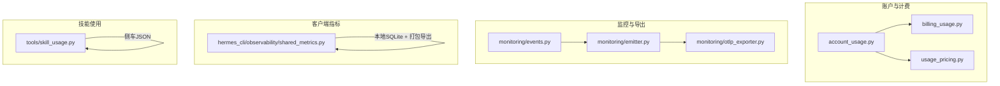
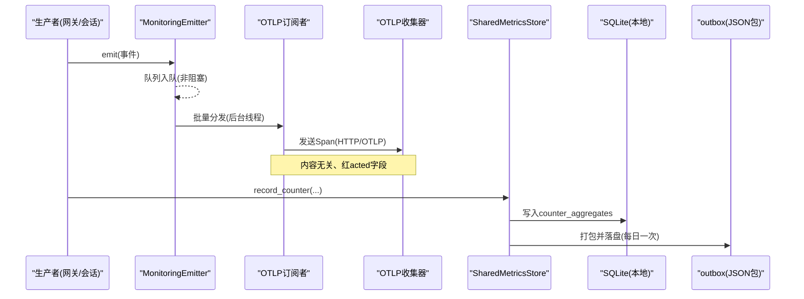
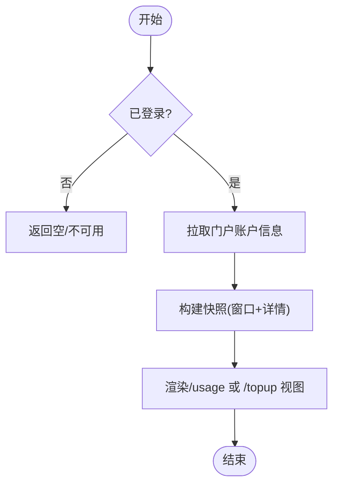
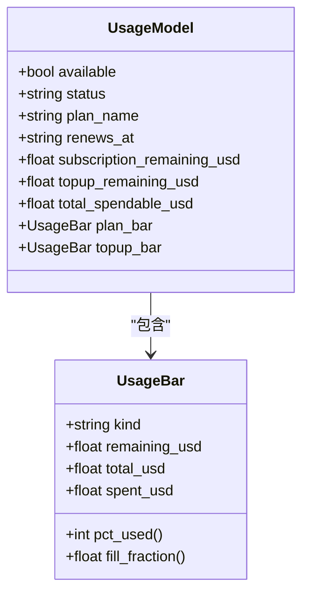
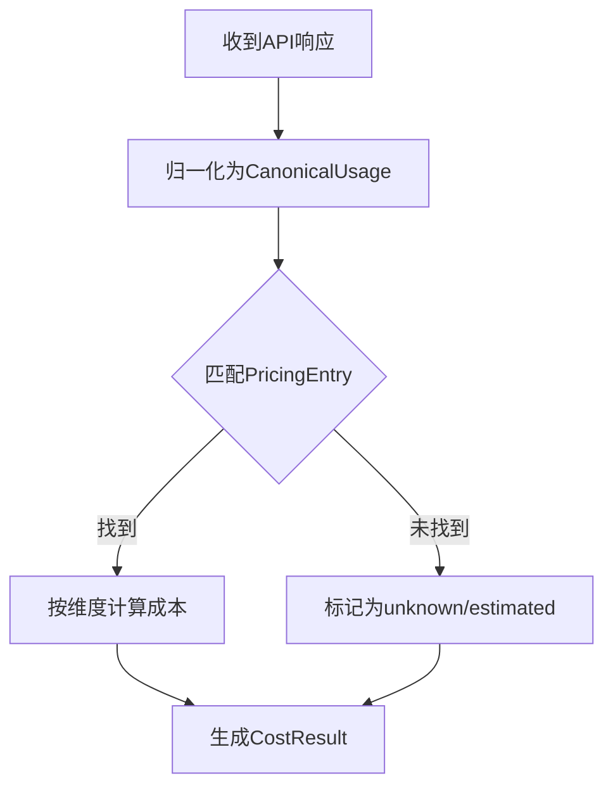
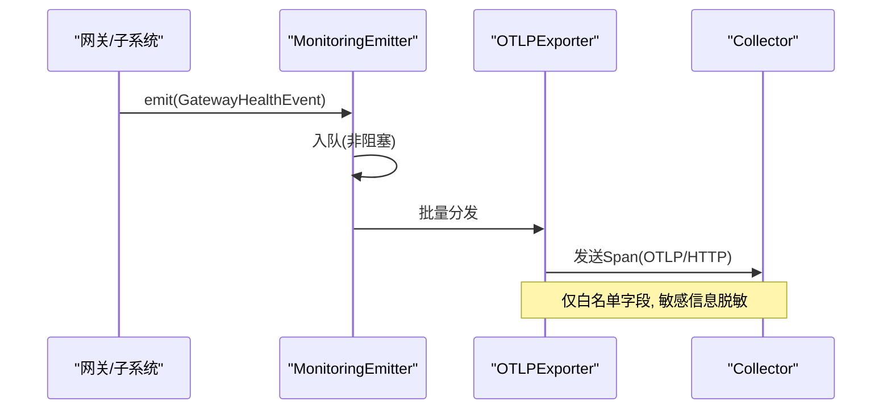
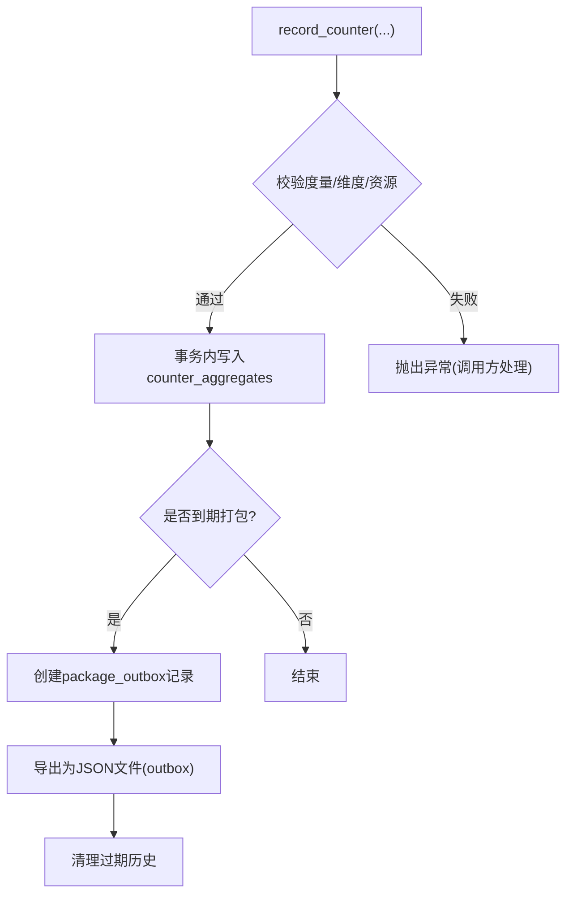
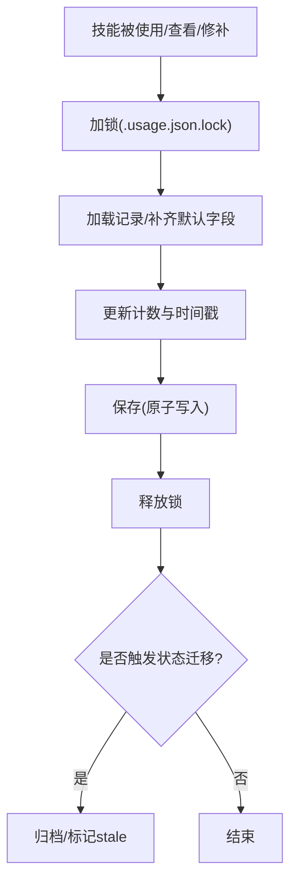
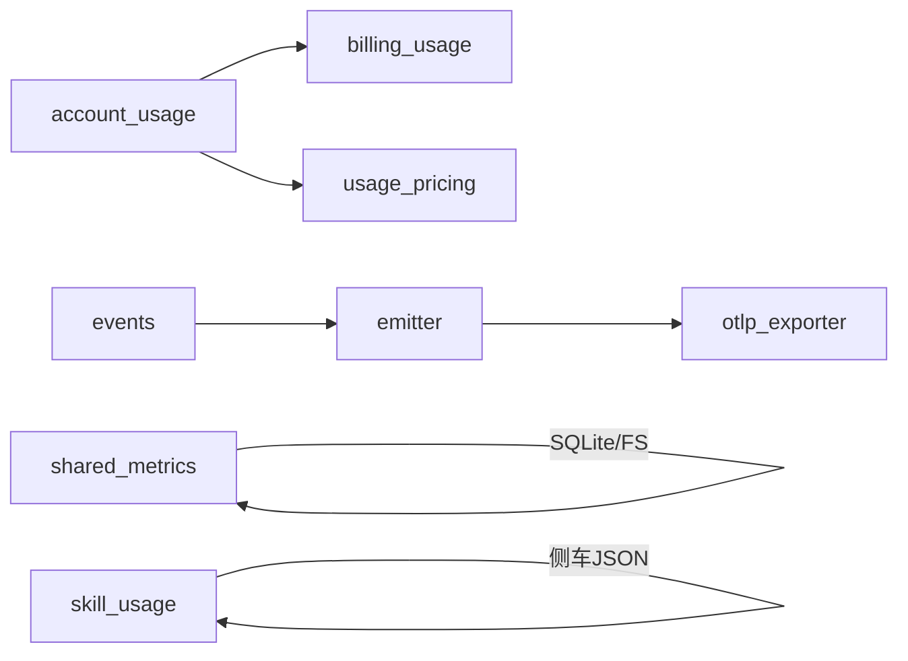

# 使用统计

<cite>
**本文引用的文件**
- [agent/account_usage.py](file://agent/account_usage.py)
- [agent/billing_usage.py](file://agent/billing_usage.py)
- [agent/usage_pricing.py](file://agent/usage_pricing.py)
- [agent/monitoring/emitter.py](file://agent/monitoring/emitter.py)
- [agent/monitoring/events.py](file://agent/monitoring/events.py)
- [agent/monitoring/otlp_exporter.py](file://agent/monitoring/otlp_exporter.py)
- [hermes_cli/observability/shared_metrics.py](file://hermes_cli/observability/shared_metrics.py)
- [tools/skill_usage.py](file://tools/skill_usage.py)
</cite>

## 目录
1. [简介](#简介)
2. [项目结构](#项目结构)
3. [核心组件](#核心组件)
4. [架构总览](#架构总览)
5. [详细组件分析](#详细组件分析)
6. [依赖关系分析](#依赖关系分析)
7. [性能考量](#性能考量)
8. [故障排查指南](#故障排查指南)
9. [结论](#结论)
10. [附录](#附录)

## 简介
本文件面向产品与运营团队，系统化说明 Hermes Agent 的“使用统计”能力：如何采集用户行为、功能使用率与性能指标；如何聚合、存储与查询；如何配置策略、保障隐私与合规；以及如何生成报告、进行趋势分析与容量规划。文档同时覆盖多租户隔离、异常检测、安全审计与合规检查方法，并提供可操作的可视化与工具建议。

## 项目结构
围绕“使用统计”，代码库按职责分层组织：
- 账户与计费使用：account_usage、billing_usage、usage_pricing
- 监控事件与导出：monitoring.emitter、events、otlp_exporter
- 客户端共享指标：hermes_cli/observability/shared_metrics
- 技能使用追踪：tools/skill_usage

图表来源
- [agent/account_usage.py:1-120](file://agent/account_usage.py#L1-L120)
- [agent/billing_usage.py:1-120](file://agent/billing_usage.py#L1-L120)
- [agent/usage_pricing.py:1-120](file://agent/usage_pricing.py#L1-L120)
- [agent/monitoring/emitter.py:1-120](file://agent/monitoring/emitter.py#L1-L120)
- [agent/monitoring/events.py:1-87](file://agent/monitoring/events.py#L1-L87)
- [agent/monitoring/otlp_exporter.py:1-120](file://agent/monitoring/otlp_exporter.py#L1-L120)
- [hermes_cli/observability/shared_metrics.py:1-120](file://hermes_cli/observability/shared_metrics.py#L1-L120)
- [tools/skill_usage.py:1-120](file://tools/skill_usage.py#L1-L120)

章节来源
- [agent/account_usage.py:1-120](file://agent/account_usage.py#L1-L120)
- [agent/billing_usage.py:1-120](file://agent/billing_usage.py#L1-L120)
- [agent/usage_pricing.py:1-120](file://agent/usage_pricing.py#L1-L120)
- [agent/monitoring/emitter.py:1-120](file://agent/monitoring/emitter.py#L1-L120)
- [agent/monitoring/events.py:1-87](file://agent/monitoring/events.py#L1-L87)
- [agent/monitoring/otlp_exporter.py:1-120](file://agent/monitoring/otlp_exporter.py#L1-L120)
- [hermes_cli/observability/shared_metrics.py:1-120](file://hermes_cli/observability/shared_metrics.py#L1-L120)
- [tools/skill_usage.py:1-120](file://tools/skill_usage.py#L1-L120)

## 核心组件
- 账户与配额使用（account_usage）
  - 统一快照模型 AccountUsageSnapshot/AccountUsageWindow，支持多提供商（Nous、OpenAI Codex、Anthropic OAuth）的限额窗口、重置时间与详情行渲染。
  - 提供 /usage 与 /topup 视图构建，失败开放（fail-open），不阻塞主流程。
- 账单与订阅用量（billing_usage）
  - 以美元为单位的 UsageModel/UsageBar，区分“计划额度”和“充值额度”，并给出健康度状态（free/low/healthy/depleted）。
- 用量与定价（usage_pricing）
  - CanonicalUsage 聚合 token 级用量（输入、输出、缓存读写、推理等），PricingEntry 维护各厂商/模型的官方定价快照，CostResult 标注成本来源与可信度。
- 监控事件与导出（monitoring）
  - MonitoringEmitter 提供微秒级 emit 接口，后台线程批量分发到订阅者（如 OTLP 流式导出）。
  - events 定义内容无关的健康/诊断/定时任务事件，确保不泄露业务数据。
  - otlp_exporter 将事件映射为 OpenTelemetry Span，通过 HTTP 发送到操作者配置的收集器。
- 客户端共享指标（shared_metrics）
  - SharedMetricsStore 在本地 SQLite 中按日聚合计数器，打包成不可变 JSON 包，落盘 outbox，保留期有限，支持导出与清理。
- 技能使用追踪（skill_usage）
  - 以侧车 .usage.json 记录技能使用、查看、修补次数与时间戳，支持生命周期状态机（active/stale/archived/pinned）与自动归档策略。

章节来源
- [agent/account_usage.py:120-800](file://agent/account_usage.py#L120-L800)
- [agent/billing_usage.py:80-224](file://agent/billing_usage.py#L80-L224)
- [agent/usage_pricing.py:30-100](file://agent/usage_pricing.py#L30-L100)
- [agent/monitoring/emitter.py:36-165](file://agent/monitoring/emitter.py#L36-L165)
- [agent/monitoring/events.py:19-87](file://agent/monitoring/events.py#L19-L87)
- [agent/monitoring/otlp_exporter.py:138-218](file://agent/monitoring/otlp_exporter.py#L138-L218)
- [hermes_cli/observability/shared_metrics.py:47-224](file://hermes_cli/observability/shared_metrics.py#L47-L224)
- [tools/skill_usage.py:53-175](file://tools/skill_usage.py#L53-L175)

## 架构总览
下图展示从采集到导出的端到端路径：生产者在热路径仅做轻量入队；后台线程批处理并分发给订阅者；OTLP 订阅者将事件转为遥测数据；共享指标在本地持久化并按周期打包导出；账户/账单/定价模块提供用量与成本视角。

图表来源
- [agent/monitoring/emitter.py:52-116](file://agent/monitoring/emitter.py#L52-L116)
- [agent/monitoring/otlp_exporter.py:168-218](file://agent/monitoring/otlp_exporter.py#L168-L218)
- [hermes_cli/observability/shared_metrics.py:120-224](file://hermes_cli/observability/shared_metrics.py#L120-L224)

## 详细组件分析

### 账户与配额使用（account_usage）
- 关键数据结构
  - AccountUsageSnapshot：包含 provider、source、fetched_at、plan、windows、details、unavailable_reason。
  - AccountUsageWindow：label、used_percent、reset_at、detail。
- 主要流程
  - nous_credits_lines：优先尝试开发夹具，否则读取认证态并拉取门户账户信息，构建快照并渲染。
  - build_nous_credits_snapshot：将门户数据映射为窗口与详情，计算订阅使用百分比。
  - _fetch_codex_account_usage：调用后端 usage API，解析 rate_limit windows 与 credits 余额。
  - redeem_codex_reset_credit：读取可用重置额度，校验是否耗尽，必要时消费并清理池冷却。
  - _fetch_anthropic_account_usage：OAuth 模式下获取 Anthropic 使用窗口与额外用量。
- 错误与降级
  - 所有网络/鉴权异常均 fail-open，返回空或不可用原因，不影响主流程。

图表来源
- [agent/account_usage.py:233-280](file://agent/account_usage.py#L233-L280)
- [agent/account_usage.py:137-231](file://agent/account_usage.py#L137-L231)
- [agent/account_usage.py:510-563](file://agent/account_usage.py#L510-L563)
- [agent/account_usage.py:587-748](file://agent/account_usage.py#L587-L748)
- [agent/account_usage.py:751-800](file://agent/account_usage.py#L751-L800)

章节来源
- [agent/account_usage.py:21-120](file://agent/account_usage.py#L21-L120)
- [agent/account_usage.py:137-280](file://agent/account_usage.py#L137-L280)
- [agent/account_usage.py:510-748](file://agent/account_usage.py#L510-L748)
- [agent/account_usage.py:751-800](file://agent/account_usage.py#L751-L800)

### 账单与订阅用量（billing_usage）
- 关键数据结构
  - UsageModel：available、status、plan_name、renews_at、subscription_remaining_usd、topup_remaining_usd、total_spendable_usd、plan_bar、topup_bar。
  - UsageBar：kind("plan"/"topup")、remaining_usd、total_usd、spent_usd，以及 pct_used/fill_fraction。
- 主要逻辑
  - usage_model_from_account：从门户账户信息推导状态（free/low/healthy/depleted），构造 plan/topup 双条。
  - build_usage_model：封装门户拉取与模型构建，支持开发夹具。
- 设计要点
  - 以美元为单位，避免“积分”歧义；低余额阈值用于告警提示。

图表来源
- [agent/billing_usage.py:88-141](file://agent/billing_usage.py#L88-L141)
- [agent/billing_usage.py:143-224](file://agent/billing_usage.py#L143-L224)

章节来源
- [agent/billing_usage.py:1-120](file://agent/billing_usage.py#L1-L120)
- [agent/billing_usage.py:143-224](file://agent/billing_usage.py#L143-L224)
- [agent/billing_usage.py:226-324](file://agent/billing_usage.py#L226-L324)

### 用量与定价（usage_pricing）
- 关键数据结构
  - CanonicalUsage：input_tokens、output_tokens、cache_read/write_tokens、reasoning_tokens、request_count，支持相加合并。
  - PricingEntry：各维度每百万成本、来源、版本、抓取时间。
  - CostResult：金额、状态（actual/estimated/included/unknown）、来源、标签、版本、备注。
- 主要逻辑
  - 官方定价快照：针对主流厂商/模型维护稳定定价条目，含缓存读写折扣规则。
  - 成本估算：结合 CanonicalUsage 与 PricingEntry 计算 USD 成本，标注可信度与来源。
- 复杂度
  - 合并操作 O(1)，定价查找近似 O(1)（字典键为 (provider, model)）。

图表来源
- [agent/usage_pricing.py:30-100](file://agent/usage_pricing.py#L30-L100)
- [agent/usage_pricing.py:103-120](file://agent/usage_pricing.py#L103-L120)

章节来源
- [agent/usage_pricing.py:30-100](file://agent/usage_pricing.py#L30-L100)
- [agent/usage_pricing.py:103-120](file://agent/usage_pricing.py#L103-L120)

### 监控事件与导出（monitoring）
- 事件类型
  - GatewayHealthEvent：网关健康快照/生命周期事件，无业务内容。
  - GatewayDiagnosticEvent：子系统诊断事件，带严重级别与错误分类。
  - CronExecutionEvent：定时任务执行生命周期投影。
- 发射器
  - MonitoringEmitter：emit 必须 O(微秒)、不阻塞、不抛异常；队列满时丢弃最旧事件；后台线程批量分发。
- OTLP 导出
  - OTLPStreamer：将事件映射为 Span 属性（仅白名单字段），发送至操作者配置的 Collector；支持 headers_env 注入。
  - start_streaming：若启用则自动安装可选依赖并订阅 emitter。

图表来源
- [agent/monitoring/events.py:19-87](file://agent/monitoring/events.py#L19-L87)
- [agent/monitoring/emitter.py:52-116](file://agent/monitoring/emitter.py#L52-L116)
- [agent/monitoring/otlp_exporter.py:138-218](file://agent/monitoring/otlp_exporter.py#L138-L218)

章节来源
- [agent/monitoring/events.py:1-87](file://agent/monitoring/events.py#L1-L87)
- [agent/monitoring/emitter.py:1-165](file://agent/monitoring/emitter.py#L1-L165)
- [agent/monitoring/otlp_exporter.py:1-120](file://agent/monitoring/otlp_exporter.py#L1-L120)
- [agent/monitoring/otlp_exporter.py:168-218](file://agent/monitoring/otlp_exporter.py#L168-L218)

### 客户端共享指标（shared_metrics）
- 存储结构
  - counter_aggregates：按 period_start、metric_name、资源维度（hermes_version、os_family、architecture、install_method）与 dimensions_json 聚合计数。
  - package_outbox：打包后的不可变 JSON 包，记录创建/导出时间。
  - telemetry_state：schema_version、install_id、活跃记录时间等元数据。
- 主要流程
  - record_counter：校验度量名与维度，原子递增当日计数。
  - create_and_export_package_if_due：每日最多打包一次，写入 outbox，并清理过期历史。
  - counter_snapshot：供测试与本地检查的累计快照。
- 隐私与合规
  - 仅允许白名单度量与维度；资源字段受限；本地文件权限收紧（700/600）。

图表来源
- [hermes_cli/observability/shared_metrics.py:120-224](file://hermes_cli/observability/shared_metrics.py#L120-L224)
- [hermes_cli/observability/shared_metrics.py:300-374](file://hermes_cli/observability/shared_metrics.py#L300-L374)
- [hermes_cli/observability/shared_metrics.py:463-655](file://hermes_cli/observability/shared_metrics.py#L463-L655)
- [hermes_cli/observability/shared_metrics.py:657-719](file://hermes_cli/observability/shared_metrics.py#L657-L719)

章节来源
- [hermes_cli/observability/shared_metrics.py:47-224](file://hermes_cli/observability/shared_metrics.py#L47-L224)
- [hermes_cli/observability/shared_metrics.py:300-374](file://hermes_cli/observability/shared_metrics.py#L300-L374)
- [hermes_cli/observability/shared_metrics.py:463-719](file://hermes_cli/observability/shared_metrics.py#L463-L719)

### 技能使用追踪（skill_usage）
- 侧车文件
  - ~/.hermes/skills/.usage.json：按技能名索引，记录 use/view/patch 次数与时间戳、状态、是否 pinned 等。
- 生命周期
  - active → stale → archived（基于配置的天数阈值），pinned 可豁免自动转换。
- 治理与保护
  - 受保护的内置技能（如 plan）不会被归档或合并；Hub 安装与外部技能不受 curator 管理。
- 并发与原子性
  - 使用文件锁序列化读写；原子写入（临时文件+替换）保证一致性。

图表来源
- [tools/skill_usage.py:89-123](file://tools/skill_usage.py#L89-L123)
- [tools/skill_usage.py:146-175](file://tools/skill_usage.py#L146-L175)
- [tools/skill_usage.py:644-705](file://tools/skill_usage.py#L644-L705)
- [tools/skill_usage.py:743-771](file://tools/skill_usage.py#L743-L771)

章节来源
- [tools/skill_usage.py:53-175](file://tools/skill_usage.py#L53-L175)
- [tools/skill_usage.py:644-705](file://tools/skill_usage.py#L644-L705)
- [tools/skill_usage.py:743-771](file://tools/skill_usage.py#L743-L771)

## 依赖关系分析
- 模块耦合
  - account_usage 依赖认证与门户/后端 API；billing_usage 依赖账户信息；usage_pricing 依赖模型元数据与定价快照。
  - monitoring 层解耦：emitter 与 exporter 通过订阅者模式连接，互不影响。
  - shared_metrics 独立于运行时，仅依赖 SQLite 与文件系统。
  - skill_usage 与 curator 协作，但不影响核心会话路径。
- 外部依赖
  - OTLP 导出为可选依赖，按需懒加载；其余均为标准库或内部模块。

图表来源
- [agent/account_usage.py:1-120](file://agent/account_usage.py#L1-L120)
- [agent/monitoring/emitter.py:1-120](file://agent/monitoring/emitter.py#L1-L120)
- [agent/monitoring/otlp_exporter.py:1-120](file://agent/monitoring/otlp_exporter.py#L1-L120)
- [hermes_cli/observability/shared_metrics.py:1-120](file://hermes_cli/observability/shared_metrics.py#L1-L120)
- [tools/skill_usage.py:1-120](file://tools/skill_usage.py#L1-L120)

章节来源
- [agent/account_usage.py:1-120](file://agent/account_usage.py#L1-L120)
- [agent/monitoring/emitter.py:1-120](file://agent/monitoring/emitter.py#L1-L120)
- [agent/monitoring/otlp_exporter.py:1-120](file://agent/monitoring/otlp_exporter.py#L1-L120)
- [hermes_cli/observability/shared_metrics.py:1-120](file://hermes_cli/observability/shared_metrics.py#L1-L120)
- [tools/skill_usage.py:1-120](file://tools/skill_usage.py#L1-L120)

## 性能考量
- 热路径零阻塞
  - MonitoringEmitter.emit 保证微秒级返回，队列满时丢弃最旧事件，避免背压影响网关。
- 批量与节流
  - 导出按批次（~256）处理，减少网络开销；共享指标每日打包一次，降低磁盘与 I/O 压力。
- 资源限制
  - 共享指标数据库设置 busy_timeout，防止长时间锁竞争；文件权限收紧，避免越权访问。
- 成本估算
  - 定价快照与 CanonicalUsage 合并为 O(1)/O(n) 计算，适合高频调用。

[本节为通用指导，无需特定文件引用]

## 故障排查指南
- 监控导出失败
  - 检查 OTLP 配置 endpoint 与 headers_env 环境变量；确认可选依赖已安装；查看日志中的“subscriber failed”与“span map failed”。
- 共享指标未导出
  - 确认 daily 打包条件满足；检查 outbox 目录权限与空间；查看 package_outbox 是否已标记 exported_at。
- 账户/账单视图为空
  - 检查认证态与门户可达性；关注 fail-open 分支；查看调试日志中的“portal fetch failed”。
- 技能使用未更新
  - 检查 .usage.json 是否存在且可读；确认文件锁未被占用；查看原子写入是否成功。

章节来源
- [agent/monitoring/otlp_exporter.py:220-261](file://agent/monitoring/otlp_exporter.py#L220-L261)
- [hermes_cli/observability/shared_metrics.py:623-719](file://hermes_cli/observability/shared_metrics.py#L623-L719)
- [agent/account_usage.py:233-280](file://agent/account_usage.py#L233-L280)
- [tools/skill_usage.py:644-705](file://tools/skill_usage.py#L644-L705)

## 结论
Hermes Agent 的使用统计体系以“热路径零阻塞、离线持久化、可选远端导出”为核心原则，兼顾性能与隐私。通过账户/账单/定价三重视角，结合监控事件与客户端共享指标，形成完整的数据闭环。建议在生产环境启用 OTLP 导出与共享指标打包，配合本地可视化与告警，实现数据驱动的决策与运营优化。

[本节为总结，无需特定文件引用]

## 附录

### 数据采集与聚合算法
- 计数器聚合：按日粒度、按资源维度与维度键值聚合，增量写入，打包后标记 packaged_value 防重。
- 用量归一化：CanonicalUsage 将不同来源的 token 计数统一，支持相加合并。
- 成本估算：依据 PricingEntry 的 per-M 单价乘以对应 token 数量，考虑缓存读写折扣。

章节来源
- [hermes_cli/observability/shared_metrics.py:151-197](file://hermes_cli/observability/shared_metrics.py#L151-L197)
- [agent/usage_pricing.py:30-66](file://agent/usage_pricing.py#L30-L66)

### 存储结构与查询接口
- SQLite 表
  - counter_aggregates：period_start、metric_name、资源维度、dimensions_json、value、packaged_value。
  - package_outbox：package_id、period_start/end、payload_json、created_at、exported_at。
  - telemetry_state：key/value 元数据（schema_version、install_id、活跃时间）。
- 查询
  - counter_snapshot：返回累计计数器，便于测试与本地检查。
  - 打包导出：create_and_export_package_if_due 每日一次，生成不可变 JSON 包。

章节来源
- [hermes_cli/observability/shared_metrics.py:300-374](file://hermes_cli/observability/shared_metrics.py#L300-L374)
- [hermes_cli/observability/shared_metrics.py:223-264](file://hermes_cli/observability/shared_metrics.py#L223-L264)
- [hermes_cli/observability/shared_metrics.py:463-655](file://hermes_cli/observability/shared_metrics.py#L463-L655)

### 使用策略配置、隐私保护与合规要求
- 策略
  - OTLP 导出需显式配置 endpoint；headers_env 从环境变量读取，不落盘。
  - 共享指标仅允许白名单度量与维度，资源字段受限。
- 隐私
  - 监控事件内容无关；导出前对字符串字段进行脱敏；本地文件权限收紧。
- 合规
  - 本地保留期有限（30天）；打包后不可变；支持清理过期历史。

章节来源
- [agent/monitoring/otlp_exporter.py:83-115](file://agent/monitoring/otlp_exporter.py#L83-L115)
- [agent/monitoring/otlp_exporter.py:138-165](file://agent/monitoring/otlp_exporter.py#L138-L165)
- [hermes_cli/observability/shared_metrics.py:47-62](file://hermes_cli/observability/shared_metrics.py#L47-L62)
- [hermes_cli/observability/shared_metrics.py:657-719](file://hermes_cli/observability/shared_metrics.py#L657-L719)

### 使用报告生成、趋势分析与容量规划
- 报告
  - 使用 billing_usage 的 UsageModel 生成美元视角的报告（计划/充值额度与健康度）。
  - 使用 account_usage 的 AccountUsageSnapshot 生成配额窗口与重置时间。
- 趋势
  - 基于 shared_metrics 的历史包进行跨日对比；结合 OTLP 数据进行时序分析。
- 容量规划
  - 根据 CanonicalUsage 与 PricingEntry 预估成本；结合配额窗口预测耗尽时间。

章节来源
- [agent/billing_usage.py:143-224](file://agent/billing_usage.py#L143-L224)
- [agent/account_usage.py:137-231](file://agent/account_usage.py#L137-L231)
- [hermes_cli/observability/shared_metrics.py:463-655](file://hermes_cli/observability/shared_metrics.py#L463-L655)
- [agent/usage_pricing.py:30-100](file://agent/usage_pricing.py#L30-L100)

### 统计分析工具与可视化配置
- 工具
  - 使用 counter_snapshot 进行本地检查；使用 OTLP 收集器（如 DataDog、Grafana）进行可视化。
- 配置
  - 在 monitoring.export.otlp 中设置 endpoint 与 headers_env；启用 start_streaming。
  - 共享指标 outbox 可由外部脚本定期上传至中央存储。

章节来源
- [agent/monitoring/otlp_exporter.py:235-261](file://agent/monitoring/otlp_exporter.py#L235-L261)
- [hermes_cli/observability/shared_metrics.py:623-655](file://hermes_cli/observability/shared_metrics.py#L623-L655)

### 多租户隔离与权限控制
- 隔离
  - 共享指标按 hermes_version、os_family、architecture、install_method 与 dimensions_json 维度隔离。
  - 监控事件携带 service.instance.id，便于实例级隔离。
- 权限
  - 本地文件与目录权限收紧（700/600）；OTLP 头部通过环境变量注入，避免硬编码。

章节来源
- [hermes_cli/observability/shared_metrics.py:350-374](file://hermes_cli/observability/shared_metrics.py#L350-L374)
- [agent/monitoring/otlp_exporter.py:118-126](file://agent/monitoring/otlp_exporter.py#L118-L126)
- [hermes_cli/observability/shared_metrics.py:284-298](file://hermes_cli/observability/shared_metrics.py#L284-L298)

### 异常使用检测、安全审计与合规检查
- 异常检测
  - 基于监控事件（gateway_diagnostic）与 cron_execution 事件识别异常与失败。
  - 共享指标维度变化可作为异常信号（如新增未知维度）。
- 安全审计
  - 监控事件内容无关；导出前脱敏；本地文件权限与只读策略。
- 合规检查
  - 保留期与清理策略；打包不可变；可选远端导出由操作者控制。

章节来源
- [agent/monitoring/events.py:45-87](file://agent/monitoring/events.py#L45-L87)
- [agent/monitoring/otlp_exporter.py:138-165](file://agent/monitoring/otlp_exporter.py#L138-L165)
- [hermes_cli/observability/shared_metrics.py:657-719](file://hermes_cli/observability/shared_metrics.py#L657-L719)