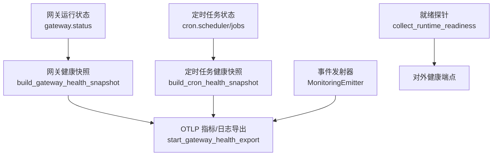
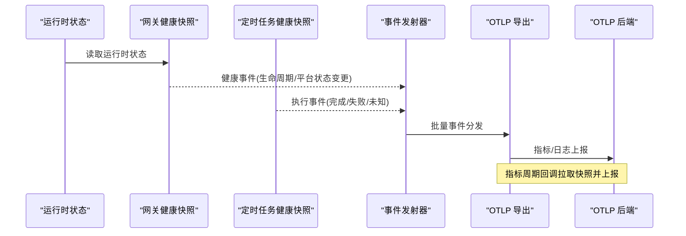
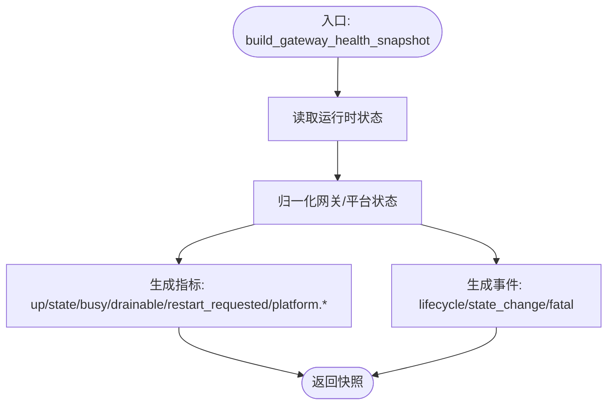
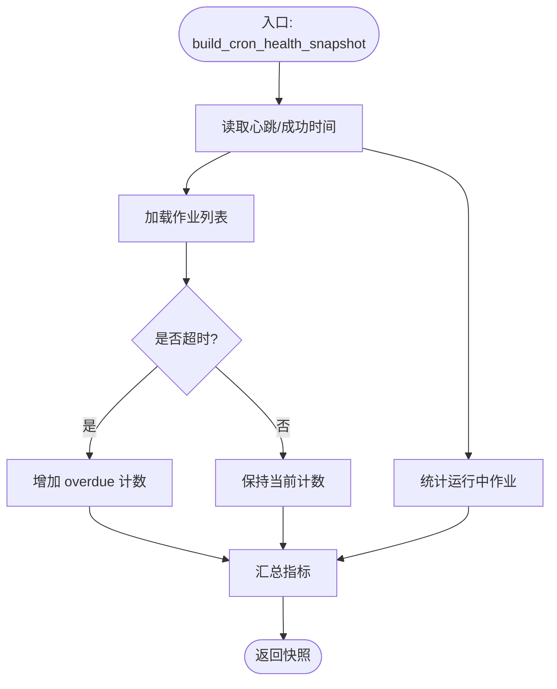
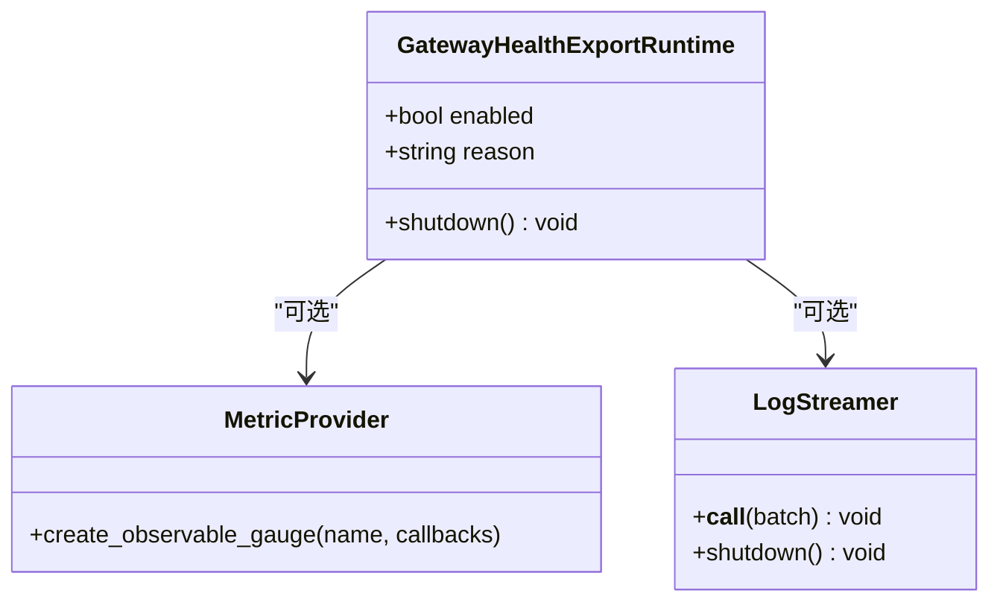
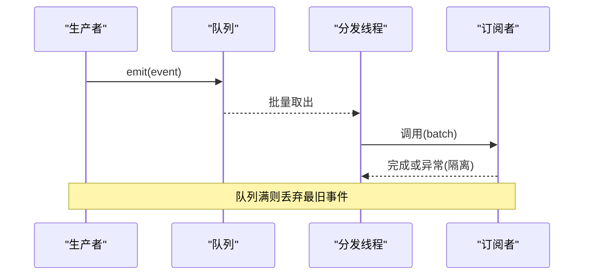
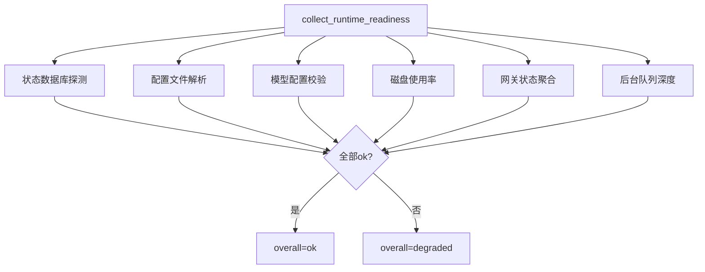
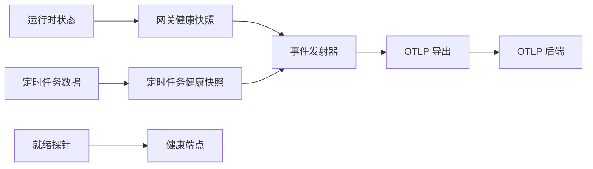

# 健康检查

<cite>
**本文引用的文件**
- [gateway_health.py](file://agent/monitoring/gateway_health.py)
- [cron_health.py](file://agent/monitoring/cron_health.py)
- [gateway_health_export.py](file://agent/monitoring/gateway_health_export.py)
- [emitter.py](file://agent/monitoring/emitter.py)
- [readiness.py](file://gateway/readiness.py)
</cite>

## 目录
1. [简介](#简介)
2. [项目结构](#项目结构)
3. [核心组件](#核心组件)
4. [架构总览](#架构总览)
5. [详细组件分析](#详细组件分析)
6. [依赖关系分析](#依赖关系分析)
7. [性能与可观测性](#性能与可观测性)
8. [故障诊断与自动恢复](#故障诊断与自动恢复)
9. [配置与阈值](#配置与阈值)
10. [仪表板、告警与通知](#仪表板告警与通知)
11. [自定义检查项开发指南](#自定义检查项开发指南)
12. [容器化与编排集成](#容器化与编排集成)
13. [结论](#结论)

## 简介
本文件面向运维与平台工程团队，系统化说明 Hermes Agent 的健康检查体系：组件状态监控、依赖服务检测、故障自动恢复机制、健康评估算法、降级策略、服务发现集成方式、健康仪表板与告警通知配置、健康检查脚本编写与自定义检查项开发方法，以及在容器化环境下的最佳实践。目标是提供一套完整的高可用保障方案与可观测性落地指引。

## 项目结构
健康检查相关能力主要分布在以下模块：
- 网关健康快照与事件：将运行时状态转换为指标与健康事件
- 定时任务健康快照：采集调度器心跳、成功率、延迟等
- OTLP 导出运行时：将指标与诊断日志通过 OpenTelemetry 导出到后端
- 事件发射器：无阻塞的事件队列与分发
- 就绪探针：对数据库、配置、磁盘、网关状态进行非破坏性探测

图表来源
- [gateway_health.py:210-291](file://agent/monitoring/gateway_health.py#L210-L291)
- [cron_health.py:148-192](file://agent/monitoring/cron_health.py#L148-L192)
- [gateway_health_export.py:587-637](file://agent/monitoring/gateway_health_export.py#L587-L637)
- [emitter.py:36-116](file://agent/monitoring/emitter.py#L36-L116)
- [readiness.py:89-119](file://gateway/readiness.py#L89-L119)

章节来源
- [gateway_health.py:1-470](file://agent/monitoring/gateway_health.py#L1-L470)
- [cron_health.py:1-202](file://agent/monitoring/cron_health.py#L1-L202)
- [gateway_health_export.py:1-644](file://agent/monitoring/gateway_health_export.py#L1-L644)
- [emitter.py:1-212](file://agent/monitoring/emitter.py#L1-L212)
- [readiness.py:1-123](file://gateway/readiness.py#L1-L123)

## 核心组件
- 网关健康快照：从运行时状态提取网关与平台健康指标，生成健康事件（生命周期变更、平台致命错误等）
- 定时任务健康快照：采集调度器心跳年龄、最近成功时间、积压次数、作业数、运行中作业数、超时作业数
- OTLP 导出运行时：启动指标与诊断日志的周期性导出，订阅事件流并写入 OTLP 后端
- 事件发射器：进程内无阻塞事件队列，保证监控不阻塞主流程，支持批量分发与优雅关闭
- 就绪探针：对状态库、配置文件、磁盘、网关状态进行只读探测，输出整体就绪状态

章节来源
- [gateway_health.py:210-291](file://agent/monitoring/gateway_health.py#L210-L291)
- [cron_health.py:148-192](file://agent/monitoring/cron_health.py#L148-L192)
- [gateway_health_export.py:417-468](file://agent/monitoring/gateway_health_export.py#L417-L468)
- [emitter.py:36-116](file://agent/monitoring/emitter.py#L36-L116)
- [readiness.py:27-87](file://gateway/readiness.py#L27-L87)

## 架构总览
健康检查系统由“数据采集—事件处理—导出”三段式组成：
- 采集层：网关健康快照、定时任务健康快照、就绪探针
- 事件层：统一通过 MonitoringEmitter 发出内容无关的健康与诊断事件
- 导出层：OTLP 指标与日志导出，周期拉取快照并发送；同时订阅事件流转发为 OTLP 日志

图表来源
- [gateway_health.py:310-416](file://agent/monitoring/gateway_health.py#L310-L416)
- [cron_health.py:114-129](file://agent/monitoring/cron_health.py#L114-L129)
- [gateway_health_export.py:417-468](file://agent/monitoring/gateway_health_export.py#L417-L468)
- [emitter.py:91-116](file://agent/monitoring/emitter.py#L91-L116)

## 详细组件分析

### 网关健康快照与事件
- 功能：将 gateway 运行时状态转换为指标与健康事件，包含网关是否存活、活跃代理数、忙碌/可排空标志、重启请求、平台上下线及退化状态等
- 错误分类：基于文本模式识别认证失败、限流、超时、网络错误、配置无效、启动失败、平台致命错误等
- 事件：网关生命周期事件（starting/running/stopped/startup_failed）、平台状态变更事件、平台致命事件
- 安全：所有自由文本经过脱敏与长度限制，实例 ID 使用哈希化

图表来源
- [gateway_health.py:210-291](file://agent/monitoring/gateway_health.py#L210-L291)
- [gateway_health.py:70-124](file://agent/monitoring/gateway_health.py#L70-L124)

章节来源
- [gateway_health.py:20-159](file://agent/monitoring/gateway_health.py#L20-L159)
- [gateway_health.py:210-291](file://agent/monitoring/gateway_health.py#L210-L291)
- [gateway_health.py:310-416](file://agent/monitoring/gateway_health.py#L310-L416)

### 定时任务健康快照
- 功能：采集调度器心跳年龄、最近成功时间、catch-up 次数、启用作业数、运行中作业数、超时作业数
- 事件：作业执行生命周期事件（claimed/running/completed/failed/unknown），附带错误分类
- 超时判定：基于 next_run_at 与 grace seconds 计算是否过期

图表来源
- [cron_health.py:132-192](file://agent/monitoring/cron_health.py#L132-L192)

章节来源
- [cron_health.py:45-111](file://agent/monitoring/cron_health.py#L45-L111)
- [cron_health.py:114-129](file://agent/monitoring/cron_health.py#L114-L129)
- [cron_health.py:148-192](file://agent/monitoring/cron_health.py#L148-L192)

### OTLP 导出运行时
- 功能：根据配置启用指标与诊断日志导出；周期回调拉取快照生成指标；订阅事件流转为 OTLP 日志
- 资源属性：服务名、实例 ID、版本、部署环境等白名单过滤与脱敏
- 指标名称：网关 up/state/active_agents/busy/drainable/restart_requested/background_work/background_delegations、平台 up/degraded、定时任务心跳/成功/积压/作业数/运行/超时
- 日志属性：子模块、错误类别、平台、旧/新状态、版本、严重级别等

图表来源
- [gateway_health_export.py:101-165](file://agent/monitoring/gateway_health_export.py#L101-L165)
- [gateway_health_export.py:417-468](file://agent/monitoring/gateway_health_export.py#L417-L468)
- [gateway_health_export.py:485-556](file://agent/monitoring/gateway_health_export.py#L485-L556)

章节来源
- [gateway_health_export.py:167-242](file://agent/monitoring/gateway_health_export.py#L167-L242)
- [gateway_health_export.py:281-401](file://agent/monitoring/gateway_health_export.py#L281-L401)
- [gateway_health_export.py:587-637](file://agent/monitoring/gateway_health_export.py#L587-L637)

### 事件发射器
- 设计原则：emit 必须 O(微秒级)、不阻塞、永不抛异常；监控失败仅本地记录并丢弃
- 机制：环形缓冲队列，满时丢弃最旧事件；后台线程批量分发至订阅者；每个订阅者隔离失败
- 生命周期：首次订阅才启动；支持 flush/unsubscribe/stats/close

图表来源
- [emitter.py:36-116](file://agent/monitoring/emitter.py#L36-L116)
- [emitter.py:118-164](file://agent/monitoring/emitter.py#L118-L164)

章节来源
- [emitter.py:1-212](file://agent/monitoring/emitter.py#L1-L212)

### 就绪探针
- 检查项：状态数据库、配置文件、模型配置、磁盘空间、网关状态、后台队列深度
- 策略：只读查询、短超时、避免竞争写；磁盘占用超过阈值标记为降级
- 输出：整体状态 ok/degraded，以及各检查项明细

图表来源
- [readiness.py:27-87](file://gateway/readiness.py#L27-L87)
- [readiness.py:89-119](file://gateway/readiness.py#L89-L119)

章节来源
- [readiness.py:1-123](file://gateway/readiness.py#L1-L123)

## 依赖关系分析
- 网关健康快照依赖运行时状态与平台状态，产生指标与事件
- 定时任务健康快照依赖调度器与作业数据，产生指标与事件
- OTLP 导出运行时依赖 OTLP SDK，周期拉取快照并订阅事件流
- 事件发射器作为中间总线，解耦生产与消费，确保高吞吐与低耦合
- 就绪探针独立于导出链路，提供轻量级健康端点

图表来源
- [gateway_health.py:210-291](file://agent/monitoring/gateway_health.py#L210-L291)
- [cron_health.py:148-192](file://agent/monitoring/cron_health.py#L148-L192)
- [gateway_health_export.py:417-468](file://agent/monitoring/gateway_health_export.py#L417-L468)
- [emitter.py:36-116](file://agent/monitoring/emitter.py#L36-L116)
- [readiness.py:89-119](file://gateway/readiness.py#L89-L119)

章节来源
- [gateway_health.py:210-291](file://agent/monitoring/gateway_health.py#L210-L291)
- [cron_health.py:148-192](file://agent/monitoring/cron_health.py#L148-L192)
- [gateway_health_export.py:417-468](file://agent/monitoring/gateway_health_export.py#L417-L468)
- [emitter.py:36-116](file://agent/monitoring/emitter.py#L36-L116)
- [readiness.py:89-119](file://gateway/readiness.py#L89-L119)

## 性能与可观测性
- 事件发射器采用环形缓冲与批量分发，避免阻塞主路径；队列满时丢弃最旧事件，保护系统稳定性
- 指标导出使用周期性回调拉取快照，降低频繁 IO；日志导出使用批处理器
- 所有自由文本在导出前进行脱敏与长度限制，防止敏感信息泄露
- 就绪探针使用只读查询与短超时，避免影响正常运行

章节来源
- [emitter.py:36-116](file://agent/monitoring/emitter.py#L36-L116)
- [gateway_health_export.py:417-468](file://agent/monitoring/gateway_health_export.py#L417-L468)
- [gateway_health_export.py:485-556](file://agent/monitoring/gateway_health_export.py#L485-L556)
- [readiness.py:27-87](file://gateway/readiness.py#L27-L87)

## 故障诊断与自动恢复
- 错误分类：网关与定时任务均实现错误分类函数，将自由文本映射为标准化错误类别（认证失败、限流、超时、网络错误、配置无效、启动失败、平台致命等）
- 生命周期事件：网关状态变化（starting/running/stopped/startup_failed）与平台状态变更事件用于快速定位问题
- 降级策略：当平台进入退化或致命状态时，指标与事件会反映该状态；就绪探针在磁盘占用过高或配置无效时标记为降级
- 自动恢复：通过平台适配器重连契约与网关重启请求标志，结合外部编排器（systemd/s6/容器）的生命周期管理，可实现自动重启与恢复

章节来源
- [gateway_health.py:70-124](file://agent/monitoring/gateway_health.py#L70-L124)
- [gateway_health.py:310-416](file://agent/monitoring/gateway_health.py#L310-L416)
- [cron_health.py:45-68](file://agent/monitoring/cron_health.py#L45-L68)
- [readiness.py:61-87](file://gateway/readiness.py#L61-L87)

## 配置与阈值
- 导出开关与间隔：通过 monitoring.gateway_health_export.enabled、metrics_enabled、diagnostic_events_enabled、export_interval_seconds、logs_export_interval_seconds 控制
- OTLP 后端：monitoring.export.otlp.enabled、endpoint、headers_env
- 资源属性：monitoring.gateway_health_export.resource_attributes 白名单过滤
- 就绪探针阈值：磁盘占用超过 90% 标记为降级
- 定时任务超时：基于 next_run_at 与 grace seconds 计算是否超时

章节来源
- [gateway_health_export.py:167-182](file://agent/monitoring/gateway_health_export.py#L167-L182)
- [gateway_health_export.py:222-242](file://agent/monitoring/gateway_health_export.py#L222-L242)
- [gateway_health_export.py:417-468](file://agent/monitoring/gateway_health_export.py#L417-L468)
- [readiness.py:16-68](file://gateway/readiness.py#L16-L68)
- [cron_health.py:132-145](file://agent/monitoring/cron_health.py#L132-L145)

## 仪表板、告警与通知
- 指标：网关 up/state/active_agents/busy/drainable/restart_requested/background_work/background_delegations；平台 up/degraded；定时任务心跳/成功/积压/作业数/运行/超时
- 日志：诊断日志包含子系统、错误类别、平台、状态变更、版本、严重级别等
- 告警建议：
  - 网关 down 或长时间处于 starting/startup_failed
  - 平台 degraded/fatal 持续出现
  - 定时任务心跳年龄或最后成功时间超过阈值
  - 磁盘占用接近或超过 90%
  - 后台队列深度或活跃委托数异常升高
- 通知渠道：通过 OTLP 后端对接告警系统（如 Prometheus Alertmanager、Grafana、企业 IM 等），基于指标与日志触发通知

章节来源
- [gateway_health_export.py:417-468](file://agent/monitoring/gateway_health_export.py#L417-L468)
- [gateway_health_export.py:485-556](file://agent/monitoring/gateway_health_export.py#L485-L556)
- [readiness.py:89-119](file://gateway/readiness.py#L89-L119)

## 自定义检查项开发指南
- 新增指标：在网关健康快照或定时任务健康快照中添加新的指标名称与值，并在 OTLP 导出运行时注册 observable gauge
- 新增事件：在生产者处构造并 emit 健康或诊断事件，确保字段符合白名单与脱敏要求
- 自定义探针：参考就绪探针的实现，添加只读、短超时、非破坏性的检查逻辑，并纳入整体就绪状态
- 错误分类：扩展 classify_gateway_error 或 classify_cron_error，将新的错误模式映射为标准类别
- 安全与性能：所有自由文本需经脱敏与长度限制；避免阻塞主路径；使用批量与异步导出

章节来源
- [gateway_health.py:210-291](file://agent/monitoring/gateway_health.py#L210-L291)
- [cron_health.py:148-192](file://agent/monitoring/cron_health.py#L148-L192)
- [gateway_health_export.py:417-468](file://agent/monitoring/gateway_health_export.py#L417-L468)
- [readiness.py:27-87](file://gateway/readiness.py#L27-L87)

## 容器化与编排集成
- 监督模式：自动检测 systemd、s6、container、launchd、manual，便于在不同环境中调整行为
- 健康端点：就绪探针提供轻量级健康检查，适合 Kubernetes liveness/readiness 探针
- 指标与日志：通过 OTLP 导出到集中式后端，便于跨容器集群的统一监控与告警
- 自动恢复：结合编排器的重启策略与网关重启请求标志，实现故障自愈

章节来源
- [gateway_health_export.py:269-278](file://agent/monitoring/gateway_health_export.py#L269-L278)
- [readiness.py:89-119](file://gateway/readiness.py#L89-L119)
- [gateway_health.py:310-416](file://agent/monitoring/gateway_health.py#L310-L416)

## 结论
Hermes Agent 的健康检查体系以“快照+事件+导出”为核心，覆盖网关、平台、定时任务与系统资源的多维度监控。通过标准化错误分类、降级策略与就绪探针，结合 OTLP 导出与编排器集成，提供了高可用与可观测性的坚实基础。运维团队可基于本文档配置阈值、设置告警、扩展自定义检查项，并实现自动化恢复与故障诊断。