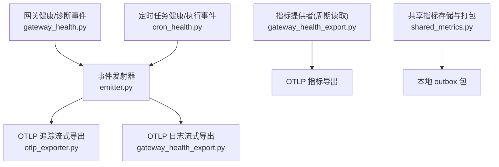
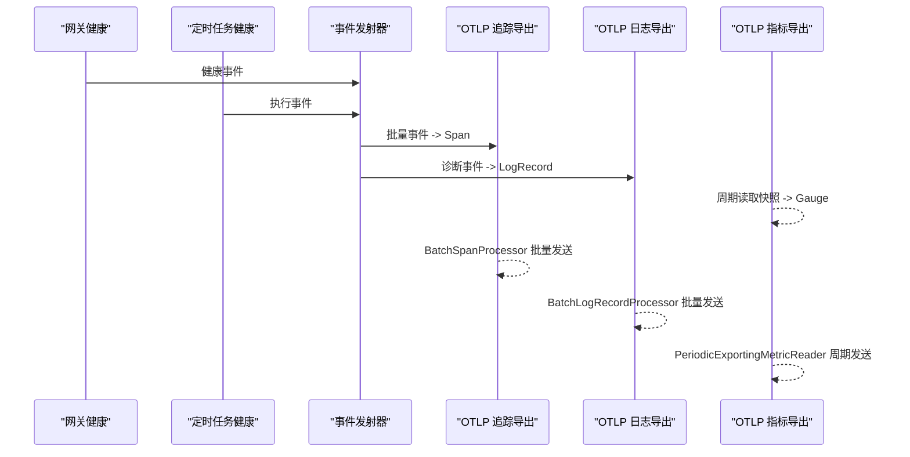
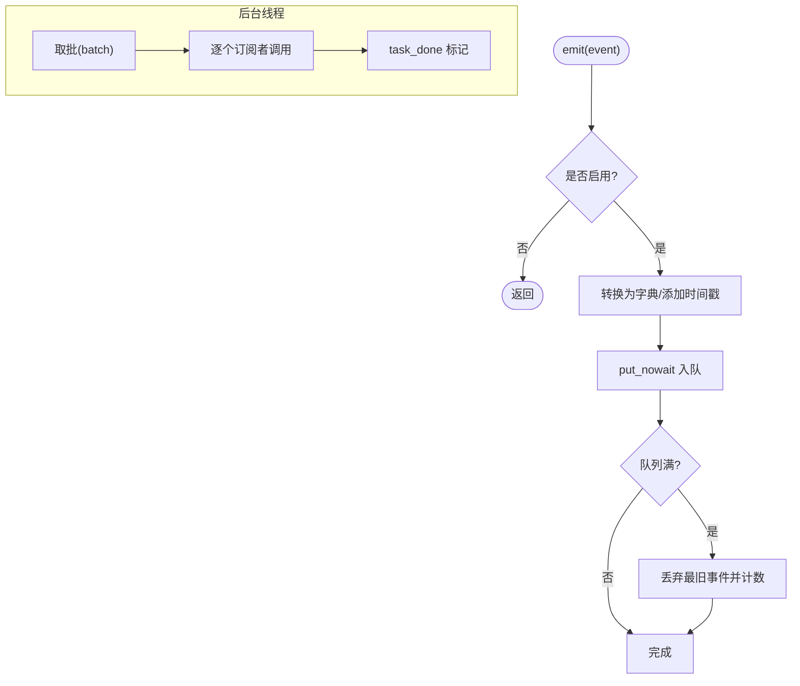
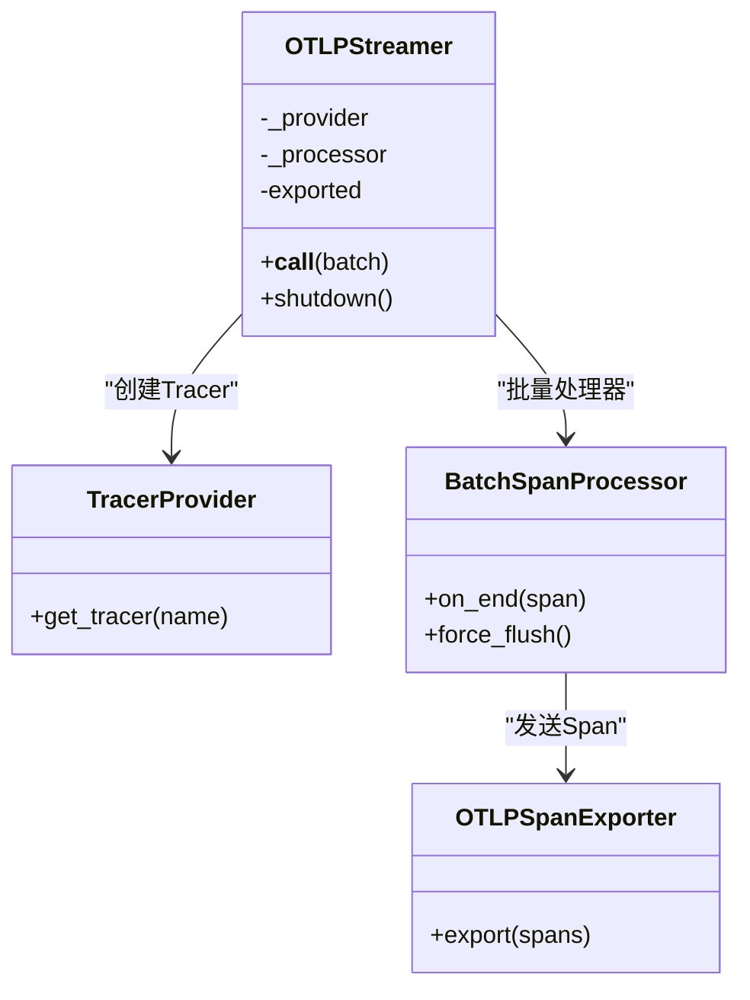
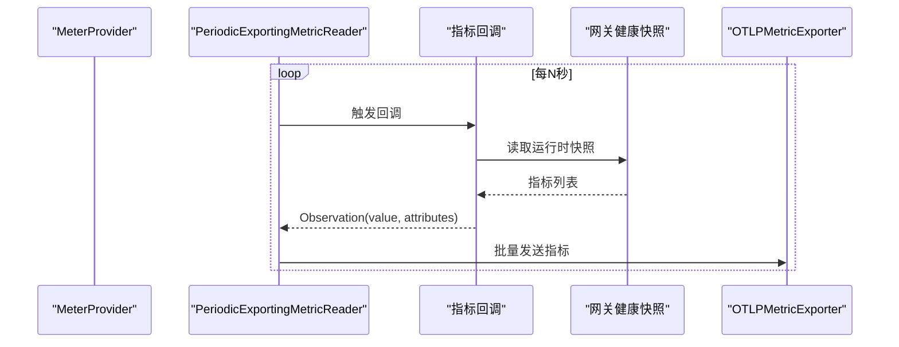
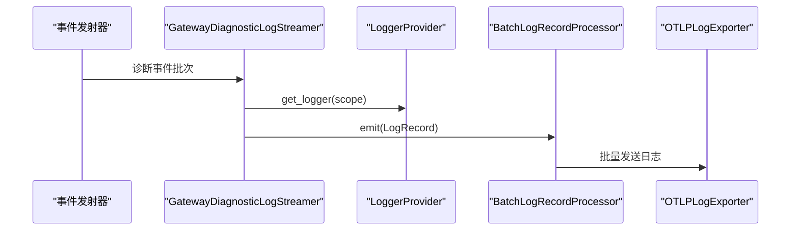
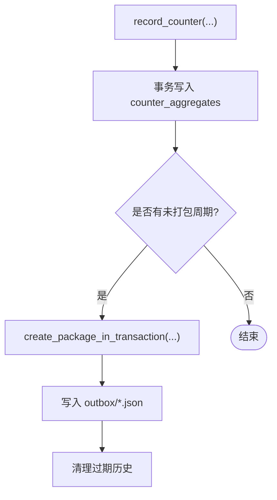
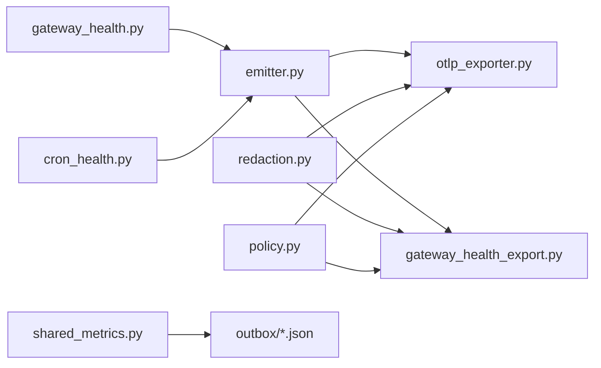

# 可观测性导出器

<cite>
**本文引用的文件**
- [agent/monitoring/emitter.py](file://agent/monitoring/emitter.py)
- [agent/monitoring/events.py](file://agent/monitoring/events.py)
- [agent/monitoring/gateway_health.py](file://agent/monitoring/gateway_health.py)
- [agent/monitoring/cron_health.py](file://agent/monitoring/cron_health.py)
- [agent/monitoring/otlp_exporter.py](file://agent/monitoring/otlp_exporter.py)
- [agent/monitoring/gateway_health_export.py](file://agent/monitoring/gateway_health_export.py)
- [agent/monitoring/redaction.py](file://agent/monitoring/redaction.py)
- [agent/monitoring/policy.py](file://agent/monitoring/policy.py)
- [hermes_cli/observability/shared_metrics.py](file://hermes_cli/observability/shared_metrics.py)
</cite>

## 目录
1. [简介](#简介)
2. [项目结构](#项目结构)
3. [核心组件](#核心组件)
4. [架构总览](#架构总览)
5. [详细组件分析](#详细组件分析)
6. [依赖关系分析](#依赖关系分析)
7. [性能与资源管理](#性能与资源管理)
8. [故障排查指南](#故障排查指南)
9. [结论](#结论)
10. [附录：配置与集成](#附录配置与集成)

## 简介
本文件面向平台团队，系统化说明 Hermes Agent 的可观测性导出能力，重点覆盖 OpenTelemetry（OTLP）协议的实现、数据标准化格式、传输机制、批量处理与重试策略、以及与其他可观测性平台的集成方式。文档同时涵盖指标、日志和追踪的导出路径，采样与性能优化建议，分布式追踪上下文传播要点，以及隐私保护与安全传输配置。

## 项目结构
可观测性相关代码集中在 agent/monitoring 与 hermes_cli/observability 两个区域：
- agent/monitoring：负责采集、规约、脱敏、批处理与 OTLP 导出（指标/日志/追踪）。
- hermes_cli/observability：负责客户端侧共享指标的本地持久化与打包导出（非 OTLP），用于离线或受限环境下的上报。

图表来源
- [agent/monitoring/gateway_health.py:210-291](file://agent/monitoring/gateway_health.py#L210-L291)
- [agent/monitoring/cron_health.py:148-192](file://agent/monitoring/cron_health.py#L148-L192)
- [agent/monitoring/emitter.py:36-116](file://agent/monitoring/emitter.py#L36-L116)
- [agent/monitoring/otlp_exporter.py:107-180](file://agent/monitoring/otlp_exporter.py#L107-L180)
- [agent/monitoring/gateway_health_export.py:417-468](file://agent/monitoring/gateway_health_export.py#L417-L468)
- [hermes_cli/observability/shared_metrics.py:47-221](file://hermes_cli/observability/shared_metrics.py#L47-L221)

章节来源
- [agent/monitoring/emitter.py:1-212](file://agent/monitoring/emitter.py#L1-L212)
- [agent/monitoring/gateway_health.py:1-470](file://agent/monitoring/gateway_health.py#L1-L470)
- [agent/monitoring/cron_health.py:1-202](file://agent/monitoring/cron_health.py#L1-L202)
- [agent/monitoring/otlp_exporter.py:1-273](file://agent/monitoring/otlp_exporter.py#L1-L273)
- [agent/monitoring/gateway_health_export.py:1-644](file://agent/monitoring/gateway_health_export.py#L1-L644)
- [hermes_cli/observability/shared_metrics.py:1-719](file://hermes_cli/observability/shared_metrics.py#L1-L719)

## 核心组件
- 事件发射器（MonitoringEmitter）：热路径无阻塞的事件队列与后台分发线程，保证 emit() 微秒级返回且不抛异常；支持批量扇出到多个订阅者（如 OTLP 追踪/日志导出器）。
- 事件模型（events.py）：定义内容安全的健康与诊断事件结构，确保不携带敏感业务数据。
- 网关健康快照（gateway_health.py）：从运行时状态构建指标与事件，包含网关/平台/调度等维度。
- 定时任务健康（cron_health.py）：提供调度心跳、最近成功时间、积压次数、运行中任务数等指标，以及执行生命周期事件。
- OTLP 追踪导出（otlp_exporter.py）：将事件映射为 OTel Span，通过 BatchSpanProcessor 批量发送到 OTLP/HTTP 端点。
- OTLP 指标/日志导出（gateway_health_export.py）：周期读取运行时快照生成指标；将诊断事件转为 OTLP LogRecord 并发送。
- 脱敏（redaction.py）：强制对出口字符串进行机密信息与 PII 脱敏，失败时关闭输出，避免泄露。
- 安装标识（policy.py）：生成并持久化实例级伪匿名 ID，作为 service.instance.id 稳定标识。
- 共享指标（shared_metrics.py）：在客户端侧以 SQLite 聚合计数器，按日打包成不可变 JSON 包，供后续离线或受限通道上报。

章节来源
- [agent/monitoring/emitter.py:36-116](file://agent/monitoring/emitter.py#L36-L116)
- [agent/monitoring/events.py:19-80](file://agent/monitoring/events.py#L19-L80)
- [agent/monitoring/gateway_health.py:210-291](file://agent/monitoring/gateway_health.py#L210-L291)
- [agent/monitoring/cron_health.py:148-192](file://agent/monitoring/cron_health.py#L148-L192)
- [agent/monitoring/otlp_exporter.py:107-180](file://agent/monitoring/otlp_exporter.py#L107-L180)
- [agent/monitoring/gateway_health_export.py:417-468](file://agent/monitoring/gateway_health_export.py#L417-L468)
- [agent/monitoring/redaction.py:43-66](file://agent/monitoring/redaction.py#L43-L66)
- [agent/monitoring/policy.py:18-52](file://agent/monitoring/policy.py#L18-L52)
- [hermes_cli/observability/shared_metrics.py:47-221](file://hermes_cli/observability/shared_metrics.py#L47-L221)

## 架构总览
Hermes 的可观测性采用“采集-规约-脱敏-批处理-导出”的分层设计：
- 采集：网关健康、平台状态、定时任务执行等模块产出结构化事件。
- 规约：统一事件模型，限制字段集合，分类错误码，归一化状态。
- 脱敏：所有出站字符串经过强制脱敏，防止机密与个人信息外泄。
- 批处理：基于队列与后台线程的批量分发，降低网络开销。
- 导出：分别走 OTLP 追踪（Span）、指标（Metrics）、日志（Logs）三种协议；另有共享指标本地打包通道。

图表来源
- [agent/monitoring/gateway_health.py:210-291](file://agent/monitoring/gateway_health.py#L210-L291)
- [agent/monitoring/cron_health.py:148-192](file://agent/monitoring/cron_health.py#L148-L192)
- [agent/monitoring/emitter.py:91-116](file://agent/monitoring/emitter.py#L91-L116)
- [agent/monitoring/otlp_exporter.py:168-180](file://agent/monitoring/otlp_exporter.py#L168-L180)
- [agent/monitoring/gateway_health_export.py:417-468](file://agent/monitoring/gateway_health_export.py#L417-L468)

## 详细组件分析

### 事件发射器（MonitoringEmitter）
- 职责：维护有界队列与后台分发线程；emit() 永不阻塞、永不抛出；支持多订阅者扇出。
- 关键特性：
  - 队列满时丢弃最旧事件，保证内存上限。
  - 批量大小固定，减少调用开销。
  - 每个订阅者异常隔离，不影响其他订阅者与热路径。
  - 提供 flush/close/stats 等运维接口。

图表来源
- [agent/monitoring/emitter.py:53-116](file://agent/monitoring/emitter.py#L53-L116)

章节来源
- [agent/monitoring/emitter.py:36-164](file://agent/monitoring/emitter.py#L36-L164)

### 事件模型与规约
- GatewayHealthEvent：网关健康快照与生命周期事件，仅包含受控字段。
- GatewayDiagnosticEvent：诊断事件，包含子系统、错误分类、严重级别等。
- CronExecutionEvent：定时任务执行生命周期事件，包含状态、耗时、投递结果等。
- 规约规则：
  - 状态白名单校验，未知值归一为 unknown。
  - 错误文本分类为 auth_failed/rate_limited/timeout/network_error/invalid_config/startup_failed/platform_fatal 等。
  - 资源属性与标签严格限长与字符集校验。

章节来源
- [agent/monitoring/events.py:19-80](file://agent/monitoring/events.py#L19-L80)
- [agent/monitoring/gateway_health.py:20-43](file://agent/monitoring/gateway_health.py#L20-L43)
- [agent/monitoring/gateway_health.py:70-124](file://agent/monitoring/gateway_health.py#L70-L124)
- [agent/monitoring/cron_health.py:25-28](file://agent/monitoring/cron_health.py#L25-L28)

### OTLP 追踪导出（Span）
- 将事件映射为 OTel Span，名称形如 hermes.<event>，属性前缀 hermes.*。
- 使用 BatchSpanProcessor 批量发送，自动重试与背压由 SDK 内部处理。
- 资源属性包含 service.name、service.instance.id、telemetry.scope。
- 支持 headers_env 动态注入认证头（从环境变量读取，不落盘）。

图表来源
- [agent/monitoring/otlp_exporter.py:107-180](file://agent/monitoring/otlp_exporter.py#L107-L180)
- [agent/monitoring/otlp_exporter.py:184-217](file://agent/monitoring/otlp_exporter.py#L184-L217)

章节来源
- [agent/monitoring/otlp_exporter.py:107-217](file://agent/monitoring/otlp_exporter.py#L107-L217)

### OTLP 指标导出（Metrics）
- 通过 MeterProvider 与 PeriodicExportingMetricReader 周期读取运行时快照，生成可观察 Gauge。
- 指标包括网关上下线、活跃代理数、忙碌/可排空标志、重启请求、平台上下线与降级、调度心跳与积压等。
- 指标回调函数内捕获异常，确保导出失败不影响主流程。

图表来源
- [agent/monitoring/gateway_health_export.py:417-468](file://agent/monitoring/gateway_health_export.py#L417-L468)

章节来源
- [agent/monitoring/gateway_health_export.py:417-468](file://agent/monitoring/gateway_health_export.py#L417-L468)

### OTLP 日志导出（Logs）
- 将 gateway_diagnostic 事件转换为 LogRecord，设置 severity、trace/span 无效标识、body 与属性。
- 使用 LoggerProvider 与 BatchLogRecordProcessor 批量发送。
- 支持 source_logger 控制 instrumentation scope，便于代码级溯源。

图表来源
- [agent/monitoring/gateway_health_export.py:485-556](file://agent/monitoring/gateway_health_export.py#L485-L556)

章节来源
- [agent/monitoring/gateway_health_export.py:485-556](file://agent/monitoring/gateway_health_export.py#L485-L556)

### 共享指标（本地持久化与打包）
- 使用 SQLite 聚合计数器，按 UTC 天粒度记录，支持幂等增量。
- 每日最多创建一个打包任务，生成不可变 JSON 包写入 outbox，带权限位保护。
- 支持历史清理与过期包删除，保留窗口可配置。

图表来源
- [hermes_cli/observability/shared_metrics.py:120-221](file://hermes_cli/observability/shared_metrics.py#L120-L221)
- [hermes_cli/observability/shared_metrics.py:489-606](file://hermes_cli/observability/shared_metrics.py#L489-L606)

章节来源
- [hermes_cli/observability/shared_metrics.py:47-221](file://hermes_cli/observability/shared_metrics.py#L47-L221)
- [hermes_cli/observability/shared_metrics.py:489-606](file://hermes_cli/observability/shared_metrics.py#L489-L606)

## 依赖关系分析
- 可选依赖：OpenTelemetry SDK 与 OTLP HTTP 导出器按需懒加载，缺失时给出明确提示与安装指引。
- 内部耦合：
  - emitter 与 exporter/streamer 解耦，通过订阅者模式扩展。
  - gateway_health 与 cron_health 仅产出结构化事件/指标，不直接访问网络。
  - redaction 在所有出站路径强制应用，形成安全基线。
- 外部集成点：
  - OTLP Collector/后端（Jaeger、Prometheus via OTLP、Grafana Loki/Tempo/Mimir 等）。
  - 本地 outbox 文件可由外部进程抓取并上传至远端。

图表来源
- [agent/monitoring/emitter.py:36-116](file://agent/monitoring/emitter.py#L36-L116)
- [agent/monitoring/otlp_exporter.py:107-180](file://agent/monitoring/otlp_exporter.py#L107-L180)
- [agent/monitoring/gateway_health_export.py:417-468](file://agent/monitoring/gateway_health_export.py#L417-L468)
- [agent/monitoring/redaction.py:43-66](file://agent/monitoring/redaction.py#L43-L66)
- [agent/monitoring/policy.py:18-52](file://agent/monitoring/policy.py#L18-L52)
- [hermes_cli/observability/shared_metrics.py:489-606](file://hermes_cli/observability/shared_metrics.py#L489-L606)

章节来源
- [agent/monitoring/emitter.py:36-116](file://agent/monitoring/emitter.py#L36-L116)
- [agent/monitoring/otlp_exporter.py:107-180](file://agent/monitoring/otlp_exporter.py#L107-L180)
- [agent/monitoring/gateway_health_export.py:417-468](file://agent/monitoring/gateway_health_export.py#L417-L468)
- [agent/monitoring/redaction.py:43-66](file://agent/monitoring/redaction.py#L43-L66)
- [agent/monitoring/policy.py:18-52](file://agent/monitoring/policy.py#L18-L52)
- [hermes_cli/observability/shared_metrics.py:489-606](file://hermes_cli/observability/shared_metrics.py#L489-L606)

## 性能与资源管理
- 批量与背压：
  - 事件队列最大深度固定，满则丢弃最旧事件，避免内存膨胀。
  - 批大小固定，减少系统调用与网络开销。
  - OTLP 导出使用 SDK 内置的 BatchSpanProcessor/BatchLogRecordProcessor，具备内部重试与合并。
- 周期导出：
  - 指标通过 PeriodicExportingMetricReader 周期性拉取，间隔可配置。
  - 日志与追踪通过批量处理器异步发送，不阻塞主循环。
- 资源属性与标签：
  - 资源属性键白名单与值长度限制，避免过大或不合法标签影响下游。
- 启动与关闭：
  - 懒加载 OTLP SDK，仅在启用时导入。
  - 关闭时有限超时等待 flush，避免阻塞进程退出。

章节来源
- [agent/monitoring/emitter.py:32-34](file://agent/monitoring/emitter.py#L32-L34)
- [agent/monitoring/emitter.py:91-116](file://agent/monitoring/emitter.py#L91-L116)
- [agent/monitoring/gateway_health_export.py:417-468](file://agent/monitoring/gateway_health_export.py#L417-L468)
- [agent/monitoring/gateway_health_export.py:112-159](file://agent/monitoring/gateway_health_export.py#L112-L159)

## 故障排查指南
- OTLP 不可用：
  - 现象：启动时警告 OTLP SDK 不可用或未安装。
  - 处理：安装可选依赖后重启；检查 monitoring.export.otlp.enabled 与 endpoint 配置。
- 队列溢出：
  - 现象：dropped 计数上升。
  - 处理：提升下游处理能力或降低事件产生速率；检查订阅者异常导致消费缓慢。
- 指标未更新：
  - 现象：Prometheus/Grafana 无新指标。
  - 处理：确认 export_interval_seconds 配置；检查 OTLP 指标端点与认证头。
- 日志未出现：
  - 现象：诊断日志未出现在 Loki/Collector。
  - 处理：确认日志端点与 headers_env；检查 source_logger 白名单匹配。
- 共享指标未导出：
  - 现象：outbox 无新包。
  - 处理：确认 create_and_export_package_if_due 被调用；检查 outbox 目录权限与磁盘空间。

章节来源
- [agent/monitoring/otlp_exporter.py:220-261](file://agent/monitoring/otlp_exporter.py#L220-L261)
- [agent/monitoring/gateway_health_export.py:587-637](file://agent/monitoring/gateway_health_export.py#L587-L637)
- [agent/monitoring/emitter.py:152-164](file://agent/monitoring/emitter.py#L152-L164)
- [hermes_cli/observability/shared_metrics.py:207-221](file://hermes_cli/observability/shared_metrics.py#L207-L221)

## 结论
Hermes 的可观测性导出体系以“内容安全、低侵入、高可靠”为核心目标，通过事件发射器与 OTLP 三通道（追踪/指标/日志）实现统一导出，并以共享指标本地打包作为补充通道。其设计强调：
- 热路径零阻塞与异常隔离。
- 强制脱敏与白名单约束。
- 批量与周期导出降低开销。
- 可选依赖与懒加载提升可用性。
平台团队可据此快速搭建端到端的可观测性基础设施，并对接主流平台（Jaeger、Prometheus、Grafana/Loki/Tempo/Mimir）。

## 附录：配置与集成

### 配置选项（示例说明）
- 启用与端点：
  - monitoring.export.otlp.enabled：布尔开关。
  - monitoring.export.otlp.endpoint：OTLP 接收端点（支持 /v1/traces、/v1/metrics、/v1/logs 自动推导）。
- 认证头：
  - monitoring.export.otlp.headers_env：{HeaderName: ENV_VAR_NAME}，运行时从环境变量取值，不落盘。
- 指标导出间隔：
  - monitoring.gateway_health_export.export_interval_seconds：指标拉取周期（秒）。
- 诊断事件：
  - monitoring.gateway_health_export.diagnostic_events_enabled：是否导出诊断日志。
  - monitoring.gateway_health_export.warning_error_events_enabled：是否附加日志处理器。
- 安装标识：
  - monitoring.install_id：实例级伪匿名 ID，为空时自动生成并持久化。

章节来源
- [agent/monitoring/otlp_exporter.py:101-115](file://agent/monitoring/otlp_exporter.py#L101-L115)
- [agent/monitoring/gateway_health_export.py:167-181](file://agent/monitoring/gateway_health_export.py#L167-L181)
- [agent/monitoring/gateway_health_export.py:231-242](file://agent/monitoring/gateway_health_export.py#L231-L242)
- [agent/monitoring/policy.py:18-52](file://agent/monitoring/policy.py#L18-L52)

### 与主流平台集成
- Jaeger：
  - 通过 OTLP Collector 转发 traces 到 Jaeger；确保 endpoint 指向 Collector 的 /v1/traces。
  - 资源属性 service.name/service.instance.id 可用于服务与实例过滤。
- Prometheus：
  - 通过 OTLP Collector 将 metrics 暴露为 Prometheus 格式；确保指标端点 /v1/metrics 可达。
  - 指标名与属性已在代码中定义，可直接查询 hermes.gateway.* 与 hermes.cron.*。
- Grafana（Loki/Tempo/Mimir）：
  - Loki：通过 OTLP logs 接入诊断日志；使用 severity 与 hermes.* 属性做过滤。
  - Tempo：通过 OTLP traces 接入追踪；利用 span name 与属性定位事件。
  - Mimir：通过 OTLP metrics 接入指标；结合 PromQL 查询 hermes.*。

章节来源
- [agent/monitoring/gateway_health_export.py:417-468](file://agent/monitoring/gateway_health_export.py#L417-L468)
- [agent/monitoring/otlp_exporter.py:168-180](file://agent/monitoring/otlp_exporter.py#L168-L180)
- [agent/monitoring/gateway_health_export.py:485-556](file://agent/monitoring/gateway_health_export.py#L485-L556)

### 数据采样策略
- 当前实现以“全量事件+批量导出”为主，未引入显式采样开关。
- 建议：
  - 在高吞吐场景下，可在上游生产端增加条件过滤（例如仅在生产环境开启诊断事件）。
  - 借助 OTLP Collector 的 sampling 与批处理策略进一步降载。
  - 共享指标按日打包，天然具备“时间切片”的采样效果。

章节来源
- [agent/monitoring/emitter.py:32-34](file://agent/monitoring/emitter.py#L32-L34)
- [hermes_cli/observability/shared_metrics.py:207-221](file://hermes_cli/observability/shared_metrics.py#L207-L221)

### 分布式追踪与上下文传播
- 当前监控平面主要导出事件与指标，追踪以 Span 形式承载事件语义。
- 跨服务调用追踪需在上游服务也启用 OTLP 追踪，并通过标准上下文传播（W3C TraceContext）保持链路连续。
- 建议在网关入口与关键工具调用处注入 Span，并传递 traceparent/tracestate。

[本节为概念性说明，不直接分析具体文件]

### 数据隐私与安全传输
- 隐私保护：
  - 所有出站字符串经 redaction_for_export 强制脱敏，失败时关闭输出。
  - 资源属性与标签白名单与长度限制，避免敏感信息泄露。
- 安全传输：
  - 通过 HTTPS 与自定义 headers_env（如 Authorization）实现认证与加密。
  - 环境变量读取，不在配置文件中明文保存密钥。
- 访问控制：
  - 在 Collector 或后端实施鉴权与审计；对日志与指标分别设置访问策略。

章节来源
- [agent/monitoring/redaction.py:43-66](file://agent/monitoring/redaction.py#L43-L66)
- [agent/monitoring/gateway_health_export.py:55-74](file://agent/monitoring/gateway_health_export.py#L55-L74)
- [agent/monitoring/otlp_exporter.py:83-98](file://agent/monitoring/otlp_exporter.py#L83-L98)