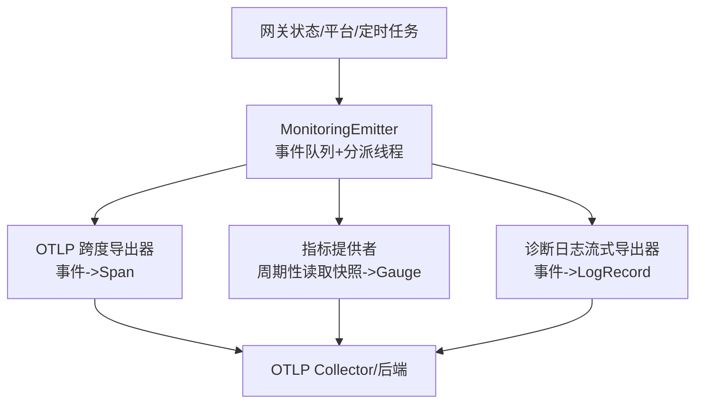
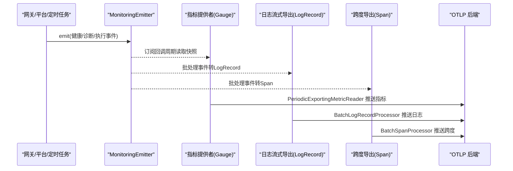
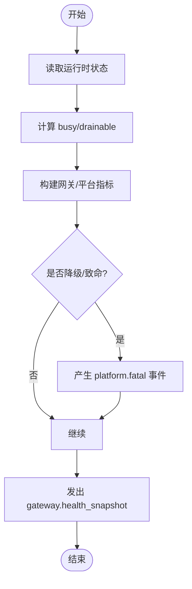
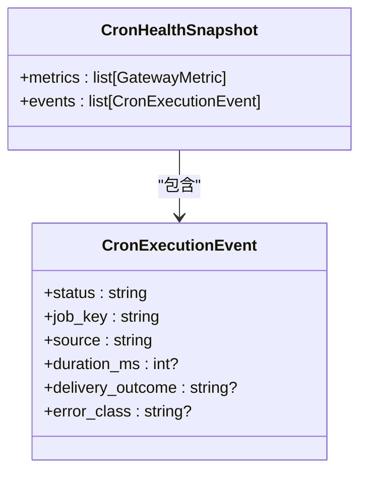
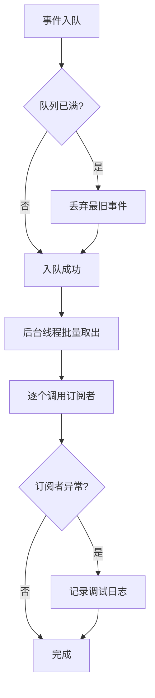
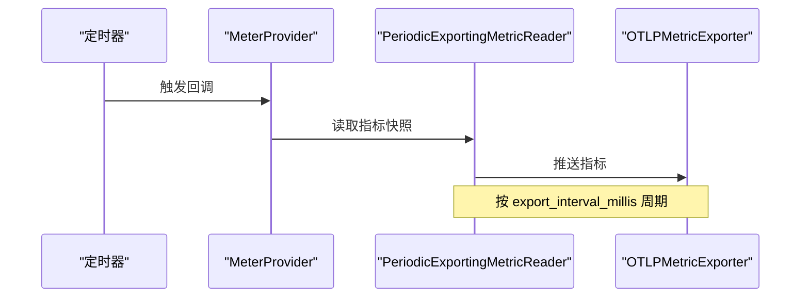
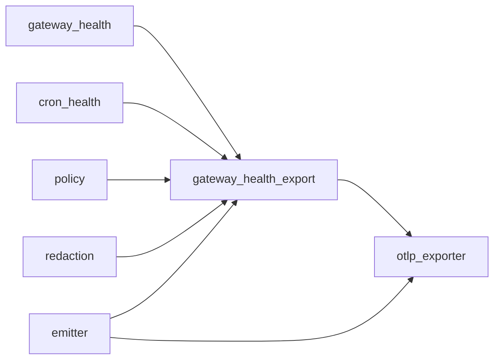

# 性能监控

<cite>
**本文引用的文件**
- [agent/monitoring/__init__.py](file://agent/monitoring/__init__.py)
- [agent/monitoring/emitter.py](file://agent/monitoring/emitter.py)
- [agent/monitoring/events.py](file://agent/monitoring/events.py)
- [agent/monitoring/gateway_health.py](file://agent/monitoring/gateway_health.py)
- [agent/monitoring/gateway_health_export.py](file://agent/monitoring/gateway_health_export.py)
- [agent/monitoring/cron_health.py](file://agent/monitoring/cron_health.py)
- [agent/monitoring/policy.py](file://agent/monitoring/policy.py)
- [agent/monitoring/redaction.py](file://agent/monitoring/redaction.py)
- [agent/monitoring/otlp_exporter.py](file://agent/monitoring/otlp_exporter.py)
</cite>

## 目录
1. [简介](#简介)
2. [项目结构](#项目结构)
3. [核心组件](#核心组件)
4. [架构总览](#架构总览)
5. [详细组件分析](#详细组件分析)
6. [依赖关系分析](#依赖关系分析)
7. [性能考量](#性能考量)
8. [故障排查指南](#故障排查指南)
9. [结论](#结论)
10. [附录](#附录)

## 简介
本文件面向开发团队，系统化说明 Hermes Agent 网关的性能监控体系：关键指标如何采集、处理与展示；网关健康检查、系统资源监控（通过进程/后台任务计数）与响应时间追踪（以事件/日志形式体现）的实现机制；数据采集频率、存储策略与分析方法；并给出性能基准测试思路、瓶颈识别与优化建议、仪表板配置与使用指南，以及分布式环境下的挑战与解决方案。

## 项目结构
监控子系统位于 agent/monitoring，采用“生产者-事件总线-消费者”的解耦设计：
- 生产者：网关状态变更、平台状态、定时任务执行等模块产生内容安全的健康/诊断事件。
- 事件总线：emitter 提供无阻塞、不抛异常的入队与批量分发，确保热路径不受影响。
- 消费者：OTLP 流式导出器、指标提供者、日志流式导出器将数据发送至外部可观测性后端。

图表来源
- [agent/monitoring/emitter.py:36-116](file://agent/monitoring/emitter.py#L36-L116)
- [agent/monitoring/otlp_exporter.py:184-217](file://agent/monitoring/otlp_exporter.py#L184-L217)
- [agent/monitoring/gateway_health_export.py:417-468](file://agent/monitoring/gateway_health_export.py#L417-L468)
- [agent/monitoring/gateway_health_export.py:485-556](file://agent/monitoring/gateway_health_export.py#L485-L556)

章节来源
- [agent/monitoring/__init__.py:1-30](file://agent/monitoring/__init__.py#L1-L30)
- [agent/monitoring/emitter.py:1-212](file://agent/monitoring/emitter.py#L1-L212)

## 核心组件
- 事件模型：GatewayHealthEvent、GatewayDiagnosticEvent、CronExecutionEvent，统一 to_dict 输出，保证内容安全与结构化。
- 健康快照：build_gateway_health_snapshot 从运行时状态构建网关与平台指标与健康事件；classify_* 系列函数对错误进行归一化分类。
- 定时任务健康：build_cron_health_snapshot 产出调度心跳、最近成功时间、积压次数、运行中作业数等指标。
- 事件总线：MonitoringEmitter 提供 emit/subscribe/flush/stats/close，保障 O(微秒) 写入与失败隔离。
- OTLP 导出：
  - 指标：PeriodicExportingMetricReader 按间隔拉取指标快照，映射为 Gauge。
  - 日志：BatchLogRecordProcessor 将诊断事件转为 LogRecord 发送。
  - 跨度：OTLPStreamer 将事件映射为 Span 属性，便于链路关联。
- 安全与合规：redaction 强制脱敏；policy 生成稳定实例标识；gateway_health_export 限制资源属性白名单。

章节来源
- [agent/monitoring/events.py:1-87](file://agent/monitoring/events.py#L1-L87)
- [agent/monitoring/gateway_health.py:20-470](file://agent/monitoring/gateway_health.py#L20-L470)
- [agent/monitoring/cron_health.py:1-202](file://agent/monitoring/cron_health.py#L1-L202)
- [agent/monitoring/emitter.py:36-212](file://agent/monitoring/emitter.py#L36-L212)
- [agent/monitoring/otlp_exporter.py:107-273](file://agent/monitoring/otlp_exporter.py#L107-L273)
- [agent/monitoring/gateway_health_export.py:1-644](file://agent/monitoring/gateway_health_export.py#L1-L644)
- [agent/monitoring/redaction.py:1-72](file://agent/monitoring/redaction.py#L1-L72)
- [agent/monitoring/policy.py:1-58](file://agent/monitoring/policy.py#L1-L58)

## 架构总览
下图展示了从生产到导出的完整链路，包括指标、日志与跨度的三种出口，以及配置开关与失败保护。

图表来源
- [agent/monitoring/emitter.py:52-116](file://agent/monitoring/emitter.py#L52-L116)
- [agent/monitoring/gateway_health_export.py:417-468](file://agent/monitoring/gateway_health_export.py#L417-L468)
- [agent/monitoring/gateway_health_export.py:485-556](file://agent/monitoring/gateway_health_export.py#L485-L556)
- [agent/monitoring/otlp_exporter.py:184-217](file://agent/monitoring/otlp_exporter.py#L184-L217)

## 详细组件分析

### 网关健康检查与指标
- 健康快照构建：读取运行时状态，计算活跃代理、忙碌/可排空标志、平台上下线及降级情况，输出指标与事件。
- 错误分类：基于文本模式将错误归一为 auth_failed、rate_limited、timeout、network_error、invalid_config、startup_failed、platform_fatal 等。
- 生命周期事件：在 gateway_state 变化时发出 lifecycle/startup_failed/exit 等事件，附带退出原因分类。
- 背景工作负载：补充 active_agents 未覆盖的后台/子代理任务数量与委托槽位占用，帮助识别真实并发压力。

图表来源
- [agent/monitoring/gateway_health.py:210-291](file://agent/monitoring/gateway_health.py#L210-L291)
- [agent/monitoring/gateway_health.py:70-124](file://agent/monitoring/gateway_health.py#L70-L124)
- [agent/monitoring/gateway_health_export.py:358-401](file://agent/monitoring/gateway_health_export.py#L358-L401)

章节来源
- [agent/monitoring/gateway_health.py:20-470](file://agent/monitoring/gateway_health.py#L20-L470)
- [agent/monitoring/gateway_health_export.py:281-401](file://agent/monitoring/gateway_health_export.py#L281-L401)

### 定时任务健康与执行投影
- 指标：调度心跳年龄、最近成功年龄、catch_up_occurrences、enabled/running/overdue 作业数。
- 执行事件：将作业记录投影为 CronExecutionEvent，包含状态、时长、投递结果与错误分类。
- 超时判定：结合 next_run_at 与 grace_seconds 判断 overdue。

图表来源
- [agent/monitoring/cron_health.py:30-111](file://agent/monitoring/cron_health.py#L30-L111)
- [agent/monitoring/cron_health.py:148-192](file://agent/monitoring/cron_health.py#L148-L192)

章节来源
- [agent/monitoring/cron_health.py:1-202](file://agent/monitoring/cron_health.py#L1-L202)

### 事件总线与背压控制
- 无阻塞写入：emit 使用非阻塞入队，满队时丢弃最旧事件，保证热路径稳定。
- 批量分派：后台线程以固定批次大小消费队列，降低下游开销。
- 失败隔离：每个订阅者独立 try/except，避免单点故障扩散。
- 统计与刷新：stats 提供队列长度、已分发、丢弃计数；flush 有界等待完成。

图表来源
- [agent/monitoring/emitter.py:52-116](file://agent/monitoring/emitter.py#L52-L116)
- [agent/monitoring/emitter.py:132-158](file://agent/monitoring/emitter.py#L132-L158)

章节来源
- [agent/monitoring/emitter.py:1-212](file://agent/monitoring/emitter.py#L1-L212)

### OTLP 指标、日志与跨度导出
- 指标：按配置间隔周期性读取快照，注册为可观察 Gauge，名称如 hermes.gateway.up、hermes.platform.degraded、hermes.cron.*。
- 日志：将诊断事件映射为 LogRecord，保留受控属性（subsystem、error_class、severity 等），消息体保持最小化。
- 跨度：将事件映射为 Span 属性，便于与业务链路关联。
- 配置：endpoint、headers_env、export_interval_seconds、logs_export_interval_seconds、metrics_enabled、diagnostic_events_enabled 等。

图表来源
- [agent/monitoring/gateway_health_export.py:417-468](file://agent/monitoring/gateway_health_export.py#L417-L468)
- [agent/monitoring/otlp_exporter.py:129-135](file://agent/monitoring/otlp_exporter.py#L129-L135)

章节来源
- [agent/monitoring/gateway_health_export.py:167-644](file://agent/monitoring/gateway_health_export.py#L167-L644)
- [agent/monitoring/otlp_exporter.py:107-273](file://agent/monitoring/otlp_exporter.py#L107-L273)

### 安全与合规
- 强制脱敏：所有出站字符串经 redact_for_export 处理，优先隐藏密钥与令牌，再替换 PII（邮箱、电话、UUID）。
- 资源属性白名单：仅允许有限键值，且拒绝被脱敏修改过的值。
- 实例标识：install_id 持久化于配置，用于区分实例，支持旋转。

章节来源
- [agent/monitoring/redaction.py:1-72](file://agent/monitoring/redaction.py#L1-L72)
- [agent/monitoring/gateway_health_export.py:22-88](file://agent/monitoring/gateway_health_export.py#L22-L88)
- [agent/monitoring/policy.py:18-52](file://agent/monitoring/policy.py#L18-L52)

## 依赖关系分析
- 松耦合：生产者仅依赖 emitter.emit，不感知具体导出实现。
- 可选依赖：OTLP SDK 按需懒加载，缺失时优雅降级并提示安装。
- 内部依赖：gateway_health_export 依赖 gateway_health、cron_health、policy、redaction；otlp_exporter 依赖 emitter 与 OTel SDK。

图表来源
- [agent/monitoring/gateway_health_export.py:281-401](file://agent/monitoring/gateway_health_export.py#L281-L401)
- [agent/monitoring/otlp_exporter.py:184-217](file://agent/monitoring/otlp_exporter.py#L184-L217)

章节来源
- [agent/monitoring/gateway_health_export.py:1-644](file://agent/monitoring/gateway_health_export.py#L1-L644)
- [agent/monitoring/otlp_exporter.py:1-273](file://agent/monitoring/otlp_exporter.py#L1-L273)

## 性能考量
- 采集频率
  - 指标：export_interval_seconds（默认约 60s，最小 5s），适合趋势与告警。
  - 诊断日志：logs_export_interval_seconds（默认约 5s），适合快速发现异常。
- 存储策略
  - 本地不持久化，仅内存队列与批量外发；失败不影响主流程。
  - 指标/日志/跨度分别由 OTel 批处理器聚合后发送，减少网络开销。
- 分析方法
  - 指标：关注 hermes.gateway.up、hermes.platform.degraded、hermes.cron.scheduler.*、hermes.cron.jobs.overdue。
  - 事件：gateway.lifecycle、platform.state_change、platform.fatal、gateway.log.*。
  - 执行：CronExecutionEvent.duration_ms 与 error_class 用于定位慢任务与失败类型。
- 基准测试建议
  - 高吞吐注入：构造大量短生命周期事件，验证队列丢弃率与延迟分布。
  - 背压测试：关闭或限速 OTLP 后端，观察 dropped 计数与 flush 行为。
  - 资源压力：在高 CPU/内存压力下评估 emit 耗时与分派线程稳定性。
- 瓶颈识别
  - 若 dropped 持续上升，考虑增大队列深度或提升下游处理能力。
  - 若指标更新延迟大，缩短 export_interval_seconds 或优化快照构建成本。
  - 若日志堆积，检查 BatchLogRecordProcessor 与网络带宽。
- 优化建议
  - 合理设置 export_interval_seconds/logs_export_interval_seconds 平衡实时性与开销。
  - 仅在必要时启用 diagnostic_events_enabled，减少日志量。
  - 使用 headers_env 传递认证头，避免硬编码敏感信息。
  - 定期轮换 install_id 以隔离不同环境的数据。

[本节为通用指导，无需特定文件引用]

## 故障排查指南
- 常见问题
  - OTLP 不可用：确认已安装可选依赖并配置 endpoint；启动时会给出明确警告。
  - 指标未上报：检查 metrics_enabled 与 export_interval_seconds；查看 GatewayHealthExportRuntime.reason。
  - 诊断日志未上报：检查 diagnostic_events_enabled、warning_error_events_enabled 与根日志处理器挂载。
  - 队列丢弃：通过 stats 中的 dropped 判断是否过载；必要时调整阈值或下游能力。
- 定位步骤
  - 查看 GatewayHealthExportRuntime.enabled/reason 判断初始化状态。
  - 检查 OTLP 配置：endpoint、headers_env、export_interval_seconds。
  - 观察事件分类：auth_failed、rate_limited、timeout、network_error、invalid_config、startup_failed、platform_fatal。
  - 核对资源属性白名单与脱敏规则，避免被过滤。
- 恢复措施
  - 修复 OTLP 端点或鉴权头。
  - 降低事件速率或关闭非必要诊断事件。
  - 扩容或优化下游收集器。

章节来源
- [agent/monitoring/gateway_health_export.py:587-637](file://agent/monitoring/gateway_health_export.py#L587-L637)
- [agent/monitoring/otlp_exporter.py:220-261](file://agent/monitoring/otlp_exporter.py#L220-L261)
- [agent/monitoring/emitter.py:152-158](file://agent/monitoring/emitter.py#L152-L158)

## 结论
该性能监控系统以“内容安全、热路径零干扰、失败隔离”为核心原则，通过事件总线与 OTLP 多通道导出，提供网关健康、平台状态、定时任务与后台负载的可观测能力。配合合理的采集频率、严格的脱敏与稳定的实例标识，可在单机与分布式环境中可靠运行，并为告警、分析与优化提供坚实基础。

[本节为总结，无需特定文件引用]

## 附录

### 关键指标清单与含义
- hermes.gateway.up：网关是否存活
- hermes.gateway.active_agents：活跃代理数
- hermes.gateway.busy / drainable：忙碌与可排空标志
- hermes.platform.up / hermes.platform.degraded：平台上下线与降级
- hermes.cron.scheduler.heartbeat_age_seconds / last_success_age_seconds：调度新鲜度
- hermes.cron.scheduler.catch_up_occurrences：追赶次数
- hermes.cron.jobs.enabled / running / overdue：作业状态
- hermes.gateway.background_work / background_delegations：后台任务与委托槽位占用

章节来源
- [agent/monitoring/gateway_health_export.py:437-454](file://agent/monitoring/gateway_health_export.py#L437-L454)
- [agent/monitoring/cron_health.py:148-192](file://agent/monitoring/cron_health.py#L148-L192)

### 配置项速查
- monitoring.gateway_health_export.enabled：是否启用网关健康导出
- monitoring.gateway_health_export.metrics_enabled：是否启用指标
- monitoring.gateway_health_export.diagnostic_events_enabled：是否启用诊断事件
- monitoring.gateway_health_export.warning_error_events_enabled：是否捕获 warning/error 日志事件
- monitoring.gateway_health_export.export_interval_seconds：指标采集间隔（秒）
- monitoring.gateway_health_export.logs_export_interval_seconds：诊断日志采样间隔（秒）
- monitoring.export.otlp.enabled：是否启用 OTLP 导出
- monitoring.export.otlp.endpoint：OTLP 端点
- monitoring.export.otlp.headers_env：HTTP 头与环境变量映射
- monitoring.install_id：实例标识（可清空以旋转）

章节来源
- [agent/monitoring/gateway_health_export.py:167-182](file://agent/monitoring/gateway_health_export.py#L167-L182)
- [agent/monitoring/gateway_health_export.py:417-468](file://agent/monitoring/gateway_health_export.py#L417-L468)
- [agent/monitoring/otlp_exporter.py:101-115](file://agent/monitoring/otlp_exporter.py#L101-L115)
- [agent/monitoring/policy.py:18-52](file://agent/monitoring/policy.py#L18-L52)

### 仪表板与可视化建议
- 指标面板：网关存活、平台降级、活跃代理、忙碌/可排空、后台负载、定时任务健康。
- 事件面板：gateway.lifecycle、platform.state_change、platform.fatal、gateway.log.*。
- 执行面板：CronExecutionEvent.duration_ms 分布、error_class 占比。
- 告警规则：平台降级持续、心跳超时、作业 overdue、超时/限流错误突增。

[本节为概念性建议，无需特定文件引用]

### 分布式环境下的挑战与方案
- 挑战
  - 多实例汇聚：需通过 service.instance.id 区分实例。
  - 网络抖动：批处理与退避重传由 OTel SDK 负责，但需监控 dropped 与失败日志。
  - 隐私合规：严格脱敏与属性白名单，避免泄露敏感信息。
- 方案
  - 使用统一的 OTLP Collector 聚合多实例数据。
  - 合理设置 export_interval_seconds 与批大小，平衡实时性与吞吐。
  - 通过 headers_env 注入租户/区域等上下文，便于多维分析。

[本节为概念性建议，无需特定文件引用]