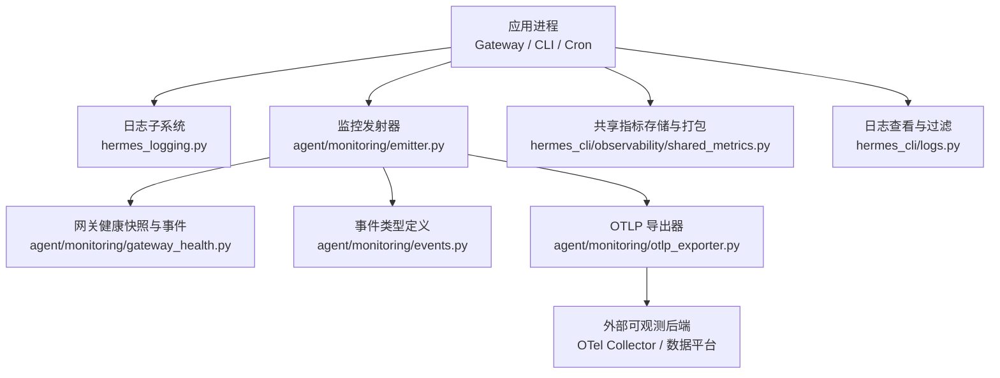
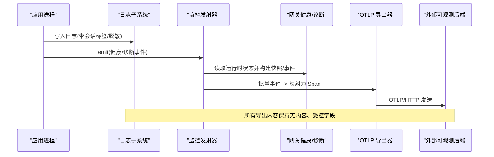
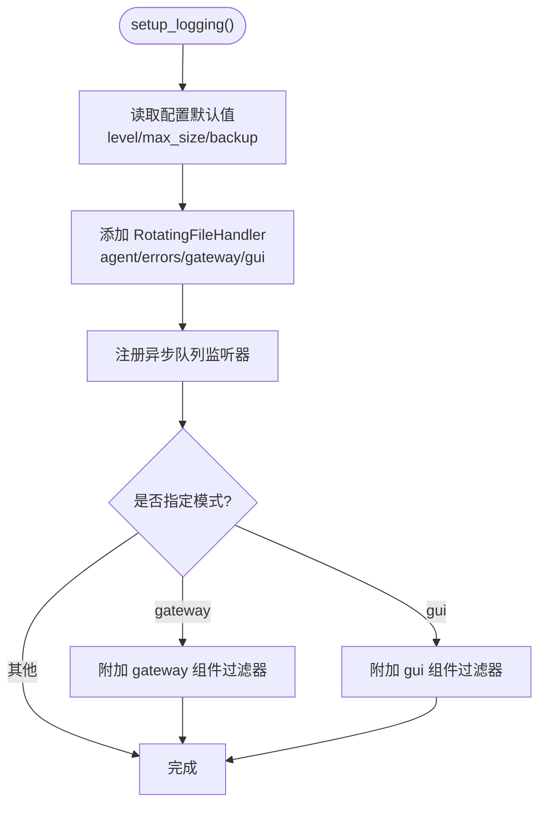
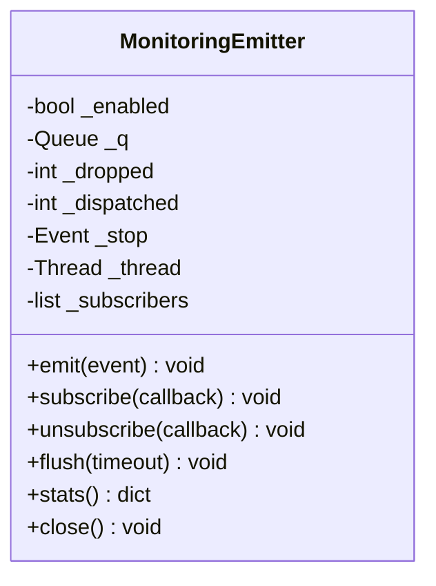
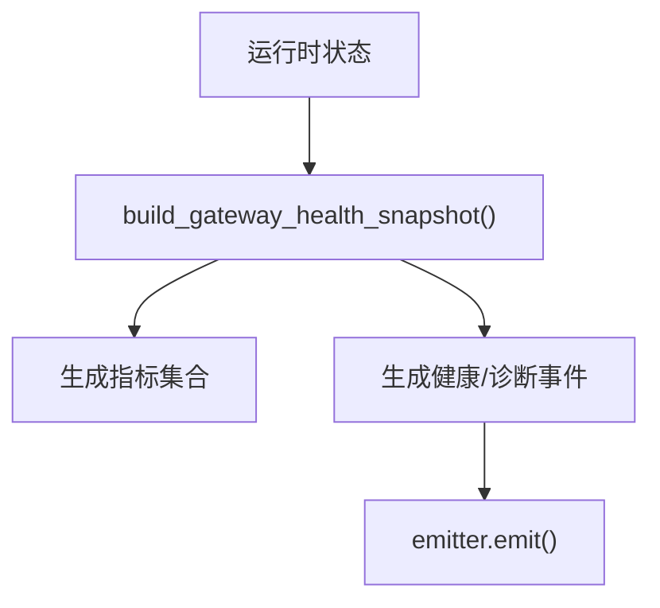
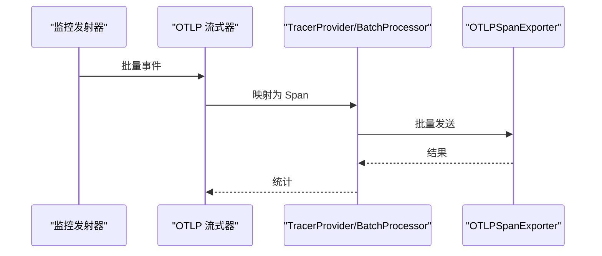
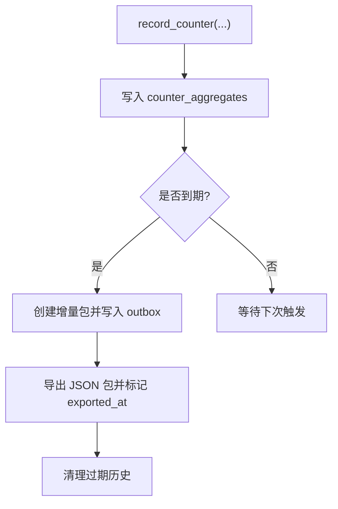
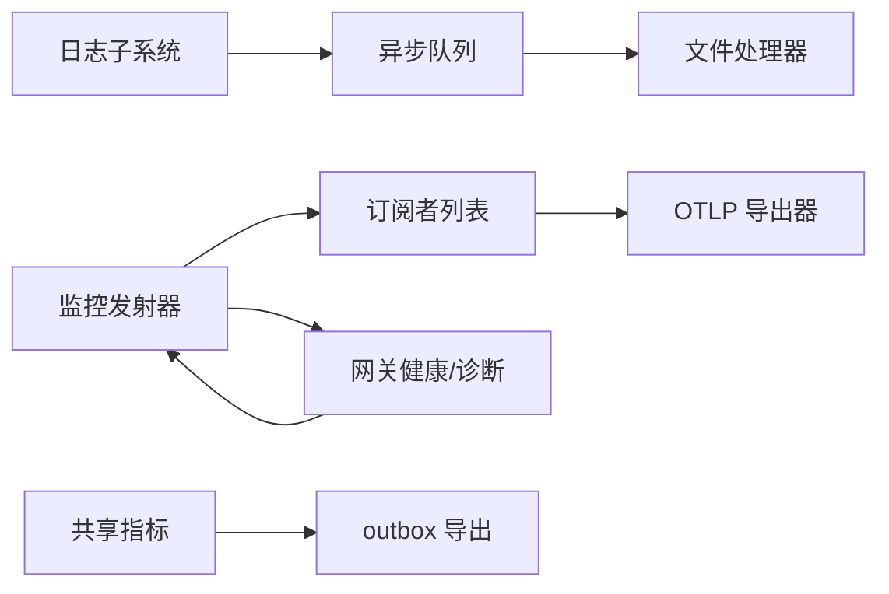

# 监控和日志

<cite>
**本文引用的文件**
- [hermes_logging.py](file://hermes_logging.py)
- [logs.py](file://hermes_cli/logs.py)
- [emitter.py](file://agent/monitoring/emitter.py)
- [events.py](file://agent/monitoring/events.py)
- [gateway_health.py](file://agent/monitoring/gateway_health.py)
- [otlp_exporter.py](file://agent/monitoring/otlp_exporter.py)
- [shared_metrics.py](file://hermes_cli/observability/shared_metrics.py)
- [monitoring.md](file://docs/observability/monitoring.md)
- [README.md](file://docs/observability/README.md)
</cite>

## 目录
1. [简介](#简介)
2. [项目结构](#项目结构)
3. [核心组件](#核心组件)
4. [架构总览](#架构总览)
5. [详细组件分析](#详细组件分析)
6. [依赖关系分析](#依赖关系分析)
7. [性能考量](#性能考量)
8. [故障诊断指南](#故障诊断指南)
9. [结论](#结论)
10. [附录](#附录)

## 简介
本文件面向运维与可观测性团队，系统化说明 Hermes Agent 的监控与日志体系：包括指标采集、健康检查、告警建议、日志级别与输出格式、轮转策略、分布式追踪与链路分析、使用统计收集与分析、仪表板配置思路、根因定位方法与调优建议。文档严格基于仓库内实现与文档，确保可落地与可验证。

## 项目结构
Hermes 的可观测性由“日志子系统”“网关健康与诊断事件”“OTLP 导出器”“共享指标持久化”四部分组成，并通过 CLI 工具提供查看与排障能力。

图表来源
- [hermes_logging.py:259-376](file://hermes_logging.py#L259-L376)
- [emitter.py:36-117](file://agent/monitoring/emitter.py#L36-L117)
- [gateway_health.py:210-291](file://agent/monitoring/gateway_health.py#L210-L291)
- [events.py:19-80](file://agent/monitoring/events.py#L19-L80)
- [otlp_exporter.py:107-180](file://agent/monitoring/otlp_exporter.py#L107-L180)
- [shared_metrics.py:47-210](file://hermes_cli/observability/shared_metrics.py#L47-L210)
- [logs.py:145-254](file://hermes_cli/logs.py#L145-L254)

章节来源
- [hermes_logging.py:259-376](file://hermes_logging.py#L259-L376)
- [emitter.py:36-117](file://agent/monitoring/emitter.py#L36-L117)
- [gateway_health.py:210-291](file://agent/monitoring/gateway_health.py#L210-L291)
- [events.py:19-80](file://agent/monitoring/events.py#L19-L80)
- [otlp_exporter.py:107-180](file://agent/monitoring/otlp_exporter.py#L107-L180)
- [shared_metrics.py:47-210](file://hermes_cli/observability/shared_metrics.py#L47-L210)
- [logs.py:145-254](file://hermes_cli/logs.py#L145-L254)

## 核心组件
- 日志子系统：集中式日志初始化、按组件分流、会话上下文注入、异步队列落盘、跨进程安全轮转、敏感信息脱敏。
- 监控发射器：热路径零阻塞的事件队列与后台分发线程，订阅者隔离失败，支持批量导出。
- 网关健康与诊断：从运行时状态构建健康快照与生命周期事件，错误分类与子系统映射，日志桥接为结构化诊断事件。
- OTLP 导出器：将事件映射为 OpenTelemetry Span，通过 HTTP 协议发送到配置的接收端；可选依赖、懒加载、头部环境变量解析。
- 共享指标：本地 SQLite 聚合计数器、按日打包出队、保留期清理、资源维度校验与不可变包导出。
- 日志查看器：tail/follow、级别/时间/会话/组件过滤，快速定位问题。

章节来源
- [hermes_logging.py:259-376](file://hermes_logging.py#L259-L376)
- [emitter.py:36-117](file://agent/monitoring/emitter.py#L36-L117)
- [gateway_health.py:210-291](file://agent/monitoring/gateway_health.py#L210-L291)
- [otlp_exporter.py:107-180](file://agent/monitoring/otlp_exporter.py#L107-L180)
- [shared_metrics.py:47-210](file://hermes_cli/observability/shared_metrics.py#L47-L210)
- [logs.py:145-254](file://hermes_cli/logs.py#L145-L254)

## 架构总览
下图展示从业务侧到可观测后端的完整数据流：日志与事件在进程内产生，经发射器批量分发至 OTLP 导出器或本地存储，最终进入外部系统。

图表来源
- [hermes_logging.py:259-376](file://hermes_logging.py#L259-L376)
- [emitter.py:53-117](file://agent/monitoring/emitter.py#L53-L117)
- [gateway_health.py:210-291](file://agent/monitoring/gateway_health.py#L210-L291)
- [otlp_exporter.py:138-180](file://agent/monitoring/otlp_exporter.py#L138-L180)

## 详细组件分析

### 日志子系统（级别、格式、轮转、组件分流）
- 日志文件与角色
  - agent.log：主活动日志（INFO+）。
  - errors.log：快速排障（WARNING+）。
  - gateway.log：仅网关组件（模式 gateway 时启用）。
  - gui.log：Dashboard/TUI-gateway 组件（模式 gui 时启用）。
- 会话上下文：通过记录工厂在每个 LogRecord 注入 session_tag，便于关联同一会话的所有日志。
- 组件分流：基于 logger name 前缀路由到不同文件，避免交叉污染。
- 轮转策略：RotatingFileHandler（Windows 下使用并发版本），支持 max_size_mb 与 backup_count；自定义 Managed 处理器处理权限与外部轮转重开。
- 异步落盘：QueueListener + QueueHandler 避免事件循环被文件锁阻塞；提供 flush/drain 接口用于测试与退出路径。
- 敏感信息：统一使用 RedactingFormatter 脱敏，避免密钥落盘。

图表来源
- [hermes_logging.py:259-376](file://hermes_logging.py#L259-L376)
- [hermes_logging.py:415-547](file://hermes_logging.py#L415-L547)
- [hermes_logging.py:562-659](file://hermes_logging.py#L562-L659)

章节来源
- [hermes_logging.py:259-376](file://hermes_logging.py#L259-L376)
- [hermes_logging.py:415-547](file://hermes_logging.py#L415-L547)
- [hermes_logging.py:562-659](file://hermes_logging.py#L562-L659)

### 监控发射器（热路径保障、批量分发、订阅者隔离）
- 热路径不变式：emit() 必须微秒级返回、不阻塞磁盘/网络、绝不抛出异常。
- 环形队列：最大容量，满时丢弃最旧事件，保证内存可控。
- 后台分发：单线程批量消费，调用各订阅者（如 OTLP 流式器），任一订阅者失败不影响其他。
- 生命周期：首次 emit 启动分发线程；flush 有界等待；close 优雅停止。

图表来源
- [emitter.py:36-117](file://agent/monitoring/emitter.py#L36-L117)
- [emitter.py:132-164](file://agent/monitoring/emitter.py#L132-L164)

章节来源
- [emitter.py:36-117](file://agent/monitoring/emitter.py#L36-L117)
- [emitter.py:132-164](file://agent/monitoring/emitter.py#L132-L164)

### 网关健康与诊断（健康快照、生命周期事件、错误分类）
- 健康快照：从运行时状态计算 up/busy/drainable/active_agents 等指标，以及平台 up/degraded 与致命计数。
- 生命周期事件：网关状态转换、启动失败、退出原因分类（信号/计划停止/认证/限流/超时/网络/配置/启动失败/平台致命）。
- 子系统映射：根据 logger 名推导 subsystem/platform，便于下游聚合与告警。
- 日志桥接：仅允许 gateway.* 的 WARNING+ 日志转为结构化诊断事件，消息文本不导出，仅保留受控字段。

图表来源
- [gateway_health.py:210-291](file://agent/monitoring/gateway_health.py#L210-L291)
- [gateway_health.py:310-416](file://agent/monitoring/gateway_health.py#L310-L416)
- [gateway_health.py:427-458](file://agent/monitoring/gateway_health.py#L427-L458)

章节来源
- [gateway_health.py:210-291](file://agent/monitoring/gateway_health.py#L210-L291)
- [gateway_health.py:310-416](file://agent/monitoring/gateway_health.py#L310-L416)
- [gateway_health.py:427-458](file://agent/monitoring/gateway_health.py#L427-L458)

### OTLP 导出器（Span 映射、可选依赖、头信息与环境变量）
- 可选依赖：仅在启用且安装 SDK 时导入；缺失时给出明确安装提示。
- 配置解析：从 monitoring.export.otlp 读取 endpoint 与 headers_env（值来自环境变量，不持久化）。
- 事件到 Span：按事件类型白名单映射属性，字符串字段经脱敏与长度限制。
- 持续流式：OTLPStreamer 作为 emitter 订阅者，批量发送；shutdown 时强制刷新并关闭。

图表来源
- [otlp_exporter.py:107-180](file://agent/monitoring/otlp_exporter.py#L107-L180)
- [otlp_exporter.py:183-217](file://agent/monitoring/otlp_exporter.py#L183-L217)
- [otlp_exporter.py:235-261](file://agent/monitoring/otlp_exporter.py#L235-L261)

章节来源
- [otlp_exporter.py:107-180](file://agent/monitoring/otlp_exporter.py#L107-L180)
- [otlp_exporter.py:183-217](file://agent/monitoring/otlp_exporter.py#L183-L217)
- [otlp_exporter.py:235-261](file://agent/monitoring/otlp_exporter.py#L235-L261)

### 共享指标（计数器聚合、打包导出、保留期清理）
- 计数器聚合：按天聚合模型调用等计数器，维度与资源校验，SQLite 持久化。
- 打包导出：每日最多一次创建增量包，原子写入 outbox，标记 exported_at 防重复。
- 保留期清理：已导出包与历史数据按固定天数清理，释放空间。
- 客户端活跃：24 小时窗口去重记录，避免重复上报。

图表来源
- [shared_metrics.py:120-210](file://hermes_cli/observability/shared_metrics.py#L120-L210)
- [shared_metrics.py:463-655](file://hermes_cli/observability/shared_metrics.py#L463-L655)
- [shared_metrics.py:657-719](file://hermes_cli/observability/shared_metrics.py#L657-L719)

章节来源
- [shared_metrics.py:120-210](file://hermes_cli/observability/shared_metrics.py#L120-L210)
- [shared_metrics.py:463-655](file://hermes_cli/observability/shared_metrics.py#L463-L655)
- [shared_metrics.py:657-719](file://hermes_cli/observability/shared_metrics.py#L657-L719)

### 日志查看与过滤（CLI）
- 支持 tail/follow、级别/时间/会话/组件过滤，快速定位问题。
- 自动识别已知日志文件，列出大小与最近修改时间。

章节来源
- [logs.py:145-254](file://hermes_cli/logs.py#L145-L254)
- [logs.py:341-398](file://hermes_cli/logs.py#L341-L398)

## 依赖关系分析
- 模块耦合
  - 日志子系统依赖配置与脱敏格式化器，独立于监控平面。
  - 监控发射器解耦生产与消费，订阅者可插拔（如 OTLP 导出器）。
  - 网关健康模块依赖运行时状态与错误分类，产出事件供发射器分发。
  - OTLP 导出器依赖可选 SDK，通过配置驱动，失败不影响主流程。
  - 共享指标模块独立持久化，周期性导出，与监控平面互补。
- 外部依赖
  - OpenTelemetry SDK（可选）：仅在启用且安装时引入。
  - 外部可观测后端：通过 endpoint 配置，支持任意 OTLP 接收端。

图表来源
- [hermes_logging.py:562-659](file://hermes_logging.py#L562-L659)
- [emitter.py:36-117](file://agent/monitoring/emitter.py#L36-L117)
- [otlp_exporter.py:107-180](file://agent/monitoring/otlp_exporter.py#L107-L180)
- [shared_metrics.py:47-210](file://hermes_cli/observability/shared_metrics.py#L47-L210)

章节来源
- [hermes_logging.py:562-659](file://hermes_logging.py#L562-L659)
- [emitter.py:36-117](file://agent/monitoring/emitter.py#L36-L117)
- [otlp_exporter.py:107-180](file://agent/monitoring/otlp_exporter.py#L107-L180)
- [shared_metrics.py:47-210](file://hermes_cli/observability/shared_metrics.py#L47-L210)

## 性能考量
- 日志落盘非阻塞：通过 QueueListener 将文件 I/O 移出事件循环，避免 WebSocket 客户端掉线。
- 跨进程轮转安全：Windows 下使用并发轮转处理器，避免句柄冲突导致的权限错误。
- 监控热路径：emit() 永不阻塞、永不抛错；队列满则丢弃最旧事件，保护主流程。
- 批量导出：OTLP 以批处理发送，降低网络开销；失败隔离，不影响其他订阅者。
- 共享指标聚合：SQLite 事务与忙超时，减少锁竞争；每日打包与清理控制磁盘增长。

[本节为通用性能讨论，不直接分析具体文件]

## 故障诊断指南
- 日志级别与输出
  - 通过 setup_logging 设置最小级别；errors.log 始终记录 WARNING+，便于快速定位。
  - 使用 hermes logs 命令进行级别/时间/会话/组件过滤，快速缩小范围。
- 健康检查与告警
  - 关注 hermes.gateway.up、hermes.platform.up、hermes.platform.degraded 等指标。
  - 结合生命周期事件（starting/running/draining/stopped/startup_failed）判断服务状态。
- 错误分类与根因定位
  - 网关错误分类：auth_failed、rate_limited、timeout、network_error、invalid_config、startup_failed、platform_fatal。
  - 通过子系统与平台维度聚合，定位具体连接器或平台问题。
- 分布式追踪与链路分析
  - 使用 observer hooks 提供的 session_id、turn_id、api_request_id、tool_call_id 等关联 ID 串联请求与工具调用。
  - 将 OTLP 事件与日志中的会话标签结合，进行端到端链路还原。
- 调试技巧
  - 开启 verbose 日志（DEBUG 控制台输出），注意第三方库噪音已被抑制。
  - 使用 drain_log_queue 在硬退出路径中限时刷写，避免死锁。
- 性能调优建议
  - 调整日志轮转大小与备份数，平衡磁盘占用与回溯需求。
  - 合理配置 OTLP endpoint 与批量大小，避免网络拥塞。
  - 对共享指标，关注打包频率与保留期，防止历史膨胀。

章节来源
- [hermes_logging.py:259-376](file://hermes_logging.py#L259-L376)
- [logs.py:145-254](file://hermes_cli/logs.py#L145-L254)
- [gateway_health.py:70-124](file://agent/monitoring/gateway_health.py#L70-L124)
- [monitoring.md:97-155](file://docs/observability/monitoring.md#L97-L155)
- [README.md:65-161](file://docs/observability/README.md#L65-L161)

## 结论
Hermes Agent 的可观测性以“无内容、受控字段”为核心原则，通过日志子系统、监控发射器、网关健康与诊断、OTLP 导出器与共享指标，构建了覆盖运行态健康、结构化诊断、使用统计与链路追踪的完整方案。运维团队可据此建立健康检查、告警规则、仪表板视图与根因定位流程，并在保证性能与安全的前提下实现高可用的可观测性。

[本节为总结性内容，不直接分析具体文件]

## 附录

### 监控指标与告警建议
- 关键指标
  - hermes.gateway.up/state/busy/drainable/active_agents/restart_requested
  - hermes.platform.up/degraded（含 error_code）
  - 调度器心跳与最后成功年龄、任务 overdue 计数
- 推荐告警
  - 网关下线或缺失系列检测
  - 平台连接器降级或致命
  - 调度器心跳陈旧或长时间未成功
  - 任务失败/投递失败/超期

章节来源
- [monitoring.md:15-41](file://docs/observability/monitoring.md#L15-L41)
- [monitoring.md:97-155](file://docs/observability/monitoring.md#L97-L155)

### 仪表板配置思路
- 实例维度：按 service.instance.id 分组，展示网关与本地平台状态。
- 调度视图：心跳、最后成功年龄、运行计数、超期计数、追赶次数。
- 执行生命周期：基于 hermes.cron_execution span 的状态流与错误类。
- 数据来源：OTLP 接收端（Collector）转发至数据平台；指标/追踪/日志分别入管。

章节来源
- [monitoring.md:143-155](file://docs/observability/monitoring.md#L143-L155)
- [monitoring.md:73-95](file://docs/observability/monitoring.md#L73-L95)

### 分布式追踪与链路分析
- 关联键：session_id、turn_id、api_request_id、tool_call_id、parent/child 关系。
- 钩子边界：pre/post_api_request、pre/post_tool_call、pre/post_llm_call 等。
- 安全载荷：sanitized request/response/error 字段，避免泄露敏感内容。

章节来源
- [README.md:65-161](file://docs/observability/README.md#L65-L161)
- [README.md:233-249](file://docs/observability/README.md#L233-L249)

### 使用统计收集与分析
- 计数器：模型调用等指标按天聚合，维度与资源校验。
- 打包导出：每日增量包，原子写入 outbox，支持重试与清理。
- 客户端活跃：24 小时去重，避免重复上报。

章节来源
- [shared_metrics.py:120-210](file://hermes_cli/observability/shared_metrics.py#L120-L210)
- [shared_metrics.py:463-655](file://hermes_cli/observability/shared_metrics.py#L463-L655)
- [shared_metrics.py:657-719](file://hermes_cli/observability/shared_metrics.py#L657-L719)