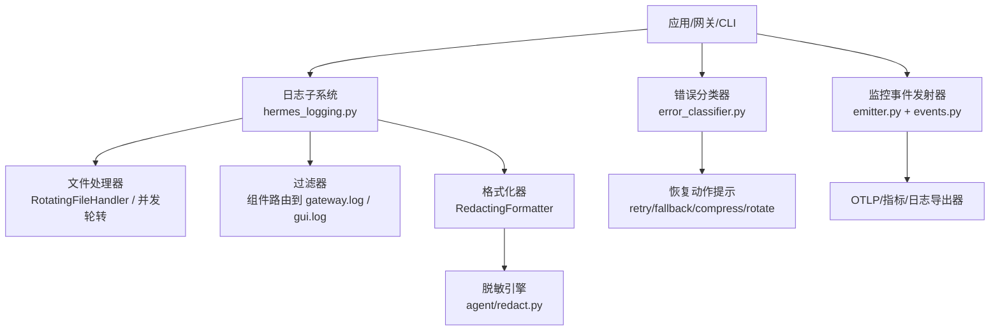
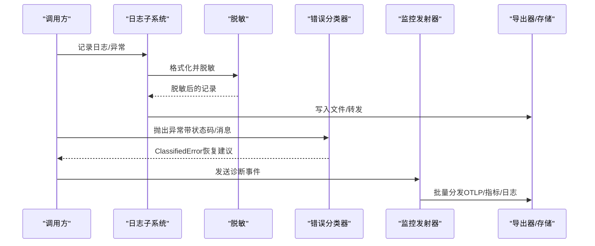
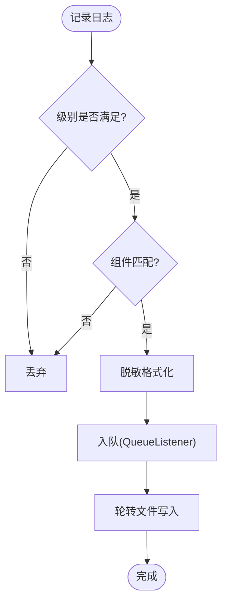
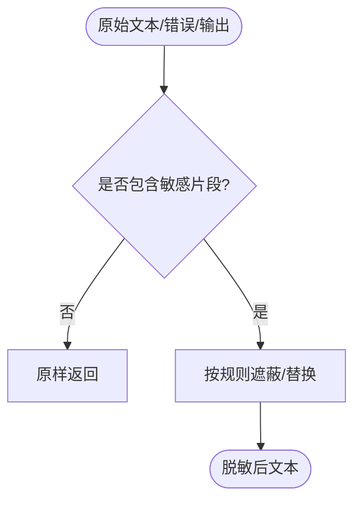
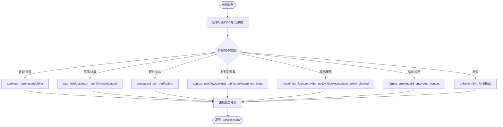
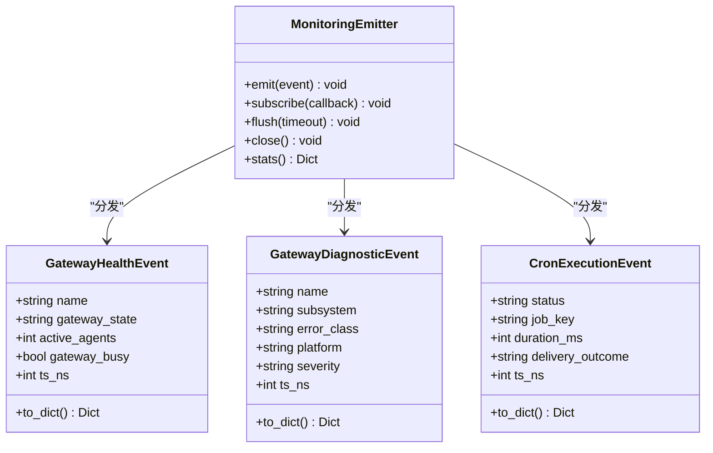
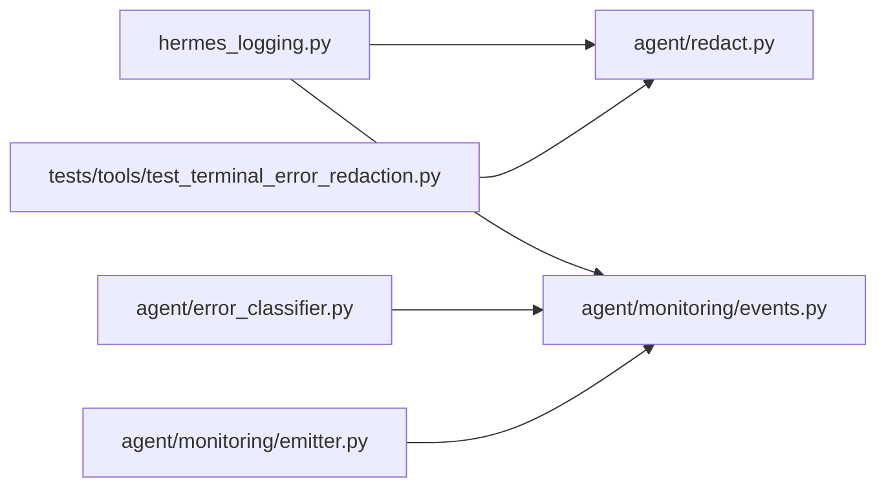

# 错误追踪

<cite>
**本文引用的文件**
- [hermes_logging.py](file://hermes_logging.py)
- [agent/redact.py](file://agent/redact.py)
- [agent/error_classifier.py](file://agent/error_classifier.py)
- [agent/errors.py](file://agent/errors.py)
- [agent/monitoring/events.py](file://agent/monitoring/events.py)
- [agent/monitoring/emitter.py](file://agent/monitoring/emitter.py)
- [tests/tools/test_terminal_error_redaction.py](file://tests/tools/test_terminal_error_redaction.py)
</cite>

## 目录
1. [简介](#简介)
2. [项目结构](#项目结构)
3. [核心组件](#核心组件)
4. [架构总览](#架构总览)
5. [详细组件分析](#详细组件分析)
6. [依赖关系分析](#依赖关系分析)
7. [性能考量](#性能考量)
8. [故障排查指南](#故障排查指南)
9. [结论](#结论)
10. [附录](#附录)

## 简介
本文件面向运维与研发，系统化说明 Hermes Agent 的错误捕获、分类与上报机制。内容覆盖：
- 结构化日志格式、错误级别定义与过滤规则
- 敏感信息脱敏策略（密钥、令牌、连接串等）
- 日志轮转与存储策略（含跨进程并发安全）
- 错误聚合分析、趋势统计与告警触发思路
- 分布式场景下的错误链路追踪与根因定位方法
- 常见错误处理模式与故障恢复策略
- 工具使用与调试技巧

## 项目结构
错误追踪相关能力分布在以下模块：
- 日志基础设施：集中式日志配置、文件轮转、异步队列化写入、会话上下文注入
- 敏感信息脱敏：统一格式化器与文本脱敏规则，覆盖日志、输出、URL、表单、头部等
- 错误分类与恢复：API 错误的结构化分类与恢复建议（重试、降级、压缩、轮换凭证等）
- 监控事件与发射器：健康与诊断事件的结构化定义与无阻塞发射管道
- 测试验证：终端工具错误路径的脱敏断言

**图表来源**
- [hermes_logging.py:259-376](file://hermes_logging.py#L259-L376)
- [agent/redact.py:772-800](file://agent/redact.py#L772-L800)
- [agent/error_classifier.py:624-718](file://agent/error_classifier.py#L624-L718)
- [agent/monitoring/emitter.py:36-117](file://agent/monitoring/emitter.py#L36-L117)
- [agent/monitoring/events.py:19-63](file://agent/monitoring/events.py#L19-L63)

**章节来源**
- [hermes_logging.py:1-800](file://hermes_logging.py#L1-L800)
- [agent/redact.py:1-800](file://agent/redact.py#L1-L800)
- [agent/error_classifier.py:1-800](file://agent/error_classifier.py#L1-L800)
- [agent/monitoring/events.py:1-87](file://agent/monitoring/events.py#L1-L87)
- [agent/monitoring/emitter.py:1-212](file://agent/monitoring/emitter.py#L1-L212)

## 核心组件
- 日志子系统
  - 入口：setup_logging() 统一初始化，支持多模式（cli/gateway/gui/cron），按组件路由到不同日志文件
  - 文件：agent.log（全量）、errors.log（WARNING+ 快速排障）、gateway.log（仅网关组件）、gui.log（仅 GUI/TUI 组件）
  - 轮转：RotatingFileHandler（Windows 下使用并发轮转避免锁竞争），自定义 ManagedRotatingFileHandler 支持外部轮转检测与权限修复
  - 异步：QueueListener 将文件写入移出热路径，避免阻塞事件循环或跨进程旋转锁
  - 会话上下文：set_session_context()/clear_session_context() 在每条日志中注入 [session_id] 便于关联
- 脱敏引擎
  - RedactingFormatter 结合 agent/redact.py 的多类正则，覆盖 API Key、JWT、数据库连接串、Authorization 头、URL 查询参数、表单体等
  - 默认开启；可通过配置关闭（启动时记录告警）
  - 对工具输出、错误消息、traceback 均进行脱敏，确保不泄露凭据
- 错误分类器
  - classify_api_error() 将异常结构化归类为 FailoverReason，并给出 retryable、should_compress、should_rotate_credential、should_fallback 等恢复提示
  - 覆盖认证失败、计费耗尽、限流、过载、超时、SSL 证书问题、上下文溢出、模型不存在、策略拦截、格式错误等
- 监控事件与发射器
  - GatewayHealthEvent / GatewayDiagnosticEvent / CronExecutionEvent 提供无内容、可审计的诊断事件
  - MonitoringEmitter 提供 O(微秒) 的非阻塞 emit，后台线程批量分发至订阅者（如 OTLP 导出器），失败隔离且不影响主流程

**章节来源**
- [hermes_logging.py:259-376](file://hermes_logging.py#L259-L376)
- [hermes_logging.py:415-547](file://hermes_logging.py#L415-L547)
- [hermes_logging.py:550-760](file://hermes_logging.py#L550-L760)
- [agent/redact.py:772-800](file://agent/redact.py#L772-L800)
- [agent/error_classifier.py:22-94](file://agent/error_classifier.py#L22-L94)
- [agent/error_classifier.py:624-718](file://agent/error_classifier.py#L624-L718)
- [agent/monitoring/events.py:19-63](file://agent/monitoring/events.py#L19-L63)
- [agent/monitoring/emitter.py:36-117](file://agent/monitoring/emitter.py#L36-L117)

## 架构总览
错误追踪由“采集—分类—上报”三段组成：
- 采集：日志子系统负责统一格式、过滤、轮转与脱敏；监控事件通过发射器以非阻塞方式汇聚
- 分类：错误分类器根据状态码、错误体、消息模式与传输层特征，输出结构化恢复建议
- 上报：监控事件经发射器分发给 OTLP 或其他后端；日志落盘供离线分析与告警

**图表来源**
- [hermes_logging.py:259-376](file://hermes_logging.py#L259-L376)
- [agent/redact.py:772-800](file://agent/redact.py#L772-L800)
- [agent/error_classifier.py:624-718](file://agent/error_classifier.py#L624-L718)
- [agent/monitoring/emitter.py:53-117](file://agent/monitoring/emitter.py#L53-L117)

## 详细组件分析

### 日志子系统（文件、轮转、过滤、会话上下文）
- 文件与级别
  - agent.log：INFO+ 全量活动日志
  - errors.log：WARNING+ 快速排障
  - gateway.log：INFO+，仅网关组件（通过组件前缀过滤）
  - gui.log：INFO+，仅 GUI/TUI 组件
- 轮转与并发
  - Windows 使用并发轮转以避免跨进程锁争用导致的写失败
  - 自定义 ManagedRotatingFileHandler 支持外部轮转检测（inode 变化）与权限修正
- 异步写入
  - QueueListener 将文件写入放入独立线程，避免阻塞事件循环
  - flush_log_queue()/drain_log_queue() 提供可控刷新与退出时的有界等待
- 会话上下文
  - set_session_context()/clear_session_context() 在所有记录中注入 [session_id]，便于关联一次对话的错误链

**图表来源**
- [hermes_logging.py:259-376](file://hermes_logging.py#L259-L376)
- [hermes_logging.py:415-547](file://hermes_logging.py#L415-L547)
- [hermes_logging.py:550-760](file://hermes_logging.py#L550-L760)

**章节来源**
- [hermes_logging.py:1-800](file://hermes_logging.py#L1-L800)

### 敏感信息脱敏（日志与工具输出）
- 覆盖范围
  - API Key/Token（多种厂商前缀）、JWT、Authorization 头、数据库连接串、URL 查询参数、表单体、私有密钥块、电话号码等
- 策略
  - 短令牌完全遮蔽；长令牌保留首尾若干字符便于调试
  - 默认启用；可通过配置关闭（启动时记录告警）
  - 工具输出与错误/traceback 同样脱敏，防止凭据泄露
- 验证
  - 测试用例覆盖前台重试错误、环境创建导入错误、后台启动错误、外层异常等路径，断言 error/traceback 字段不含明文凭据

**图表来源**
- [agent/redact.py:772-800](file://agent/redact.py#L772-L800)
- [tests/tools/test_terminal_error_redaction.py:47-154](file://tests/tools/test_terminal_error_redaction.py#L47-L154)

**章节来源**
- [agent/redact.py:1-800](file://agent/redact.py#L1-L800)
- [tests/tools/test_terminal_error_redaction.py:1-154](file://tests/tools/test_terminal_error_redaction.py#L1-L154)

### 错误分类与恢复（API 错误）
- 分类维度
  - 认证/授权失败、计费耗尽、限流、服务器过载、超时、SSL 证书问题、上下文溢出、模型不存在、策略拦截、格式错误等
- 恢复建议
  - retryable：是否允许重试
  - should_compress：是否需要压缩上下文
  - should_rotate_credential：是否需要轮换凭证
  - should_fallback：是否需要切换到备用模型/提供商
- 处理流程
  - 提取状态码、错误体、元数据中的真实消息，组合后进行优先级匹配（提供者特定 > 状态码 > 错误码 > 消息模式 > 传输层启发）

**图表来源**
- [agent/error_classifier.py:22-94](file://agent/error_classifier.py#L22-L94)
- [agent/error_classifier.py:624-718](file://agent/error_classifier.py#L624-L718)

**章节来源**
- [agent/error_classifier.py:1-800](file://agent/error_classifier.py#L1-L800)
- [agent/errors.py:1-14](file://agent/errors.py#L1-L14)

### 监控事件与上报（健康与诊断）
- 事件类型
  - GatewayHealthEvent：网关健康快照与生命周期事件（无内容）
  - GatewayDiagnosticEvent：操作者可观测的诊断事件（含 severity、error_class、platform 等）
  - CronExecutionEvent：定时任务执行生命周期投影
- 发射器
  - MonitoringEmitter：emit() 非阻塞、永不抛错；后台线程批量分发；失败隔离；支持 flush/close/stats
- 用途
  - 用于聚合分析、趋势统计与告警触发（例如：高频 auth 失败、持续 rate_limit、频繁 SSL 证书错误）

**图表来源**
- [agent/monitoring/events.py:19-63](file://agent/monitoring/events.py#L19-L63)
- [agent/monitoring/emitter.py:36-117](file://agent/monitoring/emitter.py#L36-L117)

**章节来源**
- [agent/monitoring/events.py:1-87](file://agent/monitoring/events.py#L1-L87)
- [agent/monitoring/emitter.py:1-212](file://agent/monitoring/emitter.py#L1-L212)

## 依赖关系分析
- 日志子系统依赖脱敏格式化器；脱敏器被所有日志与工具输出路径复用
- 错误分类器独立于日志系统，但可与日志/监控联动（分类结果可作为诊断事件的 error_class）
- 监控发射器与事件定义解耦，便于扩展新的导出器（如 OTLP）
- 测试用例验证关键路径的脱敏行为，保障错误消息不泄露敏感信息

**图表来源**
- [hermes_logging.py:259-376](file://hermes_logging.py#L259-L376)
- [agent/redact.py:772-800](file://agent/redact.py#L772-L800)
- [agent/error_classifier.py:624-718](file://agent/error_classifier.py#L624-L718)
- [agent/monitoring/events.py:19-63](file://agent/monitoring/events.py#L19-L63)
- [agent/monitoring/emitter.py:36-117](file://agent/monitoring/emitter.py#L36-L117)
- [tests/tools/test_terminal_error_redaction.py:47-154](file://tests/tools/test_terminal_error_redaction.py#L47-L154)

**章节来源**
- [hermes_logging.py:1-800](file://hermes_logging.py#L1-L800)
- [agent/redact.py:1-800](file://agent/redact.py#L1-L800)
- [agent/error_classifier.py:1-800](file://agent/error_classifier.py#L1-L800)
- [agent/monitoring/events.py:1-87](file://agent/monitoring/events.py#L1-L87)
- [agent/monitoring/emitter.py:1-212](file://agent/monitoring/emitter.py#L1-L212)
- [tests/tools/test_terminal_error_redaction.py:1-154](file://tests/tools/test_terminal_error_redaction.py#L1-L154)

## 性能考量
- 异步日志写入：通过 QueueListener 避免文件 I/O 与跨进程旋转锁阻塞事件循环
- 最小化热路径开销：MonitoringEmitter.emit() 保证 O(微秒) 返回，永不抛错
- 轮转优化：ManagedRotatingFileHandler 检测外部轮转并重新打开文件，避免静默丢日志
- 噪声抑制：对第三方库日志设置较高阈值，减少无关噪音

[本节为通用指导，无需具体文件引用]

## 故障排查指南
- 快速定位
  - 查看 errors.log（WARNING+）获取快速排障线索
  - 使用 session_id 过滤 agent.log，关联一次对话的错误链
  - 检查 gateway.log/gui.log 按组件隔离问题
- 常见问题
  - SSL 证书验证失败：立即失败并给出修复指引，避免无效重试
  - 上下文溢出：自动压缩上下文并重试
  - 计费耗尽/限额：轮换凭证或切换提供商
  - 策略拦截：直接走 fallback 或提示用户调整输入
- 工具与技巧
  - 使用 hermes logs --component 筛选组件日志
  - 使用 verbose 模式输出 DEBUG 级控制台日志（仍会脱敏）
  - 通过 flush_log_queue()/drain_log_queue() 控制日志落盘时机
- 分布式链路追踪
  - 利用 session_id 与诊断事件中的 subsystem/platform 字段，跨服务关联错误
  - 将诊断事件接入 OTLP 后端，构建错误拓扑与时序图

**章节来源**
- [hermes_logging.py:259-376](file://hermes_logging.py#L259-L376)
- [agent/monitoring/events.py:19-63](file://agent/monitoring/events.py#L19-L63)
- [agent/error_classifier.py:624-718](file://agent/error_classifier.py#L624-L718)

## 结论
Hermes Agent 的错误追踪体系以“结构化日志 + 强脱敏 + 智能分类 + 非阻塞上报”为核心，兼顾安全性、可观测性与性能。通过统一的日志与事件通道，结合错误分类器的恢复建议，可在复杂分布式环境中快速定位根因并自动恢复。配合测试与最佳实践，可为运维团队提供完整的错误管理解决方案与排错指南。

[本节为总结性内容，无需具体文件引用]

## 附录
- 错误级别与文件映射
  - INFO+ → agent.log
  - WARNING+ → errors.log
  - 组件前缀 → gateway.log / gui.log
- 脱敏开关
  - 默认开启；可通过配置关闭（启动时记录告警）
- 监控事件字段
  - GatewayHealthEvent/GatewayDiagnosticEvent/CronExecutionEvent 提供时间戳、严重级别、平台、子系统等关键字段，便于聚合与告警

**章节来源**
- [hermes_logging.py:259-376](file://hermes_logging.py#L259-L376)
- [agent/monitoring/events.py:19-63](file://agent/monitoring/events.py#L19-L63)