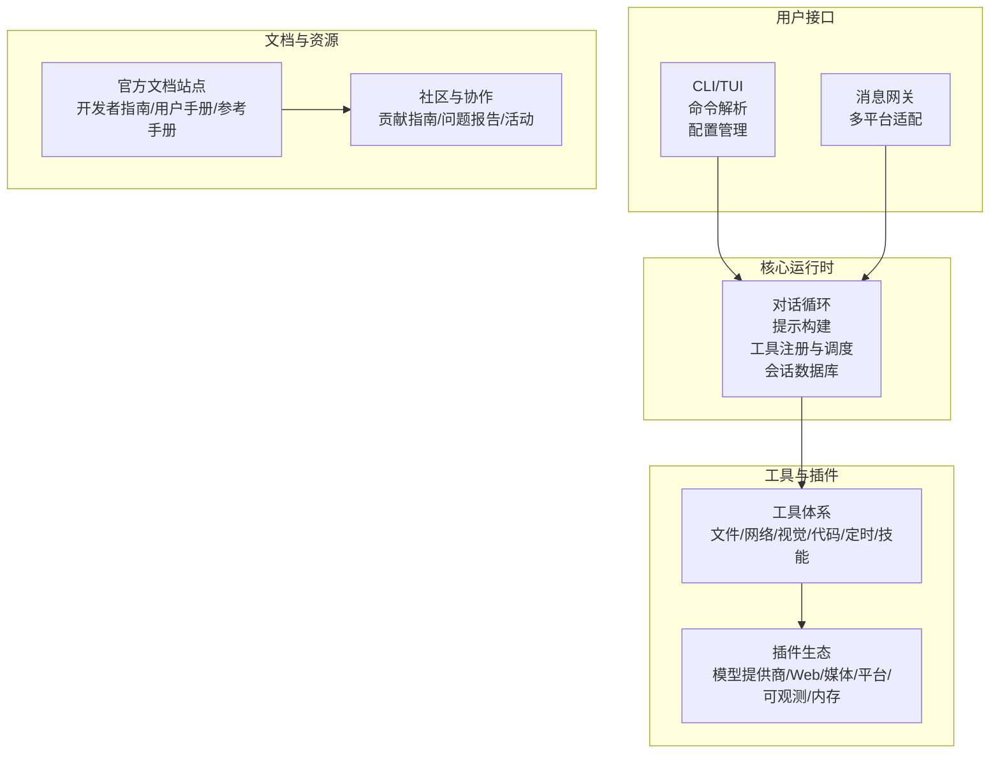
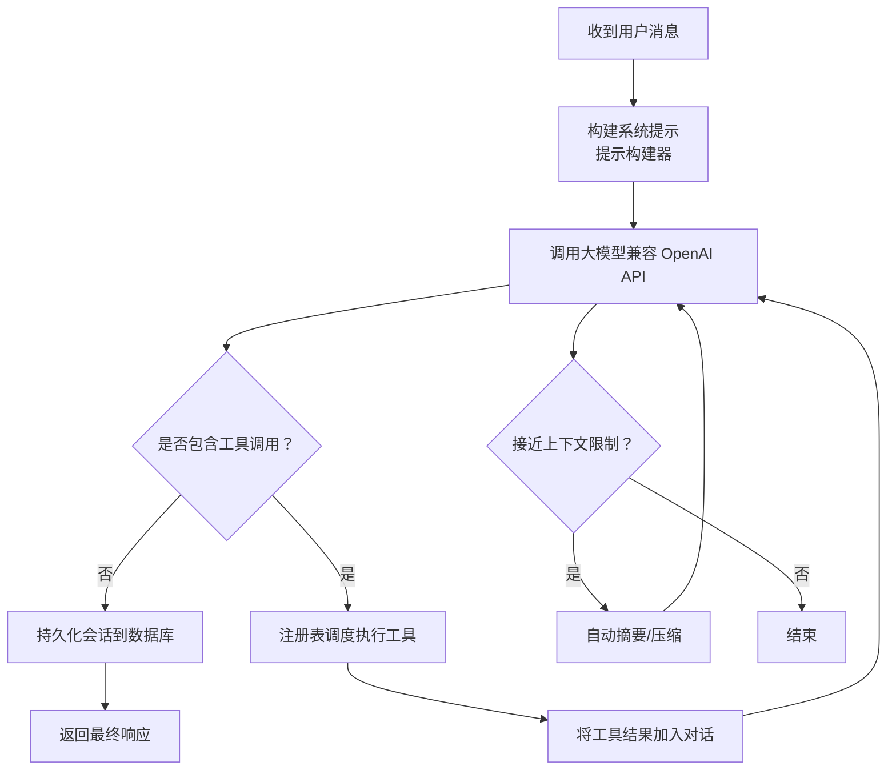
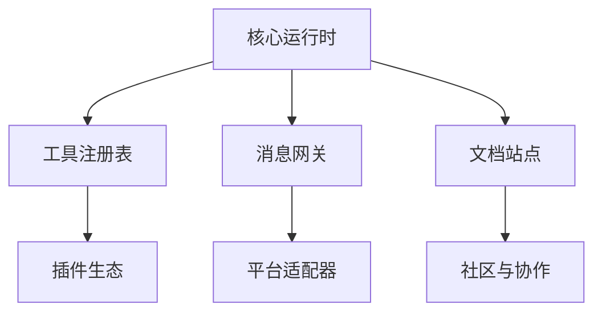

# 社区和资源

<cite>
**本文引用的文件**
- [README.md](file://README.md)
- [CONTRIBUTING.md](file://CONTRIBUTING.md)
- [SECURITY.md](file://SECURITY.md)
- [.github/PULL_REQUEST_TEMPLATE.md](file://.github/PULL_REQUEST_TEMPLATE.md)
- [website/docs/社区与协作/贡献指南.md](file://website/docs/社区与协作/贡献指南.md)
- [website/docs/安全策略/安全政策.md](file://website/docs/安全策略/安全政策.md)
- [website/docs/用户指南/安装与设置.md](file://website/docs/用户指南/安装与设置.md)
- [website/docs/开发者指南/架构总览.md](file://website/docs/开发者指南/架构总览.md)
- [website/docs/参考/命令参考.md](file://website/docs/参考/命令参考.md)
- [website/docs/开发者指南/开发环境搭建.md](file://website/docs/开发者指南/开发环境搭建.md)
- [website/docs/用户指南/消息网关.md](file://website/docs/用户指南/消息网关.md)
- [website/docs/用户指南/工具与工具集.md](file://website/docs/用户指南/工具与工具集.md)
- [website/docs/用户指南/技能系统.md](file://website/docs/用户指南/技能系统.md)
- [website/docs/用户指南/内存.md](file://website/docs/用户指南/内存.md)
- [website/docs/用户指南/定时任务.md](file://website/docs/用户指南/定时任务.md)
- [website/docs/用户指南/上下文文件.md](file://website/docs/用户指南/上下文文件.md)
- [website/docs/用户指南/CLI使用.md](file://website/docs/用户指南/CLI使用.md)
- [website/docs/用户指南/配置.md](file://website/docs/用户指南/配置.md)
- [website/docs/用户指南/安全.md](file://website/docs/用户指南/安全.md)
- [website/docs/参考/环境变量参考.md](file://website/docs/参考/环境变量参考.md)
- [gateway/platforms/ADDING_A_PLATFORM.md](file://gateway/platforms/ADDING_A_PLATFORM.md)
- [plugins/README.md](file://plugins/README.md)
- [skills/DESCRIPTION.md](file://skills/DESCRIPTION.md)
- [optional-skills/DESCRIPTION.md](file://optional-skills/DESCRIPTION.md)
- [plugins/model-providers/README.md](file://plugins/model-providers/README.md)
- [plugins/security-guidance/README.md](file://plugins/security-guidance/README.md)
- [plugins/hermes-achievements/README.md](file://plugins/hermes-achievements/README.md)
- [plugins/kanban/dashboard/manifest.json](file://plugins/kanban/dashboard/manifest.json)
- [plugins/hermes-achievements/dashboard/manifest.json](file://plugins/hermes-achievements/dashboard/manifest.json)
- [plugins/hermes-achievements/docs/成就系统.md](file://plugins/hermes-achievements/docs/成就系统.md)
- [plugins/hermes-achievements/docs/使用指南.md](file://plugins/hermes-achievements/docs/使用指南.md)
- [plugins/hermes-achievements/docs/开发指南.md](file://plugins/hermes-achievements/docs/开发指南.md)
- [plugins/observability/langfuse/README.md](file://plugins/observability/langfuse/README.md)
- [plugins/observability/nemo_relay/README.md](file://plugins/observability/nemo_relay/README.md)
- [plugins/platforms/discord/README.md](file://plugins/platforms/discord/README.md)
- [plugins/platforms/teams/README.md](file://plugins/platforms/teams/README.md)
- [plugins/platforms/line/README.md](file://plugins/platforms/line/README.md)
- [plugins/platforms/ntfy/README.md](file://plugins/platforms/ntfy/README.md)
- [plugins/platforms/homeassistant/README.md](file://plugins/platforms/homeassistant/README.md)
- [plugins/web/ddgs/README.md](file://plugins/web/ddgs/README.md)
- [plugins/web/tavily/README.md](file://plugins/web/tavily/README.md)
- [plugins/web/searxng/README.md](file://plugins/web/searxng/README.md)
- [plugins/web/firecrawl/README.md](file://plugins/web/firecrawl/README.md)
- [plugins/web/exa/README.md](file://plugins/web/exa/README.md)
- [plugins/web/brave_free/README.md](file://plugins/web/brave_free/README.md)
- [plugins/web/xai/README.md](file://plugins/web/xai/README.md)
- [plugins/web/parallel/README.md](file://plugins/web/parallel/README.md)
- [plugins/image_gen/openai/README.md](file://plugins/image_gen/openai/README.md)
- [plugins/image_gen/fal/README.md](file://plugins/image_gen/fal/README.md)
- [plugins/image_gen/krea/README.md](file://plugins/image_gen/krea/README.md)
- [plugins/image_gen/xai/README.md](file://plugins/image_gen/xai/README.md)
- [plugins/video_gen/fal/README.md](file://plugins/video_gen/fal/README.md)
- [plugins/video_gen/xai/README.md](file://plugins/video_gen/xai/README.md)
- [plugins/browser/browserbase/README.md](file://plugins/browser/browserbase/README.md)
- [plugins/browser/firecrawl/README.md](file://plugins/browser/firecrawl/README.md)
- [plugins/browser/browser_use/README.md](file://plugins/browser/browser_use/README.md)
- [plugins/spotify/README.md](file://plugins/spotify/README.md)
- [plugins/teams_pipeline/README.md](file://plugins/teams_pipeline/README.md)
- [plugins/google_meet/README.md](file://plugins/google_meet/README.md)
- [plugins/disk-cleanup/README.md](file://plugins/disk-cleanup/README.md)
- [plugins/memory/honcho/README.md](file://plugins/memory/honcho/README.md)
- [plugins/memory/mem0/README.md](file://plugins/memory/mem0/README.md)
- [plugins/memory/supermemory/README.md](file://plugins/memory/supermemory/README.md)
- [plugins/memory/byterover/README.md](file://plugins/memory/byterover/README.md)
- [plugins/memory/holographic/README.md](file://plugins/memory/holographic/README.md)
- [plugins/memory/openviking/README.md](file://plugins/memory/openviking/README.md)
- [plugins/memory/retaindb/README.md](file://plugins/memory/retaindb/README.md)
- [plugins/memory/siyan/README.md](file://plugins/memory/siyan/README.md)
- [plugins/memory/hindsight/README.md](file://plugins/memory/hindsight/README.md)
- [plugins/model-providers/alibaba/README.md](file://plugins/model-providers/alibaba/README.md)
- [plugins/model-providers/anthropic/README.md](file://plugins/model-providers/anthropic/README.md)
- [plugins/model-providers/bedrock/README.md](file://plugins/model-providers/bedrock/README.md)
- [plugins/model-providers/copilot/README.md](file://plugins/model-providers/copilot/README.md)
- [plugins/model-providers/codex/README.md](file://plugins/model-providers/codex/README.md)
- [plugins/model-providers/deepseek/README.md](file://plugins/model-providers/deepseek/README.md)
- [plugins/model-providers/gemini/README.md](file://plugins/model-providers/gemini/README.md)
- [plugins/model-providers/gmi/README.md](file://plugins/model-providers/gmi/README.md)
- [plugins/model-providers/huggingface/README.md](file://plugins/model-providers/huggingface/README.md)
- [plugins/model-providers/kilocode/README.md](file://plugins/model-providers/kilocode/README.md)
- [plugins/model-providers/kimi-coding/README.md](file://plugins/model-providers/kimi-coding/README.md)
- [plugins/model-providers/minimax/README.md](file://plugins/model-providers/minimax/README.md)
- [plugins/model-providers/nous/README.md](file://plugins/model-providers/nous/README.md)
- [plugins/model-providers/novita/README.md](file://plugins/model-providers/novita/README.md)
- [plugins/model-providers/nvidia/README.md](file://plugins/model-providers/nvidia/README.md)
- [plugins/model-providers/ollama-cloud/README.md](file://plugins/model-providers/ollama-cloud/README.md)
- [plugins/model-providers/openai-codex/README.md](file://plugins/model-providers/openai-codex/README.md)
- [plugins/model-providers/opencode-zen/README.md](file://plugins/model-providers/opencode-zen/README.md)
- [plugins/model-providers/openrouter/README.md](file://plugins/model-providers/openrouter/README.md)
- [plugins/model-providers/qwen-oauth/README.md](file://plugins/model-providers/qwen-oauth/README.md)
- [plugins/model-providers/stepfun/README.md](file://plugins/model-providers/stepfun/README.md)
- [plugins/model-providers/xai/README.md](file://plugins/model-providers/xai/README.md)
- [plugins/model-providers/xiaomi/README.md](file://plugins/model-providers/xiaomi/README.md)
- [plugins/model-providers/zai/README.md](file://plugins/model-providers/zai/README.md)
- [plugins/model-providers/custom/README.md](file://plugins/model-providers/custom/README.md)
- [plugins/model-providers/README.md](file://plugins/model-providers/README.md)
- [plugins/spotify/SKILL.md](file://plugins/spotify/SKILL.md)
- [plugins/teams_pipeline/models.py](file://plugins/teams_pipeline/models.py)
- [plugins/teams_pipeline/pipeline.py](file://plugins/teams_pipeline/pipeline.py)
- [plugins/teams_pipeline/store.py](file://plugins/teams_pipeline/store.py)
- [plugins/teams_pipeline/subscriptions.py](file://plugins/teams_pipeline/subscriptions.py)
- [plugins/teams_pipeline/runtime.py](file://plugins/teams_pipeline/runtime.py)
- [plugins/teams_pipeline/cli.py](file://plugins/teams_pipeline/cli.py)
- [plugins/teams_pipeline/plugin.yaml](file://plugins/teams_pipeline/plugin.yaml)
- [plugins/teams_pipeline/README.md](file://plugins/teams_pipeline/README.md)
- [plugins/google_meet/meet_bot.py](file://plugins/google_meet/meet_bot.py)
- [plugins/google_meet/process_manager.py](file://plugins/google_meet/process_manager.py)
- [plugins/google_meet/tools.py](file://plugins/google_meet/tools.py)
- [plugins/google_meet/plugin.yaml](file://plugins/google_meet/plugin.yaml)
- [plugins/google_meet/README.md](file://plugins/google_meet/README.md)
- [plugins/disk-cleanup/plugin.yaml](file://plugins/disk-cleanup/plugin.yaml)
- [plugins/disk-cleanup/disk_cleanup.py](file://plugins/disk-cleanup/disk_cleanup.py)
- [plugins/disk-cleanup/README.md](file://plugins/disk-cleanup/README.md)
- [plugins/hermes-achievements/README.md](file://plugins/hermes-achievements/README.md)
- [plugins/hermes-achievements/dashboard/manifest.json](file://plugins/hermes-achievements/dashboard/manifest.json)
- [plugins/hermes-achievements/docs/成就系统.md](file://plugins/hermes-achievements/docs/成就系统.md)
- [plugins/hermes-achievements/docs/使用指南.md](file://plugins/hermes-achievements/docs/使用指南.md)
- [plugins/hermes-achievements/docs/开发指南.md](file://plugins/hermes-achievements/docs/开发指南.md)
- [plugins/observability/langfuse/README.md](file://plugins/observability/langfuse/README.md)
- [plugins/observability/nemo_relay/README.md](file://plugins/observability/nemo_relay/README.md)
- [plugins/platforms/discord/README.md](file://plugins/platforms/discord/README.md)
- [plugins/platforms/teams/README.md](file://plugins/platforms/teams/README.md)
- [plugins/platforms/line/README.md](file://plugins/platforms/line/README.md)
- [plugins/platforms/ntfy/README.md](file://plugins/platforms/ntfy/README.md)
- [plugins/platforms/homeassistant/README.md](file://plugins/platforms/homeassistant/README.md)
- [plugins/web/ddgs/README.md](file://plugins/web/ddgs/README.md)
- [plugins/web/tavily/README.md](file://plugins/web/tavily/README.md)
- [plugins/web/searxng/README.md](file://plugins/web/searxng/README.md)
- [plugins/web/firecrawl/README.md](file://plugins/web/firecrawl/README.md)
- [plugins/web/exa/README.md](file://plugins/web/exa/README.md)
- [plugins/web/brave_free/README.md](file://plugins/web/brave_free/README.md)
- [plugins/web/xai/README.md](file://plugins/web/xai/README.md)
- [plugins/web/parallel/README.md](file://plugins/web/parallel/README.md)
- [plugins/image_gen/openai/README.md](file://plugins/image_gen/openai/README.md)
- [plugins/image_gen/fal/README.md](file://plugins/image_gen/fal/README.md)
- [plugins/image_gen/krea/README.md](file://plugins/image_gen/krea/README.md)
- [plugins/image_gen/xai/README.md](file://plugins/image_gen/xai/README.md)
- [plugins/video_gen/fal/README.md](file://plugins/video_gen/fal/README.md)
- [plugins/video_gen/xai/README.md](file://plugins/video_gen/xai/README.md)
- [plugins/browser/browserbase/README.md](file://plugins/browser/browserbase/README.md)
- [plugins/browser/firecrawl/README.md](file://plugins/browser/firecrawl/README.md)
- [plugins/browser/browser_use/README.md](file://plugins/browser/browser_use/README.md)
- [plugins/spotify/README.md](file://plugins/spotify/README.md)
- [plugins/spotify/client.py](file://plugins/spotify/client.py)
- [plugins/spotify/tools.py](file://plugins/spotify/tools.py)
- [plugins/spotify/plugin.yaml](file://plugins/spotify/plugin.yaml)
- [plugins/spotify/SKILL.md](file://plugins/spotify/SKILL.md)
- [plugins/teams_pipeline/README.md](file://plugins/teams_pipeline/README.md)
- [plugins/teams_pipeline/models.py](file://plugins/teams_pipeline/models.py)
- [plugins/teams_pipeline/pipeline.py](file://plugins/teams_pipeline/pipeline.py)
- [plugins/teams_pipeline/store.py](file://plugins/teams_pipeline/store.py)
- [plugins/teams_pipeline/subscriptions.py](file://plugins/teams_pipeline/subscriptions.py)
- [plugins/teams_pipeline/runtime.py](file://plugins/teams_pipeline/runtime.py)
- [plugins/teams_pipeline/cli.py](file://plugins/teams_pipeline/cli.py)
- [plugins/teams_pipeline/plugin.yaml](file://plugins/teams_pipeline/plugin.yaml)
- [plugins/google_meet/README.md](file://plugins/google_meet/README.md)
- [plugins/google_meet/meet_bot.py](file://plugins/google_meet/meet_bot.py)
- [plugins/google_meet/process_manager.py](file://plugins/google_meet/process_manager.py)
- [plugins/google_meet/tools.py](file://plugins/google_meet/tools.py)
- [plugins/google_meet/plugin.yaml](file://plugins/google_meet/plugin.yaml)
- [plugins/disk-cleanup/README.md](file://plugins/disk-cleanup/README.md)
- [plugins/disk-cleanup/plugin.yaml](file://plugins/disk-cleanup/plugin.yaml)
- [plugins/disk-cleanup/disk_cleanup.py](file://plugins/disk-cleanup/disk_cleanup.py)
- [plugins/memory/honcho/README.md](file://plugins/memory/honcho/README.md)
- [plugins/memory/mem0/README.md](file://plugins/memory/mem0/README.md)
- [plugins/memory/supermemory/README.md](file://plugins/memory/supermemory/README.md)
- [plugins/memory/byterover/README.md](file://plugins/memory/byterover/README.md)
- [plugins/memory/holographic/README.md](file://plugins/memory/holographic/README.md)
- [plugins/memory/openviking/README.md](file://plugins/memory/openviking/README.md)
- [plugins/memory/retaindb/README.md](file://plugins/memory/retaindb/README.md)
- [plugins/memory/siyan/README.md](file://plugins/memory/siyan/README.md)
- [plugins/memory/hindsight/README.md](file://plugins/memory/hindsight/README.md)
- [plugins/model-providers/alibaba/README.md](file://plugins/model-providers/alibaba/README.md)
- [plugins/model-providers/anthropic/README.md](file://plugins/model-providers/anthropic/README.md)
- [plugins/model-providers/bedrock/README.md](file://plugins/model-providers/bedrock/README.md)
- [plugins/model-providers/copilot/README.md](file://plugins/model-providers/copilot/README.md)
- [plugins/model-providers/codex/README.md](file://plugins/model-providers/codex/README.md)
- [plugins/model-providers/deepseek/README.md](file://plugins/model-providers/deepseek/README.md)
- [plugins/model-providers/gemini/README.md](file://plugins/model-providers/gemini/README.md)
- [plugins/model-providers/gmi/README.md](file://plugins/model-providers/gmi/README.md)
- [plugins/model-providers/huggingface/README.md](file://plugins/model-providers/huggingface/README.md)
- [plugins/model-providers/kilocode/README.md](file://plugins/model-providers/kilocode/README.md)
- [plugins/model-providers/kimi-coding/README.md](file://plugins/model-providers/kimi-coding/README.md)
- [plugins/model-providers/minimax/README.md](file://plugins/model-providers/minimax/README.md)
- [plugins/model-providers/nous/README.md](file://plugins/model-providers/nous/README.md)
- [plugins/model-providers/novita/README.md](file://plugins/model-providers/novita/README.md)
- [plugins/model-providers/nvidia/README.md](file://plugins/model-providers/nvidia/README.md)
- [plugins/model-providers/ollama-cloud/README.md](file://plugins/model-providers/ollama-cloud/README.md)
- [plugins/model-providers/openai-codex/README.md](file://plugins/model-providers/openai-codex/README.md)
- [plugins/model-providers/opencode-zen/README.md](file://plugins/model-providers/opencode-zen/README.md)
- [plugins/model-providers/openrouter/README.md](file://plugins/model-providers/openrouter/README.md)
- [plugins/model-providers/qwen-oauth/README.md](file://plugins/model-providers/qwen-oauth/README.md)
- [plugins/model-providers/stepfun/README.md](file://plugins/model-providers/stepfun/README.md)
- [plugins/model-providers/xai/README.md](file://plugins/model-providers/xai/README.md)
- [plugins/model-providers/xiaomi/README.md](file://plugins/model-providers/xiaomi/README.md)
- [plugins/model-providers/zai/README.md](file://plugins/model-providers/zai/README.md)
- [plugins/model-providers/custom/README.md](file://plugins/model-providers/custom/README.md)
- [plugins/model-providers/README.md](file://plugins/model-providers/README.md)
- [plugins/observability/langfuse/README.md](file://plugins/observability/langfuse/README.md)
- [plugins/observability/nemo_relay/README.md](file://plugins/observability/nemo_relay/README.md)
- [plugins/platforms/discord/README.md](file://plugins/platforms/discord/README.md)
- [plugins/platforms/teams/README.md](file://plugins/platforms/teams/README.md)
- [plugins/platforms/line/README.md](file://plugins/platforms/line/README.md)
- [plugins/platforms/ntfy/README.md](file://plugins/platforms/ntfy/README.md)
- [plugins/platforms/homeassistant/README.md](file://plugins/platforms/homeassistant/README.md)
- [plugins/web/ddgs/README.md](file://plugins/web/ddgs/README.md)
- [plugins/web/tavily/README.md](file://plugins/web/tavily/README.md)
- [plugins/web/searxng/README.md](file://plugins/web/searxng/README.md)
- [plugins/web/firecrawl/README.md](file://plugins/web/firecrawl/README.md)
- [plugins/web/exa/README.md](file://plugins/web/exa/README.md)
- [plugins/web/brave_free/README.md](file://plugins/web/brave_free/README.md)
- [plugins/web/xai/README.md](file://plugins/web/xai/README.md)
- [plugins/web/parallel/README.md](file://plugins/web/parallel/README.md)
- [plugins/image_gen/openai/README.md](file://plugins/image_gen/openai/README.md)
- [plugins/image_gen/fal/README.md](file://plugins/image_gen/fal/README.md)
- [plugins/image_gen/krea/README.md](file://plugins/image_gen/krea/README.md)
- [plugins/image_gen/xai/README.md](file://plugins/image_gen/xai/README.md)
- [plugins/video_gen/fal/README.md](file://plugins/video_gen/fal/README.md)
- [plugins/video_gen/xai/README.md](file://plugins/video_gen/xai/README.md)
- [plugins/browser/browserbase/README.md](file://plugins/browser/browserbase/README.md)
- [plugins/browser/firecrawl/README.md](file://plugins/browser/firecrawl/README.md)
- [plugins/browser/browser_use/README.md](file://plugins/browser/browser_use/README.md)
- [plugins/spotify/README.md](file://plugins/spotify/README.md)
- [plugins/spotify/client.py](file://plugins/spotify/client.py)
- [plugins/spotify/tools.py](file://plugins/spotify/tools.py)
- [plugins/spotify/plugin.yaml](file://plugins/spotify/plugin.yaml)
- [plugins/spotify/SKILL.md](file://plugins/spotify/SKILL.md)
- [plugins/teams_pipeline/README.md](file://plugins/teams_pipeline/README.md)
- [plugins/teams_pipeline/models.py](file://plugins/teams_pipeline/models.py)
- [plugins/teams_pipeline/pipeline.py](file://plugins/teams_pipeline/pipeline.py)
- [plugins/teams_pipeline/store.py](file://plugins/teams_pipeline/store.py)
- [plugins/teams_pipeline/subscriptions.py](file://plugins/teams_pipeline/subscriptions.py)
- [plugins/teams_pipeline/runtime.py](file://plugins/teams_pipeline/runtime.py)
- [plugins/teams_pipeline/cli.py](file://plugins/teams_pipeline/cli.py)
- [plugins/teams_pipeline/plugin.yaml](file://plugins/teams_pipeline/plugin.yaml)
- [plugins/google_meet/README.md](file://plugins/google_meet/README.md)
- [plugins/google_meet/meet_bot.py](file://plugins/google_meet/meet_bot.py)
- [plugins/google_meet/process_manager.py](file://plugins/google_meet/process_manager.py)
- [plugins/google_meet/tools.py](file://plugins/google_meet/tools.py)
- [plugins/google_meet/plugin.yaml](file://plugins/google_meet/plugin.yaml)
- [plugins/disk-cleanup/README.md](file://plugins/disk-cleanup/README.md)
- [plugins/disk-cleanup/plugin.yaml](file://plugins/disk-cleanup/plugin.yaml)
- [plugins/disk-cleanup/disk_cleanup.py](file://plugins/disk-cleanup/disk_cleanup.py)
- [plugins/memory/honcho/README.md](file://plugins/memory/honcho/README.md)
- [plugins/memory/mem0/README.md](file://plugins/memory/mem0/README.md)
- [plugins/memory/supermemory/README.md](file://plugins/memory/supermemory/README.md)
- [plugins/memory/byterover/README.md](file://plugins/memory/byterover/README.md)
- [plugins/memory/holographic/README.md](file://plugins/memory/holographic/README.md)
- [plugins/memory/openviking/README.md](file://plugins/memory/openviking/README.md)
- [plugins/memory/retaindb/README.md](file://plugins/memory/retaindb/README.md)
- [plugins/memory/siyan/README.md](file://plugins/memory/siyan/README.md)
- [plugins/memory/hindsight/README.md](file://plugins/memory/hindsight/README.md)
- [plugins/model-providers/alibaba/README.md](file://plugins/model-providers/alibaba/README.md)
- [plugins/model-providers/anthropic/README.md](file://plugins/model-providers/anthropic/README.md)
- [plugins/model-providers/bedrock/README.md](file://plugins/model-providers/bedrock/README.md)
- [plugins/model-providers/copilot/README.md](file://plugins/model-providers/copilot/README.md)
- [plugins/model-providers/codex/README.md](file://plugins/model-providers/codex/README.md)
- [plugins/model-providers/deepseek/README.md](file://plugins/model-providers/deepseek/README.md)
- [plugins/model-providers/gemini/README.md](file://plugins/model-providers/gemini/README.md)
- [plugins/model-providers/gmi/README.md](file://plugins/model-providers/gmi/README.md)
- [plugins/model-providers/huggingface/README.md](file://plugins/model-providers/huggingface/README.md)
- [plugins/model-providers/kilocode/README.md](file://plugins/model-providers/kilocode/README.md)
- [plugins/model-providers/kimi-coding/README.md](file://plugins/model-providers/kimi-coding/README.md)
- [plugins/model-providers/minimax/README.md](file://plugins/model-providers/minimax/README.md)
- [plugins/model-providers/nous/README.md](file://plugins/model-providers/nous/README.md)
- [plugins/model-providers/novita/README.md](file://plugins/model-providers/novita/README.md)
- [plugins/model-providers/nvidia/README.md](file://plugins/model-providers/nvidia/README.md)
- [plugins/model-providers/ollama-cloud/README.md](file://plugins/model-providers/ollama-cloud/README.md)
- [plugins/model-providers/openai-codex/README.md](file://plugins/model-providers/openai-codex/README.md)
- [plugins/model-providers/opencode-zen/README.md](file://plugins/model-providers/opencode-zen/README.md)
- [plugins/model-providers/openrouter/README.md](file://plugins/model-providers/openrouter/README.md)
- [plugins/model-providers/qwen-oauth/README.md](file://plugins/model-providers/qwen-oauth/README.md)
- [plugins/model-providers/stepfun/README.md](file://plugins/model-providers/stepfun/README.md)
- [plugins/model-providers/xai/README.md](file://plugins/model-providers/xai/README.md)
- [plugins/model-providers/xiaomi/README.md](file://plugins/model-providers/xiaomi/README.md)
- [plugins/model-providers/zai/README.md](file://plugins/model-providers/zai/README.md)
- [plugins/model-providers/custom/README.md](file://plugins/model-providers/custom/README.md)
- [plugins/model-providers/README.md](file://plugins/model-providers/README.md)
</cite>

## 目录
1. [简介](#简介)
2. [项目结构](#项目结构)
3. [核心组件](#核心组件)
4. [架构总览](#架构总览)
5. [详细组件分析](#详细组件分析)
6. [依赖关系分析](#依赖关系分析)
7. [性能考虑](#性能考虑)
8. [故障排除指南](#故障排除指南)
9. [结论](#结论)
10. [附录](#附录)

## 简介
本页面为 Hermes Agent 的社区与资源综合信息页，面向用户与贡献者，提供社区支持渠道、讨论论坛、问题报告流程、外部链接、参考文档、示例项目与教程、贡献指南、功能请求与 Bug 报告模板、社区活动与成功案例、许可证与法律声明等完整指南。

## 项目结构
Hermes Agent 是一个以“自我改进型 AI 助手”为核心目标的开源项目，围绕“对话循环、工具调度、会话持久化、多平台网关、可插拔能力生态”构建。其核心模块包括：
- 核心运行时：对话循环、提示构建、工具注册与调度、会话数据库
- CLI 与 TUI：交互式终端界面、命令解析、配置管理
- 工具体系：文件操作、网络搜索、浏览器、视觉分析、代码执行、定时任务、技能管理等
- 消息网关：Telegram、Discord、Slack、WhatsApp、Signal、邮件等多平台适配
- 插件生态：模型提供商、Web 搜索、图像/视频生成、浏览器、平台适配、可观测性、内存等
- 文档站点：官方文档、开发者指南、用户手册、参考手册

**章节来源**
- [README.md: 1-217:1-217](file://README.md#L1-L217)
- [website/docs/开发者指南/架构总览.md](file://website/docs/开发者指南/架构总览.md)

## 核心组件
- 对话循环与提示构建：负责构建系统提示、调用大模型、工具调度与上下文压缩
- 工具注册与调度：自注册机制、工具集分组、按平台启用/禁用
- 会话持久化：SQLite 数据库存储、全文检索、会话标题与快照
- 消息网关：统一平台生命周期、消息路由、定时任务
- 插件生态：模型提供商、Web 搜索、图像/视频生成、浏览器、平台适配、可观测性、内存等

**章节来源**
- [CONTRIBUTING.md: 134-201:134-201](file://CONTRIBUTING.md#L134-L201)
- [website/docs/开发者指南/架构总览.md](file://website/docs/开发者指南/架构总览.md)

## 架构总览
Hermes Agent 的核心循环从用户消息开始，构建系统提示与 API 参数，调用大模型；若返回工具调用，则通过注册表调度执行工具并将结果加入对话，再回传给模型，直至得到文本回复；在接近上下文限制时进行自动压缩。

**图表来源**
- [CONTRIBUTING.md: 219-246:219-246](file://CONTRIBUTING.md#L219-L246)

**章节来源**
- [CONTRIBUTING.md: 219-246:219-246](file://CONTRIBUTING.md#L219-L246)

## 详细组件分析

### 社区支持与协作
- 主要社区渠道
  - Discord 讨论区：用于实时交流、问题求助与功能讨论
  - GitHub Issues：用于提交 Bug 报告、功能请求与安全漏洞
  - GitHub Discussions：用于长篇讨论与方案征集
- 贡献流程
  - 开发环境搭建、代码风格、PR 提交流程、测试要求
  - 贡献优先级：Bug 修复、跨平台兼容、安全加固、性能与鲁棒性、新技能、新工具、文档
- 贡献指南与模板
  - 贡献指南：开发环境、项目结构、架构概览、代码风格、新增工具/技能流程
  - PR 模板：变更类型、影响面、测试覆盖、风险评估、变更日志
  - Issue 模板：Bug 报告模板、功能请求模板、安全漏洞模板

**章节来源**
- [README.md: 202-210:202-210](file://README.md#L202-L210)
- [CONTRIBUTING.md: 1-18:1-18](file://CONTRIBUTING.md#L1-L18)
- [CONTRIBUTING.md: 70-131:70-131](file://CONTRIBUTING.md#L70-L131)
- [CONTRIBUTING.md: 134-201:134-201](file://CONTRIBUTING.md#L134-L201)
- [CONTRIBUTING.md: 258-320:258-320](file://CONTRIBUTING.md#L258-L320)
- [CONTRIBUTING.md: 323-477:323-477](file://CONTRIBUTING.md#L323-L477)
- [CONTRIBUTING.md: 539-586:539-586](file://CONTRIBUTING.md#L539-L586)
- [CONTRIBUTING.md: 589-800:589-800](file://CONTRIBUTING.md#L589-L800)
- [website/docs/社区与协作/贡献指南.md](file://website/docs/社区与协作/贡献指南.md)

### 安全与合规
- 安全策略
  - 报告渠道：私有安全通告通道或安全邮箱
  - 信任模型：操作系统级隔离为唯一安全边界
  - 外部表面与授权：消息网关、HTTP 表面、编辑器/IDE 适配器、TUI 网关的授权与访问控制
  - 作用域与豁免：边界内行为、凭证范围、进程内启发式、第三方技能/插件、公开暴露等
  - 部署加固：容器镜像默认非 root 运行、凭证文件权限、允许列表、第三方内容审查
- 安全政策文档与模板
  - 安全政策：报告流程、披露窗口、信用与保密
  - 安全建议与最佳实践：跨平台兼容、路径处理、信号与进程管理、编码与换行符、符号链接与权限

**章节来源**
- [SECURITY.md: 1-332:1-332](file://SECURITY.md#L1-L332)
- [website/docs/安全策略/安全政策.md](file://website/docs/安全策略/安全政策.md)

### 用户文档与教程
- 官方文档站点
  - 快速入门、CLI 使用、配置、消息网关、安全、工具与工具集、技能系统、内存、MCP 集成、定时任务、上下文文件、架构、贡献指南、CLI 参考、环境变量参考
- 教程与示例
  - 安装与设置、迁移指南、平台适配、技能编写与发布、插件开发与集成
- 示例项目
  - 技能 Hub、社区插件仓库、第三方 MCP 服务器示例

**章节来源**
- [README.md: 123-144:123-144](file://README.md#L123-L144)
- [website/docs/用户指南/安装与设置.md](file://website/docs/用户指南/安装与设置.md)
- [website/docs/用户指南/CLI使用.md](file://website/docs/用户指南/CLI使用.md)
- [website/docs/用户指南/配置.md](file://website/docs/用户指南/配置.md)
- [website/docs/用户指南/消息网关.md](file://website/docs/用户指南/消息网关.md)
- [website/docs/用户指南/安全.md](file://website/docs/用户指南/安全.md)
- [website/docs/用户指南/工具与工具集.md](file://website/docs/用户指南/工具与工具集.md)
- [website/docs/用户指南/技能系统.md](file://website/docs/用户指南/技能系统.md)
- [website/docs/用户指南/内存.md](file://website/docs/用户指南/内存.md)
- [website/docs/用户指南/定时任务.md](file://website/docs/用户指南/定时任务.md)
- [website/docs/用户指南/上下文文件.md](file://website/docs/用户指南/上下文文件.md)
- [website/docs/参考/命令参考.md](file://website/docs/参考/命令参考.md)
- [website/docs/参考/环境变量参考.md](file://website/docs/参考/环境变量参考.md)

### 平台与插件生态
- 平台适配
  - 新增平台指南：平台适配器开发、配置解析、会话存储、生命周期管理
- 插件分类
  - 模型提供商：OpenRouter、Anthropic、Bedrock、Gemini、Hugging Face、XAI 等
  - Web 搜索：DDGS、Tavily、SearxNG、Firecrawl、Exa、Brave Free、Parallel、XAI
  - 媒体生成：图像生成（OpenAI、FAL、KREA、XAI）、视频生成（FAL、XAI）
  - 浏览器：Browserbase、Firecrawl、Browser Use
  - 平台适配：Discord、Teams、Line、Ntfy、Home Assistant
  - 观测性：Langfuse、Nemo Relay
  - 内存：Honcho、Mem0、SuperMemory、Byterover、Holographic、OpenViking、RetainDB、Siyan、Hindsight
  - 其他：Spotify、Google Meet、Disk Cleanup、Teams Pipeline、Hermes Achievements

**章节来源**
- [gateway/platforms/ADDING_A_PLATFORM.md](file://gateway/platforms/ADDING_A_PLATFORM.md)
- [plugins/README.md](file://plugins/README.md)
- [plugins/model-providers/README.md](file://plugins/model-providers/README.md)
- [plugins/web/README.md](file://plugins/web/README.md)
- [plugins/image_gen/README.md](file://plugins/image_gen/README.md)
- [plugins/video_gen/README.md](file://plugins/video_gen/README.md)
- [plugins/browser/README.md](file://plugins/browser/README.md)
- [plugins/platforms/README.md](file://plugins/platforms/README.md)
- [plugins/observability/README.md](file://plugins/observability/README.md)
- [plugins/memory/README.md](file://plugins/memory/README.md)
- [plugins/spotify/README.md](file://plugins/spotify/README.md)
- [plugins/google_meet/README.md](file://plugins/google_meet/README.md)
- [plugins/disk-cleanup/README.md](file://plugins/disk-cleanup/README.md)
- [plugins/teams_pipeline/README.md](file://plugins/teams_pipeline/README.md)
- [plugins/hermes-achievements/README.md](file://plugins/hermes-achievements/README.md)

### 技能系统与资源
- 技能分类
  - 研究类、生产力、创意、数据科学、DevOps、社交、软件开发、研究、智能体、区块链、健康、MLOps、网络安全、电子、游戏、通信、金融、web 开发、dogfood 等
- 技能 Hub
  - 官方可选技能与社区贡献技能的发现与安装
- 技能编写标准
  - SKILL.md 格式、平台限定、条件激活、环境变量声明、作者署名、章节顺序、脚本与测试要求

**章节来源**
- [skills/DESCRIPTION.md](file://skills/DESCRIPTION.md)
- [optional-skills/DESCRIPTION.md](file://optional-skills/DESCRIPTION.md)
- [CONTRIBUTING.md: 323-477:323-477](file://CONTRIBUTING.md#L323-L477)

### 开发者指南与最佳实践
- 开发环境
  - 前置条件、克隆与安装、开发配置、运行与测试
- 代码风格
  - PEP 8 实践、注释规范、错误处理、跨平台注意事项
- 跨平台兼容
  - Windows 安全模式、POSIX/NTFS 差异、信号与进程管理、路径分隔符、符号链接权限、换行符、引号与转义规则
- 安全加固
  - 危险命令检测、写入黑名单、凭证范围、输出脱敏、容器加固

**章节来源**
- [CONTRIBUTING.md: 70-131:70-131](file://CONTRIBUTING.md#L70-L131)
- [CONTRIBUTING.md: 249-256:249-256](file://CONTRIBUTING.md#L249-L256)
- [CONTRIBUTING.md: 589-800:589-800](file://CONTRIBUTING.md#L589-L800)
- [website/docs/开发者指南/开发环境搭建.md](file://website/docs/开发者指南/开发环境搭建.md)

## 依赖关系分析
Hermes Agent 的依赖关系主要体现在：
- 组件耦合：核心运行时与工具/插件生态松耦合，通过注册表与工具集实现动态扩展
- 外部依赖：模型提供商、Web 搜索、图像/视频生成、浏览器、平台适配等插件
- 授权与访问控制：消息网关与 HTTP 表面需要严格的允许列表与 OS 级别访问控制
- 供应链安全：MCP 服务器启动与依赖变更的供应链防护

**图表来源**
- [CONTRIBUTING.md: 134-201:134-201](file://CONTRIBUTING.md#L134-L201)

**章节来源**
- [CONTRIBUTING.md: 134-201:134-201](file://CONTRIBUTING.md#L134-L201)

## 性能考虑
- 上下文压缩：在接近上下文限制时进行自动摘要与压缩，减少 Token 使用
- 工具调度：通过注册表与工具集分组，避免不必要的工具加载
- 会话存储：SQLite 存储与全文检索，支持会话标题与锚定窗口搜索
- 跨平台兼容：针对 Windows 的特殊处理，避免静默杀伤与进程组广播

**章节来源**
- [CONTRIBUTING.md: 219-246:219-246](file://CONTRIBUTING.md#L219-L246)
- [CONTRIBUTING.md: 589-800:589-800](file://CONTRIBUTING.md#L589-L800)

## 故障排除指南
- 常见问题诊断
  - 使用诊断命令检查环境与配置
  - 查看日志与会话数据库状态
- 安全问题
  - 私有安全通道报告，遵循披露窗口与保密要求
- 平台与插件问题
  - 检查允许列表与 OS 级别访问控制
  - 更新插件版本与依赖

**章节来源**
- [README.md: 66-78:66-78](file://README.md#L66-L78)
- [SECURITY.md: 1-332:1-332](file://SECURITY.md#L1-L332)

## 结论
Hermes Agent 通过完善的社区支持、详尽的文档资源、开放的插件生态与严格的安全策略，为用户与贡献者提供了从安装部署到深度定制的全链路体验。建议用户优先参考官方文档与贡献指南，遇到问题通过私有安全通道或社区渠道寻求帮助，并遵循安全策略与最佳实践。

## 附录

### 社区支持渠道
- Discord 讨论区
- GitHub Issues（Bug 报告、功能请求）
- GitHub Discussions（长篇讨论）

**章节来源**
- [README.md: 202-210:202-210](file://README.md#L202-L210)

### 问题报告流程
- 安全漏洞：私有安全通告通道或安全邮箱
- 一般问题：GitHub Issues，附带环境信息与复现步骤
- 讨论与方案征集：GitHub Discussions

**章节来源**
- [SECURITY.md: 7-29:7-29](file://SECURITY.md#L7-L29)
- [README.md: 202-210:202-210](file://README.md#L202-L210)

### 外部链接与参考文档
- 官方文档站点：https://hermes-agent.nousresearch.com/docs/
- 快速入门、CLI 使用、配置、消息网关、安全、工具与工具集、技能系统、内存、MCP 集成、定时任务、上下文文件、架构、贡献指南、CLI 参考、环境变量参考

**章节来源**
- [README.md: 123-144:123-144](file://README.md#L123-L144)

### 示例项目与教程
- 安装与设置、迁移指南、平台适配、技能编写与发布、插件开发与集成
- 技能 Hub、社区插件仓库、第三方 MCP 服务器示例

**章节来源**
- [website/docs/用户指南/安装与设置.md](file://website/docs/用户指南/安装与设置.md)
- [website/docs/用户指南/消息网关.md](file://website/docs/用户指南/消息网关.md)
- [website/docs/用户指南/技能系统.md](file://website/docs/用户指南/技能系统.md)
- [website/docs/用户指南/工具与工具集.md](file://website/docs/用户指南/工具与工具集.md)

### 贡献指南与模板
- 贡献优先级、开发环境、项目结构、架构概览、代码风格、新增工具/技能流程
- PR 模板、Issue 模板（Bug 报告、功能请求、安全漏洞）

**章节来源**
- [CONTRIBUTING.md: 1-18:1-18](file://CONTRIBUTING.md#L1-L18)
- [CONTRIBUTING.md: 70-131:70-131](file://CONTRIBUTING.md#L70-L131)
- [CONTRIBUTING.md: 134-201:134-201](file://CONTRIBUTING.md#L134-L201)
- [CONTRIBUTING.md: 258-320:258-320](file://CONTRIBUTING.md#L258-L320)
- [CONTRIBUTING.md: 323-477:323-477](file://CONTRIBUTING.md#L323-L477)
- [CONTRIBUTING.md: 539-586:539-586](file://CONTRIBUTING.md#L539-L586)
- [CONTRIBUTING.md: 589-800:589-800](file://CONTRIBUTING.md#L589-L800)
- [website/docs/社区与协作/贡献指南.md](file://website/docs/社区与协作/贡献指南.md)

### 社区活动与成功案例
- 社区活动：定期线上分享、技能发布季、插件竞赛
- 成功案例：企业级自动化、个人生产力提升、教育研究应用

（本节为概念性内容，不直接分析具体文件）

### 许可证与法律声明
- 许可证：MIT
- 法律声明：由 Nous Research 发布，遵守开源许可条款

**章节来源**
- [README.md: 212-217:212-217](file://README.md#L212-L217)