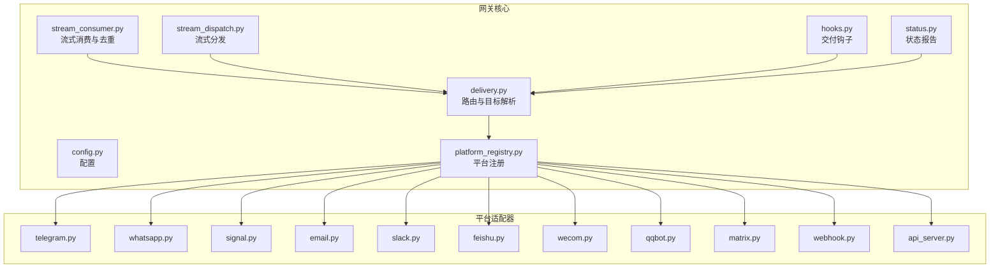
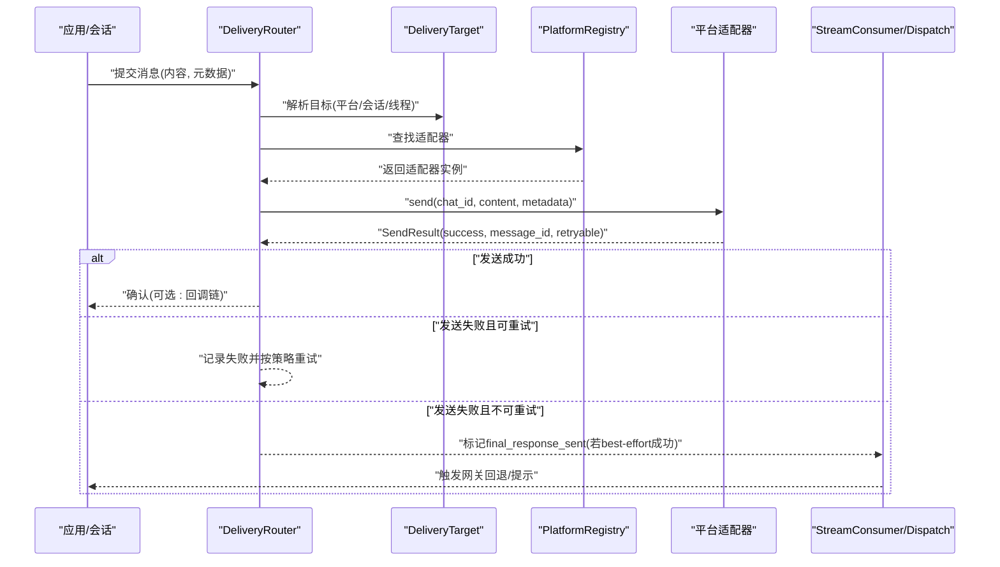
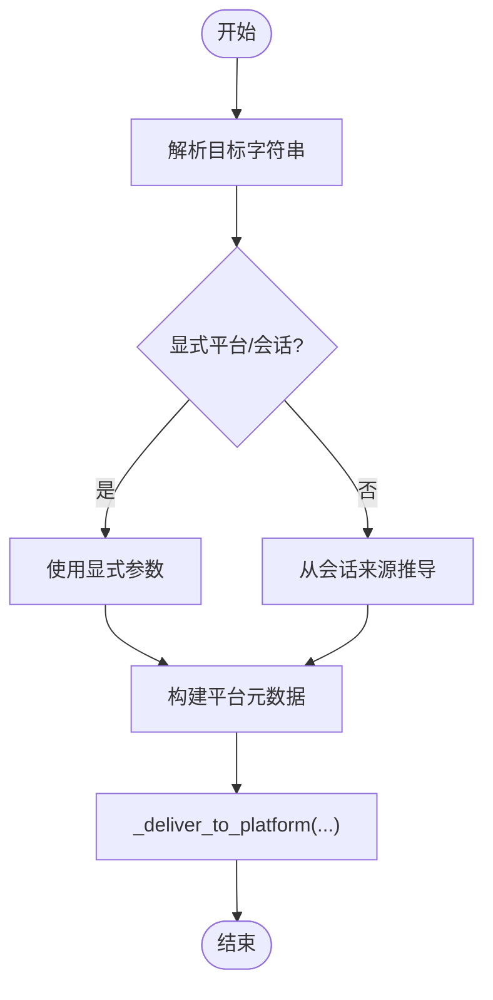
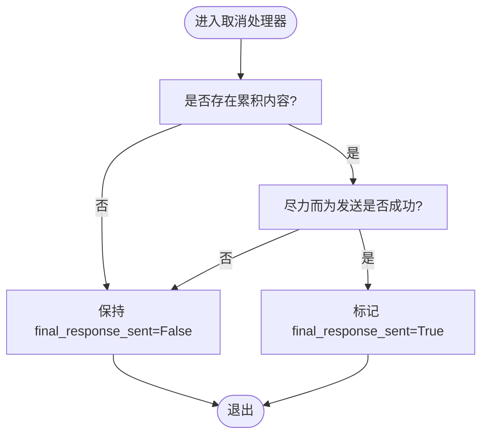
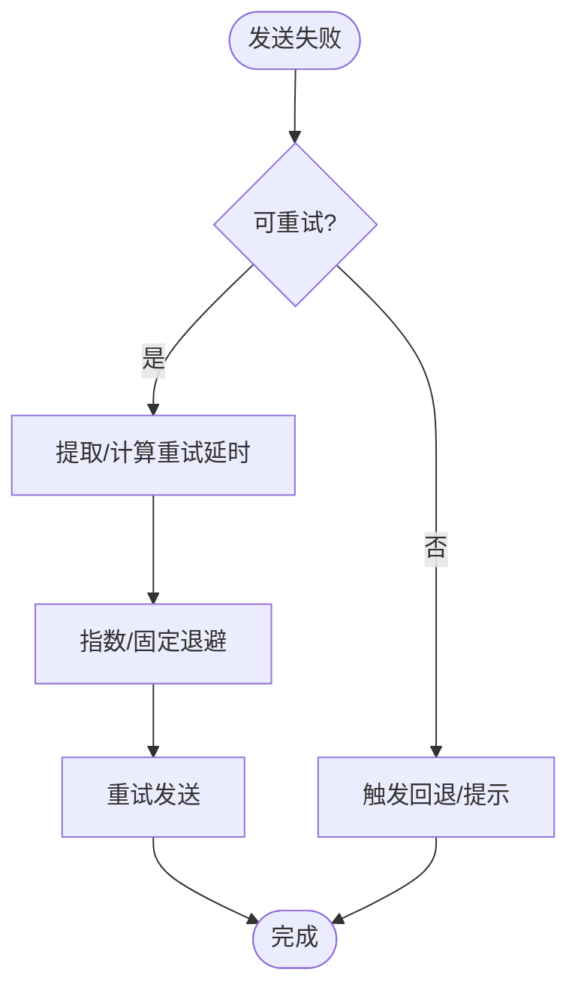
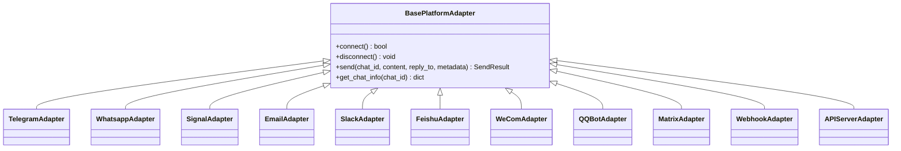
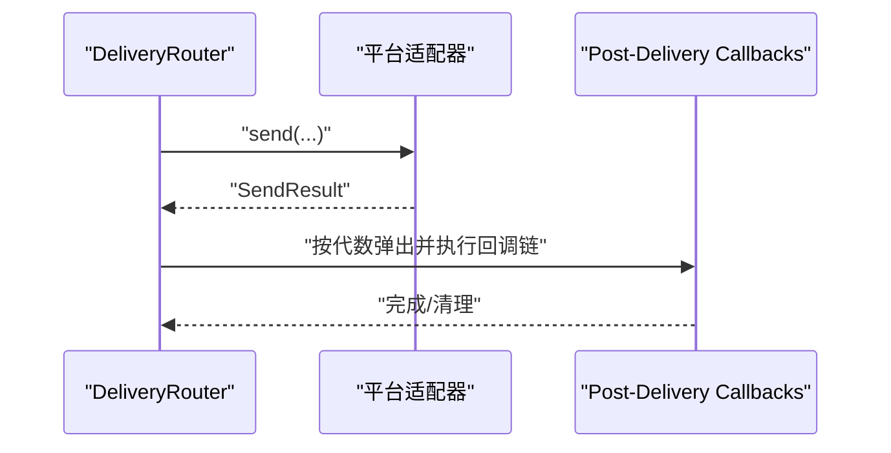
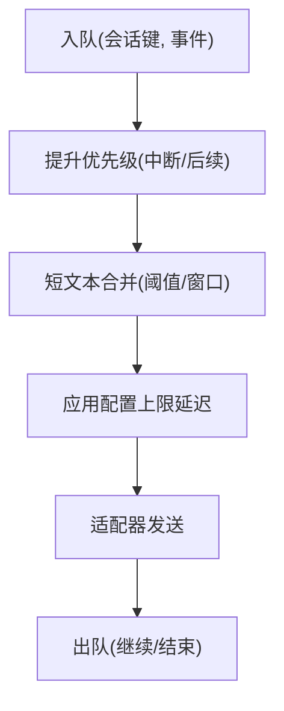
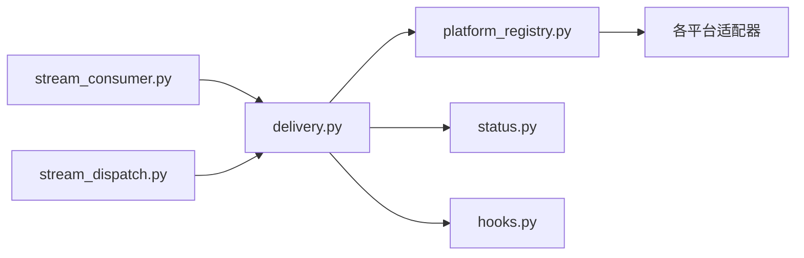

# 交付机制

<cite>
**本文引用的文件**
- [delivery.py](file://gateway/delivery.py)
- [base.py](file://gateway/platforms/base.py)
- [telegram.py](file://gateway/platforms/telegram.py)
- [whatsapp.py](file://gateway/platforms/whatsapp.py)
- [signal.py](file://gateway/platforms/signal.py)
- [email.py](file://gateway/platforms/email.py)
- [slack.py](file://gateway/platforms/slack.py)
- [feishu.py](file://gateway/platforms/feishu.py)
- [wecom.py](file://gateway/platforms/wecom.py)
- [qqbot.py](file://gateway/platforms/qqbot.py)
- [matrix.py](file://gateway/platforms/matrix.py)
- [webhook.py](file://gateway/platforms/webhook.py)
- [api_server.py](file://gateway/platforms/api_server.py)
- [platform_registry.py](file://gateway/platform_registry.py)
- [hooks.py](file://gateway/hooks.py)
- [stream_consumer.py](file://gateway/stream_consumer.py)
- [stream_dispatch.py](file://gateway/stream_dispatch.py)
- [status.py](file://gateway/status.py)
- [channel_directory.py](file://gateway/channel_directory.py)
- [config.py](file://gateway/config.py)
- [test_delivery.py](file://tests/gateway/test_delivery.py)
- [test_duplicate_reply_suppression.py](file://tests/gateway/test_duplicate_reply_suppression.py)
- [test_post_delivery_callback_chaining.py](file://tests/gateway/test_post_delivery_callback_chaining.py)
- [test_queue_consumption.py](file://tests/gateway/test_queue_consumption.py)
- [test_signal.py](file://tests/gateway/test_signal.py)
- [test_telegram_text_batch_perf.py](file://tests/gateway/test_telegram_text_batch_perf.py)
- [test_whatsapp_text_batching.py](file://tests/gateway/test_whatsapp_text_batching.py)
- [adding-platform-adapters.md](file://website/docs/developer-guide/adding-platform-adapters.md)
- [batch-processing.md](file://website/docs/user-guide/features/batch-processing.md)
</cite>

## 目录
1. [简介](#简介)
2. [项目结构](#项目结构)
3. [核心组件](#核心组件)
4. [架构总览](#架构总览)
5. [详细组件分析](#详细组件分析)
6. [依赖关系分析](#依赖关系分析)
7. [性能考量](#性能考量)
8. [故障排查指南](#故障排查指南)
9. [结论](#结论)
10. [附录](#附录)

## 简介
本文件系统性阐述 Hermes Agent 的交付机制，覆盖消息路由策略、重试与确认处理、交付状态跟踪、失败与补偿、多平台投递与格式适配、协议转换、性能优化（批量、队列）、交付钩子与扩展点、运维监控与告警、以及安全与完整性保障。内容基于仓库中的网关与平台适配器实现、测试与文档，确保技术深度与可操作性。

## 项目结构
交付机制主要由以下模块构成：
- 网关核心：路由、目标解析、状态与钩子
- 平台适配器：各平台发送、接收、速率限制与错误处理
- 流式消费与分发：流式事件的消费、去重抑制与回退
- 配置与注册：平台注册、运行参数与环境变量
- 测试与文档：行为验证、性能基准与扩展指南

图示来源
- [delivery.py](file://gateway/delivery.py)
- [stream_consumer.py](file://gateway/stream_consumer.py)
- [stream_dispatch.py](file://gateway/stream_dispatch.py)
- [hooks.py](file://gateway/hooks.py)
- [status.py](file://gateway/status.py)
- [config.py](file://gateway/config.py)
- [platform_registry.py](file://gateway/platform_registry.py)
- [telegram.py](file://gateway/platforms/telegram.py)
- [whatsapp.py](file://gateway/platforms/whatsapp.py)
- [signal.py](file://gateway/platforms/signal.py)
- [email.py](file://gateway/platforms/email.py)
- [slack.py](file://gateway/platforms/slack.py)
- [feishu.py](file://gateway/platforms/feishu.py)
- [wecom.py](file://gateway/platforms/wecom.py)
- [qqbot.py](file://gateway/platforms/qqbot.py)
- [matrix.py](file://gateway/platforms/matrix.py)
- [webhook.py](file://gateway/platforms/webhook.py)
- [api_server.py](file://gateway/platforms/api_server.py)

章节来源
- [delivery.py](file://gateway/delivery.py)
- [platform_registry.py](file://gateway/platform_registry.py)
- [config.py](file://gateway/config.py)

## 核心组件
- 路由器与目标解析：负责将消息投递到指定平台与会话，支持显式与“来自当前会话”的目标解析，并保留平台特定元数据。
- 发送结果模型：统一返回成功/失败、是否可重试、错误信息与消息标识等。
- 平台适配器：封装各平台的连接、断开、发送、聊天信息查询与错误处理。
- 流式消费与回退：在取消或异常情况下，通过“尽力而为”发送与最终响应标记，避免重复回复并触发网关回退。
- 钩子系统：交付后回调链，按代数（generation）隔离执行，支持幂等与清理。
- 队列与批处理：按平台与会话维护队列，合并短文本、控制延迟，保证吞吐与合规。

章节来源
- [delivery.py](file://gateway/delivery.py)
- [base.py](file://gateway/platforms/base.py)
- [stream_consumer.py](file://gateway/stream_consumer.py)
- [test_delivery.py](file://tests/gateway/test_delivery.py)
- [test_duplicate_reply_suppression.py](file://tests/gateway/test_duplicate_reply_suppression.py)
- [test_post_delivery_callback_chaining.py](file://tests/gateway/test_post_delivery_callback_chaining.py)
- [test_queue_consumption.py](file://tests/gateway/test_queue_consumption.py)

## 架构总览
下图展示从消息进入网关到平台适配器发送的整体流程，包括路由、平台选择、发送与回退保护。

图示来源
- [delivery.py](file://gateway/delivery.py)
- [platform_registry.py](file://gateway/platform_registry.py)
- [base.py](file://gateway/platforms/base.py)
- [stream_consumer.py](file://gateway/stream_consumer.py)

## 详细组件分析

### 路由与目标解析
- 目标字符串解析：支持平台前缀与会话标识，如 telegram:12345 或 telegram:-100123:42（群组与线程），并区分显式与“来自当前会话”。
- 元数据透传：平台特定元数据（如主题、回复消息、线程ID）原样传递至适配器。
- 错误处理：平台发送失败时抛出运行时错误，便于上层捕获与回退。

图示来源
- [test_delivery.py](file://tests/gateway/test_delivery.py)
- [delivery.py](file://gateway/delivery.py)

章节来源
- [test_delivery.py](file://tests/gateway/test_delivery.py)
- [delivery.py](file://gateway/delivery.py)

### 发送结果与确认处理
- SendResult：统一承载发送结果，包含成功标志、消息ID、错误信息与是否可重试。
- 取消与回退保护：在流式消费中，仅当“尽力而为”发送成功且存在累积内容时，才将最终响应标记为已发送，否则保持 False 以触发网关回退，防止重复回复。

图示来源
- [test_duplicate_reply_suppression.py](file://tests/gateway/test_duplicate_reply_suppression.py)
- [base.py](file://gateway/platforms/base.py)

章节来源
- [test_duplicate_reply_suppression.py](file://tests/gateway/test_duplicate_reply_suppression.py)
- [base.py](file://gateway/platforms/base.py)

### 重试机制与失败处理
- 可重试判定：根据平台错误语义与速率限制提取，如 Signal 的 retry-after 推断。
- 重试策略：结合平台特性与配置，对可重试错误进行指数退避或固定延迟重试。
- 不可重试回退：立即触发网关回退或提示，避免重复投递。

图示来源
- [test_signal.py](file://tests/gateway/test_signal.py)
- [signal.py](file://gateway/platforms/signal.py)

章节来源
- [test_signal.py](file://tests/gateway/test_signal.py)
- [signal.py](file://gateway/platforms/signal.py)

### 交付状态跟踪与补偿
- 状态跟踪：通过状态模块与会话上下文记录交付进展与失败原因。
- 补偿机制：在不可重试或超限情况下，触发回退路径（如备用通道或提示用户），并记录补偿动作。

章节来源
- [status.py](file://gateway/status.py)
- [stream_consumer.py](file://gateway/stream_consumer.py)

### 多平台消息投递与格式适配
- 平台注册：平台适配器通过注册表统一接入，按平台枚举与配置加载。
- 格式适配：各平台适配器内部处理文本、富媒体、键盘与附件等格式差异。
- 协议转换：例如 Webhook、Matrix 等平台的协议差异在适配器内转换为统一的消息事件与发送接口。

图示来源
- [base.py](file://gateway/platforms/base.py)
- [telegram.py](file://gateway/platforms/telegram.py)
- [whatsapp.py](file://gateway/platforms/whatsapp.py)
- [signal.py](file://gateway/platforms/signal.py)
- [email.py](file://gateway/platforms/email.py)
- [slack.py](file://gateway/platforms/slack.py)
- [feishu.py](file://gateway/platforms/feishu.py)
- [wecom.py](file://gateway/platforms/wecom.py)
- [qqbot.py](file://gateway/platforms/qqbot.py)
- [matrix.py](file://gateway/platforms/matrix.py)
- [webhook.py](file://gateway/platforms/webhook.py)
- [api_server.py](file://gateway/platforms/api_server.py)

章节来源
- [platform_registry.py](file://gateway/platform_registry.py)
- [base.py](file://gateway/platforms/base.py)

### 交付钩子系统与扩展点
- 交付后回调链：按会话键与代数（generation）注册回调，同一代内按注册顺序执行，过时代数被拒绝。
- 扩展点：新增平台适配器需继承基础适配器并实现连接、断开、发送与聊天信息查询方法。

图示来源
- [test_post_delivery_callback_chaining.py](file://tests/gateway/test_post_delivery_callback_chaining.py)
- [hooks.py](file://gateway/hooks.py)

章节来源
- [test_post_delivery_callback_chaining.py](file://tests/gateway/test_post_delivery_callback_chaining.py)
- [hooks.py](file://gateway/hooks.py)
- [adding-platform-adapters.md](file://website/docs/developer-guide/adding-platform-adapters.md)

### 队列管理与批量处理
- 队列策略：按会话键维护队列，支持中断路径的优先级提升与溢出处理，避免覆盖紧急后续事件。
- 批量与延迟：短文本采用快速/短延迟分层，结合配置上限，减少抖动并提升吞吐。
- 性能基准：针对 Telegram 与 WhatsApp 的文本批处理进行延迟与合并效果验证。

图示来源
- [test_queue_consumption.py](file://tests/gateway/test_queue_consumption.py)
- [test_telegram_text_batch_perf.py](file://tests/gateway/test_telegram_text_batch_perf.py)
- [test_whatsapp_text_batching.py](file://tests/gateway/test_whatsapp_text_batching.py)

章节来源
- [test_queue_consumption.py](file://tests/gateway/test_queue_consumption.py)
- [test_telegram_text_batch_perf.py](file://tests/gateway/test_telegram_text_batch_perf.py)
- [test_whatsapp_text_batching.py](file://tests/gateway/test_whatsapp_text_batching.py)

## 依赖关系分析
- 路由器依赖平台注册表获取适配器实例，适配器依赖平台 SDK 或 HTTP 客户端。
- 流式消费与分发模块依赖路由器的状态标记与回退逻辑。
- 钩子系统与状态模块为上层提供可观测性与可恢复性。

图示来源
- [delivery.py](file://gateway/delivery.py)
- [platform_registry.py](file://gateway/platform_registry.py)
- [status.py](file://gateway/status.py)
- [hooks.py](file://gateway/hooks.py)
- [stream_consumer.py](file://gateway/stream_consumer.py)
- [stream_dispatch.py](file://gateway/stream_dispatch.py)

章节来源
- [delivery.py](file://gateway/delivery.py)
- [platform_registry.py](file://gateway/platform_registry.py)

## 性能考量
- 文本批处理：短文本采用快速/短延迟分层，结合配置上限，降低抖动并提升吞吐。
- 队列优先级：中断事件优先于普通队列，溢出头插入到中断之后，确保紧急后续事件有序执行。
- 平台差异：不同平台的速率限制与协议特性需分别优化，避免全局一刀切导致的尾延迟。

章节来源
- [test_telegram_text_batch_perf.py](file://tests/gateway/test_telegram_text_batch_perf.py)
- [test_whatsapp_text_batching.py](file://tests/gateway/test_whatsapp_text_batching.py)
- [test_queue_consumption.py](file://tests/gateway/test_queue_consumption.py)
- [batch-processing.md](file://website/docs/user-guide/features/batch-processing.md)

## 故障排查指南
- 发送失败但不可重试：检查平台错误码与消息ID，确认是否已标记最终响应，必要时触发回退。
- 重复回复问题：确认取消处理器仅在“尽力而为”成功且有累积内容时才标记最终响应。
- 回调链异常：核对会话键与代数，确保新注册不会覆盖较新的代数条目。
- 队列卡顿：检查中断事件是否正确提升优先级，以及溢出事件是否被正确安排在中断之后。
- 平台特定错误：Signal 的 retry-after 提取与回退逻辑，确保在速率限制场景下正确等待。

章节来源
- [test_duplicate_reply_suppression.py](file://tests/gateway/test_duplicate_reply_suppression.py)
- [test_post_delivery_callback_chaining.py](file://tests/gateway/test_post_delivery_callback_chaining.py)
- [test_queue_consumption.py](file://tests/gateway/test_queue_consumption.py)
- [test_signal.py](file://tests/gateway/test_signal.py)

## 结论
Hermes Agent 的交付机制通过统一的路由器与平台适配器抽象，实现了跨平台的一致投递体验。配合流式消费的回退保护、可重试的错误处理、按代数隔离的钩子系统与高效的队列/批处理策略，既保证了可靠性，也兼顾了性能与可扩展性。运维侧可通过状态与钩子实现可观测性与自动化补偿，开发者可按指南扩展新平台适配器。

## 附录
- 新增平台适配器步骤与模板参见扩展指南。
- 批量处理与性能优化参考用户指南。

章节来源
- [adding-platform-adapters.md](file://website/docs/developer-guide/adding-platform-adapters.md)
- [batch-processing.md](file://website/docs/user-guide/features/batch-processing.md)