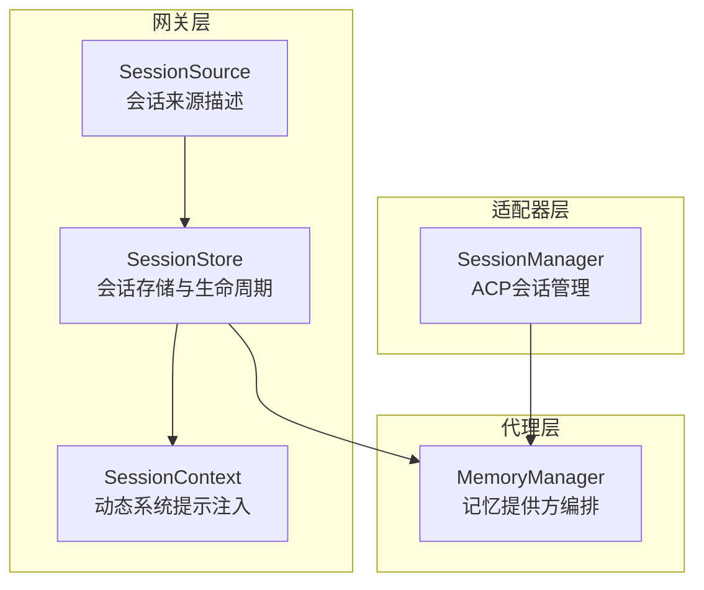
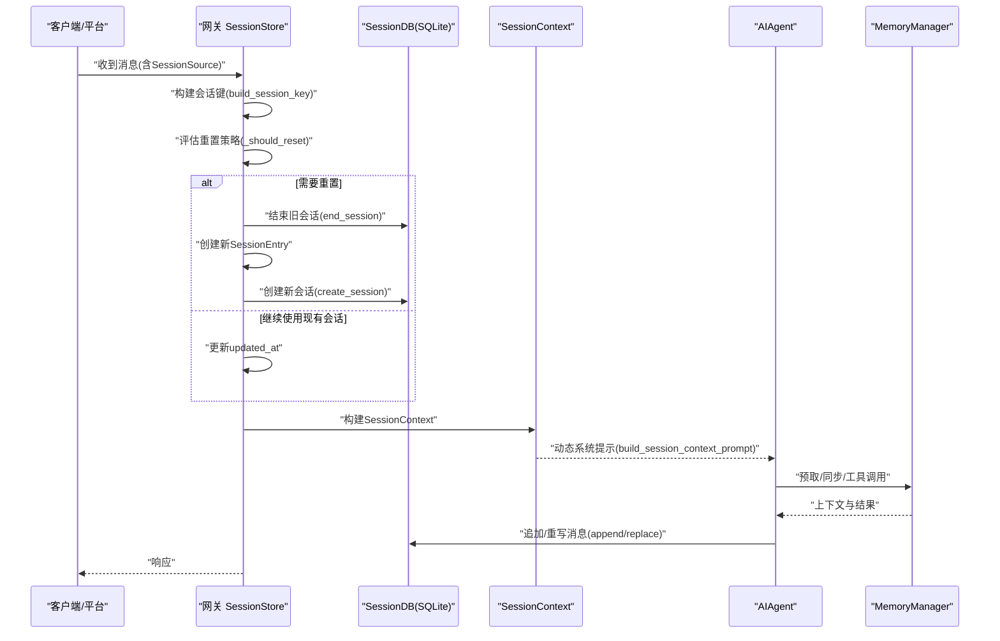
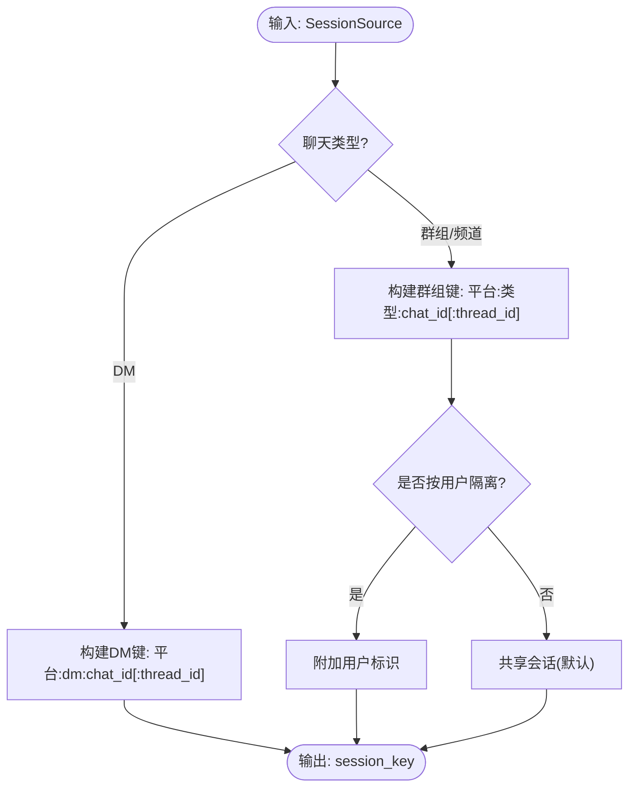
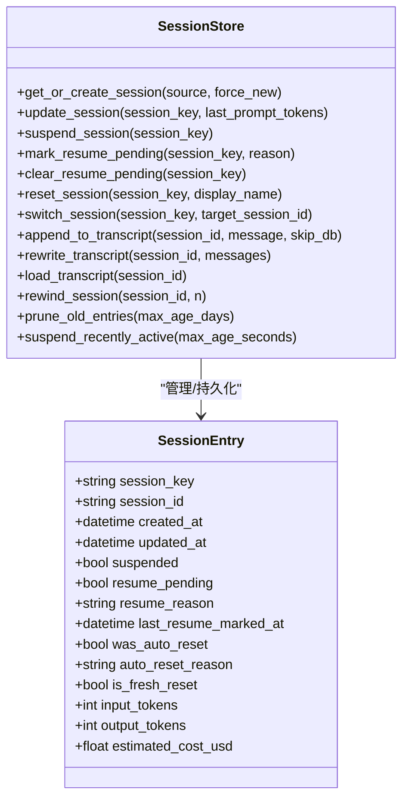
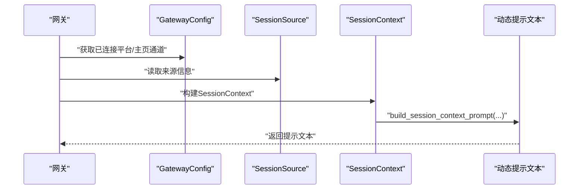
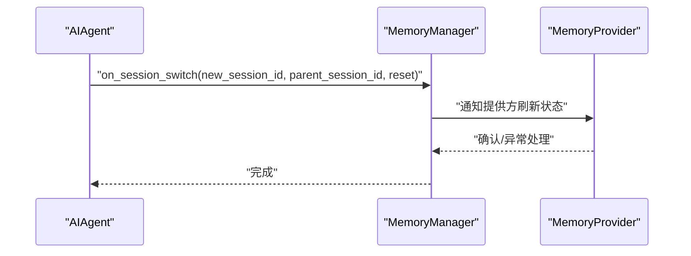
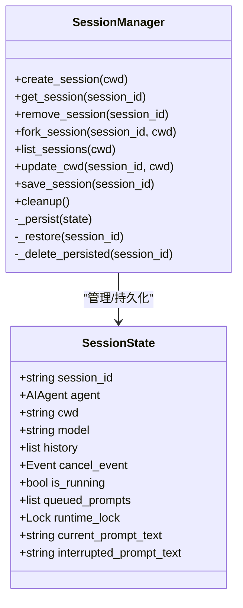
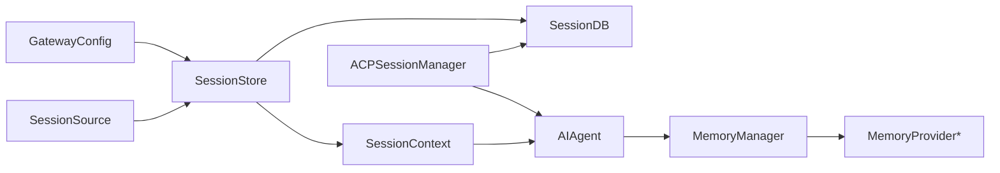

# 会话管理

<cite>
**本文引用的文件**
- [gateway/session.py](file://gateway/session.py)
- [gateway/session_context.py](file://gateway/session_context.py)
- [acp_adapter/session.py](file://acp_adapter/session.py)
- [agent/memory_manager.py](file://agent/memory_manager.py)
- [tests/gateway/test_session_reset_notify.py](file://tests/gateway/test_session_reset_notify.py)
- [tests/gateway/test_session_store_prune.py](file://tests/gateway/test_session_store_prune.py)
- [tests/gateway/test_restart_resume_pending.py](file://tests/gateway/test_restart_resume_pending.py)
- [tests/agent/test_memory_session_switch.py](file://tests/agent/test_memory_session_switch.py)
- [website/docs/developer-guide/tools-runtime.md](file://website/docs/developer-guide/tools-runtime.md)
- [website/i18n/zh-Hans/docusaurus-plugin-content-docs/current/user-guide/sessions.md](file://website/i18n/zh-Hans/docusaurus-plugin-content-docs/current/user-guide/sessions.md)
</cite>

## 目录
1. [简介](#简介)
2. [项目结构](#项目结构)
3. [核心组件](#核心组件)
4. [架构总览](#架构总览)
5. [详细组件分析](#详细组件分析)
6. [依赖关系分析](#依赖关系分析)
7. [性能考量](#性能考量)
8. [故障排查指南](#故障排查指南)
9. [结论](#结论)
10. [附录](#附录)

## 简介
本技术文档围绕 Hermes Agent 的会话管理系统，系统性阐述会话的创建、维护与销毁机制；会话状态管理、上下文持久化与恢复策略；会话边界处理、并发控制与事务管理；会话元数据与历史记录的存储与检索；会话超时处理、自动继续与中断恢复；以及面向开发者的扩展、自定义存储与状态同步最佳实践，并覆盖会话安全、权限控制与审计日志的实现要点。

## 项目结构
会话管理涉及网关层、适配器层与代理层的协同：
- 网关层负责会话键生成、会话存储、重置策略评估、会话生命周期管理与历史记录持久化。
- 适配器层（如 ACP）负责外部编辑器/IDE会话的创建、fork、列表与持久化。
- 代理层通过内存管理器对接多种记忆提供方，实现会话切换时的状态同步与上下文注入。

图示来源
- [gateway/session.py:668-1401](file://gateway/session.py#L668-L1401)
- [gateway/session_context.py:1-195](file://gateway/session_context.py#L1-L195)
- [acp_adapter/session.py:186-624](file://acp_adapter/session.py#L186-L624)
- [agent/memory_manager.py:244-654](file://agent/memory_manager.py#L244-L654)

章节来源
- [gateway/session.py:1-1401](file://gateway/session.py#L1-L1401)
- [gateway/session_context.py:1-195](file://gateway/session_context.py#L1-L195)
- [acp_adapter/session.py:1-624](file://acp_adapter/session.py#L1-L624)
- [agent/memory_manager.py:1-654](file://agent/memory_manager.py#L1-L654)

## 核心组件
- 会话键与来源：通过平台、聊天类型、聊天标识、线程标识、用户标识等构建确定性会话键，确保跨平台、多用户、多线程场景下的会话隔离与共享规则一致。
- 会话存储：基于 SQLite 的会话数据库与 JSON 映射文件双轨存储，兼顾可靠性与兼容性；支持会话元数据、消息历史、重置标记与恢复标记。
- 会话上下文：动态系统提示注入，包含来源平台、聊天主题、用户身份、连接平台与投递通道等，支持隐私脱敏与平台特性说明。
- 记忆提供方：统一编排内置与外部记忆提供方，支持预取、同步、工具路由与会话切换通知，保障上下文一致性与可扩展性。
- ACP 会话：面向外部编辑器的会话创建、fork、列表与持久化，确保跨进程重启后的历史恢复。

章节来源
- [gateway/session.py:600-666](file://gateway/session.py#L600-L666)
- [gateway/session.py:668-1401](file://gateway/session.py#L668-L1401)
- [gateway/session_context.py:1-195](file://gateway/session_context.py#L1-L195)
- [agent/memory_manager.py:244-654](file://agent/memory_manager.py#L244-L654)
- [acp_adapter/session.py:186-624](file://acp_adapter/session.py#L186-L624)

## 架构总览
下图展示从消息到达至会话创建、上下文注入、历史持久化与恢复的整体流程。

图示来源
- [gateway/session.py:856-955](file://gateway/session.py#L856-L955)
- [gateway/session.py:1365-1400](file://gateway/session.py#L1365-L1400)
- [agent/memory_manager.py:339-460](file://agent/memory_manager.py#L339-L460)

## 详细组件分析

### 会话键与来源（SessionKey & SessionSource）
- 会话键规则：
  - 私聊（DM）：优先使用聊天标识，其次线程标识，最后回退到平台+类型维度。
  - 群组/频道：包含父级聊天标识与线程标识；默认共享会话，可通过配置开启按用户隔离。
  - WhatsApp 特例：对标识进行规范化，避免同一成员因桥接导致的会话分裂。
- 来源描述（SessionSource）：承载平台、聊天名称/ID、线程ID、用户名称/ID、话题、群组ID等，用于路由、动态提示与投递。

图示来源
- [gateway/session.py:600-666](file://gateway/session.py#L600-L666)

章节来源
- [gateway/session.py:70-156](file://gateway/session.py#L70-L156)
- [gateway/session.py:600-666](file://gateway/session.py#L600-L666)

### 会话存储与生命周期（SessionStore）
- 初始化与加载：
  - 优先使用 SQLite（SessionDB）存储会话元数据与消息；若不可用则回退到 sessions.json 映射文件。
  - 启动时加载 sessions.json 到内存字典，带锁保护，避免并发冲突。
- 创建与获取：
  - 根据会话键查找；若存在且未过期则更新时间戳并返回；否则根据策略决定是否重置。
  - 重置时先结束旧会话，再创建新会话条目并写入数据库。
- 更新与查询：
  - 轻量元数据更新（如 last_prompt_tokens）仅更新内存与磁盘映射。
  - 支持按活动分钟数筛选列出会话。
- 历史记录：
  - 追加消息（append_message）、重写整段（replace_messages）、回溯软删除（rewind_to_message）均以 SQLite 为权威存储。
  - 加载历史时优先从数据库读取，移除了旧版 JSONL 回退逻辑。
- 重置策略与恢复：
  - 支持空闲（idle）、每日（daily）、两者皆有（both）、禁用（none）四种模式。
  - 提供挂起（suspended）与待恢复（resume_pending）两种边界态，分别用于强制清空与自动续回。
  - 恢复待定标记会在成功回合后清除，防止重复恢复。

图示来源
- [gateway/session.py:424-577](file://gateway/session.py#L424-L577)
- [gateway/session.py:856-1401](file://gateway/session.py#L856-L1401)

章节来源
- [gateway/session.py:668-1401](file://gateway/session.py#L668-L1401)
- [tests/gateway/test_session_reset_notify.py:42-115](file://tests/gateway/test_session_reset_notify.py#L42-L115)
- [tests/gateway/test_restart_resume_pending.py:327-351](file://tests/gateway/test_restart_resume_pending.py#L327-L351)
- [tests/gateway/test_session_store_prune.py:161-259](file://tests/gateway/test_session_store_prune.py#L161-L259)

### 动态系统提示与上下文注入（SessionContext）
- 构建动态提示：
  - 包含来源平台、聊天主题、用户/用户ID、连接平台、投递通道等。
  - 支持隐私脱敏（PII 安全平台）与平台特性说明（如 Discord 工具可用性、Slack API 限制等）。
- 多用户会话标注：
  - 当会话被标记为共享多用户时，在系统提示中标注“多用户会话”，避免固定用户名导致缓存失效。
- 上下文变量：
  - 使用 contextvars 替代进程全局环境变量，保证异步并发场景下的任务局部性，避免交叉污染。

图示来源
- [gateway/session.py:1365-1400](file://gateway/session.py#L1365-L1400)
- [gateway/session_context.py:1-195](file://gateway/session_context.py#L1-L195)

章节来源
- [gateway/session.py:231-422](file://gateway/session.py#L231-L422)
- [gateway/session_context.py:1-195](file://gateway/session_context.py#L1-L195)

### 记忆提供方与会话切换（MemoryManager）
- 注册与路由：
  - 仅允许一个外部非内置提供方注册，避免工具 schema 膨胀与后端冲突。
  - 基于工具名到提供方的映射进行路由，冲突时发出警告。
- 生命周期钩子：
  - 预取/同步、工具调用、转交子代理、关闭等阶段均提供回调，确保上下文一致性。
- 会话切换：
  - on_session_switch 接收新的 session_id、父会话 ID、是否重置等参数，通知各提供方刷新其内部会话状态。
  - 测试覆盖了切换时缓冲区清空、空 ID 忽略、保留父会话 ID 等边界行为。

图示来源
- [agent/memory_manager.py:488-535](file://agent/memory_manager.py#L488-L535)
- [tests/agent/test_memory_session_switch.py:273-327](file://tests/agent/test_memory_session_switch.py#L273-L327)

章节来源
- [agent/memory_manager.py:244-654](file://agent/memory_manager.py#L244-L654)
- [tests/agent/test_memory_session_switch.py:273-327](file://tests/agent/test_memory_session_switch.py#L273-L327)

### ACP 会话管理（ACPSessionManager）
- 创建与 fork：
  - 创建新会话并持久化；fork 深拷贝历史到新会话。
- 列表与标题：
  - 合并内存与数据库中的会话，按更新时间排序；标题优先取用户输入，其次工作目录叶名。
- 持久化与恢复：
  - 使用 SessionDB 存储会话元数据与消息；恢复时重建 AIAgent 并注入 cwd、模型与运行时参数。
- 工作目录翻译：
  - 在 WSL 环境下将 Windows 路径转换为 WSL 挂载路径，确保工具执行一致性。

图示来源
- [acp_adapter/session.py:169-184](file://acp_adapter/session.py#L169-L184)
- [acp_adapter/session.py:186-624](file://acp_adapter/session.py#L186-L624)

章节来源
- [acp_adapter/session.py:186-624](file://acp_adapter/session.py#L186-L624)

### 会话超时、自动继续与中断恢复
- 超时策略：
  - idle：超过 N 分钟无活动触发重置。
  - daily：每天固定时刻重置。
  - both：二者先到为准。
  - none：永不自动重置。
- 恢复标记：
  - resume_pending：在网关意外退出后，标记最近活跃会话以便下次消息到达时自动续回。
  - suspended：由 /stop 触发的强制清空，优先级高于 resume_pending。
- 测试验证：
  - 自动重置标志与原因在序列化/反序列化后仍可存活。
  - 恢复待定行为与挂起行为的正确性得到测试覆盖。

章节来源
- [gateway/session.py:752-832](file://gateway/session.py#L752-L832)
- [tests/gateway/test_session_reset_notify.py:161-242](file://tests/gateway/test_session_reset_notify.py#L161-L242)
- [tests/gateway/test_restart_resume_pending.py:327-351](file://tests/gateway/test_restart_resume_pending.py#L327-L351)

### 并发控制与事务管理
- 并发控制：
  - 会话存储使用线程锁保护内存字典与磁盘映射文件的读写，避免竞态。
  - SQLite 操作在持有锁之外执行，减少锁持有时间。
- 事务与原子性：
  - 追加消息与重写消息均通过数据库接口进行，确保失败回滚与一致性。
  - 会话切换与重置时，先结束旧会话再创建新会话，保证状态迁移原子性。

章节来源
- [gateway/session.py:682-743](file://gateway/session.py#L682-L743)
- [gateway/session.py:1251-1295](file://gateway/session.py#L1251-L1295)

### 元数据管理、历史记录存储与检索
- 元数据字段：
  - 会话键、会话 ID、创建/更新时间、显示名、平台类型、令牌统计、成本估算、重置标记、恢复标记等。
- 历史记录：
  - SQLite 为权威存储，支持锚定视图、窗口与书边（bookend）检索，便于大历史快速定位。
  - 支持回溯软删除（rewind），保留审计痕迹。
- 存储位置与模式：
  - SQLite 使用 WAL 模式，支持并发读取与单写入，适合多平台网关。

章节来源
- [gateway/session.py:424-577](file://gateway/session.py#L424-L577)
- [gateway/session.py:1297-1362](file://gateway/session.py#L1297-L1362)
- [website/i18n/zh-Hans/docusaurus-plugin-content-docs/current/user-guide/sessions.md:464-472](file://website/i18n/zh-Hans/docusaurus-plugin-content-docs/current/user-guide/sessions.md#L464-L472)

### 会话边界处理与安全
- 边界处理：
  - 活跃后台进程的会话不会被自动重置，避免打断长任务。
  - 恢复待定与挂起标记的优先级与清理时机明确，防止循环卡死。
- 安全与隐私：
  - 动态提示中对 PII 安全平台进行脱敏，避免在提示中泄露用户/聊天 ID。
  - 审计日志对敏感字段进行红化处理，保障登录与认证事件的安全记录。

章节来源
- [gateway/session.py:752-832](file://gateway/session.py#L752-L832)
- [gateway/session.py:231-422](file://gateway/session.py#L231-L422)
- [website/i18n/zh-Hans/docusaurus-plugin-content-docs/current/user-guide/sessions.md:451-472](file://website/i18n/zh-Hans/docusaurus-plugin-content-docs/current/user-guide/sessions.md#L451-L472)

## 依赖关系分析
- 组件耦合：
  - SessionStore 依赖 GatewayConfig 与 SessionDB；对外暴露轻量元数据与历史操作接口。
  - SessionContext 依赖 SessionSource 与 GatewayConfig，向 Agent 注入动态提示。
  - MemoryManager 编排多个记忆提供方，与 SessionStore 的会话切换钩子协作。
  - ACP SessionManager 依赖 SessionDB 与 AIAgent，负责外部编辑器会话的创建与恢复。
- 外部依赖：
  - hermes_state.SessionDB 提供会话数据库能力。
  - 工具运行时与并发模型参考开发者指南。

图示来源
- [gateway/session.py:676-692](file://gateway/session.py#L676-L692)
- [gateway/session_context.py:1-195](file://gateway/session_context.py#L1-L195)
- [agent/memory_manager.py:244-654](file://agent/memory_manager.py#L244-L654)
- [acp_adapter/session.py:401-422](file://acp_adapter/session.py#L401-L422)

章节来源
- [gateway/session.py:676-692](file://gateway/session.py#L676-L692)
- [agent/memory_manager.py:244-654](file://agent/memory_manager.py#L244-L654)
- [acp_adapter/session.py:401-422](file://acp_adapter/session.py#L401-L422)

## 性能考量
- I/O 优化：
  - SQLite 使用 WAL 模式，提升并发读取性能；会话存储与历史写入尽量在锁外完成。
- 内存与磁盘平衡：
  - sessions.json 仅保存键到 ID 的映射；历史权威存储在 SQLite，降低内存占用。
- 并发与阻塞：
  - 通过 contextvars 避免全局变量竞争；会话存储使用锁保护关键路径，减少锁持有时间。
- 工具并发：
  - 工具调用可能串行或并行，取决于工具组合与交互需求，建议在工具层做好资源隔离与限流。

章节来源
- [website/i18n/zh-Hans/docusaurus-plugin-content-docs/current/user-guide/sessions.md:464-472](file://website/i18n/zh-Hans/docusaurus-plugin-content-docs/current/user-guide/sessions.md#L464-L472)
- [website/docs/developer-guide/tools-runtime.md:224-234](file://website/docs/developer-guide/tools-runtime.md#L224-L234)

## 故障排查指南
- 会话未恢复或重复重置：
  - 检查 resume_pending 与 suspended 标记是否正确设置与清理。
  - 确认重置策略与最近活动时间是否符合预期。
- 历史丢失或不一致：
  - 确认 SQLite 是否可用；优先从数据库读取历史。
  - 使用重写/回溯接口时检查目标消息 ID 与范围。
- 并发问题：
  - 确保使用 contextvars 设置/清理会话变量，避免 CLI/Cron 环境回退到旧方式。
- ACP 会话异常：
  - 检查工作目录路径翻译与 SessionDB 可用性；确认 fork/restore 流程中的元数据完整性。

章节来源
- [gateway/session.py:888-955](file://gateway/session.py#L888-L955)
- [gateway/session.py:1251-1310](file://gateway/session.py#L1251-L1310)
- [gateway/session_context.py:171-195](file://gateway/session_context.py#L171-L195)
- [acp_adapter/session.py:423-543](file://acp_adapter/session.py#L423-L543)

## 结论
Hermes Agent 的会话管理系统通过确定性的会话键规则、可靠的 SQLite 存储、动态系统提示注入与严格的并发控制，实现了跨平台、多用户、多线程场景下的稳定会话管理。结合记忆提供方编排与 ACP 会话持久化，系统在安全性、可扩展性与用户体验之间取得良好平衡。建议在扩展与集成时遵循本文提供的最佳实践，确保状态一致性与性能表现。

## 附录
- 最佳实践清单
  - 使用 build_session_key 生成会话键，避免硬编码来源标识。
  - 在工具层对会话变量使用 set_session_vars/clear_session_vars，确保并发安全。
  - 通过 MemoryManager 的 on_session_switch 通知提供方刷新状态，避免上下文污染。
  - 在 ACP 场景下，确保工作目录路径翻译与 SessionDB 可用性。
  - 对敏感字段进行审计日志红化处理，遵守最小披露原则。