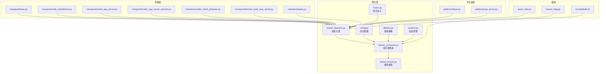
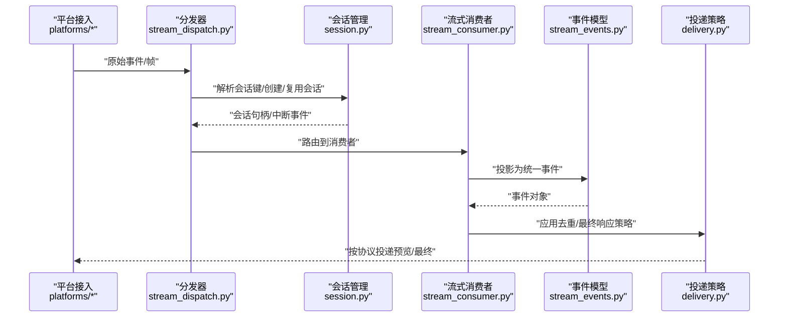
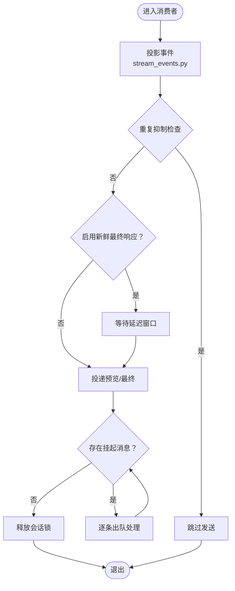
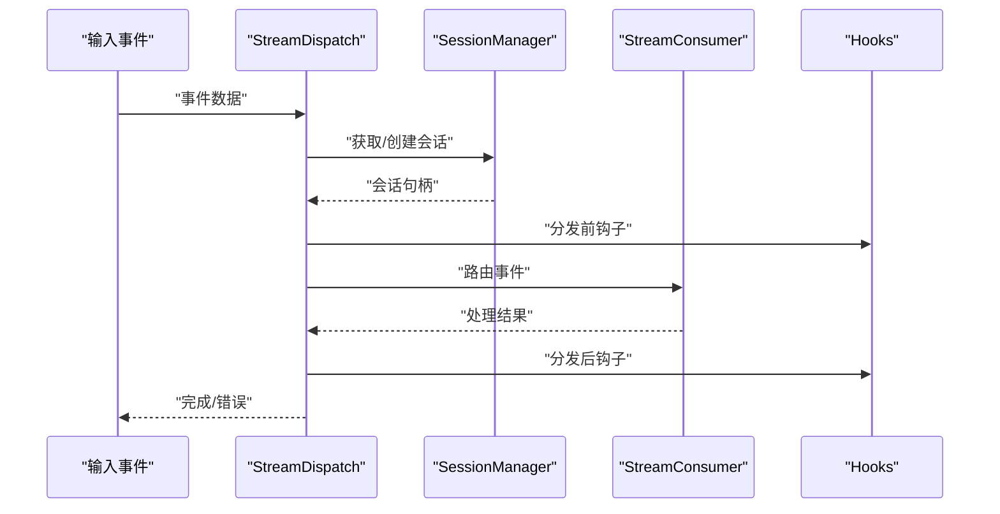
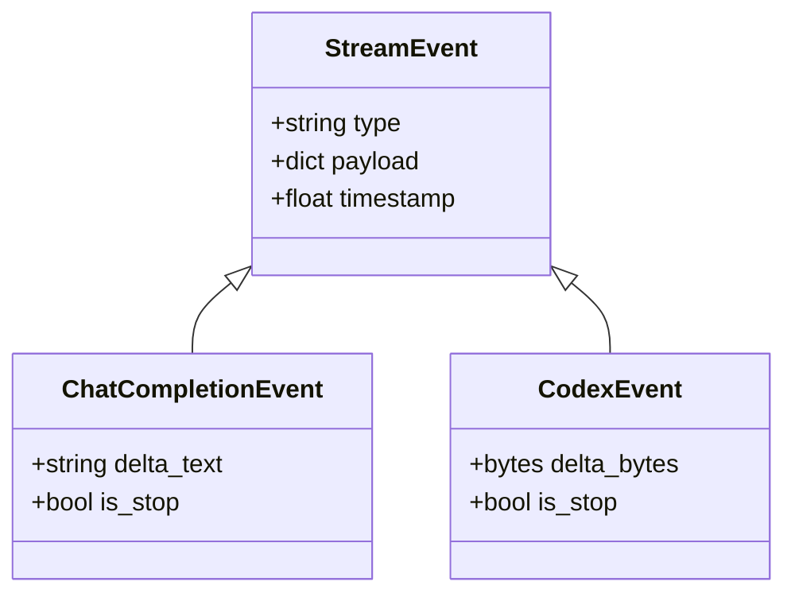
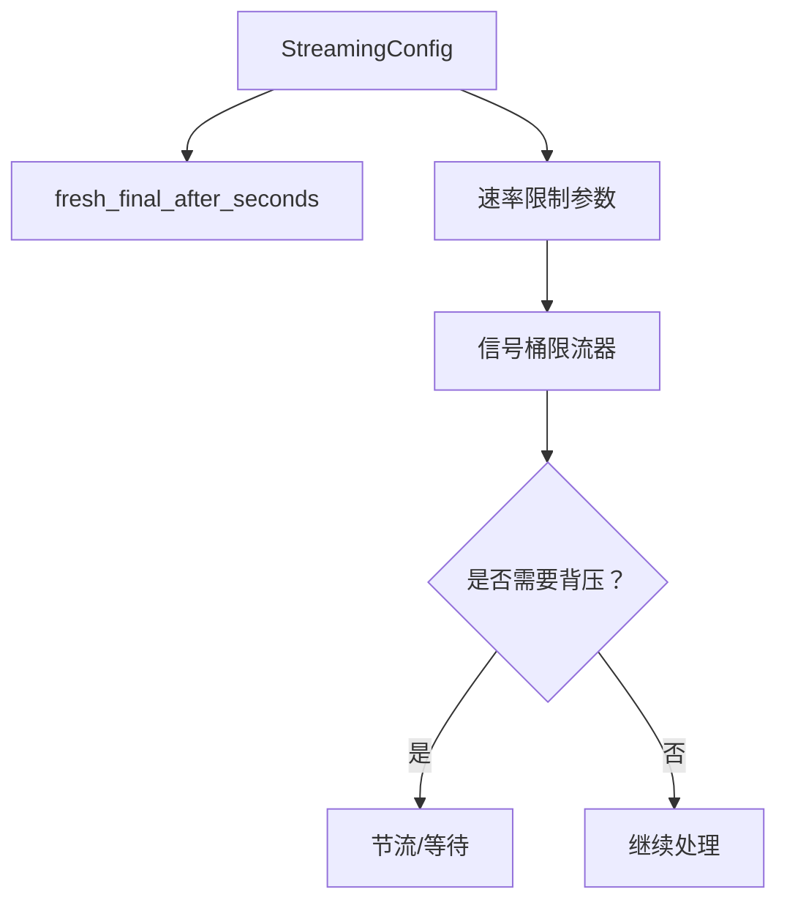
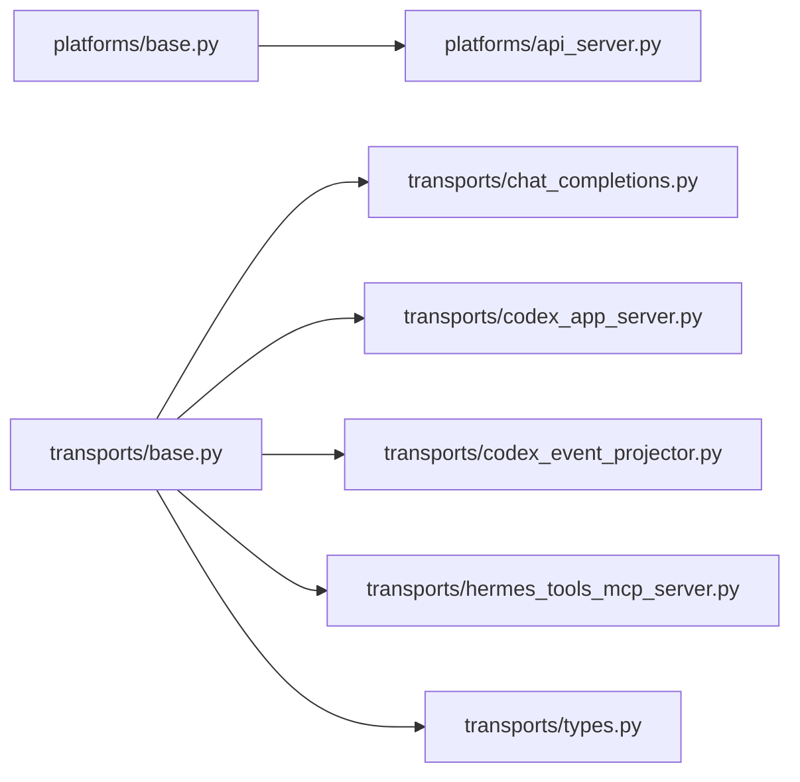
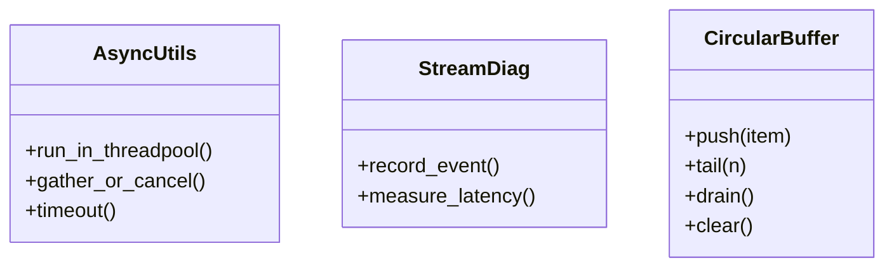
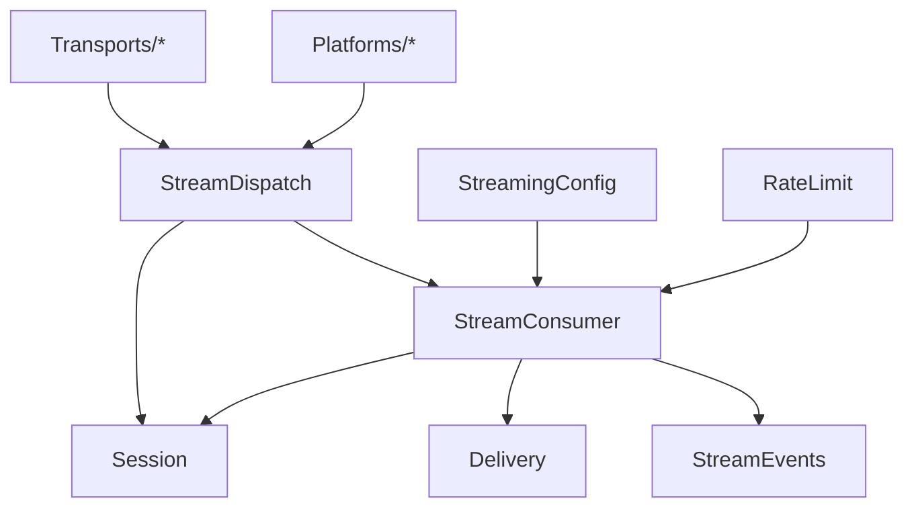

# 流式处理

<cite>
**本文引用的文件**
- [stream_consumer.py](file://gateway/stream_consumer.py)
- [stream_dispatch.py](file://gateway/stream_dispatch.py)
- [stream_events.py](file://gateway/stream_events.py)
- [config.py](file://gateway/config.py)
- [delivery.py](file://gateway/delivery.py)
- [session.py](file://gateway/session.py)
- [hooks.py](file://gateway/hooks.py)
- [platforms/base.py](file://gateway/platforms/base.py)
- [platforms/api_server.py](file://gateway/platforms/api_server.py)
- [transports/base.py](file://agent/transports/base.py)
- [transports/chat_completions.py](file://agent/transports/chat_completions.py)
- [transports/codex_app_server.py](file://agent/transports/codex_app_server.py)
- [transports/codex_app_server_session.py](file://agent/transports/codex_app_server_session.py)
- [transports/codex_event_projector.py](file://agent/transports/codex_event_projector.py)
- [transports/hermes_tools_mcp_server.py](file://agent/transports/hermes_tools_mcp_server.py)
- [transports/types.py](file://agent/transports/types.py)
- [async_utils.py](file://agent/async_utils.py)
- [stream_diag.py](file://agent/stream_diag.py)
- [hooks.md](file://website/i18n/zh-Hans/docusaurus-plugin-content-docs/current/user-guide/features/hooks.md)
- [test_stream_consumer_fresh_final.py](file://tests/gateway/test_stream_consumer_fresh_final.py)
- [test_duplicate_reply_suppression.py](file://tests/gateway/test_duplicate_reply_suppression.py)
- [test_pending_drain_no_recursion.py](file://tests/gateway/test_pending_drain_no_recursion.py)
- [test_signal_rate_limit.py](file://tests/gateway/test_signal_rate_limit.py)
- [test_iteration_budget_race.py](file://tests/run_agent/test_iteration_budget_race.py)
- [circularBuffer.ts](file://ui-tui/src/lib/circularBuffer.ts)
</cite>

## 目录
1. [引言](#引言)
2. [项目结构](#项目结构)
3. [核心组件](#核心组件)
4. [架构总览](#架构总览)
5. [详细组件分析](#详细组件分析)
6. [依赖关系分析](#依赖关系分析)
7. [性能考量](#性能考量)
8. [故障排除指南](#故障排除指南)
9. [结论](#结论)
10. [附录](#附录)

## 引言
本技术文档面向Hermes Agent的流式处理系统，聚焦于流式消息的接收、分发与消费机制，覆盖事件处理管道、缓冲管理与背压控制，协议支持与格式转换、错误恢复策略，以及性能优化、并发控制与资源管理。同时提供流式钩子系统、中间件机制与自定义处理器的开发指南，并给出调试技巧、监控方法与安全注意事项。

## 项目结构
Hermes的流式处理主要分布在以下模块：
- 网关层：负责平台接入、消息分发、会话管理与流式消费者配置
- 传输层：封装不同模型服务的流式接口，统一事件投影与会话管理
- 工具与诊断：提供异步工具、流式诊断与前端环形缓冲等支撑能力
- 测试与文档：验证流式行为、重复回复抑制、背压与竞态条件等

**图表来源**
- [stream_dispatch.py](file://gateway/stream_dispatch.py)
- [stream_consumer.py](file://gateway/stream_consumer.py)
- [stream_events.py](file://gateway/stream_events.py)
- [config.py](file://gateway/config.py)
- [delivery.py](file://gateway/delivery.py)
- [session.py](file://gateway/session.py)
- [hooks.py](file://gateway/hooks.py)
- [transports/base.py](file://agent/transports/base.py)
- [transports/chat_completions.py](file://agent/transports/chat_completions.py)
- [transports/codex_app_server.py](file://agent/transports/codex_app_server.py)
- [transports/codex_app_server_session.py](file://agent/transports/codex_app_server_session.py)
- [transports/codex_event_projector.py](file://agent/transports/codex_event_projector.py)
- [transports/hermes_tools_mcp_server.py](file://agent/transports/hermes_tools_mcp_server.py)
- [transports/types.py](file://agent/transports/types.py)
- [platforms/base.py](file://gateway/platforms/base.py)
- [platforms/api_server.py](file://gateway/platforms/api_server.py)
- [async_utils.py](file://agent/async_utils.py)
- [stream_diag.py](file://agent/stream_diag.py)
- [circularBuffer.ts](file://ui-tui/src/lib/circularBuffer.ts)

**章节来源**
- [stream_dispatch.py](file://gateway/stream_dispatch.py)
- [stream_consumer.py](file://gateway/stream_consumer.py)
- [stream_events.py](file://gateway/stream_events.py)
- [config.py](file://gateway/config.py)
- [delivery.py](file://gateway/delivery.py)
- [session.py](file://gateway/session.py)
- [hooks.py](file://gateway/hooks.py)
- [transports/base.py](file://agent/transports/base.py)
- [transports/chat_completions.py](file://agent/transports/chat_completions.py)
- [transports/codex_app_server.py](file://agent/transports/codex_app_server.py)
- [transports/codex_app_server_session.py](file://agent/transports/codex_app_server_session.py)
- [transports/codex_event_projector.py](file://agent/transports/codex_event_projector.py)
- [transports/hermes_tools_mcp_server.py](file://agent/transports/hermes_tools_mcp_server.py)
- [transports/types.py](file://agent/transports/types.py)
- [platforms/base.py](file://gateway/platforms/base.py)
- [platforms/api_server.py](file://gateway/platforms/api_server.py)
- [async_utils.py](file://agent/async_utils.py)
- [stream_diag.py](file://agent/stream_diag.py)
- [circularBuffer.ts](file://ui-tui/src/lib/circularBuffer.ts)

## 核心组件
- 流式消费者（StreamConsumer）：负责将底层事件流转换为统一的流式消息，应用去重、最终响应延迟合并、背压与会话级状态管理。
- 分发器（StreamDispatch）：根据会话键与路由规则，将消息分发到对应消费者或下游处理器。
- 事件模型（StreamEvents）：定义流式事件的数据结构与序列化契约，确保跨平台一致性。
- 配置（StreamingConfig）：集中管理流式开关、最终响应延迟、速率限制等参数。
- 投递策略（Delivery）：定义消息送达策略，包括预览、最终响应与重复抑制。
- 会话管理（Session）：维护会话生命周期、中断事件与挂起消息队列。
- 平台适配（Platforms）：抽象HTTP/WebSocket等接入协议，实现统一事件投影。
- 传输适配（Transports）：封装不同模型服务的流式接口，提供事件投影与会话桥接。
- 辅助工具（AsyncUtils/StreamDiag）：提供异步工具与流式诊断能力。

**章节来源**
- [stream_consumer.py](file://gateway/stream_consumer.py)
- [stream_dispatch.py](file://gateway/stream_dispatch.py)
- [stream_events.py](file://gateway/stream_events.py)
- [config.py](file://gateway/config.py)
- [delivery.py](file://gateway/delivery.py)
- [session.py](file://gateway/session.py)
- [platforms/base.py](file://gateway/platforms/base.py)
- [transports/base.py](file://agent/transports/base.py)

## 架构总览
下图展示了从平台接入到流式消费的完整链路，包括事件投影、会话管理、消费者处理与投递策略。

**图表来源**
- [platforms/api_server.py](file://gateway/platforms/api_server.py)
- [stream_dispatch.py](file://gateway/stream_dispatch.py)
- [session.py](file://gateway/session.py)
- [stream_consumer.py](file://gateway/stream_consumer.py)
- [stream_events.py](file://gateway/stream_events.py)
- [delivery.py](file://gateway/delivery.py)

## 详细组件分析

### 组件A：流式消费者（StreamConsumer）
职责与特性
- 将底层事件流投影为统一事件模型，支持预览与最终响应的合并策略。
- 应用重复回复抑制，避免同一会话内重复发送已发送的消息。
- 支持“新鲜最终响应”延迟机制，防止过早发送最终响应导致抖动。
- 维护会话级挂起消息队列，保证顺序与一致性。
- 与会话管理器协作，处理中断与取消事件，避免栈递归与会话竞争。

关键流程
- 入口：接收来自分发器的事件，进入会话上下文。
- 去重：基于会话键与已发送标记判断是否跳过。
- 最终响应延迟：当启用“新鲜最终响应”时，延后最终响应发送。
- 背压：通过挂起消息队列与任务调度控制下游压力。
- 结束：释放会话锁，清理状态，触发钩子回调。

**图表来源**
- [stream_consumer.py](file://gateway/stream_consumer.py)
- [stream_events.py](file://gateway/stream_events.py)
- [delivery.py](file://gateway/delivery.py)
- [session.py](file://gateway/session.py)

**章节来源**
- [stream_consumer.py](file://gateway/stream_consumer.py)
- [test_stream_consumer_fresh_final.py](file://tests/gateway/test_stream_consumer_fresh_final.py)
- [test_duplicate_reply_suppression.py](file://tests/gateway/test_duplicate_reply_suppression.py)

### 组件B：消息分发器（StreamDispatch）
职责与特性
- 解析平台事件，提取会话键与路由信息。
- 将事件按会话键分发至对应消费者实例，确保同会话事件串行处理。
- 协调会话生命周期，处理会话切换与中断事件。
- 提供钩子扩展点，允许在分发前后插入自定义逻辑。

**图表来源**
- [stream_dispatch.py](file://gateway/stream_dispatch.py)
- [session.py](file://gateway/session.py)
- [hooks.py](file://gateway/hooks.py)

**章节来源**
- [stream_dispatch.py](file://gateway/stream_dispatch.py)
- [session.py](file://gateway/session.py)
- [hooks.py](file://gateway/hooks.py)

### 组件C：事件模型与格式转换（StreamEvents）
职责与特性
- 定义统一的流式事件结构，屏蔽底层差异。
- 提供事件序列化/反序列化能力，支持多协议输出。
- 与传输层协作，将模型服务的增量输出转换为统一事件。

**图表来源**
- [stream_events.py](file://gateway/stream_events.py)
- [transports/chat_completions.py](file://agent/transports/chat_completions.py)
- [transports/codex_app_server.py](file://agent/transports/codex_app_server.py)

**章节来源**
- [stream_events.py](file://gateway/stream_events.py)
- [transports/chat_completions.py](file://agent/transports/chat_completions.py)
- [transports/codex_app_server.py](file://agent/transports/codex_app_server.py)

### 组件D：配置与背压（StreamingConfig/RateLimit）
职责与特性
- 集中管理流式开关、最终响应延迟、速率限制等参数。
- 与信号桶限流器协作，实现公平的背压控制。
- 通过测试验证限流顺序与实例单例性。

**图表来源**
- [config.py](file://gateway/config.py)
- [test_signal_rate_limit.py](file://tests/gateway/test_signal_rate_limit.py)

**章节来源**
- [config.py](file://gateway/config.py)
- [test_signal_rate_limit.py](file://tests/gateway/test_signal_rate_limit.py)

### 组件E：平台与传输适配
职责与特性
- 平台适配：抽象HTTP/WebSocket等接入协议，实现统一事件投影。
- 传输适配：封装不同模型服务的流式接口，提供事件投影与会话桥接。
- 类型与协议：统一事件类型与会话键约定，确保跨平台一致性。

**图表来源**
- [platforms/base.py](file://gateway/platforms/base.py)
- [platforms/api_server.py](file://gateway/platforms/api_server.py)
- [transports/base.py](file://agent/transports/base.py)
- [transports/chat_completions.py](file://agent/transports/chat_completions.py)
- [transports/codex_app_server.py](file://agent/transports/codex_app_server.py)
- [transports/codex_event_projector.py](file://agent/transports/codex_event_projector.py)
- [transports/hermes_tools_mcp_server.py](file://agent/transports/hermes_tools_mcp_server.py)
- [transports/types.py](file://agent/transports/types.py)

**章节来源**
- [platforms/base.py](file://gateway/platforms/base.py)
- [platforms/api_server.py](file://gateway/platforms/api_server.py)
- [transports/base.py](file://agent/transports/base.py)
- [transports/chat_completions.py](file://agent/transports/chat_completions.py)
- [transports/codex_app_server.py](file://agent/transports/codex_app_server.py)
- [transports/codex_event_projector.py](file://agent/transports/codex_event_projector.py)
- [transports/hermes_tools_mcp_server.py](file://agent/transports/hermes_tools_mcp_server.py)
- [transports/types.py](file://agent/transports/types.py)

### 组件F：辅助与前端缓冲（AsyncUtils/StreamDiag/CircularBuffer）
职责与特性
- 异步工具：提供并发控制、任务调度与资源管理辅助。
- 流式诊断：记录流式事件的关键路径与性能指标。
- 前端环形缓冲：在TUI侧实现固定容量的尾部采样与清空操作，便于调试与展示。

**图表来源**
- [async_utils.py](file://agent/async_utils.py)
- [stream_diag.py](file://agent/stream_diag.py)
- [circularBuffer.ts](file://ui-tui/src/lib/circularBuffer.ts)

**章节来源**
- [async_utils.py](file://agent/async_utils.py)
- [stream_diag.py](file://agent/stream_diag.py)
- [circularBuffer.ts](file://ui-tui/src/lib/circularBuffer.ts)

## 依赖关系分析
- 组件耦合
  - StreamDispatch对Session与StreamConsumer强依赖；对Hooks弱依赖（扩展点）。
  - StreamConsumer对StreamEvents、Delivery与Session紧密耦合。
  - Transports与Platforms分别向上游提供事件投影与接入协议，向下兼容多种模型服务。
- 外部依赖
  - 限流器与信号桶实现背压；测试验证顺序与实例一致性。
  - 并发安全：迭代预算的线程安全测试保障used属性读写一致性。

**图表来源**
- [stream_dispatch.py](file://gateway/stream_dispatch.py)
- [stream_consumer.py](file://gateway/stream_consumer.py)
- [stream_events.py](file://gateway/stream_events.py)
- [delivery.py](file://gateway/delivery.py)
- [session.py](file://gateway/session.py)
- [config.py](file://gateway/config.py)
- [platforms/base.py](file://gateway/platforms/base.py)
- [transports/base.py](file://agent/transports/base.py)

**章节来源**
- [stream_dispatch.py](file://gateway/stream_dispatch.py)
- [stream_consumer.py](file://gateway/stream_consumer.py)
- [session.py](file://gateway/session.py)
- [config.py](file://gateway/config.py)
- [test_signal_rate_limit.py](file://tests/gateway/test_signal_rate_limit.py)
- [test_iteration_budget_race.py](file://tests/run_agent/test_iteration_budget_race.py)

## 性能考量
- 背压与限流
  - 使用信号桶限流器实现公平的速率控制，避免下游拥塞。
  - 通过“新鲜最终响应”延迟减少抖动，提升用户体验。
- 并发与调度
  - 采用独立任务进行挂起消息出队，避免栈递归与会话竞争。
  - 会话级串行化处理，保证事件顺序与一致性。
- 缓冲与内存
  - 挂起消息队列与环形缓冲结合，平衡内存占用与可观测性。
- I/O与协议
  - 平台适配层统一协议投影，降低多协议带来的开销与复杂度。

[本节为通用性能指导，不直接分析具体文件]

## 故障排除指南
- 重复回复问题
  - 现象：同一会话内重复收到最终响应。
  - 排查：确认StreamConsumer的重复抑制逻辑与final_response_sent标志位。
  - 参考测试：[test_duplicate_reply_suppression.py](file://tests/gateway/test_duplicate_reply_suppression.py)
- 新鲜最终响应异常
  - 现象：最终响应过早或过晚。
  - 排查：检查StreamingConfig.fresh_final_after_seconds配置与消费者延迟窗口。
  - 参考测试：[test_stream_consumer_fresh_final.py](file://tests/gateway/test_stream_consumer_fresh_final.py)
- 挂起消息递归与栈深度
  - 现象：链式挂起消息导致栈深度增长。
  - 排查：确认在带内排水块中以新任务形式处理，避免递归。
  - 参考测试：[test_pending_drain_no_recursion.py](file://tests/gateway/test_pending_drain_no_recursion.py)
- 限流顺序与实例一致性
  - 现象：限流顺序错误或实例泄漏。
  - 排查：验证限流器单例与任务完成顺序。
  - 参考测试：[test_signal_rate_limit.py](file://tests/gateway/test_signal_rate_limit.py)
- 并发竞态（迭代预算）
  - 现象：used属性读写竞态导致异常。
  - 排查：确保used访问前持有锁，避免数据竞争。
  - 参考测试：[test_iteration_budget_race.py](file://tests/run_agent/test_iteration_budget_race.py)

**章节来源**
- [test_duplicate_reply_suppression.py](file://tests/gateway/test_duplicate_reply_suppression.py)
- [test_stream_consumer_fresh_final.py](file://tests/gateway/test_stream_consumer_fresh_final.py)
- [test_pending_drain_no_recursion.py](file://tests/gateway/test_pending_drain_no_recursion.py)
- [test_signal_rate_limit.py](file://tests/gateway/test_signal_rate_limit.py)
- [test_iteration_budget_race.py](file://tests/run_agent/test_iteration_budget_race.py)

## 结论
Hermes的流式处理系统通过统一的事件模型、会话级消费者与平台/传输适配层，实现了跨协议的一致性与可扩展性。配合去重、最终响应延迟与限流背压机制，系统在保证用户体验的同时兼顾了稳定性与性能。建议在生产环境中结合钩子与诊断工具持续观测关键指标，并依据业务负载调整配置参数。

[本节为总结性内容，不直接分析具体文件]

## 附录

### 开发者指南：流式钩子与中间件
- 网关事件钩子
  - 位置：~/.hermes/hooks/ 下的 HOOK.yaml + handler.py
  - 事件类型：gateway:startup、session:start、session:end、agent:start、agent:step、agent:end、command:*
  - 行为：非阻塞，错误被捕获并记录
  - 参考文档：[hooks.md](file://website/i18n/zh-Hans/docusaurus-plugin-content-docs/current/user-guide/features/hooks.md)
- 插件钩子
  - 注册方式：插件 register() 中 ctx.register_hook(...)
  - 适用范围：CLI与Gateway会话均生效
  - 常见钩子：pre_tool_call、post_tool_call、pre_llm_call、post_llm_call、on_session_start、on_session_end
- 自定义处理器
  - 建议：遵循非阻塞原则，使用异步处理；对错误进行本地捕获与日志记录

**章节来源**
- [hooks.md](file://website/i18n/zh-Hans/docusaurus-plugin-content-docs/current/user-guide/features/hooks.md)
- [hooks.py](file://gateway/hooks.py)

### 安全考虑
- 输入校验：对平台输入与事件载荷进行严格校验，避免注入与越界。
- 认证与授权：在平台接入层实施认证与权限控制，限制会话访问。
- 速率限制：启用合理的速率限制与配额控制，防止滥用。
- 日志与审计：通过钩子与诊断工具记录关键事件，便于审计与追踪。

[本节为通用安全建议，不直接分析具体文件]

### 性能基准测试建议
- 场景设计：预览吞吐、最终响应延迟、重复抑制命中率、限流下的尾延迟。
- 指标采集：每秒事件数、平均/95分位延迟、内存占用、CPU使用率。
- 压力点：高并发会话、长文本生成、频繁中断与重试。
- 工具：结合StreamDiag与平台限流器统计，定位瓶颈。

[本节为通用测试建议，不直接分析具体文件]