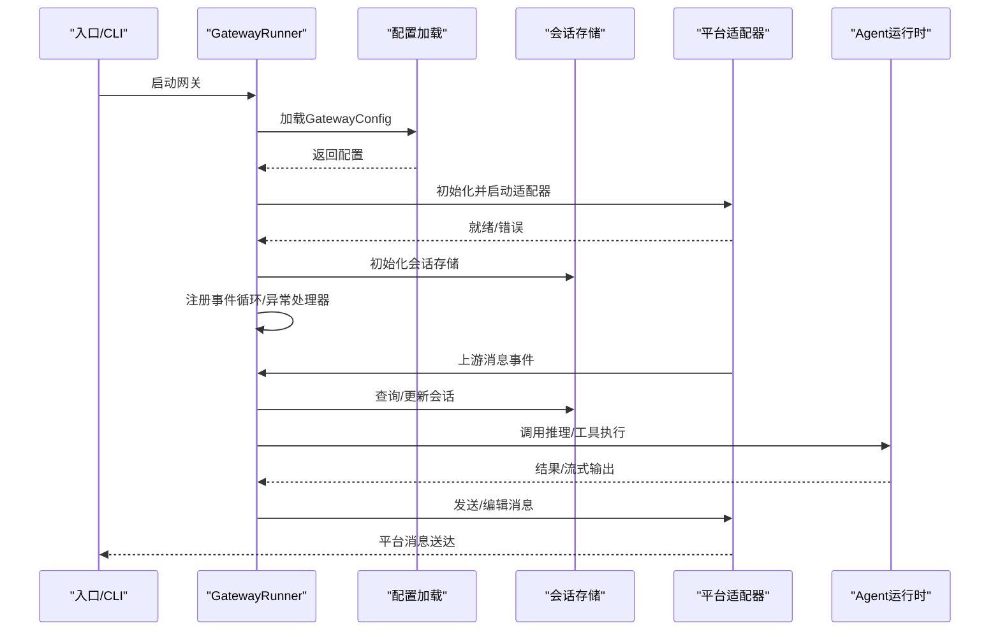
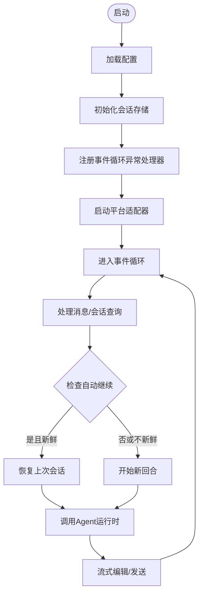
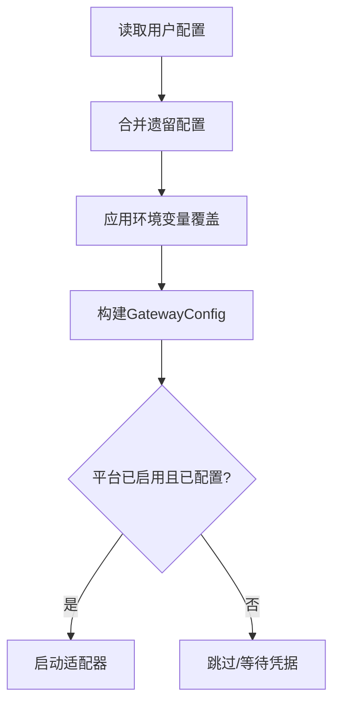
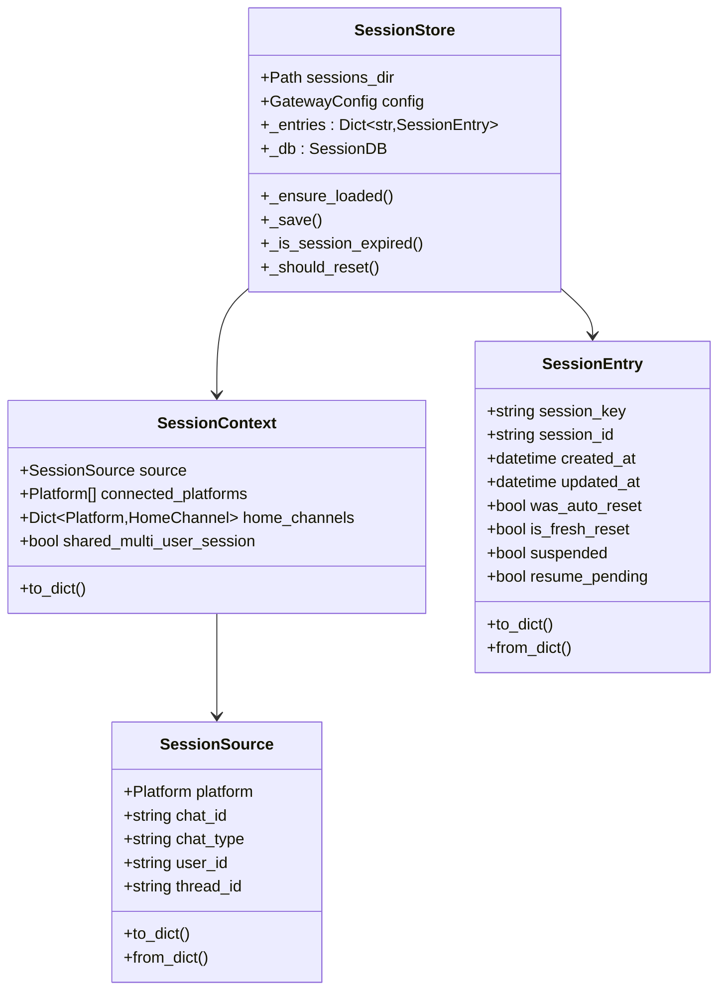
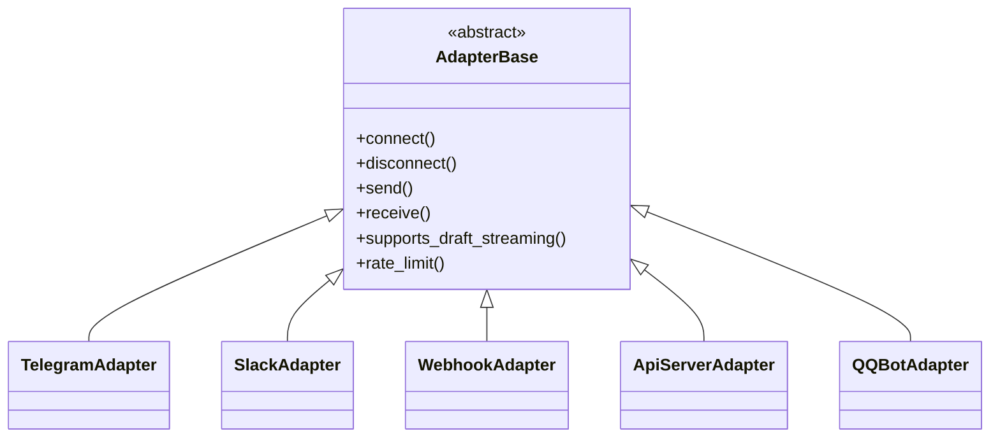
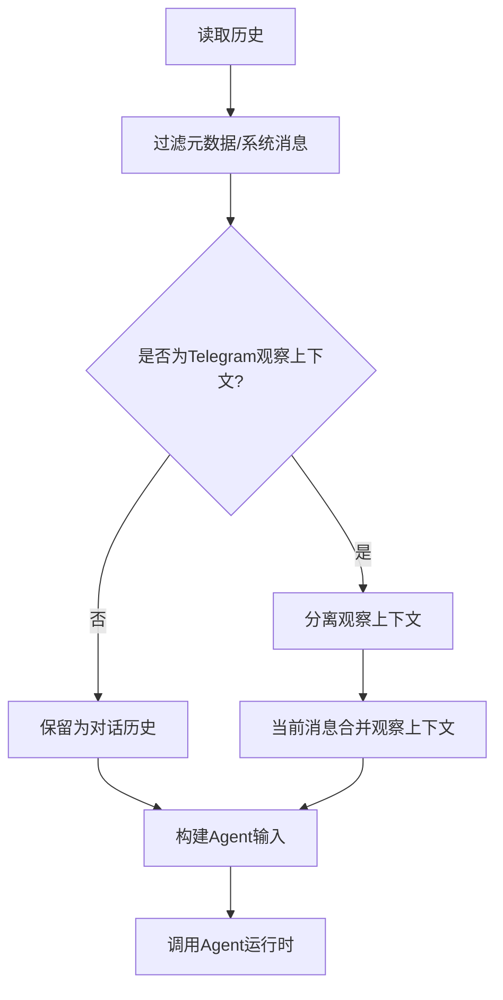
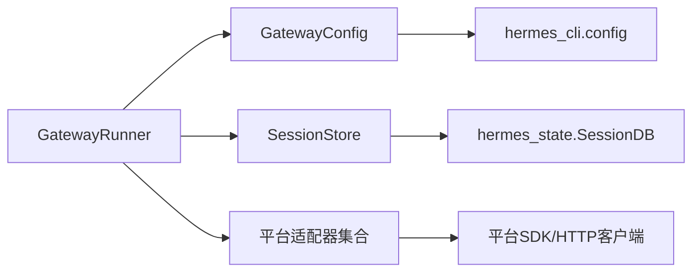

# 网关架构

<cite>
**本文引用的文件**
- [gateway/run.py](file://gateway/run.py)
- [gateway/config.py](file://gateway/config.py)
- [gateway/session.py](file://gateway/session.py)
- [gateway/__init__.py](file://gateway/__init__.py)
- [gateway/platforms/base.py](file://gateway/platforms/base.py)
- [gateway/platforms/api_server.py](file://gateway/platforms/api_server.py)
- [gateway/platforms/webhook.py](file://gateway/platforms/webhook.py)
- [gateway/platforms/slack.py](file://gateway/platforms/slack.py)
- [gateway/platforms/telegram.py](file://gateway/platforms/telegram.py)
- [gateway/platforms/whatsapp.py](file://gateway/platforms/whatsapp.py)
- [gateway/platforms/email.py](file://gateway/platforms/email.py)
- [gateway/platforms/matrix.py](file://gateway/platforms/matrix.py)
- [gateway/platforms/dingtalk.py](file://gateway/platforms/dingtalk.py)
- [gateway/platforms/wecom.py](file://gateway/platforms/wecom.py)
- [gateway/platforms/feishu.py](file://gateway/platforms/feishu.py)
- [gateway/platforms/yuanbao.py](file://gateway/platforms/yuanbao.py)
- [gateway/platforms/msgraph_webhook.py](file://gateway/platforms/msgraph_webhook.py)
- [gateway/platforms/helpers.py](file://gateway/platforms/helpers.py)
- [gateway/platforms/_http_client_limits.py](file://gateway/platforms/_http_client_limits.py)
- [gateway/platforms/qqbot/adapter.py](file://gateway/platforms/qqbot/adapter.py)
- [gateway/platforms/qqbot/utils.py](file://gateway/platforms/qqbot/utils.py)
- [gateway/platforms/qqbot/constants.py](file://gateway/platforms/qqbot/constants.py)
- [gateway/platforms/qqbot/crypto.py](file://gateway/platforms/qqbot/crypto.py)
- [gateway/platforms/qqbot/chunked_upload.py](file://gateway/platforms/qqbot/chunked_upload.py)
- [gateway/platforms/qqbot/onboard.py](file://gateway/platforms/qqbot/onboard.py)
- [gateway/platforms/qqbot/keyboards.py](file://gateway/platforms/qqbot/keyboards.py)
- [gateway/platforms/bluebubbles.py](file://gateway/platforms/bluebubbles.py)
- [gateway/platforms/signal.py](file://gateway/platforms/signal.py)
- [gateway/platforms/signal_rate_limit.py](file://gateway/platforms/signal_rate_limit.py)
- [gateway/platforms/telegram_network.py](file://gateway/platforms/telegram_network.py)
- [gateway/platforms/telegram_rate_limit.py](file://gateway/platforms/telegram_rate_limit.py)
- [gateway/platforms/telegram_rate_limit.py](file://gateway/platforms/telegram_rate_limit.py)
- [gateway/platforms/whatsapp_identity.py](file://gateway/platforms/whatsapp_identity.py)
- [gateway/platforms/yuanbao_proto.py](file://gateway/platforms/yuanbao_proto.py)
- [gateway/platforms/yuanbao_media.py](file://gateway/platforms/yuanbao_media.py)
- [gateway/platforms/yuanbao_sticker.py](file://gateway/platforms/yuanbao_sticker.py)
- [gateway/platforms/yuanbao_sticker.py](file://gateway/platforms/yuanbao_sticker.py)
- [gateway/platforms/yuanbao_sticker.py](file://gateway/platforms/yuanbao_sticker.py)
- [gateway/platforms/yuanbao_sticker.py](file://gateway/platforms/yuanbao_sticker.py)
- [gateway/platforms/yuanbao_sticker.py](file://gateway/platforms/yuanbao_sticker.py)
- [gateway/platforms/yuanbao_sticker.py](file://gateway/platforms/yuanbao_sticker.py)
- [gateway/platforms/yuanbao_sticker.py](file://gateway/platforms/yuanbao_sticker.py)
- [gateway/platforms/yuanbao_sticker.py](file://gateway/platforms/yuanbao_sticker.py)
- [gateway/platforms/yuanbao_sticker.py](file://gateway/platforms/yuanbao_sticker.py)
- [gateway/platforms/yuanbao_sticker.py](file://gateway/platforms/yuanbao_sticker.py)
- [gateway/platforms/yuanbao_sticker.py](file://gateway/platforms/yuanbao_sticker.py)
- [gateway/platforms/yuanbao_sticker.py](file://gateway/platforms/yuanbao_sticker.py)
- [gateway/platforms/yuanbao_sticker.py](file://gateway/platforms/yuanbao_sticker.py)
- [gateway/platforms/yuanbao_sticker.py](file://gateway/platforms/yuanbao_sticker.py)
- [gateway/platforms/yuanbao_sticker.py](file://gateway/platforms/yuanbao_sticker.py)
- [gateway/platforms/yuanbao_sticker.py](file://gateway/platforms/yuanbao_sticker.py)
- [gateway/platforms/yuanbao_sticker.py](file://gateway/platforms/yuanbao_sticker.py)
- [gateway/platforms/yuanbao_sticker.py](file://gateway/platforms/yuanbao_sticker.py)
- [gateway/platforms/yuanbao_sticker.py](file://gateway/platforms/yuanbao_sticker.py)
- [gateway/platforms/yuanbao_sticker.py](file://gateway/platforms/yuanbao_sticker.py)
- [gateway/platforms/yuanbao_sticker.py](file://gateway/platforms/yuanbao_sticker.py)
- [gateway/platforms/yuanbao_sticker.py](file://gateway......)
</cite>

## 目录
1. [引言](#引言)
2. [项目结构](#项目结构)
3. [核心组件](#核心组件)
4. [架构总览](#架构总览)
5. [详细组件分析](#详细组件分析)
6. [依赖分析](#依赖分析)
7. [性能考虑](#性能考虑)
8. [故障排查指南](#故障排查指南)
9. [结论](#结论)
10. [附录](#附录)

## 引言
本文件面向系统架构师与高级开发者，系统化阐述 Hermes Agent 网关（Gateway）的架构理念、设计模式与实现细节。重点覆盖：
- 网关整体设计理念：统一多平台消息入口、会话管理、动态上下文注入、投递路由与平台工具集适配。
- GatewayRunner 主类的设计、生命周期管理与异常处理机制。
- 启动流程、配置加载与初始化过程。
- 与 Agent 运行时的集成方式、事件循环与异步处理策略。
- 扩展点、插件机制与自定义适配器开发指南。

## 项目结构
网关模块位于 gateway 目录，采用“按功能域分层 + 平台适配器”的组织方式：
- 配置与会话：config.py、session.py 提供配置模型、会话键生成、会话存储与重置策略。
- 平台适配器：platforms/ 下按平台拆分，包含基础抽象、具体实现与平台特定工具。
- 运行入口：run.py 定义 GatewayRunner、启动流程、异常处理与事件循环策略。
- 导出接口：gateway/__init__.py 暴露对外 API。

```mermaid
graph TB
subgraph "网关核心"
RUN["gateway/run.py<br/>GatewayRunner/启动流程"]
CFG["gateway/config.py<br/>配置模型/加载"]
SES["gateway/session.py<br/>会话/存储/重置策略"]
INIT["gateway/__init__.py<br/>对外导出"]
end
subgraph "平台适配器"
BASE["gateway/platforms/base.py<br/>适配器基类"]
API["gateway/platforms/api_server.py"]
WEB["gateway/platforms/webhook.py"]
SLK["gateway/platforms/slack.py"]
TGL["gateway/platforms/telegram.py"]
WHT["gateway/platforms/whatsapp.py"]
EML["gateway/platforms/email.py"]
MTR["gateway/platforms/matrix.py"]
DTK["gateway/platforms/dingtalk.py"]
WC["gateway/platforms/wecom.py"]
FS["gateway/platforms/feishu.py"]
YB["gateway/platforms/yuanbao.py"]
MSG["gateway/platforms/msgraph_webhook.py"]
QQB["gateway/platforms/qqbot/adapter.py"]
end
RUN --> CFG
RUN --> SES
RUN --> BASE
BASE --> API
BASE --> WEB
BASE --> SLK
BASE --> TGL
BASE --> WHT
BASE --> EML
BASE --> MTR
BASE --> DTK
BASE --> WC
BASE --> FS
BASE --> YB
BASE --> MSG
BASE --> QQB
```

图表来源
- [gateway/run.py](file://gateway/run.py)
- [gateway/config.py](file://gateway/config.py)
- [gateway/session.py](file://gateway/session.py)
- [gateway/platforms/base.py](file://gateway/platforms/base.py)
- [gateway/platforms/api_server.py](file://gateway/platforms/api_server.py)
- [gateway/platforms/webhook.py](file://gateway/platforms/webhook.py)
- [gateway/platforms/slack.py](file://gateway/platforms/slack.py)
- [gateway/platforms/telegram.py](file://gateway/platforms/telegram.py)
- [gateway/platforms/whatsapp.py](file://gateway/platforms/whatsapp.py)
- [gateway/platforms/email.py](file://gateway/platforms/email.py)
- [gateway/platforms/matrix.py](file://gateway/platforms/matrix.py)
- [gateway/platforms/dingtalk.py](file://gateway/platforms/dingtalk.py)
- [gateway/platforms/wecom.py](file://gateway/platforms/wecom.py)
- [gateway/platforms/feishu.py](file://gateway/platforms/feishu.py)
- [gateway/platforms/yuanbao.py](file://gateway/platforms/yuanbao.py)
- [gateway/platforms/msgraph_webhook.py](file://gateway/platforms/msgraph_webhook.py)
- [gateway/platforms/qqbot/adapter.py](file://gateway/platforms/qqbot/adapter.py)

章节来源
- [gateway/__init__.py](file://gateway/__init__.py)
- [gateway/run.py](file://gateway/run.py)
- [gateway/config.py](file://gateway/config.py)
- [gateway/session.py](file://gateway/session.py)

## 核心组件
- 配置体系：GatewayConfig、PlatformConfig、HomeChannel、SessionResetPolicy、StreamingConfig 及其加载逻辑，支持环境变量、用户配置与回退默认值。
- 会话管理：SessionSource、SessionContext、SessionEntry、SessionStore，提供会话键生成、SQLite/JSONL 存储、过期与重置策略、令牌与成本统计。
- 平台适配器：统一的 Adapter 接口与各平台实现，负责连接、消息收发、速率限制与平台特性适配。
- 运行时：GatewayRunner 负责启动、事件循环、异常处理、状态清理与重启策略。

章节来源
- [gateway/config.py](file://gateway/config.py)
- [gateway/session.py](file://gateway/session.py)
- [gateway/platforms/base.py](file://gateway/platforms/base.py)
- [gateway/run.py](file://gateway/run.py)

## 架构总览
网关以“配置驱动 + 适配器模式”为核心，通过 GatewayRunner 统一调度各平台适配器，将外部消息转换为 Agent 的内部对话历史，并在需要时将结果投递给其他平台或本地文件。

图表来源
- [gateway/run.py](file://gateway/run.py)
- [gateway/config.py](file://gateway/config.py)
- [gateway/session.py](file://gateway/session.py)
- [gateway/platforms/base.py](file://gateway/platforms/base.py)

## 详细组件分析

### GatewayRunner 设计与生命周期
- 入口职责：解析启动参数、设置编码与 SSL、加载配置、初始化会话存储、注册事件循环异常处理器、启动各平台适配器。
- 生命周期：
  - 启动阶段：加载配置、准备 SSL、初始化会话存储、注册全局异常处理器。
  - 运行阶段：事件循环、消息处理、会话状态维护、自动继续/恢复、流式编辑策略。
  - 关闭阶段：清理资源、持久化会话、触发平台断开与最终化钩子。
- 异常处理：
  - 事件循环级异常处理器：对瞬时网络错误进行吞没与告警，避免进程崩溃。
  - 平台特定错误映射：将提供商错误归类为认证失败、限流、策略拒绝等，向用户返回友好提示。
  - 秘密信息脱敏：在日志与用户可见回复中进行敏感信息脱敏。
- 自动继续与新鲜度窗口：基于最后消息时间戳判断中断是否可自动恢复，避免陈旧任务复活。

图表来源
- [gateway/run.py](file://gateway/run.py)
- [gateway/session.py](file://gateway/session.py)

章节来源
- [gateway/run.py](file://gateway/run.py)

### 配置加载与初始化
- 多源合并：优先级从高到低为环境变量、用户配置文件、遗留配置、内置默认值；同名键后者覆盖前者。
- 平台连接性检测：内置平台提供专用校验器，插件平台通过注册表回调验证。
- 流式传输默认：针对不同平台选择原生草稿/编辑/关闭策略，兼顾体验与兼容。
- 会话隔离与隐私：支持按用户/线程/群组隔离，以及 PII 脱敏策略。

图表来源
- [gateway/config.py](file://gateway/config.py)

章节来源
- [gateway/config.py](file://gateway/config.py)

### 会话管理与存储
- 会话键生成：基于平台、聊天类型、聊天标识、线程标识与参与者标识，确保 DM、群组、线程与跨用户隔离策略一致。
- 存储后端：优先 SQLite（SessionDB），降级为 JSONL 文件；并发安全通过锁与原子替换保障。
- 重置策略：空闲超时、每日边界、两者皆满足或禁用；支持通知与排除平台。
- 成本与令牌统计：记录输入/输出/缓存命中/写入与估算成本，用于压缩前检查与成本控制。

图表来源
- [gateway/session.py](file://gateway/session.py)

章节来源
- [gateway/session.py](file://gateway/session.py)

### 平台适配器与扩展点
- 基类约定：统一的连接、断开、发送、接收、速率限制与平台特性接口，便于扩展新平台。
- 内置平台：Telegram、Slack、Discord、WhatsApp、Weixin、Email、Matrix、DingTalk、Feishu、WeCom、Yuanbao、Webhook、API Server、Microsoft Graph Webhook、QQBot、Bluebubbles、Signal 等。
- 插件平台：通过注册表发现与校验，支持动态加载与连接性检测。
- 平台特定工具：如 Telegram 的草稿预览、Signal 的速率限制、WeChat 的身份规范化等。

图表来源
- [gateway/platforms/base.py](file://gateway/platforms/base.py)
- [gateway/platforms/telegram.py](file://gateway/platforms/telegram.py)
- [gateway/platforms/slack.py](file://gateway/platforms/slack.py)
- [gateway/platforms/webhook.py](file://gateway/platforms/webhook.py)
- [gateway/platforms/api_server.py](file://gateway/platforms/api_server.py)
- [gateway/platforms/qqbot/adapter.py](file://gateway/platforms/qqbot/adapter.py)

章节来源
- [gateway/platforms/base.py](file://gateway/platforms/base.py)
- [gateway/platforms/telegram.py](file://gateway/platforms/telegram.py)
- [gateway/platforms/slack.py](file://gateway/platforms/slack.py)
- [gateway/platforms/webhook.py](file://gateway/platforms/webhook.py)
- [gateway/platforms/api_server.py](file://gateway/platforms/api_server.py)
- [gateway/platforms/qqbot/adapter.py](file://gateway/platforms/qqbot/adapter.py)

### 与 Agent 运行时的集成
- 历史重建：将存储的历史消息转换为 Agent 的 API 输入，保留思考字段与工具调用序列，保证多轮一致性。
- 观察上下文：在 Telegram 群组“未提及观察模式”下，将旁观消息作为 API 上下文而非普通用户消息，避免误判。
- 自动附加媒体：仅对明确产生可交付媒体的工具结果进行自动附加，避免示例 MEDIA: 被误传。
- 流式编辑：根据平台能力选择原生草稿或编辑策略，优化用户体验与平台限制。

图表来源
- [gateway/run.py](file://gateway/run.py)

章节来源
- [gateway/run.py](file://gateway/run.py)

### 异步处理与事件循环
- 事件循环异常处理：捕获瞬时网络错误，避免崩溃；非瞬时错误交由默认处理器。
- 任务命名与追踪：异常处理器记录任务名称以便诊断。
- 线程与上下文：使用线程锁与上下文复制保障并发安全。
- 超时与断开：平台连接与断开超时可配置，避免阻塞。

章节来源
- [gateway/run.py](file://gateway/run.py)

## 依赖分析
- 组件耦合：
  - GatewayRunner 依赖配置、会话存储与平台适配器；适配器依赖平台特定库与速率限制策略。
  - 会话存储依赖 hermes_state 的 SessionDB；配置依赖 hermes_cli 的配置加载。
- 外部依赖：
  - HTTP 客户端与 SSL 证书检测（NixOS 等非标准系统）。
  - 平台 SDK（Telegram、Discord、Slack 等）。
- 循环依赖风险：适配器与运行器通过接口解耦，避免直接循环引用。

图表来源
- [gateway/run.py](file://gateway/run.py)
- [gateway/config.py](file://gateway/config.py)
- [gateway/session.py](file://gateway/session.py)

章节来源
- [gateway/run.py](file://gateway/run.py)
- [gateway/config.py](file://gateway/config.py)
- [gateway/session.py](file://gateway/session.py)

## 性能考虑
- 代理缓存上限与空闲 TTL：限制每个会话的 AIAgent 缓存大小与空闲淘汰，防止长期运行内存膨胀。
- 会话存储降级：SQLite 不可用时自动回退 JSONL，保障可用性。
- 流式编辑阈值与间隔：针对 Telegram 的草稿/编辑策略进行调优，平衡实时性与平台限制。
- 历史重建白名单：仅保留必要字段，减少重复计算与带宽占用。
- SSL 证书自动检测：避免因系统证书缺失导致的额外握手失败与重试。

章节来源
- [gateway/run.py](file://gateway/run.py)
- [gateway/session.py](file://gateway/session.py)

## 故障排查指南
- 瞬时网络错误：事件循环异常处理器会吞没并记录，通常无需人工干预；若频繁出现，检查网络与平台限流。
- 提供商错误映射：认证失败、策略拒绝、限流等会被转换为用户友好的提示；查看日志定位原始错误。
- 秘密信息泄露防护：在日志与用户可见回复中进行脱敏；若仍出现，请检查正则规则与输入来源。
- 自动继续失效：检查新鲜度窗口与最后消息时间戳；过期会话不会自动恢复。
- 会话存储损坏：JSONL 回退路径可临时恢复；建议修复 SQLite 或迁移数据。

章节来源
- [gateway/run.py](file://gateway/run.py)

## 结论
Hermes Agent 网关通过“配置驱动 + 适配器模式 + 事件循环安全网关”的设计，在多平台消息集成、会话管理与与 Agent 运行时的深度协同方面提供了高可用、可扩展与可观测的基础设施。GatewayRunner 作为中枢，承担了启动、异常处理与生命周期管理的关键职责；配置与会话模块确保了跨平台一致性与可维护性；平台适配器与插件机制为生态扩展提供了清晰的边界与扩展点。

## 附录
- 开发者建议：
  - 新增平台适配器时，遵循 base.py 中的接口约定，实现连接、发送、接收与速率限制方法。
  - 在 config.py 中为新平台补充连接性检查器或通过注册表暴露校验函数。
  - 使用 run.py 中的异常处理与脱敏策略，确保生产环境稳定性与安全性。
  - 对于长生命周期运行场景，关注代理缓存与会话存储的容量与清理策略。