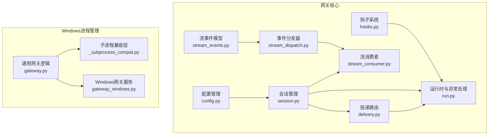
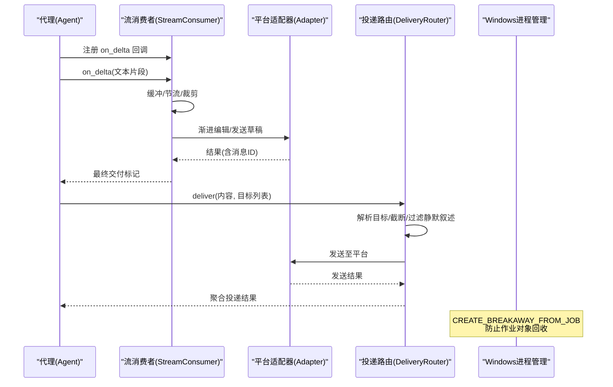
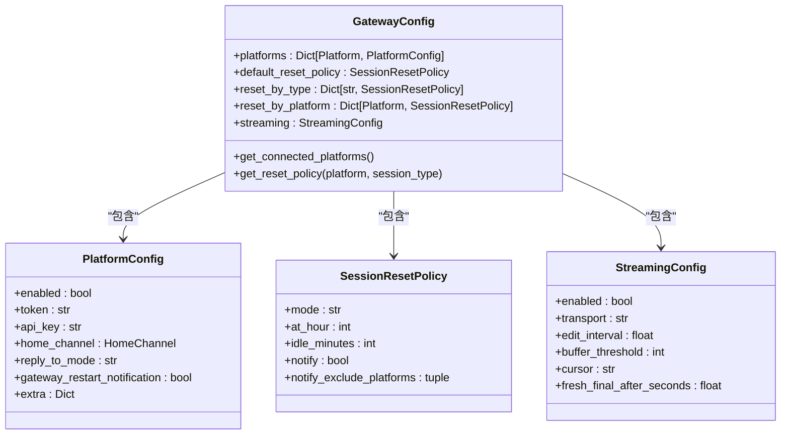
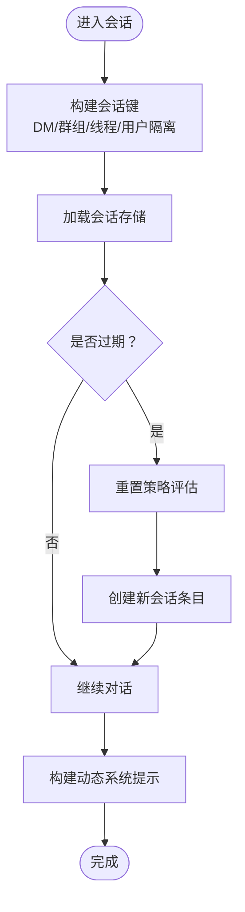
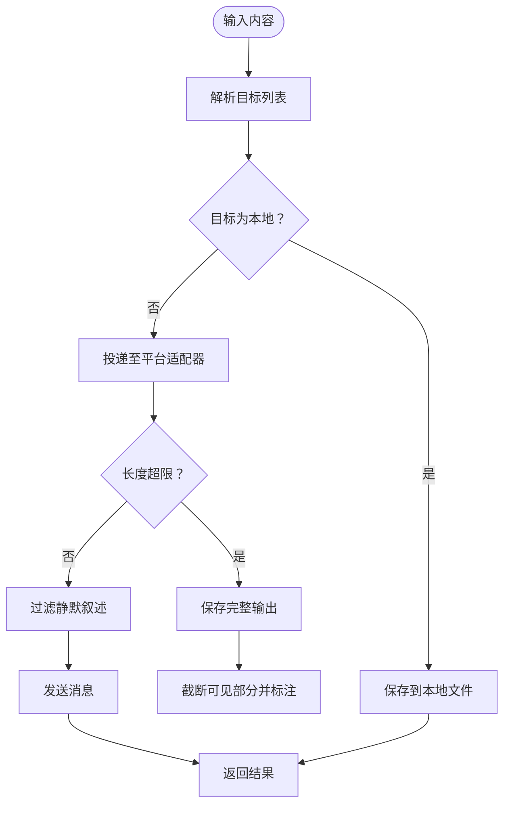
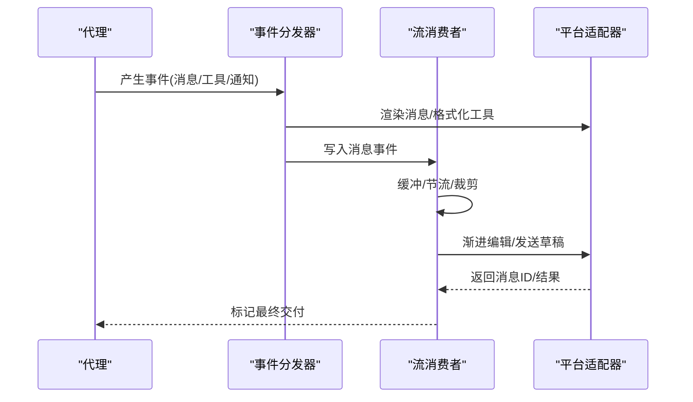
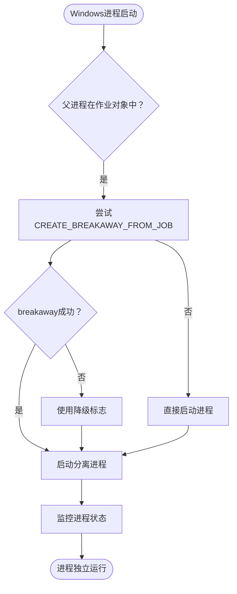
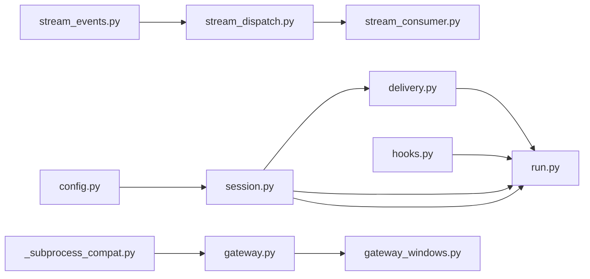

# 网关系统

<cite>
**本文引用的文件**
- [gateway/__init__.py](file://gateway/__init__.py)
- [gateway/config.py](file://gateway/config.py)
- [gateway/session.py](file://gateway/session.py)
- [gateway/run.py](file://gateway/run.py)
- [gateway/delivery.py](file://gateway/delivery.py)
- [gateway/stream_dispatch.py](file://gateway/stream_dispatch.py)
- [gateway/stream_consumer.py](file://gateway/stream_consumer.py)
- [gateway/stream_events.py](file://gateway/stream_events.py)
- [gateway/hooks.py](file://gateway/hooks.py)
- [hermes_cli/_subprocess_compat.py](file://hermes_cli/_subprocess_compat.py)
- [hermes_cli/gateway.py](file://hermes_cli/gateway.py)
- [hermes_cli/gateway_windows.py](file://hermes_cli/gateway_windows.py)
</cite>

## 更新摘要
**所做更改**
- 新增Windows平台进程管理章节，详细说明CREATE_BREAKAWAY_FROM_JOB标志的作用机制
- 更新运行时与错误处理章节，增加Windows作业对象处理策略
- 新增Windows特定的进程分离与守护机制说明
- 完善故障排查指南，添加Windows作业对象相关的诊断要点

## 目录
1. [简介](#简介)
2. [项目结构](#项目结构)
3. [核心组件](#核心组件)
4. [架构总览](#架构总览)
5. [详细组件分析](#详细组件分析)
6. [Windows平台进程管理](#windows平台进程管理)
7. [依赖关系分析](#依赖关系分析)
8. [性能考虑](#性能考虑)
9. [故障排查指南](#故障排查指南)
10. [结论](#结论)
11. [附录](#附录)

## 简介
本技术文档面向系统架构师与运维工程师，全面解析 Hermes Agent 网关系统的架构设计、会话管理、流式处理机制、消息路由与投递、错误处理策略，并提供配置选项、性能调优与监控方法、高可用与故障恢复指南，以及扩展与自定义钩子的最佳实践。

**更新** 本次更新特别增强了Windows平台的进程管理机制说明，重点解释了CREATE_BREAKAWAY_FROM_JOB标志在防止从Electron桌面GUI上下文启动时被回收方面的重要作用。

## 项目结构
网关系统位于 gateway 目录，围绕"配置-会话-路由-流式-钩子"五大维度组织代码，采用模块化与平台适配器模式，支持多平台（Telegram、Discord、WhatsApp、Weixin 等）统一接入与差异化渲染。新增的Windows平台进程管理模块专门处理作业对象隔离和进程守护问题。

**图表来源**
- [gateway/config.py](file://gateway/config.py)
- [gateway/session.py](file://gateway/session.py)
- [gateway/run.py](file://gateway/run.py)
- [gateway/delivery.py](file://gateway/delivery.py)
- [gateway/stream_dispatch.py](file://gateway/stream_dispatch.py)
- [gateway/stream_consumer.py](file://gateway/stream_consumer.py)
- [gateway/stream_events.py](file://gateway/stream_events.py)
- [gateway/hooks.py](file://gateway/hooks.py)
- [hermes_cli/_subprocess_compat.py](file://hermes_cli/_subprocess_compat.py)
- [hermes_cli/gateway.py](file://hermes_cli/gateway.py)
- [hermes_cli/gateway_windows.py](file://hermes_cli/gateway_windows.py)

**章节来源**
- [gateway/__init__.py](file://gateway/__init__.py)
- [gateway/config.py](file://gateway/config.py)
- [gateway/session.py](file://gateway/session.py)
- [gateway/run.py](file://gateway/run.py)
- [gateway/delivery.py](file://gateway/delivery.py)
- [gateway/stream_dispatch.py](file://gateway/stream_dispatch.py)
- [gateway/stream_consumer.py](file://gateway/stream_consumer.py)
- [gateway/stream_events.py](file://gateway/stream_events.py)
- [gateway/hooks.py](file://gateway/hooks.py)
- [hermes_cli/_subprocess_compat.py](file://hermes_cli/_subprocess_compat.py)
- [hermes_cli/gateway.py](file://hermes_cli/gateway.py)
- [hermes_cli/gateway_windows.py](file://hermes_cli/gateway_windows.py)

## 核心组件
- 配置管理：集中管理平台连接、会话重置策略、流式传输参数、静默叙述过滤等。
- 会话管理：构建会话键、持久化存储、重置策略评估、动态系统提示注入。
- 投递路由：解析目标、本地落盘、平台适配器投递、超长输出截断与静默叙述过滤。
- 流式处理：事件模型解耦展示层，同步回调桥接异步消费者，支持原生草稿与渐进编辑。
- 钩子系统：事件驱动扩展点，支持用户自定义脚本在生命周期关键节点执行。
- **Windows进程管理**：专门处理作业对象隔离、进程分离和守护机制，确保网关在各种Windows环境下稳定运行。

**章节来源**
- [gateway/config.py](file://gateway/config.py)
- [gateway/session.py](file://gateway/session.py)
- [gateway/delivery.py](file://gateway/delivery.py)
- [gateway/stream_dispatch.py](file://gateway/stream_dispatch.py)
- [gateway/stream_consumer.py](file://gateway/stream_consumer.py)
- [gateway/stream_events.py](file://gateway/stream_events.py)
- [gateway/hooks.py](file://gateway/hooks.py)
- [hermes_cli/_subprocess_compat.py](file://hermes_cli/_subprocess_compat.py)
- [hermes_cli/gateway.py](file://hermes_cli/gateway.py)
- [hermes_cli/gateway_windows.py](file://hermes_cli/gateway_windows.py)

## 架构总览
网关通过配置加载与平台枚举，建立会话上下文，结合会话键进行状态管理；消息经由投递路由选择目标（本地/平台/回源），流式场景下通过事件模型与消费者实现渐进编辑或原生草稿；运行时对网络瞬态错误进行兜底，确保进程稳定性。**Windows平台新增了作业对象处理机制，通过CREATE_BREAKAWAY_FROM_JOB标志防止进程被回收。**

**图表来源**
- [gateway/stream_consumer.py](file://gateway/stream_consumer.py)
- [gateway/stream_dispatch.py](file://gateway/stream_dispatch.py)
- [gateway/stream_events.py](file://gateway/stream_events.py)
- [gateway/delivery.py](file://gateway/delivery.py)
- [hermes_cli/_subprocess_compat.py](file://hermes_cli/_subprocess_compat.py)

## 详细组件分析

### 配置管理（GatewayConfig/PlatformConfig）
- 平台枚举与动态成员：内置平台 + 插件平台动态注册，统一归一化比较。
- 连接检查器：针对特定平台（如微信、Signal、钉钉等）提供专用连通性校验。
- 会话重置策略：支持按"日界/空闲/两者/不重置"，并可按类型/平台覆盖。
- 流式传输参数：统一默认值与环境变量覆盖，支持自动/原生草稿/编辑/关闭。
- 其他策略：静默叙述过滤、STT 开关、群聊/线程会话隔离、未授权 DM 行为、会话存储最大年龄等。

**图表来源**
- [gateway/config.py](file://gateway/config.py)

**章节来源**
- [gateway/config.py](file://gateway/config.py)

### 会话管理（SessionKey/SessionStore/动态提示）
- 会话键规则：区分 DM/群组/论坛主题/WhatsApp 标识规范化，支持按用户/线程隔离。
- 存储与过期：SQLite 优先（兼容降级到 JSONL），后台过期观察者按策略判定失效。
- 动态系统提示：注入来源平台、频道主题、工具集可用性、投递选项与行为说明。
- PII 处理：在安全平台对用户/聊天 ID 做确定性哈希，保留路由原始值。

**图表来源**
- [gateway/session.py](file://gateway/session.py)

**章节来源**
- [gateway/session.py](file://gateway/session.py)

### 消息路由与投递（DeliveryRouter/DeliveryTarget）
- 目标解析：origin/local/平台名/平台:chat_id:thread_id。
- 本地落盘：按作业 ID/时间戳生成 Markdown 输出，便于审计与回溯。
- 平台投递：长度超限截断并保存全文；静默叙述过滤；Telegram 私聊话题创建与刷新；失败重试与错误语义化。
- 通知与静默：可配置公共/私有通知模式与静默叙述过滤开关。

**图表来源**
- [gateway/delivery.py](file://gateway/delivery.py)

**章节来源**
- [gateway/delivery.py](file://gateway/delivery.py)

### 流式处理机制（事件模型与消费者）
- 事件模型：消息增量、消息结束、临时说明、工具调用开始/结束、长耗时提示、网关通知。
- 分发器：将事件交由适配器渲染，消息事件写入消费者，工具事件格式化后入队进度队列。
- 消费者：缓冲/节流/裁剪，渐进编辑或原生草稿；支持"新鲜最终消息"策略；思考块过滤；溢出拆分；失败退化为后续补发。

**图表来源**
- [gateway/stream_dispatch.py](file://gateway/stream_dispatch.py)
- [gateway/stream_consumer.py](file://gateway/stream_consumer.py)
- [gateway/stream_events.py](file://gateway/stream_events.py)

**章节来源**
- [gateway/stream_dispatch.py](file://gateway/stream_dispatch.py)
- [gateway/stream_consumer.py](file://gateway/stream_consumer.py)
- [gateway/stream_events.py](file://gateway/stream_events.py)

### 运行时与错误处理（异常分类与安全网）
- 瞬态网络错误识别：对 Telegram/TLS/HTTPX 等常见瞬态错误进行捕获与降级，避免崩溃。
- 提示与错误映射：将底层提供商错误映射为简洁用户提示，敏感信息脱敏。
- 自动续投新鲜度：基于最后转录时间判断中断是否仍属"新鲜"，避免陈旧任务复活。
- 代理缓存与会话容量：限制 AIAgent 缓存大小与空闲 TTL，防止长期运行内存膨胀。
- **Windows作业对象处理**：检测并处理作业对象限制，通过CREATE_BREAKAWAY_FROM_JOB标志确保进程独立运行。

**章节来源**
- [gateway/run.py](file://gateway/run.py)
- [hermes_cli/_subprocess_compat.py](file://hermes_cli/_subprocess_compat.py)
- [hermes_cli/gateway.py](file://hermes_cli/gateway.py)

### 钩子系统（事件驱动扩展）
- 发现与加载：扫描 ~/.hermes/hooks 下的目录，要求 HOOK.yaml 与 handler.py。
- 事件类型：启动/会话生命周期/代理循环/命令执行等。
- 执行模型：同步/异步均可，异常不影响主流程；支持收集返回值用于决策型钩子。

**章节来源**
- [gateway/hooks.py](file://gateway/hooks.py)

## Windows平台进程管理

### CREATE_BREAKAWAY_FROM_JOB标志机制
Windows作业对象（Job Object）是操作系统用来管理进程组的机制。某些应用程序（如Electron桌面GUI、Windows Terminal、Tauri启动器）会将子进程放入作业对象中，当父进程退出时，整个作业对象会被操作系统回收，导致子进程也被终止。

**关键特性**：
- **作业对象限制**：Windows Terminal、容器、企业锁定环境可能拒绝CREATE_BREAKAWAY_FROM_JOB标志
- **进程回收保护**：通过CREATE_BREAKAWAY_FROM_JOB标志逃逸父进程的作业对象
- **降级策略**：当作业对象拒绝breakaway时，自动使用降级标志组合

**图表来源**
- [hermes_cli/_subprocess_compat.py](file://hermes_cli/_subprocess_compat.py)
- [hermes_cli/gateway.py](file://hermes_cli/gateway.py)
- [hermes_cli/gateway_windows.py](file://hermes_cli/gateway_windows.py)

### Windows进程分离策略
系统提供了完整的进程分离策略，确保网关在各种Windows环境下都能稳定运行：

**标准分离标志组合**：
- `CREATE_NEW_PROCESS_GROUP` (0x00000200)：子进程获得新的进程组
- `DETACHED_PROCESS` (0x00000008)：子进程没有控制台
- `CREATE_NO_WINDOW` (0x08000000)：抑制控制台窗口闪烁
- `CREATE_BREAKAWAY_FROM_JOB` (0x01000000)：逃逸父进程的作业对象

**降级标志组合**：
当作业对象拒绝breakaway时，使用：
- `CREATE_NEW_PROCESS_GROUP | DETACHED_PROCESS | CREATE_NO_WINDOW`

**章节来源**
- [hermes_cli/_subprocess_compat.py](file://hermes_cli/_subprocess_compat.py)
- [hermes_cli/gateway.py](file://hermes_cli/gateway.py)
- [hermes_cli/gateway_windows.py](file://hermes_cli/gateway_windows.py)

## 依赖关系分析

**图表来源**
- [gateway/config.py](file://gateway/config.py)
- [gateway/session.py](file://gateway/session.py)
- [gateway/run.py](file://gateway/run.py)
- [gateway/delivery.py](file://gateway/delivery.py)
- [gateway/stream_dispatch.py](file://gateway/stream_dispatch.py)
- [gateway/stream_consumer.py](file://gateway/stream_consumer.py)
- [gateway/stream_events.py](file://gateway/stream_events.py)
- [gateway/hooks.py](file://gateway/hooks.py)
- [hermes_cli/_subprocess_compat.py](file://hermes_cli/_subprocess_compat.py)
- [hermes_cli/gateway.py](file://hermes_cli/gateway.py)
- [hermes_cli/gateway_windows.py](file://hermes_cli/gateway_windows.py)

**章节来源**
- [gateway/config.py](file://gateway/config.py)
- [gateway/session.py](file://gateway/session.py)
- [gateway/run.py](file://gateway/run.py)
- [gateway/delivery.py](file://gateway/delivery.py)
- [gateway/stream_dispatch.py](file://gateway/stream_dispatch.py)
- [gateway/stream_consumer.py](file://gateway/stream_consumer.py)
- [gateway/stream_events.py](file://gateway/stream_events.py)
- [gateway/hooks.py](file://gateway/hooks.py)
- [hermes_cli/_subprocess_compat.py](file://hermes_cli/_subprocess_compat.py)
- [hermes_cli/gateway.py](file://hermes_cli/gateway.py)
- [hermes_cli/gateway_windows.py](file://hermes_cli/gateway_windows.py)

## 性能考虑
- 流式传输参数
  - 编辑间隔与缓冲阈值：平衡实时性与平台限速；默认值已针对 Telegram 限流优化。
  - 新鲜最终消息：长响应在预览可见足够长时间后以全新消息交付，使时间戳反映完成时间。
- 会话与缓存
  - 限制 AIAgent 缓存数量与空闲 TTL，避免无界增长。
  - 会话存储最大年龄清理，降低内存与磁盘压力。
- 投递优化
  - 超长输出截断并保存全文，避免平台限制与内存峰值。
  - 静默叙述过滤减少无效循环与令牌浪费。
- 平台适配
  - 原生草稿优先于渐进编辑，减少编辑冲突与重试成本（Telegram DM）。
- **Windows性能优化**
  - 作业对象处理：通过CREATE_BREAKAWAY_FROM_JOB标志避免进程回收开销
  - 分离标志优化：减少不必要的标志组合，提高进程启动效率

**章节来源**
- [gateway/config.py](file://gateway/config.py)
- [gateway/stream_consumer.py](file://gateway/stream_consumer.py)
- [gateway/delivery.py](file://gateway/delivery.py)
- [gateway/run.py](file://gateway/run.py)
- [hermes_cli/_subprocess_compat.py](file://hermes_cli/_subprocess_compat.py)

## 故障排查指南
- 瞬态网络错误
  - 现象：Telegram/TLS/HTTPX 等错误导致进程崩溃。
  - 处理：运行时安全网已捕获并记录，无需重启；关注日志中"吞掉瞬态网络错误"类告警。
- 提供商错误与速率限制
  - 现象：认证失败/策略拒绝/429 限流。
  - 处理：将底层错误映射为简洁用户提示；检查凭据与配额；等待冷却后重试。
- 会话与投递异常
  - 现象：Telegram 私聊话题不存在/线程丢失。
  - 处理：自动创建/刷新话题并重试；若仍失败，检查适配器能力与权限。
- 流式交付卡顿
  - 现象：编辑频繁失败/洪水控制。
  - 处理：降低编辑间隔、增大缓冲阈值；必要时启用"新鲜最终消息"策略；观察平台限流窗口。
- **Windows作业对象问题**
  - 现象：进程在特定环境下被意外回收
  - 处理：检查作业对象配置；确认CREATE_BREAKAWAY_FROM_JOB标志生效；验证降级策略是否正确触发
- **Windows进程分离失败**
  - 现象：进程无法分离或启动失败
  - 处理：检查Windows权限设置；验证作业对象限制；确认降级标志组合正确

**章节来源**
- [gateway/run.py](file://gateway/run.py)
- [gateway/delivery.py](file://gateway/delivery.py)
- [gateway/stream_consumer.py](file://gateway/stream_consumer.py)
- [hermes_cli/_subprocess_compat.py](file://hermes_cli/_subprocess_compat.py)
- [hermes_cli/gateway.py](file://hermes_cli/gateway.py)
- [hermes_cli/gateway_windows.py](file://hermes_cli/gateway_windows.py)

## 结论
Hermes Agent 网关系统通过清晰的配置-会话-路由-流式-钩子分层，实现了跨平台统一接入与差异化渲染。其以事件模型解耦展示与业务逻辑，配合运行时安全网与流式优化策略，在保证稳定性的同时提升了交互体验。

**Windows平台增强**：新增的作业对象处理机制通过CREATE_BREAKAWAY_FROM_JOB标志有效解决了从Electron桌面GUI上下文启动时的进程回收问题，确保网关在各种Windows环境下都能稳定运行。这一机制与标准的进程分离策略相结合，为Windows用户提供了可靠的网关守护能力。

建议在生产环境中结合平台特性调优流式参数、合理设置会话重置策略，并利用钩子系统实现业务定制化扩展。对于Windows部署，重点关注作业对象配置和进程分离标志的正确使用。

## 附录

### 配置项速查（节选）
- 会话重置
  - 默认模式、每日重置小时、空闲分钟、是否通知、通知排除平台
- 流式传输
  - 是否启用、传输方式（自动/原生草稿/编辑/关闭）、编辑间隔、缓冲阈值、光标、新鲜最终秒数
- 投递策略
  - 静默叙述过滤、STT 开关、群聊/线程会话隔离、未授权 DM 行为、会话存储最大年龄
- 平台连接
  - 各平台专用连接检查器与令牌/密钥配置
- **Windows进程管理**
  - 作业对象处理、进程分离标志、降级策略配置

**章节来源**
- [gateway/config.py](file://gateway/config.py)
- [hermes_cli/_subprocess_compat.py](file://hermes_cli/_subprocess_compat.py)
- [hermes_cli/gateway.py](file://hermes_cli/gateway.py)
- [hermes_cli/gateway_windows.py](file://hermes_cli/gateway_windows.py)