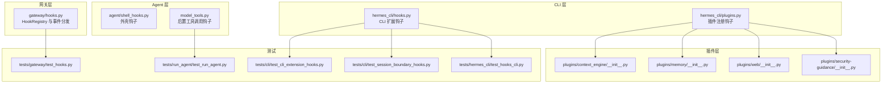
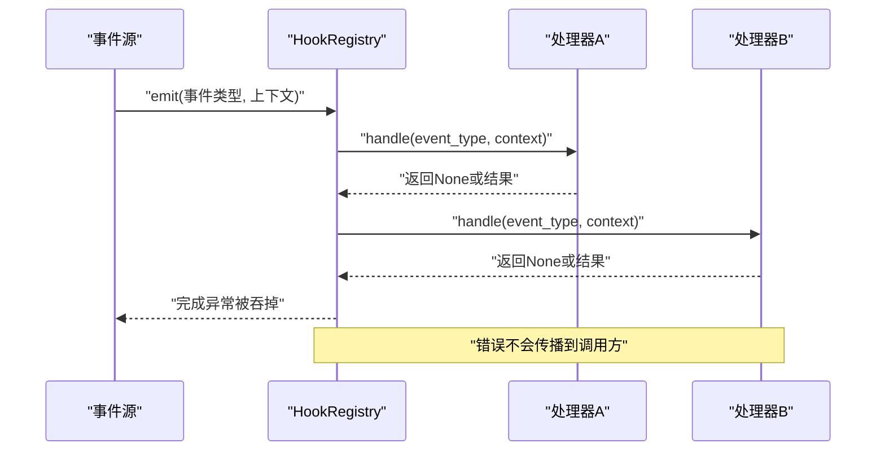
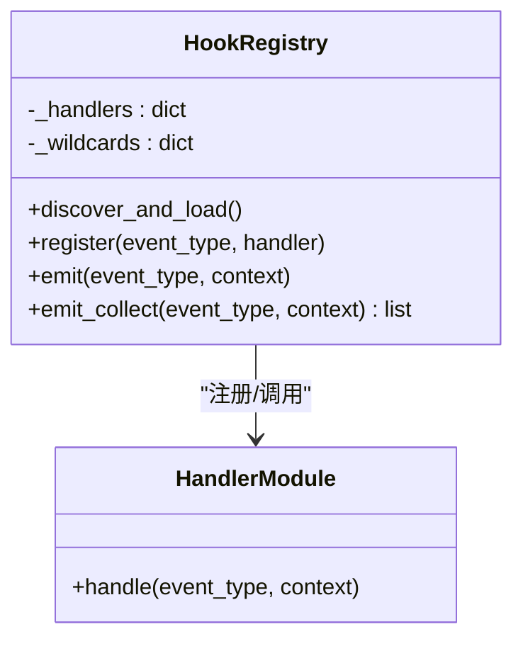
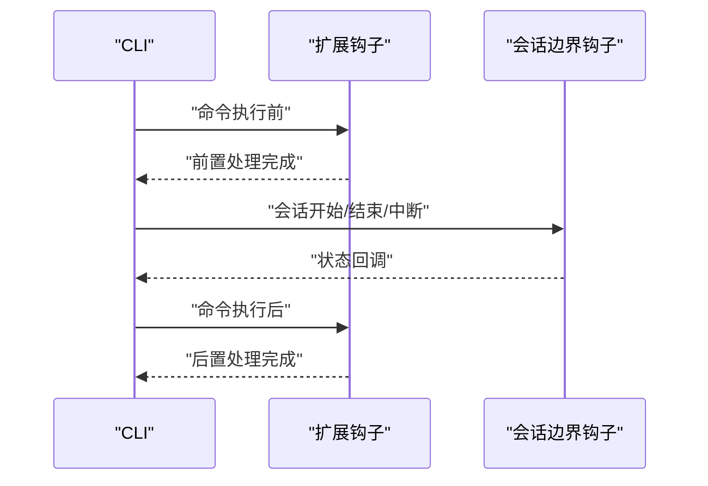
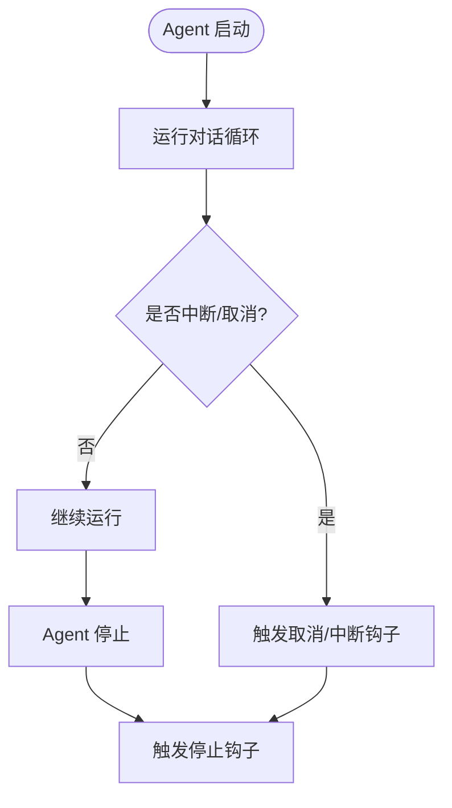
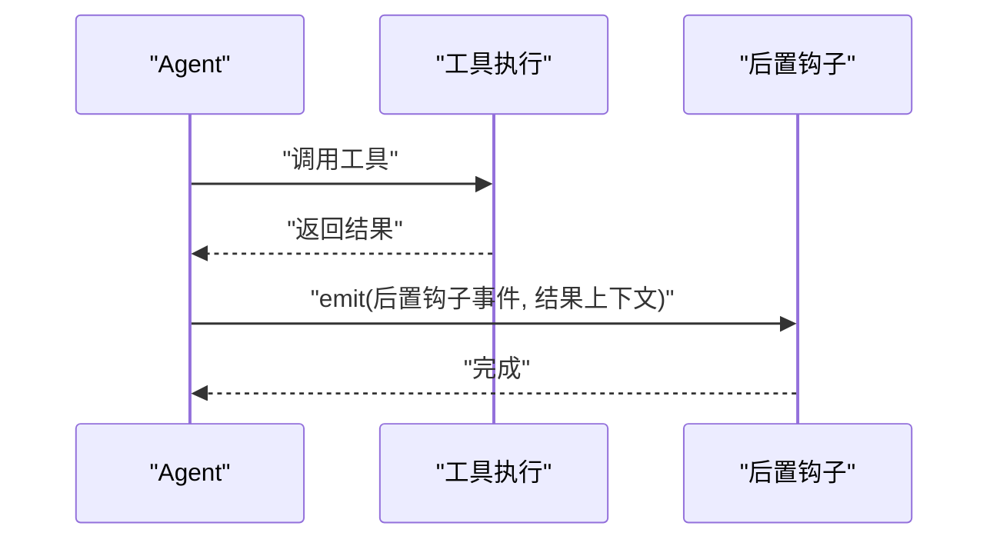
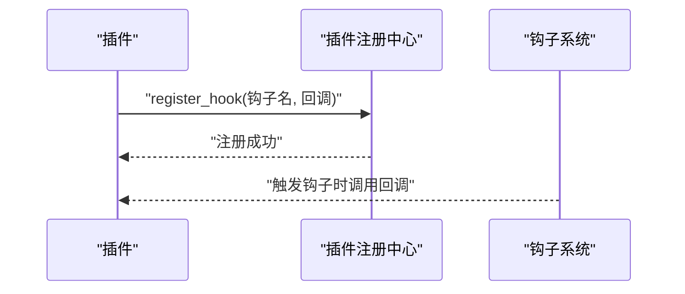
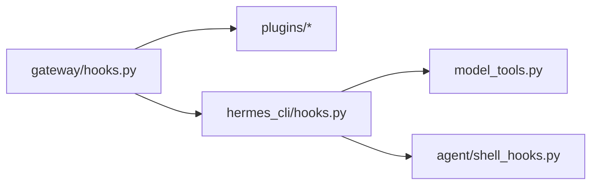
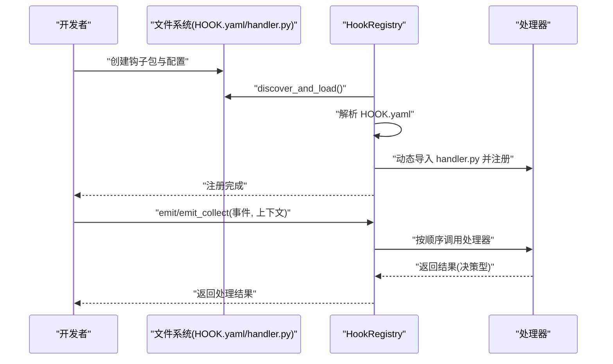

# 钩子系统

<cite>
**本文引用的文件**
- [gateway/hooks.py](file://gateway/hooks.py)
- [tests/gateway/test_hooks.py](file://tests/gateway/test_hooks.py)
- [tests/gateway/test_platform_registry.py](file://tests/gateway/test_platform_registry.py)
- [agent/shell_hooks.py](file://agent/shell_hooks.py)
- [hermes_cli/hooks.py](file://hermes_cli/hooks.py)
- [tests/cli/test_cli_extension_hooks.py](file://tests/cli/test_cli_extension_hooks.py)
- [tests/cli/test_session_boundary_hooks.py](file://tests/cli/test_session_boundary_hooks.py)
- [tests/hermes_cli/test_hooks_cli.py](file://tests/hermes_cli/test_hooks_cli.py)
- [tests/run_agent/test_run_agent.py](file://tests/run_agent/test_run_agent.py)
- [model_tools.py](file://model_tools.py)
- [tests/agent/test_shell_hooks.py](file://tests/agent/test_shell_hooks.py)
- [tests/agent/test_shell_hooks_consent.py](file://tests/agent/test_shell_hooks_consent.py)
- [plugins/context_engine/__init__.py](file://plugins/context_engine/__init__.py)
- [plugins/memory/__init__.py](file://plugins/memory/__init__.py)
- [plugins/web/__init__.py](file://plugins/web/__init__.py)
- [plugins/security-guidance/__init__.py](file://plugins/security-guidance/__init__.py)
- [tests/plugins/test_google_meet_plugin.py](file://tests/plugins/test_google_meet_plugin.py)
- [hermes_cli/plugins.py](file://hermes_cli/plugins.py)
</cite>

## 目录
1. [引言](#引言)
2. [项目结构](#项目结构)
3. [核心组件](#核心组件)
4. [架构总览](#架构总览)
5. [详细组件分析](#详细组件分析)
6. [依赖关系分析](#依赖关系分析)
7. [性能考量](#性能考量)
8. [故障排查指南](#故障排查指南)
9. [结论](#结论)
10. [附录](#附录)

## 引言
本文件系统性阐述 Hermes Agent 的钩子系统，覆盖注册机制、执行时机、生命周期管理、内置钩子、配置与扩展方式、优先级与条件触发、异常处理、性能影响、调试方法、最佳实践、自定义钩子开发指南、API 接口与实现模式、测试策略、版本兼容性与迁移指南，以及安全考虑、权限控制与审计要求。目标是帮助开发者在不同层面（网关、CLI、Agent 运行时、插件）正确理解并使用钩子。

## 项目结构
钩子系统主要分布在以下模块：
- 网关层钩子注册与事件分发：gateway/hooks.py
- CLI 扩展钩子：hermes_cli/hooks.py
- Agent 层外壳钩子：agent/shell_hooks.py
- 工具链运行时钩子：model_tools.py（后置工具调用钩子）
- 测试用例：tests/gateway/test_hooks.py、tests/cli/test_cli_extension_hooks.py、tests/cli/test_session_boundary_hooks.py、tests/hermes_cli/test_hooks_cli.py、tests/run_agent/test_run_agent.py 等
- 插件侧钩子注册与使用：plugins/*、hermes_cli/plugins.py

图表来源
- [gateway/hooks.py:34-200](file://gateway/hooks.py#L34-L200)
- [hermes_cli/hooks.py:1-200](file://hermes_cli/hooks.py#L1-L200)
- [agent/shell_hooks.py:1-200](file://agent/shell_hooks.py#L1-L200)
- [model_tools.py:800-830](file://model_tools.py#L800-L830)
- [hermes_cli/plugins.py:930-950](file://hermes_cli/plugins.py#L930-L950)
- [plugins/context_engine/__init__.py:270-285](file://plugins/context_engine/__init__.py#L270-L285)
- [plugins/memory/__init__.py:320-340](file://plugins/memory/__init__.py#L320-L340)
- [plugins/web/__init__.py:1-200](file://plugins/web/__init__.py#L1-L200)
- [plugins/security-guidance/__init__.py:1-200](file://plugins/security-guidance/__init__.py#L1-L200)
- [tests/gateway/test_hooks.py:100-320](file://tests/gateway/test_hooks.py#L100-L320)
- [tests/cli/test_cli_extension_hooks.py:1-200](file://tests/cli/test_cli_extension_hooks.py#L1-L200)
- [tests/cli/test_session_boundary_hooks.py:1-120](file://tests/cli/test_session_boundary_hooks.py#L1-L120)
- [tests/hermes_cli/test_hooks_cli.py:1-200](file://tests/hermes_cli/test_hooks_cli.py#L1-L200)
- [tests/run_agent/test_run_agent.py:2040-2630](file://tests/run_agent/test_run_agent.py#L2040-L2630)

章节来源
- [gateway/hooks.py:34-200](file://gateway/hooks.py#L34-L200)
- [hermes_cli/hooks.py:1-200](file://hermes_cli/hooks.py#L1-L200)
- [agent/shell_hooks.py:1-200](file://agent/shell_hooks.py#L1-L200)
- [model_tools.py:800-830](file://model_tools.py#L800-L830)
- [hermes_cli/plugins.py:930-950](file://hermes_cli/plugins.py#L930-L950)

## 核心组件
- HookRegistry：负责钩子发现、加载、注册、事件分发与收集式返回值聚合。
- CLI 扩展钩子：在 CLI 生命周期中注入扩展点。
- Shell Hooks：在 Agent 外壳层（如会话边界、中断等）触发。
- 工具后置钩子：在工具调用完成后触发，用于结果处理与审计。
- 插件侧钩子：插件通过注册接口向系统注入钩子处理器。

章节来源
- [gateway/hooks.py:34-200](file://gateway/hooks.py#L34-L200)
- [hermes_cli/hooks.py:1-200](file://hermes_cli/hooks.py#L1-L200)
- [agent/shell_hooks.py:1-200](file://agent/shell_hooks.py#L1-L200)
- [model_tools.py:800-830](file://model_tools.py#L800-L830)
- [hermes_cli/plugins.py:930-950](file://hermes_cli/plugins.py#L930-L950)

## 架构总览
钩子系统采用“事件驱动 + 处理器注册”的模式。事件类型由字符串标识（支持通配符），处理器以函数形式注册，事件触发时按注册顺序依次调用；对于决策型钩子，使用收集式分发获取所有处理器返回值。

图表来源
- [gateway/hooks.py:120-170](file://gateway/hooks.py#L120-L170)
- [tests/gateway/test_hooks.py:114-221](file://tests/gateway/test_hooks.py#L114-L221)

章节来源
- [gateway/hooks.py:120-170](file://gateway/hooks.py#L120-L170)
- [tests/gateway/test_hooks.py:114-221](file://tests/gateway/test_hooks.py#L114-L221)

## 详细组件分析

### 网关钩子系统（HookRegistry）
- 注册与发现：从指定目录扫描钩子包，解析 HOOK.yaml，动态导入 handler.py 并注册事件映射。
- 事件分发：emit 支持同步/异步处理器，通配符匹配；emit_collect 聚合返回值（丢弃 None）。
- 默认上下文：未传入上下文时使用空字典。
- 错误处理：单个处理器异常不传播，不影响整体流程。
- 内置钩子：可通过内置注册入口加载。

图表来源
- [gateway/hooks.py:34-200](file://gateway/hooks.py#L34-L200)

章节来源
- [gateway/hooks.py:34-200](file://gateway/hooks.py#L34-L200)
- [tests/gateway/test_hooks.py:100-320](file://tests/gateway/test_hooks.py#L100-L320)

### CLI 扩展钩子
- 生命周期钩子：在 CLI 启动、会话边界、扩展命令执行等节点触发。
- 会话边界钩子：支持中断、取消、结束等场景的钩子注入。
- CLI 命令扩展钩子：允许插件在 CLI 命令执行前后插入逻辑。

图表来源
- [hermes_cli/hooks.py:1-200](file://hermes_cli/hooks.py#L1-L200)
- [tests/cli/test_cli_extension_hooks.py:1-200](file://tests/cli/test_cli_extension_hooks.py#L1-L200)
- [tests/cli/test_session_boundary_hooks.py:1-120](file://tests/cli/test_session_boundary_hooks.py#L1-L120)

章节来源
- [hermes_cli/hooks.py:1-200](file://hermes_cli/hooks.py#L1-L200)
- [tests/cli/test_cli_extension_hooks.py:1-200](file://tests/cli/test_cli_extension_hooks.py#L1-L200)
- [tests/cli/test_session_boundary_hooks.py:1-120](file://tests/cli/test_session_boundary_hooks.py#L1-L120)

### Agent 外壳钩子
- 会话生命周期钩子：在 Agent 启动、停止、中断、取消等阶段触发。
- 子代理停止钩子：在子代理停止时触发，便于清理与审计。
- 同意与隐私钩子：涉及用户同意、隐私保护的钩子流程。

图表来源
- [agent/shell_hooks.py:1-200](file://agent/shell_hooks.py#L1-L200)
- [tests/agent/test_shell_hooks.py:1-200](file://tests/agent/test_shell_hooks.py#L1-L200)
- [tests/agent/test_shell_hooks_consent.py:1-200](file://tests/agent/test_shell_hooks_consent.py#L1-L200)

章节来源
- [agent/shell_hooks.py:1-200](file://agent/shell_hooks.py#L1-L200)
- [tests/agent/test_shell_hooks.py:1-200](file://tests/agent/test_shell_hooks.py#L1-L200)
- [tests/agent/test_shell_hooks_consent.py:1-200](file://tests/agent/test_shell_hooks_consent.py#L1-L200)

### 工具后置钩子（模型工具层）
- 触发时机：工具调用完成后触发，用于结果转换、审计、缓存等。
- 典型用途：转换工具输出、记录使用轨迹、触发后续动作。

图表来源
- [model_tools.py:800-830](file://model_tools.py#L800-L830)
- [tests/run_agent/test_run_agent.py:2040-2630](file://tests/run_agent/test_run_agent.py#L2040-L2630)

章节来源
- [model_tools.py:800-830](file://model_tools.py#L800-L830)
- [tests/run_agent/test_run_agent.py:2040-2630](file://tests/run_agent/test_run_agent.py#L2040-L2630)

### 插件侧钩子注册与使用
- 插件注册接口：插件通过 register_hook 注册钩子名称与回调。
- 使用示例：Google Meet 插件在注册时绑定钩子，确保工具、CLI 与钩子联动。
- 上下文引擎、内存插件、Web 插件、安全指导插件均提供钩子扩展点。

图表来源
- [hermes_cli/plugins.py:930-950](file://hermes_cli/plugins.py#L930-L950)
- [plugins/context_engine/__init__.py:270-285](file://plugins/context_engine/__init__.py#L270-L285)
- [plugins/memory/__init__.py:320-340](file://plugins/memory/__init__.py#L320-L340)
- [plugins/web/__init__.py:1-200](file://plugins/web/__init__.py#L1-L200)
- [plugins/security-guidance/__init__.py:1-200](file://plugins/security-guidance/__init__.py#L1-L200)
- [tests/plugins/test_google_meet_plugin.py:330-360](file://tests/plugins/test_google_meet_plugin.py#L330-L360)

章节来源
- [hermes_cli/plugins.py:930-950](file://hermes_cli/plugins.py#L930-L950)
- [plugins/context_engine/__init__.py:270-285](file://plugins/context_engine/__init__.py#L270-L285)
- [plugins/memory/__init__.py:320-340](file://plugins/memory/__init__.py#L320-L340)
- [plugins/web/__init__.py:1-200](file://plugins/web/__init__.py#L1-L200)
- [plugins/security-guidance/__init__.py:1-200](file://plugins/security-guidance/__init__.py#L1-L200)
- [tests/plugins/test_google_meet_plugin.py:330-360](file://tests/plugins/test_google_meet_plugin.py#L330-L360)

## 依赖关系分析
- 组件耦合：HookRegistry 与处理器模块松耦合，通过事件类型字符串解耦。
- 外部依赖：无硬性外部依赖，核心基于 Python 动态导入与事件分发。
- 循环依赖：未见循环依赖迹象；各层钩子独立存在，避免相互依赖。
- 接口契约：事件类型与上下文约定清晰，返回值用于决策型钩子收集。

图表来源
- [gateway/hooks.py:34-200](file://gateway/hooks.py#L34-L200)
- [hermes_cli/hooks.py:1-200](file://hermes_cli/hooks.py#L1-L200)
- [agent/shell_hooks.py:1-200](file://agent/shell_hooks.py#L1-L200)
- [model_tools.py:800-830](file://model_tools.py#L800-L830)

章节来源
- [gateway/hooks.py:34-200](file://gateway/hooks.py#L34-L200)
- [hermes_cli/hooks.py:1-200](file://hermes_cli/hooks.py#L1-L200)
- [agent/shell_hooks.py:1-200](file://agent/shell_hooks.py#L1-L200)
- [model_tools.py:800-830](file://model_tools.py#L800-L830)

## 性能考量
- 异步处理器：emit 对异步处理器友好，避免阻塞事件循环。
- 返回值收集：emit_collect 仅收集非 None 返回值，减少无效数据传递。
- 通配符匹配：通配符匹配可能增加匹配成本，建议在高频事件上谨慎使用。
- 错误隔离：处理器异常不传播，避免单点故障，但需关注静默失败风险。

## 故障排查指南
- 事件无处理器：emit 对未知事件不抛错，返回 None；检查事件类型拼写与注册。
- 处理器异常：单个处理器异常不会影响其他处理器；建议在处理器内自行捕获并记录日志。
- 上下文缺失：未传入上下文时使用空字典；若业务需要，请显式传入。
- 决策型钩子：使用 emit_collect 获取所有返回值，确认是否遗漏 None 或错误返回。
- CLI/会话边界钩子：检查钩子是否在正确生命周期触发，必要时添加日志断点。
- 工具后置钩子：确认工具调用已完成再触发，避免竞态条件。

章节来源
- [tests/gateway/test_hooks.py:114-221](file://tests/gateway/test_hooks.py#L114-L221)
- [tests/cli/test_session_boundary_hooks.py:1-120](file://tests/cli/test_session_boundary_hooks.py#L1-L120)
- [tests/run_agent/test_run_agent.py:2040-2630](file://tests/run_agent/test_run_agent.py#L2040-L2630)

## 结论
Hermes Agent 的钩子系统以 HookRegistry 为核心，贯穿网关、CLI、Agent 运行时与插件层，提供灵活的事件驱动扩展能力。通过明确的事件类型、上下文约定与错误隔离策略，系统在保证稳定性的同时提供了强大的可扩展性。建议在高频事件上谨慎使用通配符，并在关键钩子处完善日志与审计。

## 附录

### 钩子注册与执行流程（代码级）

图表来源
- [gateway/hooks.py:34-200](file://gateway/hooks.py#L34-L200)
- [tests/gateway/test_hooks.py:100-320](file://tests/gateway/test_hooks.py#L100-L320)

### 自定义钩子开发指南
- 创建钩子包：在钩子目录下创建包，包含 HOOK.yaml（声明事件列表）与 handler.py（导出 handle 函数）。
- 事件类型：使用冒号分隔的命名空间，支持通配符匹配。
- 处理器签名：handle(event_type, context)；异步处理器亦可。
- 决策型钩子：使用 emit_collect 聚合返回值，注意过滤 None。
- 上下文设计：根据业务需要传递必要字段，保持最小化上下文。
- 错误处理：在处理器内部捕获异常并记录日志，避免异常传播。

章节来源
- [gateway/hooks.py:34-200](file://gateway/hooks.py#L34-L200)
- [tests/gateway/test_hooks.py:100-320](file://tests/gateway/test_hooks.py#L100-L320)

### API 接口与实现模式
- HookRegistry
  - discover_and_load：扫描并加载钩子包
  - register：注册处理器
  - emit：同步/异步事件分发
  - emit_collect：收集返回值（决策型）
- CLI 钩子
  - 生命周期钩子：启动、命令执行前后、会话边界
- Shell Hooks
  - 会话开始/结束/中断/取消
- 工具后置钩子
  - 工具调用完成后触发，用于结果转换与审计

章节来源
- [gateway/hooks.py:34-200](file://gateway/hooks.py#L34-L200)
- [hermes_cli/hooks.py:1-200](file://hermes_cli/hooks.py#L1-L200)
- [agent/shell_hooks.py:1-200](file://agent/shell_hooks.py#L1-L200)
- [model_tools.py:800-830](file://model_tools.py#L800-L830)

### 测试策略
- 单元测试
  - HookRegistry：验证事件分发、通配符匹配、异常隔离、默认上下文。
  - CLI 钩子：验证生命周期钩子与会话边界钩子。
  - 工具后置钩子：验证工具调用后的钩子触发与结果处理。
- 集成测试
  - 插件与钩子联动：确保插件注册钩子后能被系统正确触发。
- 回归测试
  - 版本升级后验证钩子行为一致性。

章节来源
- [tests/gateway/test_hooks.py:100-320](file://tests/gateway/test_hooks.py#L100-L320)
- [tests/cli/test_cli_extension_hooks.py:1-200](file://tests/cli/test_cli_extension_hooks.py#L1-L200)
- [tests/cli/test_session_boundary_hooks.py:1-120](file://tests/cli/test_session_boundary_hooks.py#L1-L120)
- [tests/hermes_cli/test_hooks_cli.py:1-200](file://tests/hermes_cli/test_hooks_cli.py#L1-L200)
- [tests/run_agent/test_run_agent.py:2040-2630](file://tests/run_agent/test_run_agent.py#L2040-L2630)
- [tests/plugins/test_google_meet_plugin.py:330-360](file://tests/plugins/test_google_meet_plugin.py#L330-L360)

### 版本兼容性与迁移指南
- 事件类型变更：遵循向后兼容原则，新增事件类型而不删除旧类型。
- 处理器签名：保持 handle(event_type, context) 签名不变；如需扩展，使用上下文字段承载新信息。
- 通配符使用：谨慎使用通配符，避免未来事件命名冲突。
- 插件迁移：插件注册接口保持稳定，迁移时只需更新钩子名称与上下文。

### 安全考虑、权限控制与审计
- 权限控制：钩子不应执行高权限操作；如需权限提升，通过明确的授权流程与最小权限原则。
- 输入校验：对上下文中的输入进行严格校验与清洗，防止注入攻击。
- 审计日志：在关键钩子（如工具后置钩子）中记录操作时间、用户、工具名、结果摘要等。
- 异常隔离：处理器异常不传播，但需在日志中记录异常详情以便审计。
- 数据最小化：上下文仅包含必要字段，避免泄露敏感信息。