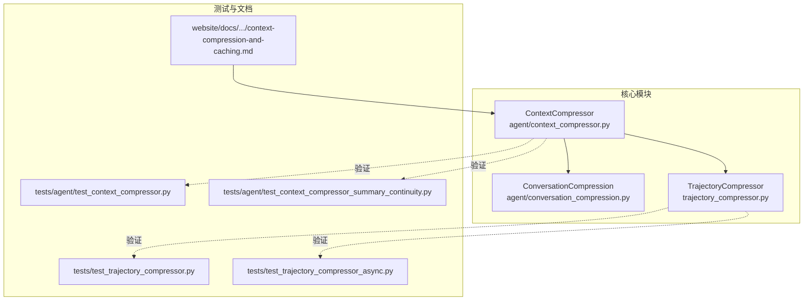
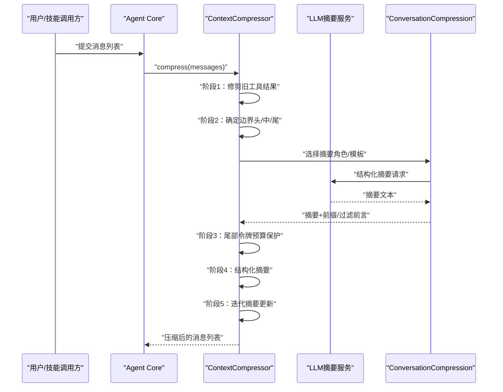
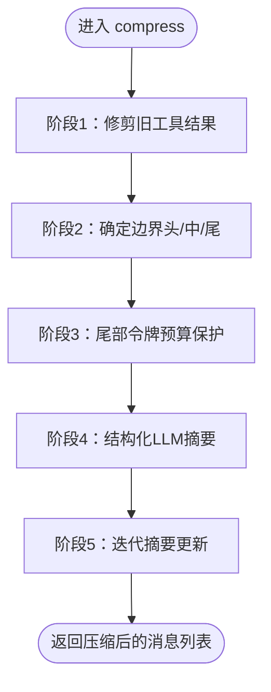
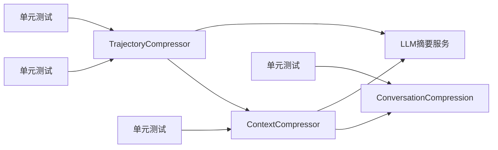

# 上下文压缩算法

<cite>
**本文引用的文件**
- [agent/context_compressor.py](file://agent/context_compressor.py)
- [agent/conversation_compression.py](file://agent/conversation_compression.py)
- [trajectory_compressor.py](file://trajectory_compressor.py)
- [tests/agent/test_context_compressor.py](file://tests/agent/test_context_compressor.py)
- [tests/agent/test_context_compressor_summary_continuity.py](file://tests/agent/test_context_compressor_summary_continuity.py)
- [tests/test_trajectory_compressor.py](file://tests/test_trajectory_compressor.py)
- [tests/test_trajectory_compressor_async.py](file://tests/test_trajectory_compressor.py)
- [website/docs/developer-guide/context-compression-and-caching.md](file://website/docs/developer-guide/context-compression-and-caching.md)
</cite>

## 目录
1. [简介](#简介)
2. [项目结构](#项目结构)
3. [核心组件](#核心组件)
4. [架构总览](#架构总览)
5. [详细组件分析](#详细组件分析)
6. [依赖关系分析](#依赖关系分析)
7. [性能考量](#性能考量)
8. [故障排查指南](#故障排查指南)
9. [结论](#结论)
10. [附录](#附录)

## 简介
本文件系统性阐述 Hermes Agent 的上下文压缩算法，聚焦自动上下文窗口压缩的核心流程与实现细节。算法通过“工具结果修剪、头部保护、尾部令牌预算保护、结构化LLM摘要、迭代摘要更新”五大步骤，在保证关键对话连贯性的前提下，最大化降低上下文占用，从而提升模型推理效率与稳定性。文档同时覆盖摘要前缀模板、过滤安全摘要器前言、剩余工作替代方案、令牌预算尾部保护、工具调用结果详细信息以及缩放摘要预算等增强特性，并给出算法配置参数、阈值设置与性能调优建议。

## 项目结构
围绕上下文压缩的关键模块与测试文件如下：
- 核心压缩器：agent/context_compressor.py
- 会话级压缩策略：agent/conversation_compression.py
- 轨迹压缩器（用于长序列/多轮压缩）：trajectory_compressor.py
- 单元测试与回归测试：tests/agent/test_context_compressor.py、tests/agent/test_context_compressor_summary_continuity.py、tests/test_trajectory_compressor.py、tests/test_trajectory_compressor_async.py
- 开发者文档：website/docs/developer-guide/context-compression-and-caching.md

图表来源
- [agent/context_compressor.py](file://agent/context_compressor.py)
- [agent/conversation_compression.py](file://agent/conversation_compression.py)
- [trajectory_compressor.py](file://trajectory_compressor.py)
- [tests/agent/test_context_compressor.py](file://tests/agent/test_context_compressor.py)
- [tests/agent/test_context_compressor_summary_continuity.py](file://tests/agent/test_context_compressor_summary_continuity.py)
- [tests/test_trajectory_compressor.py](file://tests/test_trajectory_compressor.py)
- [tests/test_trajectory_compressor_async.py](file://tests/test_trajectory_compressor_async.py)
- [website/docs/developer-guide/context-compression-and-caching.md](file://website/docs/developer-guide/context-compression-and-caching.md)

章节来源
- [agent/context_compressor.py](file://agent/context_compressor.py)
- [agent/conversation_compression.py](file://agent/conversation_compression.py)
- [trajectory_compressor.py](file://trajectory_compressor.py)
- [tests/agent/test_context_compressor.py](file://tests/agent/test_context_compressor.py)
- [tests/agent/test_context_compressor_summary_continuity.py](file://tests/agent/test_context_compressor_summary_continuity.py)
- [tests/test_trajectory_compressor.py](file://tests/test_trajectory_compressor.py)
- [tests/test_trajectory_compressor_async.py](file://tests/test_trajectory_compressor_async.py)
- [website/docs/developer-guide/context-compression-and-caching.md](file://website/docs/developer-guide/context-compression-and-caching.md)

## 核心组件
- ContextCompressor：负责消息列表的自动压缩，执行工具结果修剪、边界对齐、摘要生成与迭代更新。
- ConversationCompression：会话级压缩策略封装，协调摘要角色选择、摘要前缀模板与摘要器前言过滤。
- TrajectoryCompressor：面向长轨迹/滚动窗口的压缩器，支持缩放摘要预算与剩余工作替代方案。

章节来源
- [agent/context_compressor.py](file://agent/context_compressor.py)
- [agent/conversation_compression.py](file://agent/conversation_compression.py)
- [trajectory_compressor.py](file://trajectory_compressor.py)

## 架构总览
上下文压缩在调用链中的位置与交互如下：

图表来源
- [agent/context_compressor.py](file://agent/context_compressor.py)
- [agent/conversation_compression.py](file://agent/conversation_compression.py)

## 详细组件分析

### ContextCompressor 压缩算法详解
ContextCompressor.compress() 采用五阶段算法，确保在不丢失关键信息的前提下进行高效压缩。

- 阶段1：工具结果修剪（低成本，无需LLM调用）
  - 对超出字符阈值的旧工具结果进行清理，替换为统一提示，减少冗长输出带来的token占用。
  - 该步骤优先执行，避免后续阶段重复处理大块工具输出。

- 阶段2：确定边界（头部保护、中部压缩候选、尾部预算保护）
  - 头部：系统提示 + 前若干轮对话（由 protect_first_n 控制），始终保留。
  - 中部：除头部与尾部外的所有消息，作为压缩候选区域。
  - 尾部：从末尾向前累计token，达到预算后停止；若不足最小保护数量，则回退到固定保护数 protect_last_n。
  - 边界对齐：避免拆分 tool_call/tool_result 组，通过向后对齐方法确保组完整性。

- 阶段3：尾部令牌预算保护
  - 基于阈值计算得到的阈值token数，按目标比例分配尾部预算；若尾部消息数小于最小保护数，则强制保留固定数量。

- 阶段4：结构化LLM摘要
  - 使用 ConversationCompression 选择合适的摘要角色与模板，构造结构化摘要请求，调用LLM生成摘要文本。
  - 摘要前缀模板与过滤安全摘要器前言，确保摘要风格一致且无冗余引导词。

- 阶段5：迭代摘要更新
  - 在多次压缩迭代中，逐步更新摘要内容，保持摘要与当前上下文的连贯性与代表性。
  - 支持剩余工作替代方案，当摘要无法承载全部信息时，采用替代策略补充关键要点。

图表来源
- [agent/context_compressor.py](file://agent/context_compressor.py)
- [agent/conversation_compression.py](file://agent/conversation_compression.py)

章节来源
- [agent/context_compressor.py](file://agent/context_compressor.py)
- [agent/conversation_compression.py](file://agent/conversation_compression.py)
- [website/docs/developer-guide/context-compression-and-caching.md](file://website/docs/developer-guide/context-compression-and-caching.md)

### ConversationCompression 摘要策略
- 摘要角色选择：根据与尾部/头部的角色冲突情况，动态选择摘要角色，避免与尾部或头部消息角色冲突。
- 摘要前缀模板：统一摘要格式，便于后续解析与一致性处理。
- 过滤安全摘要器前言：去除摘要器可能添加的冗余引导词，确保摘要简洁有效。
- 剩余工作替代方案：当摘要容量不足时，采用替代方案补充关键信息点，保障摘要代表性。

章节来源
- [agent/conversation_compression.py](file://agent/conversation_compression.py)

### TrajectoryCompressor 缩放与替代
- 缩放摘要预算：根据上下文长度与阈值动态调整摘要预算，平衡摘要质量与上下文占用。
- 剩余工作替代方案：在摘要无法完全承载信息时，提供替代策略，如关键片段抽取、要点合并等，确保重要信息不丢失。

章节来源
- [trajectory_compressor.py](file://trajectory_compressor.py)

## 依赖关系分析
- ContextCompressor 依赖 ConversationCompression 完成摘要角色与模板选择，并与 LLM 摘要服务交互。
- TrajectoryCompressor 与 ContextCompressor 共享边界对齐与预算保护逻辑，但针对长序列场景提供缩放与替代能力。
- 测试用例覆盖边界对齐、摘要角色冲突合并、摘要连续性与异步压缩场景，确保算法稳健性。

图表来源
- [agent/context_compressor.py](file://agent/context_compressor.py)
- [agent/conversation_compression.py](file://agent/conversation_compression.py)
- [trajectory_compressor.py](file://trajectory_compressor.py)
- [tests/agent/test_context_compressor.py](file://tests/agent/test_context_compressor.py)
- [tests/agent/test_context_compressor_summary_continuity.py](file://tests/agent/test_context_compressor_summary_continuity.py)
- [tests/test_trajectory_compressor.py](file://tests/test_trajectory_compressor.py)
- [tests/test_trajectory_compressor_async.py](file://tests/test_trajectory_compressor_async.py)

章节来源
- [tests/agent/test_context_compressor.py](file://tests/agent/test_context_compressor.py)
- [tests/agent/test_context_compressor_summary_continuity.py](file://tests/agent/test_context_compressor_summary_continuity.py)
- [tests/test_trajectory_compressor.py](file://tests/test_trajectory_compressor.py)
- [tests/test_trajectory_compressor_async.py](file://tests/test_trajectory_compressor_async.py)

## 性能考量
- 阈值与目标比例：阈值决定触发压缩的token占比，目标比例控制尾部预算占阈值token的比例，二者共同影响压缩强度与上下文占用。
- 最小尾部保护：当尾部消息数低于最小保护数量时，回退到固定保护数，避免过度压缩导致关键信息丢失。
- 工具结果修剪：在不调用LLM的前提下清理冗长工具输出，显著降低token消耗，提升整体吞吐。
- 异步压缩：TrajectoryCompressor 提供异步压缩能力，适合长序列与高并发场景。
- 摘要连续性：通过迭代更新与摘要前缀模板，维持摘要与上下文的连贯性，减少重复信息。

章节来源
- [website/docs/developer-guide/context-compression-and-caching.md](file://website/docs/developer-guide/context-compression-and-caching.md)
- [tests/agent/test_context_compressor_summary_continuity.py](file://tests/agent/test_context_compressor_summary_continuity.py)
- [tests/test_trajectory_compressor_async.py](file://tests/test_trajectory_compressor_async.py)

## 故障排查指南
- 角色冲突导致摘要失败：当摘要角色与尾部或头部角色冲突时，算法会尝试合并或切换角色，若仍失败，检查摘要角色选择逻辑与消息边界对齐。
- 尾部预算不足：若尾部消息数小于最小保护数量，算法会回退到固定保护数；可通过增大阈值或目标比例缓解。
- 摘要前言冗余：启用过滤安全摘要器前言功能，确保摘要简洁；若仍有冗余，检查模板与前言过滤规则。
- 工具结果未修剪：确认工具结果修剪阈值与字符限制设置是否合理，避免大块输出影响压缩效果。
- 压缩后上下文仍超限：检查阈值、目标比例与最小尾部保护设置，必要时降低摘要预算或增加阈值。

章节来源
- [agent/context_compressor.py](file://agent/context_compressor.py)
- [agent/conversation_compression.py](file://agent/conversation_compression.py)
- [tests/agent/test_context_compressor.py](file://tests/agent/test_context_compressor.py)

## 结论
Hermes Agent 的上下文压缩算法通过“工具结果修剪 + 头部保护 + 尾部预算保护 + 结构化LLM摘要 + 迭代摘要更新”的五步法，在保证关键对话连贯性的前提下，显著降低上下文占用并提升推理效率。结合摘要前缀模板、过滤安全摘要器前言、剩余工作替代方案与缩放摘要预算等增强特性，算法在不同场景下均具备良好的鲁棒性与可调性。建议在生产环境中根据模型上下文窗口与业务需求，合理设置阈值、目标比例与最小尾部保护等参数，并通过测试用例持续验证压缩效果与摘要连续性。

## 附录

### 算法配置参数与阈值设置
- threshold：压缩触发阈值（占主模型上下文窗口的比例）
- target_ratio：尾部预算占阈值token的比例
- protect_last_n：尾部最小保护消息数
- protect_first_n：头部最小保护消息数（系统提示 + 首轮对话）

章节来源
- [website/docs/developer-guide/context-compression-and-caching.md](file://website/docs/developer-guide/context-compression-and-caching.md)

### 实际代码示例（路径引用）
- 工具结果修剪与边界对齐：[agent/context_compressor.py](file://agent/context_compressor.py)
- 摘要角色选择与模板：[agent/conversation_compression.py](file://agent/conversation_compression.py)
- 缩放摘要预算与替代方案：[trajectory_compressor.py](file://trajectory_compressor.py)
- 压缩效果评估与连续性测试：[tests/agent/test_context_compressor.py](file://tests/agent/test_context_compressor.py)、[tests/agent/test_context_compressor_summary_continuity.py](file://tests/agent/test_context_compressor_summary_continuity.py)
- 轨迹压缩与异步压缩测试：[tests/test_trajectory_compressor.py](file://tests/test_trajectory_compressor.py)、[tests/test_trajectory_compressor_async.py](file://tests/test_trajectory_compressor_async.py)