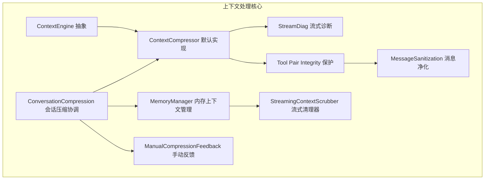
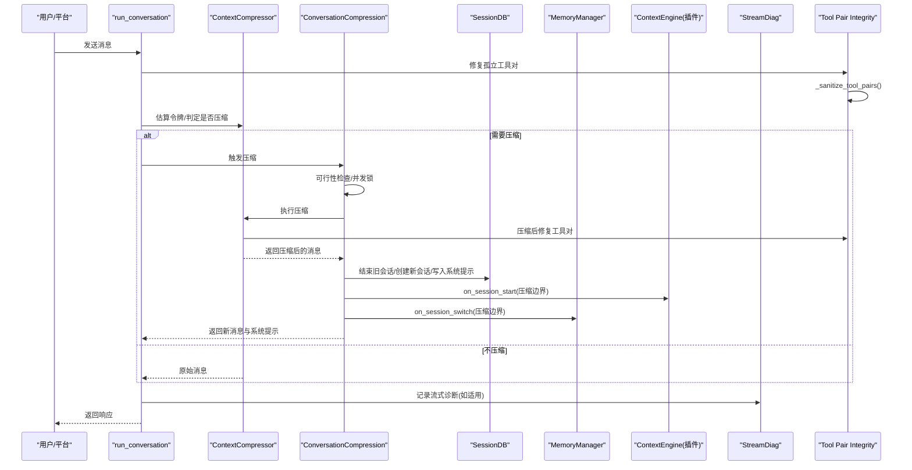
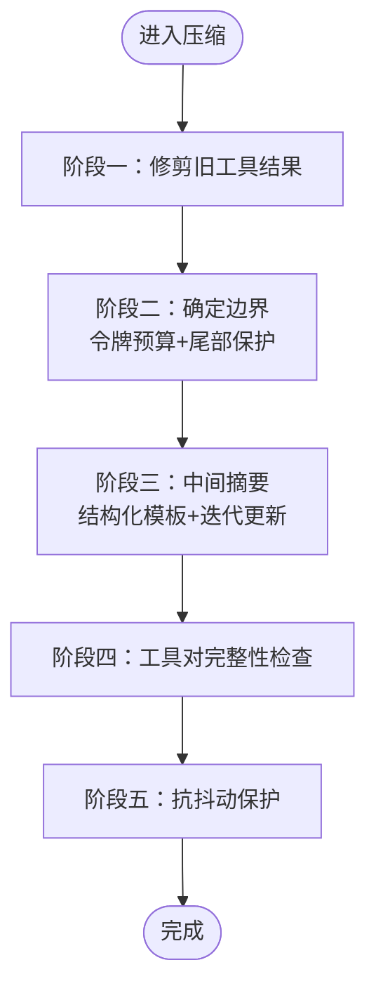
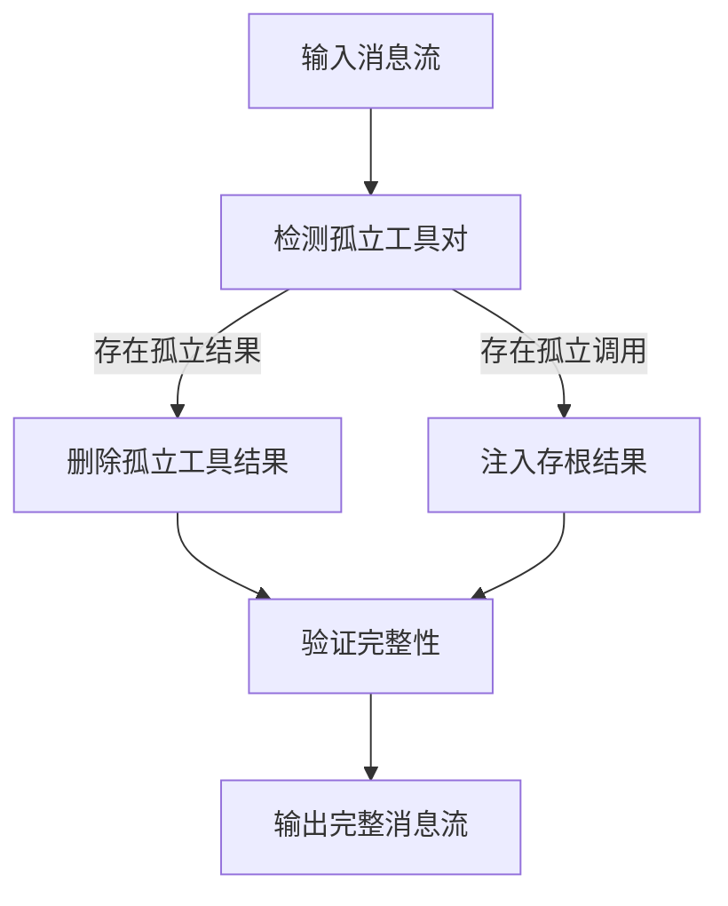
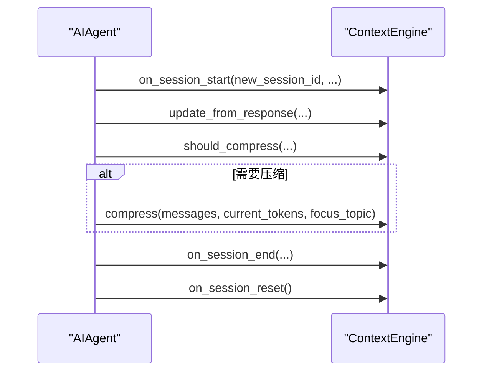
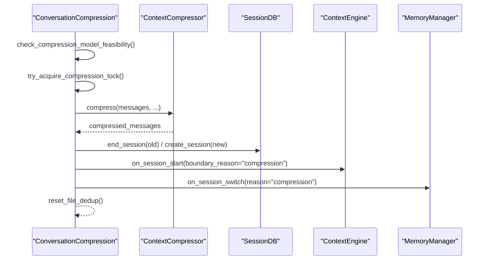
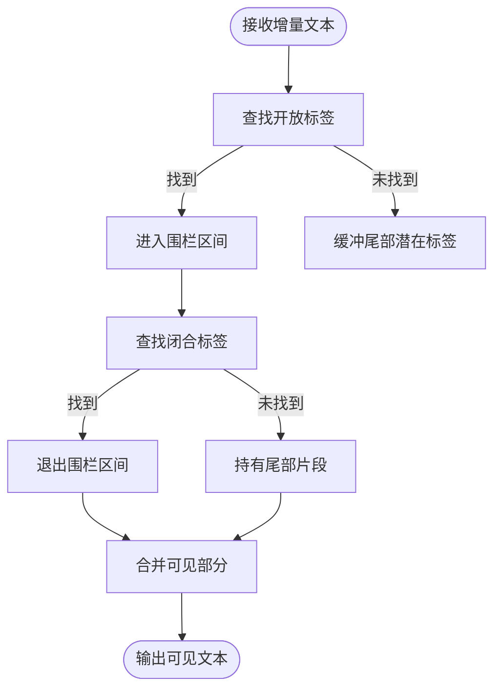
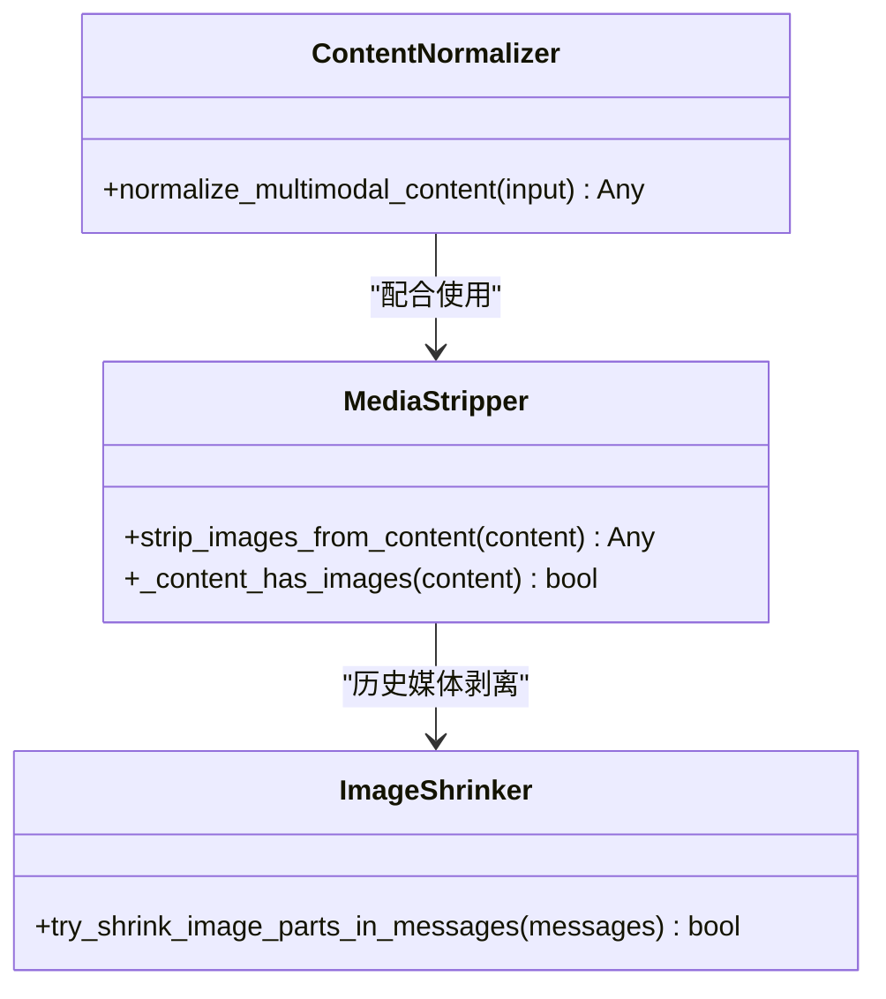
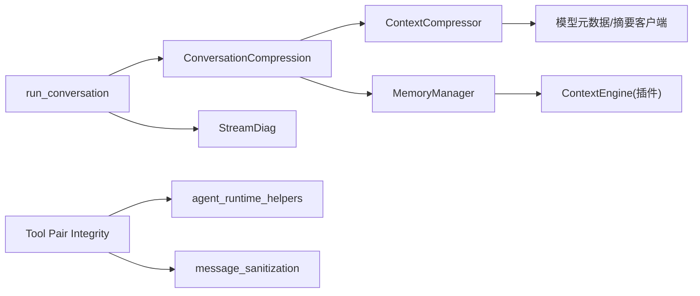

# 上下文处理

<cite>
**本文引用的文件**
- [agent/context_compressor.py](file://agent/context_compressor.py)
- [agent/context_engine.py](file://agent/context_engine.py)
- [agent/conversation_compression.py](file://agent/conversation_compression.py)
- [agent/manual_compression_feedback.py](file://agent/manual_compression_feedback.py)
- [agent/memory_manager.py](file://agent/memory_manager.py)
- [agent/stream_diag.py](file://agent/stream_diag.py)
- [agent/agent_runtime_helpers.py](file://agent/agent_runtime_helpers.py)
- [agent/message_sanitization.py](file://agent/message_sanitization.py)
- [website/docs/developer-guide/context-compression-and-caching.md](file://website/docs/developer-guide/context-compression-and-caching.md)
- [tests/run_agent/test_compression_boundary.py](file://tests/run_agent/test_compression_boundary.py)
- [tests/run_agent/test_long_context_tier_429.py](file://tests/run_agent/test_long_context_tier_429.py)
- [tests/run_agent/test_compression_boundary_hook.py](file://tests/run_agent/test_compression_boundary_hook.py)
- [tests/run_agent/test_run_agent_codex_responses.py](file://tests/run_agent/test_run_agent_codex_responses.py)
- [tests/agent/test_context_engine_host_contract.py](file://tests/agent/test_context_engine_host_contract.py)
- [tests/plugins/memory/test_hindsight_provider.py](file://tests/plugins/memory/test_hindsight_provider.py)
- [tests/gateway/test_api_server_multimodal.py](file://tests/gateway/test_api_server_multimodal.py)
- [tests/gateway/test_media_extraction.py](file://tests/gateway/test_media_extraction.py)
- [tests/agent/test_compressor_historical_media.py](file://tests/agent/test_compressor_historical_media.py)
</cite>

## 目录
1. [简介](#简介)
2. [项目结构](#项目结构)
3. [核心组件](#核心组件)
4. [架构总览](#架构总览)
5. [详细组件分析](#详细组件分析)
6. [依赖关系分析](#依赖关系分析)
7. [性能考量](#性能考量)
8. [故障排查指南](#故障排查指南)
9. [结论](#结论)
10. [附录](#附录)

## 简介
本文件面向开发者与高级用户，系统化阐述 Hermes Agent 的上下文处理体系，重点覆盖：
- 上下文压缩算法与令牌预算管理
- 上下文引擎生命周期与插件化扩展
- 预取机制、流式处理与内存上下文标记
- 手动压缩反馈、流式上下文清理器与令牌跟踪
- 多模态内容处理、媒体文件压缩与视觉信息管理
- 工具调用/工具响应对完整性保护与训练数据安全
- 配置项、阈值与性能调优建议

目标是帮助读者在不深入源码的前提下理解系统工作原理，并在实践中高效地进行调试、优化与扩展。

## 项目结构
围绕上下文处理的关键模块分布如下：
- 上下文引擎抽象与默认实现：agent/context_engine.py、agent/context_compressor.py
- 会话压缩与锁协调：agent/conversation_compression.py
- 流式诊断与隐私清洗：agent/stream_diag.py、agent/memory_manager.py
- 用户反馈与手动压缩：agent/manual_compression_feedback.py
- 工具调用完整性保护：agent/agent_runtime_helpers.py、agent/message_sanitization.py
- 文档与测试支撑：website/docs/developer-guide/context-compression-and-caching.md、tests/* 相关用例

图示来源
- [agent/context_engine.py:1-227](file://agent/context_engine.py#L1-L227)
- [agent/context_compressor.py:1-800](file://agent/context_compressor.py#L1-L800)
- [agent/conversation_compression.py:1-786](file://agent/conversation_compression.py#L1-L786)
- [agent/memory_manager.py:1-654](file://agent/memory_manager.py#L1-L654)
- [agent/stream_diag.py:1-281](file://agent/stream_diag.py#L1-L281)
- [agent/manual_compression_feedback.py:1-50](file://agent/manual_compression_feedback.py#L1-L50)
- [agent/agent_runtime_helpers.py:1896-1905](file://agent/agent_runtime_helpers.py#L1896-L1905)
- [agent/message_sanitization.py:380-400](file://agent/message_sanitization.py#L380-L400)

章节来源
- [agent/context_engine.py:1-227](file://agent/context_engine.py#L1-L227)
- [agent/context_compressor.py:1-800](file://agent/context_compressor.py#L1-L800)
- [agent/conversation_compression.py:1-786](file://agent/conversation_compression.py#L1-L786)
- [agent/memory_manager.py:1-654](file://agent/memory_manager.py#L1-L654)
- [agent/stream_diag.py:1-281](file://agent/stream_diag.py#L1-L281)
- [agent/manual_compression_feedback.py:1-50](file://agent/manual_compression_feedback.py#L1-L50)

## 核心组件
- 上下文引擎抽象（ContextEngine）
  - 定义统一接口：更新用量、判定压缩、执行压缩、生命周期钩子、状态查询、模型切换。
  - 默认实现（ContextCompressor）采用"头尾保护 + 中间摘要"的三段式策略，结合令牌预算与抗抖动保护，避免无限压缩循环。
- 会话压缩协调（ConversationCompression）
  - 负责压缩可行性检查、并发压缩锁、会话分割与 ID 切换、通知上下文引擎与内存提供者、清理去重缓存等。
- 内存上下文管理（MemoryManager）
  - 提供预取、同步、工具路由、生命周期钩子；内置流式上下文清理器（StreamingContextScrubber）保障流式输出安全。
- 流式诊断（StreamDiag）
  - 记录流中断原因、上游头信息、字节/块计数、耗时等，便于定位网络/代理问题。
- 手动压缩反馈（ManualCompressionFeedback）
  - 对比压缩前后消息数与估算令牌，给出一致的用户反馈。
- 工具调用完整性保护（Tool Pair Integrity）
  - 在压缩前后修复孤立的工具调用/工具响应对，防止训练数据损坏。

章节来源
- [agent/context_engine.py:32-227](file://agent/context_engine.py#L32-L227)
- [agent/context_compressor.py:522-800](file://agent/context_compressor.py#L522-L800)
- [agent/conversation_compression.py:271-786](file://agent/conversation_compression.py#L271-L786)
- [agent/memory_manager.py:62-242](file://agent/memory_manager.py#L62-L242)
- [agent/stream_diag.py:41-281](file://agent/stream_diag.py#L41-L281)
- [agent/manual_compression_feedback.py:8-50](file://agent/manual_compression_feedback.py#L8-L50)
- [agent/agent_runtime_helpers.py:1896-1905](file://agent/agent_runtime_helpers.py#L1896-L1905)

## 架构总览
上下文处理贯穿"预估—判定—压缩—会话分割—通知—清理"闭环，同时兼顾多模态输入与流式输出的安全性与隐私保护。新增的工具调用完整性保护确保训练数据的完整性。

图示来源
- [agent/context_compressor.py:1560-1580](file://agent/context_compressor.py#L1560-L1580)
- [agent/context_compressor.py:1836-1845](file://agent/context_compressor.py#L1836-L1845)
- [agent/conversation_compression.py:271-614](file://agent/conversation_compression.py#L271-L614)
- [agent/context_engine.py:144-156](file://agent/context_engine.py#L144-L156)
- [agent/memory_manager.py:488-534](file://agent/memory_manager.py#L488-L534)
- [agent/stream_diag.py:120-271](file://agent/stream_diag.py#L120-L271)

## 详细组件分析

### 上下文压缩算法与令牌预算
- 阈值与预算
  - 阈值：按模型上下文长度乘以阈值比例计算，且不低于最小上下文长度。
  - 尾部预算：阈值乘以目标比率，用于令牌预算保护最尾部消息。
  - 摘要预算：按模型上下文长度的固定比例上限计算，避免摘要过大。
- 压缩阶段
  - 阶段一：工具输出修剪（无 LLM 调用）——将冗长工具输出替换为信息性摘要，减少令牌占用。
  - 阶段二：边界对齐——从尾向前累计令牌，达到预算即停止；若预算保护的消息数小于固定数量，则回退到固定数量。
  - 阶段三：中间摘要——使用辅助模型生成结构化摘要，迭代更新以保留多次压缩中的信息。
  - 阶段四：抗抖动保护——若连续两次压缩节省不足阈值，跳过压缩以避免震荡。
- 多模态处理
  - 图像预算：以字符等价估算图像成本，避免空文本时低估令牌占用。
  - 历史媒体剥离：仅对历史轮次中携带图像的用户消息进行图像剥离，保留最新用户消息的图像以避免重复传输。
- 总结前缀与兼容
  - 提供多种历史摘要前缀的兼容处理，确保在重压缩时去除过时指令。

图示来源
- [agent/context_compressor.py:754-800](file://agent/context_compressor.py#L754-L800)
- [agent/context_compressor.py:147-177](file://agent/context_compressor.py#L147-L177)
- [agent/context_compressor.py:343-397](file://agent/context_compressor.py#L343-L397)
- [agent/context_compressor.py:1560-1580](file://agent/context_compressor.py#L1560-L1580)

章节来源
- [agent/context_compressor.py:522-800](file://agent/context_compressor.py#L522-L800)
- [website/docs/developer-guide/context-compression-and-caching.md:69-159](file://website/docs/developer-guide/context-compression-and-caching.md#L69-L159)
- [tests/run_agent/test_long_context_tier_429.py:114-128](file://tests/run_agent/test_long_context_tier_429.py#L114-L128)

### 工具调用完整性保护
- 孤立工具对检测与修复
  - 压缩前：在每次 LLM 调用前修复孤立的工具调用/工具响应对，确保数据完整性。
  - 压缩后：压缩完成后再次检查并修复任何可能产生的孤立对。
- 修复策略
  - 引用已删除调用的工具结果 → 删除对应工具结果
  - 结果已被删除的工具调用 → 注入存根结果（stub result）
- 训练数据安全
  - 防止训练数据损坏，确保每个工具调用都有对应的工具响应，反之亦然。
- 实现位置
  - 压缩前修复：`_fix_orphaned_tool_pairs_before_llm_call()`
  - 压缩后修复：`_sanitize_tool_pairs()` 方法

图示来源
- [agent/agent_runtime_helpers.py:1896-1905](file://agent/agent_runtime_helpers.py#L1896-L1905)
- [agent/context_compressor.py:1560-1580](file://agent/context_compressor.py#L1560-L1580)
- [agent/context_compressor.py:1836-1845](file://agent/context_compressor.py#L1836-L1845)

章节来源
- [agent/agent_runtime_helpers.py:1896-1905](file://agent/agent_runtime_helpers.py#L1896-L1905)
- [agent/context_compressor.py:1560-1580](file://agent/context_compressor.py#L1560-L1580)
- [agent/context_compressor.py:1836-1845](file://agent/context_compressor.py#L1836-L1845)
- [tests/run_agent/test_compression_boundary.py:143-161](file://tests/run_agent/test_compression_boundary.py#L143-L161)

### 上下文引擎生命周期与插件化
- 生命周期钩子
  - 会话开始/结束：用于加载/持久化状态、关闭连接等。
  - 会话重置：/new 或 /reset 时重置压缩计数与令牌跟踪。
  - 边界事件：压缩导致的会话 ID 切换，插件可通过 boundary_reason 区分。
- 主机契约
  - 测试验证了引擎在缺少某些钩子时仍能正常工作，但提供完整生命周期接口更利于插件集成。

图示来源
- [agent/context_engine.py:144-166](file://agent/context_engine.py#L144-L166)
- [agent/context_engine.py:178-188](file://agent/context_engine.py#L178-L188)
- [tests/agent/test_context_engine_host_contract.py:105-145](file://tests/agent/test_context_engine_host_contract.py#L105-L145)

章节来源
- [agent/context_engine.py:32-227](file://agent/context_engine.py#L32-L227)
- [tests/agent/test_context_engine_host_contract.py:105-145](file://tests/agent/test_context_engine_host_contract.py#L105-L145)
- [tests/run_agent/test_compression_boundary_hook.py:61-90](file://tests/run_agent/test_compression_boundary_hook.py#L61-L90)

### 会话压缩协调与并发控制
- 可行性检查
  - 在首次压缩尝试时探测辅助摘要模型上下文是否足以承载主模型的阈值，必要时自动降低阈值。
- 并发锁
  - 基于会话数据库的原子锁，避免同一会话被多个路径同时压缩导致孤儿会话。
- 会话分割
  - 压缩完成后结束旧会话、生成新会话 ID、继承标题、更新系统提示，并通知上下文引擎与内存提供者。
- 文件读取去重清理
  - 压缩后重置文件读取去重缓存，避免摘要化后模型误用"未变更"占位。

图示来源
- [agent/conversation_compression.py:64-251](file://agent/conversation_compression.py#L64-L251)
- [agent/conversation_compression.py:331-418](file://agent/conversation_compression.py#L331-L418)
- [agent/conversation_compression.py:501-570](file://agent/conversation_compression.py#L501-L570)

章节来源
- [agent/conversation_compression.py:271-786](file://agent/conversation_compression.py#L271-L786)
- [tests/run_agent/test_compression_boundary_hook.py:147-161](file://tests/run_agent/test_compression_boundary_hook.py#L147-L161)

### 流式上下文清理器与隐私保护
- 流式清理器（StreamingContextScrubber）
  - 针对流式响应中可能被切分的上下文围栏标签进行状态机清理，确保跨增量的数据安全。
  - 支持重置与刷新，保证每轮对话独立。
- 内存上下文构建
  - 将预取的外部记忆内容包裹在围栏标签与系统说明中，避免泄露到最终回答。
- 流式响应隐私
  - 单次正则无法处理跨增量的围栏内容，必须通过状态机逐块清理。

图示来源
- [agent/memory_manager.py:62-162](file://agent/memory_manager.py#L62-L162)
- [agent/memory_manager.py:227-242](file://agent/memory_manager.py#L227-L242)
- [tests/run_agent/test_run_agent_codex_responses.py:1571-1605](file://tests/run_agent/test_run_agent_codex_responses.py#L1571-L1605)

章节来源
- [agent/memory_manager.py:62-242](file://agent/memory_manager.py#L62-L242)
- [tests/run_agent/test_run_agent_codex_responses.py:1571-1605](file://tests/run_agent/test_run_agent_codex_responses.py#L1571-L1605)

### 多模态内容处理与媒体压缩
- 多模态归一化
  - API 层对多模态内容进行归一化处理，确保不同格式的消息在进入压缩前具有一致结构。
- 图像预算与剥离
  - 使用字符等价估算图像成本，避免空文本时低估；仅剥离历史轮次中携带图像的用户消息，保留最新用户消息的图像。
- 媒体提取与去重
  - 压缩回退路径中仍需排除历史媒体路径，防止重复注入。
- 视觉输入恢复
  - 针对"图像过大"错误，提供二次编码与尺寸缩小策略，确保在供应商限制内重试。

图示来源
- [tests/gateway/test_api_server_multimodal.py:1-38](file://tests/gateway/test_api_server_multimodal.py#L1-L38)
- [agent/context_compressor.py:315-341](file://agent/context_compressor.py#L315-L341)
- [agent/conversation_compression.py:617-777](file://agent/conversation_compression.py#L617-L777)
- [tests/gateway/test_media_extraction.py:355-375](file://tests/gateway/test_media_extraction.py#L355-L375)
- [tests/agent/test_compressor_historical_media.py:238-266](file://tests/agent/test_compressor_historical_media.py#L238-L266)

章节来源
- [agent/context_compressor.py:147-177](file://agent/context_compressor.py#L147-L177)
- [agent/context_compressor.py:315-341](file://agent/context_compressor.py#L315-L341)
- [agent/conversation_compression.py:617-777](file://agent/conversation_compression.py#L617-L777)
- [tests/gateway/test_api_server_multimodal.py:1-38](file://tests/gateway/test_api_server_multimodal.py#L1-L38)
- [tests/gateway/test_media_extraction.py:355-375](file://tests/gateway/test_media_extraction.py#L355-L375)
- [tests/agent/test_compressor_historical_media.py:238-266](file://tests/agent/test_compressor_historical_media.py#L238-L266)

### 手动压缩反馈与令牌跟踪
- 手动反馈
  - 对比压缩前后消息数与估算令牌，输出一致的用户提示，包括"消息数减少但令牌上升"的解释。
- 令牌跟踪
  - 引擎维护最后一次提示/补全/总计令牌，以及阈值、上下文长度、压缩次数等状态，供 UI 与日志展示。

章节来源
- [agent/manual_compression_feedback.py:8-50](file://agent/manual_compression_feedback.py#L8-L50)
- [agent/context_engine.py:46-51](file://agent/context_engine.py#L46-L51)

### 预取机制与内存上下文标记
- 预取与队列
  - MemoryManager 提供 prefetch_all 与 queue_prefetch_all，支持多提供者并行预取与后台队列。
- 会话切换
  - on_session_switch 通知提供者会话 ID 切换，清理旧会话残留（如预取结果），并等待在途线程完成。
- 围栏与系统说明
  - build_memory_context_block 将外部记忆包裹在围栏标签与权威说明中，避免泄露到最终回答。

章节来源
- [agent/memory_manager.py:339-367](file://agent/memory_manager.py#L339-L367)
- [agent/memory_manager.py:488-534](file://agent/memory_manager.py#L488-L534)
- [agent/memory_manager.py:227-242](file://agent/memory_manager.py#L227-L242)
- [tests/plugins/memory/test_hindsight_provider.py:1005-1034](file://tests/plugins/memory/test_hindsight_provider.py#L1005-L1034)

## 依赖关系分析
- 组件耦合
  - ConversationCompression 依赖 ContextCompressor 与 MemoryManager；ContextCompressor 依赖模型元数据与辅助摘要客户端。
  - MemoryManager 与 ContextEngine 通过生命周期钩子解耦，支持插件化扩展。
  - 工具调用完整性保护通过 agent_runtime_helpers 和 message_sanitization 两个模块协同工作。
- 外部依赖
  - 流式诊断依赖 HTTP 响应头与异常链解析；多模态归一化依赖网关层适配。
- 循环依赖
  - 未发现直接循环依赖；各模块职责清晰，通过接口契约交互。

图示来源
- [agent/context_compressor.py:28-33](file://agent/context_compressor.py#L28-L33)
- [agent/conversation_compression.py:271-614](file://agent/conversation_compression.py#L271-L614)
- [agent/memory_manager.py:244-654](file://agent/memory_manager.py#L244-L654)
- [agent/stream_diag.py:41-281](file://agent/stream_diag.py#L41-L281)
- [agent/agent_runtime_helpers.py:1896-1905](file://agent/agent_runtime_helpers.py#L1896-L1905)
- [agent/message_sanitization.py:380-400](file://agent/message_sanitization.py#L380-L400)

章节来源
- [agent/context_compressor.py:28-33](file://agent/context_compressor.py#L28-L33)
- [agent/conversation_compression.py:271-614](file://agent/conversation_compression.py#L271-L614)
- [agent/memory_manager.py:244-654](file://agent/memory_manager.py#L244-L654)
- [agent/stream_diag.py:41-281](file://agent/stream_diag.py#L41-L281)

## 性能考量
- 预估与防抖
  - 使用粗糙预估避免 schema 过大导致的拒绝；在真实使用后根据 provider 返回的 prompt_tokens 调整后续预估，减少无效压缩。
- 压缩频率控制
  - 抗抖动保护避免连续低效压缩；压缩次数过多时给出质量下降警告。
- 并发与锁
  - 压缩锁避免孤儿会话与重复旋转；失败路径快速返回并释放锁，降低阻塞风险。
- 多模态成本
  - 图像预算与历史剥离显著降低重复传输成本；尺寸缩小策略在失败后避免无效重试。
- 工具对完整性检查
  - 压缩前后的工具对检查增加了少量 CPU 开销，但显著提升了训练数据质量，防止数据损坏。

章节来源
- [agent/context_compressor.py:698-727](file://agent/context_compressor.py#L698-L727)
- [agent/context_compressor.py:728-748](file://agent/context_compressor.py#L728-L748)
- [agent/conversation_compression.py:331-418](file://agent/conversation_compression.py#L331-L418)
- [agent/conversation_compression.py:617-777](file://agent/conversation_compression.py#L617-L777)
- [agent/agent_runtime_helpers.py:1896-1905](file://agent/agent_runtime_helpers.py#L1896-L1905)

## 故障排查指南
- 流式中断
  - 使用 StreamDiag 记录上游头信息、HTTP 状态、字节数、块数、耗时与异常链，快速定位网络/代理问题。
- 压缩失败
  - 辅助摘要模型不可用或能力不足：自动降低阈值或回退到主模型；必要时返回原始消息并提示用户手动压缩。
- 并发冲突
  - 压缩锁失败时记录持有者并跳过本轮压缩，避免会话分叉。
- 流式隐私泄露
  - 确保使用 StreamingContextScrubber 清理跨增量的围栏内容；测试覆盖了跨增量泄漏场景。
- 工具对完整性问题
  - 如果发现训练数据中缺少工具响应或调用，检查工具对完整性保护是否正常工作；确认压缩前后的修复函数是否被执行。

章节来源
- [agent/stream_diag.py:120-271](file://agent/stream_diag.py#L120-L271)
- [agent/conversation_compression.py:435-465](file://agent/conversation_compression.py#L435-L465)
- [agent/conversation_compression.py:372-418](file://agent/conversation_compression.py#L372-L418)
- [tests/run_agent/test_run_agent_codex_responses.py:1571-1605](file://tests/run_agent/test_run_agent_codex_responses.py#L1571-L1605)
- [agent/agent_runtime_helpers.py:1896-1905](file://agent/agent_runtime_helpers.py#L1896-L1905)

## 结论
Hermes 的上下文处理体系以"可插拔引擎 + 会话级压缩 + 流式安全 + 工具对完整性保护"为核心设计，既保证了长上下文下的稳定性，又兼顾了多模态与隐私安全。通过阈值与预算的精细化控制、抗抖动与并发锁机制、流式清理器与诊断工具，以及新增的工具调用完整性保护，系统在复杂场景下仍能保持高可用性、可观测性和训练数据安全性。

## 附录

### 配置与阈值参考
- 压缩配置键（compression.*）
  - enabled：是否启用压缩
  - threshold：阈值比例（默认 0.50）
  - target_ratio：摘要预算占阈值的比例（默认 0.20）
  - protect_last_n：尾部最少保留消息数（默认 20）
- 辅助摘要模型配置（auxiliary.compression.*）
  - model/provider/base_url：摘要模型与提供商
- 计算示例（200K 上下文模型，阈值 50%，目标比率 20%）
  - 阈值令牌：100K
  - 尾部预算：20K
  - 摘要预算上限：10K（按 5% 与 12K 上限取小）

### 工具调用完整性保护配置
- 工具对修复功能默认启用，无需额外配置
- 修复策略：
  - 删除孤立工具结果：当工具调用被删除而工具响应仍然存在时
  - 注入存根结果：当工具响应被删除而工具调用仍然存在时
- 保护范围：压缩前后的所有 LLM 调用都会经过工具对完整性检查

章节来源
- [website/docs/developer-guide/context-compression-and-caching.md:74-109](file://website/docs/developer-guide/context-compression-and-caching.md#L74-L109)
- [agent/agent_runtime_helpers.py:1896-1905](file://agent/agent_runtime_helpers.py#L1896-L1905)
- [agent/context_compressor.py:1560-1580](file://agent/context_compressor.py#L1560-L1580)