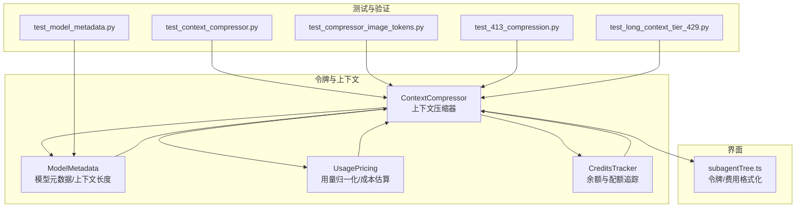
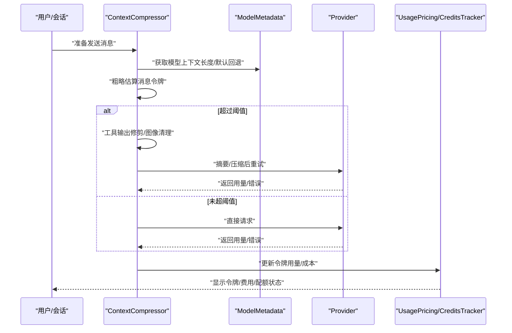
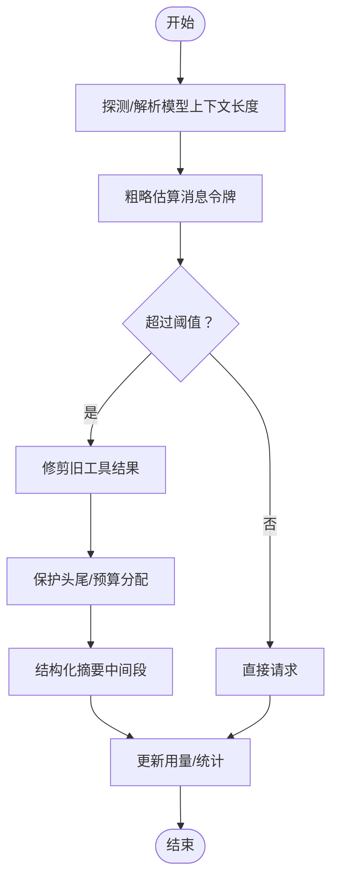
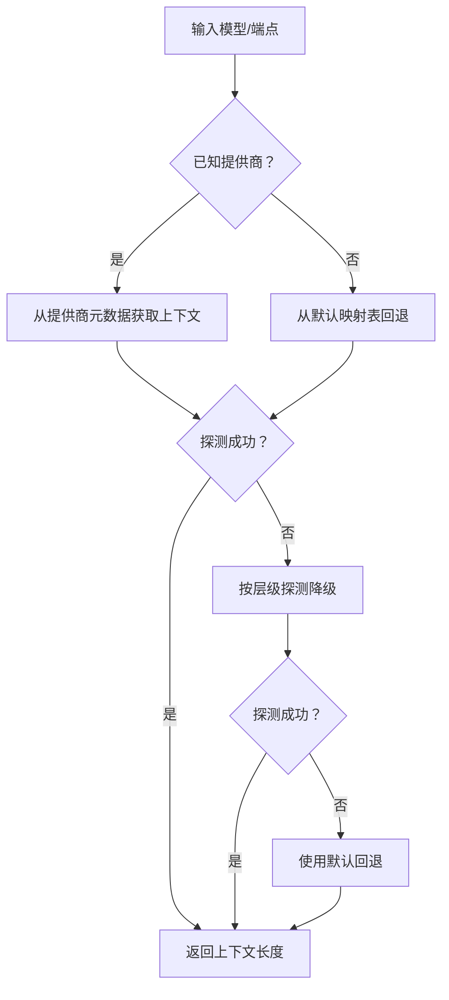
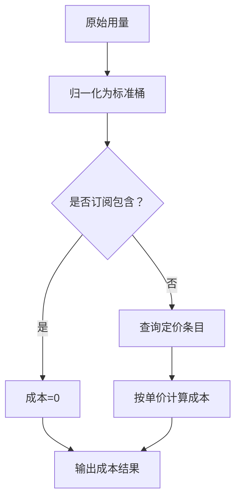
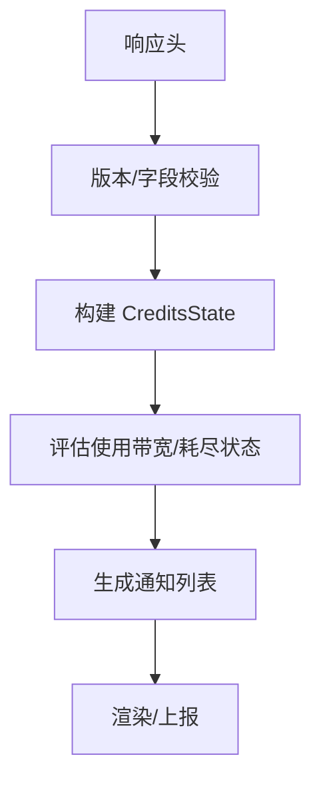
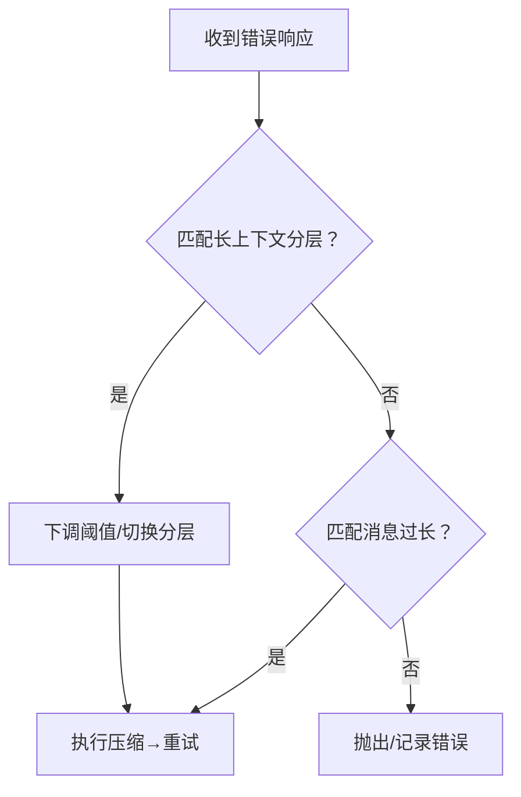
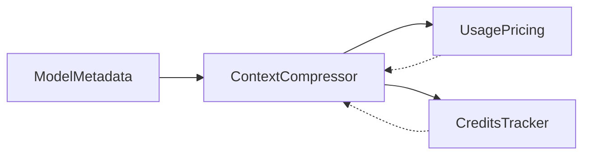

# 令牌管理

<cite>
**本文引用的文件**
- [agent/context_compressor.py](file://agent/context_compressor.py)
- [agent/model_metadata.py](file://agent/model_metadata.py)
- [agent/usage_pricing.py](file://agent/usage_pricing.py)
- [agent/credits_tracker.py](file://agent/credits_tracker.py)
- [tests/agent/test_context_compressor.py](file://tests/agent/test_context_compressor.py)
- [tests/agent/test_model_metadata.py](file://tests/agent/test_model_metadata.py)
- [tests/agent/test_compressor_image_tokens.py](file://tests/agent/test_compressor_image_tokens.py)
- [tests/run_agent/test_413_compression.py](file://tests/run_agent/test_413_compression.py)
- [tests/run_agent/test_long_context_tier_429.py](file://tests/run_agent/test_long_context_tier_429.py)
- [ui-tui/src/lib/subagentTree.ts](file://ui-tui/src/lib/subagentTree.ts)
</cite>

## 目录
1. [简介](#简介)
2. [项目结构](#项目结构)
3. [核心组件](#核心组件)
4. [架构总览](#架构总览)
5. [详细组件分析](#详细组件分析)
6. [依赖关系分析](#依赖关系分析)
7. [性能考量](#性能考量)
8. [故障排查指南](#故障排查指南)
9. [结论](#结论)
10. [附录](#附录)

## 简介
本技术文档系统性阐述 Hermes Agent 的令牌（Token）管理系统，覆盖以下主题：
- 令牌估算机制：包括“粗略消息令牌估算”“图像令牌估算”“多模态内容令牌计算”
- 上下文长度计算与使用跟踪：模型上下文探测、阈值设定、动态调整
- 预算与阈值：令牌预算分配、压缩触发条件、阈值安全边界
- 使用统计与成本追踪：令牌用量归一化、定价来源、成本估算
- 监控与可视化：令牌与费用在界面中的展示
- 溢出处理与回退：长上下文分层错误识别、自动压缩、失败回退
- 开发者指南：配置项、调试技巧、最佳实践

## 项目结构
围绕令牌管理的关键模块与测试如下：
- 令牌估算与上下文压缩：agent/context_compressor.py
- 模型元数据与上下文长度：agent/model_metadata.py
- 成本与用量归一化：agent/usage_pricing.py
- 余额与配额追踪（Nous 专用）：agent/credits_tracker.py
- 关键行为的单元测试与集成测试：tests 下多个 test_* 文件
- UI 层对令牌与费用的格式化展示：ui-tui/src/lib/subagentTree.ts

图示来源
- [agent/context_compressor.py](file://agent/context_compressor.py)
- [agent/model_metadata.py](file://agent/model_metadata.py)
- [agent/usage_pricing.py](file://agent/usage_pricing.py)
- [agent/credits_tracker.py](file://agent/credits_tracker.py)
- [tests/agent/test_context_compressor.py](file://tests/agent/test_context_compressor.py)
- [tests/agent/test_model_metadata.py](file://tests/agent/test_model_metadata.py)
- [tests/agent/test_compressor_image_tokens.py](file://tests/agent/test_compressor_image_tokens.py)
- [tests/run_agent/test_413_compression.py](file://tests/run_agent/test_413_compression.py)
- [tests/run_agent/test_long_context_tier_429.py](file://tests/run_agent/test_long_context_tier_429.py)
- [ui-tui/src/lib/subagentTree.ts](file://ui-tui/src/lib/subagentTree.ts)

章节来源
- [agent/context_compressor.py](file://agent/context_compressor.py)
- [agent/model_metadata.py](file://agent/model_metadata.py)
- [agent/usage_pricing.py](file://agent/usage_pricing.py)
- [agent/credits_tracker.py](file://agent/credits_tracker.py)
- [tests/agent/test_context_compressor.py](file://tests/agent/test_context_compressor.py)
- [tests/agent/test_model_metadata.py](file://tests/agent/test_model_metadata.py)
- [tests/agent/test_compressor_image_tokens.py](file://tests/agent/test_compressor_image_tokens.py)
- [tests/run_agent/test_413_compression.py](file://tests/run_agent/test_413_compression.py)
- [tests/run_agent/test_long_context_tier_429.py](file://tests/run_agent/test_long_context_tier_429.py)
- [ui-tui/src/lib/subagentTree.ts](file://ui-tui/src/lib/subagentTree.ts)

## 核心组件
- 上下文压缩器（ContextCompressor）
  - 负责在请求前进行“预估-压缩-再试”的循环，避免超出模型上下文
  - 提供工具输出修剪、图像媒体清理、结构化摘要等能力
- 模型元数据（ModelMetadata）
  - 解析/探测模型上下文长度，提供默认回退与探测降级策略
- 用量与定价（UsagePricing）
  - 归一化不同提供商的用量字段，查询官方或模型元数据中的定价并估算成本
- 余额与配额追踪（CreditsTracker）
  - 解析 Nous 专属余额头信息，生成额度使用状态与提示

章节来源
- [agent/context_compressor.py](file://agent/context_compressor.py)
- [agent/model_metadata.py](file://agent/model_metadata.py)
- [agent/usage_pricing.py](file://agent/usage_pricing.py)
- [agent/credits_tracker.py](file://agent/credits_tracker.py)

## 架构总览
令牌管理贯穿“预估—压缩—请求—计费—监控”的闭环。

图示来源
- [agent/context_compressor.py](file://agent/context_compressor.py)
- [agent/model_metadata.py](file://agent/model_metadata.py)
- [agent/usage_pricing.py](file://agent/usage_pricing.py)
- [agent/credits_tracker.py](file://agent/credits_tracker.py)

## 详细组件分析

### 组件A：上下文压缩器（ContextCompressor）
- 功能要点
  - 预估阶段：基于字符数估算消息令牌，避免 schema 过度导致的误判
  - 压缩阶段：先修剪旧工具结果，再保护头部与尾部，最后用辅助模型结构化摘要中间段
  - 动态阈值：根据模型上下文与百分比阈值动态计算压缩触发点
  - 图像与多模态：按固定“图像字符等价”计入预算，避免空文本却高开销
  - 失败回退：摘要失败时可选择中止压缩或插入静态占位摘要
- 关键参数
  - 阈值百分比、摘要目标比例、尾部预算、最小上下文长度
- 关键流程
  - 预估→是否压缩→工具修剪→摘要→更新用量→记录日志

图示来源
- [agent/context_compressor.py](file://agent/context_compressor.py)

章节来源
- [agent/context_compressor.py](file://agent/context_compressor.py)
- [tests/agent/test_context_compressor.py](file://tests/agent/test_context_compressor.py)
- [tests/agent/test_compressor_image_tokens.py](file://tests/agent/test_compressor_image_tokens.py)

### 组件B：模型元数据与上下文长度（ModelMetadata）
- 功能要点
  - 默认回退：针对未知模型提供族级默认上下文长度
  - 探测降级：按层级逐步降低尝试，直至命中可用上下文
  - 最小上下文：拒绝低于最小阈值的模型
- 关键常量
  - 默认上下文层级、最小上下文长度、默认族级映射表
- 关键流程
  - 输入模型名/端点→推断提供商→查询元数据→回退默认→缓存

图示来源
- [agent/model_metadata.py](file://agent/model_metadata.py)

章节来源
- [agent/model_metadata.py](file://agent/model_metadata.py)
- [tests/agent/test_model_metadata.py](file://tests/agent/test_model_metadata.py)

### 组件C：用量归一化与成本估算（UsagePricing）
- 功能要点
  - 归一化：统一不同提供商/模式下的输入/输出/缓存/推理令牌
  - 定价：优先官方文档快照，其次模型元数据，再次公开 API
  - 成本：按“每百万令牌”换算美元成本，支持估算/实际两种状态
- 关键流程
  - 输入原始用量→归一化→查询定价→计算成本

图示来源
- [agent/usage_pricing.py](file://agent/usage_pricing.py)

章节来源
- [agent/usage_pricing.py](file://agent/usage_pricing.py)

### 组件D：余额与配额追踪（CreditsTracker）
- 功能要点
  - 解析 Nous 专属余额头，生成额度使用率、耗尽状态、工具池门控等
  - 使用带宽（band）策略生成“使用率阶梯”提示
  - 支持开发夹具（fixture）模拟状态
- 关键流程
  - 接收响应头→校验/解析→生成状态→评估通知→渲染

图示来源
- [agent/credits_tracker.py](file://agent/credits_tracker.py)

章节来源
- [agent/credits_tracker.py](file://agent/credits_tracker.py)

### 组件E：溢出处理与回退（长上下文分层与压缩）
- 行为说明
  - 429/长上下文分层：识别“额外用量/长上下文”关键词组合，触发阈值下调
  - 413/消息过长：自动压缩后重试；若禁用压缩则报错
- 关键流程
  - 错误码/消息匹配→阈值下调→压缩→重试→成功

图示来源
- [tests/run_agent/test_long_context_tier_429.py](file://tests/run_agent/test_long_context_tier_429.py)
- [tests/run_agent/test_413_compression.py](file://tests/run_agent/test_413_compression.py)

章节来源
- [tests/run_agent/test_long_context_tier_429.py](file://tests/run_agent/test_long_context_tier_429.py)
- [tests/run_agent/test_413_compression.py](file://tests/run_agent/test_413_compression.py)

## 依赖关系分析
- ContextCompressor 依赖 ModelMetadata 获取上下文长度，并在压缩后更新用量
- UsagePricing 依赖模型元数据与官方定价快照进行成本估算
- CreditsTracker 与 UsagePricing 独立工作，前者面向 Nous 平台余额，后者面向通用成本追踪
- 测试覆盖了令牌估算、图像计费、压缩阈值、长上下文分层与溢出回退

图示来源
- [agent/context_compressor.py](file://agent/context_compressor.py)
- [agent/model_metadata.py](file://agent/model_metadata.py)
- [agent/usage_pricing.py](file://agent/usage_pricing.py)
- [agent/credits_tracker.py](file://agent/credits_tracker.py)

章节来源
- [agent/context_compressor.py](file://agent/context_compressor.py)
- [agent/model_metadata.py](file://agent/model_metadata.py)
- [agent/usage_pricing.py](file://agent/usage_pricing.py)
- [agent/credits_tracker.py](file://agent/credits_tracker.py)

## 性能考量
- 估算开销：粗略估算以字符数除以常量，O(n) 线性，适合高频预检
- 压缩成本：摘要调用为昂贵操作，应尽量通过修剪与预算控制减少触发
- 缓存策略：模型元数据与端点元数据具备 TTL 缓存，降低网络开销
- I/O 优化：图像清理与工具结果修剪在压缩前完成，避免重复传输大体积媒体

## 故障排查指南
- 令牌估算偏高/偏低
  - 检查消息是否包含多模态内容，确认图像部分按固定字符等价计入
  - 参考测试用例验证估算逻辑与图像计费
- 压缩无效或频繁触发
  - 调整阈值百分比与摘要目标比例，避免“无效压缩”导致的抖动
  - 查看压缩失败冷却与回退策略
- 长上下文分层错误
  - 确认错误消息是否同时包含“额外用量/长上下文”关键词
  - 观察阈值下调后的行为
- 成本估算不准确
  - 核对定价来源（官方快照/模型元数据/API），确认是否订阅包含
  - 检查用量归一化是否正确拆分缓存读写与输入令牌

章节来源
- [tests/agent/test_compressor_image_tokens.py](file://tests/agent/test_compressor_image_tokens.py)
- [tests/agent/test_context_compressor.py](file://tests/agent/test_context_compressor.py)
- [tests/run_agent/test_long_context_tier_429.py](file://tests/run_agent/test_long_context_tier_429.py)
- [tests/run_agent/test_413_compression.py](file://tests/run_agent/test_413_compression.py)

## 结论
Hermes Agent 的令牌管理系统通过“粗略估算—预算控制—结构化压缩—用量归一化—成本追踪”的闭环，有效保障长对话场景下的稳定性与可控成本。图像与多模态内容的计费策略、长上下文分层的自动降级、以及摘要失败的回退机制共同构成了鲁棒的令牌治理方案。建议在生产环境中结合阈值调优、预算分配与监控告警，持续优化压缩策略与成本表现。

## 附录

### 令牌估算与多模态计费要点
- 粗略估算：消息总字符数除以常量，加偏置，适用于快速判断
- 图像计费：每张图片按固定“字符等价”计入，避免对 base64 字符串长度的误判
- 多模态数组：仅统计文本部分字符，图像部分按固定等价计入

章节来源
- [agent/context_compressor.py](file://agent/context_compressor.py)
- [tests/agent/test_model_metadata.py](file://tests/agent/test_model_metadata.py)
- [tests/agent/test_compressor_image_tokens.py](file://tests/agent/test_compressor_image_tokens.py)

### 配置与阈值建议
- 阈值百分比：建议在 50% 左右起步，结合模型上下文长度与任务复杂度微调
- 摘要目标比例：建议 15%~25%，兼顾信息保留与空间节省
- 尾部预算：建议占阈值的 15%~25%，确保最新交互不被过度裁剪
- 图像计费：默认每张约 1600 令牌字符等价，用于预算与决策

章节来源
- [agent/context_compressor.py](file://agent/context_compressor.py)

### 监控与可视化
- UI 层对令牌与费用进行紧凑格式化展示，便于实时观察
- 建议在网关/CLI 中同步展示令牌总量、输出占比、费用概览与配额状态

章节来源
- [ui-tui/src/lib/subagentTree.ts](file://ui-tui/src/lib/subagentTree.ts)