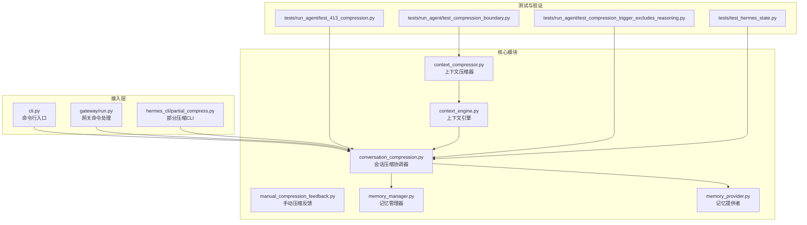
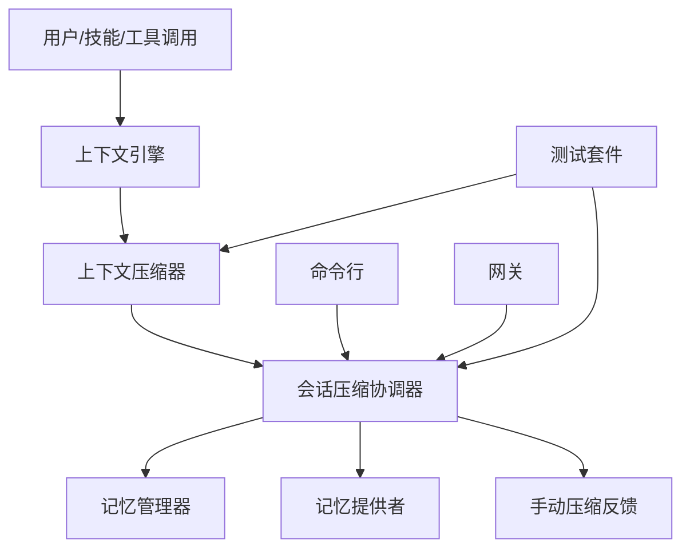
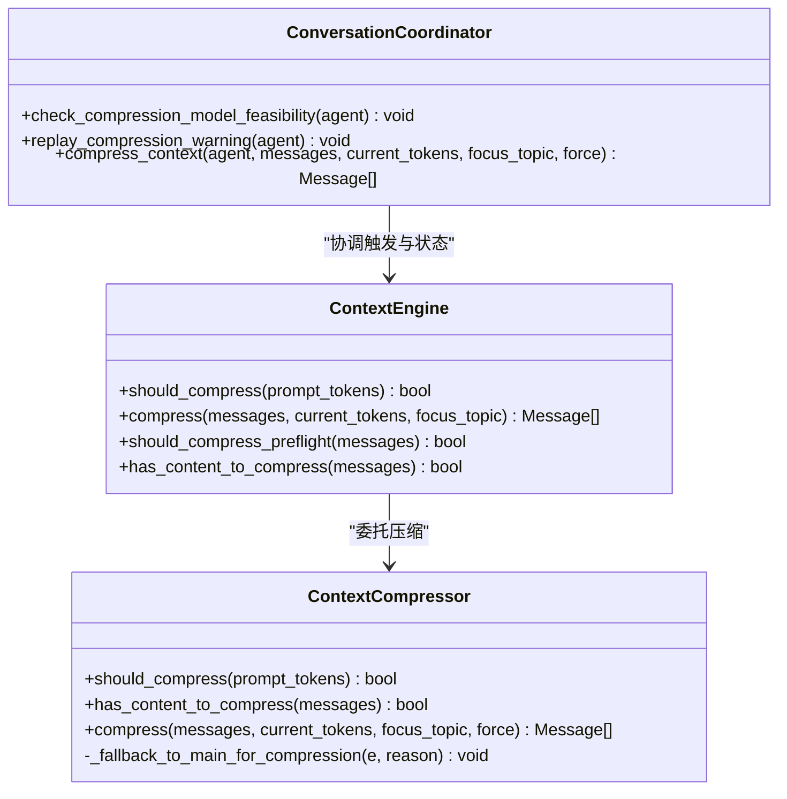
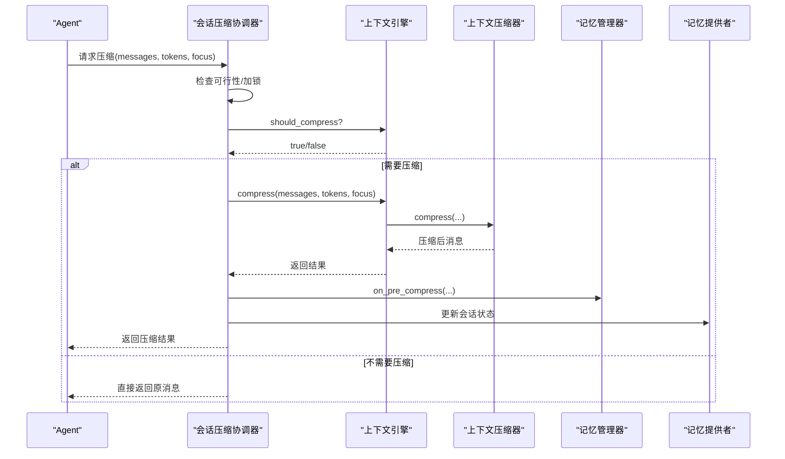
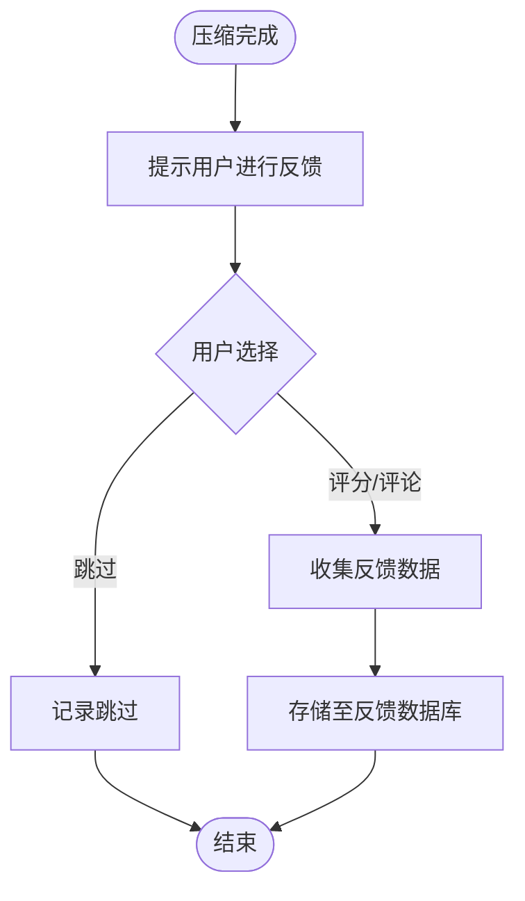
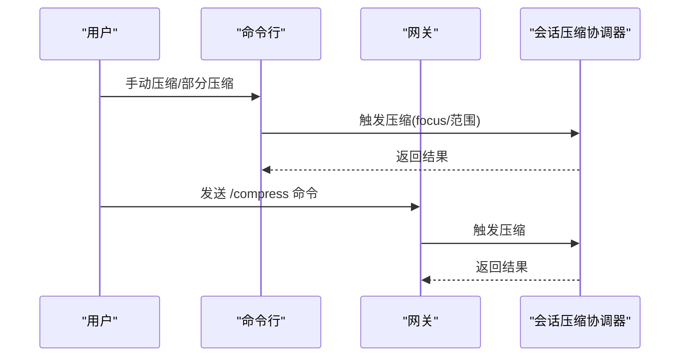
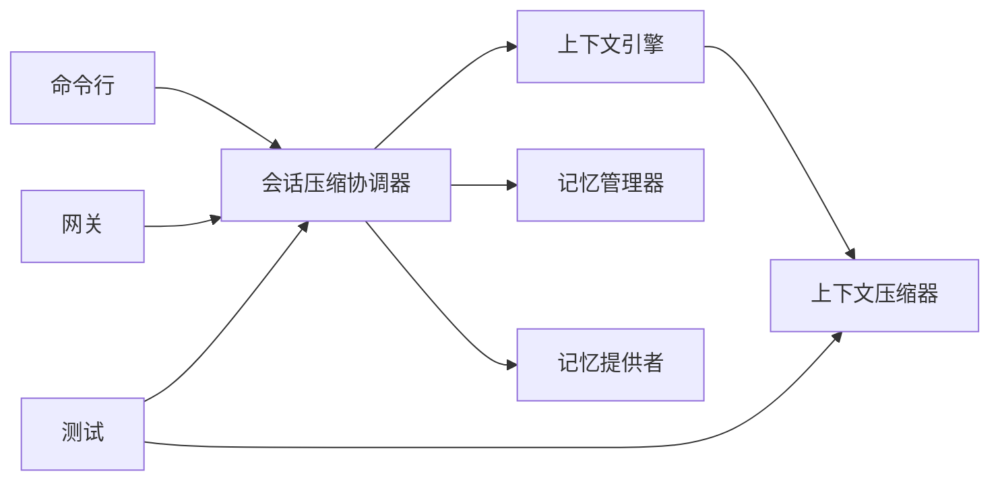

# 对话压缩

<cite>
**本文引用的文件**
- [agent/context_compressor.py](file://agent/context_compressor.py)
- [agent/conversation_compression.py](file://agent/conversation_compression.py)
- [agent/manual_compression_feedback.py](file://agent/manual_compression_feedback.py)
- [agent/memory_manager.py](file://agent/memory_manager.py)
- [agent/memory_provider.py](file://agent/memory_provider.py)
- [agent/context_engine.py](file://agent/context_engine.py)
- [hermes_cli/partial_compress.py](file://hermes_cli/partial_compress.py)
- [cli.py](file://cli.py)
- [gateway/run.py](file://gateway/run.py)
- [tests/run_agent/test_413_compression.py](file://tests/run_agent/test_413_compression.py)
- [tests/run_agent/test_compression_boundary.py](file://tests/run_agent/test_compression_boundary.py)
- [tests/run_agent/test_compression_trigger_excludes_reasoning.py](file://tests/run_agent/test_compression_trigger_excludes_reasoning.py)
- [tests/test_hermes_state.py](file://tests/test_hermes_state.py)
- [tests/agent/test_context_compressor.py](file://tests/agent/test_context_compressor.py)
- [tests/agent/test_compressor_historical_media.py](file://tests/agent/test_compressor_historical_media.py)
- [tests/agent/test_compressor_image_tokens.py](file://tests/agent/test_compressor_image_tokens.py)
- [tests/cli/test_manual_compress.py](file://tests/cli/test_manual_compress.py)
- [tests/cli/test_partial_compress.py](file://tests/cli/test_partial_compress.py)
- [tests/gateway/test_compress_command.py](file://tests/gateway/test_compress_command.py)
- [trajectory_compressor.py](file://trajectory_compressor.py)
</cite>

## 目录
1. [引言](#引言)
2. [项目结构](#项目结构)
3. [核心组件](#核心组件)
4. [架构总览](#架构总览)
5. [详细组件分析](#详细组件分析)
6. [依赖关系分析](#依赖关系分析)
7. [性能考量](#性能考量)
8. [故障排查指南](#故障排查指南)
9. [结论](#结论)
10. [附录](#附录)

## 引言
本文件面向开发者与高级用户，系统化阐述 Hermes Agent 的“对话压缩”能力：如何在长上下文场景中高效保留关键信息、降低上下文开销、保障推理与工具调用的完整性；如何通过手动反馈与质量控制闭环提升压缩效果；以及如何配置触发条件、压缩粒度与时间窗口等参数。文档同时给出架构图、流程图与序列图，帮助快速理解与定位问题。

## 项目结构
对话压缩相关代码主要分布在以下模块：
- 上下文压缩器：负责具体的历史消息压缩与阈值判断
- 会话压缩协调器：负责压缩触发、锁机制与回放警告
- 手动压缩反馈：收集用户对压缩结果的主观评价
- CLI/Gateway 接入点：提供命令行与网关入口以触发压缩
- 测试与验证：覆盖边界条件、HTTP 413 压缩、媒体与图像令牌处理、压缩触发排除推理内容等

图表来源
- [agent/context_compressor.py](file://agent/context_compressor.py)
- [agent/context_engine.py](file://agent/context_engine.py)
- [agent/conversation_compression.py](file://agent/conversation_compression.py)
- [agent/manual_compression_feedback.py](file://agent/manual_compression_feedback.py)
- [agent/memory_manager.py](file://agent/memory_manager.py)
- [agent/memory_provider.py](file://agent/memory_provider.py)
- [cli.py](file://cli.py)
- [gateway/run.py](file://gateway/run.py)
- [hermes_cli/partial_compress.py](file://hermes_cli/partial_compress.py)
- [tests/run_agent/test_413_compression.py](file://tests/run_agent/test_413_compression.py)
- [tests/run_agent/test_compression_boundary.py](file://tests/run_agent/test_compression_boundary.py)
- [tests/run_agent/test_compression_trigger_excludes_reasoning.py](file://tests/run_agent/test_compression_trigger_excludes_reasoning.py)
- [tests/test_hermes_state.py](file://tests/test_hermes_state.py)

章节来源
- [agent/context_compressor.py](file://agent/context_compressor.py)
- [agent/conversation_compression.py](file://agent/conversation_compression.py)
- [agent/manual_compression_feedback.py](file://agent/manual_compression_feedback.py)
- [agent/memory_manager.py](file://agent/memory_manager.py)
- [agent/memory_provider.py](file://agent/memory_provider.py)
- [agent/context_engine.py](file://agent/context_engine.py)
- [cli.py](file://cli.py)
- [gateway/run.py](file://gateway/run.py)
- [hermes_cli/partial_compress.py](file://hermes_cli/partial_compress.py)
- [tests/run_agent/test_413_compression.py](file://tests/run_agent/test_413_compression.py)
- [tests/run_agent/test_compression_boundary.py](file://tests/run_agent/test_compression_boundary.py)
- [tests/run_agent/test_compression_trigger_excludes_reasoning.py](file://tests/run_agent/test_compression_trigger_excludes_reasoning.py)
- [tests/test_hermes_state.py](file://tests/test_hermes_state.py)

## 核心组件
- 上下文压缩器（Context Compressor）
  - 负责根据阈值与策略对历史消息进行压缩，确保当前提示词长度不超过模型上下文上限
  - 提供“是否需要压缩”“是否有可压缩内容”“执行压缩”的统一接口
- 会话压缩协调器（Conversation Compression Coordinator）
  - 管理压缩触发条件、压缩锁、会话级警告与回放
  - 协调记忆提供者与记忆管理器在压缩前后的状态
- 上下文引擎（Context Engine）
  - 将压缩决策与执行封装为统一接口，支持预检压缩与边界保护
- 手动压缩反馈（Manual Compression Feedback）
  - 收集用户对压缩结果的主观评分与建议，形成质量闭环
- CLI/Gateway 接入
  - 提供命令行与网关命令入口，支持强制压缩、部分压缩与手动压缩

章节来源
- [agent/context_compressor.py](file://agent/context_compressor.py)
- [agent/conversation_compression.py](file://agent/conversation_compression.py)
- [agent/context_engine.py](file://agent/context_engine.py)
- [agent/manual_compression_feedback.py](file://agent/manual_compression_feedback.py)
- [cli.py](file://cli.py)
- [gateway/run.py](file://gateway/run.py)
- [hermes_cli/partial_compress.py](file://hermes_cli/partial_compress.py)

## 架构总览
对话压缩在系统中的位置如下：上游消息经由上下文引擎与压缩器进行判定与处理，必要时触发会话压缩协调器进行锁控制与状态维护；下游通过记忆管理器与记忆提供者持久化或回放压缩结果；CLI/Gateway 提供交互入口；测试覆盖关键边界与回归场景。

图表来源
- [agent/context_engine.py](file://agent/context_engine.py)
- [agent/context_compressor.py](file://agent/context_compressor.py)
- [agent/conversation_compression.py](file://agent/conversation_compression.py)
- [agent/memory_manager.py](file://agent/memory_manager.py)
- [agent/memory_provider.py](file://agent/memory_provider.py)
- [agent/manual_compression_feedback.py](file://agent/manual_compression_feedback.py)
- [cli.py](file://cli.py)
- [gateway/run.py](file://gateway/run.py)
- [tests/run_agent/test_413_compression.py](file://tests/run_agent/test_413_compression.py)

## 详细组件分析

### 上下文压缩器（Context Compressor）
职责与接口要点：
- 判定是否需要压缩：基于当前提示词长度与阈值
- 检查是否存在可压缩内容：过滤不可压缩项（如推理链）
- 执行压缩：按策略对历史消息进行摘要、裁剪或合并
- 边界保护：避免破坏工具结果、会话标识等关键片段
- 回退策略：当主压缩失败时，回退到备用路径

图表来源
- [agent/context_compressor.py](file://agent/context_compressor.py)
- [agent/context_engine.py](file://agent/context_engine.py)
- [agent/conversation_compression.py](file://agent/conversation_compression.py)

章节来源
- [agent/context_compressor.py](file://agent/context_compressor.py)
- [agent/context_engine.py](file://agent/context_engine.py)

### 会话压缩协调器（Conversation Compression Coordinator）
职责与流程：
- 压缩可行性检查：校验模型上下文能力与订阅等级
- 压缩触发与锁：在并发场景下避免重复压缩
- 回放警告：在压缩后向用户提示压缩行为
- 与记忆系统协作：在压缩前后更新会话状态与持久化

图表来源
- [agent/conversation_compression.py](file://agent/conversation_compression.py)
- [agent/context_engine.py](file://agent/context_engine.py)
- [agent/context_compressor.py](file://agent/context_compressor.py)
- [agent/memory_manager.py](file://agent/memory_manager.py)
- [agent/memory_provider.py](file://agent/memory_provider.py)

章节来源
- [agent/conversation_compression.py](file://agent/conversation_compression.py)
- [agent/memory_manager.py](file://agent/memory_manager.py)
- [agent/memory_provider.py](file://agent/memory_provider.py)

### 手动压缩反馈（Manual Compression Feedback）
目标：
- 收集用户对压缩结果的主观评分与改进建议
- 形成质量闭环，驱动压缩策略迭代

工作流：
- 在压缩完成后触发反馈收集
- 将用户输入与压缩前/后对比数据打包上报
- 用于后续统计与策略自适应

图表来源
- [agent/manual_compression_feedback.py](file://agent/manual_compression_feedback.py)

章节来源
- [agent/manual_compression_feedback.py](file://agent/manual_compression_feedback.py)

### CLI 与网关接入
- 命令行入口：提供手动压缩、部分压缩等子命令
- 网关命令：在消息事件中响应“/compress”等指令，触发压缩流程
- 部分压缩：允许用户指定范围或主题进行定向压缩

图表来源
- [cli.py](file://cli.py)
- [gateway/run.py](file://gateway/run.py)
- [hermes_cli/partial_compress.py](file://hermes_cli/partial_compress.py)
- [agent/conversation_compression.py](file://agent/conversation_compression.py)

章节来源
- [cli.py](file://cli.py)
- [gateway/run.py](file://gateway/run.py)
- [hermes_cli/partial_compress.py](file://hermes_cli/partial_compress.py)

## 依赖关系分析
- 上下文引擎依赖上下文压缩器执行实际压缩
- 会话压缩协调器依赖上下文引擎进行决策，并与记忆系统协作
- CLI/Gateway 作为外部入口，最终调用协调器
- 测试覆盖了 HTTP 413 场景、边界保护、触发排除推理内容、状态一致性等

图表来源
- [agent/context_engine.py](file://agent/context_engine.py)
- [agent/context_compressor.py](file://agent/context_compressor.py)
- [agent/conversation_compression.py](file://agent/conversation_compression.py)
- [agent/memory_manager.py](file://agent/memory_manager.py)
- [agent/memory_provider.py](file://agent/memory_provider.py)
- [cli.py](file://cli.py)
- [gateway/run.py](file://gateway/run.py)
- [tests/run_agent/test_413_compression.py](file://tests/run_agent/test_413_compression.py)

章节来源
- [agent/context_engine.py](file://agent/context_engine.py)
- [agent/context_compressor.py](file://agent/context_compressor.py)
- [agent/conversation_compression.py](file://agent/conversation_compression.py)
- [agent/memory_manager.py](file://agent/memory_manager.py)
- [agent/memory_provider.py](file://agent/memory_provider.py)
- [cli.py](file://cli.py)
- [gateway/run.py](file://gateway/run.py)
- [tests/run_agent/test_413_compression.py](file://tests/run_agent/test_413_compression.py)

## 性能考量
- 压缩复杂度
  - 压缩算法通常与消息数量与长度呈线性或近似线性关系，需关注大段文本与多媒体消息的处理成本
- 触发频率
  - 合理设置阈值与窗口，避免频繁压缩导致额外开销
- 并发与锁
  - 在多线程/多进程场景下，压缩锁可避免重复压缩与竞态
- 缓存与预检
  - 预检压缩可减少不必要的计算；缓存常用摘要有助于加速

## 故障排查指南
常见问题与定位思路：
- 压缩未生效
  - 检查是否达到阈值与触发条件
  - 确认“是否有可压缩内容”判断逻辑
- 压缩破坏关键信息
  - 核对边界保护规则（工具结果、会话标识等）
  - 使用测试用例验证边界场景
- HTTP 413 上下文溢出
  - 确认预压缩与重试策略
  - 检查订阅等级与模型上下文限制
- 并发冲突
  - 关注压缩锁与会话状态一致性
  - 查看状态测试用例

章节来源
- [tests/run_agent/test_413_compression.py](file://tests/run_agent/test_413_compression.py)
- [tests/run_agent/test_compression_boundary.py](file://tests/run_agent/test_compression_boundary.py)
- [tests/test_hermes_state.py](file://tests/test_hermes_state.py)
- [tests/agent/test_context_compressor.py](file://tests/agent/test_context_compressor.py)
- [tests/agent/test_compressor_historical_media.py](file://tests/agent/test_compressor_historical_media.py)
- [tests/agent/test_compressor_image_tokens.py](file://tests/agent/test_compressor_image_tokens.py)

## 结论
对话压缩是长上下文场景下的关键能力，通过“阈值触发 + 边界保护 + 可靠回放 + 用户反馈”的闭环设计，在保证信息完整性的同时显著降低上下文开销。配合 CLI/Gateway 的便捷入口与完善的测试覆盖，系统具备良好的可运维性与可扩展性。

## 附录

### 触发条件、粒度与时间窗口
- 触发条件
  - 当前提示词长度超过阈值或接近模型上下文上限
  - 预检阶段检测到潜在溢出风险
- 压缩粒度
  - 全量压缩：对历史消息整体处理
  - 部分压缩：按主题/范围定向压缩
- 时间窗口
  - 可结合会话时间戳与消息序号设定滚动窗口，避免无限增长

章节来源
- [agent/context_engine.py](file://agent/context_engine.py)
- [agent/context_compressor.py](file://agent/context_compressor.py)
- [hermes_cli/partial_compress.py](file://hermes_cli/partial_compress.py)

### 适应性调整与个性化配置
- 自适应
  - 根据历史压缩效果与用户反馈动态调整阈值与策略
- 个性化
  - 支持按模型、订阅等级与任务类型差异化配置
- 配置迁移
  - CLI 配置迁移逻辑可将旧配置平滑迁移到辅助压缩配置

章节来源
- [hermes_cli/config.py](file://hermes_cli/config.py)
- [trajectory_compressor.py](file://trajectory_compressor.py)

### 质量评估与监控指标
- 指标建议
  - 压缩命中率、平均压缩比、上下文利用率、工具结果完整性、用户满意度评分
- 监控
  - 记录压缩前后消息数、令牌数变化与耗时
  - 汇总边界破坏事件与回退次数

章节来源
- [agent/manual_compression_feedback.py](file://agent/manual_compression_feedback.py)
- [tests/run_agent/test_413_compression.py](file://tests/run_agent/test_413_compression.py)

### 开发者实现细节与扩展指南
- 实现要点
  - 在上下文压缩器中新增策略时，确保“是否有可压缩内容”与“边界保护”逻辑完备
  - 在会话压缩协调器中增加日志与可观测性，便于定位并发问题
- 调试方法
  - 使用测试用例复现边界场景（如 HTTP 413、媒体/图像令牌、触发排除推理内容）
  - 通过 CLI/Gateway 快速验证压缩效果
- 扩展方向
  - 引入更细粒度的主题建模与跨轮次连续性保持
  - 增强多模态内容的压缩策略（图像、视频等）

章节来源
- [tests/run_agent/test_413_compression.py](file://tests/run_agent/test_413_compression.py)
- [tests/run_agent/test_compression_boundary.py](file://tests/run_agent/test_compression_boundary.py)
- [tests/run_agent/test_compression_trigger_excludes_reasoning.py](file://tests/run_agent/test_compression_trigger_excludes_reasoning.py)
- [tests/cli/test_manual_compress.py](file://tests/cli/test_manual_compress.py)
- [tests/cli/test_partial_compress.py](file://tests/cli/test_partial_compress.py)
- [tests/gateway/test_compress_command.py](file://tests/gateway/test_compress_command.py)