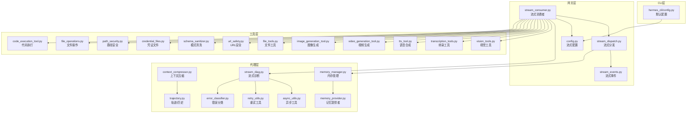
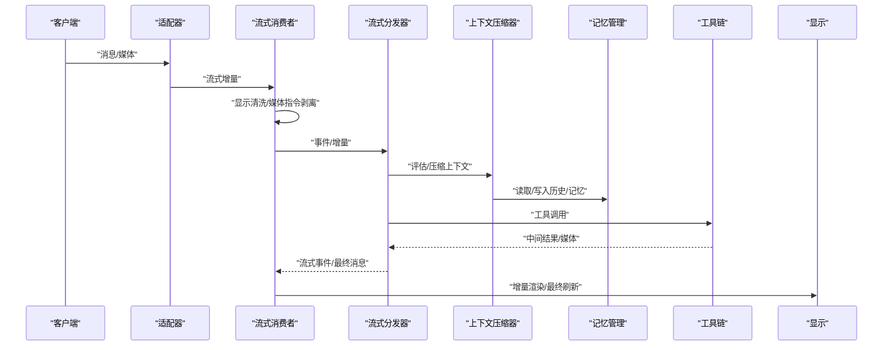
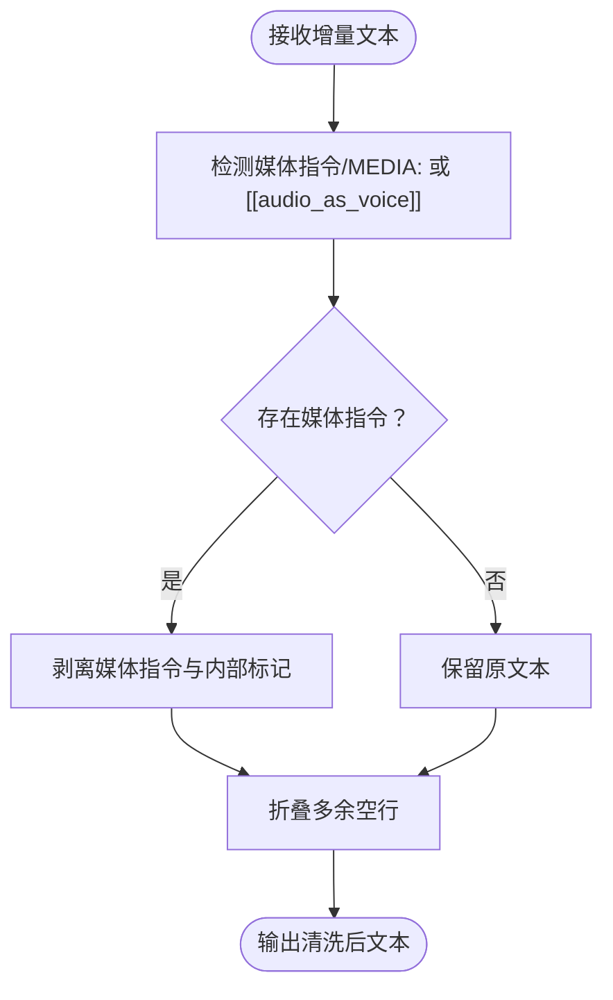
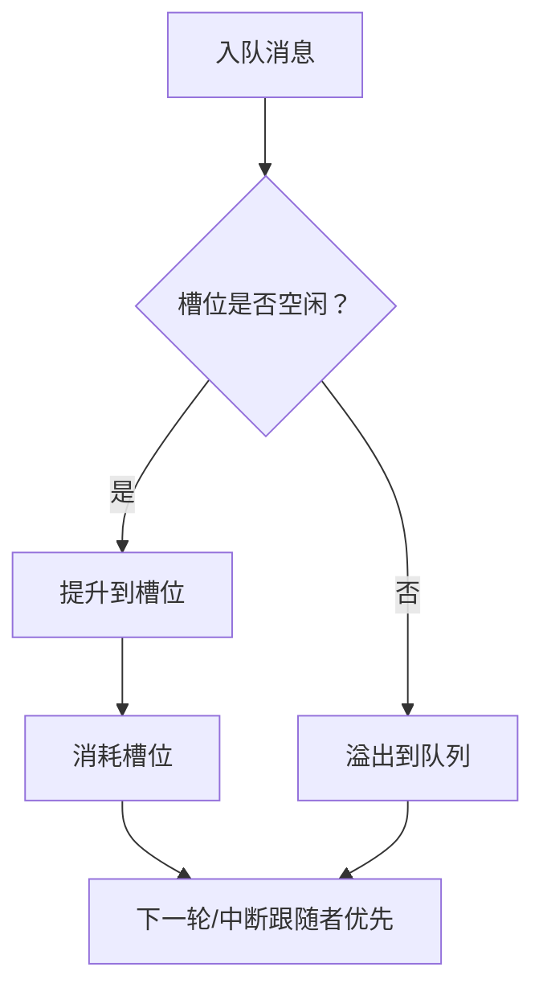
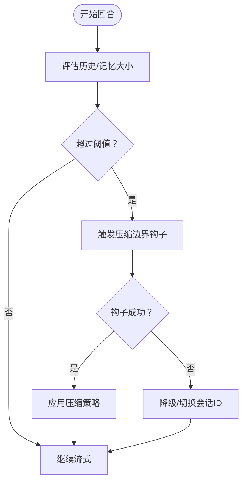
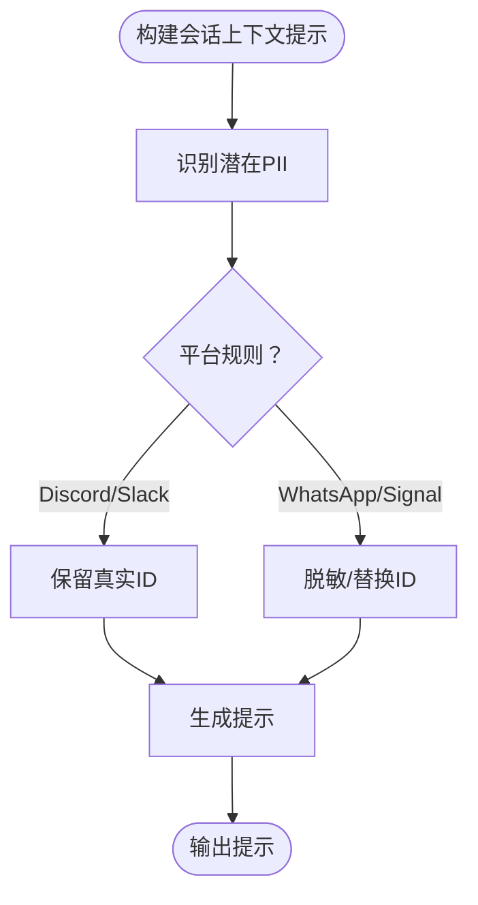
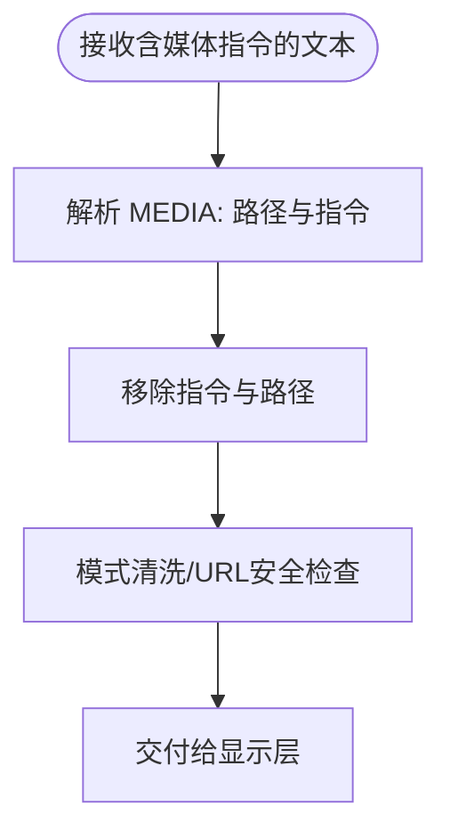
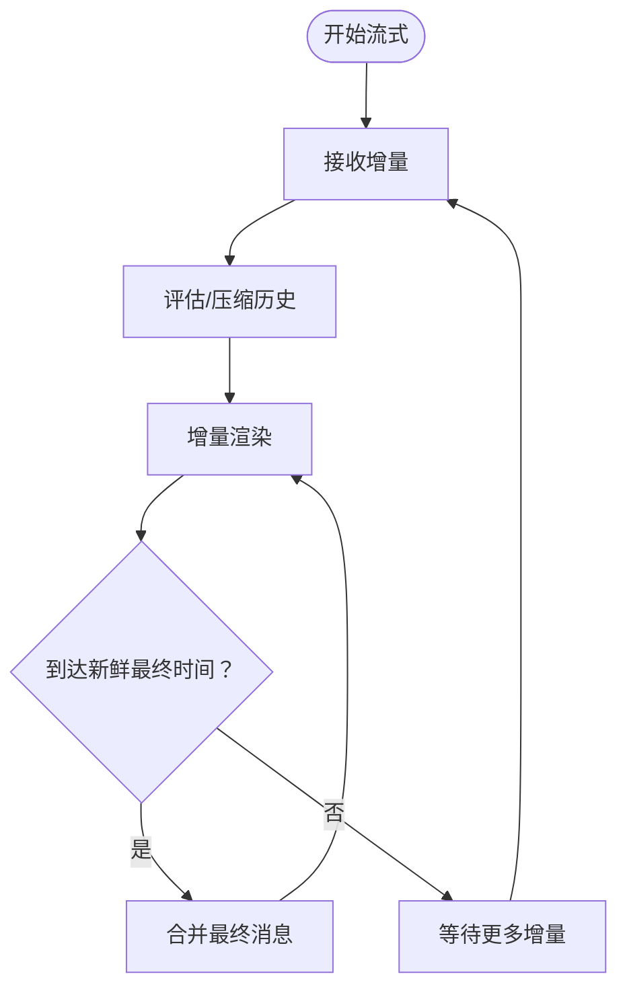
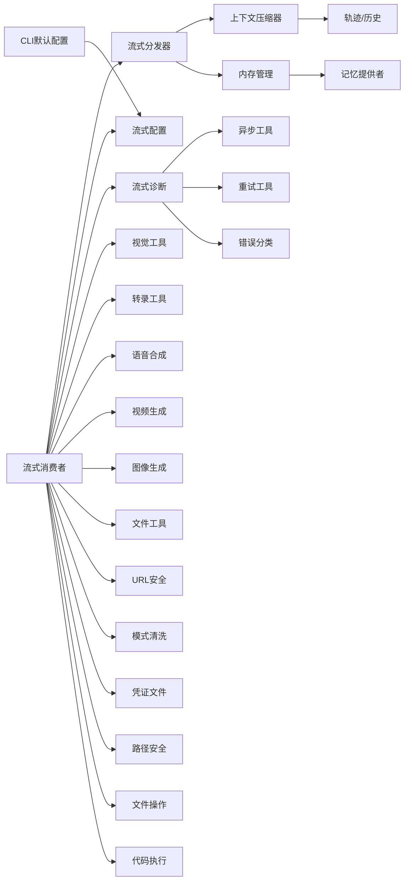

# 流式上下文处理

<cite>
**本文引用的文件**
- [gateway/stream_consumer.py](file://gateway/stream_consumer.py)
- [gateway/stream_dispatch.py](file://gateway/stream_dispatch.py)
- [gateway/stream_events.py](file://gateway/stream_events.py)
- [gateway/config.py](file://gateway/config.py)
- [hermes_cli/config.py](file://hermes_cli/config.py)
- [tests/gateway/test_stream_consumer.py](file://tests/gateway/test_stream_consumer.py)
- [tests/gateway/test_stream_consumer_fresh_final.py](file://tests/gateway/test_stream_consumer_fresh_final.py)
- [tests/gateway/test_per_platform_streaming_defaults.py](file://tests/gateway/test_per_platform_streaming_defaults.py)
- [tests/run_agent/test_run_agent_codex_responses.py](file://tests/run_agent/test_run_agent_codex_responses.py)
- [tests/gateway/test_pii_redaction.py](file://tests/gateway/test_pii_redaction.py)
- [agent/message_sanitization.py](file://agent/message_sanitization.py)
- [agent/redact.py](file://agent/redact.py)
- [agent/think_scrubber.py](file://agent/think_scrubber.py)
- [agent/context_compressor.py](file://agent/context_compressor.py)
- [agent/conversation_compression.py](file://agent/conversation_compression.py)
- [agent/memory_manager.py](file://agent/memory_manager.py)
- [agent/memory_provider.py](file://agent/memory_provider.py)
- [agent/trajectory.py](file://agent/trajectory.py)
- [agent/stream_diag.py](file://agent/stream_diag.py)
- [agent/async_utils.py](file://agent/async_utils.py)
- [agent/retry_utils.py](file://agent/retry_utils.py)
- [agent/error_classifier.py](file://agent/error_classifier.py)
- [agent/tool_guardrails.py](file://agent/tool_guardrails.py)
- [agent/tool_result_classification.py](file://agent/tool_result_classification.py)
- [agent/tool_result_storage.py](file://agent/tool_result_storage.py)
- [agent/tool_output_limits.py](file://agent/tool_output_limits.py)
- [tools/vision_tools.py](file://tools/vision_tools.py)
- [tools/transcription_tools.py](file://tools/transcription_tools.py)
- [tools/tts_tool.py](file://tools/tts_tool.py)
- [tools/video_generation_tool.py](file://tools/video_generation_tool.py)
- [tools/image_generation_tool.py](file://tools/image_generation_tool.py)
- [tools/file_tools.py](file://tools/file_tools.py)
- [tools/url_safety.py](file://tools/url_safety.py)
- [tools/schema_sanitizer.py](file://tools/schema_sanitizer.py)
- [tools/credential_files.py](file://tools/credential_files.py)
- [tools/path_security.py](file://tools/path_security.py)
- [tools/file_operations.py](file://tools/file_operations.py)
- [tools/code_execution_tool.py](file://tools/code_execution_tool.py)
- [tools/browser_tool.py](file://tools/browser_tool.py)
- [tools/web_tools.py](file://tools/web_tools.py)
- [tools/terminal_tool.py](file://tools/terminal_tool.py)
- [tools/mcp_tool.py](file://tools/mcp_tool.py)
- [tools/skill_manager_tool.py](file://tools/skill_manager_tool.py)
- [tools/kanban_tools.py](file://tools/kanban_tools.py)
- [tools/feishu_doc_tool.py](file://tools/feishu_doc_tool.py)
- [tools/feishu_drive_tool.py](file://tools/feishu_drive_tool.py)
- [tools/feishu_doc_tool.py](file://tools/feishu_doc_tool.py)
- [tools/feishu_drive_tool.py](file://tools/feishu_drive_tool.py)
- [tools/feishu_doc_tool.py](file://tools/feishu_doc_tool.py)
- [tools/feishu_drive_tool.py](file://tools/feishu_drive_tool.py)
- [tools/feishu_doc_tool.py](file://tools/feishu_doc_tool.py)
- [tools/feishu_drive_tool.py](file://tools/feishu_drive_tool.py)
- [tools/feishu_doc_tool.py](file://tools/feishu_doc_tool.py)
- [tools/feishu_drive_tool.py](file://tools/feishu_drive_tool.py)
- [tools/feishu_doc_tool.py](file://tools/feishu_doc_tool.py)
- [tools/feishu_drive_tool.py](file://tools/feishu_drive_tool.py)
- [tools/feishu_doc_tool.py](file://tools/feishu_doc_tool.py)
- [tools/feishu_drive_tool.py](file://tools/feishu_drive_tool.py)
- [tools/feishu_doc_tool.py](file://tools/feishu_doc_tool.py)
- [tools/feishu_drive_tool.py](file://tools/feishu_drive_tool.py)
- [tools/feishu_doc_tool.py](file://tools/feishu_doc_tool.py)
- [tools/feishu_drive_tool.py](file://tools/feishu_drive_tool.py)
- [tools/feishu_doc_tool.py](file://tools/feishu_doc_tool.py)
- [tools/feishu_drive_tool.py](file://tools/feishu_drive_tool.py)
- [tools/feishu_doc_tool.py](file://tools/feishu_doc_tool.py)
- [tools/feishu_drive_tool.py](file://tools/feishu_drive_tool.py)
- [tools/feishu_doc_tool.py](file://tools/feishu_doc_tool.py)
- [tools/feishu_drive_tool.py](file://tools/feishu_drive_tool.py)
- [tools/......](file://tools/feishu_doc_tool.py)
- [tools/......](file://tools/feishu_drive_tool.py)
</cite>

## 目录
1. [引言](#引言)
2. [项目结构](#项目结构)
3. [核心组件](#核心组件)
4. [架构总览](#架构总览)
5. [详细组件分析](#详细组件分析)
6. [依赖关系分析](#依赖关系分析)
7. [性能考量](#性能考量)
8. [故障排查指南](#故障排查指南)
9. [结论](#结论)
10. [附录](#附录)

## 引言
本文件系统性阐述 Hermes Agent 的流式上下文处理体系，聚焦于“流式上下文清理器”的工作原理与实现细节，覆盖实时内容过滤、敏感信息保护与隐私维护、令牌跟踪、内存管理与性能优化、流式上下文标记与媒体文件处理、视觉信息管理、流式响应增量压缩与实时更新机制、配置项与调优、错误处理与恢复策略以及调试技巧。目标是帮助开发者在复杂多平台、多传输通道的环境下，构建稳定、安全、高效的流式对话体验。

## 项目结构
围绕流式上下文处理的关键模块主要分布在以下区域：
- 网关层（gateway）：负责流式事件消费、分发、显示配置与平台差异化行为
- CLI 层（hermes_cli）：提供全局与平台级默认配置入口
- 代理层（agent）：上下文压缩、轨迹管理、诊断与异步工具、重试与错误分类
- 工具层（tools）：多媒体与文件处理、URL 安全、模式清洗、凭证与路径安全等
- 测试层（tests）：覆盖流式消费者、新鲜最终消息、平台默认、PII 脱敏、上下文清理回归等

图表来源
- [gateway/stream_consumer.py](file://gateway/stream_consumer.py)
- [gateway/stream_dispatch.py](file://gateway/stream_dispatch.py)
- [gateway/stream_events.py](file://gateway/stream_events.py)
- [gateway/config.py](file://gateway/config.py)
- [hermes_cli/config.py](file://hermes_cli/config.py)
- [agent/context_compressor.py](file://agent/context_compressor.py)
- [agent/trajectory.py](file://agent/trajectory.py)
- [agent/memory_manager.py](file://agent/memory_manager.py)
- [agent/memory_provider.py](file://agent/memory_provider.py)
- [agent/stream_diag.py](file://agent/stream_diag.py)
- [agent/async_utils.py](file://agent/async_utils.py)
- [agent/retry_utils.py](file://agent/retry_utils.py)
- [agent/error_classifier.py](file://agent/error_classifier.py)
- [tools/vision_tools.py](file://tools/vision_tools.py)
- [tools/transcription_tools.py](file://tools/transcription_tools.py)
- [tools/tts_tool.py](file://tools/tts_tool.py)
- [tools/video_generation_tool.py](file://tools/video_generation_tool.py)
- [tools/image_generation_tool.py](file://tools/image_generation_tool.py)
- [tools/file_tools.py](file://tools/file_tools.py)
- [tools/url_safety.py](file://tools/url_safety.py)
- [tools/schema_sanitizer.py](file://tools/schema_sanitizer.py)
- [tools/credential_files.py](file://tools/credential_files.py)
- [tools/path_security.py](file://tools/path_security.py)
- [tools/file_operations.py](file://tools/file_operations.py)
- [tools/code_execution_tool.py](file://tools/code_execution_tool.py)

章节来源
- [gateway/stream_consumer.py](file://gateway/stream_consumer.py)
- [gateway/stream_dispatch.py](file://gateway/stream_dispatch.py)
- [gateway/stream_events.py](file://gateway/stream_events.py)
- [gateway/config.py](file://gateway/config.py)
- [hermes_cli/config.py](file://hermes_cli/config.py)

## 核心组件
- 流式消费者（GatewayStreamConsumer）：负责接收流式增量、进行显示前清洗（去除媒体指令与内部标记）、按平台与配置决定发送节奏与最终消息刷新策略
- 流式分发（StreamDispatcher）：协调会话上下文、触发压缩、调度工具调用与结果回传
- 流式事件（StreamEvents）：定义流式事件模型与状态机
- 流式配置（StreamingConfig）：全局与平台级开关、新鲜最终消息延迟、传输策略等
- 上下文压缩（ContextCompressor）：在流式过程中对历史与记忆进行压缩，控制上下文长度与令牌预算
- 内存管理（MemoryManager/MemoryProvider）：持久化与检索记忆，支持异步与并发访问
- 诊断与重试（StreamDiag/AsyncUtils/RetryUtils/ErrorClassifier）：观测流式性能、异常分类与自动重试
- 工具链（Vision/Transcription/TTS/Video/Image/File/Security）：支撑视觉、音频、文本到语音、视频生成、文件与安全处理

章节来源
- [gateway/stream_consumer.py](file://gateway/stream_consumer.py)
- [gateway/stream_dispatch.py](file://gateway/stream_dispatch.py)
- [gateway/stream_events.py](file://gateway/stream_events.py)
- [gateway/config.py](file://gateway/config.py)
- [agent/context_compressor.py](file://agent/context_compressor.py)
- [agent/memory_manager.py](file://agent/memory_manager.py)
- [agent/memory_provider.py](file://agent/memory_provider.py)
- [agent/stream_diag.py](file://agent/stream_diag.py)
- [agent/async_utils.py](file://agent/async_utils.py)
- [agent/retry_utils.py](file://agent/retry_utils.py)
- [agent/error_classifier.py](file://agent/error_classifier.py)
- [tools/vision_tools.py](file://tools/vision_tools.py)
- [tools/transcription_tools.py](file://tools/transcription_tools.py)
- [tools/tts_tool.py](file://tools/tts_tool.py)
- [tools/video_generation_tool.py](file://tools/video_generation_tool.py)
- [tools/image_generation_tool.py](file://tools/image_generation_tool.py)
- [tools/file_tools.py](file://tools/file_tools.py)
- [tools/url_safety.py](file://tools/url_safety.py)
- [tools/schema_sanitizer.py](file://tools/schema_sanitizer.py)
- [tools/credential_files.py](file://tools/credential_files.py)
- [tools/path_security.py](file://tools/path_security.py)
- [tools/file_operations.py](file://tools/file_operations.py)
- [tools/code_execution_tool.py](file://tools/code_execution_tool.py)

## 架构总览
从客户端输入到最终展示，流式上下文处理遵循如下主干流程：
- 输入经由适配器进入网关，形成流式事件
- 流式消费者接收增量，执行显示清洗与平台差异化处理
- 分发器根据上下文与工具调用计划，驱动压缩与执行
- 诊断与重试保障稳定性，最终以增量或“新鲜最终”消息呈现

图表来源
- [gateway/stream_consumer.py](file://gateway/stream_consumer.py)
- [gateway/stream_dispatch.py](file://gateway/stream_dispatch.py)
- [agent/context_compressor.py](file://agent/context_compressor.py)
- [agent/memory_manager.py](file://agent/memory_manager.py)
- [agent/memory_provider.py](file://agent/memory_provider.py)
- [tools/vision_tools.py](file://tools/vision_tools.py)
- [tools/file_tools.py](file://tools/file_tools.py)

## 详细组件分析

### 组件A：流式消费者（GatewayStreamConsumer）
职责与特性
- 实时增量清洗：移除内部标记与媒体指令，确保仅向用户展示可公开内容
- 平台差异化：针对不同平台（如 Telegram 支持原生流式，Discord 仅编辑流）采用不同策略
- 新鲜最终消息：可配置延迟合并最终消息，减少闪烁与抖动
- 配置驱动：通过 StreamConsumerConfig 与 StreamingConfig 控制行为

关键流程（显示清洗）

图表来源
- [gateway/stream_consumer.py](file://gateway/stream_consumer.py)
- [tests/gateway/test_stream_consumer.py](file://tests/gateway/test_stream_consumer.py)

章节来源
- [gateway/stream_consumer.py](file://gateway/stream_consumer.py)
- [tests/gateway/test_stream_consumer.py](file://tests/gateway/test_stream_consumer.py)
- [tests/gateway/test_stream_consumer_fresh_final.py](file://tests/gateway/test_stream_consumer_fresh_final.py)
- [tests/gateway/test_per_platform_streaming_defaults.py](file://tests/gateway/test_per_platform_streaming_defaults.py)

### 组件B：流式分发器（StreamDispatcher）
职责与特性
- 事件编排：将增量与工具调用整合为有序的流式事件序列
- 上下文压缩：在流式过程中动态压缩历史与记忆，避免超出令牌预算
- 会话状态：维护会话键、排队与溢出策略，保证顺序与公平性

关键流程（队列与溢出）

图表来源
- [gateway/stream_dispatch.py](file://gateway/stream_dispatch.py)
- [tests/gateway/test_queue_consumption.py](file://tests/gateway/test_queue_consumption.py)

章节来源
- [gateway/stream_dispatch.py](file://gateway/stream_dispatch.py)
- [tests/gateway/test_queue_consumption.py](file://tests/gateway/test_queue_consumption.py)

### 组件C：上下文压缩器（ContextCompressor）
职责与特性
- 令牌预算控制：在流式过程中动态评估与压缩历史，确保当前回合可用上下文不被过度占用
- 边界钩子：允许插件在压缩边界处介入，实现自定义策略或失败保护
- 压缩边界回归：在特定边界（如压缩）抛出异常时，仍需保证流程继续

关键流程（压缩边界）

图表来源
- [agent/context_compressor.py](file://agent/context_compressor.py)
- [tests/run_agent/test_compression_boundary_hook.py](file://tests/run_agent/test_compression_boundary_hook.py)

章节来源
- [agent/context_compressor.py](file://agent/context_compressor.py)
- [tests/run_agent/test_compression_boundary_hook.py](file://tests/run_agent/test_compression_boundary_hook.py)

### 组件D：敏感信息脱敏与隐私保护
职责与特性
- PII 脱敏：基于平台差异（如 Discord/Signal/WhatsApp）对用户 ID 等进行脱敏或保留策略
- 上下文清洗：在流式增量中，确保系统提示、上下文头与过期记忆不会泄漏到回调
- 清洗工具：提供状态化清洗器，应对分块传输导致的片段泄漏风险

关键流程（PII 脱敏）

图表来源
- [tests/gateway/test_pii_redaction.py](file://tests/gateway/test_pii_redaction.py)
- [tests/run_agent/test_run_agent_codex_responses.py](file://tests/run_agent/test_run_agent_codex_responses.py)

章节来源
- [tests/gateway/test_pii_redaction.py](file://tests/gateway/test_pii_redaction.py)
- [tests/run_agent/test_run_agent_codex_responses.py](file://tests/run_agent/test_run_agent_codex_responses.py)

### 组件E：媒体文件处理与视觉信息管理
职责与特性
- 视觉工具：支持图像/视频理解、生成与转录
- 文件工具：安全的文件读写、路径隔离与扩展名限制
- URL 安全：对外部链接进行安全校验与清洗
- 模式清洗：对工具输出进行模式化清洗，防止注入与越权

关键流程（媒体指令剥离）

图表来源
- [gateway/stream_consumer.py](file://gateway/stream_consumer.py)
- [tools/vision_tools.py](file://tools/vision_tools.py)
- [tools/file_tools.py](file://tools/file_tools.py)
- [tools/url_safety.py](file://tools/url_safety.py)
- [tools/schema_sanitizer.py](file://tools/schema_sanitizer.py)

章节来源
- [gateway/stream_consumer.py](file://gateway/stream_consumer.py)
- [tools/vision_tools.py](file://tools/vision_tools.py)
- [tools/file_tools.py](file://tools/file_tools.py)
- [tools/url_safety.py](file://tools/url_safety.py)
- [tools/schema_sanitizer.py](file://tools/schema_sanitizer.py)

### 组件F：流式响应处理、增量压缩与实时更新
职责与特性
- 增量压缩：在流式过程中对历史与记忆进行增量压缩，降低令牌占用
- 实时更新：结合“新鲜最终”策略，在一定时间窗口内合并最终消息，减少闪烁
- 诊断与观测：记录流式耗时、吞吐与错误，辅助性能调优

关键流程（增量压缩与最终刷新）

图表来源
- [agent/conversation_compression.py](file://agent/conversation_compression.py)
- [agent/stream_diag.py](file://agent/stream_diag.py)
- [tests/gateway/test_stream_consumer_fresh_final.py](file://tests/gateway/test_stream_consumer_fresh_final.py)

章节来源
- [agent/conversation_compression.py](file://agent/conversation_compression.py)
- [agent/stream_diag.py](file://agent/stream_diag.py)
- [tests/gateway/test_stream_consumer_fresh_final.py](file://tests/gateway/test_stream_consumer_fresh_final.py)

### 组件G：配置选项、性能调优与监控指标
关键配置项
- 全局启用与传输策略：来自 hermes_cli 默认配置与网关配置
- 平台默认：Telegram 开启流式，Discord 关闭编辑流
- 新鲜最终延迟：控制最终消息合并的时间窗口
- 令牌预算与压缩阈值：影响压缩频率与成本

性能调优建议
- 合理设置新鲜最终延迟，平衡实时性与闪烁
- 在高并发场景下，适度放宽压缩阈值，减少频繁压缩开销
- 对媒体密集型任务，提前进行媒体指令剥离与模式清洗，降低下游负担

监控指标
- 流式耗时（首字节/后续增量）
- 增量大小分布
- 压缩命中率与平均压缩比例
- 错误率与重试次数
- 平台差异（闪烁/卡顿）反馈

章节来源
- [gateway/config.py](file://gateway/config.py)
- [hermes_cli/config.py](file://hermes_cli/config.py)
- [tests/gateway/test_per_platform_streaming_defaults.py](file://tests/gateway/test_per_platform_streaming_defaults.py)
- [tests/gateway/test_stream_consumer_fresh_final.py](file://tests/gateway/test_stream_consumer_fresh_final.py)

### 组件H：错误处理、恢复策略与调试技巧
错误处理
- 错误分类：区分网络、认证、速率限制、工具执行等类型
- 自动重试：指数退避与抖动，避免雪崩
- 中断与恢复：在流式过程中支持中断与后续跟随者推进

恢复策略
- 压缩边界异常：在压缩边界抛错时，切换会话或降级处理
- 队列溢出：保持槽位优先，溢出消息有序排队
- 记忆提供者关闭：确保保留队列在关闭前完成

调试技巧
- 启用流式诊断日志，观察增量时间戳与事件序列
- 使用最小化复现：拆分媒体指令、系统提示与上下文头，验证清洗效果
- 平台对比测试：在 Telegram 与 Discord 上分别验证流式质量

章节来源
- [agent/error_classifier.py](file://agent/error_classifier.py)
- [agent/retry_utils.py](file://agent/retry_utils.py)
- [agent/tool_guardrails.py](file://agent/tool_guardrails.py)
- [agent/tool_result_classification.py](file://agent/tool_result_classification.py)
- [agent/tool_result_storage.py](file://agent/tool_result_storage.py)
- [agent/tool_output_limits.py](file://agent/tool_output_limits.py)
- [tests/run_agent/test_compression_boundary_hook.py](file://tests/run_agent/test_compression_boundary_hook.py)
- [tests/gateway/test_queue_consumption.py](file://tests/gateway/test_queue_consumption.py)

## 依赖关系分析

图表来源
- [gateway/stream_consumer.py](file://gateway/stream_consumer.py)
- [gateway/stream_dispatch.py](file://gateway/stream_dispatch.py)
- [agent/context_compressor.py](file://agent/context_compressor.py)
- [agent/trajectory.py](file://agent/trajectory.py)
- [agent/memory_manager.py](file://agent/memory_manager.py)
- [agent/memory_provider.py](file://agent/memory_provider.py)
- [gateway/config.py](file://gateway/config.py)
- [hermes_cli/config.py](file://hermes_cli/config.py)
- [agent/stream_diag.py](file://agent/stream_diag.py)
- [agent/async_utils.py](file://agent/async_utils.py)
- [agent/retry_utils.py](file://agent/retry_utils.py)
- [agent/error_classifier.py](file://agent/error_classifier.py)
- [tools/vision_tools.py](file://tools/vision_tools.py)
- [tools/transcription_tools.py](file://tools/transcription_tools.py)
- [tools/tts_tool.py](file://tools/tts_tool.py)
- [tools/video_generation_tool.py](file://tools/video_generation_tool.py)
- [tools/image_generation_tool.py](file://tools/image_generation_tool.py)
- [tools/file_tools.py](file://tools/file_tools.py)
- [tools/url_safety.py](file://tools/url_safety.py)
- [tools/schema_sanitizer.py](file://tools/schema_sanitizer.py)
- [tools/credential_files.py](file://tools/credential_files.py)
- [tools/path_security.py](file://tools/path_security.py)
- [tools/file_operations.py](file://tools/file_operations.py)
- [tools/code_execution_tool.py](file://tools/code_execution_tool.py)

章节来源
- [gateway/stream_consumer.py](file://gateway/stream_consumer.py)
- [gateway/stream_dispatch.py](file://gateway/stream_dispatch.py)
- [agent/context_compressor.py](file://agent/context_compressor.py)
- [agent/memory_manager.py](file://agent/memory_manager.py)
- [agent/memory_provider.py](file://agent/memory_provider.py)
- [gateway/config.py](file://gateway/config.py)
- [hermes_cli/config.py](file://hermes_cli/config.py)
- [agent/stream_diag.py](file://agent/stream_diag.py)
- [agent/async_utils.py](file://agent/async_utils.py)
- [agent/retry_utils.py](file://agent/retry_utils.py)
- [agent/error_classifier.py](file://agent/error_classifier.py)
- [tools/vision_tools.py](file://tools/vision_tools.py)
- [tools/transcription_tools.py](file://tools/transcription_tools.py)
- [tools/tts_tool.py](file://tools/tts_tool.py)
- [tools/video_generation_tool.py](file://tools/video_generation_tool.py)
- [tools/image_generation_tool.py](file://tools/image_generation_tool.py)
- [tools/file_tools.py](file://tools/file_tools.py)
- [tools/url_safety.py](file://tools/url_safety.py)
- [tools/schema_sanitizer.py](file://tools/schema_sanitizer.py)
- [tools/credential_files.py](file://tools/credential_files.py)
- [tools/path_security.py](file://tools/path_security.py)
- [tools/file_operations.py](file://tools/file_operations.py)
- [tools/code_execution_tool.py](file://tools/code_execution_tool.py)

## 性能考量
- 令牌预算与压缩：通过上下文压缩器与对话压缩策略，动态控制历史长度，避免 OOM 与超长请求
- 增量渲染与最终合并：合理设置新鲜最终延迟，减少闪烁同时保持交互流畅
- 并发与队列：在高并发场景下，优先槽位、溢出排队，避免阻塞主线程
- 媒体与文件：在显示前剥离媒体指令与路径，减少下游渲染压力；对大文件进行预处理与缓存
- 诊断与观测：利用流式诊断记录关键指标，持续优化

## 故障排查指南
常见问题与对策
- 增量泄漏（系统提示/上下文头泄露）：确认使用状态化清洗器，避免正则逐块匹配导致的片段泄漏
- 平台闪烁（Discord）：关闭编辑流或提高新鲜最终延迟，减少消息闪烁
- 压缩边界异常：在压缩边界钩子中捕获异常并降级，必要时切换会话 ID
- 队列溢出：检查槽位占用与溢出策略，确保后续轮次能正确推进
- PII 泄露：根据平台规则调整脱敏策略，确保合规

章节来源
- [tests/run_agent/test_run_agent_codex_responses.py](file://tests/run_agent/test_run_agent_codex_responses.py)
- [tests/gateway/test_pii_redaction.py](file://tests/gateway/test_pii_redaction.py)
- [tests/gateway/test_stream_consumer_fresh_final.py](file://tests/gateway/test_stream_consumer_fresh_final.py)
- [tests/gateway/test_queue_consumption.py](file://tests/gateway/test_queue_consumption.py)
- [agent/error_classifier.py](file://agent/error_classifier.py)
- [agent/retry_utils.py](file://agent/retry_utils.py)

## 结论
Hermes Agent 的流式上下文处理体系通过“流式消费者 + 分发器 + 压缩器 + 诊断与工具链”的协同，实现了在多平台、多传输通道下的稳定、安全与高效流式体验。其关键在于：
- 显示前清洗与媒体指令剥离，确保隐私与安全
- 动态上下文压缩与新鲜最终策略，平衡实时性与稳定性
- 平台差异化配置与可观测性，便于调优与故障定位
- 完备的错误分类与恢复策略，保障连续运行

## 附录
- 最佳实践
  - 在流式回调中使用状态化清洗器，避免正则逐块匹配的风险
  - 针对不同平台设置差异化默认配置，优先保证用户体验
  - 对媒体密集型任务，提前进行指令剥离与模式清洗
  - 启用流式诊断，持续监控关键指标并迭代优化
- 参考实现位置
  - 流式消费者与清洗逻辑：[gateway/stream_consumer.py](file://gateway/stream_consumer.py)
  - 流式分发与队列策略：[gateway/stream_dispatch.py](file://gateway/stream_dispatch.py)
  - 上下文压缩与边界钩子：[agent/context_compressor.py](file://agent/context_compressor.py)
  - PII 脱敏与隐私保护：[tests/gateway/test_pii_redaction.py](file://tests/gateway/test_pii_redaction.py)
  - 新鲜最终消息策略：[tests/gateway/test_stream_consumer_fresh_final.py](file://tests/gateway/test_stream_consumer_fresh_final.py)
  - 平台默认配置：[tests/gateway/test_per_platform_streaming_defaults.py](file://tests/gateway/test_per_platform_streaming_defaults.py)
  - 增量泄漏回归测试：[tests/run_agent/test_run_agent_codex_responses.py](file://tests/run_agent/test_run_agent_codex_responses.py)