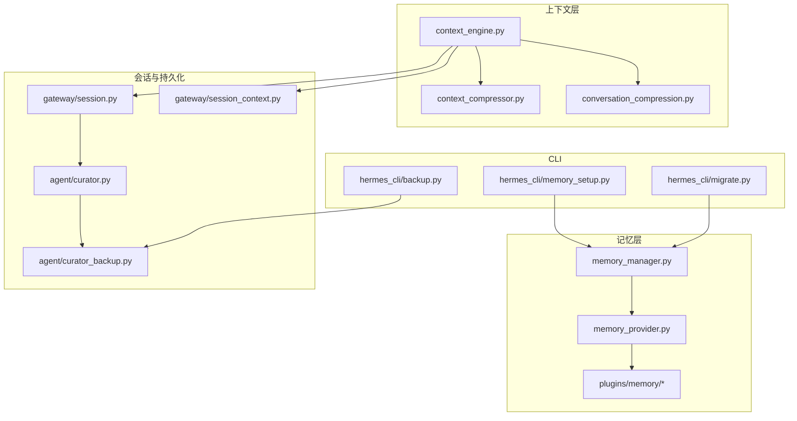
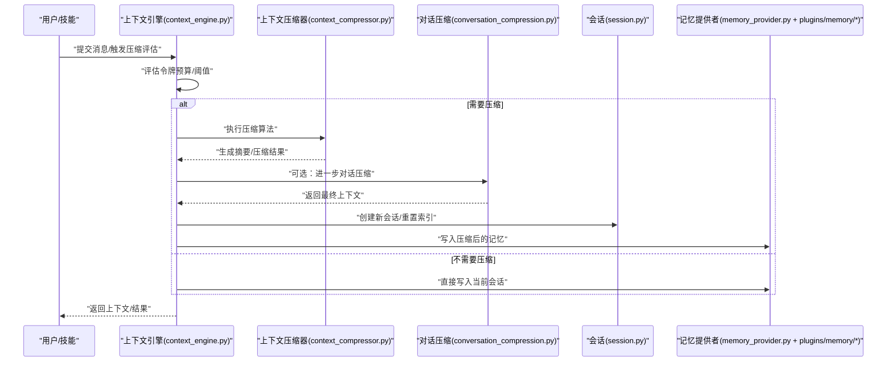
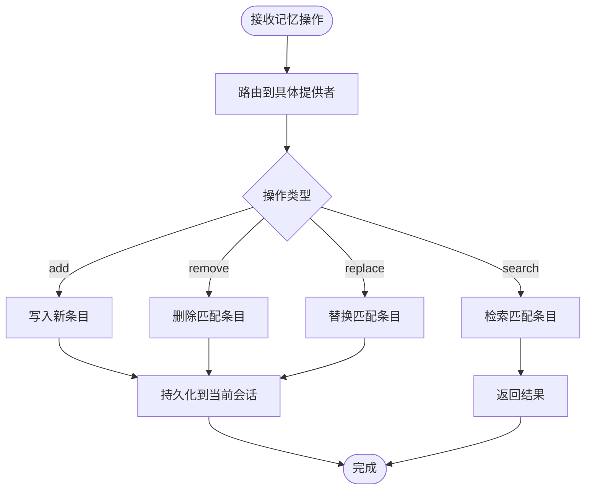
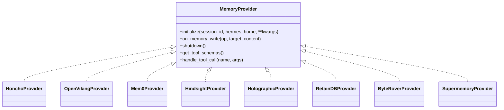
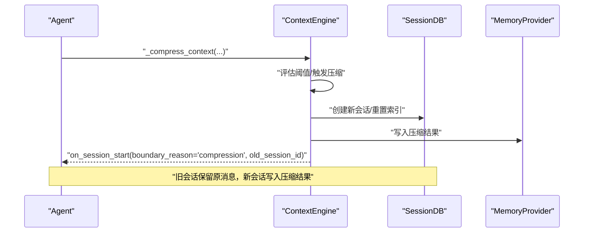
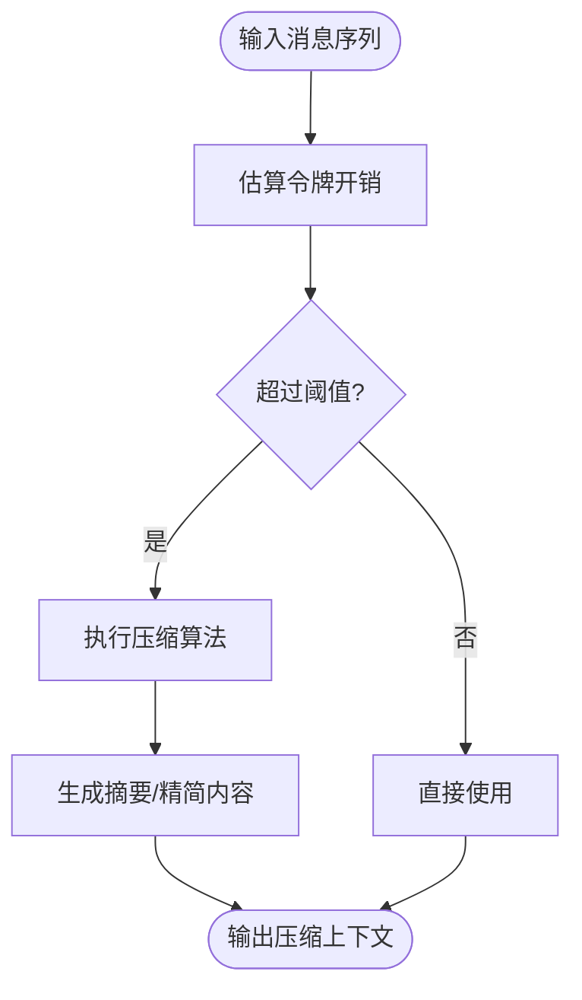
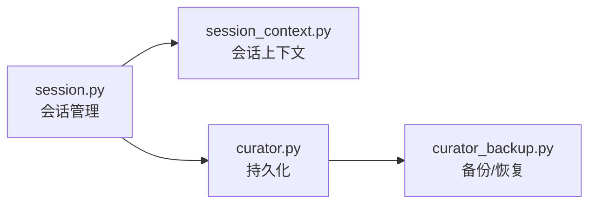
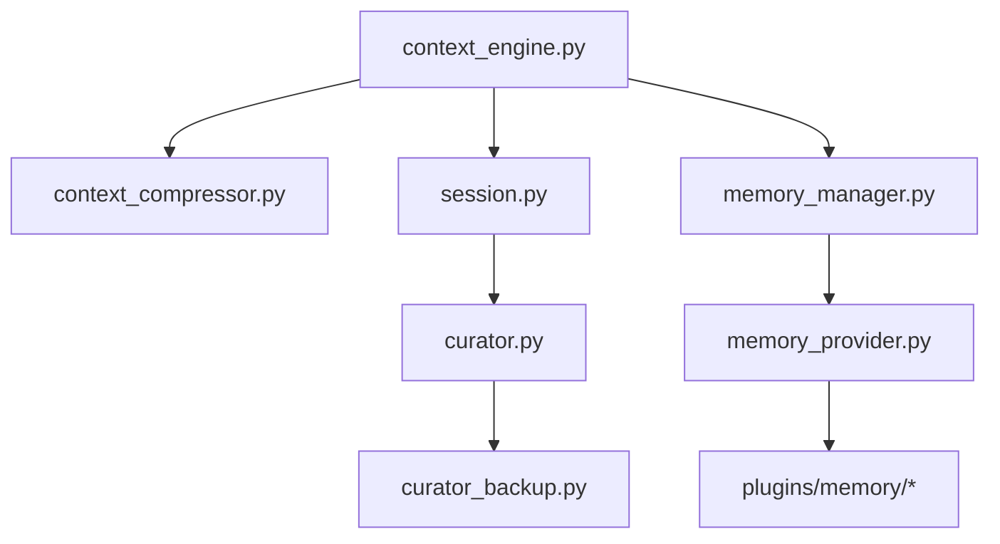

# 记忆和上下文管理

<cite>
**本文引用的文件**
- [memory_manager.py](file://agent/memory_manager.py)
- [memory_provider.py](file://agent/memory_provider.py)
- [context_engine.py](file://agent/context_engine.py)
- [context_compressor.py](file://agent/context_compressor.py)
- [conversation_compression.py](file://agent/conversation_compression.py)
- [curator.py](file://agent/curator.py)
- [curator_backup.py](file://agent/curator_backup.py)
- [session.py](file://gateway/session.py)
- [session_context.py](file://gateway/session_context.py)
- [memory_setup.py](file://hermes_cli/memory_setup.py)
- [migrate.py](file://hermes_cli/migrate.py)
- [backup.py](file://hermes_cli/backup.py)
- [test_860_dedup.py](file://tests/run_agent/test_860_dedup.py)
- [test_compression_boundary_hook.py](file://tests/run_agent/test_compression_boundary_hook.py)
- [test_memory_tool.py](file://tests/tools/test_memory_tool.py)
- [test_openviking.py](file://tests/openviking_plugin/test_openviking.py)
- [test_retaindb_plugin.py](file://tests/plugins/test_retaindb_plugin.py)
- [memory-providers.md](file://website/docs/user-guide/features/memory-providers.md)
- [memory-providers-zh.md](file://website/i18n/zh-Hans/docusaurus-plugin-content-docs/current/user-guide/features/memory-providers.md)
- [context-engine-plugin.md](file://website/docs/developer-guide/context-engine-plugin.md)
- [context-engine-plugin-zh.md](file://website/i18n/zh-Hans/docusaurus-plugin-content-docs/current/developer-guide/context-engine-plugin.md)
</cite>

## 目录
1. [引言](#引言)
2. [项目结构](#项目结构)
3. [核心组件](#核心组件)
4. [架构总览](#架构总览)
5. [详细组件分析](#详细组件分析)
6. [依赖关系分析](#依赖关系分析)
7. [性能考量](#性能考量)
8. [故障排查指南](#故障排查指南)
9. [结论](#结论)
10. [附录](#附录)

## 引言
本文件面向开发者与系统管理员，系统性阐述 Hermes Agent 的“记忆与上下文管理”子系统：包括记忆存储机制、上下文压缩算法、持久化策略、记忆类型与检索方法、上下文处理流程与令牌管理、配置选项、备份恢复与数据迁移、以及隐私与安全合规要点。文档以代码为依据，辅以可视化图示，帮助读者快速理解并正确实施。

## 项目结构
围绕记忆与上下文管理的关键模块分布如下：
- 记忆管理层：负责聚合与路由到具体记忆提供者，统一对外接口
- 记忆提供者：抽象接口与多种实现（本地/云端/自托管），支持按 Profile 隔离
- 上下文引擎：控制上下文长度、触发压缩、会话边界管理
- 上下文压缩器：执行压缩算法与摘要生成
- 会话与会话上下文：维护会话 ID、消息索引与持久化
- CLI 工具：内存初始化、备份、迁移与数据迁移
- 测试与文档：覆盖压缩边界钩子、记忆工具行为、插件交互等

图表来源
- [memory_manager.py](file://agent/memory_manager.py)
- [memory_provider.py](file://agent/memory_provider.py)
- [context_engine.py](file://agent/context_engine.py)
- [context_compressor.py](file://agent/context_compressor.py)
- [conversation_compression.py](file://agent/conversation_compression.py)
- [session.py](file://gateway/session.py)
- [session_context.py](file://gateway/session_context.py)
- [curator.py](file://agent/curator.py)
- [curator_backup.py](file://agent/curator_backup.py)
- [memory_setup.py](file://hermes_cli/memory_setup.py)
- [migrate.py](file://hermes_cli/migrate.py)
- [backup.py](file://hermes_cli/backup.py)

章节来源
- [memory_manager.py](file://agent/memory_manager.py)
- [memory_provider.py](file://agent/memory_provider.py)
- [context_engine.py](file://agent/context_engine.py)
- [context_compressor.py](file://agent/context_compressor.py)
- [conversation_compression.py](file://agent/conversation_compression.py)
- [session.py](file://gateway/session.py)
- [session_context.py](file://gateway/session_context.py)
- [curator.py](file://agent/curator.py)
- [curator_backup.py](file://agent/curator_backup.py)
- [memory_setup.py](file://hermes_cli/memory_setup.py)
- [migrate.py](file://hermes_cli/migrate.py)
- [backup.py](file://hermes_cli/backup.py)

## 核心组件
- 记忆管理层（memory_manager.py）
  - 统一入口，聚合多个记忆提供者，提供 add/remove/replace/search 等操作
  - 与上下文引擎协作，在压缩边界触发后切换会话
- 记忆提供者抽象与实现（memory_provider.py + plugins/memory/*）
  - 定义统一接口，支持本地/云端/自托管提供者
  - 按 Profile 隔离，避免跨用户/项目数据串扰
- 上下文引擎（context_engine.py）
  - 控制上下文长度与阈值，决定何时压缩
  - 会话边界事件回调（on_session_start/on_session_end），用于持久化与资源清理
- 上下文压缩器（context_compressor.py + conversation_compression.py）
  - 执行压缩算法，生成摘要，减少令牌占用
  - 支持历史媒体与图像等高 Token 内容的特殊处理
- 会话与持久化（gateway/session.py + session_context.py + agent/curator.py + agent/curator_backup.py）
  - 维护 session_id 与消息索引，压缩后写入新会话
  - 提供备份与恢复能力，保障数据安全

章节来源
- [memory_manager.py](file://agent/memory_manager.py)
- [memory_provider.py](file://agent/memory_provider.py)
- [context_engine.py](file://agent/context_engine.py)
- [context_compressor.py](file://agent/context_compressor.py)
- [conversation_compression.py](file://agent/conversation_compression.py)
- [session.py](file://gateway/session.py)
- [session_context.py](file://gateway/session_context.py)
- [curator.py](file://agent/curator.py)
- [curator_backup.py](file://agent/curator_backup.py)

## 架构总览
下图展示从“消息进入”到“压缩与持久化”的完整链路，以及与记忆提供者的交互。

图表来源
- [context_engine.py](file://agent/context_engine.py)
- [context_compressor.py](file://agent/context_compressor.py)
- [conversation_compression.py](file://agent/conversation_compression.py)
- [session.py](file://gateway/session.py)
- [memory_provider.py](file://agent/memory_provider.py)

## 详细组件分析

### 记忆管理层（memory_manager.py）
- 职责
  - 聚合多提供者，统一分发 add/remove/replace/search 等请求
  - 在压缩边界触发后，切换 session_id 并将压缩结果写入新会话
- 关键点
  - 与上下文引擎协作，确保压缩后的新会话被正确建立
  - 对外提供幂等与一致性保障（测试覆盖替换歧义、空内容拒绝等）

图表来源
- [memory_manager.py](file://agent/memory_manager.py)
- [test_memory_tool.py](file://tests/tools/test_memory_tool.py)

章节来源
- [memory_manager.py](file://agent/memory_manager.py)
- [test_memory_tool.py](file://tests/tools/test_memory_tool.py)

### 记忆提供者抽象与实现（memory_provider.py + plugins/memory/*）
- 抽象接口
  - initialize(session_id, hermes_home, **kwargs)
  - on_memory_write(op, target, content)
  - shutdown()
  - 支持工具 schema 注册与工具调用（按需）
- 实现与隔离
  - 本地/云端/自托管提供者（如 Honcho、OpenViking、Mem0、Hindsight、Holographic、RetainDB、ByteRover、Supermemory）
  - 按 Profile 隔离：本地使用 $HERMES_HOME 路径；云端自动派生项目名；环境变量由各 profile 的 .env 配置
- 插件发现与注册
  - 通过扫描 plugins/memory/*/__init__.py 发现并注册提供者

图表来源
- [memory_provider.py](file://agent/memory_provider.py)
- [plugins/memory/__init__.py](file://plugins/memory/__init__.py)
- [test_openviking.py](file://tests/openviking_plugin/test_openviking.py)
- [test_retaindb_plugin.py](file://tests/plugins/test_retaindb_plugin.py)
- [memory-providers.md](file://website/docs/user-guide/features/memory-providers.md)
- [memory-providers-zh.md](file://website/i18n/zh-Hans/docusaurus-plugin-content-docs/current/user-guide/features/memory-providers.md)

章节来源
- [memory_provider.py](file://agent/memory_provider.py)
- [plugins/memory/__init__.py](file://plugins/memory/__init__.py)
- [test_openviking.py](file://tests/openviking_plugin/test_openviking.py)
- [test_retaindb_plugin.py](file://tests/plugins/test_retaindb_plugin.py)
- [memory-providers.md](file://website/docs/user-guide/features/memory-providers.md)
- [memory-providers-zh.md](file://website/i18n/zh-Hans/docusaurus-plugin-content-docs/current/user-guide/features/memory-providers.md)

### 上下文引擎与压缩边界（context_engine.py + 会话）
- 会话边界与钩子
  - 压缩触发后，会话 ID 旋转，on_session_start 以 boundary_reason="compression" 被调用，并携带 old_session_id
  - 旧会话仍保留其消息，新会话从索引 0 开始写入压缩结果
- 与会话数据库协作
  - 写入消息时更新 last_flushed_db_idx，确保后续压缩不会重复处理已落盘的消息

图表来源
- [test_compression_boundary_hook.py](file://tests/run_agent/test_compression_boundary_hook.py)
- [test_860_dedup.py](file://tests/run_agent/test_860_dedup.py)
- [context_engine.py](file://agent/context_engine.py)
- [session.py](file://gateway/session.py)

章节来源
- [test_compression_boundary_hook.py](file://tests/run_agent/test_compression_boundary_hook.py)
- [test_860_dedup.py](file://tests/run_agent/test_860_dedup.py)
- [context_engine.py](file://agent/context_engine.py)
- [session.py](file://gateway/session.py)

### 上下文压缩算法与摘要（context_compressor.py + conversation_compression.py）
- 压缩目标
  - 减少上下文中的令牌数量，同时尽量保留关键语义
- 处理策略
  - 对历史媒体与图像等高 Token 内容进行特殊处理
  - 支持对话层面的进一步压缩（如摘要/归纳）
- 与引擎协作
  - 上下文引擎根据模型上下文长度与阈值决定是否压缩
  - 压缩完成后写入新会话并触发边界钩子

图表来源
- [context_compressor.py](file://agent/context_compressor.py)
- [conversation_compression.py](file://agent/conversation_compression.py)
- [context_engine.py](file://agent/context_engine.py)

章节来源
- [context_compressor.py](file://agent/context_compressor.py)
- [conversation_compression.py](file://agent/conversation_compression.py)
- [context_engine.py](file://agent/context_engine.py)

### 会话与持久化（gateway/session.py + session_context.py + agent/curator.py + agent/curator_backup.py）
- 会话管理
  - 维护 session_id、消息索引与写入位置
  - 压缩后创建新会话，旧会话数据不丢失
- 持久化与备份
  - Curator 负责数据持久化
  - CuratorBackup 提供备份与恢复能力，支持灾难恢复

图表来源
- [session.py](file://gateway/session.py)
- [session_context.py](file://gateway/session_context.py)
- [curator.py](file://agent/curator.py)
- [curator_backup.py](file://agent/curator_backup.py)

章节来源
- [session.py](file://gateway/session.py)
- [session_context.py](file://gateway/session_context.py)
- [curator.py](file://agent/curator.py)
- [curator_backup.py](file://agent/curator_backup.py)

### CLI：初始化、备份与迁移（hermes_cli/memory_setup.py + migrate.py + backup.py）
- 初始化
  - memory_setup.py：引导用户选择/配置记忆提供者，生成初始配置
- 备份
  - backup.py：导出当前记忆与上下文状态，便于迁移或归档
- 迁移
  - migrate.py：在提供者变更或版本升级时，协助数据迁移与兼容性处理

章节来源
- [memory_setup.py](file://hermes_cli/memory_setup.py)
- [migrate.py](file://hermes_cli/migrate.py)
- [backup.py](file://hermes_cli/backup.py)

## 依赖关系分析
- 组件耦合
  - 上下文引擎对压缩器与会话有直接依赖
  - 记忆管理层对记忆提供者存在多态依赖
  - 会话与持久化相互配合，保证压缩后的数据一致性
- 外部依赖
  - 记忆提供者依赖第三方 SDK 或服务（如 RetainDB、OpenViking 等）
- 可能的循环依赖
  - 当前结构以“引擎-压缩-会话-提供者”单向依赖为主，未见明显循环

图表来源
- [context_engine.py](file://agent/context_engine.py)
- [context_compressor.py](file://agent/context_compressor.py)
- [session.py](file://gateway/session.py)
- [memory_manager.py](file://agent/memory_manager.py)
- [memory_provider.py](file://agent/memory_provider.py)
- [curator.py](file://agent/curator.py)
- [curator_backup.py](file://agent/curator_backup.py)

章节来源
- [context_engine.py](file://agent/context_engine.py)
- [context_compressor.py](file://agent/context_compressor.py)
- [session.py](file://gateway/session.py)
- [memory_manager.py](file://agent/memory_manager.py)
- [memory_provider.py](file://agent/memory_provider.py)
- [curator.py](file://agent/curator.py)
- [curator_backup.py](file://agent/curator_backup.py)

## 性能考量
- 令牌预算与阈值
  - 上下文引擎基于模型上下文长度动态调整阈值，避免频繁压缩带来的额外开销
- 压缩成本
  - 压缩算法与摘要生成应尽量异步化，避免阻塞主回路
- I/O 与索引
  - 压缩后写入新会话，旧会话保留以减少重复处理
- 缓存与去重
  - 记忆工具测试显示对重复/歧义场景的防护，有助于降低无效写入

章节来源
- [context_engine.py](file://agent/context_engine.py)
- [context_compressor.py](file://agent/context_compressor.py)
- [test_860_dedup.py](file://tests/run_agent/test_860_dedup.py)
- [test_memory_tool.py](file://tests/tools/test_memory_tool.py)

## 故障排查指南
- 压缩边界未触发
  - 检查 on_session_start 是否被调用且 boundary_reason="compression"
  - 确认 session_id 是否旋转，旧会话消息是否保留
- 写入失败或空内容
  - 某些提供者会忽略空内容；检查调用参数与提供者日志
- 替换失败
  - 当匹配歧义或多处匹配时，替换会被拒绝；先 search 再精确替换
- 插件 URI/路径问题
  - OpenViking 提供者对 URI 构造与目录结构有严格要求，确认路径与 slug 规则

章节来源
- [test_compression_boundary_hook.py](file://tests/run_agent/test_compression_boundary_hook.py)
- [test_860_dedup.py](file://tests/run_agent/test_860_dedup.py)
- [test_memory_tool.py](file://tests/tools/test_memory_tool.py)
- [test_openviking.py](file://tests/openviking_plugin/test_openviking.py)
- [test_retaindb_plugin.py](file://tests/plugins/test_retaindb_plugin.py)

## 结论
Hermes Agent 的记忆与上下文管理通过“上下文引擎 + 压缩器 + 会话 + 记忆提供者”的分层设计，实现了高效、可扩展且可审计的记忆系统。其关键优势在于：
- 明确的压缩边界与会话切换机制，确保数据一致性
- 多样化的记忆提供者与 Profile 隔离，满足不同部署与合规需求
- 完备的 CLI 工具链，覆盖初始化、备份与迁移
建议在生产中结合令牌预算、异步压缩与缓存策略，持续优化性能与稳定性。

## 附录

### 记忆类型与检索方法
- 类型
  - 用户事实、偏好、实体、事件、案例与模式等分类
- 检索
  - 支持 add/remove/replace/search 等原子操作
  - 提供工具 schema 注册，便于引擎调用

章节来源
- [memory_provider.py](file://agent/memory_provider.py)
- [test_memory_tool.py](file://tests/tools/test_memory_tool.py)

### 上下文处理流程与令牌管理
- 流程
  - 评估 → 判断阈值 → 压缩（可选）→ 写入新会话 → 触发边界钩子
- 令牌
  - 基于模型上下文长度动态调整阈值，避免过度压缩

章节来源
- [context_engine.py](file://agent/context_engine.py)
- [context_compressor.py](file://agent/context_compressor.py)

### 配置选项与最佳实践
- 提供者选择
  - 本地/云端/自托管各有侧重，按合规与成本权衡
- Profile 隔离
  - 通过 $HERMES_HOME 与 .env 隔离不同用户/项目数据
- 最佳实践
  - 启动时初始化记忆提供者，定期备份，迁移前验证数据完整性

章节来源
- [memory-providers.md](file://website/docs/user-guide/features/memory-providers.md)
- [memory-providers-zh.md](file://website/i18n/zh-Hans/docusaurus-plugin-content-docs/current/user-guide/features/memory-providers.md)
- [memory_setup.py](file://hermes_cli/memory_setup.py)

### 备份恢复与数据迁移
- 备份
  - 使用 backup.py 导出状态，保存至安全位置
- 恢复
  - 通过 CuratorBackup 恢复，确保与当前版本兼容
- 迁移
  - 使用 migrate.py 在提供者或版本变更时进行平滑迁移

章节来源
- [backup.py](file://hermes_cli/backup.py)
- [curator_backup.py](file://agent/curator_backup.py)
- [migrate.py](file://hermes_cli/migrate.py)

### 隐私保护、数据安全与合规
- 数据隔离
  - 按 Profile 隔离，避免跨用户访问
- 传输与存储
  - 云端提供者需遵循最小化原则与加密策略
- 审计与可追溯
  - 会话边界与写入记录可用于审计追踪

章节来源
- [memory-providers.md](file://website/docs/user-guide/features/memory-providers.md)
- [memory-providers-zh.md](file://website/i18n/zh-Hans/docusaurus-plugin-content-docs/current/user-guide/features/memory-providers.md)
- [context-engine-plugin.md](file://website/docs/developer-guide/context-engine-plugin.md)
- [context-engine-plugin-zh.md](file://website/i18n/zh-Hans/docusaurus-plugin-content-docs/current/developer-guide/context-engine-plugin.md)