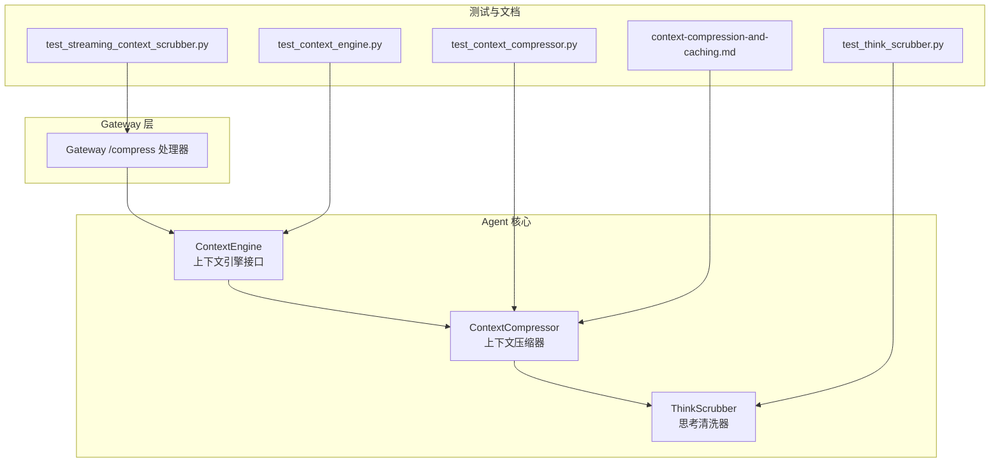
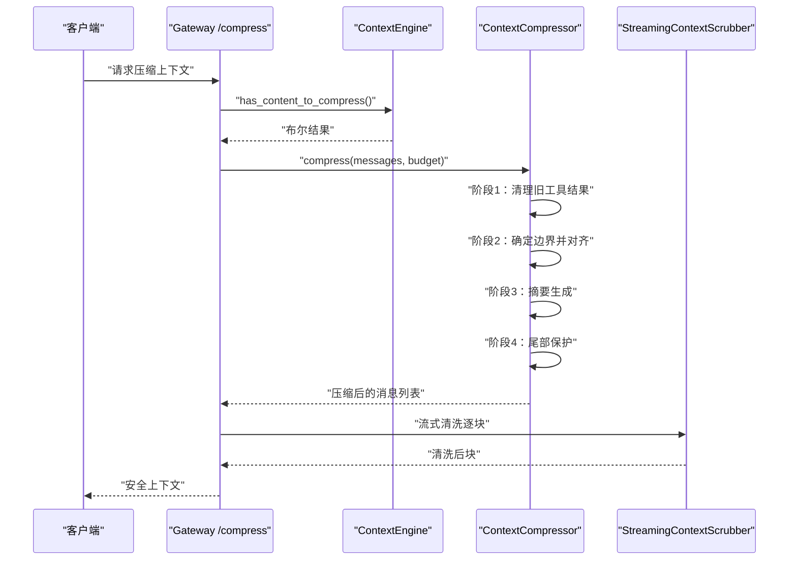
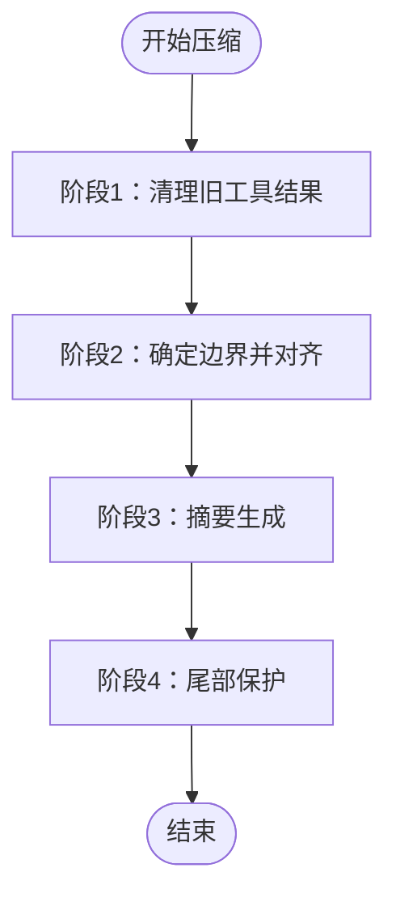
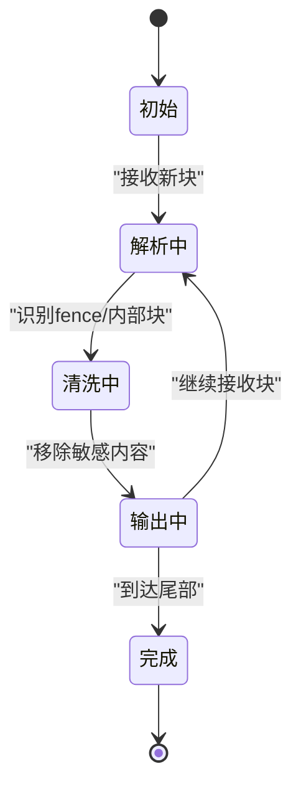
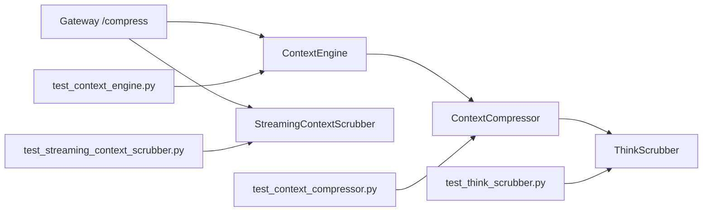

# 记忆上下文处理

<cite>
**本文引用的文件**
- [agent/context_compressor.py](file://agent/context_compressor.py)
- [agent/context_engine.py](file://agent/context_engine.py)
- [agent/think_scrubber.py](file://agent/think_scrubber.py)
- [tests/agent/test_context_compressor.py](file://tests/agent/test_context_compressor.py)
- [tests/agent/test_context_engine.py](file://tests/agent/test_context_engine.py)
- [tests/agent/test_streaming_context_scrubber.py](file://tests/agent/test_streaming_context_scrubber.py)
- [tests/agent/test_think_scrubber.py](file://tests/agent/test_think_scrubber.py)
- [tests/gateway/test_compress_plugin_engine.py](file://tests/gateway/test_compress_plugin_engine.py)
- [website/i18n/zh-Hans/docusaurus-plugin-content-docs/current/developer-guide/context-compression-and-caching.md](file://website/i18n/zh-Hans/docusaurus-plugin-content-docs/current/developer-guide/context-compression-and-caching.md)
</cite>

## 目录
1. [引言](#引言)
2. [项目结构](#项目结构)
3. [核心组件](#核心组件)
4. [架构总览](#架构总览)
5. [详细组件分析](#详细组件分析)
6. [依赖关系分析](#依赖关系分析)
7. [性能考量](#性能考量)
8. [故障排查指南](#故障排查指南)
9. [结论](#结论)
10. [附录](#附录)

## 引言
本文件聚焦Hermes Agent的记忆上下文处理系统，围绕上下文预取、合并与清理机制展开，重点解析以下方面：
- StreamingContextScrubber状态机与内存上下文块构建流程
- 上下文过滤器工作原理（含fence标签处理、内部上下文块清理、系统注释移除）
- 上下文压缩算法与令牌管理策略（历史数据保留与性能优化）
- 配置项与调试方法，帮助开发者理解并优化上下文处理性能

## 项目结构
与上下文处理密切相关的模块主要位于agent目录，以及配套的测试与文档资源：
- agent/context_compressor.py：上下文压缩器实现，包含四阶段压缩算法与边界对齐逻辑
- agent/context_engine.py：上下文引擎抽象与插件扩展点
- agent/think_scrubber.py：思考内容清洗器，用于过滤内部思考与系统注释
- tests/agent/test_context_compressor.py、test_context_engine.py、test_streaming_context_scrubber.py、test_think_scrubber.py：覆盖压缩、引擎、流式清洗与思考清洗的测试
- website/i18n/zh-Hans/.../context-compression-and-caching.md：官方开发文档，阐述压缩算法与边界策略

**图表来源**
- [agent/context_compressor.py](file://agent/context_compressor.py)
- [agent/context_engine.py](file://agent/context_engine.py)
- [agent/think_scrubber.py](file://agent/think_scrubber.py)
- [tests/agent/test_context_compressor.py](file://tests/agent/test_context_compressor.py)
- [tests/agent/test_context_engine.py](file://tests/agent/test_context_engine.py)
- [tests/agent/test_streaming_context_scrubber.py](file://tests/agent/test_streaming_context_scrubber.py)
- [tests/agent/test_think_scrubber.py](file://tests/agent/test_think_scrubber.py)
- [website/i18n/zh-Hans/docusaurus-plugin-content-docs/current/developer-guide/context-compression-and-caching.md](file://website/i18n/zh-Hans/docusaurus-plugin-content-docs/current/developer-guide/context-compression-and-caching.md)

**章节来源**
- [agent/context_compressor.py](file://agent/context_compressor.py)
- [agent/context_engine.py](file://agent/context_engine.py)
- [agent/think_scrubber.py](file://agent/think_scrubber.py)
- [tests/agent/test_context_compressor.py](file://tests/agent/test_context_compressor.py)
- [tests/agent/test_context_engine.py](file://tests/agent/test_context_engine.py)
- [tests/agent/test_streaming_context_scrubber.py](file://tests/agent/test_streaming_context_scrubber.py)
- [tests/agent/test_think_scrubber.py](file://tests/agent/test_think_scrubber.py)
- [website/i18n/zh-Hans/docusaurus-plugin-content-docs/current/developer-guide/context-compression-and-caching.md](file://website/i18n/zh-Hans/docusaurus-plugin-content-docs/current/developer-guide/context-compression-and-caching.md)

## 核心组件
- 上下文压缩器（ContextCompressor）：实现四阶段压缩算法，负责预取、边界对齐、摘要生成与尾部保护；支持插件化上下文引擎（ContextEngine）
- 上下文引擎（ContextEngine）：抽象接口，允许第三方插件（如LCM等）接入压缩前检查与边界判定
- 思考清洗器（ThinkScrubber）：过滤内部思考内容与系统注释，确保对外输出不泄露内部标记
- 流式上下文清洗器（StreamingContextScrubber）：在流式响应过程中维护状态机，按块清洗并输出安全上下文

**章节来源**
- [agent/context_compressor.py](file://agent/context_compressor.py)
- [agent/context_engine.py](file://agent/context_engine.py)
- [agent/think_scrubber.py](file://agent/think_scrubber.py)

## 架构总览
上下文处理在Gateway层触发，调用ContextEngine进行预检，随后由ContextCompressor执行压缩算法；最终通过ThinkScrubber与StreamingContextScrubber保证输出安全与一致性。

**图表来源**
- [agent/context_engine.py](file://agent/context_engine.py)
- [agent/context_compressor.py](file://agent/context_compressor.py)
- [tests/gateway/test_compress_plugin_engine.py](file://tests/gateway/test_compress_plugin_engine.py)

## 详细组件分析

### 上下文压缩器（ContextCompressor）
- 四阶段压缩算法
  - 阶段1：清理旧工具结果（廉价，无需LLM调用）。对超过阈值的工具输出进行“已清理”占位，减少token占用
  - 阶段2：确定边界并对齐。保护首部（系统+首次交互），中间轮次摘要，尾部按token预算或固定数量保护；对工具调用/结果组进行对齐，避免拆分
  - 阶段3：摘要生成。对中间段进行摘要，控制整体长度
  - 阶段4：尾部保护。从末尾向前累计token，直至预算耗尽；若不足固定保护数量则回退到固定保护
- 边界对齐策略
  - 向后对齐：_align_boundary_backward()跳过连续工具结果，向上追溯至assistant消息，保持组完整性
  - 向前对齐：_align_boundary_forward()（插件兼容性要求）需作为可选ABC方法存在，避免第三方引擎访问私有辅助函数导致AttributeError
- 插件兼容性
  - /compress处理器曾依赖ContextCompressor私有辅助函数，现改为通过ContextEngine的has_content_to_compress()进行安全预检，确保LCM等插件引擎可用

**图表来源**
- [website/i18n/zh-Hans/docusaurus-plugin-content-docs/current/developer-guide/context-compression-and-caching.md](file://website/i18n/zh-Hans/docusaurus-plugin-content-docs/current/developer-guide/context-compression-and-caching.md)
- [agent/context_compressor.py](file://agent/context_compressor.py)

**章节来源**
- [agent/context_compressor.py](file://agent/context_compressor.py)
- [website/i18n/zh-Hans/docusaurus-plugin-content-docs/current/developer-guide/context-compression-and-caching.md](file://website/i18n/zh-Hans/docusaurus-plugin-content-docs/current/developer-guide/context-compression-and-caching.md)
- [tests/agent/test_context_compressor.py](file://tests/agent/test_context_compressor.py)
- [tests/gateway/test_compress_plugin_engine.py](file://tests/gateway/test_compress_plugin_engine.py)

### 上下文引擎（ContextEngine）
- 抽象接口，定义压缩前检查与边界判定的扩展点
- 为第三方插件（如LCM）提供安全的接口契约，避免直接依赖ContextCompressor内部实现
- /compress处理器通过has_content_to_compress()进行预检，提升兼容性与稳定性

**章节来源**
- [agent/context_engine.py](file://agent/context_engine.py)
- [tests/gateway/test_compress_plugin_engine.py](file://tests/gateway/test_compress_plugin_engine.py)

### 思考清洗器（ThinkScrubber）
- 功能：过滤内部思考内容与系统注释，防止泄露到外部输出
- 典型场景：移除fence标签、内部上下文块、系统注释等敏感信息
- 与上下文压缩器配合，在压缩完成后进行最终清洗

**章节来源**
- [agent/think_scrubber.py](file://agent/think_scrubber.py)
- [tests/agent/test_think_scrubber.py](file://tests/agent/test_think_scrubber.py)

### 流式上下文清洗器（StreamingContextScrubber）
- 状态机：在流式响应过程中维护状态，按块清洗并输出安全上下文
- 内存上下文块构建：将输入消息分块，逐块应用清洗规则，确保输出符合安全策略
- 与Gateway层集成：在流式传输中实时清洗，降低延迟并提升安全性

**图表来源**
- [agent/context_compressor.py](file://agent/context_compressor.py)
- [tests/agent/test_streaming_context_scrubber.py](file://tests/agent/test_streaming_context_scrubber.py)

**章节来源**
- [agent/context_compressor.py](file://agent/context_compressor.py)
- [tests/agent/test_streaming_context_scrubber.py](file://tests/agent/test_streaming_context_scrubber.py)

## 依赖关系分析
- ContextEngine是ContextCompressor的上层抽象，允许插件扩展
- Gateway层通过ContextEngine进行预检，再调用ContextCompressor执行压缩
- ThinkScrubber与StreamingContextScrubber分别在不同阶段保障输出安全
- 测试覆盖了压缩算法、引擎接口、流式清洗与思考清洗的关键行为

**图表来源**
- [agent/context_engine.py](file://agent/context_engine.py)
- [agent/context_compressor.py](file://agent/context_compressor.py)
- [agent/think_scrubber.py](file://agent/think_scrubber.py)
- [tests/agent/test_context_engine.py](file://tests/agent/test_context_engine.py)
- [tests/agent/test_context_compressor.py](file://tests/agent/test_context_compressor.py)
- [tests/agent/test_streaming_context_scrubber.py](file://tests/agent/test_streaming_context_scrubber.py)
- [tests/agent/test_think_scrubber.py](file://tests/agent/test_think_scrubber.py)

**章节来源**
- [agent/context_engine.py](file://agent/context_engine.py)
- [agent/context_compressor.py](file://agent/context_compressor.py)
- [agent/think_scrubber.py](file://agent/think_scrubber.py)
- [tests/agent/test_context_engine.py](file://tests/agent/test_context_engine.py)
- [tests/agent/test_context_compressor.py](file://tests/agent/test_context_compressor.py)
- [tests/agent/test_streaming_context_scrubber.py](file://tests/agent/test_streaming_context_scrubber.py)
- [tests/agent/test_think_scrubber.py](file://tests/agent/test_think_scrubber.py)

## 性能考量
- 预取与边界对齐：通过保护首部与尾部，避免频繁摘要生成带来的额外开销
- 工具结果清理：对冗长工具输出进行占位，显著降低token消耗
- 摘要生成策略：仅对中间段进行摘要，兼顾上下文连贯性与长度控制
- 流式清洗：在传输过程中分块清洗，降低端到端延迟
- 插件兼容性：通过has_content_to_compress()预检，避免第三方引擎访问私有辅助函数，提升整体稳定性

**章节来源**
- [website/i18n/zh-Hans/docusaurus-plugin-content-docs/current/developer-guide/context-compression-and-caching.md](file://website/i18n/zh-Hans/docusaurus-plugin-content-docs/current/developer-guide/context-compression-and-caching.md)
- [agent/context_compressor.py](file://agent/context_compressor.py)

## 故障排查指南
- 插件引擎报错：当第三方引擎（如LCM）缺少必要的边界对齐辅助函数时，/compress处理器会抛出AttributeError。应确保has_content_to_compress()等接口可用
- 压缩循环溢出：若上下文过长导致压缩循环异常，需检查边界保护参数与摘要策略
- 流式清洗异常：确认StreamingContextScrubber状态机正确处理fence标签与内部块
- 思考内容泄露：检查ThinkScrubber是否正确移除系统注释与内部标记

**章节来源**
- [tests/gateway/test_compress_plugin_engine.py](file://tests/gateway/test_compress_plugin_engine.py)
- [tests/agent/test_streaming_context_scrubber.py](file://tests/agent/test_streaming_context_scrubber.py)
- [tests/agent/test_think_scrubber.py](file://tests/agent/test_think_scrubber.py)

## 结论
Hermes Agent的记忆上下文处理系统通过ContextEngine与ContextCompressor实现了可插拔、可扩展的压缩框架，并结合ThinkScrubber与StreamingContextScrubber确保输出安全与性能。四阶段压缩算法与边界对齐策略在保证上下文质量的同时，有效控制了token消耗与传输延迟。建议在实际部署中根据模型上下文长度与业务需求调整边界保护与摘要策略，并通过测试用例验证插件兼容性与清洗效果。

## 附录
- 相关文档与测试用例可参考仓库中的开发文档与测试文件，以获取更详细的使用示例与回归验证方法

**章节来源**
- [website/i18n/zh-Hans/docusaurus-plugin-content-docs/current/developer-guide/context-compression-and-caching.md](file://website/i18n/zh-Hans/docusaurus-plugin-content-docs/current/developer-guide/context-compression-and-caching.md)
- [tests/agent/test_context_compressor.py](file://tests/agent/test_context_compressor.py)
- [tests/agent/test_context_engine.py](file://tests/agent/test_context_engine.py)
- [tests/agent/test_streaming_context_scrubber.py](file://tests/agent/test_streaming_context_scrubber.py)
- [tests/agent/test_think_scrubber.py](file://tests/agent/test_think_scrubber.py)