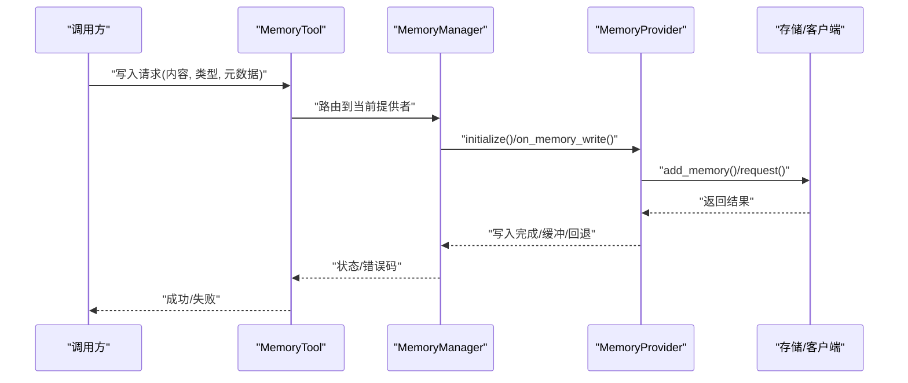
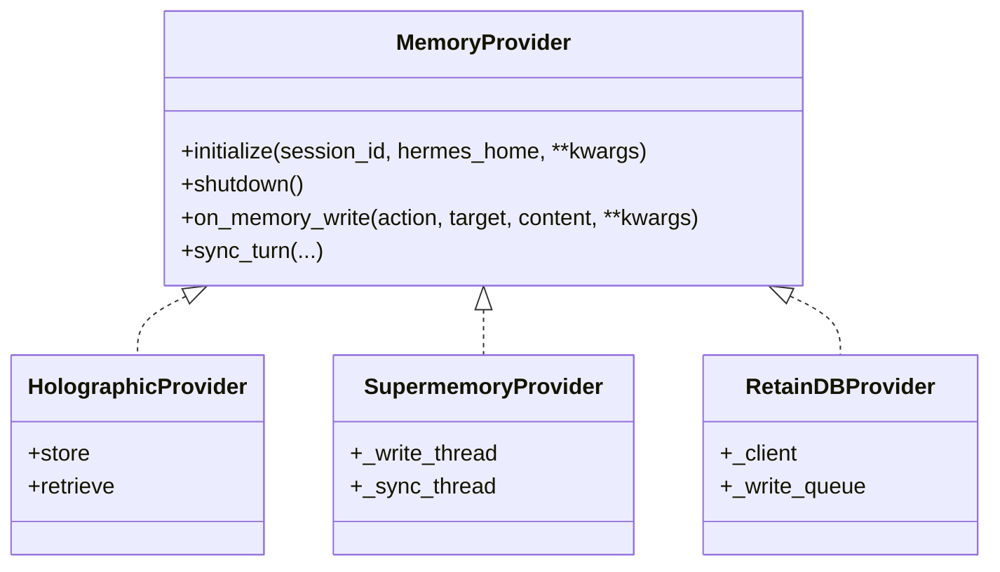
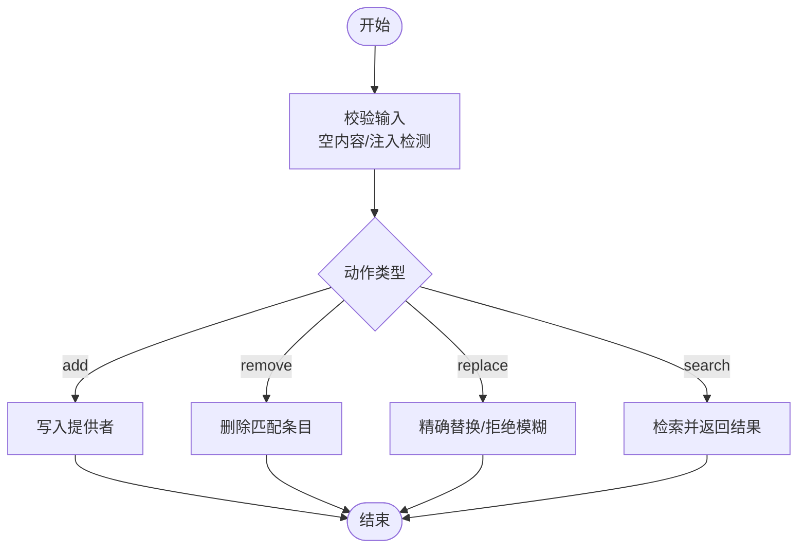
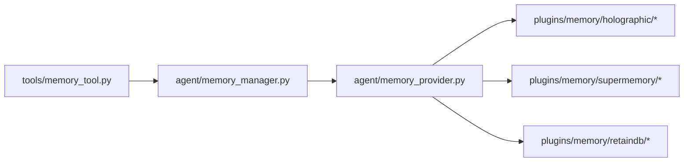

# 记忆写入工具

<cite>
**本文引用的文件**
- [agent/memory_manager.py](file://agent/memory_manager.py)
- [agent/memory_provider.py](file://agent/memory_provider.py)
- [tools/memory_tool.py](file://tools/memory_tool.py)
- [plugins/memory/__init__.py](file://plugins/memory/__init__.py)
- [plugins/memory/holographic/__init__.py](file://plugins/memory/holographic/__init__.py)
- [plugins/memory/holographic/holographic.py](file://plugins/memory/holographic/holographic.py)
- [plugins/memory/holographic/store.py](file://plugins/memory/holographic/store.py)
- [plugins/memory/holographic/retrieval.py](file://plugins/memory/holographic/retrieval.py)
- [plugins/memory/supermemory/__init__.py](file://plugins/memory/supermemory/__init__.py)
- [plugins/memory/retaindb/__init__.py](file://plugins/memory/retaindb/__init__.py)
- [tests/plugins/test_retaindb_plugin.py](file://tests/plugins/test_retaindb_plugin.py)
- [tests/plugins/memory/test_supermemory_provider.py](file://tests/plugins/memory/test_supermemory_provider.py)
- [tests/tools/test_memory_tool.py](file://tests/tools/test_memory_tool.py)
- [hermes_cli/memory_setup.py](file://hermes_cli/memory_setup.py)
- [website/i18n/zh-Hans/docusaurus-plugin-content-docs/current/user-guide/features/memory-providers.md](file://website/i18n/zh-Hans/docusaurus-plugin-content-docs/current/user-guide/features/memory-providers.md)
</cite>

## 目录
1. [简介](#简介)
2. [项目结构](#项目结构)
3. [核心组件](#核心组件)
4. [架构总览](#架构总览)
5. [详细组件分析](#详细组件分析)
6. [依赖关系分析](#依赖关系分析)
7. [性能考量](#性能考量)
8. [故障排查指南](#故障排查指南)
9. [结论](#结论)
10. [附录](#附录)

## 简介
本文件面向“记忆写入工具”的技术文档，聚焦于文本存储、结构化数据写入与批量导入能力，系统阐述参数配置、数据格式要求、存储策略、不同记忆提供者的写入接口差异与性能特点，并给出事务处理、并发控制与一致性保障的实现思路。同时提供可操作的使用示例与数据转换技巧，帮助读者在不同场景下高效、安全地完成记忆写入。

## 项目结构
围绕记忆写入的关键模块分布如下：
- 核心抽象与管理
  - agent/memory_provider.py：定义记忆提供者接口与生命周期
  - agent/memory_manager.py：协调提供者实例、会话上下文与写入调度
- 写入入口工具
  - tools/memory_tool.py：对外暴露统一的写入/更新/删除/查询接口
- 提供者插件生态
  - plugins/memory/*：多种提供者实现（如 Holographic、Supermemory、RetainDB 等）
- CLI 初始化与配置
  - hermes_cli/memory_setup.py：提供初始化与配置引导
- 文档与对比
  - website/.../memory-providers.md：提供者对比与隔离策略说明

```mermaid
graph TB
subgraph "核心"
MP["memory_provider.py<br/>提供者接口"]
MM["memory_manager.py<br/>管理器"]
MT["memory_tool.py<br/>写入工具"]
end
subgraph "插件提供者"
PL_Holo["holographic/*"]
PL_Super["supermemory/*"]
PL_Retain["retaindb/*"]
end
subgraph "CLI"
CLI["memory_setup.py"]
end
MT --> MM
MM --> MP
MP --> PL_Holo
MP --> PL_Super
MP --> PL_Retain
CLI --> MM
```

图表来源
- [agent/memory_provider.py](file://agent/memory_provider.py)
- [agent/memory_manager.py](file://agent/memory_manager.py)
- [tools/memory_tool.py](file://tools/memory_tool.py)
- [plugins/memory/holographic/__init__.py](file://plugins/memory/holographic/__init__.py)
- [plugins/memory/supermemory/__init__.py](file://plugins/memory/supermemory/__init__.py)
- [plugins/memory/retaindb/__init__.py](file://plugins/memory/retaindb/__init__.py)
- [hermes_cli/memory_setup.py](file://hermes_cli/memory_setup.py)

章节来源
- [agent/memory_manager.py](file://agent/memory_manager.py)
- [agent/memory_provider.py](file://agent/memory_provider.py)
- [tools/memory_tool.py](file://tools/memory_tool.py)
- [plugins/memory/__init__.py](file://plugins/memory/__init__.py)
- [hermes_cli/memory_setup.py](file://hermes_cli/memory_setup.py)

## 核心组件
- 记忆提供者接口（Provider Interface）
  - 定义 initialize、shutdown、on_memory_write、sync_turn 等钩子与生命周期方法
  - 统一不同提供者的写入语义与行为边界
- 记忆管理器（Memory Manager）
  - 负责选择当前提供者、维护会话上下文、调度写入任务
  - 支持线程池/队列缓冲、优雅关闭与资源回收
- 写入工具（Memory Tool）
  - 对外提供 add/remove/replace/search 等操作
  - 内置输入校验、注入防护与错误反馈
- 提供者插件（Provider Plugins）
  - Holographic：本地存储、上下文检索、信任评分
  - Supermemory：多容器、会话图谱导入、显式记忆标记
  - RetainDB：SQLite 写队列、回退重试、类型映射

章节来源
- [agent/memory_provider.py](file://agent/memory_provider.py)
- [agent/memory_manager.py](file://agent/memory_manager.py)
- [tools/memory_tool.py](file://tools/memory_tool.py)
- [plugins/memory/holographic/__init__.py](file://plugins/memory/holographic/__init__.py)
- [plugins/memory/supermemory/__init__.py](file://plugins/memory/supermemory/__init__.py)
- [plugins/memory/retaindb/__init__.py](file://plugins/memory/retaindb/__init__.py)

## 架构总览
记忆写入从工具层进入，经由管理器选择具体提供者，再由提供者执行持久化或远程调用。部分提供者支持异步写入、缓冲与回退策略，确保高吞吐与可靠性。



图表来源
- [tools/memory_tool.py](file://tools/memory_tool.py)
- [agent/memory_manager.py](file://agent/memory_manager.py)
- [agent/memory_provider.py](file://agent/memory_provider.py)
- [plugins/memory/retaindb/__init__.py](file://plugins/memory/retaindb/__init__.py)
- [plugins/memory/supermemory/__init__.py](file://plugins/memory/supermemory/__init__.py)

## 详细组件分析

### 记忆提供者接口与生命周期
- 关键职责
  - initialize(session_id, hermes_home, **kwargs)：建立会话上下文与本地/远程连接
  - shutdown()：释放资源、刷新缓冲、等待后台线程结束
  - on_memory_write(action, target, content, **kwargs)：接收写入事件并触发持久化
  - sync_turn(...)：同步回合级记忆（如显式标记、会话图谱导入）
- 行为差异
  - Holographic：本地文件系统存储，支持检索与信任评分
  - Supermemory：多容器、显式记忆类型标记、后台线程写入
  - RetainDB：SQLite 写队列、回退重试、类型映射与镜像钩子



图表来源
- [agent/memory_provider.py](file://agent/memory_provider.py)
- [plugins/memory/holographic/holographic.py](file://plugins/memory/holographic/holographic.py)
- [plugins/memory/supermemory/__init__.py](file://plugins/memory/supermemory/__init__.py)
- [plugins/memory/retaindb/__init__.py](file://plugins/memory/retaindb/__init__.py)

章节来源
- [agent/memory_provider.py](file://agent/memory_provider.py)
- [plugins/memory/holographic/holographic.py](file://plugins/memory/holographic/holographic.py)
- [plugins/memory/supermemory/__init__.py](file://plugins/memory/supermemory/__init__.py)
- [plugins/memory/retaindb/__init__.py](file://plugins/memory/retaindb/__init__.py)

### 写入工具（MemoryTool）
- 功能特性
  - add/remove/replace/search：统一的 CRUD 接口
  - 输入校验与注入防护：拒绝空内容、模糊替换、危险指令片段
  - 错误反馈：明确失败原因（如匹配不唯一、空旧内容等）
- 使用场景
  - 文本存储：偏好设置、事实类信息、临时笔记
  - 结构化数据写入：将 JSON/对象映射为键值对或元数据字段
  - 批量导入：通过循环调用或批处理脚本进行批量 add



图表来源
- [tools/memory_tool.py](file://tools/memory_tool.py)
- [tests/tools/test_memory_tool.py](file://tests/tools/test_memory_tool.py)

章节来源
- [tools/memory_tool.py](file://tools/memory_tool.py)
- [tests/tools/test_memory_tool.py](file://tests/tools/test_memory_tool.py)

### 提供者实现要点与差异

#### Holographic（本地）
- 存储策略
  - 本地文件系统层级，按 profile 隔离路径
  - 支持检索与信任评分，适合轻量、低延迟场景
- 参数配置
  - 通过 initialize 传入 hermes_home 与会话标识
- 性能特点
  - 本地 IO，吞吐受限于磁盘；适合小规模、低频写入

章节来源
- [plugins/memory/holographic/store.py](file://plugins/memory/holographic/store.py)
- [plugins/memory/holographic/retrieval.py](file://plugins/memory/holographic/retrieval.py)
- [website/i18n/zh-Hans/docusaurus-plugin-content-docs/current/user-guide/features/memory-providers.md](file://website/i18n/zh-Hans/docusaurus-plugin-content-docs/current/user-guide/features/memory-providers.md)

#### Supermemory（云端/多容器）
- 写入特性
  - 后台线程写入与缓冲，提升吞吐
  - on_memory_write 时自动标记显式记忆类型
  - shutdown 时等待线程结束并刷新缓冲
- 参数配置
  - 通过插件配置与环境变量传递凭证
- 性能特点
  - 异步写入与多容器隔离，适合高并发与复杂会话图谱

章节来源
- [plugins/memory/supermemory/__init__.py](file://plugins/memory/supermemory/__init__.py)
- [tests/plugins/memory/test_supermemory_provider.py](file://tests/plugins/memory/test_supermemory_provider.py)

#### RetainDB（云端/回退重试）
- 写入特性
  - SQLite 写队列持久化，避免丢失
  - 回退重试：首次失败后重试以提升成功率
  - on_memory_write 钩子镜像写入，自动映射目标到类型
- 参数配置
  - API Key 等凭证通过环境变量注入
- 性能特点
  - 本地队列+远程写入，兼顾可靠性与吞吐

章节来源
- [plugins/memory/retaindb/__init__.py](file://plugins/memory/retaindb/__init__.py)
- [tests/plugins/test_retaindb_plugin.py](file://tests/plugins/test_retaindb_plugin.py)

### 数据格式与转换技巧
- 文本存储
  - 将长文本拆分为若干段落或要点，分别 add，便于后续检索与更新
  - 使用元数据字段区分来源（如 source/sm_source），便于回溯与去重
- 结构化数据写入
  - 将对象序列化为键值对或 JSON 字符串，配合 metadata 字段保存 schema 版本
  - 对敏感字段进行脱敏或哈希处理后再写入
- 批量导入
  - 使用循环逐条 add，或在提供者侧实现批量接口（若支持）
  - 导入前先执行一次 search，避免重复写入

章节来源
- [tools/memory_tool.py](file://tools/memory_tool.py)
- [plugins/memory/supermemory/__init__.py](file://plugins/memory/supermemory/__init__.py)
- [plugins/memory/retaindb/__init__.py](file://plugins/memory/retaindb/__init__.py)

## 依赖关系分析
- 组件耦合
  - MemoryTool 仅依赖 MemoryManager 抽象，不直接依赖具体提供者
  - MemoryManager 通过 Provider 接口解耦不同实现
- 外部依赖
  - Supermemory：多线程与后台写入
  - RetainDB：SQLite 与网络请求
  - Holographic：文件系统访问
- 循环依赖
  - 未发现直接循环依赖；提供者内部模块按功能分层组织



图表来源
- [tools/memory_tool.py](file://tools/memory_tool.py)
- [agent/memory_manager.py](file://agent/memory_manager.py)
- [agent/memory_provider.py](file://agent/memory_provider.py)
- [plugins/memory/holographic/__init__.py](file://plugins/memory/holographic/__init__.py)
- [plugins/memory/supermemory/__init__.py](file://plugins/memory/supermemory/__init__.py)
- [plugins/memory/retaindb/__init__.py](file://plugins/memory/retaindb/__init__.py)

章节来源
- [agent/memory_manager.py](file://agent/memory_manager.py)
- [agent/memory_provider.py](file://agent/memory_provider.py)
- [tools/memory_tool.py](file://tools/memory_tool.py)
- [plugins/memory/__init__.py](file://plugins/memory/__init__.py)

## 性能考量
- 写入吞吐
  - 异步写入：Supermemory 的后台线程可显著提升高并发场景下的响应性
  - 缓冲队列：RetainDB 的 SQLite 写队列减少网络抖动影响
- 可靠性
  - 回退重试：RetainDB 在首次失败后自动重试，提高成功率
  - 镜像钩子：on_memory_write 钩子确保写入一致性
- 资源管理
  - 优雅关闭：shutdown 等待线程结束并刷新缓冲，避免数据丢失
- I/O 优化
  - Holographic 本地存储适合小规模写入；大规模建议采用云端提供者或队列缓冲

章节来源
- [tests/plugins/memory/test_supermemory_provider.py](file://tests/plugins/memory/test_supermemory_provider.py)
- [tests/plugins/test_retaindb_plugin.py](file://tests/plugins/test_retaindb_plugin.py)
- [plugins/memory/supermemory/__init__.py](file://plugins/memory/supermemory/__init__.py)
- [plugins/memory/retaindb/__init__.py](file://plugins/memory/retaindb/__init__.py)

## 故障排查指南
- 常见问题
  - 写入失败：检查凭证是否正确、网络连通性、提供者状态
  - 写入未生效：确认 on_memory_write 是否被触发、缓冲是否已刷新
  - 并发冲突：查看线程是否正确等待、shutdown 是否阻塞
- 排查步骤
  - 启用调试日志，定位具体提供者与调用栈
  - 使用最小复现：单条 add/remove/replace 验证接口可用性
  - 检查回退重试与镜像钩子逻辑，确认异常分支已被覆盖
- 单元测试参考
  - RetainDB：验证回退重试、镜像钩子与类型映射
  - Supermemory：验证线程与缓冲行为
  - MemoryTool：验证注入防护与错误反馈

章节来源
- [tests/plugins/test_retaindb_plugin.py](file://tests/plugins/test_retaindb_plugin.py)
- [tests/plugins/memory/test_supermemory_provider.py](file://tests/plugins/memory/test_supermemory_provider.py)
- [tests/tools/test_memory_tool.py](file://tests/tools/test_memory_tool.py)

## 结论
记忆写入工具通过统一接口与插件化架构，实现了跨提供者的稳定写入能力。结合异步写入、缓冲队列与回退重试机制，可在不同场景下平衡性能与可靠性。建议根据数据规模、一致性需求与部署环境选择合适的提供者，并遵循本文的参数配置、数据格式与并发控制最佳实践。

## 附录

### 参数配置清单（摘要）
- 通用
  - session_id：会话标识，用于上下文隔离
  - hermes_home：本地存储根路径（按 profile 隔离）
- 提供者特定
  - Supermemory：容器标签、会话图谱导入开关
  - RetainDB：API Key、回退重试间隔
  - Holographic：文件系统权限、索引策略

章节来源
- [agent/memory_provider.py](file://agent/memory_provider.py)
- [plugins/memory/supermemory/__init__.py](file://plugins/memory/supermemory/__init__.py)
- [plugins/memory/retaindb/__init__.py](file://plugins/memory/retaindb/__init__.py)
- [website/i18n/zh-Hans/docusaurus-plugin-content-docs/current/user-guide/features/memory-providers.md](file://website/i18n/zh-Hans/docusaurus-plugin-content-docs/current/user-guide/features/memory-providers.md)