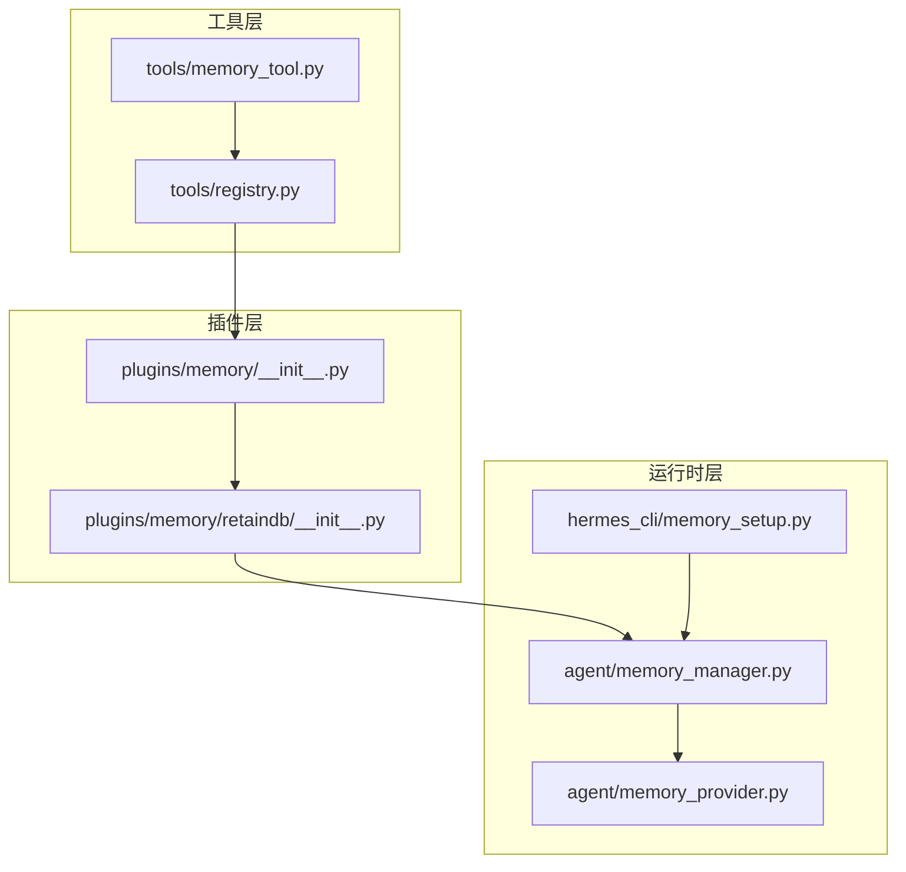
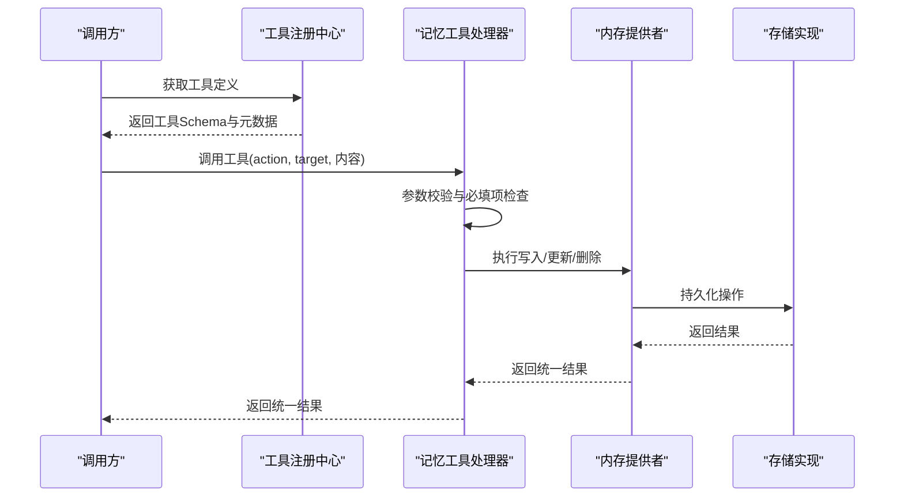
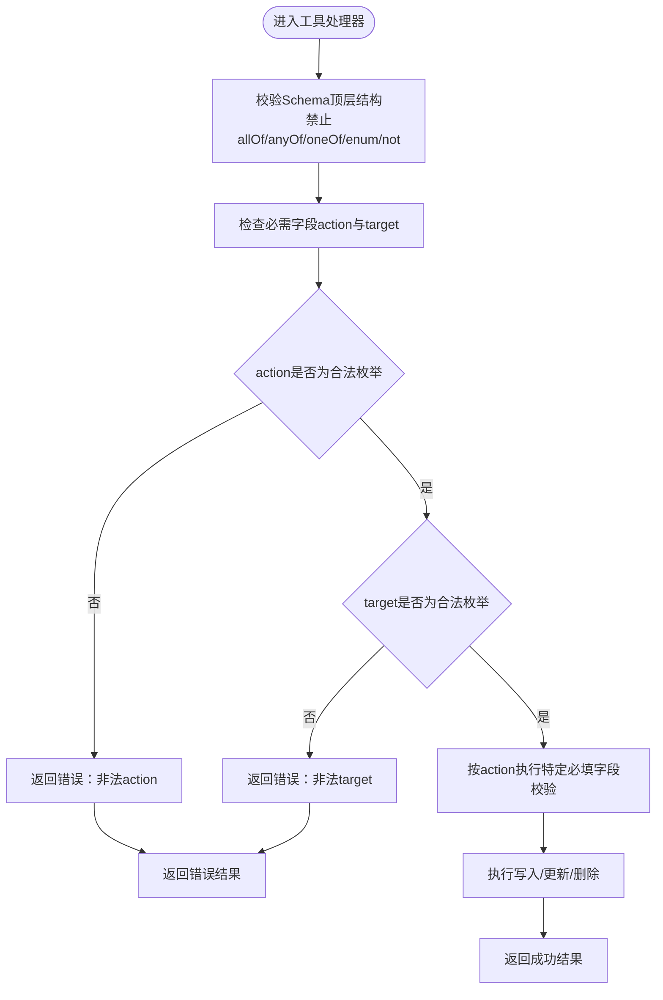
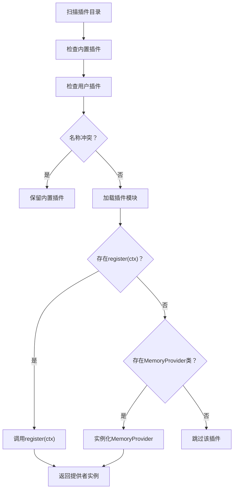
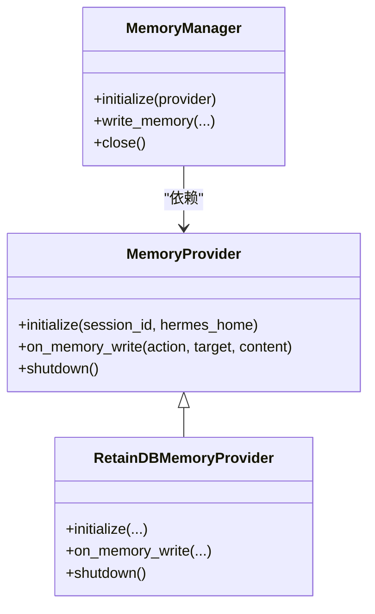
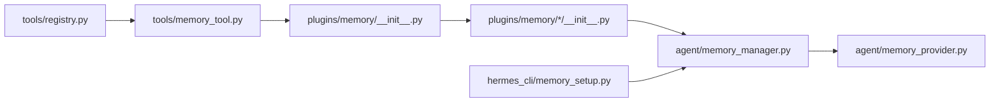

# 记忆工具定义规范

<cite>
**本文档引用的文件**
- [tools/memory_tool.py](file://tools/memory_tool.py)
- [tests/tools/test_memory_tool_schema.py](file://tests/tools/test_memory_tool_schema.py)
- [tests/tools/test_memory_tool_import_fallback.py](file://tests/tools/test_memory_tool_import_fallback.py)
- [plugins/memory/__init__.py](file://plugins/memory/__init__.py)
- [agent/memory_provider.py](file://agent/memory_provider.py)
- [agent/memory_manager.py](file://agent/memory_manager.py)
- [hermes_cli/memory_setup.py](file://hermes_cli/memory_setup.py)
- [plugins/memory/retaindb/__init__.py](file://plugins/memory/retaindb/__init__.py)
- [tests/plugins/test_retaindb_plugin.py](file://tests/plugins/test_retaindb_plugin.py)
- [tools/registry.py](file://tools/registry.py)
</cite>

## 目录
1. [简介](#简介)
2. [项目结构](#项目结构)
3. [核心组件](#核心组件)
4. [架构总览](#架构总览)
5. [详细组件分析](#详细组件分析)
6. [依赖关系分析](#依赖关系分析)
7. [性能考虑](#性能考虑)
8. [故障排除指南](#故障排除指南)
9. [结论](#结论)
10. [附录](#附录)

## 简介
本规范系统性地定义了记忆工具（memory tool）的Schema、参数验证规则与返回值格式，阐明工具元数据结构（名称、描述、参数定义、权限要求），并覆盖工具注册机制、动态加载与版本管理策略。同时提供最佳实践、常见陷阱与具体示例路径，帮助开发者正确实现记忆工具及其插件提供者。

## 项目结构
围绕记忆工具的关键模块分布如下：
- 工具定义与Schema：tools/memory_tool.py
- Schema测试与约束：tests/tools/test_memory_tool_schema.py
- 导入回退与兼容性：tests/tools/test_memory_tool_import_fallback.py
- 插件发现与加载：plugins/memory/__init__.py
- 提供者接口与管理：agent/memory_provider.py、agent/memory_manager.py
- CLI配置与初始化：hermes_cli/memory_setup.py
- 典型插件示例：plugins/memory/retaindb/__init__.py
- 插件行为测试：tests/plugins/test_retaindb_plugin.py
- 工具注册中心：tools/registry.py

**图表来源**
- [tools/memory_tool.py](file://tools/memory_tool.py)
- [plugins/memory/__init__.py](file://plugins/memory/__init__.py)
- [plugins/memory/retaindb/__init__.py](file://plugins/memory/retaindb/__init__.py)
- [agent/memory_provider.py](file://agent/memory_provider.py)
- [agent/memory_manager.py](file://agent/memory_manager.py)
- [hermes_cli/memory_setup.py](file://hermes_cli/memory_setup.py)
- [tools/registry.py](file://tools/registry.py)

**章节来源**
- [tools/memory_tool.py](file://tools/memory_tool.py)
- [plugins/memory/__init__.py](file://plugins/memory/__init__.py)
- [agent/memory_provider.py](file://agent/memory_provider.py)
- [agent/memory_manager.py](file://agent/memory_manager.py)
- [hermes_cli/memory_setup.py](file://hermes_cli/memory_setup.py)
- [tools/registry.py](file://tools/registry.py)

## 核心组件
- 记忆工具Schema与参数验证
  - Schema必须为JSON对象类型，顶层禁止使用allOf/anyOf/oneOf/enum/not等组合器，以兼容严格后端（如Codex）。
  - 必填字段：action、target；action枚举值：add、replace、remove；target枚举值：memory、user。
  - 参数验证应由运行时处理器在执行前进行，而非Schema层面强制。
- 返回值格式
  - 统一返回包含success布尔值的结果对象；错误场景需提供可读的错误信息。
- 工具元数据
  - 名称：memory
  - 描述：用于向记忆存储添加、替换或删除内容的工具
  - 参数定义：见Schema与参数验证规则
  - 权限要求：根据具体提供者实现，通常需要写入权限与会话上下文访问权

**章节来源**
- [tests/tools/test_memory_tool_schema.py:1-49](file://tests/tools/test_memory_tool_schema.py#L1-L49)
- [tools/memory_tool.py](file://tools/memory_tool.py)

## 架构总览
记忆工具的调用链从工具注册中心开始，经由工具处理器执行，最终委托给内存提供者完成持久化操作。插件发现与加载负责在运行时动态选择可用的提供者实现。

**图表来源**
- [tools/registry.py](file://tools/registry.py)
- [tools/memory_tool.py](file://tools/memory_tool.py)
- [plugins/memory/__init__.py](file://plugins/memory/__init__.py)
- [agent/memory_provider.py](file://agent/memory_provider.py)

## 详细组件分析

### 记忆工具Schema与参数验证
- 禁止的顶层组合器：allOf、anyOf、oneOf、enum、not
- 参数结构：parameters为对象类型，必需字段为action与target
- 动作枚举：add、replace、remove
- 目标枚举：memory、user
- 序列化要求：Schema必须可被JSON序列化
- 运行时校验：严格后端不接受Schema内含条件必填逻辑，需在运行时处理器中进行分动作必填字段校验

**图表来源**
- [tests/tools/test_memory_tool_schema.py:25-49](file://tests/tools/test_memory_tool_schema.py#L25-L49)
- [tools/memory_tool.py](file://tools/memory_tool.py)

**章节来源**
- [tests/tools/test_memory_tool_schema.py:1-49](file://tests/tools/test_memory_tool_schema.py#L1-L49)
- [tools/memory_tool.py](file://tools/memory_tool.py)

### 工具元数据结构
- 名称：memory
- 描述：对记忆存储进行增删改查的工具
- 参数定义：action、target及各动作所需的附加参数
- 权限要求：依据提供者实现，通常需要会话上下文访问与写入权限

**章节来源**
- [tools/memory_tool.py](file://tools/memory_tool.py)

### 插件发现与动态加载
- 发现范围：内置插件目录与用户插件目录（$HERMES_HOME/plugins）
- 加载策略：优先内置，同名情况下内置插件优先；支持两种加载模式：register(ctx)函数或直接实例化MemoryProvider类
- 安全命名空间：用户安装插件使用独立命名空间避免与内置插件冲突

**图表来源**
- [plugins/memory/__init__.py:74-216](file://plugins/memory/__init__.py#L74-L216)

**章节来源**
- [plugins/memory/__init__.py:1-216](file://plugins/memory/__init__.py#L1-L216)

### 版本管理与兼容性
- 导入回退：当某些依赖缺失时（如缺少fcntl），工具仍能正常工作并保持功能可用
- 测试保障：通过导入回退测试确保在受限环境下的稳定性

**章节来源**
- [tests/tools/test_memory_tool_import_fallback.py:1-31](file://tests/tools/test_memory_tool_import_fallback.py#L1-L31)

### 提供者接口与管理
- 接口职责：MemoryProvider抽象基类定义了提供者的标准能力边界
- 管理器职责：MemoryManager负责生命周期管理、初始化与关闭
- CLI集成：memory_setup负责配置初始化与引导

**图表来源**
- [agent/memory_provider.py](file://agent/memory_provider.py)
- [agent/memory_manager.py](file://agent/memory_manager.py)
- [plugins/memory/retaindb/__init__.py](file://plugins/memory/retaindb/__init__.py)

**章节来源**
- [agent/memory_provider.py](file://agent/memory_provider.py)
- [agent/memory_manager.py](file://agent/memory_manager.py)
- [hermes_cli/memory_setup.py](file://hermes_cli/memory_setup.py)
- [plugins/memory/retaindb/__init__.py](file://plugins/memory/retaindb/__init__.py)

### 工具注册机制
- 注册中心：tools/registry.py维护工具定义与元数据
- 记忆工具注册：通过注册中心暴露memory工具的Schema与元数据
- 行为验证：测试确保注册入口可用且返回有效定义

**章节来源**
- [tools/registry.py](file://tools/registry.py)
- [tests/tools/test_memory_tool_import_fallback.py:18-31](file://tests/tools/test_memory_tool_import_fallback.py#L18-L31)

## 依赖关系分析
- 工具层依赖注册中心提供元数据
- 插件层通过发现机制动态加载提供者
- 提供者实现依赖运行时管理器进行生命周期管理
- CLI负责初始化配置并驱动管理器

**图表来源**
- [tools/registry.py](file://tools/registry.py)
- [tools/memory_tool.py](file://tools/memory_tool.py)
- [plugins/memory/__init__.py](file://plugins/memory/__init__.py)
- [agent/memory_manager.py](file://agent/memory_manager.py)
- [agent/memory_provider.py](file://agent/memory_provider.py)
- [hermes_cli/memory_setup.py](file://hermes_cli/memory_setup.py)

**章节来源**
- [tools/registry.py](file://tools/registry.py)
- [tools/memory_tool.py](file://tools/memory_tool.py)
- [plugins/memory/__init__.py](file://plugins/memory/__init__.py)
- [agent/memory_manager.py](file://agent/memory_manager.py)
- [agent/memory_provider.py](file://agent/memory_provider.py)
- [hermes_cli/memory_setup.py](file://hermes_cli/memory_setup.py)

## 性能考虑
- Schema复杂度：避免在Schema中引入深层嵌套与条件组合器，减少解析开销
- 运行时校验：将条件必填逻辑下沉到处理器，降低Schema体积与后端拒绝风险
- 插件加载：仅在启动时扫描与加载一次，后续复用实例
- 存储写入：批量写入与去重策略，避免重复写入造成资源浪费

## 故障排除指南
- Codex后端报错“schema must have type 'object'...”：检查Schema顶层是否包含allOf/anyOf/oneOf/enum/not
- 记忆写入无效：确认目标target映射正确（如user映射为特定类型），并检查内容非空
- 插件未加载：检查插件目录结构与register(ctx)/MemoryProvider类实现，确认名称无冲突
- 导入失败：关注fcntl缺失导致的回退路径，确保工具仍可正常工作

**章节来源**
- [tests/tools/test_memory_tool_schema.py:28-36](file://tests/tools/test_memory_tool_schema.py#L28-L36)
- [tests/plugins/test_retaindb_plugin.py:714-724](file://tests/plugins/test_retaindb_plugin.py#L714-L724)
- [tests/tools/test_memory_tool_import_fallback.py:10-31](file://tests/tools/test_memory_tool_import_fallback.py#L10-L31)

## 结论
记忆工具定义规范明确了Schema约束、参数验证与返回值格式，并建立了完善的插件发现与加载机制。遵循本规范可确保工具在多后端环境下稳定运行，并通过提供者扩展实现灵活的记忆存储方案。

## 附录
- 最佳实践
  - 将条件必填逻辑放在运行时处理器，避免Schema顶层组合器
  - 明确action与target的枚举值，保持一致性
  - 在提供者实现中处理空内容与异常情况
  - 使用CLI初始化配置，确保会话上下文可用
- 常见陷阱
  - 在Schema中使用allOf/anyOf/oneOf/enum/not导致严格后端拒绝
  - 忽略target映射导致存储类型不正确
  - 未处理空内容导致无效写入
  - 插件命名冲突导致内置插件被覆盖
- 示例路径
  - 记忆工具Schema与测试：[tools/memory_tool.py](file://tools/memory_tool.py)，[tests/tools/test_memory_tool_schema.py](file://tests/tools/test_memory_tool_schema.py)
  - 插件发现与加载：[plugins/memory/__init__.py](file://plugins/memory/__init__.py)
  - 提供者接口与实现：[agent/memory_provider.py](file://agent/memory_provider.py)，[plugins/memory/retaindb/__init__.py](file://plugins/memory/retaindb/__init__.py)
  - CLI初始化：[hermes_cli/memory_setup.py](file://hermes_cli/memory_setup.py)
  - 导入回退测试：[tests/tools/test_memory_tool_import_fallback.py](file://tests/tools/test_memory_tool_import_fallback.py)