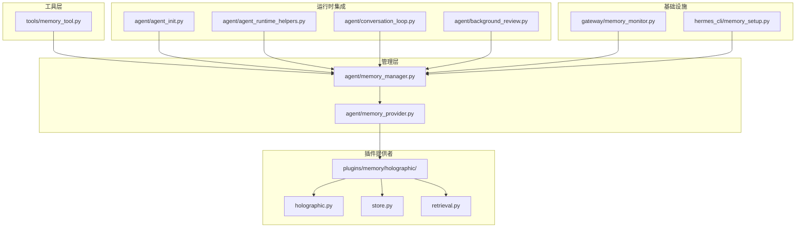
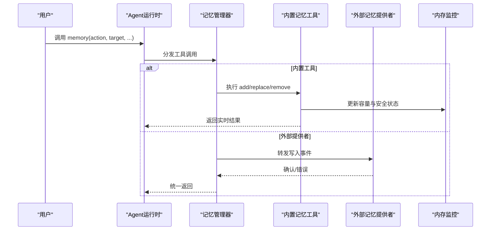
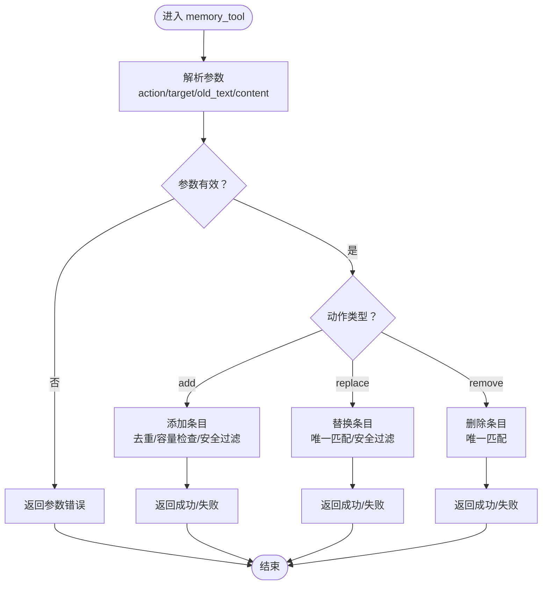
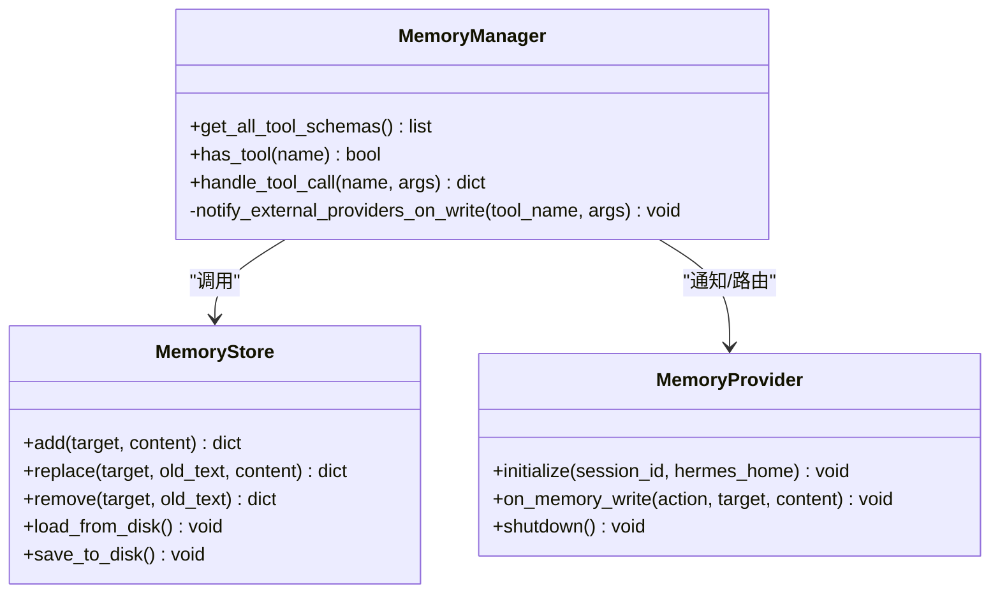
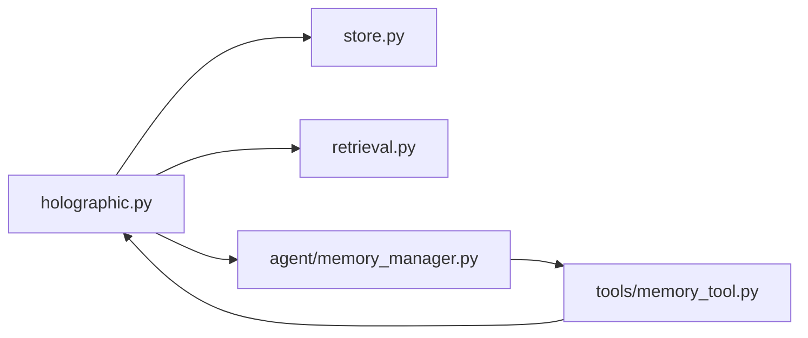
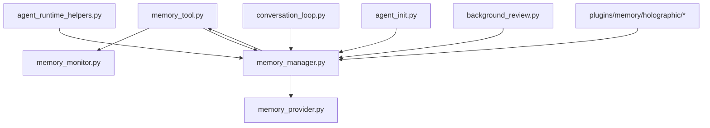

# 记忆工具系统

<cite>
**本文档引用的文件**
- [memory_tool.py](file://tools/memory_tool.py)
- [memory_manager.py](file://agent/memory_manager.py)
- [memory_provider.py](file://agent/memory_provider.py)
- [memory_monitor.py](file://gateway/memory_monitor.py)
- [memory_setup.py](file://hermes_cli/memory_setup.py)
- [test_memory_tool.py](file://tests/tools/test_memory_tool.py)
- [test_memory_provider.py](file://tests/agent/test_memory_provider.py)
- [agent_init.py](file://agent/agent_init.py)
- [agent_runtime_helpers.py](file://agent/agent_runtime_helpers.py)
- [conversation_loop.py](file://agent/conversation_loop.py)
- [background_review.py](file://agent/background_review.py)
- [holographic.py](file://plugins/memory/holographic/holographic.py)
- [store.py](file://plugins/memory/holographic/store.py)
- [retrieval.py](file://plugins/memory/holographic/retrieval.py)
- [__init__.py](file://plugins/memory/holographic/__init__.py)
- [memory.md](file://website/docs/user-guide/features/memory.md)
</cite>

## 目录
1. [简介](#简介)
2. [项目结构](#项目结构)
3. [核心组件](#核心组件)
4. [架构总览](#架构总览)
5. [详细组件分析](#详细组件分析)
6. [依赖关系分析](#依赖关系分析)
7. [性能考虑](#性能考虑)
8. [故障排除指南](#故障排除指南)
9. [结论](#结论)
10. [附录](#附录)

## 简介
本文件系统性阐述 Hermes Agent 的记忆工具体系：从工具定义规范、执行引擎到结果处理机制，覆盖内置记忆工具与外部插件记忆提供者的统一抽象与协作方式。重点说明内存存储的 Schema 定义、参数验证、容量控制与安全防护策略，并提供使用示例、最佳实践与扩展开发指南。

## 项目结构
记忆工具系统由以下层次构成：
- 工具层：内置 memory_tool（面向用户交互与会话上下文注入）
- 管理层：memory_manager（统一调度与路由）
- 提供者层：memory_provider（抽象接口）与具体插件实现（如 holographic）
- 基础设施：gateway/memory_monitor（监控）、hermes_cli/memory_setup（初始化）
- 运行时集成：agent_runtime_helpers、conversation_loop、agent_init 等



**图表来源**
- [memory_tool.py](file://tools/memory_tool.py)
- [memory_manager.py](file://agent/memory_manager.py)
- [memory_provider.py](file://agent/memory_provider.py)
- [memory_monitor.py](file://gateway/memory_monitor.py)
- [memory_setup.py](file://hermes_cli/memory_setup.py)
- [holographic.py](file://plugins/memory/holographic/holographic.py)
- [store.py](file://plugins/memory/holographic/store.py)
- [retrieval.py](file://plugins/memory/holographic/retrieval.py)
- [agent_init.py](file://agent/agent_init.py)
- [agent_runtime_helpers.py](file://agent/agent_runtime_helpers.py)
- [conversation_loop.py](file://agent/conversation_loop.py)
- [background_review.py](file://agent/background_review.py)

**章节来源**
- [memory_tool.py](file://tools/memory_tool.py)
- [memory_manager.py](file://agent/memory_manager.py)
- [memory_provider.py](file://agent/memory_provider.py)
- [memory_monitor.py](file://gateway/memory_monitor.py)
- [memory_setup.py](file://hermes_cli/memory_setup.py)
- [agent_init.py](file://agent/agent_init.py)
- [agent_runtime_helpers.py](file://agent/agent_runtime_helpers.py)
- [conversation_loop.py](file://agent/conversation_loop.py)
- [background_review.py](file://agent/background_review.py)

## 核心组件
- 内置记忆工具（memory_tool）：提供 add/replace/remove 操作，自动注入系统提示词，支持容量限制与安全过滤。
- 记忆管理器（memory_manager）：统一注册、分发与路由工具调用，协调内置工具与外部提供者。
- 记忆提供者接口（memory_provider）：抽象外部记忆后端的生命周期回调（如 on_memory_write）。
- 插件记忆提供者（如 holographic）：实现检索/存储等能力，可与内置工具协同工作。
- 运行时集成：在会话循环中预取外部状态，在工具调用时进行拦截与转发。

**章节来源**
- [memory_tool.py](file://tools/memory_tool.py)
- [memory_manager.py](file://agent/memory_manager.py)
- [memory_provider.py](file://agent/memory_provider.py)
- [holographic.py](file://plugins/memory/holographic/holographic.py)

## 架构总览
记忆工具系统采用“内置工具 + 外部提供者”的双层架构。内置工具负责用户交互与上下文注入；管理器负责工具注册、调用分发与跨提供者协调；提供者接口抽象外部实现；运行时在会话开始前预取外部状态并在工具调用时进行拦截与转发。



**图表来源**
- [agent_runtime_helpers.py](file://agent/agent_runtime_helpers.py)
- [memory_manager.py](file://agent/memory_manager.py)
- [memory_tool.py](file://tools/memory_tool.py)
- [memory_provider.py](file://agent/memory_provider.py)
- [memory_monitor.py](file://gateway/memory_monitor.py)

## 详细组件分析

### 内置记忆工具（memory_tool）
- 功能特性
  - 支持 add/replace/remove 三种动作，基于子串匹配定位条目。
  - 自动注入系统提示词（仅会话开始时冻结快照），工具响应显示实时状态。
  - 容量限制与字符计数，超限时拒绝写入并提示合并策略。
  - 安全过滤：阻断潜在系统提示词注入与敏感内容。
- Schema 与参数
  - 必填字段：action（add/replace/remove）、target（memory/user）。
  - replace/remove 需要 old_text（唯一子串）；add 需要 content。
  - 参数校验：空值拒绝、歧义匹配拒绝、重复条目去重。
- 结果处理
  - 成功：返回 success=true 及当前 entries 列表或变更后的条目。
  - 失败：返回 success=false、错误信息与当前使用情况。
- 使用示例
  - 添加条目：action=add、target=memory、content=“用户偏好...”
  - 替换条目：action=replace、target=memory、old_text=“旧片段”、content=“新内容”
  - 删除条目：action=remove、target=memory、old_text=“待删除片段”



**图表来源**
- [memory_tool.py](file://tools/memory_tool.py)
- [test_memory_tool.py](file://tests/tools/test_memory_tool.py)

**章节来源**
- [memory_tool.py](file://tools/memory_tool.py)
- [test_memory_tool.py](file://tests/tools/test_memory_tool.py)
- [memory.md](file://website/docs/user-guide/features/memory.md)

### 记忆管理器（memory_manager）
- 职责
  - 注册与发现工具：聚合内置工具与外部提供者工具的 Schema。
  - 路由与分发：根据函数名将工具调用路由至对应处理器。
  - 错误处理：当无提供者处理某工具时返回明确错误。
  - 外部提供者通知：内置工具写入时触发外部提供者回调（如 on_memory_write）。
- 关键流程
  - 初始化：注入工具 Schema，建立工具名称到处理器的映射。
  - 调用：has_tool 检查 + handle_tool_call 路由。
  - 写入通知：notify_external_providers_on_write



**图表来源**
- [memory_manager.py](file://agent/memory_manager.py)
- [memory_provider.py](file://agent/memory_provider.py)
- [memory_tool.py](file://tools/memory_tool.py)

**章节来源**
- [memory_manager.py](file://agent/memory_manager.py)
- [memory_provider.py](file://agent/memory_provider.py)

### 记忆提供者接口（memory_provider）
- 抽象接口
  - initialize：初始化会话与资源。
  - on_memory_write：写入事件回调（用于同步到外部存储）。
  - shutdown：释放资源。
- 生命周期
  - 在会话开始前初始化，写入事件发生时被管理器调用，会话结束时关闭。
- 与内置工具的协作
  - 内置工具写入后，管理器通过 notify_external_providers_on_write 触发回调，确保外部一致性。

**章节来源**
- [memory_provider.py](file://agent/memory_provider.py)
- [memory_manager.py](file://agent/memory_manager.py)

### 插件记忆提供者（以 holographic 为例）
- 能力范围
  - 存储与检索：基于 store/retrieval 模块实现持久化与查询。
  - 与内置工具协同：通过管理器注册工具 Schema 并接收写入通知。
- 架构要点
  - 存储层：负责条目的增删改查与序列化。
  - 检索层：支持向量化检索与过滤。
  - 协同层：与管理器对接，保证一致性与可观测性。



**图表来源**
- [holographic.py](file://plugins/memory/holographic/holographic.py)
- [store.py](file://plugins/memory/holographic/store.py)
- [retrieval.py](file://plugins/memory/holographic/retrieval.py)
- [memory_manager.py](file://agent/memory_manager.py)
- [memory_tool.py](file://tools/memory_tool.py)

**章节来源**
- [holographic.py](file://plugins/memory/holographic/holographic.py)
- [store.py](file://plugins/memory/holographic/store.py)
- [retrieval.py](file://plugins/memory/holographic/retrieval.py)

### 运行时集成与会话循环
- 工具注册与拦截
  - agent_init：注入记忆工具 Schema，确保工具集可用。
  - agent_runtime_helpers：拦截工具调用，优先尝试内置工具，否则转交管理器。
- 会话循环
  - conversation_loop：在工具循环前预取外部状态，避免写入后未生效导致的不一致。
  - background_review：记录写入来源（如 assistant_tool），便于审计与溯源。

```mermaid
sequenceDiagram
participant Init as "agent_init"
participant Runtime as "agent_runtime_helpers"
participant Loop as "conversation_loop"
participant MM as "memory_manager"
participant MT as "memory_tool"
Init->>MM : 注入工具 Schema
Runtime->>Runtime : 拦截工具调用
alt 内置工具
Runtime->>MT : 执行
else 外部工具
Runtime->>MM : 转发调用
end
Loop->>MM : 预取外部状态
```

**图表来源**
- [agent_init.py](file://agent/agent_init.py)
- [agent_runtime_helpers.py](file://agent/agent_runtime_helpers.py)
- [conversation_loop.py](file://agent/conversation_loop.py)
- [memory_manager.py](file://agent/memory_manager.py)
- [memory_tool.py](file://tools/memory_tool.py)

**章节来源**
- [agent_init.py](file://agent/agent_init.py)
- [agent_runtime_helpers.py](file://agent/agent_runtime_helpers.py)
- [conversation_loop.py](file://agent/conversation_loop.py)
- [background_review.py](file://agent/background_review.py)

## 依赖关系分析
- 组件耦合
  - memory_tool 依赖 memory_monitor 进行容量与安全状态更新。
  - memory_manager 同时依赖 memory_tool 与 memory_provider，形成双向协作。
  - 运行时组件（agent_runtime_helpers、conversation_loop）对 memory_manager 存在直接依赖。
- 外部依赖
  - 插件提供者（如 holographic）通过管理器注册工具，与内置工具共享同一调用面。
- 循环依赖风险
  - 通过抽象接口（memory_provider）与管理器解耦，避免直接循环依赖。



**图表来源**
- [memory_tool.py](file://tools/memory_tool.py)
- [memory_monitor.py](file://gateway/memory_monitor.py)
- [memory_manager.py](file://agent/memory_manager.py)
- [memory_provider.py](file://agent/memory_provider.py)
- [agent_runtime_helpers.py](file://agent/agent_runtime_helpers.py)
- [conversation_loop.py](file://agent/conversation_loop.py)
- [agent_init.py](file://agent/agent_init.py)
- [background_review.py](file://agent/background_review.py)
- [holographic.py](file://plugins/memory/holographic/holographic.py)

**章节来源**
- [memory_tool.py](file://tools/memory_tool.py)
- [memory_manager.py](file://agent/memory_manager.py)
- [memory_provider.py](file://agent/memory_provider.py)
- [memory_monitor.py](file://gateway/memory_monitor.py)
- [agent_runtime_helpers.py](file://agent/agent_runtime_helpers.py)
- [conversation_loop.py](file://agent/conversation_loop.py)
- [agent_init.py](file://agent/agent_init.py)
- [background_review.py](file://agent/background_review.py)
- [holographic.py](file://plugins/memory/holographic/holographic.py)

## 性能考虑
- 系统提示词冻结快照：会话开始时捕获一次系统提示词注入，避免中途变化带来的缓存失效与性能回退。
- 实时状态可见性：工具响应展示实时内存状态，便于快速反馈与调试。
- 容量管理：在接近阈值（建议>80%）时提前合并条目，减少后续写入失败与回滚成本。
- 外部提供者预取：在工具循环前预取外部状态，降低写入后未生效导致的往返开销。

**章节来源**
- [memory.md](file://website/docs/user-guide/features/memory.md)
- [conversation_loop.py](file://agent/conversation_loop.py)

## 故障排除指南
- 参数错误
  - 空 old_text 或 content：拒绝执行并返回错误。
  - 子串匹配不唯一：要求更精确的 old_text。
- 容量超限
  - 添加失败：根据错误信息查看当前使用情况，合并或删除冗余条目后再试。
- 安全拦截
  - 检测到潜在注入或敏感内容：返回 Blocked 相关错误，需调整内容或使用更安全的表达。
- 外部提供者问题
  - 写入未生效：确认 initialize/shutdown 生命周期是否正确，检查 on_memory_write 回调是否被触发。

**章节来源**
- [test_memory_tool.py](file://tests/tools/test_memory_tool.py)
- [test_memory_provider.py](file://tests/agent/test_memory_provider.py)
- [memory_tool.py](file://tools/memory_tool.py)
- [memory_provider.py](file://agent/memory_provider.py)

## 结论
Hermes Agent 的记忆工具系统通过“内置工具 + 外部提供者 + 管理器”的架构实现了统一、安全且可扩展的记忆能力。内置工具负责易用的操作与上下文注入，管理器负责路由与一致性保障，外部提供者通过抽象接口实现能力扩展。配合容量控制与安全过滤，系统在可用性与安全性之间取得平衡。

## 附录

### Schema 定义与参数验证
- Schema 来源：工具注册由 agent_init 注入，memory_manager 聚合所有工具 Schema。
- 参数验证：memory_tool 对必填项、唯一性与内容安全进行严格校验。
- 错误处理：统一返回 success 字段与错误信息，便于上层处理。

**章节来源**
- [agent_init.py](file://agent/agent_init.py)
- [memory_manager.py](file://agent/memory_manager.py)
- [memory_tool.py](file://tools/memory_tool.py)

### 使用示例与最佳实践
- 示例路径
  - 添加条目：参见 [memory_tool.py](file://tools/memory_tool.py)
  - 替换条目：参见 [memory_tool.py](file://tools/memory_tool.py)
  - 删除条目：参见 [memory_tool.py](file://tools/memory_tool.py)
- 最佳实践
  - 避免冗余与显而易见的信息，优先保留高价值事实。
  - 当接近容量上限时，先合并再新增。
  - 使用背景审查工具记录写入来源，便于审计。

**章节来源**
- [memory.md](file://website/docs/user-guide/features/memory.md)
- [background_review.py](file://agent/background_review.py)

### 扩展开发指南
- 开发步骤
  - 实现 memory_provider 接口：initialize/on_memory_write/shutdown。
  - 在插件中注册工具 Schema，并通过 memory_manager 注入。
  - 在写入事件发生时，确保外部存储与内置状态一致。
- 调试方法
  - 使用测试用例验证参数校验与错误处理。
  - 通过运行时日志与内存监控观察容量与安全状态变化。

**章节来源**
- [memory_provider.py](file://agent/memory_provider.py)
- [memory_manager.py](file://agent/memory_manager.py)
- [test_memory_provider.py](file://tests/agent/test_memory_provider.py)