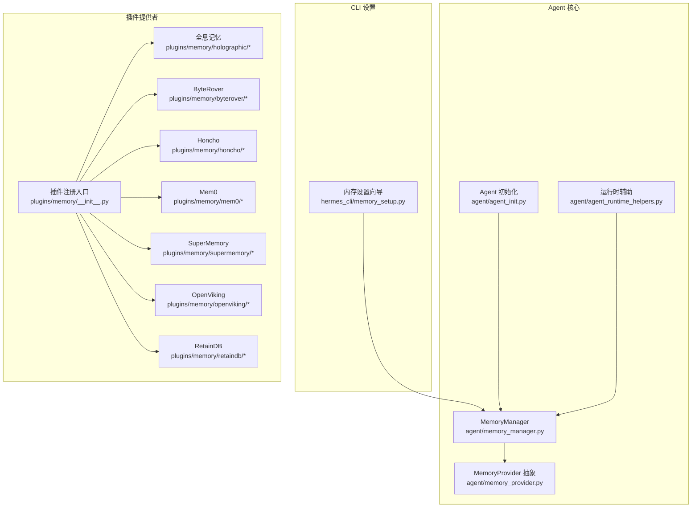
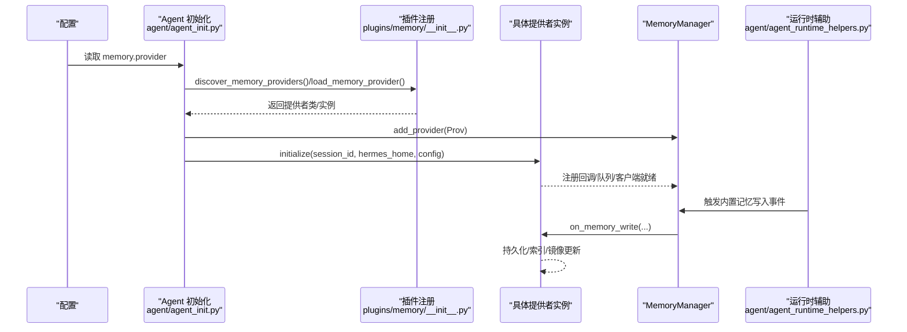
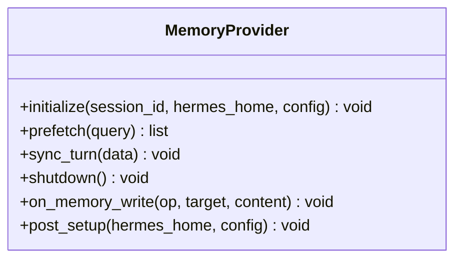
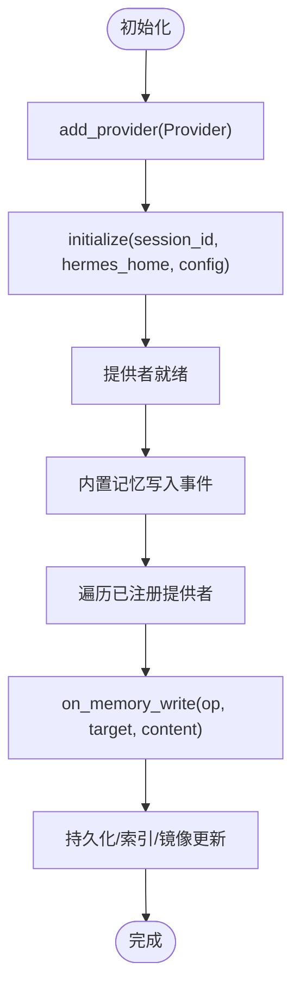
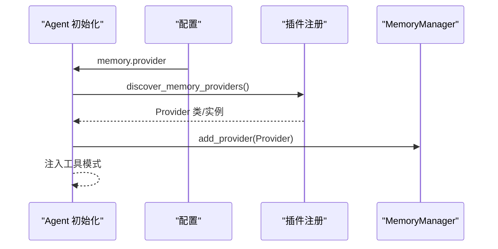
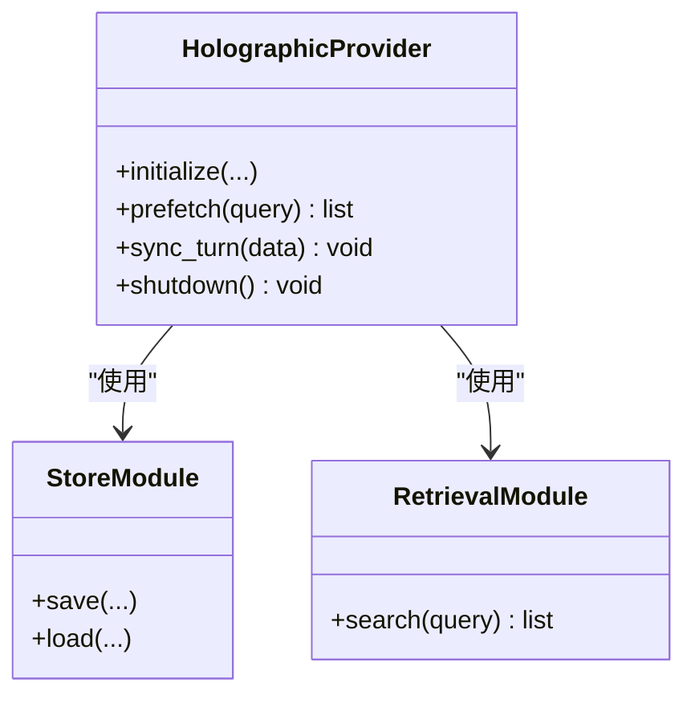
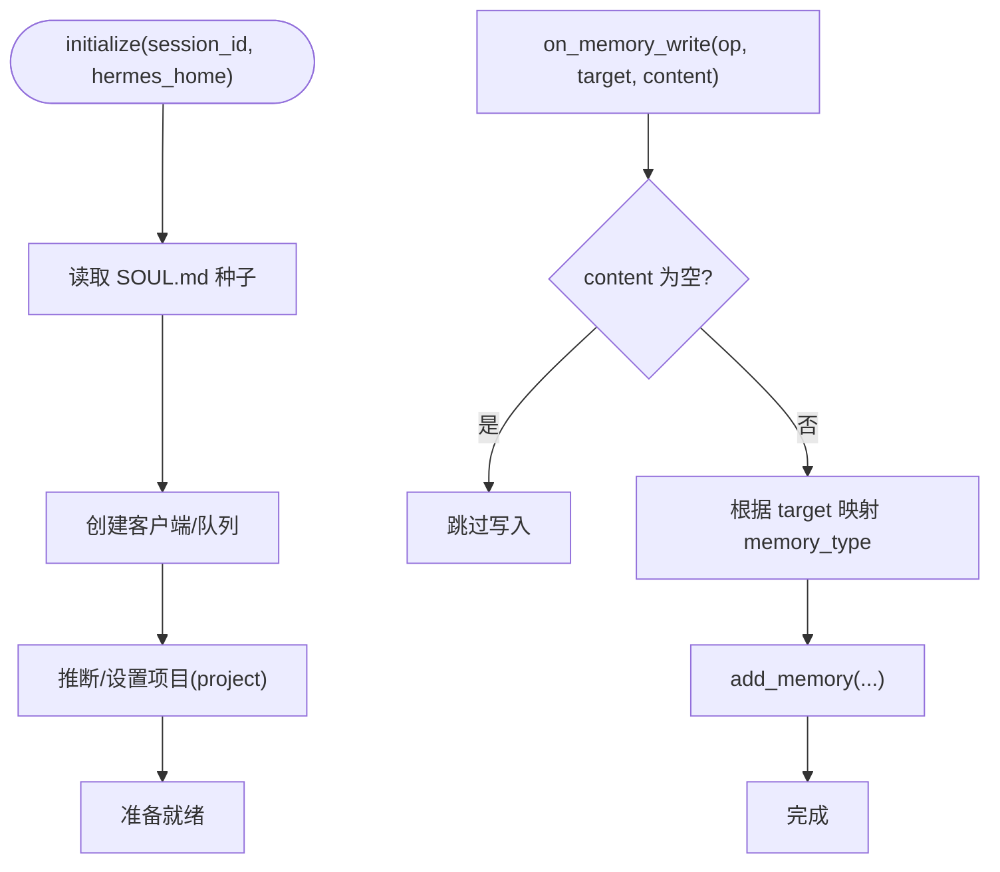
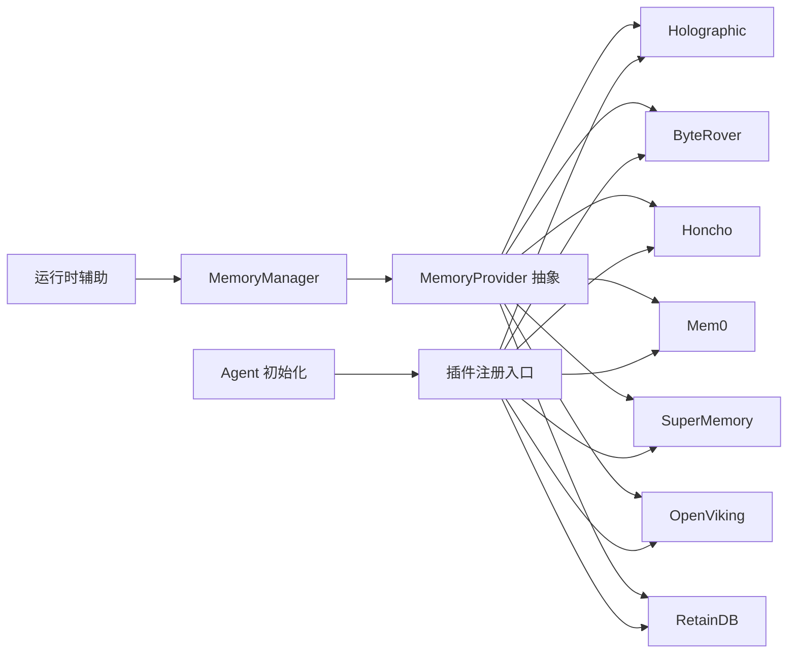

# 记忆提供者集成

<cite>
**本文引用的文件**
- [agent/memory_provider.py](file://agent/memory_provider.py)
- [agent/memory_manager.py](file://agent/memory_manager.py)
- [agent/agent_init.py](file://agent/agent_init.py)
- [agent/agent_runtime_helpers.py](file://agent/agent_runtime_helpers.py)
- [hermes_cli/memory_setup.py](file://hermes_cli/memory_setup.py)
- [plugins/memory/__init__.py](file://plugins/memory/__init__.py)
- [plugins/memory/holographic/__init__.py](file://plugins/memory/holographic/__init__.py)
- [plugins/memory/holographic/holographic.py](file://plugins/memory/holographic/holographic.py)
- [plugins/memory/holographic/store.py](file://plugins/memory/holographic/store.py)
- [plugins/memory/holographic/retrieval.py](file://plugins/memory/holographic/retrieval.py)
- [plugins/memory/byterover/__init__.py](file://plugins/memory/byterover/__init__.py)
- [plugins/memory/honcho/__init__.py](file://plugins/memory/honcho/__init__.py)
- [plugins/memory/mem0/__init__.py](file://plugins/memory/mem0/__init__.py)
- [plugins/memory/supermemory/__init__.py](file://plugins/memory/supermemory/__init__.py)
- [plugins/memory/openviking/__init__.py](file://plugins/memory/openviking/__init__.py)
- [plugins/memory/retaindb/__init__.py](file://plugins/memory/retaindb/__init__.py)
- [tests/plugins/test_retaindb_plugin.py](file://tests/plugins/test_retaindb_plugin.py)
- [website/docs/user-guide/features/memory-providers.md](file://website/docs/user-guide/features/memory-providers.md)
</cite>

## 目录
1. [简介](#简介)
2. [项目结构](#项目结构)
3. [核心组件](#核心组件)
4. [架构总览](#架构总览)
5. [详细组件分析](#详细组件分析)
6. [依赖关系分析](#依赖关系分析)
7. [性能考量](#性能考量)
8. [故障排查指南](#故障排查指南)
9. [结论](#结论)
10. [附录](#附录)

## 简介
本文件系统性阐述记忆提供者（Memory Provider）在 Hermes 中的集成与运行机制，覆盖提供者抽象、初始化流程、会话作用域、桥接内置记忆写入、配置发现与加载、以及典型提供者的实现要点。文档同时给出连接与事务处理的通用模式、故障恢复策略、数据迁移与升级建议，并提供可复用的配置模板与集成步骤。

## 项目结构
记忆提供者体系由“抽象接口 + 管理器 + CLI 设置 + 插件实现”构成，核心入口与生命周期管理集中在 agent 子模块，插件实现位于 plugins/memory 下的多个子提供者中。

**图表来源**
- [agent/memory_provider.py](file://agent/memory_provider.py)
- [agent/memory_manager.py](file://agent/memory_manager.py)
- [agent/agent_init.py](file://agent/agent_init.py)
- [agent/agent_runtime_helpers.py](file://agent/agent_runtime_helpers.py)
- [hermes_cli/memory_setup.py](file://hermes_cli/memory_setup.py)
- [plugins/memory/__init__.py](file://plugins/memory/__init__.py)
- [plugins/memory/holographic/__init__.py](file://plugins/memory/holographic/__init__.py)
- [plugins/memory/byterover/__init__.py](file://plugins/memory/byterover/__init__.py)
- [plugins/memory/honcho/__init__.py](file://plugins/memory/honcho/__init__.py)
- [plugins/memory/mem0/__init__.py](file://plugins/memory/mem0/__init__.py)
- [plugins/memory/supermemory/__init__.py](file://plugins/memory/supermemory/__init__.py)
- [plugins/memory/openviking/__init__.py](file://plugins/memory/openviking/__init__.py)
- [plugins/memory/retaindb/__init__.py](file://plugins/memory/retaindb/__init__.py)

**章节来源**
- [agent/memory_provider.py](file://agent/memory_provider.py)
- [agent/memory_manager.py](file://agent/memory_manager.py)
- [agent/agent_init.py](file://agent/agent_init.py)
- [hermes_cli/memory_setup.py](file://hermes_cli/memory_setup.py)
- [plugins/memory/__init__.py](file://plugins/memory/__init__.py)

## 核心组件
- MemoryProvider 抽象：定义统一的生命周期与接口契约，如初始化、预取、回合同步、关闭等。
- MemoryManager：负责提供者注册、会话作用域管理、桥接内置记忆写入事件。
- Agent 初始化：从配置读取 memory.provider 并动态加载对应插件。
- 运行时辅助：在内置记忆写入时通知外部提供者，确保镜像一致性。
- CLI 内存设置：引导用户完成提供者配置与验证。

**章节来源**
- [agent/memory_provider.py](file://agent/memory_provider.py)
- [agent/memory_manager.py](file://agent/memory_manager.py)
- [agent/agent_init.py](file://agent/agent_init.py)
- [agent/agent_runtime_helpers.py](file://agent/agent_runtime_helpers.py)
- [hermes_cli/memory_setup.py](file://hermes_cli/memory_setup.py)

## 架构总览
下图展示从配置到插件加载、会话初始化、再到运行时写入桥接的整体流程。

**图表来源**
- [agent/agent_init.py](file://agent/agent_init.py)
- [plugins/memory/__init__.py](file://plugins/memory/__init__.py)
- [agent/memory_manager.py](file://agent/memory_manager.py)
- [agent/agent_runtime_helpers.py](file://agent/agent_runtime_helpers.py)

## 详细组件分析

### MemoryProvider 抽象与生命周期
- 职责边界：提供统一的初始化、预取、回合同步、关闭等接口；支持可选的 post_setup 集成向导。
- 会话作用域：initialize 接收 session_id 与 hermes_home，用于隔离存储路径或命名空间。
- 事件桥接：on_memory_write 在内置记忆变更时被调用，实现对外部存储的同步。

**图表来源**
- [agent/memory_provider.py](file://agent/memory_provider.py)

**章节来源**
- [agent/memory_provider.py](file://agent/memory_provider.py)

### MemoryManager 与会话作用域
- 提供者注册：add_provider 将具体实现注入管理器。
- 会话隔离：通过 session_id 与 hermes_home 实现 per-session/per-profile 的数据隔离。
- 事件分发：在内置记忆写入时，遍历已注册提供者并触发 on_memory_write。

**图表来源**
- [agent/memory_manager.py](file://agent/memory_manager.py)
- [agent/agent_runtime_helpers.py](file://agent/agent_runtime_helpers.py)

**章节来源**
- [agent/memory_manager.py](file://agent/memory_manager.py)
- [agent/agent_runtime_helpers.py](file://agent/agent_runtime_helpers.py)

### Agent 初始化与插件加载
- 配置驱动：从配置读取 memory.provider，动态加载对应插件。
- 注册与注入：通过 discover_memory_providers/load_memory_provider 获取实现并注册到 MemoryManager。
- 工具面集成：将提供者工具模式注入到工具表面，便于调用。

**图表来源**
- [agent/agent_init.py](file://agent/agent_init.py)
- [plugins/memory/__init__.py](file://plugins/memory/__init__.py)

**章节来源**
- [agent/agent_init.py](file://agent/agent_init.py)
- [plugins/memory/__init__.py](file://plugins/memory/__init__.py)

### CLI 内存设置向导
- 功能：引导用户完成提供者配置（如凭据、端点、项目名等），并进行可用性检查。
- 集成：与 MemoryProvider.post_setup 对接，完成首次初始化与校验。

**章节来源**
- [hermes_cli/memory_setup.py](file://hermes_cli/memory_setup.py)

### 典型提供者实现要点

#### 全息记忆（Holographic）
- 存储与检索：通过独立的 store 与 retrieval 模块实现持久化与查询。
- 会话与隔离：基于 session_id 与 hermes_home 维持 per-session 数据隔离。
- 预取与回合同步：支持 prefetch 与 sync_turn，适配上下文引擎需求。

**图表来源**
- [plugins/memory/holographic/__init__.py](file://plugins/memory/holographic/__init__.py)
- [plugins/memory/holographic/holographic.py](file://plugins/memory/holographic/holographic.py)
- [plugins/memory/holographic/store.py](file://plugins/memory/holographic/store.py)
- [plugins/memory/holographic/retrieval.py](file://plugins/memory/holographic/retrieval.py)

**章节来源**
- [plugins/memory/holographic/__init__.py](file://plugins/memory/holographic/__init__.py)
- [plugins/memory/holographic/holographic.py](file://plugins/memory/holographic/holographic.py)
- [plugins/memory/holographic/store.py](file://plugins/memory/holographic/store.py)
- [plugins/memory/holographic/retrieval.py](file://plugins/memory/holographic/retrieval.py)

#### ByteRover
- 特点：本地存储型提供者，数据路径与会话绑定，适合离线与低延迟场景。
- 隔离：通过 hermes_home 与 session_id 形成 per-profile/per-session 路径。

**章节来源**
- [plugins/memory/byterover/__init__.py](file://plugins/memory/byterover/__init__.py)

#### Honcho
- 特点：配置文件型提供者，凭据与配置位于 hermes_home，支持 per-profile 隔离。
- 集成：通过配置项控制行为，适合需要显式配置的场景。

**章节来源**
- [plugins/memory/honcho/__init__.py](file://plugins/memory/honcho/__init__.py)

#### Mem0
- 特点：云/自托管均可，支持多租户与项目隔离，适合团队协作与集中管理。
- 集成：通过环境变量或配置项传入访问凭据与端点。

**章节来源**
- [plugins/memory/mem0/__init__.py](file://plugins/memory/mem0/__init__.py)

#### SuperMemory
- 特点：面向大规模知识管理，强调检索与索引能力，适合长上下文与高召回场景。
- 集成：通过配置项指定索引与检索参数。

**章节来源**
- [plugins/memory/supermemory/__init__.py](file://plugins/memory/supermemory/__init__.py)

#### OpenViking
- 特点：基于环境变量的 per-profile 配置，适合多环境与多账户场景。
- 集成：通过 .env 文件与环境变量组合完成配置。

**章节来源**
- [plugins/memory/openviking/__init__.py](file://plugins/memory/openviking/__init__.py)

#### RetainDB
- 特点：云原生提供者，自动派生 per-profile 项目名，支持类型映射与空内容过滤。
- 行为验证：测试覆盖了可用性检测、默认/显式项目、会话种子、类型映射、空内容跳过等。

**图表来源**
- [plugins/memory/retaindb/__init__.py](file://plugins/memory/retaindb/__init__.py)
- [tests/plugins/test_retaindb_plugin.py](file://tests/plugins/test_retaindb_plugin.py)

**章节来源**
- [plugins/memory/retaindb/__init__.py](file://plugins/memory/retaindb/__init__.py)
- [tests/plugins/test_retaindb_plugin.py](file://tests/plugins/test_retaindb_plugin.py)

## 依赖关系分析
- 抽象到实现：所有提供者均实现 MemoryProvider 抽象，确保统一接口与生命周期。
- 发现与加载：通过 plugins/memory/__init__.py 的发现机制加载用户/项目/第三方插件。
- 运行时耦合：MemoryManager 与 agent_runtime_helpers 协作，确保内置记忆写入事件被外部提供者感知。
- 配置驱动：Agent 初始化阶段依据配置选择具体提供者，形成松耦合的插件化架构。

**图表来源**
- [agent/memory_provider.py](file://agent/memory_provider.py)
- [agent/memory_manager.py](file://agent/memory_manager.py)
- [agent/agent_init.py](file://agent/agent_init.py)
- [agent/agent_runtime_helpers.py](file://agent/agent_runtime_helpers.py)
- [plugins/memory/__init__.py](file://plugins/memory/__init__.py)

**章节来源**
- [agent/memory_provider.py](file://agent/memory_provider.py)
- [agent/memory_manager.py](file://agent/memory_manager.py)
- [agent/agent_init.py](file://agent/agent_init.py)
- [agent/agent_runtime_helpers.py](file://agent/agent_runtime_helpers.py)
- [plugins/memory/__init__.py](file://plugins/memory/__init__.py)

## 性能考量
- 本地 vs 云端：本地存储型（如 ByteRover、Holographic）通常具备更低延迟与更好隐私性；云端型（如 Mem0、RetainDB）具备更强的检索与扩展能力。
- 预取与索引：提供者应支持 prefetch 以减少检索延迟；索引质量直接影响召回与吞吐。
- 会话隔离成本：per-session/per-profile 隔离带来额外的路径/命名空间管理开销，需结合业务规模评估。
- 批量与并发：在 sync_turn 中采用批量写入与并发控制，避免阻塞主回合计流程。

[本节为通用指导，无需列出具体文件来源]

## 故障排查指南
- 可用性检查：部分提供者支持 is_available 判定，优先在初始化前进行环境变量/凭据校验。
- 空内容过滤：如 RetainDB 对空内容写入会直接跳过，避免无意义数据进入索引。
- 类型映射：确保 target 到 memory_type 的映射正确，避免检索偏差。
- 会话种子：如 RetainDB 支持从 SOUL.md 种子初始化，缺失时可能影响初始检索效果。
- 配置隔离：确认 per-profile 的配置路径与权限，避免跨配置污染。

**章节来源**
- [tests/plugins/test_retaindb_plugin.py](file://tests/plugins/test_retaindb_plugin.py)
- [website/docs/user-guide/features/memory-providers.md](file://website/docs/user-guide/features/memory-providers.md)

## 结论
Hermes 的记忆提供者采用“抽象 + 插件化 + 配置驱动”的架构，既保证了统一接口与生命周期管理，又允许按需扩展与替换。通过 MemoryManager 与运行时辅助的协同，内置记忆与外部提供者保持一致镜像。针对不同场景（本地、云端、团队协作、个人隐私）可灵活选择提供者，并结合预取、索引与批处理优化整体性能。

[本节为总结性内容，无需列出具体文件来源]

## 附录

### 集成步骤与配置模板
- 步骤
  1) 在配置中设置 memory.provider 为目标提供者名称。
  2) 通过 hermes_cli/memory_setup.py 完成首次配置与校验。
  3) Agent 初始化时自动加载并注册提供者。
  4) 在运行时，内置记忆写入事件将被桥接到外部提供者。
- 模板（示意）
  - memory:
      provider: "<your-provider>"
      # provider-specific configs
      api_key: "${ENV_VAR}"
      base_url: "https://api.example.com"
      project: "default"
      # per-profile isolation
      hermes_home: "${HERMES_HOME}"

**章节来源**
- [agent/agent_init.py](file://agent/agent_init.py)
- [hermes_cli/memory_setup.py](file://hermes_cli/memory_setup.py)
- [website/docs/user-guide/features/memory-providers.md](file://website/docs/user-guide/features/memory-providers.md)

### 连接与事务处理模式
- 连接管理：提供者应在 initialize 中建立连接/客户端与队列，shutdown 中释放资源。
- 事务语义：对写入操作建议采用幂等与重试策略；对批量写入采用事务包裹，失败回滚。
- 并发控制：在 sync_turn 中合并/去重重复写入，避免抖动。

**章节来源**
- [agent/memory_provider.py](file://agent/memory_provider.py)
- [agent/memory_manager.py](file://agent/memory_manager.py)

### 数据迁移与升级策略
- 版本兼容：提供者实现应向前兼容旧版本数据结构；必要时在 post_setup 中执行迁移脚本。
- 渐进式升级：先在非生产环境验证迁移脚本，再灰度发布。
- 回滚预案：保留快照/备份，在升级失败时快速回滚至上一版本。

**章节来源**
- [agent/memory_provider.py](file://agent/memory_provider.py)
- [hermes_cli/memory_setup.py](file://hermes_cli/memory_setup.py)