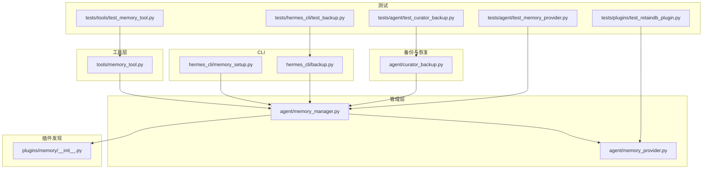
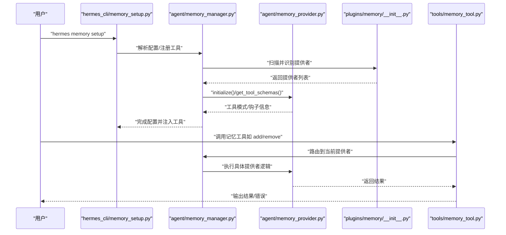
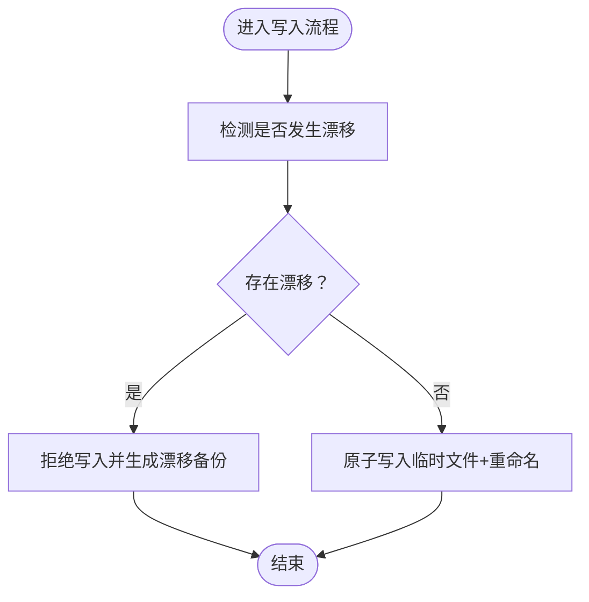
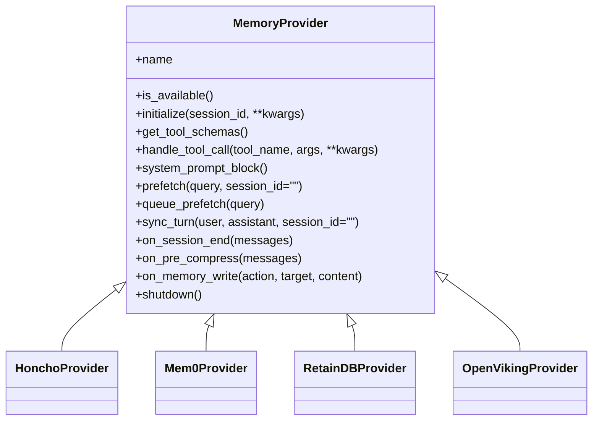
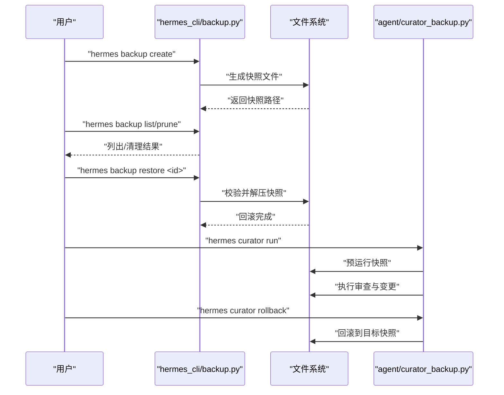
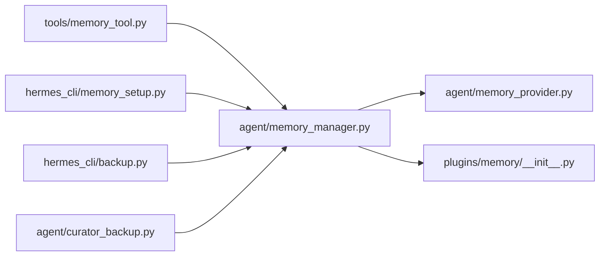

# 记忆管理工具

<cite>
**本文引用的文件**
- [memory_tool.py](file://tools/memory_tool.py)
- [memory_manager.py](file://agent/memory_manager.py)
- [memory_provider.py](file://agent/memory_provider.py)
- [__init__.py](file://plugins/memory/__init__.py)
- [memory-setup.py](file://hermes_cli/memory_setup.py)
- [backup.py](file://hermes_cli/backup.py)
- [curator_backup.py](file://agent/curator_backup.py)
- [test_memory_tool.py](file://tests/tools/test_memory_tool.py)
- [test_backup.py](file://tests/hermes_cli/test_backup.py)
- [test_curator_backup.py](file://tests/agent/test_curator_backup.py)
- [test_memory_provider.py](file://tests/agent/test_memory_provider.py)
- [test_retaindb_plugin.py](file://tests/plugins/test_retaindb_plugin.py)
- [memory-provider-plugin.md](file://website/docs/developer-guide/memory-provider-plugin.md)
- [memory-providers.md](file://website/docs/user-guide/features/memory-providers.md)
- [autonomous-ai-agents-honcho.md](file://website/docs/user-guide/skills/optional/autonomous-ai-agents/autonomous-ai-agents-honcho.md)
- [curator.md](file://website/docs/user-guide/features/curator.md)
</cite>

## 目录
1. [引言](#引言)
2. [项目结构](#项目结构)
3. [核心组件](#核心组件)
4. [架构总览](#架构总览)
5. [详细组件分析](#详细组件分析)
6. [依赖关系分析](#依赖关系分析)
7. [性能考量](#性能考量)
8. [故障排查指南](#故障排查指南)
9. [结论](#结论)
10. [附录](#附录)

## 引言
本文件系统化梳理记忆管理工具在本仓库中的实现与使用方式，覆盖以下主题：
- 记忆清理：内置工具与插件级写入钩子如何协同工作，避免数据漂移与冲突
- 备份与恢复：快照、预迁移备份、回滚策略与自动清理
- 迁移与转换：跨提供者迁移、版本升级前的安全网
- 统计与分析：使用统计、卡片复习与技能生命周期维护
- 参数配置与操作流程：CLI 配置、会话策略、令牌预算与身份设定
- 安全措施：原子写入、路径安全校验、漂移检测与拒绝机制
- 提供者差异与最佳实践：不同记忆提供者的接口契约、能力矩阵与运维建议

## 项目结构
围绕“记忆管理”的关键模块分布如下：
- 工具层：tools/memory_tool.py 提供统一的外部记忆调用入口
- 管理层：agent/memory_manager.py 负责提供者选择、生命周期与工具注入
- 插件发现：plugins/memory/__init__.py 扫描并识别记忆提供者插件
- CLI 配置：hermes_cli/memory_setup.py 提供交互式配置与工具注册
- 备份与恢复：hermes_cli/backup.py 快照与恢复；agent/curator_backup.py 技能树备份
- 测试与验证：tests 下多套测试覆盖备份、迁移、提供者行为与漂移保护

**图表来源**
- [memory_tool.py](file://tools/memory_tool.py)
- [memory_manager.py](file://agent/memory_manager.py)
- [memory_provider.py](file://agent/memory_provider.py)
- [__init__.py](file://plugins/memory/__init__.py)
- [memory-setup.py](file://hermes_cli/memory_setup.py)
- [backup.py](file://hermes_cli/backup.py)
- [curator_backup.py](file://agent/curator_backup.py)
- [test_memory_tool.py](file://tests/tools/test_memory_tool.py)
- [test_backup.py](file://tests/hermes_cli/test_backup.py)
- [test_curator_backup.py](file://tests/agent/test_curator_backup.py)
- [test_memory_provider.py](file://tests/agent/test_memory_provider.py)
- [test_retaindb_plugin.py](file://tests/plugins/test_retaindb_plugin.py)

**章节来源**
- [memory_tool.py](file://tools/memory_tool.py)
- [memory_manager.py](file://agent/memory_manager.py)
- [memory_provider.py](file://agent/memory_provider.py)
- [__init__.py](file://plugins/memory/__init__.py)
- [memory-setup.py](file://hermes_cli/memory_setup.py)
- [backup.py](file://hermes_cli/backup.py)
- [curator_backup.py](file://agent/curator_backup.py)
- [test_memory_tool.py](file://tests/tools/test_memory_tool.py)
- [test_backup.py](file://tests/hermes_cli/test_backup.py)
- [test_curator_backup.py](file://tests/agent/test_curator_backup.py)
- [test_memory_provider.py](file://tests/agent/test_memory_provider.py)
- [test_retaindb_plugin.py](file://tests/plugins/test_retaindb_plugin.py)

## 核心组件
- 记忆工具（tools/memory_tool.py）
  - 作为外部记忆的统一入口，封装 add/remove/read 等操作，并与管理器协作
  - 支持对“漂移”状态的检测与拒绝，避免并发写入导致的数据不一致
- 记忆管理器（agent/memory_manager.py）
  - 负责加载当前激活的记忆提供者、注入工具、执行生命周期钩子
  - 协调 CLI 配置与提供者初始化
- 记忆提供者基类（agent/memory_provider.py）
  - 定义提供者接口契约：名称、可用性、初始化、工具模式、可选钩子等
- 提供者插件发现（plugins/memory/__init__.py）
  - 自动扫描插件目录，识别符合规范的提供者包
- CLI 配置（hermes_cli/memory_setup.py）
  - 提供交互式配置向导，生成/更新提供者配置与工具注册
- 备份与恢复（hermes_cli/backup.py、agent/curator_backup.py）
  - 快速快照、预迁移备份、回滚与自动清理
  - 技能树备份与回滚，确保变更可逆

**章节来源**
- [memory_tool.py](file://tools/memory_tool.py)
- [memory_manager.py](file://agent/memory_manager.py)
- [memory_provider.py](file://agent/memory_provider.py)
- [__init__.py](file://plugins/memory/__init__.py)
- [memory-setup.py](file://hermes_cli/memory_setup.py)
- [backup.py](file://hermes_cli/backup.py)
- [curator_backup.py](file://agent/curator_backup.py)

## 架构总览
下图展示记忆管理从 CLI 到提供者再到工具层的整体调用链路。

**图表来源**
- [memory-setup.py](file://hermes_cli/memory_setup.py)
- [memory_manager.py](file://agent/memory_manager.py)
- [memory_provider.py](file://agent/memory_provider.py)
- [__init__.py](file://plugins/memory/__init__.py)
- [memory_tool.py](file://tools/memory_tool.py)

## 详细组件分析

### 记忆工具层（tools/memory_tool.py）
- 功能特性
  - 将外部记忆操作标准化，屏蔽提供者差异
  - 在写入时进行漂移检测：若底层存储被外部修改，则拒绝写入并生成备份
  - 保证原子性：写入采用临时文件+重命名的方式，降低损坏风险
- 使用场景
  - 通用记忆增删改查
  - 与管理器配合，在会话中动态启用/禁用提供者
- 安全措施
  - 漂移检测与拒绝，防止并发写入破坏一致性
  - 原子写入，避免部分写入导致的损坏

**图表来源**
- [test_memory_tool.py](file://tests/tools/test_memory_tool.py)
- [memory_tool.py](file://tools/memory_tool.py)

**章节来源**
- [memory_tool.py](file://tools/memory_tool.py)
- [test_memory_tool.py](file://tests/tools/test_memory_tool.py)

### 记忆管理器（agent/memory_manager.py）
- 功能特性
  - 加载当前激活的记忆提供者，注入工具，执行生命周期钩子
  - 协调 CLI 配置与提供者初始化
- 关键流程
  - 初始化：读取配置，定位提供者，调用 initialize
  - 工具注入：根据提供者工具模式注册工具
  - 钩子：在会话结束、压缩前、内存写入等时机触发回调
- 与提供者的关系
  - 通过基类接口与具体提供者解耦
  - 适配不同提供者的配置与能力

**章节来源**
- [memory_manager.py](file://agent/memory_manager.py)
- [memory_provider.py](file://agent/memory_provider.py)

### 记忆提供者基类与插件发现（agent/memory_provider.py、plugins/memory/__init__.py）
- 基类契约（参考开发者文档）
  - 必需方法：name、is_available、initialize、get_tool_schemas、handle_tool_call
  - 可选钩子：system_prompt_block、prefetch、queue_prefetch、sync_turn、on_session_end、on_pre_compress、on_memory_write、shutdown
- 插件发现
  - 自动扫描 plugins/memory/<name>/ 目录，识别符合规范的提供者包
  - 支持内置与用户安装的提供者，内置优先于用户安装（同名时）

**图表来源**
- [memory-provider-plugin.md](file://website/docs/developer-guide/memory-provider-plugin.md)
- [__init__.py](file://plugins/memory/__init__.py)

**章节来源**
- [memory-provider-plugin.md](file://website/docs/developer-guide/memory-provider-plugin.md)
- [__init__.py](file://plugins/memory/__init__.py)

### CLI 配置与工具注册（hermes_cli/memory_setup.py）
- 功能特性
  - 交互式配置向导，支持选择提供者、填写密钥与参数
  - 注册提供者工具，使 agent 能够调用记忆工具
- 典型流程
  - hermes memory setup → 选择提供者 → 填写配置 → 写入本地配置 → 注册工具
- 与管理器协作
  - 初始化阶段由管理器加载配置并注入工具

**章节来源**
- [memory-setup.py](file://hermes_cli/memory_setup.py)
- [memory_manager.py](file://agent/memory_manager.py)

### 备份与恢复（hermes_cli/backup.py、agent/curator_backup.py）
- 快速快照与自动清理
  - 支持创建、列出、修剪快照，按默认策略自动保留最近若干份
  - 预迁移备份：在执行迁移前自动创建 zip 包，避免升级过程中的数据丢失
- 回滚策略
  - 基于 tar.gz 的原子回滚，支持列出历史快照、按 ID 回滚
  - 防御性校验：拒绝包含绝对路径或危险路径组件的归档
- 技能树备份（Curator）
  - 在执行自动审查前对技能树进行快照，便于误操作后的回滚
  - 与 cron 任务状态协同：回滚时保留用户后续新增的任务，避免误复活

**图表来源**
- [backup.py](file://hermes_cli/backup.py)
- [curator_backup.py](file://agent/curator_backup.py)
- [test_backup.py](file://tests/hermes_cli/test_backup.py)
- [test_curator_backup.py](file://tests/agent/test_curator_backup.py)

**章节来源**
- [backup.py](file://hermes_cli/backup.py)
- [curator_backup.py](file://agent/curator_backup.py)
- [test_backup.py](file://tests/hermes_cli/test_backup.py)
- [test_curator_backup.py](file://tests/agent/test_curator_backup.py)

### 提供者差异与最佳实践
- 能力矩阵（节选）
  - Honcho：云存储、付费、具备对话式建模与会话上下文
  - Mem0：云存储、付费、服务端抽取
  - RetainDB：云存储、$20/月、差分压缩
  - OpenViking：自托管、免费、文件层级与分层加载
  - Hindsight：云/本地、免费/付费、知识图谱与反思合成
  - Holographic：本地、免费、HRR 代数与信任评分
  - Supermemory：云存储、付费、上下文围栏与会话图谱
  - Memori：云存储、免费/付费、工具感知记忆与结构化召回
- 最佳实践
  - 选择提供者时综合考虑成本、部署方式、数据主权与功能需求
  - 使用预迁移备份与快照作为升级/迁移的安全网
  - 在高并发场景下依赖工具层的漂移检测与拒绝机制

**章节来源**
- [memory-providers.md](file://website/docs/user-guide/features/memory-providers.md)

### 实际使用示例与维护策略
- 示例：Honcho 提供者
  - 启用/禁用、策略设置、回忆模式、令牌预算、身份管理、目录映射、迁移指导
- 示例：Memento Flashcards 技能
  - 添加/导出/导入/统计/删除卡片，使用脚本原子写入，避免直接编辑 JSON 文件
- 示例：Curator 技能生命周期
  - 定期审查、归档、备份、回滚，保留 tar.gz 备份以防数据丢失

**章节来源**
- [autonomous-ai-agents-honcho.md](file://website/docs/user-guide/skills/optional/autonomous-ai-agents/autonomous-ai-agents-honcho.md)
- [curator.md](file://website/docs/user-guide/features/curator.md)

## 依赖关系分析
- 组件耦合
  - tools/memory_tool.py 依赖 agent/memory_manager.py 的路由与钩子
  - agent/memory_manager.py 依赖 agent/memory_provider.py 的接口契约
  - plugins/memory/__init__.py 为管理器提供提供者发现能力
  - hermes_cli/memory_setup.py 与管理器协作完成配置与工具注入
  - hermes_cli/backup.py 与 agent/curator_backup.py 提供备份与回滚能力
- 外部依赖
  - 提供者插件依赖各自 SDK 或 CLI（如 RetainDB、Mem0、Honcho 等）
  - 备份依赖标准归档与文件系统权限

**图表来源**
- [memory_tool.py](file://tools/memory_tool.py)
- [memory_manager.py](file://agent/memory_manager.py)
- [memory_provider.py](file://agent/memory_provider.py)
- [__init__.py](file://plugins/memory/__init__.py)
- [memory-setup.py](file://hermes_cli/memory_setup.py)
- [backup.py](file://hermes_cli/backup.py)
- [curator_backup.py](file://agent/curator_backup.py)

**章节来源**
- [memory_tool.py](file://tools/memory_tool.py)
- [memory_manager.py](file://agent/memory_manager.py)
- [memory_provider.py](file://agent/memory_provider.py)
- [__init__.py](file://plugins/memory/__init__.py)
- [memory-setup.py](file://hermes_cli/memory_setup.py)
- [backup.py](file://hermes_cli/backup.py)
- [curator_backup.py](file://agent/curator_backup.py)

## 性能考量
- 写入路径
  - 原子写入减少磁盘碎片与部分写入风险，提升可靠性
- 漂移检测
  - 在高并发写入场景下显著降低数据竞争带来的不一致
- 备份策略
  - 快照与回滚支持快速恢复，减少停机时间
- 提供者选择
  - 云提供者通常具备更好的扩展性与 SLA，自托管提供者适合对数据主权有强约束的场景

## 故障排查指南
- 写入被拒绝
  - 现象：写入返回失败且生成漂移备份
  - 排查：确认是否有外部进程修改了底层存储；必要时查看漂移备份内容
- 回滚失败
  - 现象：回滚提示不安全或拒绝提取
  - 排查：检查归档是否包含绝对路径或危险路径组件；重新生成快照
- 预迁移备份未创建
  - 现象：迁移后数据丢失
  - 排查：确认迁移前是否执行了预迁移备份；检查备份目录权限
- 提供者不可用
  - 现象：提供者无法初始化或工具未注册
  - 排查：检查网络连通性、密钥与配置项；查看提供者日志

**章节来源**
- [test_memory_tool.py](file://tests/tools/test_memory_tool.py)
- [test_backup.py](file://tests/hermes_cli/test_backup.py)
- [test_curator_backup.py](file://tests/agent/test_curator_backup.py)
- [test_memory_provider.py](file://tests/agent/test_memory_provider.py)

## 结论
本仓库的记忆管理工具通过“工具层—管理层—提供者层”的清晰分层，结合 CLI 配置、快照与回滚、漂移检测与拒绝机制，提供了可靠的记忆清理、备份恢复、迁移转换与统计分析能力。不同提供者在功能与部署方式上各有侧重，建议依据业务需求选择合适的提供者，并遵循本文提供的最佳实践与排障建议，确保数据完整性与系统稳定性。

## 附录
- CLI 常用命令（节选）
  - 记忆提供者：hermes memory setup、hermes memory status、hermes memory off
  - 备份与回滚：hermes backup、hermes curator（含 backup、rollback、run 等）
  - Honcho 特定：hermes honcho enable/disable/status/strategy/peer/mode/tokens/identity/sync/sessions/map/migrate
- 数据完整性检查
  - 原子写入与漂移检测
  - 快照与回滚验证
  - 归档安全性校验（拒绝危险路径）
- 性能监控与故障恢复
  - 通过快照与回滚快速恢复
  - 提供者工具模式与钩子用于观测与诊断