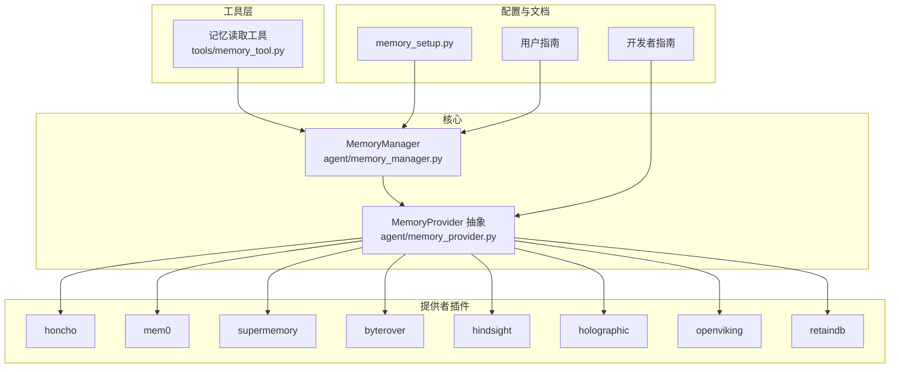
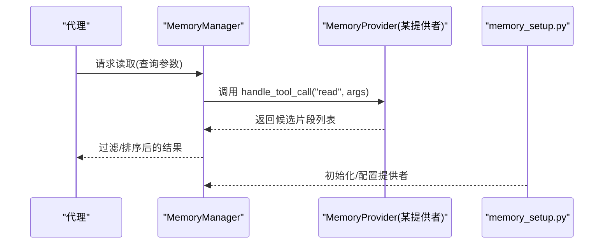
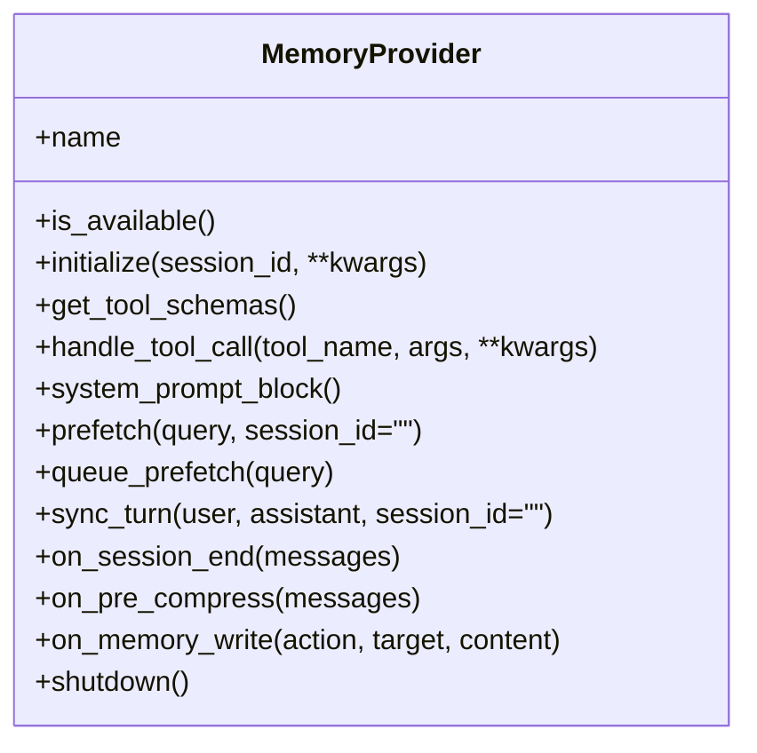
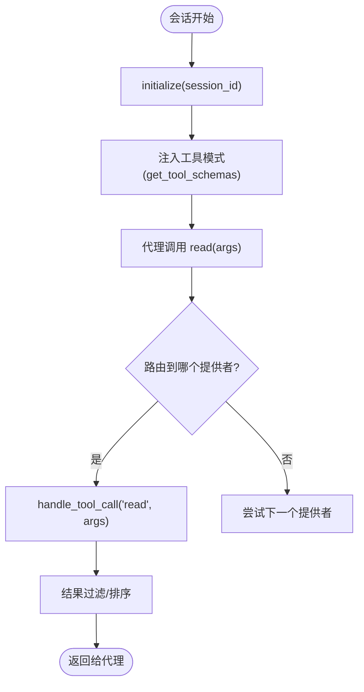
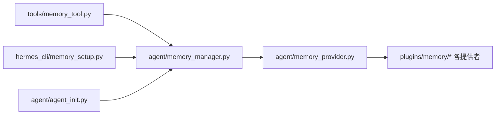

# 记忆读取工具

<cite>
**本文引用的文件**
- [agent/memory_manager.py](file://agent/memory_manager.py)
- [agent/memory_provider.py](file://agent/memory_provider.py)
- [tools/memory_tool.py](file://tools/memory_tool.py)
- [plugins/memory/__init__.py](file://plugins/memory/__init__.py)
- [plugins/memory/honcho/__init__.py](file://plugins/memory/honcho/__init__.py)
- [plugins/memory/mem0/__init__.py](file://plugins/memory/mem0/__init__.py)
- [plugins/memory/supermemory/__init__.py](file://plugins/memory/supermemory/__init__.py)
- [plugins/memory/byterover/__init__.py](file://plugins/memory/byterover/__init__.py)
- [plugins/memory/hindsight/__init__.py](file://plugins/memory/hindsight/__init__.py)
- [plugins/memory/holographic/__init__.py](file://plugins/memory/holographic/__init__.py)
- [plugins/memory/openviking/__init__.py](file://plugins/memory/openviking/__init__.py)
- [plugins/memory/retaindb/__init__.py](file://plugins/memory/retaindb/__init__.py)
- [hermes_cli/memory_setup.py](file://hermes_cli/memory_setup.py)
- [website/docs/developer-guide/memory-provider-plugin.md](file://website/docs/developer-guide/memory-provider-plugin.md)
- [website/i18n/zh-Hans/docusaurus-plugin-content-docs/current/user-guide/features/memory-providers.md](file://website/i18n/zh-Hans/docusaurus-plugin-content-docs/current/user-guide/features/memory-providers.md)
- [agent/agent_init.py](file://agent/agent_init.py)
- [agent/agent_runtime_helpers.py](file://agent/agent_runtime_helpers.py)
- [tests/agent/test_memory_provider.py](file://tests/agent/test_memory_provider.py)
</cite>

## 目录
1. [简介](#简介)
2. [项目结构](#项目结构)
3. [核心组件](#核心组件)
4. [架构总览](#架构总览)
5. [详细组件分析](#详细组件分析)
6. [依赖关系分析](#依赖关系分析)
7. [性能考量](#性能考量)
8. [故障排查指南](#故障排查指南)
9. [结论](#结论)
10. [附录](#附录)

## 简介
本文件系统性梳理“记忆读取工具”的设计与实现，覆盖以下主题：
- 功能特性与使用场景：全文检索、结构化查询、上下文匹配
- 参数配置、查询语法与结果过滤机制
- 不同记忆提供者的读取接口差异与性能特点
- 实际使用示例与查询优化技巧
- 错误处理策略与异常情况应对

记忆读取工具围绕统一的 MemoryProvider 抽象展开，通过插件化提供者实现多样化的读取能力；同时，CLI 与运行时初始化流程负责提供者选择、工具注入与生命周期管理。

## 项目结构
与记忆读取相关的关键模块分布如下：
- 核心抽象与管理
  - agent/memory_provider.py：定义 MemoryProvider 抽象接口与生命周期钩子
  - agent/memory_manager.py：聚合多个提供者、协调工具注入与会话级回调
- 工具层
  - tools/memory_tool.py：面向代理的工具入口，封装读取调用与结果过滤
- 提供者插件
  - plugins/memory/*：内置提供者集合（honcho、mem0、supermemory、byterover、hindsight、holographic、openviking、retaindb）
- CLI 与文档
  - hermes_cli/memory_setup.py：提供者配置与设置流程
  - website/docs/developer-guide/memory-provider-plugin.md：开发者插件开发指南
  - website/i18n/zh-Hans/.../memory-providers.md：用户侧提供者对比与配置要点

图表来源
- [agent/memory_provider.py](file://agent/memory_provider.py)
- [agent/memory_manager.py](file://agent/memory_manager.py)
- [tools/memory_tool.py](file://tools/memory_tool.py)
- [plugins/memory/__init__.py](file://plugins/memory/__init__.py)
- [hermes_cli/memory_setup.py](file://hermes_cli/memory_setup.py)
- [website/docs/developer-guide/memory-provider-plugin.md](file://website/docs/developer-guide/memory-provider-plugin.md)
- [website/i18n/zh-Hans/docusaurus-plugin-content-docs/current/user-guide/features/memory-providers.md](file://website/i18n/zh-Hans/docusaurus-plugin-content-docs/current/user-guide/features/memory-providers.md)

章节来源
- [agent/memory_provider.py](file://agent/memory_provider.py)
- [agent/memory_manager.py](file://agent/memory_manager.py)
- [tools/memory_tool.py](file://tools/memory_tool.py)
- [plugins/memory/__init__.py](file://plugins/memory/__init__.py)
- [hermes_cli/memory_setup.py](file://hermes_cli/memory_setup.py)
- [website/docs/developer-guide/memory-provider-plugin.md](file://website/docs/developer-guide/memory-provider-plugin.md)
- [website/i18n/zh-Hans/docusaurus-plugin-content-docs/current/user-guide/features/memory-providers.md](file://website/i18n/zh-Hans/docusaurus-plugin-content-docs/current/user-guide/features/memory-providers.md)

## 核心组件
- MemoryProvider 抽象与生命周期
  - 必需方法：name、is_available、initialize、get_tool_schemas、handle_tool_call
  - 可选钩子：system_prompt_block、prefetch、queue_prefetch、sync_turn、on_session_end、on_pre_compress、on_memory_write、shutdown
- MemoryManager
  - 聚合提供者实例，注入工具模式，转发会话结束与压缩前事件
- 记忆读取工具（tools/memory_tool.py）
  - 将外部提供者的读取能力包装为代理可用的工具，支持参数校验、结果过滤与错误传播
- CLI 设置（hermes_cli/memory_setup.py）
  - 提供者配置收集、保存与验证，支持环境变量与本地配置

章节来源
- [agent/memory_provider.py](file://agent/memory_provider.py)
- [agent/memory_manager.py](file://agent/memory_manager.py)
- [tools/memory_tool.py](file://tools/memory_tool.py)
- [hermes_cli/memory_setup.py](file://hermes_cli/memory_setup.py)
- [website/docs/developer-guide/memory-provider-plugin.md](file://website/docs/developer-guide/memory-provider-plugin.md)

## 架构总览
记忆读取工具的调用链路从代理到 MemoryManager，再路由至具体 MemoryProvider，最终由提供者执行读取逻辑。CLI 负责提供者配置与持久化。

图表来源
- [agent/memory_manager.py](file://agent/memory_manager.py)
- [agent/memory_provider.py](file://agent/memory_provider.py)
- [tools/memory_tool.py](file://tools/memory_tool.py)
- [hermes_cli/memory_setup.py](file://hermes_cli/memory_setup.py)

## 详细组件分析

### MemoryProvider 抽象与生命周期
- 必需接口
  - name：提供者标识
  - is_available：启动前可用性检查（禁止网络调用）
  - initialize：会话级初始化
  - get_tool_schemas：返回工具模式（含 read 等）
  - handle_tool_call：执行具体工具调用
- 可选钩子
  - prefetch/queue_prefetch：预取与队列预热
  - sync_turn/on_session_end：回合同步与会话结束持久化
  - on_pre_compress/on_memory_write：压缩前保存与镜像写入
  - system_prompt_block：系统提示块注入
  - shutdown：进程退出清理

图表来源
- [agent/memory_provider.py](file://agent/memory_provider.py)
- [website/docs/developer-guide/memory-provider-plugin.md](file://website/docs/developer-guide/memory-provider-plugin.md)

章节来源
- [agent/memory_provider.py](file://agent/memory_provider.py)
- [website/docs/developer-guide/memory-provider-plugin.md](file://website/docs/developer-guide/memory-provider-plugin.md)

### MemoryManager：聚合与桥接
- 聚合多个 MemoryProvider 实例
- 注入工具模式（get_tool_schemas），使代理可调用 read 等工具
- 会话结束与压缩前事件桥接：通知外部提供者进行持久化或镜像

图表来源
- [agent/memory_manager.py](file://agent/memory_manager.py)
- [agent/agent_runtime_helpers.py](file://agent/agent_runtime_helpers.py)

章节来源
- [agent/memory_manager.py](file://agent/memory_manager.py)
- [agent/agent_runtime_helpers.py](file://agent/agent_runtime_helpers.py)

### 记忆读取工具（tools/memory_tool.py）
- 输入参数
  - 查询文本/条件（如关键词、时间范围、标签等，依据具体提供者）
  - 结果数量上限、过滤器（如来源、类型、置信度阈值）
- 处理流程
  - 参数校验与默认值填充
  - 调用 MemoryManager 执行读取
  - 结果过滤与去重
  - 输出标准化（片段、元数据、关联度）
- 错误传播
  - 将底层异常包装为可读信息，避免泄露内部细节

章节来源
- [tools/memory_tool.py](file://tools/memory_tool.py)

### 提供者对比与差异
- Honcho：云端，付费；具备辩证用户建模与会话范围上下文
- Mem0：云端，付费；服务端 LLM 提取
- Supermemory：云端，付费；上下文隔离、会话图谱导入、多容器
- ByteRover：本地/云端，免费/付费；预压缩提取
- Hindsight：云端/本地，免费/付费；知识图谱 + reflect 合成
- Holographic：本地，免费；HRR 代数 + 信任评分
- OpenViking：自托管，免费；文件系统层级 + 分层加载
- RetainDB：云端，付费；增量压缩

章节来源
- [website/i18n/zh-Hans/docusaurus-plugin-content-docs/current/user-guide/features/memory-providers.md](file://website/i18n/zh-Hans/docusaurus-plugin-content-docs/current/user-guide/features/memory-providers.md)

### CLI 配置与初始化
- hermes memory setup：收集提供者配置字段，保存非敏感配置，支持环境变量覆盖
- agent/agent_init.py：根据配置加载提供者，注入工具模式，桥接会话结束回调

章节来源
- [hermes_cli/memory_setup.py](file://hermes_cli/memory_setup.py)
- [agent/agent_init.py](file://agent/agent_init.py)

## 依赖关系分析
- 组件耦合
  - MemoryManager 对 MemoryProvider 抽象强依赖，提供者实现解耦
  - tools/memory_tool.py 仅依赖 MemoryManager 接口，便于扩展新提供者
- 外部依赖
  - 各提供者依赖其自有 SDK/客户端（如第三方 API 或本地存储）
- 生命周期
  - 初始化 → 工具注入 → 读取调用 → 会话结束/压缩前回调 → 关闭

图表来源
- [tools/memory_tool.py](file://tools/memory_tool.py)
- [agent/memory_manager.py](file://agent/memory_manager.py)
- [agent/memory_provider.py](file://agent/memory_provider.py)
- [plugins/memory/__init__.py](file://plugins/memory/__init__.py)
- [hermes_cli/memory_setup.py](file://hermes_cli/memory_setup.py)
- [agent/agent_init.py](file://agent/agent_init.py)

章节来源
- [tools/memory_tool.py](file://tools/memory_tool.py)
- [agent/memory_manager.py](file://agent/memory_manager.py)
- [agent/memory_provider.py](file://agent/memory_provider.py)
- [plugins/memory/__init__.py](file://plugins/memory/__init__.py)
- [hermes_cli/memory_setup.py](file://hermes_cli/memory_setup.py)
- [agent/agent_init.py](file://agent/agent_init.py)

## 性能考量
- 预取与预热
  - prefetch/queue_prefetch：在回合开始前或结束后预取，降低延迟
- 结果过滤
  - 在工具层进行去重、排序与阈值过滤，减少下游负担
- 会话范围控制
  - 会话级上下文限制可显著降低无关片段数量
- 存储与索引
  - 本地提供者（如 Holographic、ByteRover）通常具备更低延迟；云端提供者（如 Honcho、Mem0、Supermemory）在规模与合成能力上更优
- 增量与压缩
  - RetainDB 的增量压缩与 OpenViking 的分层加载有助于长期会话的稳定性

章节来源
- [website/i18n/zh-Hans/docusaurus-plugin-content-docs/current/user-guide/features/memory-providers.md](file://website/i18n/zh-Hans/docusaurus-plugin-content-docs/current/user-guide/features/memory-providers.md)

## 故障排查指南
- 提供者不可用
  - 使用 is_available 进行启动前检查；避免在网络调用中阻塞
- 读取失败
  - 检查 handle_tool_call 的异常是否被正确捕获与包装
  - 确认 CLI 配置是否正确（密钥、URL、超时等）
- 会话结束未持久化
  - 确认 on_session_end 是否被调用；必要时在 shutdown 中补充清理
- 结果过多/过少
  - 调整工具层过滤参数（数量上限、置信度阈值）
  - 切换提供者或启用预取以改善召回

章节来源
- [agent/memory_provider.py](file://agent/memory_provider.py)
- [agent/memory_manager.py](file://agent/memory_manager.py)
- [hermes_cli/memory_setup.py](file://hermes_cli/memory_setup.py)
- [agent/agent_runtime_helpers.py](file://agent/agent_runtime_helpers.py)

## 结论
记忆读取工具通过统一的 MemoryProvider 抽象与插件化架构，实现了对多种后端的统一接入。结合 CLI 配置、工具层过滤与提供者钩子，可在不同场景下平衡召回质量、性能与成本。建议优先根据任务特征选择合适提供者，并配合预取与过滤策略提升效果。

## 附录

### 使用示例与查询优化技巧
- 示例场景
  - 全文检索：传入自然语言查询，结合时间范围与来源过滤
  - 结构化查询：利用标签、类型、作者等字段精确筛选
  - 上下文匹配：开启会话范围与预取，确保最近对话相关片段优先
- 优化建议
  - 明确过滤条件，减少无关片段
  - 合理设置结果上限，避免上下文膨胀
  - 在长会话中启用增量压缩与分层加载
  - 根据 SLA 选择本地或云端提供者

章节来源
- [tools/memory_tool.py](file://tools/memory_tool.py)
- [website/i18n/zh-Hans/docusaurus-plugin-content-docs/current/user-guide/features/memory-providers.md](file://website/i18n/zh-Hans/docusaurus-plugin-content-docs/current/user-guide/features/memory-providers.md)

### 开发者参考：实现自定义提供者
- 必须实现的方法与可选钩子参见开发者指南
- 提供者发现与加载由 plugins/memory/__init__.py 与 agent/agent_init.py 协作完成

章节来源
- [website/docs/developer-guide/memory-provider-plugin.md](file://website/docs/developer-guide/memory-provider-plugin.md)
- [plugins/memory/__init__.py](file://plugins/memory/__init__.py)
- [agent/agent_init.py](file://agent/agent_init.py)