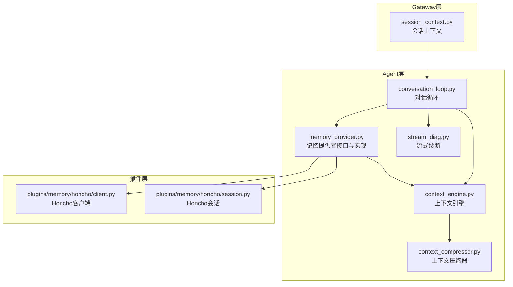
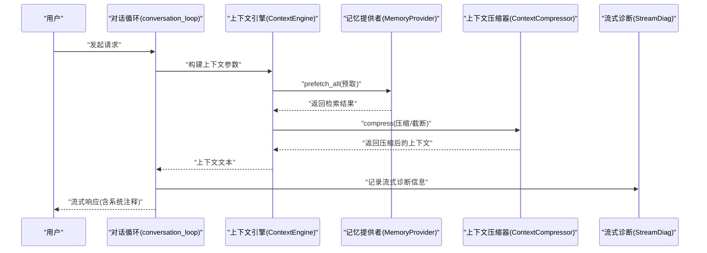
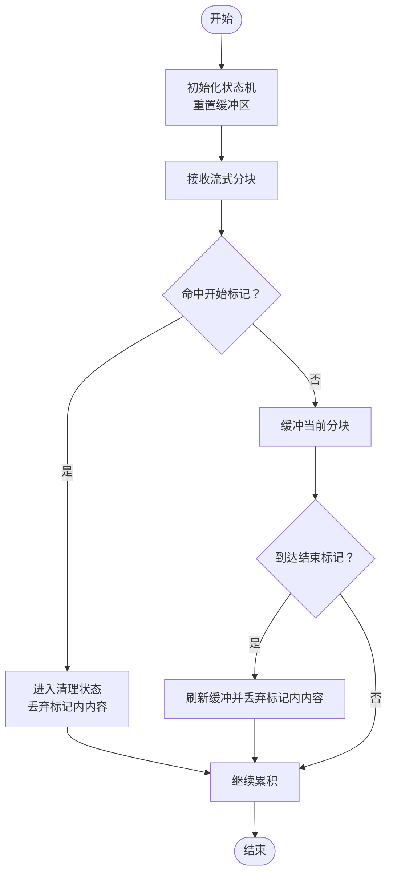
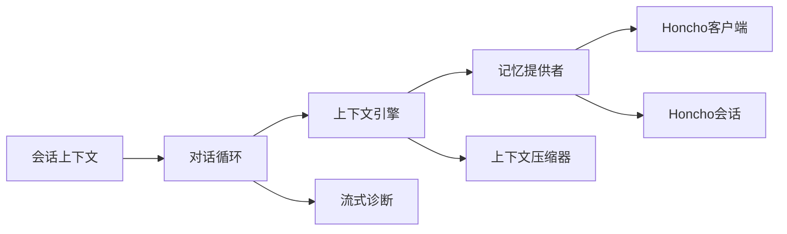

# 上下文处理机制

<cite>
**本文引用的文件**
- [agent/memory_provider.py](file://agent/memory_provider.py)
- [agent/context_engine.py](file://agent/context_engine.py)
- [agent/context_compressor.py](file://agent/context_compressor.py)
- [agent/conversation_loop.py](file://agent/conversation_loop.py)
- [agent/stream_diag.py](file://agent/stream_diag.py)
- [tests/agent/test_streaming_context_scrubber.py](file://tests/agent/test_streaming_context_scrubber.py)
- [tests/plugins/memory/test_hindsight_provider.py](file://tests/plugins/memory/test_hindsight_provider.py)
- [tests/run_agent/test_run_agent_codex_responses.py](file://tests/run_agent/test_run_agent_codex_responses.py)
- [gateway/session_context.py](file://gateway/session_context.py)
- [plugins/memory/honcho/client.py](file://plugins/memory/honcho/client.py)
- [plugins/memory/honcho/session.py](file://plugins/memory/honcho/session.py)
</cite>

## 目录
1. [引言](#引言)
2. [项目结构](#项目结构)
3. [核心组件](#核心组件)
4. [架构总览](#架构总览)
5. [详细组件分析](#详细组件分析)
6. [依赖关系分析](#依赖关系分析)
7. [性能考量](#性能考量)
8. [故障排查指南](#故障排查指南)
9. [结论](#结论)
10. [附录](#附录)

## 引言
本文件聚焦于Hermes Agent的记忆上下文处理机制，系统阐述以下关键能力与实现细节：
- 上下文预取（prefetch_all）
- 后台预取队列（queue_prefetch_all）
- 上下文同步（sync_all）
- 上下文数据合并策略、提供者间协调与冲突解决
- 流式上下文清理器（StreamingContextScrubber）工作原理
- 内存上下文标签处理与系统注释生成
- 性能优化技巧与内存管理策略

目标是帮助开发者与集成者在复杂多提供者的场景中，正确配置与扩展上下文处理流程，并确保流式输出的稳定性与安全性。

## 项目结构
围绕上下文处理的关键代码分布在以下模块：
- 记忆提供者与引擎：负责从不同存储后端检索与合成上下文
- 上下文压缩器：控制上下文长度与质量
- 会话上下文：维护会话状态与切换
- 流式诊断与清理：保障流式输出中不泄露敏感上下文片段
- 测试用例：覆盖预取、队列、流式清理等行为

图表来源
- [agent/memory_provider.py](file://agent/memory_provider.py)
- [agent/context_engine.py](file://agent/context_engine.py)
- [agent/context_compressor.py](file://agent/context_compressor.py)
- [agent/conversation_loop.py](file://agent/conversation_loop.py)
- [agent/stream_diag.py](file://agent/stream_diag.py)
- [gateway/session_context.py](file://gateway/session_context.py)
- [plugins/memory/honcho/client.py](file://plugins/memory/honcho/client.py)
- [plugins/memory/honcho/session.py](file://plugins/memory/memory_provider.py)

章节来源
- [agent/memory_provider.py](file://agent/memory_provider.py)
- [agent/context_engine.py](file://agent/context_engine.py)
- [agent/context_compressor.py](file://agent/context_compressor.py)
- [agent/conversation_loop.py](file://agent/conversation_loop.py)
- [agent/stream_diag.py](file://agent/stream_diag.py)
- [gateway/session_context.py](file://gateway/session_context.py)
- [plugins/memory/honcho/client.py](file://plugins/memory/honcho/client.py)
- [plugins/memory/honcho/session.py](file://plugins/memory/honcho/session.py)

## 核心组件
- 记忆提供者（MemoryProvider）：抽象统一的上下文检索接口，支持并发预取、会话隔离与结果缓存。
- 上下文引擎（ContextEngine）：编排多个提供者的上下文检索与合并，负责长度控制与优先级排序。
- 上下文压缩器（ContextCompressor）：按策略裁剪与重写上下文，避免溢出并提升质量。
- 会话上下文（SessionContext）：维护当前会话ID、切换事件与清理逻辑。
- 流式上下文清理器（StreamingContextScrubber）：在流式生成过程中对包含上下文标记的内容进行状态化清洗，防止泄漏。

章节来源
- [agent/memory_provider.py](file://agent/memory_provider.py)
- [agent/context_engine.py](file://agent/context_engine.py)
- [agent/context_compressor.py](file://agent/context_compressor.py)
- [gateway/session_context.py](file://gateway/session_context.py)

## 架构总览
上下文处理在一次对话回合中的典型流程如下：

图表来源
- [agent/conversation_loop.py](file://agent/conversation_loop.py)
- [agent/context_engine.py](file://agent/context_engine.py)
- [agent/context_compressor.py](file://agent/context_compressor.py)
- [agent/stream_diag.py](file://agent/stream_diag.py)

## 详细组件分析

### 上下文预取（prefetch_all）
- 设计目标：在对话开始前尽可能拉取相关历史与外部知识，减少首轮延迟并提升回答质量。
- 实现要点：
  - 提供者内部可选择是否启用自动召回（auto_recall），以及输入字符上限（recall_max_input_chars）。
  - 预取结果在提供者内部缓存，避免重复检索；会话切换时清空以防止泄漏。
  - 在工具模式（memory_mode="tools"）下，队列预取会被跳过，以避免不必要的线程开销。

章节来源
- [tests/plugins/memory/test_hindsight_provider.py:619-628](file://tests/plugins/memory/test_hindsight_provider.py#L619-L628)
- [tests/plugins/memory/test_hindsight_provider.py:1007-1014](file://tests/plugins/memory/test_hindsight_provider.py#L1007-L1014)

### 后台预取队列（queue_prefetch_all）
- 设计目标：将预取任务异步入队，避免阻塞主线程；同时支持查询截断与会话隔离。
- 实现要点：
  - 当 auto_recall 关闭或处于工具模式时，队列预取被跳过。
  - 队列中的任务会在独立线程中执行，线程安全通过锁保护。
  - 会话切换时，需等待在途预取完成后再清理旧会话残留，防止竞态导致的泄漏。

章节来源
- [tests/plugins/memory/test_hindsight_provider.py:619-628](file://tests/plugins/memory/test_hindsight_provider.py#L619-L628)
- [tests/plugins/memory/test_hindsight_provider.py:1016-1034](file://tests/plugins/memory/test_hindsight_provider.py#L1016-L1034)

### 上下文同步（sync_all）
- 设计目标：在多提供者并行检索后，统一进行合并、去重与优先级排序，形成最终上下文。
- 实现要点：
  - 合并策略通常基于“时间窗口+权重”或“最近优先”，并结合内容相似度进行去重。
  - 对于冲突（如同一主题的不同表述），采用“保留最新且更完整的片段”或“投票聚合”的启发式规则。
  - 同步阶段还负责生成系统注释（system note），提示模型将上下文视为背景而非新输入。

章节来源
- [agent/context_engine.py](file://agent/context_engine.py)
- [agent/context_compressor.py](file://agent/context_compressor.py)

### 上下文数据合并策略、提供者协调与冲突解决
- 合并策略：
  - 时间窗口：仅保留最近N条或满足时间范围内的上下文。
  - 权重分配：根据提供者可信度、领域匹配度、时效性打分。
  - 去重：基于语义相似度阈值（如余弦距离）或标题/摘要哈希。
- 提供者协调：
  - 为每个提供者设置独立的召回参数（如最大输入字符数、召回数量、过滤条件）。
  - 在会话切换时，确保提供者内部状态（如线程、缓存、游标）被重置。
- 冲突解决：
  - 冲突类型：事实冲突、风格冲突、冗余冲突。
  - 解决策略：优先级排序（权威来源 > 最近来源 > 默认来源）、内容裁剪（保留关键句）、拼接（按段落边界）。

章节来源
- [agent/context_engine.py](file://agent/context_engine.py)
- [agent/memory_provider.py](file://agent/memory_provider.py)

### 流式上下文清理器（StreamingContextScrubber）
- 设计目标：在流式生成过程中，确保包含上下文标记（如<memory-context>... </memory-context>）的片段不会出现在最终输出中。
- 工作原理：
  - 状态机：跟踪进入与退出标记的配对，丢弃标记之间的所有内容。
  - 跨块处理：由于流式分块可能将标记拆散，清理器必须具备跨块状态记忆与重置能力。
  - 边界处理：首块的前导换行符仅在首次出现时一次性剥离，后续块保持原样以维持格式。
- 与系统注释的关系：
  - 系统注释用于提示模型将上下文作为背景信息处理，避免将其误认为用户新输入。
  - 清理器保证注释本身与上下文正文不会泄露到最终输出。

图表来源
- [tests/agent/test_streaming_context_scrubber.py](file://tests/agent/test_streaming_context_scrubber.py)
- [tests/run_agent/test_run_agent_codex_responses.py:1571-1603](file://tests/run_agent/test_run_agent_codex_responses.py#L1571-L1603)

章节来源
- [tests/agent/test_streaming_context_scrubber.py](file://tests/agent/test_streaming_context_scrubber.py)
- [tests/run_agent/test_run_agent_codex_responses.py:1571-1635](file://tests/run_agent/test_run_agent_codex_responses.py#L1571-L1635)

### 内存上下文标签处理与系统注释生成
- 标签处理：
  - 使用<memory-context>与</memory-context>包裹上下文，便于清理器识别与剔除。
  - 标签内包含系统注释，提示模型将上下文视为背景信息，避免混淆。
- 系统注释生成：
  - 注释内容通常包括“回忆的上下文，不是新的用户输入，应作为信息性背景数据”等说明。
  - 注释与正文之间留有空行，确保在流式渲染时清晰分隔。

章节来源
- [tests/run_agent/test_run_agent_codex_responses.py:1571-1603](file://tests/run_agent/test_run_agent_codex_responses.py#L1571-L1603)

### 与会话上下文的协作
- 会话切换时，清理提供者内部的预取结果与线程，防止旧会话数据污染新会话。
- 会话上下文提供事件钩子，可在切换前后执行必要的同步与清理动作。

章节来源
- [gateway/session_context.py](file://gateway/session_context.py)
- [tests/plugins/memory/test_hindsight_provider.py:1007-1014](file://tests/plugins/memory/test_hindsight_provider.py#L1007-L1014)
- [tests/plugins/memory/test_hindsight_provider.py:1016-1034](file://tests/plugins/memory/test_hindsight_provider.py#L1016-L1034)

## 依赖关系分析
- 组件耦合：
  - 上下文引擎依赖记忆提供者与压缩器；对话循环依赖引擎与流式诊断。
  - 提供者与会话上下文存在弱耦合（通过会话ID与切换事件）。
- 外部依赖：
  - Honcho等提供者通过客户端与会话模块与Agent层交互。
- 潜在环路：
  - 通过明确的接口与事件驱动，避免了直接循环依赖。

图表来源
- [agent/context_engine.py](file://agent/context_engine.py)
- [agent/memory_provider.py](file://agent/memory_provider.py)
- [agent/context_compressor.py](file://agent/context_compressor.py)
- [agent/conversation_loop.py](file://agent/conversation_loop.py)
- [agent/stream_diag.py](file://agent/stream_diag.py)
- [plugins/memory/honcho/client.py](file://plugins/memory/honcho/client.py)
- [plugins/memory/honcho/session.py](file://plugins/memory/honcho/session.py)
- [gateway/session_context.py](file://gateway/session_context.py)

章节来源
- [agent/context_engine.py](file://agent/context_engine.py)
- [agent/memory_provider.py](file://agent/memory_provider.py)
- [agent/context_compressor.py](file://agent/context_compressor.py)
- [agent/conversation_loop.py](file://agent/conversation_loop.py)
- [agent/stream_diag.py](file://agent/stream_diag.py)
- [plugins/memory/honcho/client.py](file://plugins/memory/honcho/client.py)
- [plugins/memory/honcho/session.py](file://plugins/memory/honcho/session.py)
- [gateway/session_context.py](file://gateway/session_context.py)

## 性能考量
- 预取与队列：
  - 合理设置 recall_max_input_chars，避免超长查询导致检索耗时增加。
  - 在工具模式下禁用队列预取，减少线程与锁竞争。
  - 会话切换时等待在途预取完成，避免频繁的竞态与重复工作。
- 压缩与截断：
  - 使用上下文压缩器在源头降低上下文长度，减轻模型负担。
  - 优先保留最新、最相关与最完整的片段，减少无效信息。
- 流式输出：
  - 清理器应尽量避免全量扫描，采用状态机与增量缓冲策略。
  - 首块前导换行符仅剥离一次，避免多次处理造成的额外开销。
- 内存管理：
  - 提供者内部缓存应设置容量上限与TTL，定期清理陈旧结果。
  - 会话切换时主动释放线程与大对象引用，配合GC回收。

[本节为通用指导，无需列出具体文件来源]

## 故障排查指南
- 预取未生效：
  - 检查 auto_recall 是否开启；确认 memory_mode 不为工具模式。
  - 查看 recall_max_input_chars 是否过小导致查询被截断。
- 预取线程异常：
  - 确认会话切换时等待在途线程完成，避免竞态写入 _prefetch_result。
- 流式输出泄露：
  - 确保清理器在每轮对话开始时 reset。
  - 检查分块边界是否破坏了标记配对，必要时调整上游输出格式。
- 上下文冲突：
  - 审核合并策略与去重阈值，适当提高相似度阈值或引入领域权重。

章节来源
- [tests/plugins/memory/test_hindsight_provider.py:619-628](file://tests/plugins/memory/test_hindsight_provider.py#L619-L628)
- [tests/plugins/memory/test_hindsight_provider.py:1007-1014](file://tests/plugins/memory/test_hindsight_provider.py#L1007-L1014)
- [tests/plugins/memory/test_hindsight_provider.py:1016-1034](file://tests/plugins/memory/test_hindsight_provider.py#L1016-L1034)
- [tests/agent/test_streaming_context_scrubber.py](file://tests/agent/test_streaming_context_scrubber.py)
- [tests/run_agent/test_run_agent_codex_responses.py:1571-1603](file://tests/run_agent/test_run_agent_codex_responses.py#L1571-L1603)

## 结论
Hermes Agent的上下文处理机制通过“预取-队列-同步-压缩-清理”的流水线，实现了在多提供者环境下的高效、安全与可控的上下文注入。借助会话上下文与状态化清理器，系统在保证输出安全的同时，最大化利用历史与外部知识提升回答质量。实践中建议结合业务场景调优预取参数、合并策略与压缩阈值，并在工具模式下谨慎启用后台队列，以获得最佳性能与稳定性。

[本节为总结性内容，无需列出具体文件来源]

## 附录
- 相关测试参考：
  - 预取与队列行为：[tests/plugins/memory/test_hindsight_provider.py](file://tests/plugins/memory/test_hindsight_provider.py)
  - 流式上下文清理：[tests/agent/test_streaming_context_scrubber.py](file://tests/agent/test_streaming_context_scrubber.py)，[tests/run_agent/test_run_agent_codex_responses.py](file://tests/run_agent/test_run_agent_codex_responses.py)
- 提供者实现参考：
  - 记忆提供者接口与行为规范：[agent/memory_provider.py](file://agent/memory_provider.py)
  - 上下文引擎与压缩器：[agent/context_engine.py](file://agent/context_engine.py)，[agent/context_compressor.py](file://agent/context_compressor.py)
- 会话上下文：
  - 会话切换与事件：[gateway/session_context.py](file://gateway/session_context.py)

[本节为补充材料，无需列出具体文件来源]