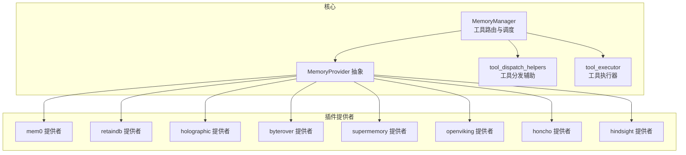
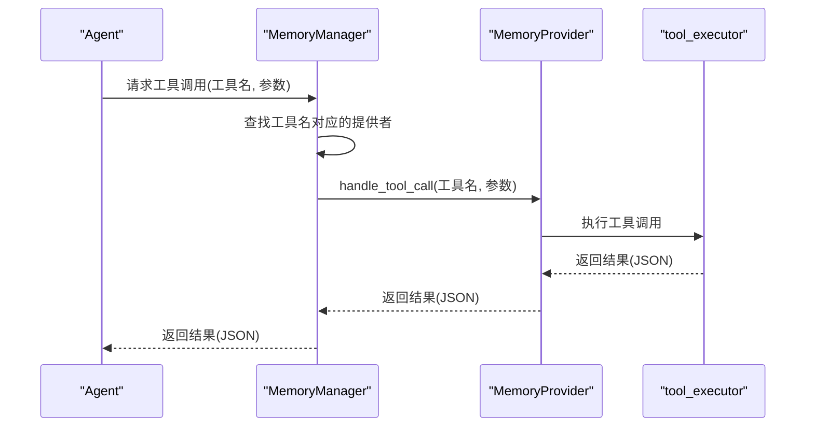
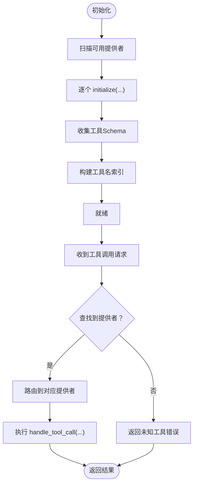
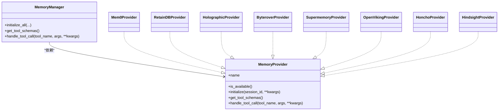

# 工具路由系统

<cite>
**本文引用的文件**
- [agent/memory_manager.py](file://agent/memory_manager.py)
- [agent/memory_provider.py](file://agent/memory_provider.py)
- [agent/tool_dispatch_helpers.py](file://agent/tool_dispatch_helpers.py)
- [agent/tool_executor.py](file://agent/tool_executor.py)
- [plugins/memory/__init__.py](file://plugins/memory/__init__.py)
- [plugins/memory/mem0/__init__.py](file://plugins/memory/mem0/__init__.py)
- [plugins/memory/retaindb/__init__.py](file://plugins/memory/retaindb/__init__.py)
- [plugins/memory/holographic/__init__.py](file://plugins/memory/holographic/__init__.py)
- [plugins/memory/byterover/__init__.py](file://plugins/memory/byterover/__init__.py)
- [plugins/memory/supermemory/__init__.py](file://plugins/memory/supermemory/__init__.py)
- [plugins/memory/openviking/__init__.py](file://plugins/memory/openviking/__init__.py)
- [plugins/memory/honcho/__init__.py](file://plugins/memory/honcho/__init__.py)
- [plugins/memory/hindsight/__init__.py](file://plugins/memory/hindsight/__init__.py)
- [tests/agent/test_memory_provider.py](file://tests/agent/test_memory_provider.py)
- [tests/agent/test_memory_user_id.py](file://tests/agent/test_memory_user_id.py)
- [tests/plugins/memory/test_mem0_v2.py](file://tests/plugins/memory/test_mem0_v2.py)
- [tests/plugins/test_retaindb_plugin.py](file://tests/plugins/test_retaindb_plugin.py)
- [website/docs/developer-guide/memory-provider-plugin.md](file://website/docs/developer-guide/memory-provider-plugin.md)
</cite>

## 目录
1. [简介](#简介)
2. [项目结构](#项目结构)
3. [核心组件](#核心组件)
4. [架构总览](#架构总览)
5. [详细组件分析](#详细组件分析)
6. [依赖关系分析](#依赖关系分析)
7. [性能考量](#性能考量)
8. [故障排除指南](#故障排除指南)
9. [结论](#结论)

## 简介
本文件面向Hermes Agent的记忆工具路由系统，围绕“工具名称到提供者的路由映射”展开，系统性阐述以下主题：
- 工具Schema收集与注入
- 工具名称索引与路由表构建
- 工具调用的路由决策流程与提供者选择策略
- handle_tool_call方法的实现要点（参数处理、异常捕获、错误响应）
- 冲突解决与最佳实践
- 性能优化策略与故障排除

该系统以MemoryManager为核心编排器，结合MemoryProvider抽象与插件化记忆提供者，实现工具Schema的统一收集、工具名称索引与路由分发。

## 项目结构
与工具路由系统直接相关的模块分布如下：
- 核心编排与接口
  - agent/memory_manager.py：记忆提供者生命周期管理、工具Schema聚合、路由分发入口
  - agent/memory_provider.py：MemoryProvider抽象基类与通用约定
  - agent/tool_dispatch_helpers.py：工具分发辅助逻辑（如工具名规范化、冲突检测等）
  - agent/tool_executor.py：工具执行器（与路由配合，负责实际调用）
- 插件式记忆提供者
  - plugins/memory/<provider>/__init__.py：各提供者实现（mem0、retaindb、holographic、byterover、supermemory、openviking、honcho、hindsight）
  - plugins/memory/__init__.py：提供者发现、加载与可用性检查
- 测试与文档
  - tests/agent/test_memory_provider.py：提供者接口契约与行为测试
  - tests/plugins/memory/test_mem0_v2.py、tests/plugins/test_retaindb_plugin.py：具体提供者的工具调用与错误处理验证
  - website/docs/developer-guide/memory-provider-plugin.md：开发者指南（接口规范）

图表来源
- [agent/memory_manager.py](file://agent/memory_manager.py)
- [agent/memory_provider.py](file://agent/memory_provider.py)
- [agent/tool_dispatch_helpers.py](file://agent/tool_dispatch_helpers.py)
- [agent/tool_executor.py](file://agent/tool_executor.py)
- [plugins/memory/__init__.py](file://plugins/memory/__init__.py)

章节来源
- [agent/memory_manager.py](file://agent/memory_manager.py)
- [agent/memory_provider.py](file://agent/memory_provider.py)
- [plugins/memory/__init__.py](file://plugins/memory/__init__.py)

## 核心组件
- MemoryManager：负责提供者初始化、工具Schema收集、工具名称索引与路由分发；对外暴露工具调用入口
- MemoryProvider：定义提供者必须实现的生命周期与接口（name、is_available、initialize、get_tool_schemas、handle_tool_call等）
- tool_dispatch_helpers：提供工具名规范化、冲突检测、路由决策辅助
- tool_executor：封装工具调用的执行与结果返回
- 插件提供者：各记忆后端的具体实现，需遵循MemoryProvider接口并提供工具Schema与handle_tool_call

章节来源
- [agent/memory_manager.py](file://agent/memory_manager.py)
- [agent/memory_provider.py](file://agent/memory_provider.py)
- [agent/tool_dispatch_helpers.py](file://agent/tool_dispatch_helpers.py)
- [agent/tool_executor.py](file://agent/tool_executor.py)
- [website/docs/developer-guide/memory-provider-plugin.md](file://website/docs/developer-guide/memory-provider-plugin.md)

## 架构总览
工具路由系统采用“集中编排 + 插件化提供者”的架构：
- 初始化阶段：MemoryManager扫描并加载所有可用的MemoryProvider，调用其initialize与get_tool_schemas
- Schema聚合：将各提供者的工具Schema合并，构建全局工具索引（工具名到提供者的映射）
- 调用阶段：根据工具名查找提供者，调用handle_tool_call(args, kwargs)，返回JSON字符串或错误信息
- 生命周期：支持预取、回合同步、会话结束回调等扩展钩子，便于上下文注入与持久化

图表来源
- [agent/memory_manager.py](file://agent/memory_manager.py)
- [agent/tool_executor.py](file://agent/tool_executor.py)
- [agent/memory_provider.py](file://agent/memory_provider.py)

## 详细组件分析

### MemoryManager：工具路由与调度中枢
职责与关键流程：
- 提供者发现与加载：通过plugins/memory/__init__.py扫描并加载可用提供者
- 初始化：逐个调用initialize(session_id, **kwargs)，传递会话与平台信息
- Schema收集：调用get_tool_schemas()，聚合各提供者工具Schema
- 工具索引与路由表：基于工具Schema构建“工具名 → 提供者实例”的映射
- 工具调用：handle_tool_call(tool_name, args, **kwargs)进行路由与执行
- 生命周期钩子：支持prefetch、queue_prefetch、sync_turn、on_session_end等

图表来源
- [agent/memory_manager.py](file://agent/memory_manager.py)
- [plugins/memory/__init__.py](file://plugins/memory/__init__.py)

章节来源
- [agent/memory_manager.py](file://agent/memory_manager.py)
- [plugins/memory/__init__.py](file://plugins/memory/__init__.py)

### MemoryProvider抽象：接口契约与实现约束
- 必须实现的方法与用途
  - name：提供者标识
  - is_available()：快速可用性检查（不进行网络调用）
  - initialize(session_id, **kwargs)：启动时初始化，接收会话ID、平台、用户ID等
  - get_tool_schemas()：返回工具Schema列表，用于注入与索引
  - handle_tool_call(tool_name, args, **kwargs)：执行具体工具调用，返回JSON字符串
- 可选钩子
  - system_prompt_block()、prefetch()、queue_prefetch()、sync_turn()、on_session_end()、on_pre_compress()、on_memory_write()、shutdown()

章节来源
- [agent/memory_provider.py](file://agent/memory_provider.py)
- [website/docs/developer-guide/memory-provider-plugin.md](file://website/docs/developer-guide/memory-provider-plugin.md)

### 工具Schema收集与工具名称索引
- Schema收集：各提供者在get_tool_schemas()中返回自身工具定义，MemoryManager将其汇总
- 工具名称索引：为避免同名冲突，系统对工具名进行规范化与冲突检测；最终建立“工具名 → 提供者实例”映射
- 冲突解决策略：当多个提供者声明相同工具名时，优先级由加载顺序与命名空间决定；建议提供者使用前缀区分（例如retaindb_*、mem0_*）

章节来源
- [agent/tool_dispatch_helpers.py](file://agent/tool_dispatch_helpers.py)
- [agent/memory_manager.py](file://agent/memory_manager.py)

### 路由表构建与调用决策
- 路由表构建：在MemoryManager完成初始化与Schema收集后，构建工具名到提供者的映射表
- 调用决策：handle_tool_call时先查表，若未命中则返回“未知工具”错误；若命中则调用对应提供者的handle_tool_call
- 参数处理：传入参数args与kwargs由执行器统一处理，提供者内部负责参数校验与业务逻辑

章节来源
- [agent/memory_manager.py](file://agent/memory_manager.py)
- [agent/tool_executor.py](file://agent/tool_executor.py)

### handle_tool_call实现细节
- 输入参数处理：接收工具名与参数字典，内部进行参数校验与必要转换
- 异常捕获：对提供者内部异常进行捕获，包装为标准错误响应
- 错误响应生成：返回包含错误信息的JSON对象，确保客户端可解析
- 结果格式：统一返回JSON字符串，便于上层序列化与传输

章节来源
- [agent/memory_manager.py](file://agent/memory_manager.py)
- [agent/tool_executor.py](file://agent/tool_executor.py)
- [tests/plugins/test_retaindb_plugin.py](file://tests/plugins/test_retaindb_plugin.py)

### 具体提供者示例与行为验证
- mem0提供者
  - 支持profile与search工具，handle_tool_call返回结构化的结果JSON
  - 测试覆盖了profile与search的返回格式兼容性
- retaindb提供者
  - 支持profile、search、remember、forget等工具
  - 行为验证包括未初始化状态、未知工具、参数缺失、top_k上限等场景

章节来源
- [tests/plugins/memory/test_mem0_v2.py](file://tests/plugins/memory/test_mem0_v2.py)
- [tests/plugins/test_retaindb_plugin.py](file://tests/plugins/test_retaindb_plugin.py)

## 依赖关系分析
- MemoryManager依赖
  - MemoryProvider抽象：所有提供者均实现该接口
  - tool_dispatch_helpers：工具名规范化与冲突检测
  - tool_executor：工具执行与结果封装
  - plugins/memory/__init__.py：提供者发现与加载
- 提供者依赖
  - 各自实现get_tool_schemas与handle_tool_call
  - 可选钩子用于上下文注入与持久化

图表来源
- [agent/memory_manager.py](file://agent/memory_manager.py)
- [agent/memory_provider.py](file://agent/memory_provider.py)
- [plugins/memory/mem0/__init__.py](file://plugins/memory/mem0/__init__.py)
- [plugins/memory/retaindb/__init__.py](file://plugins/memory/retaindb/__init__.py)
- [plugins/memory/holographic/__init__.py](file://plugins/memory/holographic/__init__.py)
- [plugins/memory/byterover/__init__.py](file://plugins/memory/byterover/__init__.py)
- [plugins/memory/supermemory/__init__.py](file://plugins/memory/supermemory/__init__.py)
- [plugins/memory/openviking/__init__.py](file://plugins/memory/openviking/__init__.py)
- [plugins/memory/honcho/__init__.py](file://plugins/memory/honcho/__init__.py)
- [plugins/memory/hindsight/__init__.py](file://plugins/memory/hindsight/__init__.py)

## 性能考量
- 提供者可用性检查：is_available()应避免网络调用，确保初始化阶段低开销
- Schema聚合：仅在初始化完成后一次性构建索引，避免重复扫描
- 工具调用：handle_tool_call应尽量短路失败路径（参数校验、权限检查），减少无效调用
- 缓存与预取：利用prefetch与queue_prefetch在回合间预热，降低延迟
- 并发与限流：在高并发场景下，建议在提供者内部实现调用限流与重试策略

## 故障排除指南
常见问题与排查步骤：
- 未知工具错误
  - 确认工具名是否正确，是否已被当前提供者注册
  - 检查MemoryManager是否已收集到该提供者的Schema
- 提供者未初始化
  - 确保MemoryManager.initialize_all已调用，且提供者is_available()返回True
- 参数缺失或类型错误
  - 检查handle_tool_call的参数校验逻辑，确保必填字段存在
- 冲突与覆盖
  - 若多个提供者声明相同工具名，优先使用加载顺序靠前的；建议使用命名前缀避免冲突
- 日志与诊断
  - 使用TUI调试命令查看内存与堆快照，定位资源瓶颈

章节来源
- [tests/plugins/test_retaindb_plugin.py](file://tests/plugins/test_retaindb_plugin.py)
- [tests/agent/test_memory_provider.py](file://tests/agent/test_memory_provider.py)
- [tests/agent/test_memory_user_id.py](file://tests/agent/test_memory_user_id.py)

## 结论
Hermes Agent的记忆工具路由系统通过MemoryManager集中编排、MemoryProvider抽象契约与插件化提供者实现，形成了清晰的“工具Schema收集—工具名称索引—路由分发—执行返回”的闭环。实践中建议：
- 在提供者侧严格实现接口，保证Schema完整与handle_tool_call健壮
- 使用命名前缀避免工具名冲突
- 在初始化阶段完成可用性检查与Schema聚合，运行期专注路由与执行
- 结合测试用例与日志工具，持续优化性能与稳定性