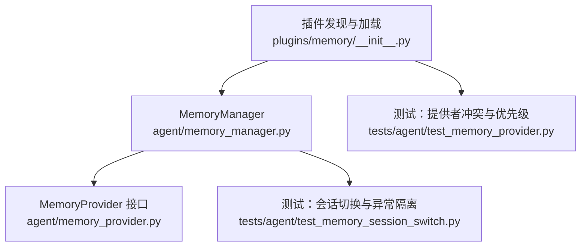
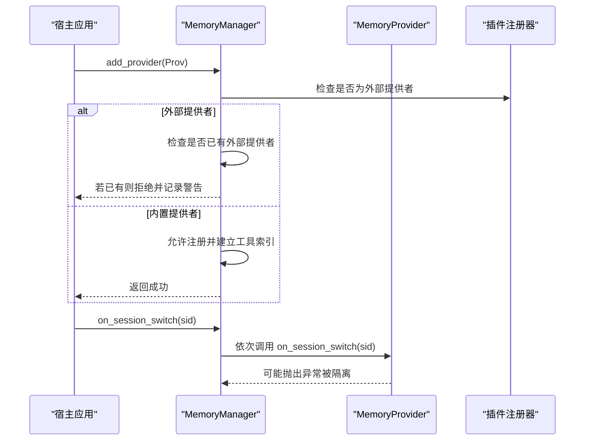
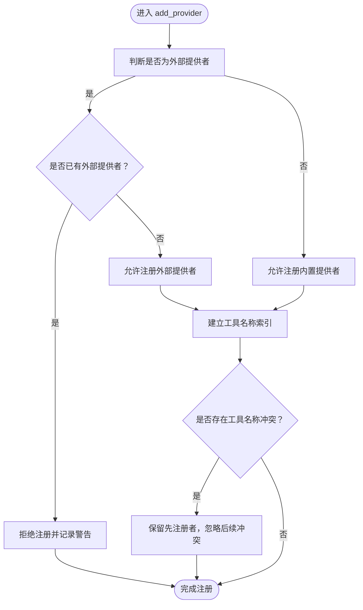
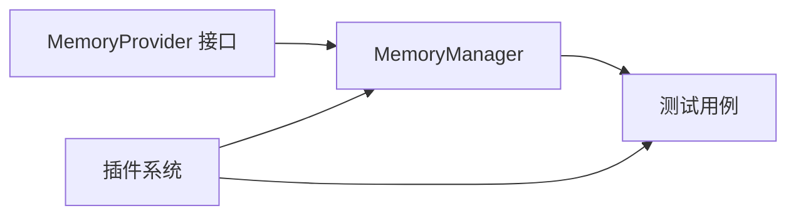

# 提供者注册机制

<cite>
**本文引用的文件**
- [memory_manager.py](file://agent/memory_manager.py)
- [memory_provider.py](file://agent/memory_provider.py)
- [__init__.py](file://plugins/memory/__init__.py)
- [test_memory_provider.py](file://tests/agent/test_memory_provider.py)
- [test_memory_session_switch.py](file://tests/agent/test_memory_session_switch.py)
- [memory-provider-plugin.md](file://website/docs/developer-guide/memory-provider-plugin.md)
- [memory-providers.md](file://website/i18n/zh-Hans/docusaurus-plugin-content-docs/current/user-guide/features/memory-providers.md)
</cite>

## 目录
1. [简介](#简介)
2. [项目结构](#项目结构)
3. [核心组件](#核心组件)
4. [架构总览](#架构总览)
5. [详细组件分析](#详细组件分析)
6. [依赖关系分析](#依赖关系分析)
7. [性能考量](#性能考量)
8. [故障排查指南](#故障排查指南)
9. [结论](#结论)
10. [附录](#附录)

## 简介
本文件聚焦于 Hermes Agent 记忆提供者注册机制，系统性解析 MemoryManager.add_provider 方法的实现原理与行为边界，覆盖以下关键主题：
- 内置提供者与外部提供者的区别处理
- 提供者数量限制机制（仅允许一个外部提供者）
- 工具 Schema 索引建立与工具名称冲突处理策略
- 提供者优先级管理与冲突检测逻辑
- 注册失败的错误处理、日志记录与警告生成
- 完整的提供者注册流程示例与最佳实践

## 项目结构
围绕“记忆提供者注册”的相关代码与文档分布如下：
- 核心实现：agent/memory_manager.py、agent/memory_provider.py
- 插件发现与加载：plugins/memory/__init__.py
- 测试用例：tests/agent/test_memory_provider.py、tests/agent/test_memory_session_switch.py
- 开发者文档：website/docs/developer-guide/memory-provider-plugin.md
- 用户文档：website/i18n/zh-Hans/docusaurus-plugin-content-docs/current/user-guide/features/memory-providers.md

图表来源
- [memory_manager.py](file://agent/memory_manager.py)
- [memory_provider.py](file://agent/memory_provider.py)
- [__init__.py](file://plugins/memory/__init__.py)
- [test_memory_provider.py](file://tests/agent/test_memory_provider.py)
- [test_memory_session_switch.py](file://tests/agent/test_memory_session_switch.py)

章节来源
- [memory_manager.py](file://agent/memory_manager.py)
- [memory_provider.py](file://agent/memory_provider.py)
- [__init__.py](file://plugins/memory/__init__.py)
- [test_memory_provider.py](file://tests/agent/test_memory_provider.py)
- [test_memory_session_switch.py](file://tests/agent/test_memory_session_switch.py)

## 核心组件
- MemoryManager：负责提供者注册、工具 Schema 索引、会话切换回调与异常隔离等核心逻辑。
- MemoryProvider：定义提供者接口，包含工具定义、会话切换钩子等能力。
- 插件系统：扫描 plugins/memory 下的目录，动态发现并加载提供者实现。

章节来源
- [memory_manager.py](file://agent/memory_manager.py)
- [memory_provider.py](file://agent/memory_provider.py)
- [__init__.py](file://plugins/memory/__init__.py)

## 架构总览
MemoryManager 在注册阶段对提供者进行分类与约束，确保：
- 内置提供者与外部提供者共存但受控
- 仅允许一个外部提供者处于活动状态
- 工具名称冲突采用“先到先得”策略
- 会话切换时调用所有提供者的回调，异常被隔离

图表来源
- [memory_manager.py](file://agent/memory_manager.py)
- [__init__.py](file://plugins/memory/__init__.py)

## 详细组件分析

### MemoryManager.add_provider 实现要点
- 外部提供者识别：通过插件发现逻辑判断提供者来源，若来自 plugins/memory 则视为外部提供者。
- 数量限制：当已有外部提供者处于活动状态时，再次注册外部提供者将被拒绝，并输出警告日志。
- 内置提供者处理：允许注册内置提供者；同时建立工具名称到提供者的索引，用于后续工具调度。
- 工具名称冲突：若多个提供者声明同名工具，采用“先注册者优先”的策略（“先到先得”）。
- 异常隔离：会话切换回调在 MemoryManager 层面进行异常捕获与日志记录，避免单个提供者失败影响其他提供者。

图表来源
- [memory_manager.py](file://agent/memory_manager.py)
- [__init__.py](file://plugins/memory/__init__.py)

章节来源
- [memory_manager.py](file://agent/memory_manager.py)
- [test_memory_provider.py](file://tests/agent/test_memory_provider.py)

### 工具 Schema 索引与名称冲突处理
- 索引建立：MemoryManager 维护工具名称到提供者的映射，确保工具查找与路由高效。
- 冲突策略：当多个提供者声明相同工具名称时，以“先注册者优先”原则保留该工具定义，其余冲突工具被忽略。
- 冲突检测：在注册过程中进行冲突扫描，避免重复工具定义导致的调度歧义。

章节来源
- [memory_manager.py](file://agent/memory_manager.py)
- [test_memory_provider.py](file://tests/agent/test_memory_provider.py)

### 会话切换与异常隔离
- 回调触发：MemoryManager 在 on_session_switch 时遍历所有已注册提供者并调用其 on_session_switch。
- 异常隔离：单个提供者的异常被捕获并记录，不会阻断其他提供者的回调执行。
- 空会话 ID 防护：空字符串或 None 的 session_id 不触发任何提供者回调，防止关闭阶段误触发。

章节来源
- [memory_manager.py](file://agent/memory_manager.py)
- [test_memory_session_switch.py](file://tests/agent/test_memory_session_switch.py)

### 插件发现与加载
- 目录扫描：plugins/memory 下的每个子目录被视为一个提供者包，通过扫描 __init__.py 判断是否为记忆提供者。
- 动态加载：支持 register(ctx) 模式，通过收集器对象向 MemoryManager 注册提供者实例。
- 错误处理：模块执行失败会被记录调试日志并回滚模块注册，避免污染运行时环境。

章节来源
- [__init__.py](file://plugins/memory/__init__.py)

### 开发者与用户文档指引
- 单一外部提供者规则：开发者文档明确指出“同一时刻仅允许一个外部记忆提供者处于活动状态”，否则将被拒绝。
- 用户指南：用户文档列举了多种记忆提供者及其特性、安装方式与适用场景，便于选择合适的外部提供者。

章节来源
- [memory-provider-plugin.md](file://website/docs/developer-guide/memory-provider-plugin.md)
- [memory-providers.md](file://website/i18n/zh-Hans/docusaurus-plugin-content-docs/current/user-guide/features/memory-providers.md)

## 依赖关系分析
- MemoryManager 依赖 MemoryProvider 接口定义工具与生命周期钩子。
- 插件系统负责发现与加载外部提供者，为 MemoryManager 提供注册入口。
- 测试用例覆盖冲突处理、异常隔离与会话切换等关键路径。

图表来源
- [memory_provider.py](file://agent/memory_provider.py)
- [memory_manager.py](file://agent/memory_manager.py)
- [__init__.py](file://plugins/memory/__init__.py)
- [test_memory_provider.py](file://tests/agent/test_memory_provider.py)
- [test_memory_session_switch.py](file://tests/agent/test_memory_session_switch.py)

章节来源
- [memory_provider.py](file://agent/memory_provider.py)
- [memory_manager.py](file://agent/memory_manager.py)
- [__init__.py](file://plugins/memory/__init__.py)
- [test_memory_provider.py](file://tests/agent/test_memory_provider.py)
- [test_memory_session_switch.py](file://tests/agent/test_memory_session_switch.py)

## 性能考量
- 工具索引：通过名称到提供者的映射实现 O(1) 左右的工具查找，降低调度开销。
- 注册阶段冲突检测：在注册时一次性完成冲突判定，避免运行期多次扫描带来的额外成本。
- 异常隔离：回调异常不传播至其他提供者，减少连锁反应与重试成本。

## 故障排查指南
常见问题与处理建议：
- 注册外部提供者被拒绝
  - 现象：提示仅允许一个外部提供者处于活动状态。
  - 处理：卸载当前外部提供者后再注册新的外部提供者。
  - 参考：单一外部提供者规则与测试用例。
- 工具名称冲突
  - 现象：工具未生效或报冲突警告。
  - 处理：确认工具名称唯一性，遵循“先到先得”原则，避免重复定义。
  - 参考：工具名称冲突测试与注册流程。
- 会话切换回调异常
  - 现象：部分提供者回调未执行或出现异常日志。
  - 处理：检查提供者实现的 on_session_switch 是否抛出未捕获异常；MemoryManager 已进行异常隔离。
  - 参考：会话切换与异常隔离测试。
- 插件加载失败
  - 现象：外部提供者未出现在可用列表中。
  - 处理：检查 plugins/memory 下的目录结构与 __init__.py 是否符合规范；查看调试日志定位失败原因。
  - 参考：插件发现与加载逻辑。

章节来源
- [memory-manager.md](file://agent/memory_manager.py)
- [test_memory_provider.py](file://tests/agent/test_memory_provider.py)
- [test_memory_session_switch.py](file://tests/agent/test_memory_session_switch.py)
- [__init__.py](file://plugins/memory/__init__.py)

## 结论
Hermes Agent 的记忆提供者注册机制通过严格的“单一外部提供者”约束、先到先得的工具名称冲突策略以及异常隔离设计，在保证系统稳定性的同时提供了灵活的扩展能力。开发者应遵循文档规范，合理规划工具命名与生命周期钩子，确保提供者注册与运行顺畅。

## 附录

### 完整注册流程示例（步骤说明）
- 步骤 1：准备提供者实现
  - 实现 MemoryProvider 接口，定义工具与 on_session_switch 钩子。
- 步骤 2：打包为插件
  - 将提供者放入 plugins/memory/<name>/ 目录，确保 __init__.py 可被扫描。
- 步骤 3：注册提供者
  - 调用 MemoryManager.add_provider 注册；若为外部提供者且已有外部提供者在活动，则被拒绝。
- 步骤 4：验证工具索引
  - 确认工具名称唯一，避免冲突；冲突时以先注册者为准。
- 步骤 5：会话切换
  - 调用 on_session_switch 触发所有提供者回调；异常被隔离，不影响其他提供者。

章节来源
- [memory_manager.py](file://agent/memory_manager.py)
- [memory_provider.py](file://agent/memory_provider.py)
- [__init__.py](file://plugins/memory/__init__.py)
- [memory-provider-plugin.md](file://website/docs/developer-guide/memory-provider-plugin.md)