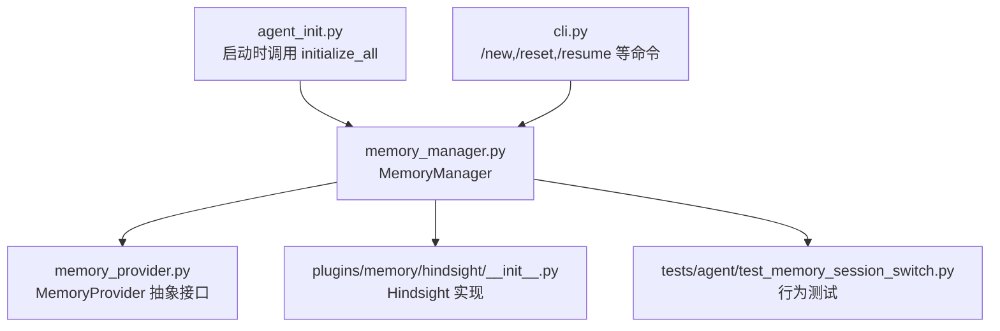
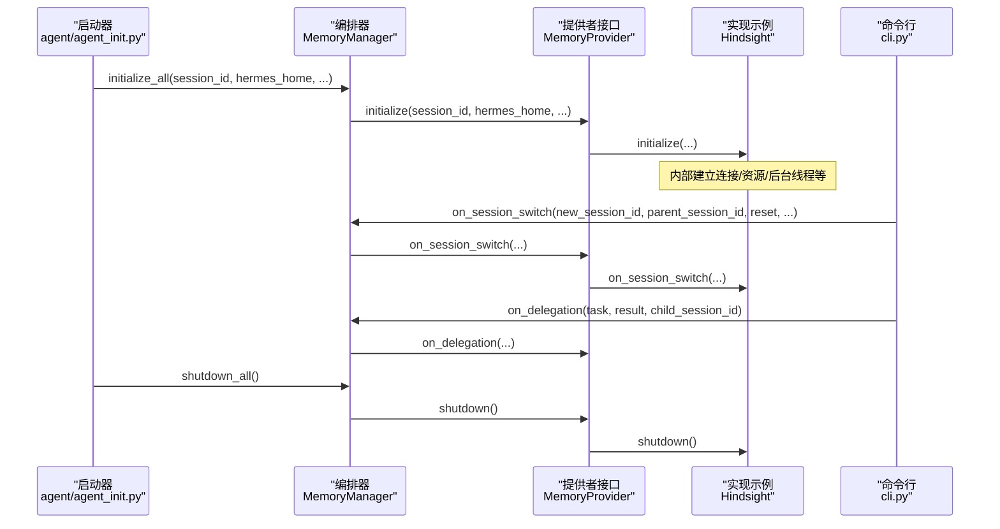
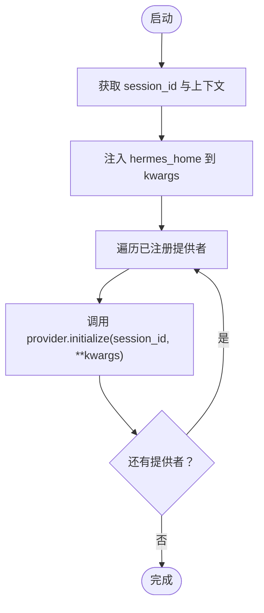
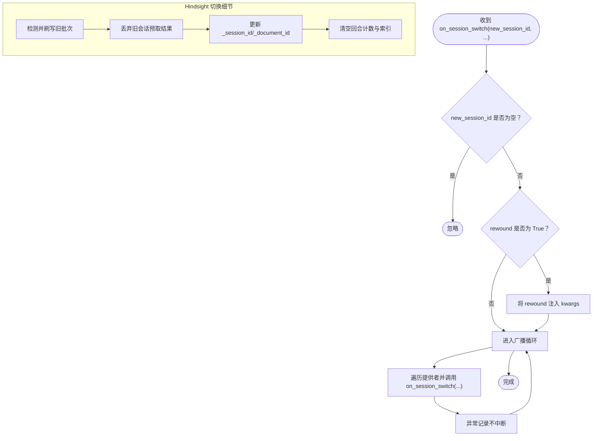
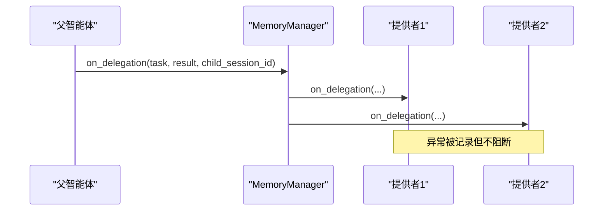
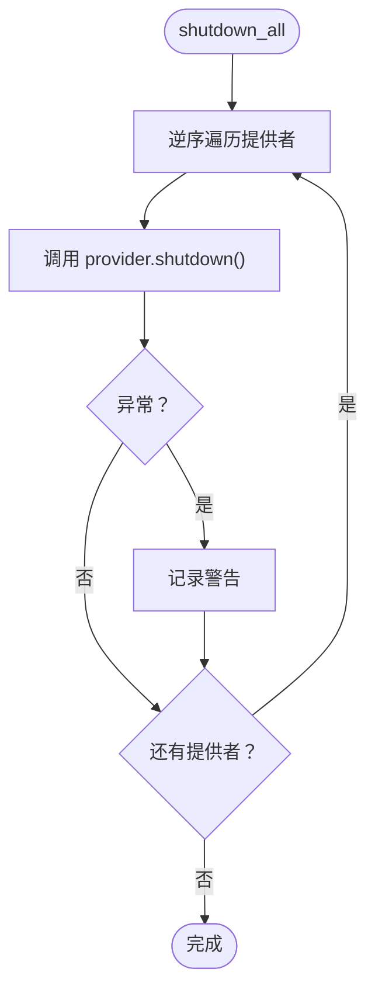
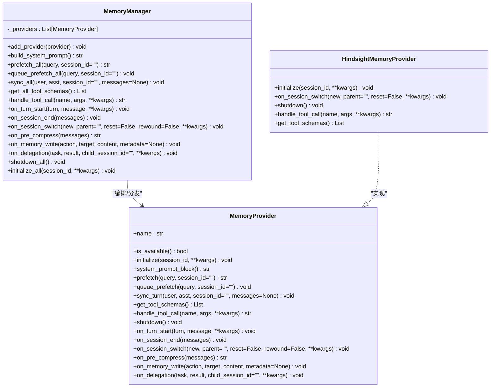
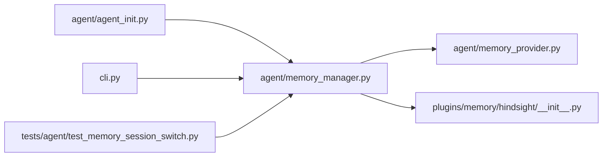

# 生命周期管理

<cite>
**本文引用的文件**
- [agent/memory_provider.py](file://agent/memory_provider.py)
- [agent/memory_manager.py](file://agent/memory_manager.py)
- [agent/agent_init.py](file://agent/agent_init.py)
- [plugins/memory/hindsight/__init__.py](file://plugins/memory/hindsight/__init__.py)
- [cli.py](file://cli.py)
- [tests/agent/test_memory_session_switch.py](file://tests/agent/test_memory_session_switch.py)
</cite>

## 目录
1. [简介](#简介)
2. [项目结构](#项目结构)
3. [核心组件](#核心组件)
4. [架构总览](#架构总览)
5. [详细组件分析](#详细组件分析)
6. [依赖关系分析](#依赖关系分析)
7. [性能考量](#性能考量)
8. [故障排查指南](#故障排查指南)
9. [结论](#结论)
10. [附录](#附录)

## 简介
本文件聚焦于Hermes Agent记忆提供者的生命周期管理，系统化阐述以下关键流程与机制：
- 初始化流程：initialize_all
- 会话切换处理：on_session_switch
- 转交通知：on_delegation
- 关闭流程：shutdown_all

重点覆盖提供者生命周期各阶段的状态管理、参数传递、错误隔离与一致性保障；并结合Hindsight等具体实现，说明在会话ID轮换时如何同步提供者内部状态、如何处理内存写入事件通知以及如何避免提供者间的竞态与数据错写。

## 项目结构
围绕记忆提供者生命周期的关键模块与文件如下：
- 抽象基类与接口定义：agent/memory_provider.py
- 生命周期编排器：agent/memory_manager.py
- 启动阶段调用入口：agent/agent_init.py
- 具体提供者实现示例：plugins/memory/hindsight/__init__.py
- 命令行触发点（会话切换/重置等）：cli.py
- 行为测试与契约验证：tests/agent/test_memory_session_switch.py

**图示来源**
- [agent/agent_init.py:1156](file://agent/agent_init.py#L1156)
- [agent/memory_manager.py:636](file://agent/memory_manager.py#L636)
- [agent/memory_provider.py:42](file://agent/memory_provider.py#L42)
- [plugins/memory/hindsight/__init__.py:1586](file://plugins/memory/hindsight/__init__.py#L1586)
- [cli.py:6809](file://cli.py#L6809)
- [tests/agent/test_memory_session_switch.py:103](file://tests/agent/test_memory_session_switch.py#L103)

**章节来源**
- [agent/memory_provider.py:15-31](file://agent/memory_provider.py#L15-L31)
- [agent/memory_manager.py:244-254](file://agent/memory_manager.py#L244-L254)
- [agent/agent_init.py:1156](file://agent/agent_init.py#L1156)
- [cli.py:6809](file://cli.py#L6809)

## 核心组件
- MemoryProvider（抽象基类）
  - 定义生命周期钩子：initialize、on_session_switch、on_delegation、shutdown等
  - 提供可选钩子：on_turn_start、on_session_end、on_pre_compress、on_memory_write、prefetch/sync_turn等
- MemoryManager（生命周期编排器）
  - 统一注册与调度多个提供者
  - 提供 initialize_all、on_session_switch、on_delegation、shutdown_all 等批量生命周期方法
  - 对每个提供者的异常进行隔离记录，不阻断其他提供者
- Hindsight 实现
  - 在 on_session_switch 中刷新会话标识、文档ID、批缓冲区，并对旧批次进行“切换前刷写”
  - 在 shutdown 中有序停止后台线程与队列，避免“无法调度新任务”与资源泄漏
- 启动与命令行触发
  - 启动时通过 MemoryManager.initialize_all 注入 hermes_home 等上下文
  - CLI 命令如 /new、/reset、/resume 等在执行前后调用 MemoryManager.on_session_switch

**章节来源**
- [agent/memory_provider.py:42-297](file://agent/memory_provider.py#L42-L297)
- [agent/memory_manager.py:244-654](file://agent/memory_manager.py#L244-L654)
- [plugins/memory/hindsight/__init__.py:1070](file://plugins/memory/hindsight/__init__.py#L1070)
- [plugins/memory/hindsight/__init__.py:1586](file://plugins/memory/hindsight/__init__.py#L1586)
- [plugins/memory/hindsight/__init__.py:1714](file://plugins/memory/hindsight/__init__.py#L1714)
- [agent/agent_init.py:1156](file://agent/agent_init.py#L1156)
- [cli.py:6809](file://cli.py#L6809)

## 架构总览
下图展示从启动到会话切换再到关闭的整体调用链路与责任边界：

**图示来源**
- [agent/agent_init.py:1156](file://agent/agent_init.py#L1156)
- [agent/memory_manager.py:488](file://agent/memory_manager.py#L488)
- [agent/memory_manager.py:611](file://agent/memory_manager.py#L611)
- [agent/memory_manager.py:625](file://agent/memory_manager.py#L625)
- [agent/memory_provider.py:60](file://agent/memory_provider.py#L60)
- [plugins/memory/hindsight/__init__.py:1586](file://plugins/memory/hindsight/__init__.py#L1586)
- [plugins/memory/hindsight/__init__.py:1714](file://plugins/memory/hindsight/__init__.py#L1714)
- [cli.py:6809](file://cli.py#L6809)

## 详细组件分析

### 初始化流程（initialize_all）
- 触发时机：Agent启动时，由启动器调用 MemoryManager.initialize_all
- 参数注入：自动向 kwargs 注入 hermes_home，便于提供者解析配置与存储路径
- 执行策略：依次调用每个已注册提供者的 initialize；异常被记录但不中断后续提供者
- 一致性要求：所有提供者应在同一 session_id 下完成初始化，确保后续写入与查询的会话语义一致

**图示来源**
- [agent/agent_init.py:1156](file://agent/agent_init.py#L1156)
- [agent/memory_manager.py:636](file://agent/memory_manager.py#L636)

**章节来源**
- [agent/agent_init.py:1156](file://agent/agent_init.py#L1156)
- [agent/memory_manager.py:636](file://agent/memory_manager.py#L636)

### 会话切换处理（on_session_switch）
- 触发场景：/resume、/branch、/reset、/new、上下文压缩等导致 session_id 轮换但不销毁提供者实例
- 编排逻辑：
  - 若 new_session_id 为空则直接返回（避免在关闭阶段误触发）
  - 仅当 rewound 显式为 True 时才传入额外关键字参数，以避免污染常规路径的调用契约
  - 遍历所有提供者，逐个调用其 on_session_switch，并捕获异常进行日志记录
- 提供者职责（以 Hindsight 为例）：
  - 切换前：若存在未提交的会话回合缓存，先按旧标识“刷写”一次，确保不丢失数据
  - 切换中：更新 _session_id、生成新的 _document_id（含时间戳），清空回合计数与索引
  - 切换后：丢弃旧会话的预取结果，防止新会话读到过期召回文本
- 一致性保证：
  - 文档ID与会话ID绑定，避免 /resume 导致的覆盖写
  - 批处理队列与写入器串行化，避免多线程同时写入同一文档
  - atexit 注册确保进程退出时有序清理，避免“无法调度新任务”警告

**图示来源**
- [agent/memory_manager.py:488](file://agent/memory_manager.py#L488)
- [agent/memory_manager.py:522](file://agent/memory_manager.py#L522)
- [plugins/memory/hindsight/__init__.py:1586](file://plugins/memory/hindsight/__init__.py#L1586)
- [plugins/memory/hindsight/__init__.py:1629](file://plugins/memory/hindsight/__init__.py#L1629)

**章节来源**
- [agent/memory_manager.py:488](file://agent/memory_manager.py#L488)
- [agent/memory_manager.py:522](file://agent/memory_manager.py#L522)
- [plugins/memory/hindsight/__init__.py:1586](file://plugins/memory/hindsight/__init__.py#L1586)
- [plugins/memory/hindsight/__init__.py:1629](file://plugins/memory/hindsight/__init__.py#L1629)
- [tests/agent/test_memory_session_switch.py:103](file://tests/agent/test_memory_session_switch.py#L103)

### 转交通知（on_delegation）
- 触发场景：父智能体观察到子智能体完成某项任务并返回结果
- 编排逻辑：MemoryManager 遍历所有提供者，调用其 on_delegation(task, result, child_session_id=...)
- 错误隔离：单个提供者异常不影响其他提供者
- 使用建议：父智能体侧可据此记录委托轨迹、提取子任务洞察或触发外部同步

**图示来源**
- [agent/memory_manager.py:611](file://agent/memory_manager.py#L611)

**章节来源**
- [agent/memory_manager.py:611](file://agent/memory_manager.py#L611)

### 关闭流程（shutdown_all）
- 触发时机：Agent 正常退出或需要释放资源
- 编排逻辑：MemoryManager 按逆序调用每个提供者的 shutdown，异常记录但不中断
- 实现要点（以 Hindsight 为例）：
  - 设置“正在关闭”信号，拒绝新任务入队
  - 向写入器队列投递哨兵，等待写入器完成在途任务并退出
  - 关闭后台线程与客户端，避免“未关闭的会话/连接”警告
  - 不强制停止共享事件循环，避免影响其他实例

**图示来源**
- [agent/memory_manager.py:625](file://agent/memory_manager.py#L625)
- [plugins/memory/hindsight/__init__.py:1714](file://plugins/memory/hindsight/__init__.py#L1714)

**章节来源**
- [agent/memory_manager.py:625](file://agent/memory_manager.py#L625)
- [plugins/memory/hindsight/__init__.py:1714](file://plugins/memory/hindsight/__init__.py#L1714)

### 类关系与职责映射

**图示来源**
- [agent/memory_provider.py:42](file://agent/memory_provider.py#L42)
- [agent/memory_manager.py:244](file://agent/memory_manager.py#L244)
- [plugins/memory/hindsight/__init__.py:1586](file://plugins/memory/hindsight/__init__.py#L1586)

**章节来源**
- [agent/memory_provider.py:42-297](file://agent/memory_provider.py#L42-L297)
- [agent/memory_manager.py:244-654](file://agent/memory_manager.py#L244-L654)
- [plugins/memory/hindsight/__init__.py:1586](file://plugins/memory/hindsight/__init__.py#L1586)

## 依赖关系分析
- 启动依赖：agent_init.py 依赖 MemoryManager.initialize_all 完成提供者初始化
- 运行依赖：cli.py 在不同命令路径上触发 MemoryManager.on_session_switch
- 实现依赖：Hindsight 作为 MemoryProvider 的具体实现，遵循 on_session_switch 与 shutdown 的契约
- 测试依赖：test_memory_session_switch.py 验证 on_session_switch 的广播、失败隔离与空 ID 忽略

**图示来源**
- [agent/agent_init.py:1156](file://agent/agent_init.py#L1156)
- [cli.py:6809](file://cli.py#L6809)
- [agent/memory_manager.py:488](file://agent/memory_manager.py#L488)
- [plugins/memory/hindsight/__init__.py:1586](file://plugins/memory/hindsight/__init__.py#L1586)
- [tests/agent/test_memory_session_switch.py:103](file://tests/agent/test_memory_session_switch.py#L103)

**章节来源**
- [agent/agent_init.py:1156](file://agent/agent_init.py#L1156)
- [cli.py:6809](file://cli.py#L6809)
- [agent/memory_manager.py:488](file://agent/memory_manager.py#L488)
- [plugins/memory/hindsight/__init__.py:1586](file://plugins/memory/hindsight/__init__.py#L1586)
- [tests/agent/test_memory_session_switch.py:103](file://tests/agent/test_memory_session_switch.py#L103)

## 性能考量
- 并发与串行化
  - Hindsight 在切换时将“旧批次刷写”放入与写入器相同的队列，确保 FIFO 顺序，避免多线程竞争同一文档
- 资源回收
  - shutdown 采用带超时的 join，避免长时间阻塞退出；atexit 注册保证进程退出时也能清理
- 异常隔离
  - MemoryManager 在每个生命周期钩子调用处均捕获异常并记录，避免一个提供者的失败影响其他提供者
- 预取与召回
  - on_session_switch 中显式丢弃旧会话的预取结果，避免新会话读到过期召回文本，减少无效网络请求

**章节来源**
- [plugins/memory/hindsight/__init__.py:1629](file://plugins/memory/hindsight/__init__.py#L1629)
- [plugins/memory/hindsight/__init__.py:1714](file://plugins/memory/hindsight/__init__.py#L1714)
- [agent/memory_manager.py:488](file://agent/memory_manager.py#L488)

## 故障排查指南
- 症状：会话切换后，新消息写入旧会话文档
  - 排查要点：确认 on_session_switch 是否被调用；检查提供者是否正确更新 _session_id 与 _document_id
  - 参考实现：Hindsight 在 on_session_switch 中会“切换前刷写旧批次”，并更新文档ID
- 症状：退出时报“无法调度新任务”或“未关闭的会话/连接”
  - 排查要点：确认 shutdown 是否被调用；检查写入器队列是否正确入哨兵并等待退出
  - 参考实现：Hindsight 在 shutdown 中设置“正在关闭”信号，入队哨兵并带超时 join
- 症状：会话切换回调被意外触发（例如关闭阶段 session_id 为空）
  - 排查要点：确认 MemoryManager.on_session_switch 对空 ID 的保护逻辑
- 症状：部分提供者异常导致其他提供者不可用
  - 排查要点：确认 MemoryManager 的异常捕获与日志记录是否生效
- 症状：on_session_switch 参数污染
  - 排查要点：仅在实际设置 rewound=True 时才传入该关键字，避免常规路径被污染

**章节来源**
- [plugins/memory/hindsight/__init__.py:1586](file://plugins/memory/hindsight/__init__.py#L1586)
- [plugins/memory/hindsight/__init__.py:1714](file://plugins/memory/hindsight/__init__.py#L1714)
- [agent/memory_manager.py:488](file://agent/memory_manager.py#L488)
- [tests/agent/test_memory_session_switch.py:122](file://tests/agent/test_memory_session_switch.py#L122)

## 结论
Hermes Agent 的记忆提供者生命周期管理通过 MemoryManager 将初始化、会话切换、转交通知与关闭等关键动作标准化，并以异常隔离与参数契约约束保障了多提供者共存时的一致性与稳定性。具体实现（如 Hindsight）在会话轮换时采取“切换前刷写旧批次”“丢弃旧预取结果”“更新文档ID”等措施，有效避免数据错写与竞态。建议在自定义提供者实现中严格遵循 on_session_switch 的语义，确保在 reset、/resume、/branch、压缩等场景下保持会话语义正确。

## 附录
- 最佳实践
  - 在 initialize 中完成资源创建与连接，避免在 on_session_switch 中做重工作
  - on_session_switch 中务必更新 _session_id 与 _document_id，并在必要时“刷写”未提交批次
  - on_memory_write 与 on_delegation 应尽量无副作用，避免阻塞主线程
  - shutdown 必须支持幂等与超时控制，确保进程退出可控
- 常见问题
  - 未处理空 session_id：在关闭阶段 session_id 可能为空，需提前返回
  - 未清理预取缓存：新会话可能读到旧召回文本
  - 未序列化写入：多线程同时写同一文档导致覆盖或竞态
  - 未注册 atexit：退出时出现资源泄漏告警