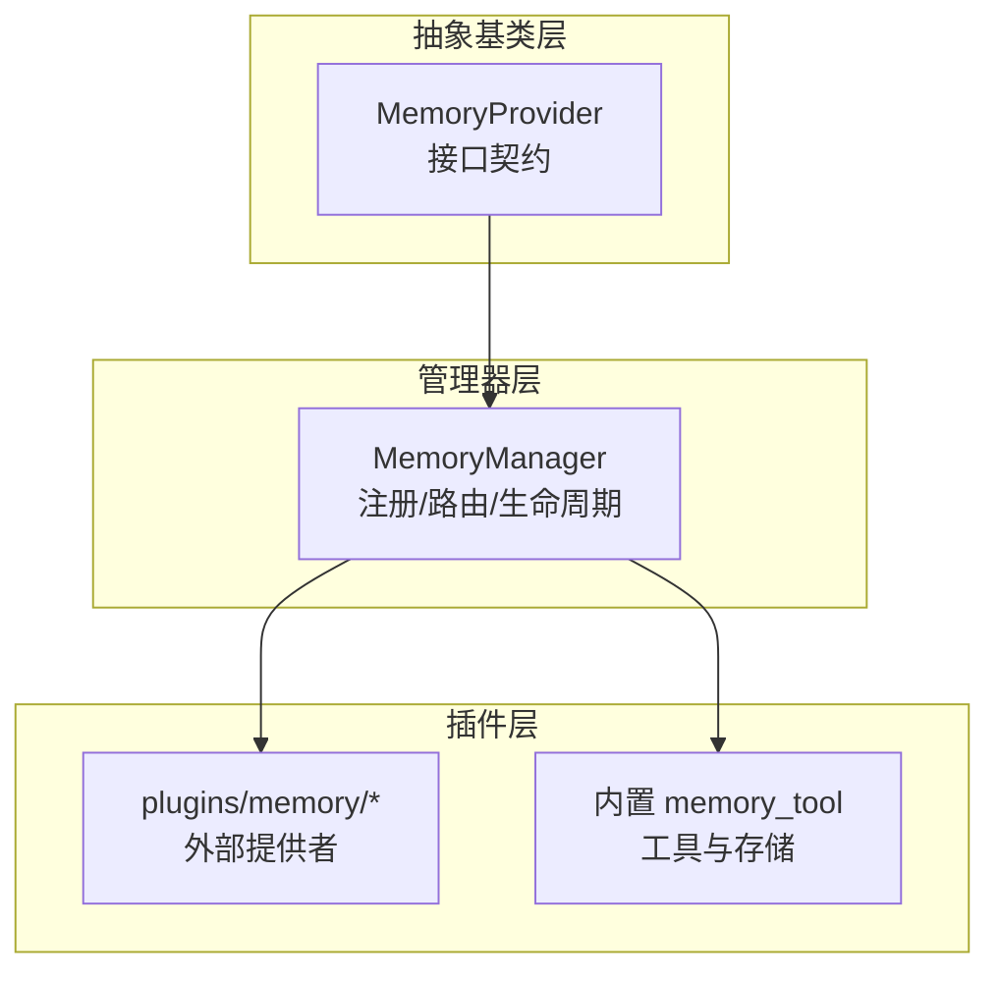
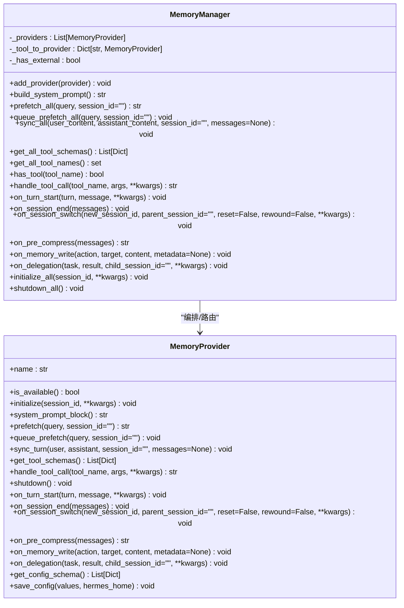
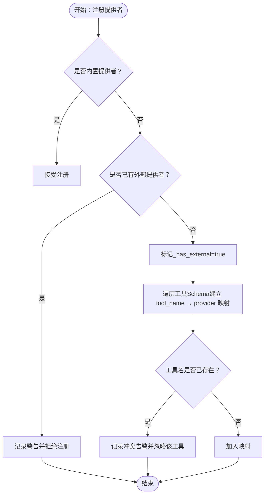
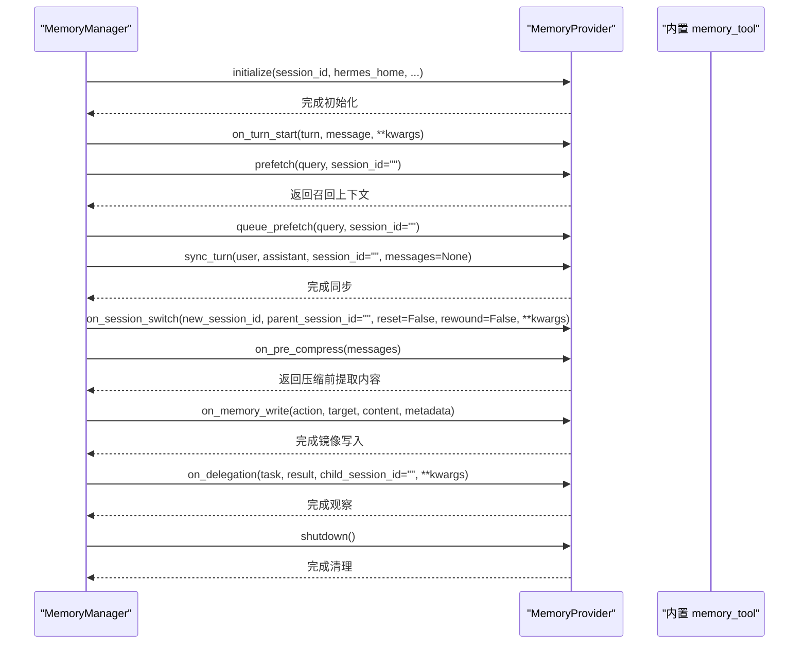
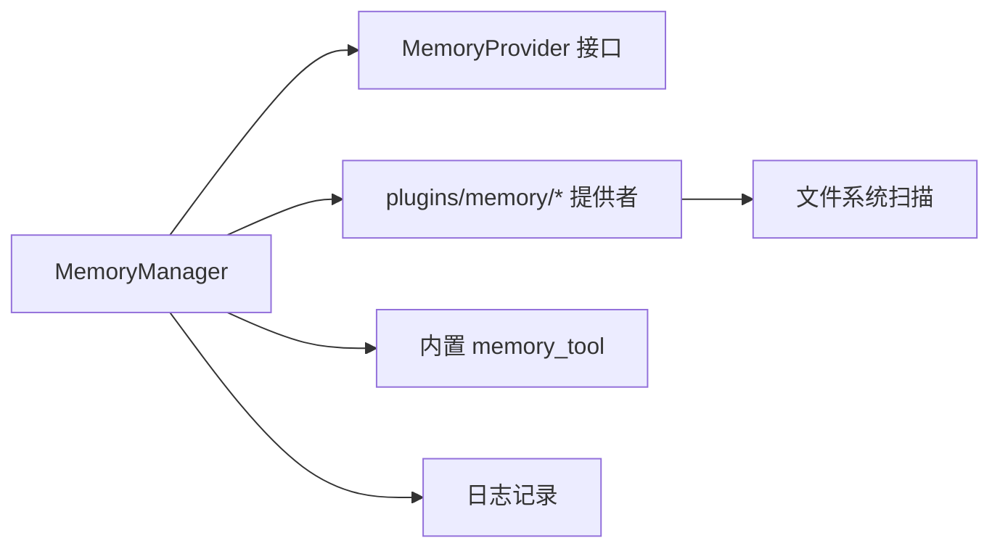

# 记忆提供者管理

<cite>
**本文引用的文件**
- [memory_manager.py](file://agent/memory_manager.py)
- [memory_provider.py](file://agent/memory_provider.py)
- [plugins/memory/__init__.py](file://plugins/memory/__init__.py)
- [memory_tool.py](file://tools/memory_tool.py)
- [memory-providers.md](file://website/docs/user-guide/features/memory-providers.md)
- [memory-provider-plugin.md](file://website/docs/developer-guide/memory-provider-plugin.md)
- [test_memory_user_id.py](file://tests/agent/test_memory_user_id.py)
- [test_memory_sync_interrupted.py](file://tests/run_agent/test_memory_sync_interrupted.py)
</cite>

## 目录
1. [简介](#简介)
2. [项目结构](#项目结构)
3. [核心组件](#核心组件)
4. [架构总览](#架构总览)
5. [详细组件分析](#详细组件分析)
6. [依赖关系分析](#依赖关系分析)
7. [性能考量](#性能考量)
8. [故障排除指南](#故障排除指南)
9. [结论](#结论)
10. [附录](#附录)

## 简介
本文件面向开发者与高级用户，系统化阐述 Hermes Agent 的“记忆提供者管理系统”。重点围绕 MemoryManager 类的架构设计，深入解析以下主题：
- 提供者注册机制与优先级策略
- 工具路由系统与冲突检测
- 内置提供者与外部插件提供者的协作模式
- 生命周期管理、初始化流程、配置验证与错误处理
- 提供者开发指南（接口规范、工具 Schema 定义、最佳实践）
- 扩展开发参考与故障排除

## 项目结构
记忆提供者体系由三层构成：
- 抽象基类层：定义统一的 MemoryProvider 接口契约
- 管理器层：MemoryManager 负责注册、路由、生命周期协调与错误隔离
- 插件层：plugins/memory 下的外部提供者，以及内置的 memory_tool 工具

图表来源
- [memory_manager.py:244-654](file://agent/memory_manager.py#L244-L654)
- [memory_provider.py:42-297](file://agent/memory_provider.py#L42-L297)
- [plugins/memory/__init__.py:146-216](file://plugins/memory/__init__.py#L146-L216)
- [memory_tool.py](file://tools/memory_tool.py)

章节来源
- [memory_manager.py:1-654](file://agent/memory_manager.py#L1-L654)
- [memory_provider.py:1-297](file://agent/memory_provider.py#L1-L297)
- [plugins/memory/__init__.py:74-216](file://plugins/memory/__init__.py#L74-L216)
- [memory_tool.py](file://tools/memory_tool.py)

## 核心组件
- MemoryProvider：抽象基类，定义提供者必须实现的生命周期方法与可选钩子，以及配置声明接口。
- MemoryManager：集中式编排器，负责：
  - 注册与优先级控制（内置优先、仅允许一个外部提供者）
  - 工具 Schema 收集与去重
  - 工具调用路由与冲突告警
  - 生命周期钩子广播与错误隔离
  - 初始化参数注入（如 hermes_home）
  - 流式上下文清洗与预取/同步等

章节来源
- [memory_provider.py:42-297](file://agent/memory_provider.py#L42-L297)
- [memory_manager.py:244-654](file://agent/memory_manager.py#L244-L654)

## 架构总览
MemoryManager 作为单一集成点，串联内置与外部提供者，确保：
- 冲突最小化：仅一个外部提供者，工具名冲突时告警并忽略重复
- 错误隔离：单个提供者异常不影响其他提供者
- 生命周期一致：统一的初始化、会话切换、关闭流程
- 可观测性：系统提示块、预取/同步、压缩前提取、委托观察等钩子

图表来源
- [memory_provider.py:42-297](file://agent/memory_provider.py#L42-L297)
- [memory_manager.py:244-654](file://agent/memory_manager.py#L244-L654)

## 详细组件分析

### MemoryManager：注册与路由
- 注册策略
  - 内置提供者（name 为 "builtin"）总是被接受
  - 外部提供者最多一个；若再次尝试注册，记录警告并拒绝
- 工具路由
  - 建立 tool_name → provider 的索引，用于 handle_tool_call 路由
  - 若同一工具名已在表中存在，记录冲突告警并忽略后续提供者
- 生命周期广播
  - 对所有已注册提供者广播：initialize、on_turn_start、on_session_end、on_session_switch、on_pre_compress、on_memory_write、on_delegation、shutdown
  - 异常被捕获并记录，不中断其他提供者
- 初始化增强
  - 自动注入 hermes_home 到 kwargs，便于提供者解析 profile 路径
- 特殊能力
  - 流式上下文清洗：StreamingContextScrubber 在流式输出中安全剔除 <memory-context> 区块与系统注释，避免泄露

章节来源
- [memory_manager.py:258-303](file://agent/memory_manager.py#L258-L303)
- [memory_manager.py:415-460](file://agent/memory_manager.py#L415-L460)
- [memory_manager.py:636-654](file://agent/memory_manager.py#L636-L654)
- [memory_manager.py:62-225](file://agent/memory_manager.py#L62-L225)

### MemoryProvider：接口契约与可选钩子
- 必须实现
  - name、is_available、initialize、get_tool_schemas、handle_tool_call（如有工具）
- 可选钩子
  - system_prompt_block、prefetch、queue_prefetch、sync_turn、on_turn_start、on_session_end、on_session_switch、on_pre_compress、on_memory_write、on_delegation、shutdown
  - 配置声明：get_config_schema、save_config
- 参数约定
  - initialize kwargs 包含 hermes_home、platform 等；支持 agent_context、agent_identity、agent_workspace、parent_session_id、user_id、user_id_alt 等可选键
  - sync_turn 可接收 messages（完整对话历史），on_memory_write 支持 metadata 结构化溯源

章节来源
- [memory_provider.py:42-297](file://agent/memory_provider.py#L42-L297)

### 插件发现与加载（外部提供者）
- 发现规则
  - 先扫描内置目录 plugins/memory/<name>/，再扫描用户目录 $HERMES_HOME/plugins/<name>/，同名时内置优先
  - 通过扫描 __init__.py 是否包含 register_memory_provider 或 MemoryProvider 关键字进行启发式识别
- 加载方式
  - 支持两种入口：register(ctx) 注册或顶层继承 MemoryProvider 的类实例化
  - 返回 None 表示未找到或加载失败
- 专属管理
  - 外部提供者属于 plugins/memory 发现域，不应被通用插件管理器加载（测试覆盖了 kind: exclusive 的自动矫正）

章节来源
- [plugins/memory/__init__.py:74-121](file://plugins/memory/__init__.py#L74-L121)
- [plugins/memory/__init__.py:124-140](file://plugins/memory/__init__.py#L124-L140)
- [plugins/memory/__init__.py:146-180](file://plugins/memory/__init__.py#L146-L180)
- [plugins/memory/__init__.py:183-216](file://plugins/memory/__init__.py#L183-L216)

### 内置提供者与工具（memory_tool）
- 内置工具
  - 提供 add/replace/remove 等操作的工具 Schema，严格遵循 OpenAI function calling 格式
  - 不使用顶层 allOf/anyOf 等会被严格后端拒绝的组合符，必要时在运行时校验必填字段
- 存储与回显
  - 内置 memory_tool 作为“源写入者”，通过 on_memory_write 通知外部提供者镜像写入
- 用户 ID 透传
  - 测试验证 initialize_all 会将 user_id、platform 等参数透传给提供者

章节来源
- [memory_tool.py](file://tools/memory_tool.py)
- [test_memory_user_id.py:63-80](file://tests/agent/test_memory_user_id.py#L63-L80)

### 工具路由与冲突检测流程

图表来源
- [memory_manager.py:258-303](file://agent/memory_manager.py#L258-L303)

### 生命周期与错误处理序列

图表来源
- [memory_manager.py:383-412](file://agent/memory_manager.py#L383-L412)
- [memory_manager.py:488-534](file://agent/memory_manager.py#L488-L534)
- [memory_manager.py:536-553](file://agent/memory_manager.py#L536-L553)
- [memory_manager.py:581-609](file://agent/memory_manager.py#L581-L609)
- [memory_manager.py:611-623](file://agent/memory_manager.py#L611-L623)
- [memory_manager.py:625-634](file://agent/memory_manager.py#L625-L634)
- [memory_provider.py:61-82](file://agent/memory_provider.py#L61-L82)

### 流式上下文清洗（StreamingContextScrubber）
- 目标：在流式传输中，正确处理被截断的 <memory-context> 标签，避免片段泄露
- 方法：状态机跟踪是否处于 span 内、缓冲尾部片段、在 flush 时丢弃未闭合 span 的内容
- 使用场景：UI 层对 delta 输出进行清洗后再展示

章节来源
- [memory_manager.py:62-225](file://agent/memory_manager.py#L62-L225)

## 依赖关系分析
- 组件耦合
  - MemoryManager 依赖 MemoryProvider 接口，不关心具体实现细节
  - 外部提供者通过 plugins/memory 发现与加载，避免与通用插件系统耦合
- 外部依赖
  - 插件加载依赖文件系统扫描与模块导入
  - 初始化阶段注入 hermes_home，减少提供者对全局状态的依赖
- 循环依赖
  - 无直接循环；提供者通过回调与管理器交互，管理器持有提供者列表

图表来源
- [memory_manager.py:244-654](file://agent/memory_manager.py#L244-L654)
- [plugins/memory/__init__.py:146-216](file://plugins/memory/__init__.py#L146-L216)
- [memory_tool.py](file://tools/memory_tool.py)

章节来源
- [memory_manager.py:244-654](file://agent/memory_manager.py#L244-L654)
- [plugins/memory/__init__.py:146-216](file://plugins/memory/__init__.py#L146-L216)

## 性能考量
- 并发与非阻塞
  - prefetch 与 queue_prefetch 设计用于快速返回缓存结果，实际召回由后台线程完成
  - sync_turn 默认非阻塞，建议提供者内部异步写入
- 错误隔离
  - 单提供者异常不会影响其他提供者，提升整体鲁棒性
- 资源释放
  - shutdown_all 按逆序关闭，确保资源有序释放

章节来源
- [memory_provider.py:93-131](file://agent/memory_provider.py#L93-L131)
- [memory_manager.py:358-367](file://agent/memory_manager.py#L358-L367)
- [memory_manager.py:625-634](file://agent/memory_manager.py#L625-L634)

## 故障排除指南
- 工具名冲突
  - 现象：注册第二个外部提供者时出现“仅允许一个外部提供者”的警告；同名工具被忽略
  - 处理：调整工具名或仅启用一个外部提供者
- 提供者初始化失败
  - 现象：initialize_all 中某提供者抛出异常
  - 处理：检查 is_available 实现（不应做网络请求）、配置项与 hermes_home 注入是否正确
- 流式输出泄露
  - 现象：UI 显示残留 <memory-context> 标签或系统注释
  - 处理：使用 StreamingContextScrubber 清洗流式输出
- 同步时机问题
  - 现象：中断场景下未触发同步
  - 处理：参考测试矩阵，确认 final_response 与 original_user_message 的组合是否满足同步条件

章节来源
- [memory_manager.py:267-280](file://agent/memory_manager.py#L267-L280)
- [memory_manager.py:636-654](file://agent/memory_manager.py#L636-L654)
- [memory_manager.py:62-225](file://agent/memory_manager.py#L62-L225)
- [test_memory_sync_interrupted.py:212-226](file://tests/run_agent/test_memory_sync_interrupted.py#L212-L226)

## 结论
MemoryManager 将复杂多变的记忆提供者生态整合为统一的编排层，通过严格的注册与路由策略、完善的生命周期钩子与错误隔离机制，既保证了系统稳定性，也为开发者提供了清晰的扩展边界。内置 memory_tool 与外部提供者形成“源写入 + 镜像写入”的协同模型，配合流式清洗与配置声明接口，构建了可维护、可观测、可扩展的记忆体系。

## 附录

### 开发者指南：创建自定义记忆提供者
- 必备方法
  - name、is_available（仅做可用性检查，不联网）、initialize、get_tool_schemas、handle_tool_call（如有工具）
- 配置声明
  - get_config_schema：声明配置字段（key/description/secret/required/default/choices/url/env_var）
  - save_config：将非敏感配置写入提供者原生位置（或仅使用环境变量）
- 可选钩子
  - system_prompt_block、prefetch、queue_prefetch、sync_turn、on_turn_start、on_session_end、on_session_switch、on_pre_compress、on_memory_write、on_delegation、shutdown
- 最佳实践
  - 在 is_available 中只做轻量检查；initialize 中创建连接/资源；prefetch 返回缓存结果；sync_turn 非阻塞；在 on_memory_write 镜像内置写入；在 on_session_switch 更新会话状态；在 get_config_schema 中明确 env_var 以支持 .env

章节来源
- [memory-provider-plugin.md:54-84](file://website/docs/developer-guide/memory-provider-plugin.md#L54-L84)
- [memory_provider.py:42-297](file://agent/memory_provider.py#L42-L297)

### 提供者对比与 Profile 隔离
- 对比要点：存储位置、费用、工具数量、依赖、独特特性
- Profile 隔离：本地存储提供者使用 $HERMES_HOME/ 路径；配置文件提供者将配置存储于 $HERMES_HOME/；云提供者自动派生项目名；环境变量提供者通过各 profile 的 .env 配置

章节来源
- [memory-providers.md:525-549](file://website/docs/user-guide/features/memory-providers.md#L525-L549)
- [memory-providers.md:560-572](file://website/docs/user-guide/features/memory-providers.md#L560-L572)