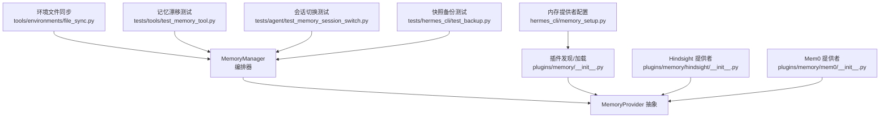
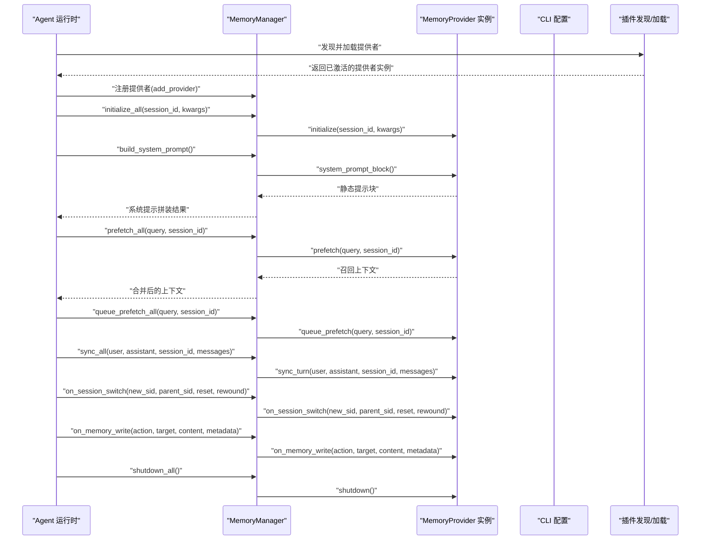
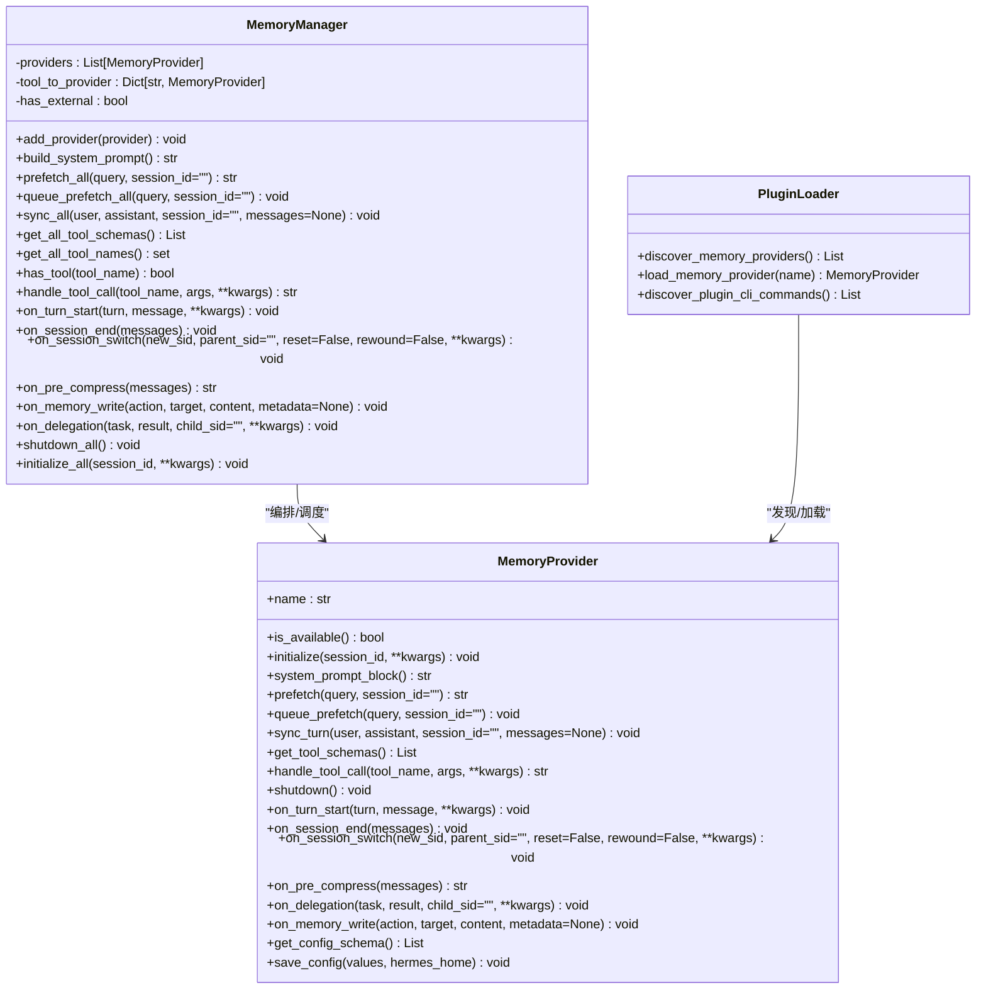
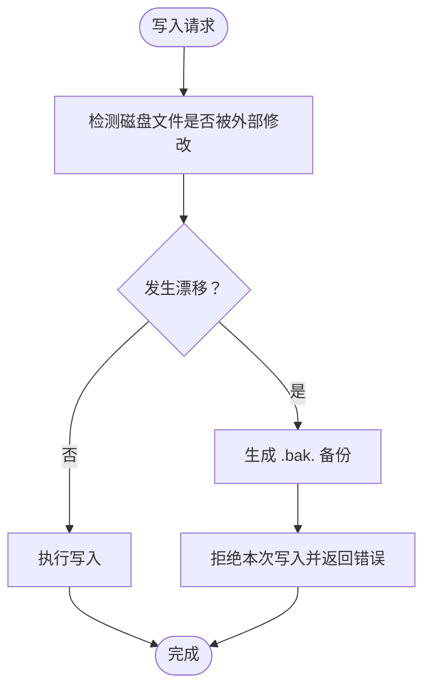
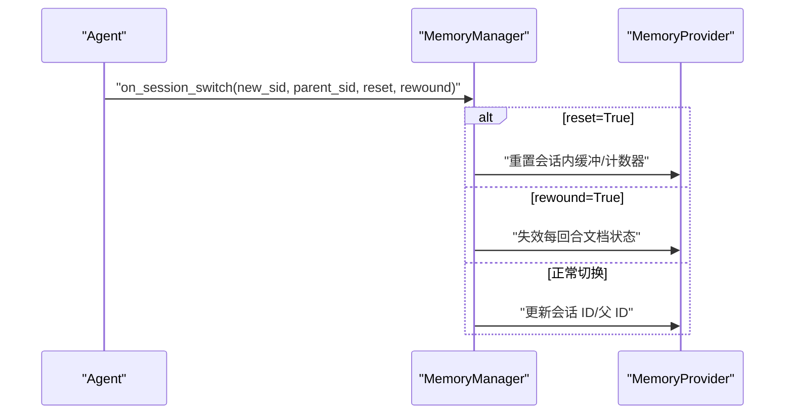

# 记忆生命周期管理

<cite>
**本文档引用的文件**
- [agent/memory_manager.py](file://agent/memory_manager.py)
- [agent/memory_provider.py](file://agent/memory_provider.py)
- [plugins/memory/__init__.py](file://plugins/memory/__init__.py)
- [hermes_cli/memory_setup.py](file://hermes_cli/memory_setup.py)
- [plugins/memory/hindsight/__init__.py](file://plugins/memory/hindsight/__init__.py)
- [plugins/memory/mem0/__init__.py](file://plugins/memory/mem0/__init__.py)
- [tools/environments/file_sync.py](file://tools/environments/file_sync.py)
- [tests/tools/test_memory_tool.py](file://tests/tools/test_memory_tool.py)
- [tests/agent/test_memory_session_switch.py](file://tests/agent/test_memory_session_switch.py)
- [tests/hermes_cli/test_backup.py](file://tests/hermes_cli/test_backup.py)
</cite>

## 目录
1. [引言](#引言)
2. [项目结构](#项目结构)
3. [核心组件](#核心组件)
4. [架构总览](#架构总览)
5. [详细组件分析](#详细组件分析)
6. [依赖关系分析](#依赖关系分析)
7. [性能考虑](#性能考虑)
8. [故障排除指南](#故障排除指南)
9. [结论](#结论)
10. [附录](#附录)

## 引言
本文件面向开发者与高级用户，系统化阐述 Hermes Agent 记忆生命周期管理系统的完整技术方案。内容覆盖从初始化、运行时管理、同步策略到关闭阶段的全链路设计；详解记忆提供者的启动流程、配置加载与状态维护；归纳增量/批量同步与冲突处理策略；给出备份与恢复机制（含数据完整性保障）；并提供性能优化与故障排除的实操建议。

## 项目结构
围绕记忆生命周期管理的关键模块分布如下：
- 核心抽象与编排：agent/memory_provider.py、agent/memory_manager.py
- 插件发现与加载：plugins/memory/__init__.py
- CLI 配置与安装：hermes_cli/memory_setup.py
- 具体提供者示例：plugins/memory/hindsight/__init__.py、plugins/memory/mem0/__init__.py
- 同步与一致性保障：tools/environments/file_sync.py
- 测试与回归：tests/tools/test_memory_tool.py、tests/agent/test_memory_session_switch.py、tests/hermes_cli/test_backup.py

图表来源
- [agent/memory_manager.py:1-654](file://agent/memory_manager.py#L1-L654)
- [agent/memory_provider.py:1-297](file://agent/memory_provider.py#L1-L297)
- [plugins/memory/__init__.py:1-451](file://plugins/memory/__init__.py#L1-L451)
- [hermes_cli/memory_setup.py:1-473](file://hermes_cli/memory_setup.py#L1-L473)
- [plugins/memory/hindsight/__init__.py:1-200](file://plugins/memory/hindsight/__init__.py#L1-L200)
- [plugins/memory/mem0/__init__.py:1-200](file://plugins/memory/mem0/__init__.py#L1-L200)
- [tools/environments/file_sync.py:245-338](file://tools/environments/file_sync.py#L245-L338)
- [tests/tools/test_memory_tool.py:468-558](file://tests/tools/test_memory_tool.py#L468-L558)
- [tests/agent/test_memory_session_switch.py:114-151](file://tests/agent/test_memory_session_switch.py#L114-L151)
- [tests/hermes_cli/test_backup.py:1270-1301](file://tests/hermes_cli/test_backup.py#L1270-L1301)

章节来源
- [agent/memory_manager.py:1-654](file://agent/memory_manager.py#L1-L654)
- [agent/memory_provider.py:1-297](file://agent/memory_provider.py#L1-L297)
- [plugins/memory/__init__.py:1-451](file://plugins/memory/__init__.py#L1-L451)
- [hermes_cli/memory_setup.py:1-473](file://hermes_cli/memory_setup.py#L1-L473)
- [plugins/memory/hindsight/__init__.py:1-200](file://plugins/memory/hindsight/__init__.py#L1-L200)
- [plugins/memory/mem0/__init__.py:1-200](file://plugins/memory/mem0/__init__.py#L1-L200)
- [tools/environments/file_sync.py:245-338](file://tools/environments/file_sync.py#L245-L338)
- [tests/tools/test_memory_tool.py:468-558](file://tests/tools/test_memory_tool.py#L468-L558)
- [tests/agent/test_memory_session_switch.py:114-151](file://tests/agent/test_memory_session_switch.py#L114-L151)
- [tests/hermes_cli/test_backup.py:1270-1301](file://tests/hermes_cli/test_backup.py#L1270-L1301)

## 核心组件
- MemoryProvider 抽象类：定义记忆提供者的核心生命周期钩子（可用性检查、初始化、系统提示块、预取、回合同步、工具模式、关闭等），以及可选钩子（回合开始、会话结束、会话切换、压缩前提取、委托观察、内存写入镜像等）。
- MemoryManager 编排器：统一注册与调度多个提供者，负责系统提示拼装、预取合并、回合同步、工具路由、会话切换通知、内存写入镜像、关闭清理等。
- 插件发现与加载：扫描内置与用户插件目录，解析 plugin.yaml，支持 register(ctx)/register_memory_provider 两种注册方式，按名称加载具体提供者实例。
- CLI 配置：交互式选择提供者、安装依赖、读取/保存配置、写入 .env 等，确保激活的提供者可被加载与初始化。

章节来源
- [agent/memory_provider.py:42-297](file://agent/memory_provider.py#L42-L297)
- [agent/memory_manager.py:244-654](file://agent/memory_manager.py#L244-L654)
- [plugins/memory/__init__.py:145-451](file://plugins/memory/__init__.py#L145-L451)
- [hermes_cli/memory_setup.py:226-473](file://hermes_cli/memory_setup.py#L226-L473)

## 架构总览
下图展示记忆生命周期在运行期的调用序列与关键事件：

图表来源
- [agent/memory_manager.py:318-654](file://agent/memory_manager.py#L318-L654)
- [agent/memory_provider.py:84-297](file://agent/memory_provider.py#L84-L297)
- [plugins/memory/__init__.py:183-206](file://plugins/memory/__init__.py#L183-L206)
- [hermes_cli/memory_setup.py:226-473](file://hermes_cli/memory_setup.py#L226-L473)

## 详细组件分析

### MemoryProvider 抽象与生命周期钩子
- 必需钩子：is_available、initialize、get_tool_schemas、handle_tool_call（若提供工具）
- 可选钩子：system_prompt_block、prefetch、queue_prefetch、sync_turn、on_turn_start、on_session_end、on_session_switch、on_pre_compress、on_delegation、on_memory_write、get_config_schema、save_config
- 设计要点：
  - initialize 接收 hermes_home、platform、agent_context 等上下文参数，便于提供者进行资源初始化与路径解析。
  - on_session_switch 支持 reset/rewound 参数，用于区分全新对话、分支/重开与压缩回滚等场景。
  - on_memory_write 提供外部写入镜像能力，便于第三方提供者保持一致状态。

章节来源
- [agent/memory_provider.py:42-297](file://agent/memory_provider.py#L42-L297)

### MemoryManager 编排器
- 注册与路由：add_provider 限制仅一个非内置提供者；构建 tool_name → provider 的索引以实现工具分发。
- 系统提示：build_system_prompt 汇聚各提供者的静态提示块。
- 预取与队列：prefetch_all 合并多提供者的召回文本；queue_prefetch_all 为下次回合准备背景召回。
- 同步：sync_all 统一调用 sync_turn，自动检测 provider 是否接受 messages 关键字参数。
- 会话切换：on_session_switch 将新会话 ID、父会话 ID、reset/rewound 等信息广播给所有提供者。
- 写入镜像：on_memory_write 跳过内置提供者，向外部提供者广播 built-in 写入事件。
- 关闭：shutdown_all 逆序调用 shutdown，确保资源有序释放。
- 初始化：initialize_all 自动注入 hermes_home，避免提供者直接导入常量模块。

章节来源
- [agent/memory_manager.py:244-654](file://agent/memory_manager.py#L244-L654)

### 插件发现与加载（plugins/memory）
- 目录扫描：先内置 plugins/memory/<name>/，后用户 $HERMES_HOME/plugins/<name>/，内置优先。
- 加载策略：优先调用 register(ctx) 获取 provider；否则查找 MemoryProvider 子类并实例化。
- CLI 命令：仅对当前激活的提供者加载其 cli.py 中的命令，避免无关插件干扰。
- 配置 schema：通过 provider.get_config_schema()/save_config() 与 hermes_cli/memory_setup.py 协作完成交互式配置与 .env 写入。

章节来源
- [plugins/memory/__init__.py:145-451](file://plugins/memory/__init__.py#L145-L451)

### CLI 配置与安装（hermes_cli/memory_setup）
- 依赖安装：根据 plugin.yaml 的 pip_dependencies/external_dependencies 自动安装或提示手动安装。
- 交互式配置：逐项读取字段（支持 choices、默认值、条件 when、secret 等），写入 config.yaml 与 .env。
- 状态查询：cmd_status 展示当前激活提供者、插件安装状态、必要环境变量是否就绪。
- 后置设置：部分提供者可实现 post_setup，由其自行处理连接测试与激活。

章节来源
- [hermes_cli/memory_setup.py:226-473](file://hermes_cli/memory_setup.py#L226-L473)

### 具体提供者示例

#### Hindsight 提供者
- 特性：知识图谱、实体消解、多策略检索；支持 cloud/local 模式；具备 API 版本探测与 update_mode='append' 能力缓存。
- 初始化：检查本地嵌入式运行时可用性；按 API 版本决定文档更新策略；线程池/事件循环复用以降低资源泄漏风险。
- 配置：通过环境变量或 $HERMES_HOME/hindsight/config.json；支持超时、空闲超时、预算等级、保留标签/来源等。

章节来源
- [plugins/memory/hindsight/__init__.py:1-200](file://plugins/memory/hindsight/__init__.py#L1-L200)

#### Mem0 提供者
- 特性：服务端事实抽取、重排序语义检索、自动去重；带熔断器（连续失败触发冷却）。
- 初始化：惰性客户端创建；线程安全访问；支持 rerank/keyword_search 等召回策略。
- 配置：MEM0_API_KEY/MEM0_USER_ID/MEM0_AGENT_ID；支持 $HERMES_HOME/mem0.json 覆盖。

章节来源
- [plugins/memory/mem0/__init__.py:1-200](file://plugins/memory/mem0/__init__.py#L1-L200)

### 同步策略与冲突解决

#### 增量同步
- 回合级异步写入：sync_turn 在每轮结束后调用，适合低延迟、高吞吐的增量持久化。
- 并发控制：提供者内部应采用队列/锁等机制，避免并发写入导致的顺序错乱。

章节来源
- [agent/memory_manager.py:383-412](file://agent/memory_manager.py#L383-L412)

#### 批量同步
- 环境文件同步：tools/environments/file_sync.py 提供批量下载、差异计算与应用的通用框架，包含重试、SIGINT 保护、文件锁串行化等。
- 安全边界：对 tar 包大小进行上限校验，防止异常膨胀；在主/工作线程中分别处理信号与锁，避免竞态。

章节来源
- [tools/environments/file_sync.py:245-338](file://tools/environments/file_sync.py#L245-L338)

#### 冲突解决
- 会话切换：on_session_switch(new_sid, parent_sid, reset, rewound) 明确区分“全新对话”“分支/重开”“压缩回滚”，提供者据此刷新会话内状态。
- 写入镜像：on_memory_write 将 built-in 写入广播至外部提供者，配合各自幂等/去重策略减少冲突。

章节来源
- [agent/memory_manager.py:488-535](file://agent/memory_manager.py#L488-L535)
- [agent/memory_manager.py:581-610](file://agent/memory_manager.py#L581-L610)

### 备份与恢复机制

#### 数据完整性保障
- 记忆漂移防护：当检测到磁盘文件被外部修改（漂移）时，拒绝危险操作并生成 .bak.<timestamp> 备份，同时输出明确的修复指引。
- 会话切换隔离：空字符串/None 的 session_id 不触发 provider 钩子，避免关闭阶段误触发。
- 快照备份：CLI 快速快照可恢复配对/平台等关键文件，即使原始文件丢失也能恢复。

章节来源
- [tests/tools/test_memory_tool.py:468-558](file://tests/tools/test_memory_tool.py#L468-L558)
- [tests/agent/test_memory_session_switch.py:114-151](file://tests/agent/test_memory_session_switch.py#L114-L151)
- [tests/hermes_cli/test_backup.py:1270-1301](file://tests/hermes_cli/test_backup.py#L1270-L1301)

#### 恢复策略
- 漂移恢复：基于 .bak 文件回滚到最近一次一致状态；错误消息包含定位与修复步骤。
- 快照恢复：针对关键配置文件的快速快照，支持灾难恢复场景。

章节来源
- [tests/tools/test_memory_tool.py:510-558](file://tests/tools/test_memory_tool.py#L510-L558)
- [tests/hermes_cli/test_backup.py:1270-1301](file://tests/hermes_cli/test_backup.py#L1270-L1301)

## 依赖关系分析

图表来源
- [agent/memory_provider.py:42-297](file://agent/memory_provider.py#L42-L297)
- [agent/memory_manager.py:244-654](file://agent/memory_manager.py#L244-L654)
- [plugins/memory/__init__.py:145-451](file://plugins/memory/__init__.py#L145-L451)

章节来源
- [agent/memory_provider.py:42-297](file://agent/memory_provider.py#L42-L297)
- [agent/memory_manager.py:244-654](file://agent/memory_manager.py#L244-L654)
- [plugins/memory/__init__.py:145-451](file://plugins/memory/__init__.py#L145-L451)

## 性能考虑
- 预取与后台线程：提供者应在 prefetch 中返回缓存结果，实际召回通过后台线程/协程完成，避免阻塞主线程。
- 事件循环与线程池：如 Hindsight 使用专用事件循环与线程池，减少 aiohttp 会话泄漏与上下文切换开销。
- 熔断与退避：Mem0 提供电路 breaker，在连续失败后进入冷却，降低对下游服务的压力。
- 批量同步与锁竞争：环境文件同步采用文件锁串行化，配合指数退避与 SIGINT 保护，提升稳定性。
- 配置与路径：MemoryManager.initialize_all 自动注入 hermes_home，避免重复 IO 与路径解析成本。

章节来源
- [plugins/memory/hindsight/__init__.py:196-200](file://plugins/memory/hindsight/__init__.py#L196-L200)
- [plugins/memory/mem0/__init__.py:181-200](file://plugins/memory/mem0/__init__.py#L181-L200)
- [tools/environments/file_sync.py:245-338](file://tools/environments/file_sync.py#L245-L338)
- [agent/memory_manager.py:636-654](file://agent/memory_manager.py#L636-L654)

## 故障排除指南
- 提供者未加载或不可用
  - 检查 config.yaml 中 memory.provider 是否正确；确认插件目录存在且包含有效 __init__.py。
  - 使用 hermes memory status 查看插件安装与可用性状态。
- 配置缺失或不完整
  - 使用 hermes memory setup 交互式配置；注意 secret 字段写入 .env，非 secret 字段写入 provider 原生配置位置。
- 记忆漂移与写入失败
  - 当出现“拒绝危险操作”与 .bak 文件时，按错误提示回滚 .bak 到原文件，再重新尝试。
- 会话切换异常
  - 确保传入的 new_session_id 非空；空字符串/None 不会触发 provider 钩子。
- 快照恢复
  - 若关键配置文件丢失，使用快照恢复功能重建。

章节来源
- [hermes_cli/memory_setup.py:398-473](file://hermes_cli/memory_setup.py#L398-L473)
- [tests/tools/test_memory_tool.py:468-558](file://tests/tools/test_memory_tool.py#L468-L558)
- [tests/agent/test_memory_session_switch.py:114-151](file://tests/agent/test_memory_session_switch.py#L114-L151)
- [tests/hermes_cli/test_backup.py:1270-1301](file://tests/hermes_cli/test_backup.py#L1270-L1301)

## 结论
Hermes Agent 的记忆生命周期管理以 MemoryProvider 抽象为核心，通过 MemoryManager 实现统一编排与容错隔离；借助插件体系实现可插拔的记忆后端；结合增量/批量同步策略与漂移防护、会话切换钩子、写入镜像与快照恢复机制，形成从初始化到关闭的完整闭环。开发者可在此基础上扩展新的提供者，或针对特定场景优化同步与一致性策略。

## 附录
- 关键流程图（算法/流程）
  - 记忆漂移防护流程

图表来源
- [tests/tools/test_memory_tool.py:468-558](file://tests/tools/test_memory_tool.py#L468-L558)

- 会话切换事件流

图表来源
- [agent/memory_manager.py:488-535](file://agent/memory_manager.py#L488-L535)