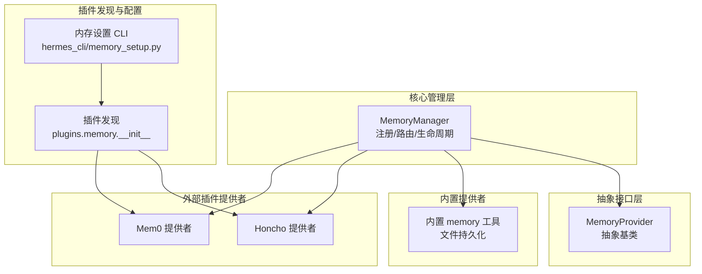
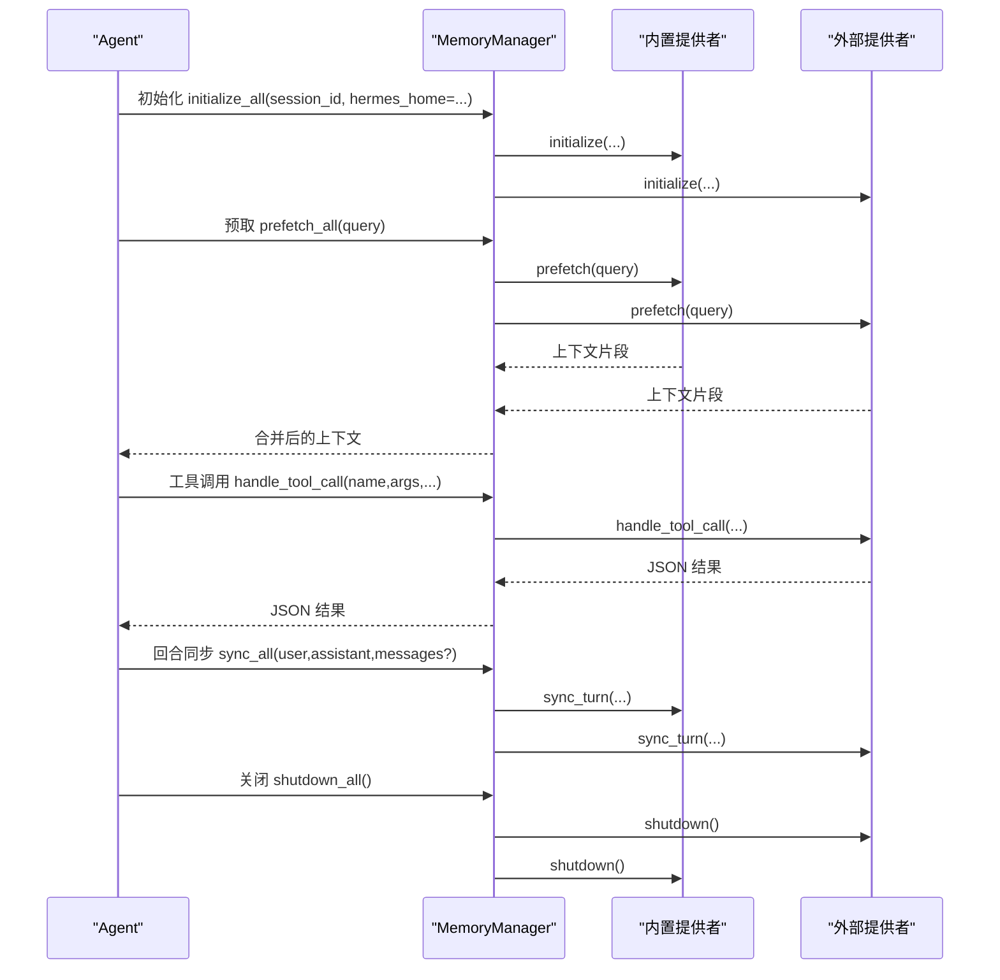
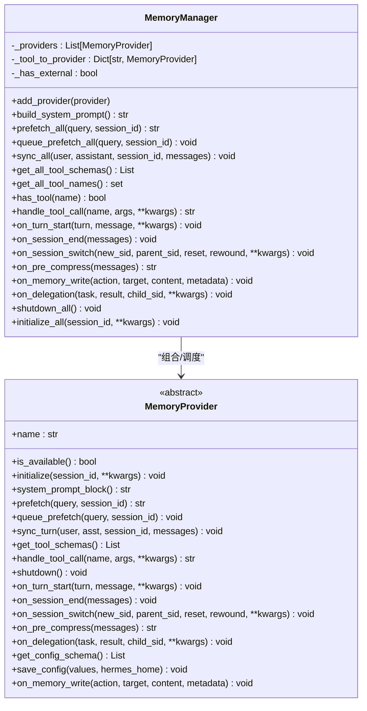
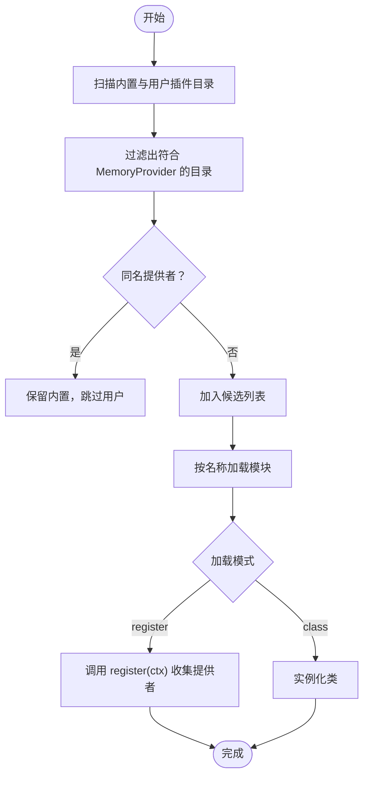
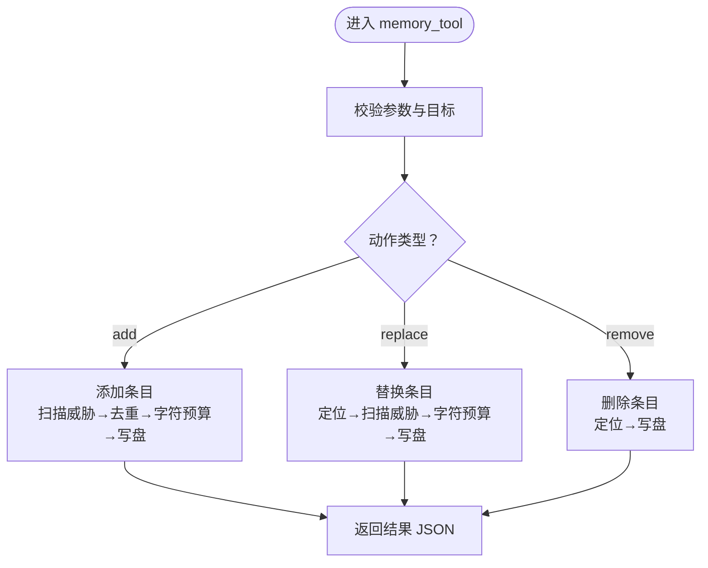
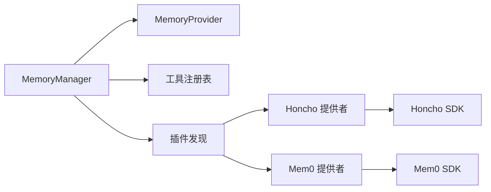

# 记忆系统

<cite>
**本文引用的文件**
- [agent/memory_manager.py](file://agent/memory_manager.py)
- [agent/memory_provider.py](file://agent/memory_provider.py)
- [plugins/memory/__init__.py](file://plugins/memory/__init__.py)
- [hermes_cli/memory_setup.py](file://hermes_cli/memory_setup.py)
- [plugins/memory/honcho/__init__.py](file://plugins/memory/honcho/__init__.py)
- [plugins/memory/mem0/__init__.py](file://plugins/memory/mem0/__init__.py)
- [tools/memory_tool.py](file://tools/memory_tool.py)
- [tests/tools/test_memory_tool_schema.py](file://tests/tools/test_memory_tool_schema.py)
- [tests/run_agent/test_memory_sync_interrupted.py](file://tests/run_agent/test_memory_sync_interrupted.py)
- [tests/acp/test_plugins.py](file://tests/acp/test_plugins.py)
</cite>

## 目录
1. [简介](#简介)
2. [项目结构](#项目结构)
3. [核心组件](#核心组件)
4. [架构总览](#架构总览)
5. [详细组件分析](#详细组件分析)
6. [依赖关系分析](#依赖关系分析)
7. [性能考量](#性能考量)
8. [故障排除指南](#故障排除指南)
9. [结论](#结论)
10. [附录](#附录)

## 简介
本文件面向开发者与集成工程师，系统化阐述 Hermes Agent 记忆系统的整体设计与实现细节，重点覆盖以下主题：
- MemoryManager 的架构与职责边界：统一编排内置与外部记忆提供者，协调工具路由、上下文注入、生命周期钩子与同步写入。
- 记忆提供者的注册机制与冲突检测：内置提供者优先级、外部提供者单实例限制、工具名冲突处理策略。
- 内置与外部提供者的协作模式：如何在“自动上下文注入”和“显式工具调用”之间平衡；如何通过 on_memory_write 将内置写入镜像到外部后端。
- 生命周期管理：初始化、预取、回合同步、会话切换、压缩前提取、委托观察、关闭等关键阶段的行为与容错。
- 记忆工具的 Schema 定义、参数校验与错误处理：内置 memory 工具的严格输入校验、威胁扫描与并发安全。
- 扩展开发指南：如何实现新的 MemoryProvider 插件、配置项设计与最佳实践。
- 故障排除：常见问题定位、日志与告警、回退策略与恢复路径。

## 项目结构
记忆系统由三部分组成：
- 核心管理层：MemoryManager 负责注册、调度、路由与生命周期协调。
- 抽象接口层：MemoryProvider 定义提供者必须实现的生命周期与可选钩子。
- 提供者实现层：内置提供者（本地文件）与外部插件提供者（如 Honcho、Mem0 等），通过插件发现与加载机制接入。

图示来源
- [agent/memory_manager.py:244-654](file://agent/memory_manager.py#L244-L654)
- [agent/memory_provider.py:42-297](file://agent/memory_provider.py#L42-L297)
- [plugins/memory/__init__.py:146-451](file://plugins/memory/__init__.py#L146-L451)
- [hermes_cli/memory_setup.py:226-473](file://hermes_cli/memory_setup.py#L226-L473)
- [plugins/memory/honcho/__init__.py:191-800](file://plugins/memory/honcho/__init__.py#L191-L800)
- [plugins/memory/mem0/__init__.py:119-375](file://plugins/memory/mem0/__init__.py#L119-L375)
- [tools/memory_tool.py:602-724](file://tools/memory_tool.py#L602-L724)

章节来源
- [agent/memory_manager.py:1-654](file://agent/memory_manager.py#L1-L654)
- [agent/memory_provider.py:1-297](file://agent/memory_provider.py#L1-L297)
- [plugins/memory/__init__.py:1-451](file://plugins/memory/__init__.py#L1-L451)
- [hermes_cli/memory_setup.py:1-473](file://hermes_cli/memory_setup.py#L1-L473)
- [plugins/memory/honcho/__init__.py:1-800](file://plugins/memory/honcho/__init__.py#L1-L800)
- [plugins/memory/mem0/__init__.py:1-375](file://plugins/memory/mem0/__init__.py#L1-L375)
- [tools/memory_tool.py:1-724](file://tools/memory_tool.py#L1-L724)

## 核心组件
- MemoryManager：统一编排所有已注册的记忆提供者，负责：
  - 注册与索引：按“内置优先、外部唯一”的规则登记提供者，并建立工具名到提供者的路由映射。
  - 上下文与工具：收集系统提示块、合并预取上下文、路由工具调用、触发同步写入。
  - 生命周期：初始化、预取队列、回合同步、会话切换、压缩前提取、委托观察、关闭。
  - 容错：对单个提供者的异常进行隔离，避免阻塞其他提供者。
- MemoryProvider：抽象基类，定义提供者必须实现的生命周期方法与可选钩子，确保统一的扩展点。
- 内置提供者（文件型）：基于本地文件的轻量持久化，支持两套存储（MEMORY.md、USER.md），采用冻结快照注入系统提示，运行时变更即时落盘但不改变当前会话快照。
- 外部插件提供者：通过插件发现机制加载，如 Honcho（AI 原生用户建模与对话）、Mem0（平台检索与去重）等，支持工具调用与服务端抽取。

章节来源
- [agent/memory_manager.py:244-654](file://agent/memory_manager.py#L244-L654)
- [agent/memory_provider.py:42-297](file://agent/memory_provider.py#L42-L297)
- [tools/memory_tool.py:113-724](file://tools/memory_tool.py#L113-L724)
- [plugins/memory/honcho/__init__.py:191-800](file://plugins/memory/honcho/__init__.py#L191-L800)
- [plugins/memory/mem0/__init__.py:119-375](file://plugins/memory/mem0/__init__.py#L119-L375)

## 架构总览
MemoryManager 作为单一集成点，串联内置与外部提供者，形成“统一入口 + 分层职责”的架构：
- 注册阶段：add_provider 按规则登记，构建工具名索引；若已有外部提供者再次注册则拒绝并告警。
- 预取阶段：prefetch_all 合并各提供者的上下文，queue_prefetch_all 预热下一轮。
- 回合同步：sync_all 在每轮结束后异步写入，兼容带/不带 messages 参数的签名。
- 工具路由：handle_tool_call 基于工具名路由至对应提供者，未匹配返回统一错误。
- 生命周期：initialize_all 注入 hermes_home 等上下文；on_* 系列钩子贯穿会话周期；shutdown_all 逆序关闭。
- 内置镜像：on_memory_write 将内置 memory 工具的写入事件广播给外部提供者（除内置自身外）。

图示来源
- [agent/memory_manager.py:318-412](file://agent/memory_manager.py#L318-L412)
- [agent/memory_manager.py:441-460](file://agent/memory_manager.py#L441-L460)
- [agent/memory_manager.py:625-654](file://agent/memory_manager.py#L625-L654)

## 详细组件分析

### MemoryManager 设计与实现
- 注册与路由
  - add_provider：内置提供者无条件接受；非内置提供者仅允许一个实例，重复注册会记录警告并忽略。
  - 工具名索引：遍历提供者的工具 Schema，建立 name→provider 映射；遇到重复工具名记录告警并跳过。
- 上下文与系统提示
  - build_system_prompt：收集各提供者的静态提示块并拼接。
  - prefetch_all/queue_prefetch_all：分别执行一次性预取与后台预取，失败不阻塞。
- 回合同步与消息签名适配
  - sync_all：动态探测 provider.sync_turn 是否接受 messages 关键字参数，兼容旧版签名。
- 工具路由与错误处理
  - handle_tool_call：找不到提供者返回统一错误；捕获异常并记录错误日志。
- 生命周期钩子
  - on_turn_start/on_session_end/on_session_switch/on_pre_compress/on_delegation：逐个提供者调用，失败记录调试日志。
  - on_memory_write：除内置外广播写入事件，按提供者签名选择关键字或位置参数传递 metadata。
  - shutdown_all/initialize_all：逆序关闭与注入 hermes_home 后初始化。
- 上下文清洗与流式 Scrubber
  - sanitize_context/build_memory_context_block：剥离内部标签与系统注释，保证注入内容安全。
  - StreamingContextScrubber：跨分片流式清洗，避免标签被截断导致泄漏。

图示来源
- [agent/memory_manager.py:244-654](file://agent/memory_manager.py#L244-L654)
- [agent/memory_provider.py:42-297](file://agent/memory_provider.py#L42-L297)

章节来源
- [agent/memory_manager.py:244-654](file://agent/memory_manager.py#L244-L654)
- [agent/memory_provider.py:42-297](file://agent/memory_provider.py#L42-L297)

### MemoryProvider 抽象基类
- 必需接口
  - name/is_available/initialize/system_prompt_block/prefetch/queue_prefetch/sync_turn/get_tool_schemas/handle_tool_call/shutdown。
- 可选钩子
  - on_turn_start/on_session_end/on_session_switch/on_pre_compress/on_delegation/on_memory_write/get_config_schema/save_config。
- 配置与安装
  - get_config_schema/save_config 用于 CLI 配置向导与环境变量映射。
  - is_available 用于快速可用性检查，避免网络调用。

章节来源
- [agent/memory_provider.py:42-297](file://agent/memory_provider.py#L42-L297)

### 插件发现与加载（plugins.memory）
- 发现范围：内置 plugins/memory/<name>/ 与用户目录 $HERMES_HOME/plugins/<name>/。
- 加载策略：先内置后用户，同名以内置为准；支持 register(ctx) 与直接类实例两种加载方式。
- CLI 命令：仅对当前激活的外部提供者暴露 CLI 子命令，避免多提供者冲突。
- 排他性：用户安装的内存插件会被识别为“独占型”，由 MemoryManager 统一加载而非通用插件管理器导入。

图示来源
- [plugins/memory/__init__.py:90-206](file://plugins/memory/__init__.py#L90-L206)
- [plugins/memory/__init__.py:319-337](file://plugins/memory/__init__.py#L319-L337)
- [tests/acp/test_plugins.py:473-517](file://tests/acp/test_plugins.py#L473-L517)

章节来源
- [plugins/memory/__init__.py:1-451](file://plugins/memory/__init__.py#L1-L451)
- [tests/acp/test_plugins.py:473-517](file://tests/acp/test_plugins.py#L473-L517)

### 内置记忆工具（tools/memory_tool）
- 存储模型
  - 两份文件：MEMORY.md（个人笔记）、USER.md（用户画像），使用“§”作为条目分隔符。
  - 冻结快照：系统提示注入时使用首次加载的快照，运行时变更即时落盘但不影响当前会话快照。
- 并发与一致性
  - 文件锁与原子替换：读取无需锁，写入通过临时文件+原子替换，避免竞态与部分写入。
  - 外部漂移检测：若磁盘内容无法与工具格式完全往返，拒绝写入并生成 .bak 快照，指导修复。
- 行为与限制
  - 字符上限：两份存储分别有字符上限，超限拒绝新增或替换。
  - 威胁扫描：写入前扫描潜在注入/窃取模式，命中即拒绝。
  - 去重：加载时去重，保持顺序稳定。
- 工具 Schema
  - 单一工具 memory，动作：add、replace、remove；目标：memory、user。
  - 顶层禁止 allOf/anyOf/oneOf/enum/not，避免严格后端拒绝；具体必填字段在运行时校验。

图示来源
- [tools/memory_tool.py:602-724](file://tools/memory_tool.py#L602-L724)
- [tests/tools/test_memory_tool_schema.py:28-49](file://tests/tools/test_memory_tool_schema.py#L28-L49)

章节来源
- [tools/memory_tool.py:113-724](file://tools/memory_tool.py#L113-L724)
- [tests/tools/test_memory_tool_schema.py:1-49](file://tests/tools/test_memory_tool_schema.py#L1-L49)

### 外部提供者示例：Honcho
- 模式与成本控制
  - recall_mode：context（仅自动注入）、tools（仅工具）、hybrid（两者结合）。
  - 成本感知：注入频率、上下文刷新节律、对话深度与级别上限、首次注入超时。
- 初始化与懒加载
  - 支持 cron guard 与工具优先模式下的懒初始化；后台线程预热上下文与对话补充。
- 工具与 Schema
  - 提供 profile/search/reasoning/context/conclude 等工具 Schema。
- 预取与同步
  - prefetch：按 cadence 刷新基础上下文与对话补充；首回合带超时保护。
  - sync_turn：异步写入对话历史，避免阻塞主流程。

章节来源
- [plugins/memory/honcho/__init__.py:191-800](file://plugins/memory/honcho/__init__.py#L191-L800)

### 外部提供者示例：Mem0
- 配置与客户端
  - 通过环境变量或 $HERMES_HOME/mem0.json 配置；线程安全懒加载客户端。
  - 电路断路器：连续失败超过阈值后冷却一段时间，避免雪崩。
- 工具与 Schema
  - profile/search/conclude 工具；search 支持 rerank 与 top_k。
- 预取与同步
  - prefetch：后台搜索并缓存结果；首回合消费缓存。
  - sync_turn：异步提交对话，服务端抽取事实并去重。

章节来源
- [plugins/memory/mem0/__init__.py:119-375](file://plugins/memory/mem0/__init__.py#L119-L375)

### 记忆提供者注册机制与冲突检测
- 冲突检测
  - 外部提供者仅允许一个实例；重复注册会记录警告并忽略新提供者。
  - 工具名冲突：若多个提供者声明相同工具名，后者被忽略并记录告警。
- 工具路由
  - 通过 _tool_to_provider 映射进行精确路由；handle_tool_call 未命中返回统一错误。

章节来源
- [agent/memory_manager.py:258-302](file://agent/memory_manager.py#L258-L302)
- [agent/memory_manager.py:441-460](file://agent/memory_manager.py#L441-L460)

### 生命周期管理
- 初始化：initialize_all 自动注入 hermes_home，逐个提供者初始化。
- 预取：prefetch_all 合并上下文；queue_prefetch_all 触发后台预取。
- 回合同步：sync_all 兼容不同签名，逐个提供者异步写入。
- 会话切换：on_session_switch 通知提供者更新会话标识与父会话关系。
- 压缩前提取：on_pre_compress 收集压缩摘要所需的洞察文本。
- 委托观察：on_delegation 记录子代理任务与结果。
- 关闭：shutdown_all 逆序关闭，避免资源泄漏。

章节来源
- [agent/memory_manager.py:318-654](file://agent/memory_manager.py#L318-L654)

### 内置与外部提供者的协作模式
- 内置提供者（文件）始终激活，提供冻结快照与即时落盘能力。
- 外部提供者（如 Honcho/Mem0）通过 MemoryManager 注册，遵循“内置优先、外部唯一”原则。
- 写入镜像：内置 memory 工具写入后，MemoryManager 通过 on_memory_write 广播事件（除内置自身外），使外部提供者同步持久化。

章节来源
- [agent/memory_manager.py:581-610](file://agent/memory_manager.py#L581-L610)
- [tools/memory_tool.py:602-724](file://tools/memory_tool.py#L602-L724)

## 依赖关系分析
- 组件耦合
  - MemoryManager 与 MemoryProvider：组合关系，通过统一接口解耦具体实现。
  - MemoryManager 与工具注册表：通过工具 Schema 与路由实现松耦合。
- 外部依赖
  - 插件发现依赖 hermes_cli.config 与 pathlib；外部提供者依赖各自 SDK。
- 循环依赖
  - 未见循环导入；插件发现与 CLI 设置相互独立。

图示来源
- [agent/memory_manager.py:244-654](file://agent/memory_manager.py#L244-L654)
- [plugins/memory/__init__.py:146-451](file://plugins/memory/__init__.py#L146-L451)
- [plugins/memory/honcho/__init__.py:191-800](file://plugins/memory/honcho/__init__.py#L191-L800)
- [plugins/memory/mem0/__init__.py:119-375](file://plugins/memory/mem0/__init__.py#L119-L375)

章节来源
- [agent/memory_manager.py:244-654](file://agent/memory_manager.py#L244-L654)
- [plugins/memory/__init__.py:146-451](file://plugins/memory/__init__.py#L146-L451)

## 性能考量
- 异步与后台线程
  - 外部提供者普遍采用后台线程执行预取与同步，避免阻塞主响应。
- 节流与超时
  - 首回合注入超时、对话补充冷却、电路断路器等策略降低后端压力。
- 字符预算与截断
  - 外部提供者对注入内容进行字符预算估算与截断，避免超出上下文限制。
- 并发安全
  - 内置提供者使用文件锁与原子替换，减少竞态风险；外部提供者应自行保证线程安全。

## 故障排除指南
- 外部提供者重复注册
  - 现象：新增外部提供者被拒绝并记录警告。
  - 处理：检查配置项 memory.provider，确保只启用一个外部提供者。
- 工具名冲突
  - 现象：某工具被忽略并记录告警。
  - 处理：调整提供者工具名或禁用冲突提供者。
- 回合同步中断
  - 现象：预取线程异常不应阻塞 sync_all。
  - 处理：测试覆盖了中断场景，确保 sync_all 仍被执行。
- 内置写入镜像失败
  - 现象：外部提供者 on_memory_write 抛错被记录为调试日志。
  - 处理：检查外部提供者实现与签名兼容性。
- 内置文件写入失败
  - 现象：磁盘写入异常或外部漂移导致拒绝写入。
  - 处理：查看 .bak 快照，按提示修复文件格式后重试。

章节来源
- [tests/run_agent/test_memory_sync_interrupted.py:196-226](file://tests/run_agent/test_memory_sync_interrupted.py#L196-L226)
- [agent/memory_manager.py:383-412](file://agent/memory_manager.py#L383-L412)
- [tools/memory_tool.py:515-569](file://tools/memory_tool.py#L515-L569)

## 结论
Hermes 记忆系统通过 MemoryManager 实现“统一入口 + 分层职责”的清晰架构，既保障内置提供者的稳定性与一致性，又为外部提供者提供了标准化扩展点。其冲突检测、工具路由、生命周期钩子与容错设计，使得系统在复杂场景下仍能保持高可用与可维护性。对于开发者而言，遵循 MemoryProvider 接口与配置约定，即可快速集成新的外部记忆后端，并通过 CLI 工具完成配置与状态检查。

## 附录

### 记忆工具 Schema 与参数校验要点
- 顶层禁止 allOf/anyOf/oneOf/enum/not，避免严格后端拒绝。
- 具体必填字段在运行时校验，返回可操作的错误信息。
- 内置 memory 工具支持 add/replace/remove 三种动作与 memory/user 两个目标。

章节来源
- [tests/tools/test_memory_tool_schema.py:28-49](file://tests/tools/test_memory_tool_schema.py#L28-L49)
- [tools/memory_tool.py:652-724](file://tools/memory_tool.py#L652-L724)

### 配置与 CLI 使用建议
- 通过 hermes memory setup 交互式配置外部提供者，自动安装依赖并写入 .env 与 config.yaml。
- 仅启用一个外部提供者，避免工具名冲突与资源竞争。
- 对于 Honcho/Mem0 等需要网络访问的提供者，合理设置成本控制参数（如注入频率、上下文刷新节律）。

章节来源
- [hermes_cli/memory_setup.py:226-473](file://hermes_cli/memory_setup.py#L226-L473)
- [plugins/memory/__init__.py:339-352](file://plugins/memory/__init__.py#L339-L352)