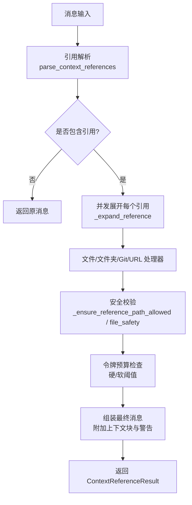
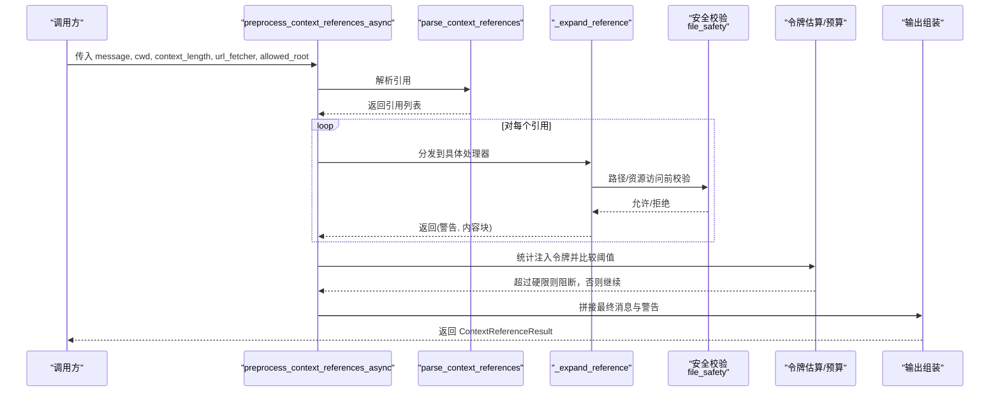
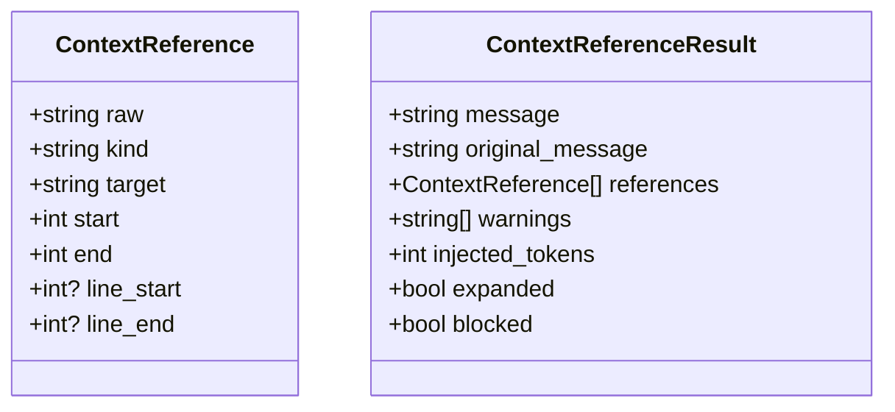
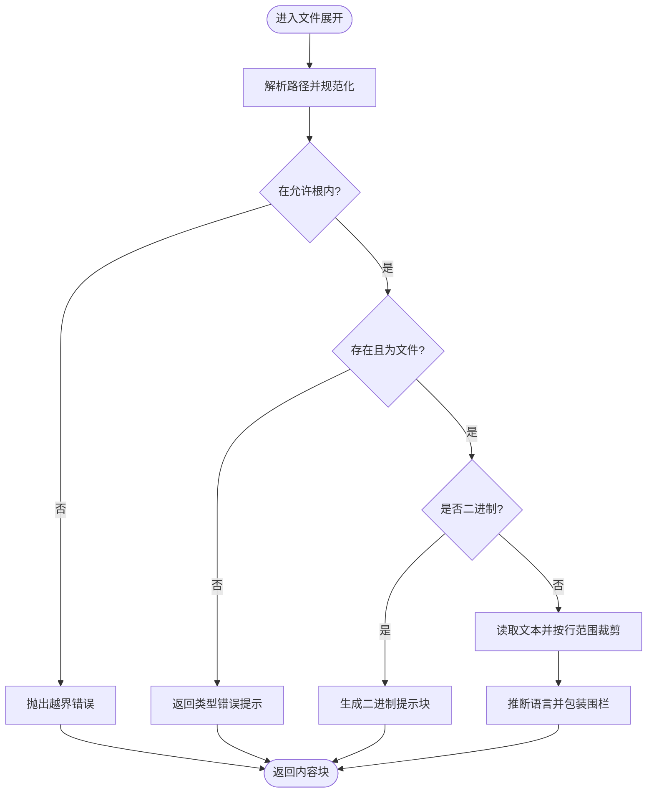
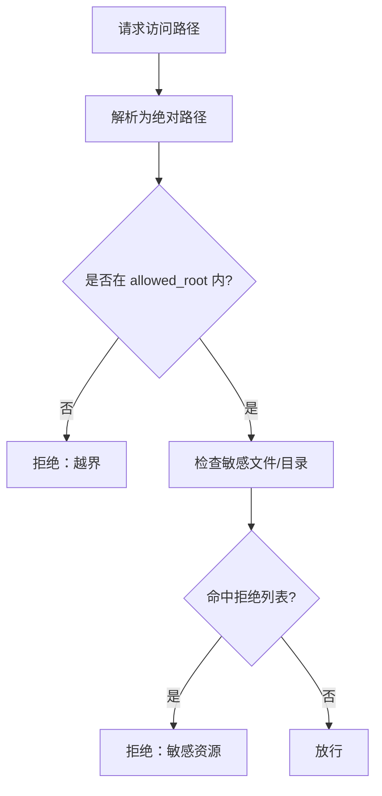
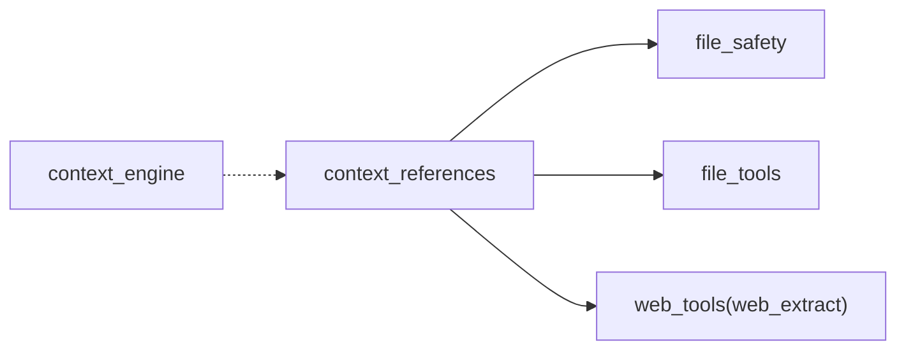

# 上下文引用管理

<cite>
**本文引用的文件**
- [agent/context_references.py](file://agent/context_references.py)
- [agent/file_safety.py](file://agent/file_safety.py)
- [tools/file_tools.py](file://tools/file_tools.py)
- [agent/context_engine.py](file://agent/context_engine.py)
</cite>

## 目录
1. [简介](#简介)
2. [项目结构](#项目结构)
3. [核心组件](#核心组件)
4. [架构总览](#架构总览)
5. [详细组件分析](#详细组件分析)
6. [依赖关系分析](#依赖关系分析)
7. [性能考量](#性能考量)
8. [故障排查指南](#故障排查指南)
9. [结论](#结论)
10. [附录](#附录)

## 简介
本文件系统性说明“上下文引用管理”的实现原理与使用方式，覆盖以下主题：
- 引用解析与展开机制：如何识别、校验并展开消息中的上下文引用。
- 动态加载与处理流程：文件、文件夹、Git 差异/日志、URL 等资源的读取与注入。
- 引用生命周期：注册（解析）、验证（安全与预算）、缓存（可选扩展点）、清理（会话边界）。
- 支持的引用格式：路径引用、代码片段行范围、Git diff/staged/log、URL 抓取。
- 安全验证：路径遍历防护、敏感资源拒绝、权限控制、沙箱镜像与跨配置区保护。
- 配置语法、错误处理策略与调试建议。
- 在技能、工具、对话中的实际用法与失效/更新场景处理。
- 自定义引用类型与扩展引用系统的开发指导。

## 项目结构
围绕“上下文引用”的核心实现集中在 agent 层，并与工具层的安全与读写能力协同：
- 解析与展开：agent/context_references.py
- 安全与读/写拒绝策略：agent/file_safety.py
- 文件工具与路径解析、设备/进程保护：tools/file_tools.py
- 上下文引擎接口（压缩/选择/观察）：agent/context_engine.py

**图示来源**
- [agent/context_references.py:80-236](file://agent/context_references.py#L80-L236)
- [agent/file_safety.py:194-337](file://agent/file_safety.py#L194-L337)

**章节来源**
- [agent/context_references.py:18-236](file://agent/context_references.py#L18-L236)
- [agent/file_safety.py:194-337](file://agent/file_safety.py#L194-L337)

## 核心组件
- 数据模型
  - ContextReference：描述一条引用（原始文本、类型、目标、位置、行范围）。
  - ContextReferenceResult：封装展开结果（最终消息、原始消息、引用列表、警告、注入令牌数、是否被阻断）。
- 解析器
  - parse_context_references：基于正则从消息中抽取所有 @... 引用，支持简单类型与带 kind:value 的引用，支持行范围。
- 预处理与展开
  - preprocess_context_references / preprocess_context_references_async：入口函数，负责并发展开、预算检查、组装最终消息。
  - _expand_reference：按类型分派到具体处理器。
- 资源处理器
  - 文件：读取文本或二进制提示；支持行范围裁剪与语言标记。
  - 文件夹：生成可见条目清单（优先 rg 加速）。
  - Git：执行 git diff/diff --staged/log 命令，限制超时。
  - URL：通过可插拔 url_fetcher 默认调用 web_extract_tool 获取内容。
- 安全与路径
  - _resolve_path：相对路径解析与 allowed_root 约束。
  - _ensure_reference_path_allowed：拒绝敏感文件/目录，并复用统一读拒绝策略。
- 工具与安全协同
  - tools/file_tools.py：提供路径解析、设备/进程保护、敏感写入拦截、工作区根锚定等。
  - agent/file_safety.py：统一的读拒绝策略（Hermes 内部缓存、凭据存储、项目 .env 等），以及跨配置区/沙箱镜像告警。

**章节来源**
- [agent/context_references.py:43-236](file://agent/context_references.py#L43-L236)
- [agent/context_references.py:269-370](file://agent/context_references.py#L269-L370)
- [agent/context_references.py:372-434](file://agent/context_references.py#L372-L434)
- [tools/file_tools.py:152-400](file://tools/file_tools.py#L152-L400)
- [agent/file_safety.py:194-337](file://agent/file_safety.py#L194-L337)

## 架构总览
下图展示一次完整的“上下文引用”处理流程，包括解析、并发展开、安全校验、预算控制与结果组装。

**图示来源**
- [agent/context_references.py:150-236](file://agent/context_references.py#L150-L236)
- [agent/context_references.py:239-370](file://agent/context_references.py#L239-L370)
- [agent/file_safety.py:194-337](file://agent/file_safety.py#L194-L337)

## 详细组件分析

### 引用解析与数据结构
- 支持格式
  - 简单引用：@diff、@staged（无 target）。
  - 结构化引用：@kind:value，其中 value 可为引用包裹或裸值，file 类型支持 :start 或 :start-end 行范围。
- 数据结构
  - ContextReference：raw、kind、target、start/end、line_start/line_end。
  - ContextReferenceResult：message、original_message、references、warnings、injected_tokens、expanded、blocked。

**图示来源**
- [agent/context_references.py:43-63](file://agent/context_references.py#L43-L63)

**章节来源**
- [agent/context_references.py:18-120](file://agent/context_references.py#L18-L120)
- [agent/context_references.py:43-63](file://agent/context_references.py#L43-L63)

### 文件引用展开
- 行为
  - 解析路径并解析为绝对路径，校验是否在 allowed_root 内。
  - 若为二进制文件，不直接内联文本，而是返回提示块，告知可用工具进行读取/转换/渲染。
  - 若指定行范围，仅截取对应行。
  - 自动推断代码语言用于围栏标注。
- 安全
  - 通过 _ensure_reference_path_allowed 拒绝敏感文件/目录，并复用 agent/file_safety 的统一读拒绝策略。

**图示来源**
- [agent/context_references.py:269-301](file://agent/context_references.py#L269-L301)
- [agent/context_references.py:372-434](file://agent/context_references.py#L372-L434)

**章节来源**
- [agent/context_references.py:269-301](file://agent/context_references.py#L269-L301)
- [agent/context_references.py:372-434](file://agent/context_references.py#L372-L434)

### 文件夹引用展开
- 行为
  - 列出可见条目，优先使用 ripgrep 快速枚举，限制条目数量。
  - 输出缩进树形结构，显示文件大小或行数信息。
- 安全
  - 同样进行路径允许性校验。

**章节来源**
- [agent/context_references.py:303-318](file://agent/context_references.py#L303-L318)
- [agent/context_references.py:491-556](file://agent/context_references.py#L491-L556)

### Git 引用展开
- 行为
  - @diff/@staged：执行 git diff / git diff --staged。
  - @git：执行 git log -N -p，N 由 target 决定，限制 1..10。
  - 设置超时与平台隐藏标志，捕获 stderr 并格式化输出。
- 安全
  - 在仓库目录下执行，避免任意路径执行风险。

**章节来源**
- [agent/context_references.py:320-346](file://agent/context_references.py#L320-L346)

### URL 引用展开
- 行为
  - 通过可插拔 url_fetcher 获取内容，默认调用 web_extract_tool 提取 Markdown 内容。
  - 若无内容，返回失败提示。
- 扩展点
  - 可通过传入自定义 url_fetcher 替换抓取逻辑（例如走代理、鉴权、缓存）。

**章节来源**
- [agent/context_references.py:348-370](file://agent/context_references.py#L348-L370)

### 安全与路径治理
- 路径解析与白名单根
  - _resolve_path：将相对路径基于 cwd 解析为绝对路径，并可强制限定在 allowed_root 下。
- 敏感资源拒绝
  - _ensure_reference_path_allowed：拒绝已知敏感文件/目录，并委托 agent/file_safety.get_read_block_error 做统一判断。
- 文件工具层保护
  - tools/file_tools.py：工作区根锚定、设备/进程路径阻止、敏感写入拦截、容器/沙箱镜像路径告警。
- 读拒绝策略
  - agent/file_safety.get_read_block_error：拒绝 Hermes 内部缓存、凭据存储、项目 .env 等。

**图示来源**
- [agent/context_references.py:372-434](file://agent/context_references.py#L372-L434)
- [agent/file_safety.py:194-337](file://agent/file_safety.py#L194-L337)
- [tools/file_tools.py:516-590](file://tools/file_tools.py#L516-L590)

**章节来源**
- [agent/context_references.py:372-434](file://agent/context_references.py#L372-L434)
- [agent/file_safety.py:194-337](file://agent/file_safety.py#L194-L337)
- [tools/file_tools.py:516-590](file://tools/file_tools.py#L516-L590)

### 令牌预算与上下文注入控制
- 预算策略
  - 计算注入内容的粗略令牌数，设置硬限（50%）与软限（25%）。
  - 超过硬限：阻断注入并返回 blocked=True。
  - 超过软限：保留注入但附带警告。
- 结果组装
  - 保留用户输入的 @ 引用标记，便于客户端渲染为内联芯片。
  - 附加“已附加上下文”与“上下文警告”区块。

**章节来源**
- [agent/context_references.py:178-236](file://agent/context_references.py#L178-L236)

### 上下文引擎集成
- 角色定位
  - 上下文引擎负责压缩、选择与观察，与引用展开互补：引用负责“按需注入”，引擎负责“整体预算与历史管理”。
- 关键钩子
  - should_compress / compress：触发压缩。
  - select_context：每轮请求前选择上下文。
  - on_turn_complete：回合结束后观察并索引。
  - get_tool_schemas / handle_tool_call：暴露引擎工具。
- 与引用系统协作
  - 可在 select_context 阶段结合引用展开结果进行更精细的上下文路由或过滤。

**章节来源**
- [agent/context_engine.py:89-279](file://agent/context_engine.py#L89-L279)
- [agent/context_engine.py:281-490](file://agent/context_engine.py#L281-L490)

## 依赖关系分析
- 模块耦合
  - context_references 依赖 file_safety 做读拒绝，依赖 tools.web_tools 做 URL 抓取。
  - file_tools 提供路径解析与工作区根锚定，保障相对路径不会误写到其他工作区。
  - context_engine 独立于引用系统，但在整体上下文管理中与之配合。
- 外部依赖
  - git、rg（可选）作为外部命令执行，具备超时与错误处理。
  - web_extract_tool 作为 URL 内容提取后端。

**图示来源**
- [agent/context_references.py:150-370](file://agent/context_references.py#L150-L370)
- [agent/file_safety.py:194-337](file://agent/file_safety.py#L194-L337)
- [tools/file_tools.py:152-400](file://tools/file_tools.py#L152-L400)
- [agent/context_engine.py:89-279](file://agent/context_engine.py#L89-L279)

**章节来源**
- [agent/context_references.py:150-370](file://agent/context_references.py#L150-L370)
- [agent/file_safety.py:194-337](file://agent/file_safety.py#L194-L337)
- [tools/file_tools.py:152-400](file://tools/file_tools.py#L152-L400)
- [agent/context_engine.py:89-279](file://agent/context_engine.py#L89-L279)

## 性能考量
- 并发展开：多个引用并行展开，避免串行网络 IO 导致的延迟。
- 外部命令超时：git 与 rg 均设置超时，防止阻塞。
- 令牌估算：使用粗略估算控制注入规模，避免超出模型上下文窗口。
- 目录枚举优化：优先使用 ripgrep 快速列举文件，限制条目上限。
- 二进制文件提示：避免大二进制文件内联导致上下文膨胀。

[本节为通用性能建议，无需特定文件来源]

## 故障排查指南
- 常见错误与原因
  - 路径越界：allowed_root 限制导致拒绝。
  - 敏感文件：命中 read deny-list 或敏感目录。
  - 二进制文件：无法内联文本，需改用工具读取/转换。
  - URL 抓取失败：web_extract 未返回内容。
  - Git 命令失败：仓库状态异常或命令超时。
- 诊断步骤
  - 查看返回的 warnings 与 blocked 标志。
  - 检查 resolved path 是否在 allowed_root 内。
  - 确认目标文件是否存在且可读。
  - 检查外部命令（git/rg）是否可用与超时。
  - 对于 URL，检查网络与抓取后端。
- 修复建议
  - 调整 allowed_root 以扩大工作区范围。
  - 避免引用敏感路径，改用受控工具访问。
  - 对二进制文件使用工具链进行转换或预览。
  - 确保仓库处于有效状态，必要时增加重试或降级策略。

**章节来源**
- [agent/context_references.py:196-236](file://agent/context_references.py#L196-L236)
- [agent/context_references.py:269-370](file://agent/context_references.py#L269-L370)
- [agent/file_safety.py:194-337](file://agent/file_safety.py#L194-L337)

## 结论
上下文引用管理系统通过“解析—并发展开—安全校验—预算控制—结果组装”的流水线，实现了安全、可控、可扩展的上下文注入能力。其设计兼顾了易用性与安全性：既支持多种引用格式与动态资源加载，又通过严格的路径与凭据拒绝策略保护敏感信息。与上下文引擎的配合使得系统在复杂对话场景中仍能保持稳定的上下文质量与性能。

[本节为总结性内容，无需特定文件来源]

## 附录

### 引用格式规范
- 简单引用
  - @diff：当前工作区的差异内容。
  - @staged：暂存区差异内容。
- 结构化引用
  - @file:"path":start-end：读取文件并插入行范围。
  - @folder:"path"：列出目录可见条目。
  - @git:N：最近 N 次提交差异（1≤N≤10）。
  - @url:"https://..."：抓取网页内容。
- 值包裹
  - 支持反引号、单引号、双引号包裹，以容纳含空格或特殊字符的路径。

**章节来源**
- [agent/context_references.py:18-24](file://agent/context_references.py#L18-L24)
- [agent/context_references.py:80-120](file://agent/context_references.py#L80-L120)
- [agent/context_references.py:455-479](file://agent/context_references.py#L455-L479)

### 安全策略要点
- 路径遍历防护：resolved.relative_to(allowed_root) 校验。
- 敏感资源拒绝：Hermes 内部缓存、凭据存储、项目 .env 等。
- 权限控制：文件工具层的敏感写入拦截与设备/进程路径阻止。
- 沙箱与跨配置区：检测并警告沙箱镜像与跨配置区写入。

**章节来源**
- [agent/context_references.py:372-434](file://agent/context_references.py#L372-L434)
- [agent/file_safety.py:194-337](file://agent/file_safety.py#L194-L337)
- [tools/file_tools.py:516-590](file://tools/file_tools.py#L516-L590)

### 在技能、工具、对话中的使用示例
- 对话中使用
  - 在消息中插入 @file:"src/main.py":10-20 以注入相关代码片段。
  - 使用 @diff 或 @staged 快速引入变更上下文。
  - 使用 @url:"https://..." 拉取文档或 API 说明。
- 工具中使用
  - 通过文件工具读取/编辑文件时，遵循工作区根与敏感路径规则。
  - 遇到二进制或大文件，使用工具链进行转换或分页读取。
- 技能中使用
  - 技能脚本可构造引用字符串，交由上下文引用系统解析与展开。
  - 结合上下文引擎的 select_context/on_turn_complete 进行上下文路由与索引。

**章节来源**
- [agent/context_references.py:80-120](file://agent/context_references.py#L80-L120)
- [agent/context_references.py:269-370](file://agent/context_references.py#L269-L370)
- [tools/file_tools.py:152-400](file://tools/file_tools.py#L152-L400)
- [agent/context_engine.py:215-279](file://agent/context_engine.py#L215-L279)

### 引用失效与更新场景处理
- 文件移动/重命名：引用路径失效，返回“文件不存在”提示；建议在技能中维护引用映射或重新解析。
- 分支切换：@diff/@staged/@git 内容随仓库状态变化；每次展开都会重新执行命令，保证最新。
- URL 失效：抓取失败返回空内容；可重试或降级为静态缓存。
- 工作区变更：allowed_root 变化可能导致路径越界；应重新评估引用有效性。

**章节来源**
- [agent/context_references.py:269-370](file://agent/context_references.py#L269-L370)

### 自定义引用类型与扩展指南
- 扩展点
  - 在 _expand_reference 中添加新的 kind 分支，实现对应的展开逻辑。
  - 通过 url_fetcher 参数注入自定义 URL 抓取逻辑。
  - 通过 allowed_root 参数限制引用访问的工作区范围。
- 最佳实践
  - 新增类型需考虑安全校验与令牌预算。
  - 对外部命令执行设置超时与错误处理。
  - 返回清晰的警告与内容块，便于上层展示与调试。

**章节来源**
- [agent/context_references.py:239-267](file://agent/context_references.py#L239-L267)
- [agent/context_references.py:348-370](file://agent/context_references.py#L348-L370)
- [agent/context_references.py:372-434](file://agent/context_references.py#L372-L434)