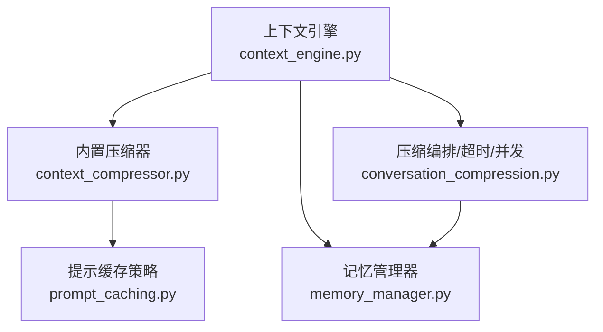
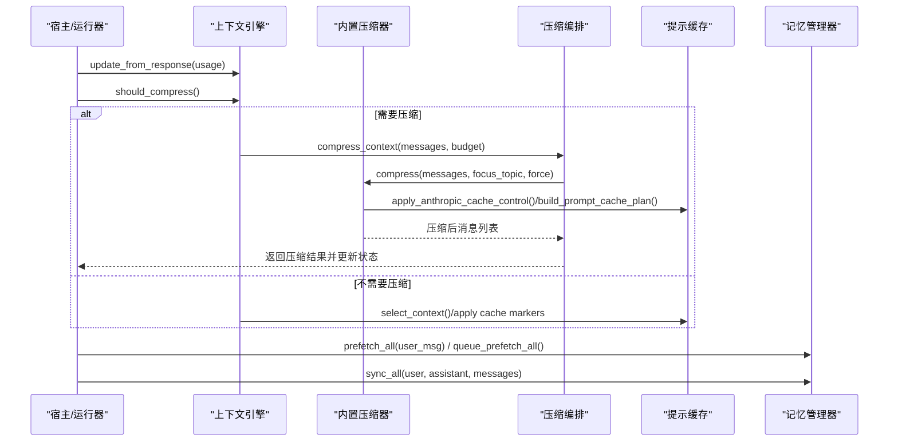
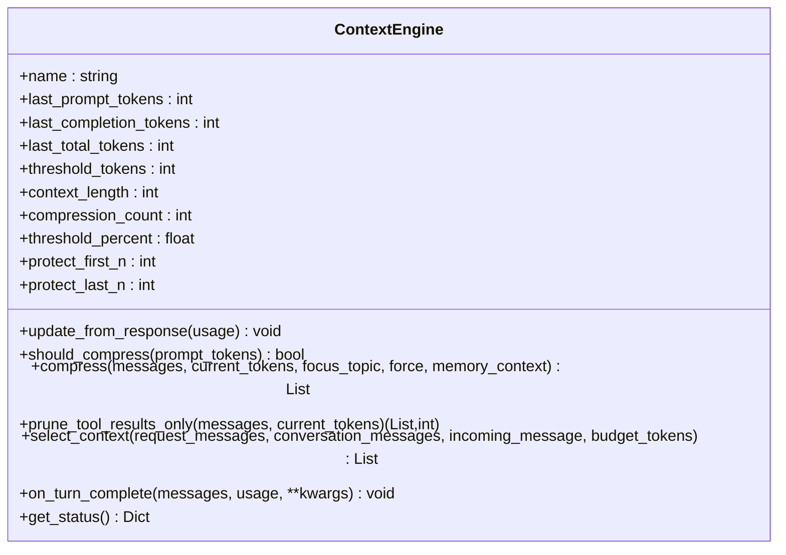
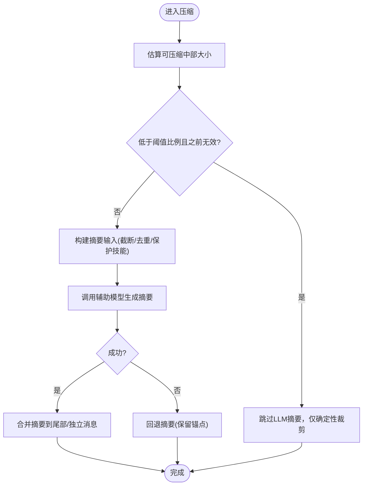
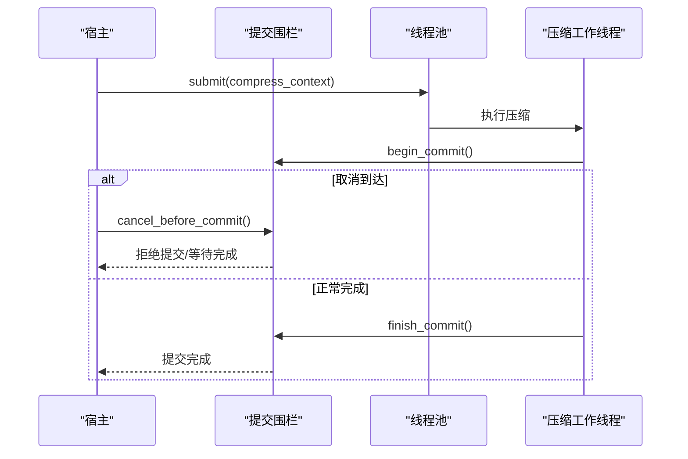
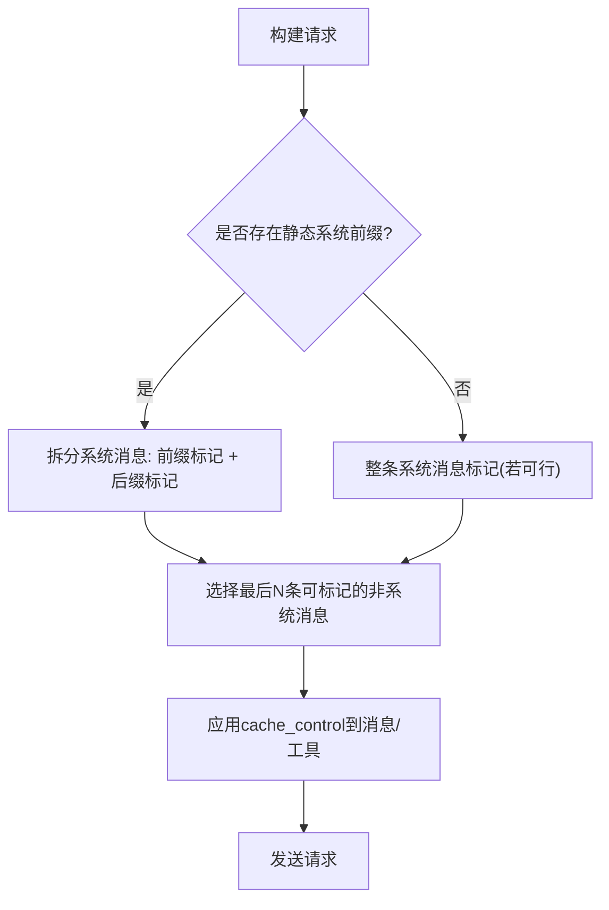
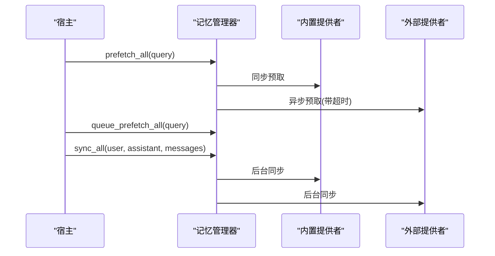
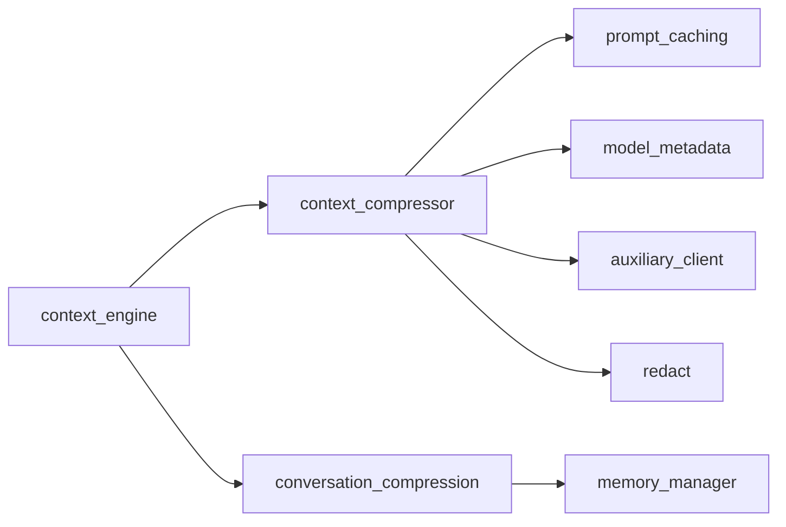

# 上下文性能调优

<cite>
**本文引用的文件**   
- [agent/context_engine.py](file://agent/context_engine.py)
- [agent/context_compressor.py](file://agent/context_compressor.py)
- [agent/conversation_compression.py](file://agent/conversation_compression.py)
- [agent/prompt_caching.py](file://agent/prompt_caching.py)
- [agent/memory_manager.py](file://agent/memory_manager.py)
</cite>

## 目录
1. [简介](#简介)
2. [项目结构](#项目结构)
3. [核心组件](#核心组件)
4. [架构总览](#架构总览)
5. [详细组件分析](#详细组件分析)
6. [依赖关系分析](#依赖关系分析)
7. [性能考量](#性能考量)
8. [故障排查指南](#故障排查指南)
9. [结论](#结论)
10. [附录](#附录)

## 简介
本指南面向生产与研发场景，系统性阐述 Hermes Agent 的“上下文窗口管理”与“上下文性能调优”。内容覆盖：
- 上下文压缩、选择与裁剪策略（分块处理、增量压缩、异步执行）
- 内存分配、垃圾回收与缓冲区优化要点
- 不同模型/提供商的性能特征与适配建议
- 提示缓存、结果缓存、状态缓存机制
- 性能指标定义与采集方法（响应时间、内存使用、压缩效率等）
- 实际测试案例与优化前后对比思路
- 运维调优建议与故障诊断工具
- 开发者性能分析与瓶颈定位指导

## 项目结构
围绕上下文性能的关键模块集中在 agent 目录下：
- context_engine.py：上下文引擎抽象与生命周期钩子，统一触发压缩、选择上下文、会话边界清理
- context_compressor.py：内置压缩器实现，负责摘要生成、工具输出裁剪、技能信息保护、失败回退
- conversation_compression.py：压缩编排与超时控制、提交围栏、线程池与并发限制、状态持久化与恢复
- prompt_caching.py：Anthropic 提示缓存策略，按系统前缀与尾部消息划分缓存段
- memory_manager.py：记忆提供者编排，预取/同步后台化，避免阻塞主流程

**图示来源**
- [agent/context_engine.py:89-130](file://agent/context_engine.py#L89-L130)
- [agent/context_compressor.py:1-17](file://agent/context_compressor.py#L1-L17)
- [agent/conversation_compression.py:1-50](file://agent/conversation_compression.py#L1-L50)
- [agent/prompt_caching.py:1-11](file://agent/prompt_caching.py#L1-L11)
- [agent/memory_manager.py:1-24](file://agent/memory_manager.py#L1-L24)

**章节来源**
- [agent/context_engine.py:89-130](file://agent/context_engine.py#L89-L130)
- [agent/context_compressor.py:1-17](file://agent/context_compressor.py#L1-L17)
- [agent/conversation_compression.py:1-50](file://agent/conversation_compression.py#L1-L50)
- [agent/prompt_caching.py:1-11](file://agent/prompt_caching.py#L1-L11)
- [agent/memory_manager.py:1-24](file://agent/memory_manager.py#L1-L24)

## 核心组件
- 上下文引擎（ContextEngine）
  - 职责：决定何时压缩、如何压缩、是否选择特定上下文、暴露工具、跟踪 token 用量
  - 关键接口：update_from_response、should_compress、compress、select_context、on_turn_complete、get_status
- 内置压缩器（ContextCompressor）
  - 职责：对中间历史进行摘要，保护头尾；工具输出裁剪；技能指令防丢失；失败回退；摘要大小上限
  - 关键常量/策略：摘要比例、最大字符输入、最小摘要 token、微压缩失败保护、压力降级
- 压缩编排（conversation_compression）
  - 职责：封装压缩调用、超时控制、提交围栏、线程池并发限制、状态快照/恢复、持久化冷却
- 提示缓存（prompt_caching）
  - 职责：为 Anthropic 请求构建缓存断点（系统前缀 + 尾部消息），支持工具缓存布局
- 记忆管理器（memory_manager）
  - 职责：多提供者预取/同步，后台串行化，超时保护，避免阻塞主对话流

**章节来源**
- [agent/context_engine.py:89-130](file://agent/context_engine.py#L89-L130)
- [agent/context_compressor.py:100-179](file://agent/context_compressor.py#L100-L179)
- [agent/conversation_compression.py:445-691](file://agent/conversation_compression.py#L445-L691)
- [agent/prompt_caching.py:300-395](file://agent/prompt_caching.py#L300-L395)
- [agent/memory_manager.py:364-401](file://agent/memory_manager.py#L364-L401)

## 架构总览
下图展示一次典型对话中上下文管理的调用链与数据流：从引擎决策到压缩执行、缓存标记、记忆预取与后台同步。

**图示来源**
- [agent/context_engine.py:133-190](file://agent/context_engine.py#L133-L190)
- [agent/conversation_compression.py:776-800](file://agent/conversation_compression.py#L776-L800)
- [agent/context_compressor.py:100-179](file://agent/context_compressor.py#L100-L179)
- [agent/prompt_caching.py:300-395](file://agent/prompt_caching.py#L300-L395)
- [agent/memory_manager.py:525-595](file://agent/memory_manager.py#L525-L595)

## 详细组件分析

### 上下文引擎（ContextEngine）
- 设计要点
  - 统一的压缩触发与上下文选择接口，解耦具体实现
  - 提供 per-turn 观察钩子 on_turn_complete，便于统计与索引
  - 暴露 get_status 供 UI/日志消费，包含 last_prompt_tokens、threshold_tokens、context_length、usage_percent、compression_count
- 性能相关
  - threshold_percent 与 context_length 共同决定阈值，避免频繁压缩
  - protect_first_n/protect_last_n 保护关键头尾，减少无效摘要
  - prune_tool_results_only 低成本裁剪旧工具输出，降低 LLM 调用成本

**图示来源**
- [agent/context_engine.py:89-130](file://agent/context_engine.py#L89-L130)
- [agent/context_engine.py:133-190](file://agent/context_engine.py#L133-L190)
- [agent/context_engine.py:215-279](file://agent/context_engine.py#L215-L279)
- [agent/context_engine.py:281-328](file://agent/context_engine.py#L281-L328)
- [agent/context_engine.py:435-454](file://agent/context_engine.py#L435-L454)

**章节来源**
- [agent/context_engine.py:89-130](file://agent/context_engine.py#L89-L130)
- [agent/context_engine.py:133-190](file://agent/context_engine.py#L133-L190)
- [agent/context_engine.py:215-279](file://agent/context_engine.py#L215-L279)
- [agent/context_engine.py:281-328](file://agent/context_engine.py#L281-L328)
- [agent/context_engine.py:435-454](file://agent/context_engine.py#L435-L454)

### 内置压缩器（ContextCompressor）
- 设计要点
  - 结构化摘要模板，追踪已解决/待解决问题，历史标题替代活跃指令
  - 工具输出裁剪（Phase-1/2/4）与技能指令保护（防止“幽灵技能”）
  - 摘要大小上限与输入字符上限，避免慢后端超时或上下文爆炸
  - 失败回退与冷却期，避免反复失败导致死循环
- 性能相关
  - _SUMMARY_INPUT_MAX_CHARS 限制摘要输入规模，降低辅助模型负载
  - 微压缩失败保护（连续失败计数）避免卡住
  - 压力降级：在受保护区域也裁剪大工具输出，保持最近消息可读

**图示来源**
- [agent/context_compressor.py:417-443](file://agent/context_compressor.py#L417-L443)
- [agent/context_compressor.py:426-430](file://agent/context_compressor.py#L426-L430)
- [agent/context_compressor.py:713-749](file://agent/context_compressor.py#L713-L749)

**章节来源**
- [agent/context_compressor.py:100-179](file://agent/context_compressor.py#L100-L179)
- [agent/context_compressor.py:417-443](file://agent/context_compressor.py#L417-L443)
- [agent/context_compressor.py:713-749](file://agent/context_compressor.py#L713-L749)

### 压缩编排（conversation_compression）
- 设计要点
  - 超时与总上限：idle_timeout_seconds 与 total_ceiling_seconds，保障用户体验
  - 提交围栏（CompressionCommitFence）：确保取消与提交的原子性，避免悬挂写入
  - 线程池并发限制：最多4个压缩任务，避免资源耗尽
  - 状态快照/恢复：记录尝试级状态，失败时回滚，保证一致性
- 性能相关
  - 进度感知：通过 touch_progress 区分慢模型与挂起，避免误杀
  - 提交阶段超时报警：分段等待，避免静默长时间阻塞

**图示来源**
- [agent/conversation_compression.py:445-691](file://agent/conversation_compression.py#L445-L691)
- [agent/conversation_compression.py:776-800](file://agent/conversation_compression.py#L776-L800)

**章节来源**
- [agent/conversation_compression.py:445-691](file://agent/conversation_compression.py#L445-L691)
- [agent/conversation_compression.py:776-800](file://agent/conversation_compression.py#L776-L800)

### 提示缓存（prompt_caching）
- 设计要点
  - 默认4个缓存断点：静态系统前缀、系统提示结束、最后2条非系统消息
  - 无静态前缀时回退为系统+最后3条
  - 工具缓存布局：将预算用于 tools 数组与已完成事务端点
- 性能相关
  - 仅在可承载标记的消息上应用缓存，避免浪费断点
  - 支持 TTL 配置（5m/1h），平衡命中率与新鲜度

**图示来源**
- [agent/prompt_caching.py:104-163](file://agent/prompt_caching.py#L104-L163)
- [agent/prompt_caching.py:300-395](file://agent/prompt_caching.py#L300-L395)

**章节来源**
- [agent/prompt_caching.py:104-163](file://agent/prompt_caching.py#L104-L163)
- [agent/prompt_caching.py:300-395](file://agent/prompt_caching.py#L300-L395)

### 记忆管理器（memory_manager）
- 设计要点
  - 单一外部提供者约束，避免工具 schema 膨胀与冲突
  - 预取/同步后台化：避免阻塞主对话流
  - 外部预取超时保护，防止慢提供者拖垮体验
- 性能相关
  - 单工作线程串行化写操作，保证顺序与一致性
  - 后台任务追踪与优雅关闭，避免进程退出阻塞

**图示来源**
- [agent/memory_manager.py:364-401](file://agent/memory_manager.py#L364-L401)
- [agent/memory_manager.py:525-595](file://agent/memory_manager.py#L525-L595)
- [agent/memory_manager.py:638-695](file://agent/memory_manager.py#L638-L695)

**章节来源**
- [agent/memory_manager.py:364-401](file://agent/memory_manager.py#L364-L401)
- [agent/memory_manager.py:525-595](file://agent/memory_manager.py#L525-L595)
- [agent/memory_manager.py:638-695](file://agent/memory_manager.py#L638-L695)

## 依赖关系分析
- 耦合与内聚
  - context_engine 作为抽象层，提升内聚、降低与具体实现的耦合
  - context_compressor 强依赖 model_metadata、auxiliary_client、redact，聚焦压缩逻辑
  - conversation_compression 协调线程池、围栏、持久化，承担编排职责
  - prompt_caching 纯函数式，低耦合，易测试
  - memory_manager 聚合多个 provider，屏蔽差异
- 潜在循环依赖
  - 当前模块间以单向依赖为主，未见明显循环
- 外部依赖
  - 辅助模型调用（摘要）、数据库持久化（冷却/状态）、线程池/事件循环

**图示来源**
- [agent/context_engine.py:89-130](file://agent/context_engine.py#L89-L130)
- [agent/context_compressor.py:18-45](file://agent/context_compressor.py#L18-L45)
- [agent/conversation_compression.py:54-77](file://agent/conversation_compression.py#L54-L77)
- [agent/prompt_caching.py:13-15](file://agent/prompt_caching.py#L13-L15)
- [agent/memory_manager.py:28-38](file://agent/memory_manager.py#L28-L38)

**章节来源**
- [agent/context_engine.py:89-130](file://agent/context_engine.py#L89-L130)
- [agent/context_compressor.py:18-45](file://agent/context_compressor.py#L18-L45)
- [agent/conversation_compression.py:54-77](file://agent/conversation_compression.py#L54-L77)
- [agent/prompt_caching.py:13-15](file://agent/prompt_caching.py#L13-L15)
- [agent/memory_manager.py:28-38](file://agent/memory_manager.py#L28-L38)

## 性能考量
- 内存分配与 GC
  - 压缩过程中大量消息拷贝与截断，注意浅拷贝与深拷贝的使用位置，避免不必要的大对象复制
  - 摘要输入字符上限（_SUMMARY_INPUT_MAX_CHARS）有效抑制内存峰值
  - 建议监控 Python 堆增长与 GC 次数，结合压测观察峰值
- 缓冲区优化
  - 工具输出裁剪（prune_tool_results_only）显著降低重复传输体积
  - 提示缓存断点合理放置，提高命中率和复用率
- 长对话优化
  - 分块处理：通过 select_context 针对每轮选择合适上下文
  - 增量压缩：滚动摘要与微压缩，避免全量重建
  - 异步操作：压缩编排使用线程池与围栏，避免阻塞主线程
- 不同模型/提供商
  - Anthropic：利用提示缓存与工具缓存布局，最大化缓存命中
  - OpenAI/Gemini/其他：关注工具 schema 与消息格式兼容性，避免额外键导致拒收
  - 小上下文模型：提高阈值下限，避免频繁压缩导致的空转
- 指标定义与采集
  - 响应时间：from should_compress to response 的端到端耗时
  - 内存使用：RSS/Heap 峰值与均值，GC 次数
  - 压缩效率：压缩前后 token/字符数、摘要大小、裁剪条目数
  - 缓存命中率：提示缓存命中/未命中比率
  - 压缩成功率：成功/失败/回退次数
- 实际测试案例与对比思路
  - 构造长对话（含大量工具输出与图片），对比开启/关闭压缩与缓存的延迟、内存、token 消耗
  - 模拟慢/挂起提供者，验证超时与围栏行为
  - 对比不同阈值（threshold_percent）下的压缩频率与效果

[本节为通用指导，不直接分析具体文件]

## 故障排查指南
- 常见问题
  - 压缩卡住：检查提交围栏是否被占用、线程池是否饱和、辅助模型是否超时
  - 摘要失败：查看冷却期与回退路径，确认认证/配额错误分类
  - 提示缓存失效：检查消息结构是否符合可标记条件（非空 content、正确 role）
  - 记忆提供者阻塞：确认外部预取超时设置与后台任务队列
- 诊断步骤
  - 启用日志与状态回调，观察 COMPACTION_STATUS 与 DONE 标志
  - 抓取压缩前后消息长度与 token 估算，定位异常膨胀点
  - 检查 memory_manager 后台任务是否堆积，必要时 flush_pending
  - 使用 get_status 获取 usage_percent 与 compression_count，评估阈值合理性

**章节来源**
- [agent/conversation_compression.py:79-101](file://agent/conversation_compression.py#L79-L101)
- [agent/context_compressor.py:73-95](file://agent/context_compressor.py#L73-L95)
- [agent/prompt_caching.py:72-94](file://agent/prompt_caching.py#L72-L94)
- [agent/memory_manager.py:759-780](file://agent/memory_manager.py#L759-L780)

## 结论
Hermes Agent 的上下文性能调优建立在清晰的抽象（上下文引擎）、稳健的实现（内置压缩器）、可靠的编排（超时/并发/围栏）与高效的缓存（提示/工具）之上。通过合理的阈值配置、异步化与后台化、以及严格的输入/输出裁剪，可在长对话与高并发场景下保持稳定低延迟与可控资源占用。建议结合业务模型与提供商特性，持续观测指标并迭代参数。

[本节为总结，不直接分析具体文件]

## 附录
- 最佳实践清单
  - 根据模型上下文长度调整 threshold_percent，避免过小窗口导致频繁压缩
  - 启用提示缓存并合理设置 TTL，优先标记稳定系统前缀与尾部消息
  - 使用 prune_tool_results_only 定期裁剪旧工具输出，降低冗余
  - 监控压缩成功率与回退次数，及时调优辅助模型与超时
  - 对外部记忆提供者设置合理超时，避免拖垮主流程
- 运维建议
  - 在生产环境开启进度感知超时与总上限，防止长时间阻塞
  - 定期审查压缩日志与状态，识别热点会话与异常模式
  - 对慢/不稳定提供商实施熔断与降级策略
- 开发者指导
  - 扩展上下文引擎时，遵循接口契约，避免破坏缓存稳定性
  - 在压缩路径中避免大对象复制，尽量使用视图/切片
  - 为自定义压缩器添加合适的 has_content_to_compress 与 preflight 判断，减少无效调用

[本节为补充说明，不直接分析具体文件]