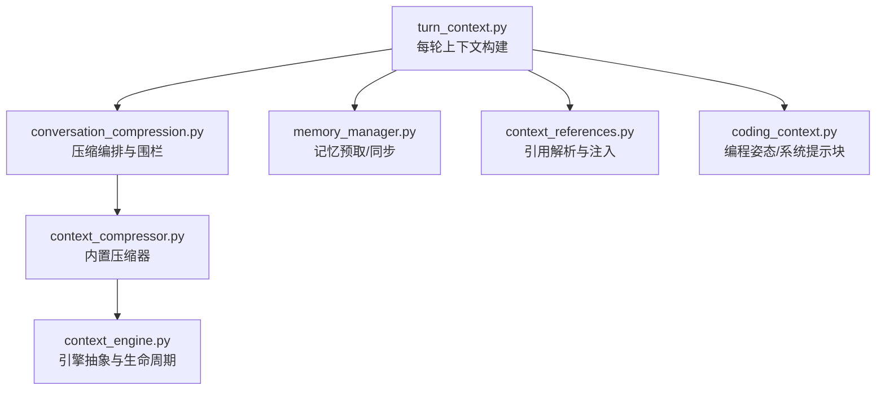
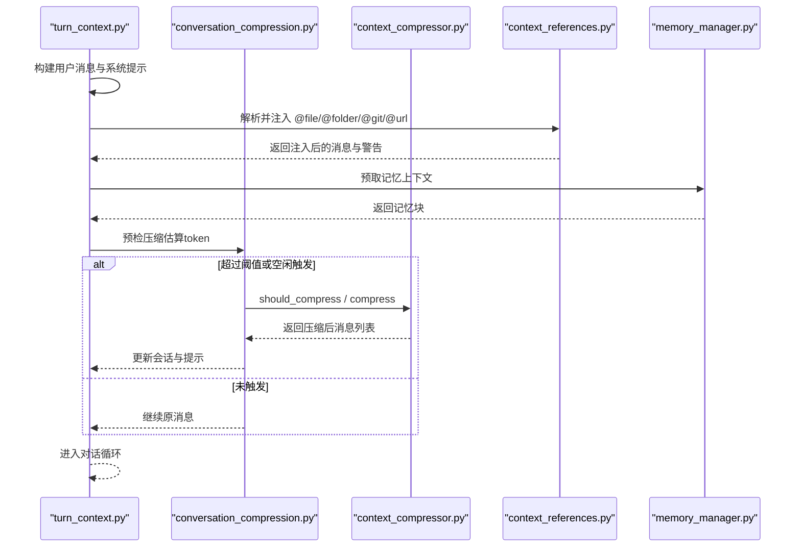
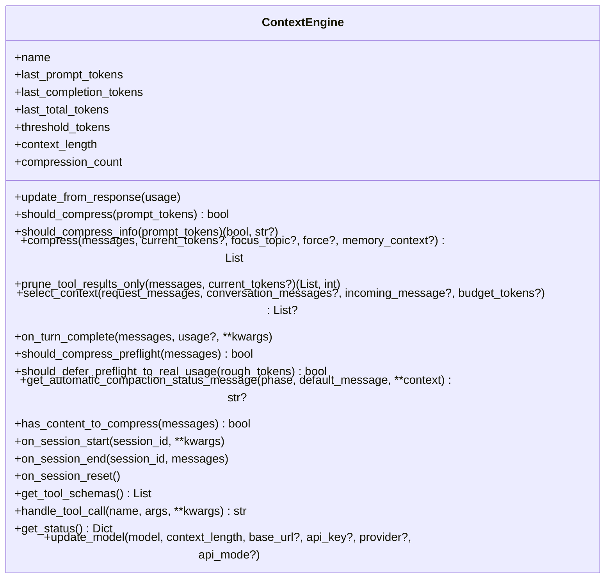
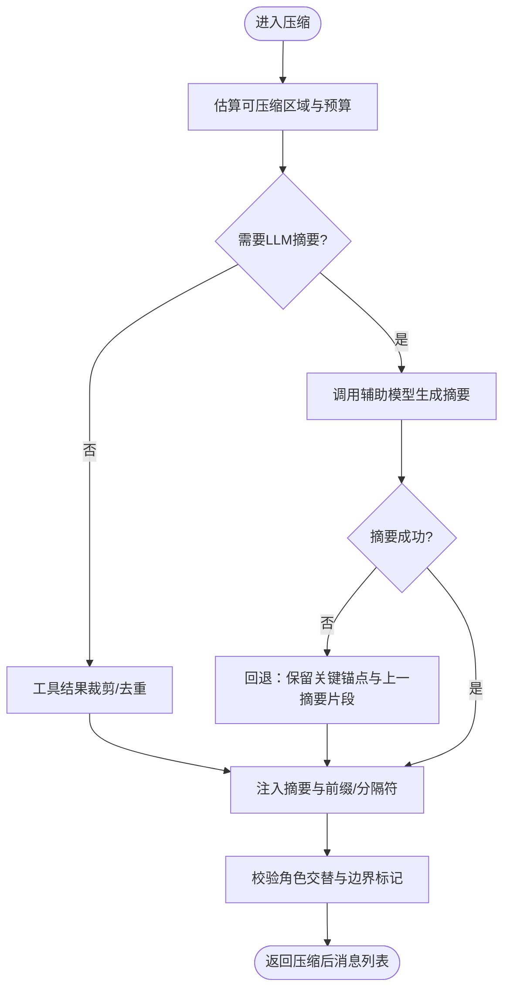
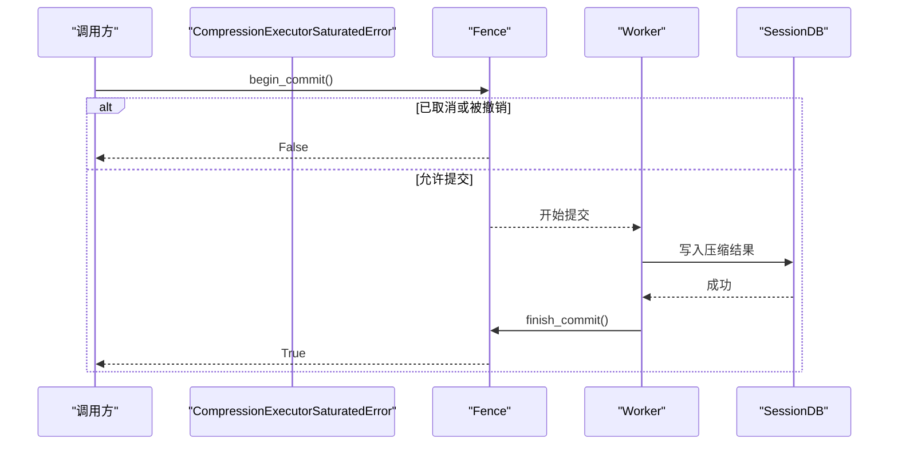
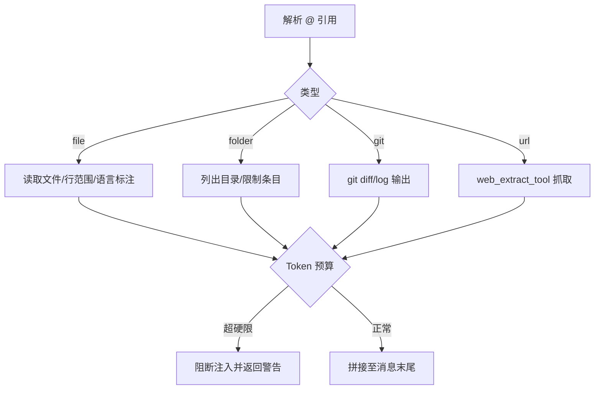
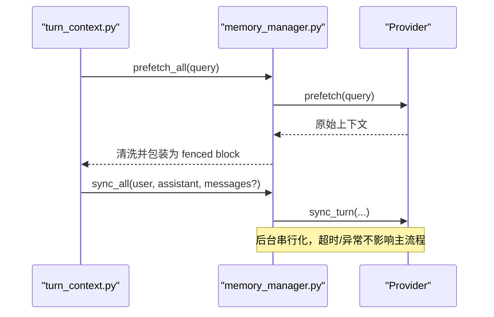
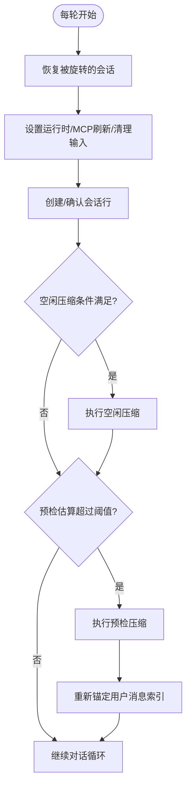
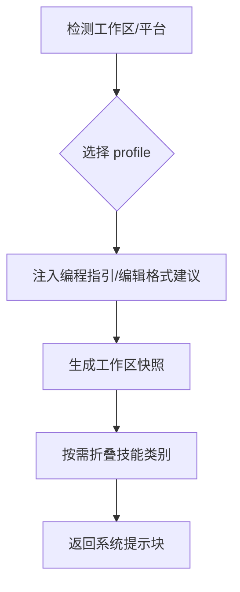
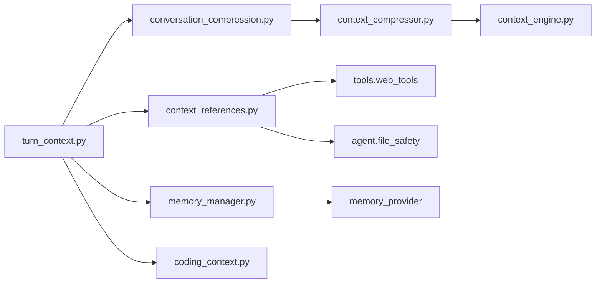

# 上下文管理

<cite>
**本文引用的文件**
- [agent/context_engine.py](file://agent/context_engine.py)
- [agent/context_compressor.py](file://agent/context_compressor.py)
- [agent/conversation_compression.py](file://agent/conversation_compression.py)
- [agent/context_references.py](file://agent/context_references.py)
- [agent/memory_manager.py](file://agent/memory_manager.py)
- [agent/turn_context.py](file://agent/turn_context.py)
- [agent/coding_context.py](file://agent/coding_context.py)
</cite>

## 目录
1. [简介](#简介)
2. [项目结构](#项目结构)
3. [核心组件](#核心组件)
4. [架构总览](#架构总览)
5. [详细组件分析](#详细组件分析)
6. [依赖关系分析](#依赖关系分析)
7. [性能考量](#性能考量)
8. [故障排除指南](#故障排除指南)
9. [结论](#结论)
10. [附录：配置与调优](#附录：配置与调优)

## 简介
本文件系统性阐述 Hermes Agent 的“上下文管理”机制，覆盖上下文引擎抽象、自动压缩策略、引用解析与动态注入、对话历史智能裁剪、关键信息提取与语义相关性评分、上下文窗口与内存优化、长对话处理策略、以及可观测性与排障要点。目标是帮助开发者高效管理上下文，提升 AI 代理响应质量与效率，并为高级用户提供扩展与定制指导。

## 项目结构
围绕上下文管理的核心模块分布如下：
- 上下文引擎抽象与生命周期：定义插件化上下文引擎接口、选择与压缩触发、工具暴露、会话生命周期钩子等。
- 内置上下文压缩器：实现自动摘要、滚动微压缩、工具输出裁剪、技能指令防丢失、失败冷却与回退等。
- 对话压缩编排：负责压缩前检查、超时与并发控制、提交围栏、状态提示、会话旋转与恢复。
- 引用解析与注入：支持 @file:、@folder:、@git:、@url: 等引用语法的安全解析与内容注入，含大小限制与安全白名单。
- 记忆系统编排：统一接入内置与外部记忆提供者，提供预取、同步、系统提示块拼装与流式清理。
- 每轮上下文构建：组装用户消息、系统提示、预检压缩、空闲压缩、索引锚定等。
- 编码上下文模式：在代码工作区启用“编程姿态”，影响系统提示、工具集与技能索引展示。

**图示来源**
- [agent/turn_context.py:343-800](file://agent/turn_context.py#L343-L800)
- [agent/conversation_compression.py:445-800](file://agent/conversation_compression.py#L445-L800)
- [agent/context_compressor.py:1-800](file://agent/context_compressor.py#L1-L800)
- [agent/context_references.py:123-236](file://agent/context_references.py#L123-L236)
- [agent/memory_manager.py:364-800](file://agent/memory_manager.py#L364-L800)
- [agent/coding_context.py:268-615](file://agent/coding_context.py#L268-L615)
- [agent/context_engine.py:89-490](file://agent/context_engine.py#L89-L490)

**章节来源**
- [agent/context_engine.py:89-490](file://agent/context_engine.py#L89-L490)
- [agent/context_compressor.py:1-800](file://agent/context_compressor.py#L1-L800)
- [agent/conversation_compression.py:445-800](file://agent/conversation_compression.py#L445-L800)
- [agent/context_references.py:123-236](file://agent/context_references.py#L123-L236)
- [agent/memory_manager.py:364-800](file://agent/memory_manager.py#L364-L800)
- [agent/turn_context.py:343-800](file://agent/turn_context.py#L343-L800)
- [agent/coding_context.py:268-615](file://agent/coding_context.py#L268-L615)

## 核心组件
- 上下文引擎（ContextEngine）：插件化抽象，定义压缩触发、压缩执行、上下文选择、工具暴露、会话生命周期钩子与模型切换适配。
- 内置上下文压缩器（ContextCompressor）：基于辅助模型的摘要压缩，保护头尾、滚动微压缩、工具结果裁剪、技能指令防丢失、失败冷却与回退。
- 对话压缩编排（Conversation Compression）：压缩前估算、空闲压缩、超时与并发控制、提交围栏、状态提示、会话旋转与恢复。
- 引用解析与注入（Context References）：安全解析并注入文件、文件夹、Git 差异/日志、URL 内容，带 token 预算限制与安全校验。
- 记忆管理器（Memory Manager）：统一接入内置与外部记忆提供者，提供预取、同步、系统提示块拼装与流式清理。
- 每轮上下文构建（Turn Context）：组装用户消息、系统提示、预检压缩、空闲压缩、索引锚定与缓存一致性保障。
- 编码上下文（Coding Context）：在工作区检测并注入编程姿态的系统提示与工具集建议，影响技能索引与操作指引。

**章节来源**
- [agent/context_engine.py:89-490](file://agent/context_engine.py#L89-L490)
- [agent/context_compressor.py:1-800](file://agent/context_compressor.py#L1-L800)
- [agent/conversation_compression.py:445-800](file://agent/conversation_compression.py#L445-L800)
- [agent/context_references.py:123-236](file://agent/context_references.py#L123-L236)
- [agent/memory_manager.py:364-800](file://agent/memory_manager.py#L364-L800)
- [agent/turn_context.py:343-800](file://agent/turn_context.py#L343-L800)
- [agent/coding_context.py:268-615](file://agent/coding_context.py#L268-L615)

## 架构总览
下图展示了从“每轮上下文构建”到“压缩编排”再到“内置压缩器”的调用链，以及与“引用注入”和“记忆预取”的协作关系。

**图示来源**
- [agent/turn_context.py:667-800](file://agent/turn_context.py#L667-L800)
- [agent/conversation_compression.py:445-800](file://agent/conversation_compression.py#L445-L800)
- [agent/context_compressor.py:1-800](file://agent/context_compressor.py#L1-L800)
- [agent/context_references.py:123-236](file://agent/context_references.py#L123-L236)
- [agent/memory_manager.py:525-595](file://agent/memory_manager.py#L525-L595)

## 详细组件分析

### 上下文引擎抽象与生命周期
- 职责：决定何时压缩、如何压缩、是否进行每轮上下文选择、暴露工具、维护 token 使用统计、会话开始/结束/重置钩子。
- 关键接口：
  - update_from_response：更新 token 用量。
  - should_compress / should_compress_info：判断是否需要压缩及原因。
  - compress：对消息列表进行压缩并返回新列表。
  - select_context：为单次请求选择/替换上下文（检索、主题路由、角色/分支切换）。
  - on_turn_complete：观察本轮完成后的消息与用量，用于下一轮选择。
  - get_tool_schemas / handle_tool_call：暴露引擎工具。
  - update_model：模型切换时调整阈值与上下文长度。
- 默认行为：不实现 select_context/on_turn_complete 时为无操作；emit_automatic_compaction_status 控制自动压缩状态可见性。

**图示来源**
- [agent/context_engine.py:89-490](file://agent/context_engine.py#L89-L490)

**章节来源**
- [agent/context_engine.py:89-490](file://agent/context_engine.py#L89-L490)

### 内置上下文压缩器（自动摘要与滚动微压缩）
- 设计要点：
  - 使用辅助模型对中间轮次进行摘要，保护头部与尾部（系统提示与最近消息）。
  - 结构化摘要模板，跟踪问题状态，避免将历史任务误认为当前指令。
  - 工具输出预裁剪（低成本前置阶段），减少 LLM 输入体积。
  - 按比例分配摘要预算，设置绝对上限，防止摘要本身成为压力源。
  - 滚动微压缩与失败冷却，避免频繁无效压缩。
  - 技能指令防丢失：检测即将被丢弃的技能视图，插入重加载标记。
  - 严格脱敏：跨会话持久化的摘要边界强制脱敏敏感文本与 URL 凭据。
- 关键常量与策略：
  - 最小摘要 token、比例、上限。
  - 失败冷却时间、最大连续失败次数。
  - 输入字符上限（防止慢后端超限）。
  - 旧工具结果占位符、最小裁剪字符数。
  - 历史摘要前缀兼容与归一化。
  - 合并尾部时的分隔与边界标记。

**图示来源**
- [agent/context_compressor.py:1-800](file://agent/context_compressor.py#L1-L800)

**章节来源**
- [agent/context_compressor.py:1-800](file://agent/context_compressor.py#L1-L800)

### 对话压缩编排（超时、并发与提交围栏）
- 功能：
  - 压缩前估算与空闲压缩触发。
  - 进度感知超时与总上限，避免长时间阻塞。
  - 共享线程池与准入控制，防止卡住任务堆积。
  - 提交围栏（CompressionCommitFence）确保取消与提交的原子性，避免中途会话写入不一致。
  - 状态提示与重试路径（消息数/token 数变化）。
  - 会话旋转与恢复（压缩后创建子会话并迁移历史）。
- 关键点：
  - 超时回调与冷却行持久化/回滚。
  - 锁释放钩子与持有者资格，避免并发竞争。
  - 进度事件与 overrun 告警。

**图示来源**
- [agent/conversation_compression.py:445-690](file://agent/conversation_compression.py#L445-L690)

**章节来源**
- [agent/conversation_compression.py:445-800](file://agent/conversation_compression.py#L445-L800)

### 引用解析与动态注入（文件、文件夹、Git、URL）
- 解析规则：
  - 支持简单类型（diff/staged）与具名类型（file/folder/git/url）。
  - 文件引用支持行范围与引号包裹路径。
  - 并行展开多个引用，保持顺序一致。
- 安全与预算：
  - 路径解析与白名单校验，拒绝敏感目录与凭据文件。
  - 二进制文件以元数据提示替代内联文本。
  - 注入 token 软/硬限制（25%/50%），超限则阻断并返回警告。
- 外部资源：
  - URL 通过 web_extract_tool 获取 markdown 内容。
  - Git 命令受限超时与错误处理。

**图示来源**
- [agent/context_references.py:123-236](file://agent/context_references.py#L123-L236)
- [agent/context_references.py:239-369](file://agent/context_references.py#L239-L369)
- [agent/context_references.py:372-434](file://agent/context_references.py#L372-L434)

**章节来源**
- [agent/context_references.py:123-236](file://agent/context_references.py#L123-L236)
- [agent/context_references.py:239-369](file://agent/context_references.py#L239-L369)
- [agent/context_references.py:372-434](file://agent/context_references.py#L372-L434)

### 记忆系统编排（预取、同步与流式清理）
- 能力：
  - 注册内置与最多一个外部记忆提供者，统一工具 schema 规范化。
  - 预取：按查询召回相关上下文，包装为 fenced block 注入 API 消息。
  - 同步：后台串行化写入，避免阻塞主流程。
  - 流式清理：StreamingContextScrubber 处理跨分片的 <memory-context> 标签。
- 约束：
  - 外部预取超时控制，避免慢提供者拖垮交互。
  - 工具名称冲突与核心工具保留策略。
  - 关闭期优雅退出与任务放弃报告。

**图示来源**
- [agent/memory_manager.py:525-595](file://agent/memory_manager.py#L525-L595)
- [agent/memory_manager.py:638-695](file://agent/memory_manager.py#L638-L695)
- [agent/memory_manager.py:182-361](file://agent/memory_manager.py#L182-L361)

**章节来源**
- [agent/memory_manager.py:364-800](file://agent/memory_manager.py#L364-L800)

### 每轮上下文构建（预检、空闲压缩与索引锚定）
- 步骤：
  - 恢复被旋转的压缩会话。
  - 设置运行时主模型信息、刷新 MCP 工具。
  - 清理用户输入中的非法字符。
  - 创建数据库会话行（保证外键完整性）。
  - 空闲压缩：基于空闲时长与 token 估算触发。
  - 预检压缩：基于消息数量与粗略 token 估算决定是否压缩。
  - 重新锚定当前用户消息索引（压缩后列表重建）。
- 目标：
  - 保证 prompt 缓存稳定（api_content sidecar 与重写路径一致）。
  - 避免大消息绕过计数门限导致的溢出。
  - 在压缩后正确定位用户消息以便后续注入与持久化。

**图示来源**
- [agent/turn_context.py:667-800](file://agent/turn_context.py#L667-L800)

**章节来源**
- [agent/turn_context.py:343-800](file://agent/turn_context.py#L343-L800)

### 编码上下文（编程姿态）
- 作用：在代码工作区启用“编程姿态”，注入操作指引、工作区快照与编辑格式建议，影响工具集与技能索引展示。
- 检测：基于项目标志文件、源码扩展、git 仓库与交互式平台。
- 输出：系统提示前缀、工作区快照、操作指令；可选地折叠非编程技能类别。

**图示来源**
- [agent/coding_context.py:268-615](file://agent/coding_context.py#L268-L615)

**章节来源**
- [agent/coding_context.py:268-615](file://agent/coding_context.py#L268-L615)

## 依赖关系分析
- turn_context 依赖 conversation_compression、context_engine、memory_manager、model_metadata 等。
- conversation_compression 依赖 context_compressor、context_engine、session_activity 等。
- context_compressor 依赖 auxiliary_client、error_classifier、model_metadata、redact、turn_context 等。
- context_references 依赖 model_metadata、hermes_cli、tools.web_tools、agent.file_safety。
- memory_manager 依赖 memory_provider、skill_commands、tools.registry。
- coding_context 依赖 hermes_cli、bounded_git_probe。

**图示来源**
- [agent/turn_context.py:343-800](file://agent/turn_context.py#L343-L800)
- [agent/conversation_compression.py:445-800](file://agent/conversation_compression.py#L445-L800)
- [agent/context_compressor.py:1-800](file://agent/context_compressor.py#L1-L800)
- [agent/context_references.py:123-236](file://agent/context_references.py#L123-L236)
- [agent/memory_manager.py:364-800](file://agent/memory_manager.py#L364-L800)
- [agent/coding_context.py:268-615](file://agent/coding_context.py#L268-L615)
- [agent/context_engine.py:89-490](file://agent/context_engine.py#L89-L490)

**章节来源**
- [agent/turn_context.py:343-800](file://agent/turn_context.py#L343-L800)
- [agent/conversation_compression.py:445-800](file://agent/conversation_compression.py#L445-L800)
- [agent/context_compressor.py:1-800](file://agent/context_compressor.py#L1-L800)
- [agent/context_references.py:123-236](file://agent/context_references.py#L123-L236)
- [agent/memory_manager.py:364-800](file://agent/memory_manager.py#L364-L800)
- [agent/coding_context.py:268-615](file://agent/coding_context.py#L268-L615)
- [agent/context_engine.py:89-490](file://agent/context_engine.py#L89-L490)

## 性能考量
- 估算与门限：
  - 使用粗略 token 估算与字符估计快速决策是否进入昂贵路径。
  - 小上下文窗口模型的下限阈值调整，避免频繁压缩导致空转。
- 并发与超时：
  - 共享线程池与准入控制，防止卡住任务堆积。
  - 进度感知超时与总上限，避免长时间阻塞。
- 内存与 I/O：
  - 工具结果裁剪与二进制文件提示，减少不必要的大对象。
  - 并行展开引用，降低网络/磁盘 I/O 延迟。
- 缓存稳定性：
  - api_content sidecar 与重写路径保持一致，维持 prompt 缓存命中。
  - 系统提示与快照仅在必要时重建，避免缓存失效。

[本节为通用性能讨论，无需特定文件分析]

## 故障排除指南
- 压缩被阻止：
  - 检查压缩失败冷却与反抖动保护，查看是否处于冷却期内。
  - 关注“上下文超过阈值但压缩被阻止”的提示，必要时手动触发 /compress。
- 注入被阻断：
  - 检查 @ 引用 token 预算是否超过硬限（50%），或路径是否在敏感白名单之外。
  - 查看警告信息中关于路径不可用、二进制文件或网络抓取失败的说明。
- 记忆提供者超时：
  - 外部预取超时会被跳过，检查提供者健康与网络状况。
  - 后台同步失败会记录日志，不影响主流程。
- 会话旋转与恢复：
  - 若出现会话不一致，检查压缩编排的提交围栏与锁释放钩子是否正常。
  - 关注恢复逻辑是否正确迁移历史与系统提示。

**章节来源**
- [agent/conversation_compression.py:125-180](file://agent/conversation_compression.py#L125-L180)
- [agent/context_references.py:196-236](file://agent/context_references.py#L196-L236)
- [agent/memory_manager.py:547-595](file://agent/memory_manager.py#L547-L595)
- [agent/turn_context.py:667-800](file://agent/turn_context.py#L667-L800)

## 结论
Hermes 的上下文管理通过插件化引擎、智能压缩、安全引用注入与记忆编排，实现了在高负载长对话场景下的稳定与高效。其设计强调：
- 明确的触发与回退策略，避免过度压缩与无效循环。
- 严格的安全与预算控制，防止敏感信息与超大上下文泄露。
- 强一致的缓存与持久化契约，保障多端体验与可观测性。
- 可扩展的引擎与提供者接口，便于定制与集成。

[本节为总结性内容，无需特定文件分析]

## 附录：配置与调优
- 上下文引擎选择：
  - 通过配置指定引擎（如内置压缩器或第三方引擎），仅激活一个。
  - 引擎参数包括阈值百分比、保护首尾消息数、是否显示自动压缩状态等。
- 压缩策略：
  - 调整阈值百分比与上下文长度，匹配不同模型窗口。
  - 启用空闲压缩以减少长空闲后的首次调用成本。
  - 监控摘要失败冷却与回退路径，避免频繁失败。
- 引用注入：
  - 合理控制 @ 引用内容与大小，避免超过软/硬限。
  - 使用行范围与引号包裹精确注入，减少无关内容。
- 记忆系统：
  - 配置外部提供者超时与后台同步策略，避免阻塞。
  - 使用 fenced block 与流式清理，确保 UI 与 API 一致性。
- 编码上下文：
  - 在工作区启用编程姿态，获得更精准的操作指引与工具集。
  - 在 focus 模式下折叠非编程技能类别，减少噪声。

**章节来源**
- [agent/context_engine.py:121-129](file://agent/context_engine.py#L121-L129)
- [agent/context_compressor.py:417-443](file://agent/context_compressor.py#L417-L443)
- [agent/conversation_compression.py:693-800](file://agent/conversation_compression.py#L693-L800)
- [agent/context_references.py:196-236](file://agent/context_references.py#L196-L236)
- [agent/memory_manager.py:371-383](file://agent/memory_manager.py#L371-L383)
- [agent/coding_context.py:336-353](file://agent/coding_context.py#L336-L353)