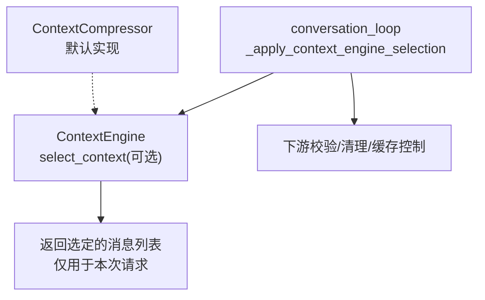
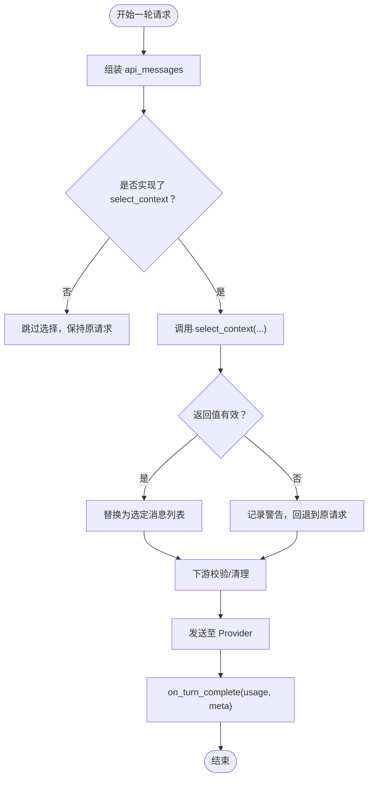
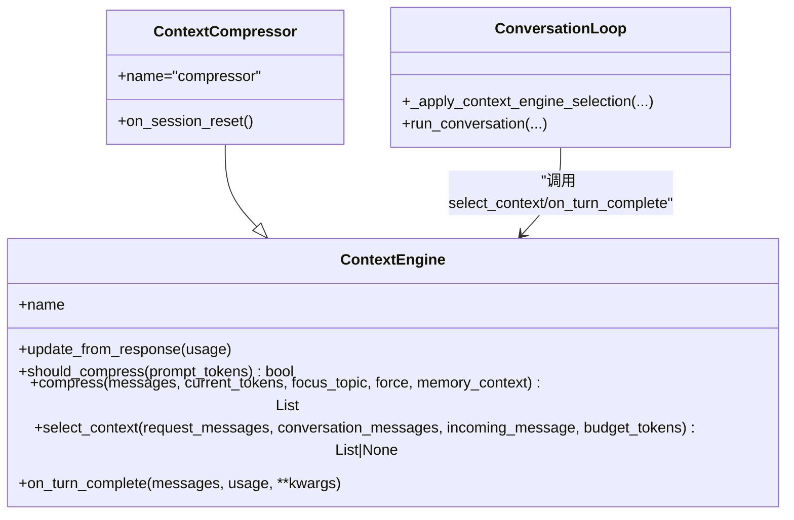

# 上下文选择算法

<cite>
**本文引用的文件**
- [agent/context_engine.py](file://agent/context_engine.py)
- [agent/conversation_loop.py](file://agent/conversation_loop.py)
- [agent/context_compressor.py](file://agent/context_compressor.py)
- [tests/agent/test_context_engine_select_context.py](file://tests/agent/test_context_engine_select_context.py)
</cite>

## 目录
1. [简介](#简介)
2. [项目结构](#项目结构)
3. [核心组件](#核心组件)
4. [架构总览](#架构总览)
5. [详细组件分析](#详细组件分析)
6. [依赖关系分析](#依赖关系分析)
7. [性能考量](#性能考量)
8. [故障排除指南](#故障排除指南)
9. [结论](#结论)
10. [附录：配置与监控](#附录：配置与监控)

## 简介
本文件围绕“每轮请求的上下文选择”展开，聚焦 ContextEngine.select_context() 的设计、调用时机、安全契约与扩展点。它解释：
- 每轮请求如何在不改变持久化历史的前提下，为本次 API 调用选择或替换上下文（检索增强、主题路由、角色/分支切换）。
- 触发条件、优先级排序与缓存稳定性保障。
- 不同场景下的策略建议（新会话初始化、长对话处理、多主题切换）。
- 与压缩机制的边界：select_context 是“选择/路由”，compress 是“压缩/缩短”。
- 自定义实现的最佳实践、异常处理与可观测性。

## 项目结构
与上下文选择直接相关的代码集中在 agent 层：
- 抽象接口与默认行为：ContextEngine（定义 select_context、on_turn_complete 等）
- 调用入口：conversation_loop._apply_context_engine_selection（每轮请求前调用）
- 默认引擎：ContextCompressor（内置压缩器，继承 ContextEngine，默认不重写 select_context）
- 测试契约：test_context_engine_select_context（验证 fail-open、不可变历史、空列表保护等）



图表来源
- [agent/conversation_loop.py:1235-1317](file://agent/conversation_loop.py#L1235-L1317)
- [agent/context_engine.py:215-279](file://agent/context_engine.py#L215-L279)
- [agent/context_compressor.py:1447-1460](file://agent/context_compressor.py#L1447-L1460)

章节来源
- [agent/context_engine.py:1-490](file://agent/context_engine.py#L1-L490)
- [agent/conversation_loop.py:1235-1317](file://agent/conversation_loop.py#L1235-L1317)
- [agent/context_compressor.py:1447-1460](file://agent/context_compressor.py#L1447-L1460)
- [tests/agent/test_context_engine_select_context.py:1-254](file://tests/agent/test_context_engine_select_context.py#L1-L254)

## 核心组件
- ContextEngine（抽象基类）
  - 提供 per-turn 的 select_context(request_messages, conversation_messages, incoming_message, budget_tokens) 钩子，默认返回 None（无操作）。
  - 提供 on_turn_complete(messages, usage, **kwargs) 观察钩子，用于在回合结束后索引/总结/更新路由状态，供下一次 select_context 使用。
  - 维护 token 统计、阈值、上下文长度等元数据，便于选择时做预算判断。
- conversation_loop._apply_context_engine_selection
  - 每轮请求组装完成后、进入 provider 之前调用。
  - 若未实现 select_context 或命中基类默认实现，则短路跳过，零开销。
  - 传入浅拷贝的 conversation_messages/incoming_message，确保引擎无法污染持久历史。
  - 严格校验返回值：必须是非空的消息列表且每个元素为 dict；否则回退到原始请求（fail-open）。
- ContextCompressor（默认引擎）
  - 专注压缩（should_compress/compress），默认不实现 select_context，因此不会干扰默认路径。
  - 通过 on_turn_complete 可在回合结束后更新内部状态（如摘要、微压缩标记等），间接影响后续选择。

章节来源
- [agent/context_engine.py:89-329](file://agent/context_engine.py#L89-L329)
- [agent/conversation_loop.py:1235-1317](file://agent/conversation_loop.py#L1235-L1317)
- [agent/context_compressor.py:1447-1460](file://agent/context_compressor.py#L1447-L1460)

## 架构总览
下图展示单轮请求中上下文选择的完整时序，包括前置准备、选择钩子、下游校验与后置观察。

```mermaid
sequenceDiagram
participant Loop as "conversation_loop"
participant Sel as "_apply_context_engine_selection"
participant Eng as "ContextEngine.select_context"
participant San as "下游校验/清理"
participant Obs as "on_turn_complete"
Loop->>Loop : 组装 api_messages系统提示+历史+本轮用户消息
Loop->>Sel : 传入 request_messages / conversation_messages / incoming_message
Sel->>Eng : select_context(...)
alt 引擎返回有效列表
Sel-->>Loop : 返回选定消息列表
else 返回None/无效
Sel-->>Loop : 保持原始请求
end
Loop->>San : 角色/工具/空白等规范化
San-->>Loop : 发送请求至Provider
Loop->>Obs : 回合结束通知含usage
```

图表来源
- [agent/conversation_loop.py:1928-1946](file://agent/conversation_loop.py#L1928-L1946)
- [agent/conversation_loop.py:1235-1317](file://agent/conversation_loop.py#L1235-L1317)
- [agent/context_engine.py:215-329](file://agent/context_engine.py#L215-L329)

## 详细组件分析

### 上下文选择接口与语义
- 输入
  - request_messages：已组装的请求消息序列（OpenAI 格式），包含系统提示、历史与本轮用户消息。
  - conversation_messages：持久化历史（只读浅拷贝），不得修改。
  - incoming_message：本轮用户消息（只读浅拷贝），不得修改。
  - budget_tokens：当前模型上下文长度（可能为 0）。
- 输出
  - 返回新的消息列表（仅对当次请求生效），或 None（保持原样）。
  - 空列表会被视为无效并回退到原始请求，避免破坏下游校验。
- 约束
  - 不改变持久化历史。
  - 不影响 prompt 缓存键的稳定性：默认 no-op 保证字节级一致；若替换消息列表，将重新计算缓存断点。
  - 失败开放：任何异常都会记录警告并回退到原始请求。

章节来源
- [agent/context_engine.py:215-279](file://agent/context_engine.py#L215-L279)
- [agent/conversation_loop.py:1235-1317](file://agent/conversation_loop.py#L1235-L1317)
- [tests/agent/test_context_engine_select_context.py:72-135](file://tests/agent/test_context_engine_select_context.py#L72-L135)

### 调用时机与执行流
- 调用位置：每轮请求构建完成后、进入 Provider 之前。
- 短路优化：若引擎未实现 select_context 或仍为基类默认实现，则不调用，避免额外开销。
- 参数隔离：传入 conversation_messages/incoming_message 的浅拷贝，防止引擎误改历史。
- 结果校验：仅接受非空的消息列表（元素均为 dict），否则回退。
- 后置观察：回合结束后调用 on_turn_complete，携带最终消息快照与 usage，供引擎更新索引/路由/主题状态。



图表来源
- [agent/conversation_loop.py:1928-1946](file://agent/conversation_loop.py#L1928-L1946)
- [agent/conversation_loop.py:1235-1317](file://agent/conversation_loop.py#L1235-L1317)
- [agent/context_engine.py:281-329](file://agent/context_engine.py#L281-L329)

### 与压缩机制的关系
- 职责分离
  - compress：当上下文过长时进行压缩（摘要/DAG/裁剪），目标是“缩短”。
  - select_context：针对本轮请求决定“使用哪段上下文”，目标是“选择/路由”。
- 互不影响
  - 即使 should_compress 为 False，select_context 仍会执行（如果实现）。
  - 默认 ContextCompressor 不实现 select_context，因此不会改变默认路径。
- 协作方式
  - 引擎可通过 on_turn_complete 在回合后更新索引/主题/角色状态，从而影响下一轮的 select_context。

章节来源
- [agent/context_engine.py:215-279](file://agent/context_engine.py#L215-L279)
- [agent/context_compressor.py:1447-1460](file://agent/context_compressor.py#L1447-L1460)

### 触发条件与优先级排序
- 触发条件
  - 每轮请求均会尝试调用 select_context（若实现）。
  - 若引擎未实现或仍为基类默认实现，则短路跳过。
- 优先级
  - 选择逻辑由引擎自行实现；宿主侧只做最小必要校验与 fail-open。
  - 典型优先级建议（由引擎内部决策）：
    1) 显式指令（如 /topic、/role 切换）最高优先
    2) 会话内主题/角色状态（基于 on_turn_complete 累积）
    3) 语义相关性评分（检索增强）
    4) 预算约束（budget_tokens）与尾部保护
- 缓存稳定性
  - 默认 no-op 保证请求字节不变，从而维持 prompt 缓存命中。
  - 若替换消息列表，缓存断点会基于新列表重新计算。

章节来源
- [agent/conversation_loop.py:1235-1317](file://agent/conversation_loop.py#L1235-L1317)
- [agent/context_engine.py:215-279](file://agent/context_engine.py#L215-L279)

### 不同场景下的策略建议
- 新会话初始化
  - 目标：注入系统提示、初始角色/主题、必要的背景信息。
  - 策略：select_context 可保留 request_messages 中的系统提示，并在首轮追加轻量引导；on_turn_complete 记录初始主题。
- 长对话处理
  - 目标：避免无关历史干扰，聚焦当前任务。
  - 策略：基于 on_turn_complete 维护主题/角色状态；select_context 按主题窗口裁剪历史，保留最近 N 条关键消息与摘要。
- 多主题切换
  - 目标：快速从主题 A 切换到主题 B，减少上下文污染。
  - 策略：在 on_turn_complete 中更新主题指针；select_context 根据主题指针选择对应片段，必要时插入“上下文切换”提示。
- 角色/分支切换
  - 目标：在不同角色（如编码助手 vs 通用助手）间切换。
  - 策略：通过主题/角色标签驱动选择；必要时替换系统提示以适配角色。

[本节为概念性指导，不直接分析具体文件]

### 自定义实现示例（思路与要点）
- 基本步骤
  - 继承 ContextEngine，实现 name、update_from_response、should_compress、compress。
  - 可选实现 select_context：读取 request_messages、conversation_messages、incoming_message、budget_tokens，返回新的消息列表或 None。
  - 可选实现 on_turn_complete：消费 usage 与消息快照，更新索引/主题/角色状态。
- 关键约束
  - 不要修改 conversation_messages 与 incoming_message（宿主已提供浅拷贝，但仍需遵守只读约定）。
  - 返回空列表将被视为无效并回退；务必保证返回非空列表或 None。
  - 注意 budget_tokens 与尾部保护，避免超出模型上下文。
- 参考测试用例
  - 验证 base no-op 短路、空列表保护、历史不可变、下游校验顺序等。

章节来源
- [tests/agent/test_context_engine_select_context.py:72-222](file://tests/agent/test_context_engine_select_context.py#L72-L222)
- [agent/context_engine.py:215-329](file://agent/context_engine.py#L215-L329)

### 边缘情况与异常处理
- 引擎未实现 select_context：宿主短路跳过，零开销。
- 引擎抛出异常：记录警告并回退到原始请求（fail-open）。
- 返回空列表：记录警告并回退到原始请求。
- 返回类型错误：记录警告并回退到原始请求。
- 下游校验：角色/工具/空白等规范化在 select_context 之后执行，确保即使引擎返回非常规结构也能被修复。

章节来源
- [agent/conversation_loop.py:1235-1317](file://agent/conversation_loop.py#L1235-L1317)
- [tests/agent/test_context_engine_select_context.py:114-222](file://tests/agent/test_context_engine_select_context.py#L114-L222)

## 依赖关系分析
- conversation_loop 依赖 ContextEngine 接口，但不强依赖具体实现。
- ContextCompressor 作为默认实现，不覆盖 select_context，保持默认路径稳定。
- 测试用例锁定宿主侧契约（fail-open、不可变历史、空列表保护）。



图表来源
- [agent/context_engine.py:89-329](file://agent/context_engine.py#L89-L329)
- [agent/context_compressor.py:1447-1460](file://agent/context_compressor.py#L1447-L1460)
- [agent/conversation_loop.py:1235-1317](file://agent/conversation_loop.py#L1235-L1317)

章节来源
- [agent/context_engine.py:89-329](file://agent/context_engine.py#L89-L329)
- [agent/context_compressor.py:1447-1460](file://agent/context_compressor.py#L1447-L1460)
- [agent/conversation_loop.py:1235-1317](file://agent/conversation_loop.py#L1235-L1317)

## 性能考量
- 短路优化：未实现或基类默认实现时不调用 select_context，避免复制与调用开销。
- 浅拷贝隔离：仅对 conversation_messages/incoming_message 做浅拷贝，降低内存压力。
- 预算感知：budget_tokens 可用于限制选择范围，避免过大上下文导致超时或费用上升。
- 压缩协同：select_context 负责选择，compress 负责压缩；两者解耦，避免重复工作。
- 缓存友好：默认 no-op 保持请求字节不变，最大化 prompt 缓存命中。

[本节提供一般性指导，不直接分析具体文件]

## 故障排除指南
- 症状：每次请求都走选择逻辑但无效果
  - 检查是否实现了 select_context；若仍为基类默认实现，宿主会短路跳过。
- 症状：返回空列表导致请求异常
  - 宿主会记录警告并回退到原始请求；请确保返回非空列表或 None。
- 症状：历史被意外修改
  - 确认未修改 conversation_messages/incoming_message；宿主仅提供浅拷贝，仍需遵守只读约定。
- 症状：下游校验失败
  - 宿主会在选择后进行角色/工具/空白等规范化；若仍失败，检查返回消息结构是否符合 OpenAI 格式。
- 症状：缓存命中率下降
  - 若替换了消息列表，缓存断点会重新计算；尽量保持稳定的系统提示与前缀。

章节来源
- [agent/conversation_loop.py:1235-1317](file://agent/conversation_loop.py#L1235-L1317)
- [tests/agent/test_context_engine_select_context.py:114-222](file://tests/agent/test_context_engine_select_context.py#L114-L222)

## 结论
- select_context 提供了每轮请求级别的上下文选择/路由能力，与压缩机制解耦。
- 宿主侧保证 fail-open、不可变历史、空列表保护与下游校验，确保健壮性与兼容性。
- 通过 on_turn_complete 可实现主题/角色/检索状态的增量维护，支撑复杂场景（长对话、多主题、角色切换）。
- 默认 ContextCompressor 不覆盖 select_context，保持默认路径稳定与高性能。

[本节为总结性内容，不直接分析具体文件]

## 附录：配置与监控
- 配置项（与上下文选择相关）
  - context.engine：选择启用的上下文引擎（默认 compressor）。
  - 模型阈值与上下文长度：影响 budget_tokens 与压缩阈值，间接影响选择策略。
- 监控指标（来自 ContextEngine.get_status 与压缩遥测）
  - last_prompt_tokens、threshold_tokens、context_length、usage_percent、compression_count。
  - 压缩尝试的辅助模型调用时长、上下文占用、失败原因等（用于定位选择/压缩瓶颈）。
- 最佳实践
  - 在 on_turn_complete 中维护轻量索引/主题/角色状态，避免在 select_context 中进行昂贵计算。
  - 结合 budget_tokens 与尾部保护，确保选择后的上下文始终可被 Provider 接受。
  - 通过日志与遥测观察选择结果与缓存命中变化，持续调优。

章节来源
- [agent/context_engine.py:435-454](file://agent/context_engine.py#L435-L454)
- [agent/context_compressor.py:1506-1599](file://agent/context_compressor.py#L1506-L1599)